# Page: Overview

# Overview

<details>
<summary>Relevant source files</summary>

The following files were used as context for generating this wiki page:

- [.github/CONTRIBUTING.md](.github/CONTRIBUTING.md)
- [.gitignore](.gitignore)
- [README.md](README.md)
- [package.json](package.json)
- [pnpm-lock.yaml](pnpm-lock.yaml)
- [public/favicon.png](public/favicon.png)
- [public/logo.svg](public/logo.svg)
- [src/App.tsx](src/App.tsx)
- [src/index.tsx](src/index.tsx)
- [src/modules/editor/index.tsx](src/modules/editor/index.tsx)
- [src/modules/editor/test-tab.tsx](src/modules/editor/test-tab.tsx)
- [src/modules/home/index.tsx](src/modules/home/index.tsx)
- [src/parser/dict.ts](src/parser/dict.ts)

</details>


Regex-Vis is an interactive web application for visualizing, editing, and testing regular expressions. This page provides a high-level overview of the system architecture, core components, and how they interact within the codebase.

For detailed information about specific subsystems, see the corresponding wiki pages:
- For parser details, see [Parser System](#2)
- For visualization implementation, see [Visualization System](#3)
- For editor functionality, see [Editor System](#4)
- For the testing component, see [Testing Tab](#4.2)

## Purpose and Key Features

Regex-Vis helps users understand and work with regular expressions through:

1. Visual representation of regex patterns as interactive graphs
2. Intuitive editing of regex components through a visual interface
3. Testing functionality to validate regex against sample inputs
4. Internationalization support for multiple languages

Sources: [README.md:8-15](), [src/App.tsx:7-19]()

## System Architecture

The application is built around several core systems that work together to provide a seamless experience.

### High-Level Architecture

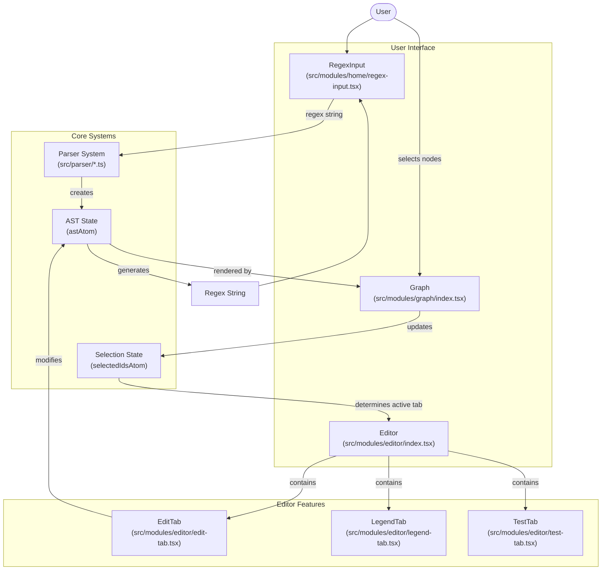
```mermaid
flowchart TD
    subgraph "User Interface"
        RegexInput["RegexInput\n(src/modules/home/regex-input.tsx)"]
        Graph["Graph\n(src/modules/graph/index.tsx)"]
        Editor["Editor\n(src/modules/editor/index.tsx)"]
    end

    subgraph "Core Systems"
        Parser["Parser System\n(src/parser/*.ts)"]
        AST["AST State\n(astAtom)"]
        Selection["Selection State\n(selectedIdsAtom)"]
    end

    subgraph "Editor Features"
        EditTab["EditTab\n(src/modules/editor/edit-tab.tsx)"]
        LegendTab["LegendTab\n(src/modules/editor/legend-tab.tsx)"]
        TestTab["TestTab\n(src/modules/editor/test-tab.tsx)"]
    end

    User(["User"]) --> RegexInput
    RegexInput --> |"regex string"| Parser
    Parser --> |"creates"| AST
    AST --> |"rendered by"| Graph
    User --> |"selects nodes"| Graph
    Graph --> |"updates"| Selection
    Selection --> |"determines active tab"| Editor
    Editor --> |"contains"| EditTab
    Editor --> |"contains"| LegendTab
    Editor --> |"contains"| TestTab
    EditTab --> |"modifies"| AST
    AST --> |"generates"| RegexOutput["Regex String"]
    RegexOutput --> RegexInput
```

Sources: [src/modules/home/index.tsx:31-173](), [src/modules/editor/index.tsx:26-128](), [src/index.tsx:1-19]()

## Core Data Flow

The application follows a circular data flow pattern where user inputs are transformed, visualized, and can be modified:

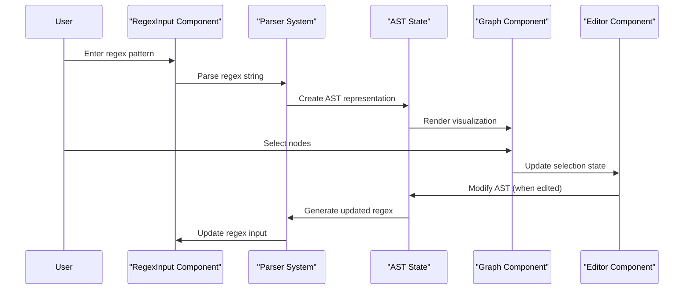
```mermaid
sequenceDiagram
    participant User
    participant Input as "RegexInput Component"
    participant Parser as "Parser System"
    participant AST as "AST State"
    participant Graph as "Graph Component"
    participant Editor as "Editor Component"
    
    User->>Input: Enter regex pattern
    Input->>Parser: Parse regex string
    Parser->>AST: Create AST representation
    AST->>Graph: Render visualization
    User->>Graph: Select nodes
    Graph->>Editor: Update selection state
    Editor->>AST: Modify AST (when edited)
    AST->>Parser: Generate updated regex
    Parser->>Input: Update regex input
```

Sources: [src/modules/home/index.tsx:75-115]()

## Key Components and Subsystems

### Parser System

The Parser System converts regex strings into Abstract Syntax Trees (AST) and back. This is the foundation that enables visual editing and representation.

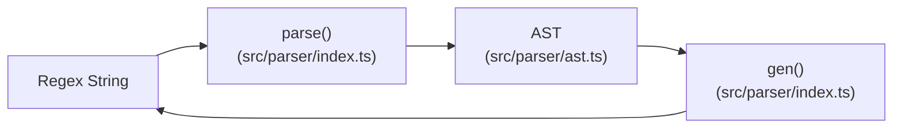
```mermaid
flowchart LR
    RegexString["Regex String"] --> Parser["parse()\n(src/parser/index.ts)"]
    Parser --> AST["AST\n(src/parser/ast.ts)"]
    AST --> Generator["gen()\n(src/parser/index.ts)"]
    Generator --> RegexString
```

Sources: [src/modules/home/index.tsx:80-94](), [src/parser/dict.ts:1-21]()

### Visualization System

The Visualization System renders the AST as an interactive graph where users can select nodes for editing.

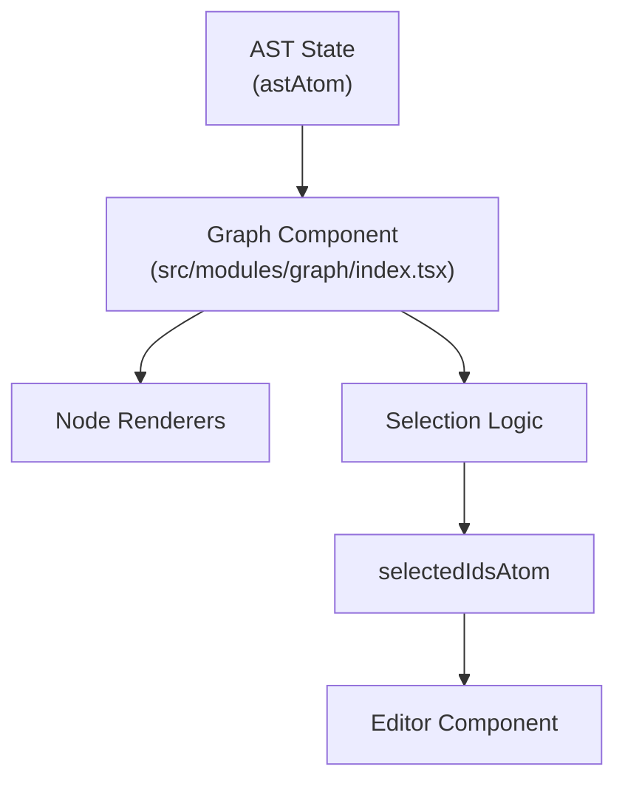
```mermaid
flowchart TD
    AST["AST State\n(astAtom)"] --> Graph["Graph Component\n(src/modules/graph/index.tsx)"]
    Graph --> NodeRenderers["Node Renderers"]
    Graph --> Selection["Selection Logic"]
    Selection --> SelectedIds["selectedIdsAtom"]
    SelectedIds --> Editor["Editor Component"]
```

Sources: [src/modules/home/index.tsx:137-148]()

### Editor System

The Editor System provides an interface for viewing and modifying the selected regex components.

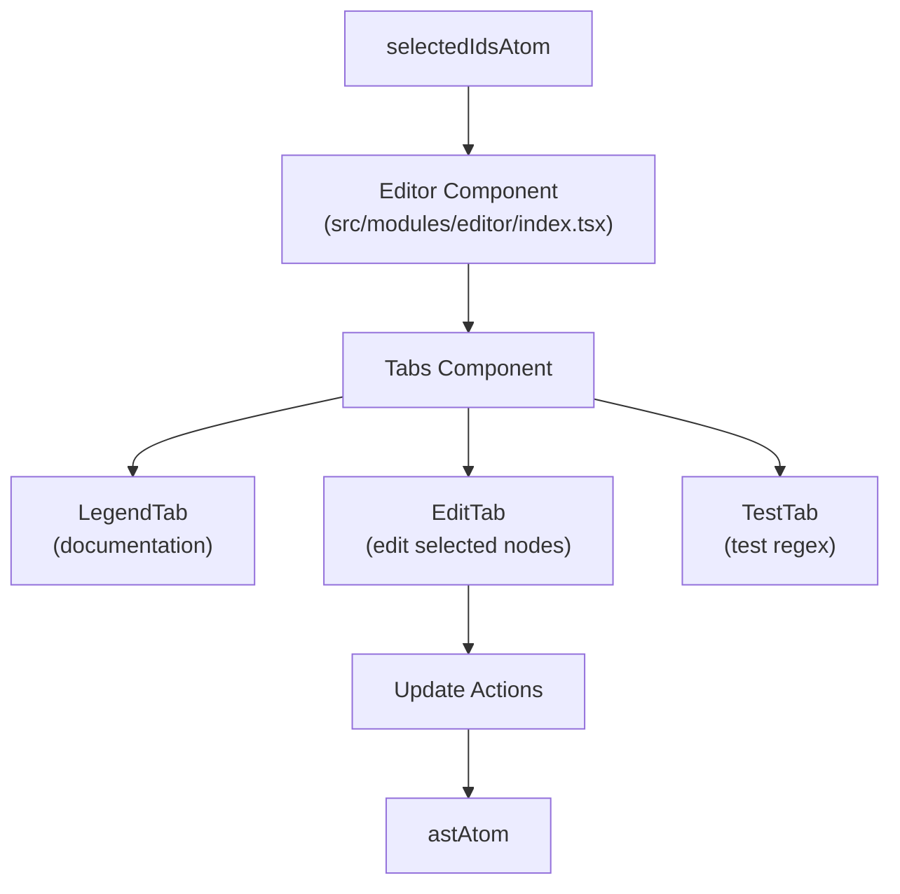
```mermaid
flowchart TD
    SelectedIds["selectedIdsAtom"] --> Editor["Editor Component\n(src/modules/editor/index.tsx)"]
    Editor --> Tabs["Tabs Component"]
    Tabs --> LegendTab["LegendTab\n(documentation)"]
    Tabs --> EditTab["EditTab\n(edit selected nodes)"]
    Tabs --> TestTab["TestTab\n(test regex)"]
    EditTab --> UpdateActions["Update Actions"]
    UpdateActions --> AST["astAtom"]
```

Sources: [src/modules/editor/index.tsx:1-128](), [src/modules/editor/test-tab.tsx:1-104]()

### Testing System

The Testing System allows users to validate regex patterns against test cases and share permalinks.

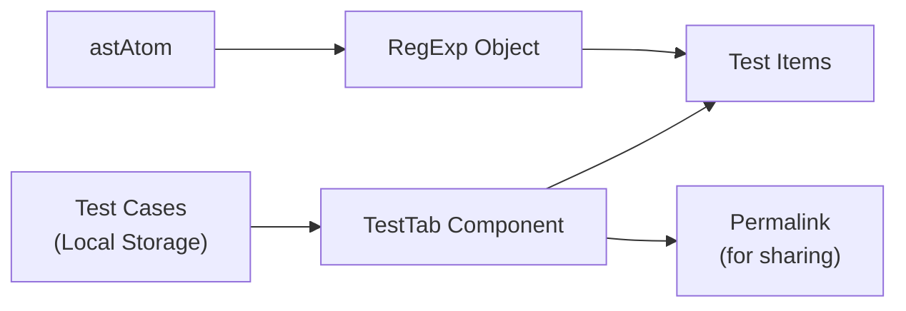
```mermaid
flowchart LR
    AST["astAtom"] --> RegExp["RegExp Object"]
    TestCases["Test Cases\n(Local Storage)"] --> TestTab["TestTab Component"]
    TestTab --> TestItems["Test Items"]
    RegExp --> TestItems
    TestTab --> Permalink["Permalink\n(for sharing)"]
```

Sources: [src/modules/editor/test-tab.tsx:22-75]()

## State Management

The application uses Jotai for state management, with several key atoms:

| Atom | Purpose | Source |
|------|---------|--------|
| `astAtom` | Stores the current AST representation of the regex | src/atom/index.ts |
| `selectedIdsAtom` | Tracks which nodes are currently selected | src/atom/index.ts |
| `redoAtom` / `undoAtom` | Manages editing history | src/atom/index.ts |
| `updateFlagsAtom` | Handles regex flag modifications | src/atom/index.ts |

Sources: [src/modules/home/index.tsx:22-27](), [src/modules/editor/index.tsx:12-17]()

## Technical Stack

Regex-Vis is built using modern web technologies:

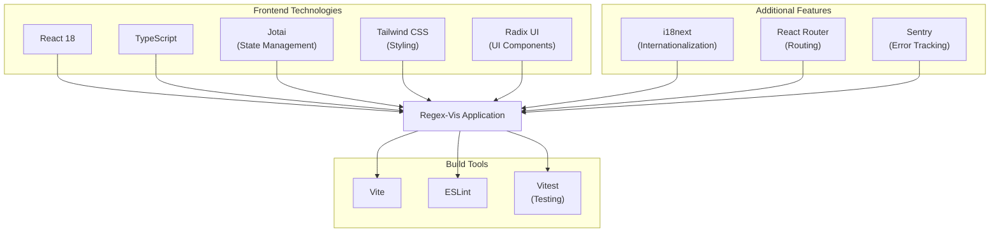
```mermaid
flowchart TD
    subgraph "Frontend Technologies"
        React["React 18"]
        TypeScript["TypeScript"]
        Jotai["Jotai\n(State Management)"]
        TailwindCSS["Tailwind CSS\n(Styling)"]
        RadixUI["Radix UI\n(UI Components)"]
    end
    
    subgraph "Build Tools"
        Vite["Vite"]
        ESLint["ESLint"]
        Vitest["Vitest\n(Testing)"]
    end
    
    subgraph "Additional Features"
        i18n["i18next\n(Internationalization)"]
        ReactRouter["React Router\n(Routing)"]
        Sentry["Sentry\n(Error Tracking)"]
    end
    
    React --> Application["Regex-Vis Application"]
    TypeScript --> Application
    Jotai --> Application
    TailwindCSS --> Application
    RadixUI --> Application
    i18n --> Application
    ReactRouter --> Application
    Sentry --> Application
    Application --> Vite
    Application --> ESLint
    Application --> Vitest
```

Sources: [package.json:1-85](), [src/index.tsx:1-19]()

## Project Structure

The codebase is organized into the following main directories:

- **src/parser**: Contains the regex parsing and generation logic
- **src/modules**: Contains the main application components:
  - **home**: Main application page
  - **graph**: Visualization components
  - **editor**: Editor and testing components
- **src/components**: Reusable UI components
- **src/atom**: State management atoms
- **src/utils**: Utility functions
- **public**: Static assets and translation files

Sources: [package.json:1-85](), [.gitignore:1-133]()

## Getting Started (Development)

For developers who want to contribute to or build upon the regex-vis project, see the [Development Guide](#6) for detailed instructions.

In summary, the project uses:
- pnpm as the package manager
- Node.js v16.x (recommended)
- Vite for development server and builds

Basic commands:
```bash
# Install dependencies
pnpm install

# Start development server
pnpm start

# Run tests
pnpm test
```

Sources: [.github/CONTRIBUTING.md:1-35](), [package.json:5-12]()

---

# Page: Parser System

# Parser System

<details>
<summary>Relevant source files</summary>

The following files were used as context for generating this wiki page:

- [src/modules/playground/index.tsx](src/modules/playground/index.tsx)
- [src/parser/__tests__/valid-2015.test.ts](src/parser/__tests__/valid-2015.test.ts)
- [src/parser/ast.ts](src/parser/ast.ts)
- [src/parser/lexer.ts](src/parser/lexer.ts)
- [src/parser/parse.ts](src/parser/parse.ts)
- [src/parser/parser.ts](src/parser/parser.ts)
- [src/parser/patterns.ts](src/parser/patterns.ts)
- [src/parser/token.ts](src/parser/token.ts)

</details>


The Parser System is the core component of regex-vis that transforms regular expression strings into an Abstract Syntax Tree (AST) representation. This AST serves as the foundation for both visualization and editing capabilities. This document provides a technical overview of the parser architecture, workflow, and integration points.

For information about the AST structure itself and how different regex elements are represented, see [Abstract Syntax Tree](#2.1). For details on converting the AST back to regex strings, see [Code Generation](#2.2).

## System Overview

The Parser System handles the transformation between textual regular expressions and their structured representation. It implements a multi-stage parsing process including lexical analysis (tokenization), syntax parsing, and AST construction.

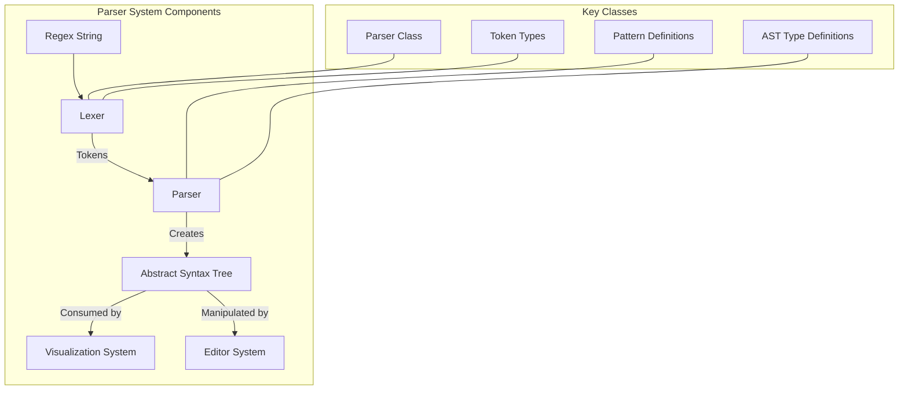
```mermaid
graph TD
    subgraph "Parser System Components"
        Regex["Regex String"] --> Lexer
        Lexer --> |"Tokens"| Parser
        Parser --> |"Creates"| AST["Abstract Syntax Tree"]
        AST --> |"Consumed by"| Visualization["Visualization System"]
        AST --> |"Manipulated by"| Editor["Editor System"]
    end

    subgraph "Key Classes"
        P["Parser Class"] --- Lexer
        T["Token Types"] --- Lexer
        PT["Pattern Definitions"] --- Parser
        AST_Types["AST Type Definitions"] --- Parser
    end
```

Sources: [src/parser/parse.ts:1-10](), [src/parser/parser.ts:1-31](), [src/parser/lexer.ts:1-21](), [src/parser/ast.ts:1-17]()

## Architecture

The Parser System follows a classic compiler front-end architecture with distinct components for lexical analysis and parsing.

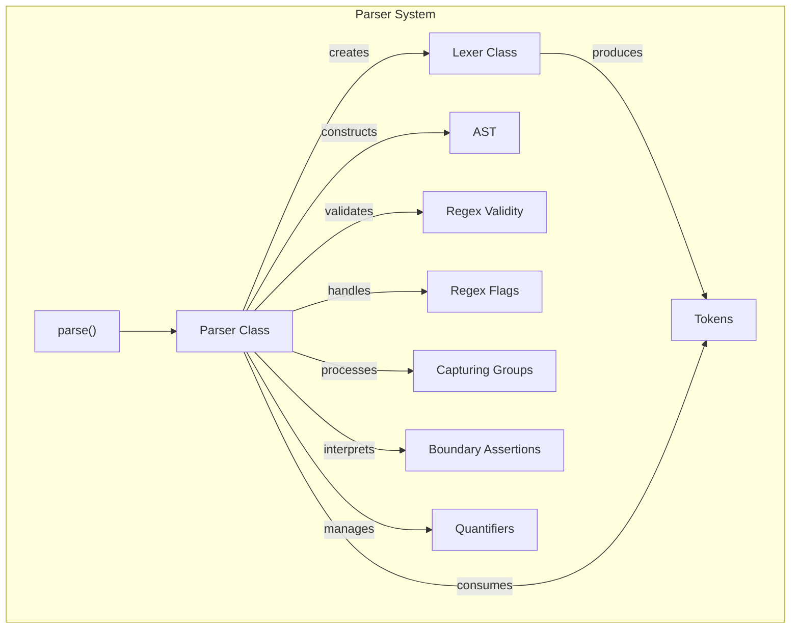
```mermaid
flowchart TD
    subgraph "Parser System"
        Parse["parse()"] --> Parser["Parser Class"]
        Parser -- "creates" --> Lexer["Lexer Class"]
        Lexer -- "produces" --> Tokens["Tokens"]
        Parser -- "consumes" --> Tokens
        Parser -- "constructs" --> AST["AST"]
        
        Parser -- "validates" --> Regex["Regex Validity"]
        Parser -- "handles" --> Flags["Regex Flags"]
        Parser -- "processes" --> Groups["Capturing Groups"]
        Parser -- "interprets" --> Assertions["Boundary Assertions"]
        Parser -- "manages" --> Quantifiers["Quantifiers"]
    end
```

Sources: [src/parser/parser.ts:14-378](), [src/parser/lexer.ts:6-182]()

### Component Roles

| Component | File | Responsibility |
|-----------|------|----------------|
| `parse()` | [src/parser/parse.ts]() | Entry point function that creates a Parser instance and calls its parse method |
| `Parser` class | [src/parser/parser.ts]() | Core class that transforms regex strings into AST objects |
| `Lexer` class | [src/parser/lexer.ts]() | Handles tokenization of the input regex string |
| Token types | [src/parser/token.ts]() | Defines the types of tokens produced by the lexer |
| Pattern definitions | [src/parser/patterns.ts]() | Regular expression patterns used to recognize regex components |
| AST type definitions | [src/parser/ast.ts]() | Typescript type definitions for AST nodes |

Sources: [src/parser/parse.ts:1-10](), [src/parser/parser.ts:1-31](), [src/parser/lexer.ts:1-21](), [src/parser/token.ts:1-23](), [src/parser/patterns.ts:1-18](), [src/parser/ast.ts:1-191]()

## Parser Implementation

The Parser class is the central component that orchestrates the parsing process. It contains methods for processing different regex components and building the AST.

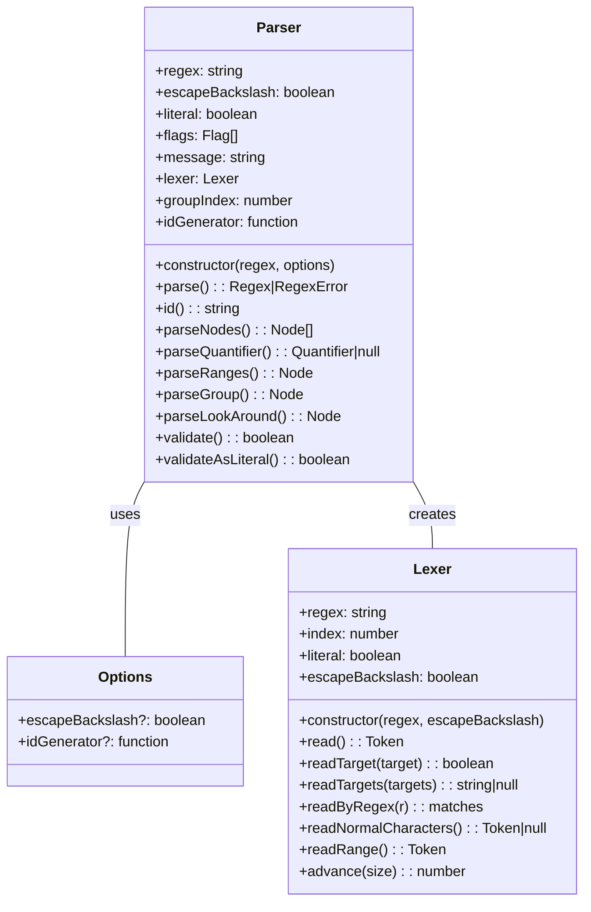
```mermaid
classDiagram
    class Parser {
        +regex: string
        +escapeBackslash: boolean
        +literal: boolean
        +flags: Flag[]
        +message: string
        +lexer: Lexer
        +groupIndex: number
        +idGenerator: function
        +constructor(regex, options)
        +parse(): Regex|RegexError
        +id(): string
        +parseNodes(): Node[]
        +parseQuantifier(): Quantifier|null
        +parseRanges(): Node
        +parseGroup(): Node
        +parseLookAround(): Node
        +validate(): boolean
        +validateAsLiteral(): boolean
    }
    
    class Options {
        +escapeBackslash?: boolean
        +idGenerator?: function
    }
    
    class Lexer {
        +regex: string
        +index: number
        +literal: boolean
        +escapeBackslash: boolean
        +constructor(regex, escapeBackslash)
        +read(): Token
        +readTarget(target): boolean
        +readTargets(targets): string|null
        +readByRegex(r): matches
        +readNormalCharacters(): Token|null
        +readRange(): Token
        +advance(size): number
    }
    
    Parser -- Options : uses
    Parser -- Lexer : creates
```

Sources: [src/parser/parser.ts:14-378](), [src/parser/lexer.ts:6-182]()

### Parsing Process

The parsing process involves several steps from regex string validation to AST construction.

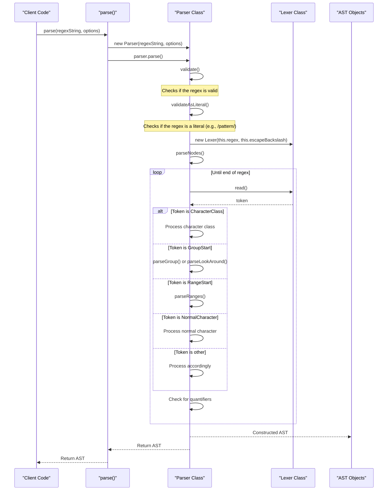
```mermaid
sequenceDiagram
    participant Client as "Client Code"
    participant Parse as "parse()"
    participant Parser as "Parser Class"
    participant Lexer as "Lexer Class"
    participant AST as "AST Objects"
    
    Client->>Parse: parse(regexString, options)
    Parse->>Parser: new Parser(regexString, options)
    Parse->>Parser: parser.parse()
    
    Parser->>Parser: validate()
    Note over Parser: Checks if the regex is valid
    
    Parser->>Parser: validateAsLiteral()
    Note over Parser: Checks if the regex is a literal (e.g., /pattern/)
    
    Parser->>Lexer: new Lexer(this.regex, this.escapeBackslash)
    
    Parser->>Parser: parseNodes()
    loop Until end of regex
        Parser->>Lexer: read()
        Lexer-->>Parser: token
        
        alt Token is CharacterClass
            Parser->>Parser: Process character class
        else Token is GroupStart
            Parser->>Parser: parseGroup() or parseLookAround()
        else Token is RangeStart
            Parser->>Parser: parseRanges()
        else Token is NormalCharacter
            Parser->>Parser: Process normal character
        else Token is other
            Parser->>Parser: Process accordingly
        end
        
        Parser->>Parser: Check for quantifiers
    end
    
    Parser-->>AST: Constructed AST
    Parser-->>Parse: Return AST
    Parse-->>Client: Return AST
```

Sources: [src/parser/parse.ts:4-9](), [src/parser/parser.ts:32-47](), [src/parser/parser.ts:53-219]()

## Lexical Analysis

The Lexer class is responsible for breaking down the regex string into tokens that the Parser can process.

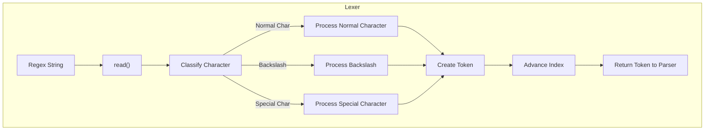
```mermaid
flowchart TD
    subgraph "Lexer"
        Input["Regex String"] --> Read["read()"]
        Read --> Classify["Classify Character"]
        
        Classify -->|"Normal Char"| Normal["Process Normal Character"]
        Classify -->|"Backslash"| Backslash["Process Backslash"]
        Classify -->|"Special Char"| Special["Process Special Character"]
        
        Normal --> Token["Create Token"]
        Backslash --> Token
        Special --> Token
        
        Token --> Advance["Advance Index"]
        Advance --> Return["Return Token to Parser"]
    end
```

Sources: [src/parser/lexer.ts:6-182]()

### Token Types

The Lexer produces tokens of different types based on the characters in the regex string.

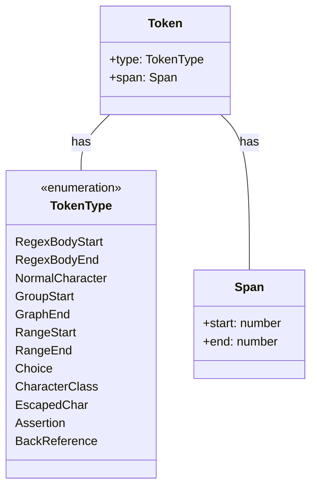
```mermaid
classDiagram
    class TokenType {
        <<enumeration>>
        RegexBodyStart
        RegexBodyEnd
        NormalCharacter
        GroupStart
        GraphEnd
        RangeStart
        RangeEnd
        Choice
        CharacterClass
        EscapedChar
        Assertion
        BackReference
    }
    
    class Token {
        +type: TokenType
        +span: Span
    }
    
    class Span {
        +start: number
        +end: number
    }
    
    Token -- TokenType : has
    Token -- Span : has
```

Sources: [src/parser/token.ts:1-23]()

## Parser Methods

The Parser class includes various methods to handle different regex components.

### Parsing Nodes

The `parseNodes()` method is the main method that processes a sequence of regex nodes.

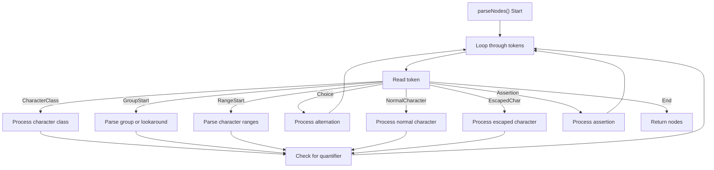
```mermaid
flowchart TB
    Start["parseNodes() Start"] --> Loop["Loop through tokens"]
    Loop --> TokenRead["Read token"]
    
    TokenRead -->|"CharacterClass"| CharClass["Process character class"]
    TokenRead -->|"GroupStart"| Group["Parse group or lookaround"]
    TokenRead -->|"RangeStart"| Range["Parse character ranges"]
    TokenRead -->|"Choice"| Choice["Process alternation"]
    TokenRead -->|"NormalCharacter"| Normal["Process normal character"]
    TokenRead -->|"EscapedChar"| Escaped["Process escaped character"]
    TokenRead -->|"Assertion"| Assertion["Process assertion"]
    TokenRead -->|"End"| End["Return nodes"]
    
    CharClass --> Quantifier["Check for quantifier"]
    Group --> Quantifier
    Range --> Quantifier
    Normal --> Quantifier
    Escaped --> Quantifier
    
    Quantifier --> Loop
    Choice --> Loop
    Assertion --> Loop
```

Sources: [src/parser/parser.ts:53-219]()

### Parsing Quantifiers

The `parseQuantifier()` method handles regex quantifiers like `*`, `+`, `?`, and `{n,m}`.

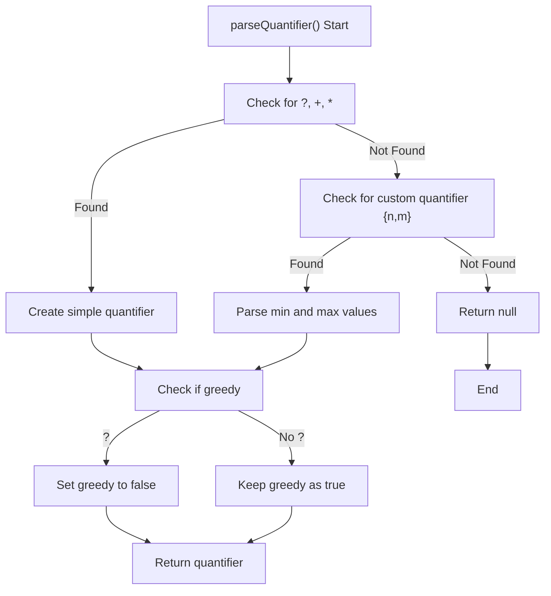
```mermaid
flowchart TD
    Start["parseQuantifier() Start"] --> Check["Check for ?, +, *"]
    
    Check -->|"Found"| Simple["Create simple quantifier"]
    Check -->|"Not Found"| Custom["Check for custom quantifier {n,m}"]
    
    Custom -->|"Found"| ParseCustom["Parse min and max values"]
    Custom -->|"Not Found"| ReturnNull["Return null"]
    
    Simple --> Greedy["Check if greedy"]
    ParseCustom --> Greedy
    
    Greedy -->|"?"| NonGreedy["Set greedy to false"]
    Greedy -->|"No ?"| IsGreedy["Keep greedy as true"]
    
    NonGreedy --> Return["Return quantifier"]
    IsGreedy --> Return
    ReturnNull --> End["End"]
```

Sources: [src/parser/parser.ts:222-265]()

## AST Construction

The Parser constructs an AST that represents the structure of the regex. Each component of the regex is mapped to a specific AST node type.

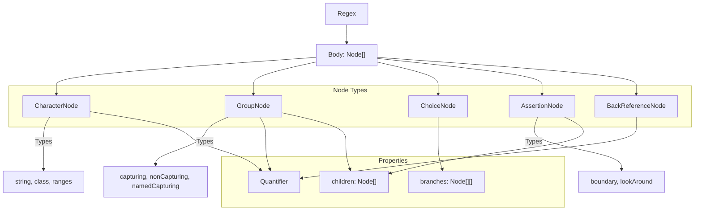
```mermaid
flowchart TD
    Regex["Regex"] --> Body["Body: Node[]"]
    
    subgraph "Node Types"
        Character["CharacterNode"]
        Group["GroupNode"]
        Choice["ChoiceNode"]
        Assertion["AssertionNode"]
        BackRef["BackReferenceNode"]
    end
    
    Body --> Character
    Body --> Group
    Body --> Choice
    Body --> Assertion
    Body --> BackRef
    
    Character -->|"Types"| CharTypes["string, class, ranges"]
    Group -->|"Types"| GroupTypes["capturing, nonCapturing, namedCapturing"]
    Assertion -->|"Types"| AssertionTypes["boundary, lookAround"]
    
    subgraph "Properties"
        Quantifier["Quantifier"]
        Children["children: Node[]"]
        Branches["branches: Node[][]"]
    end
    
    Character --> Quantifier
    Group --> Quantifier
    Group --> Children
    Choice --> Branches
    Assertion --> Children
    BackRef --> Quantifier
```

Sources: [src/parser/ast.ts:1-191]()

## Integration with Other Systems

The Parser System is integrated with the Visualization and Editor systems to provide a complete regex editing and visualization experience.

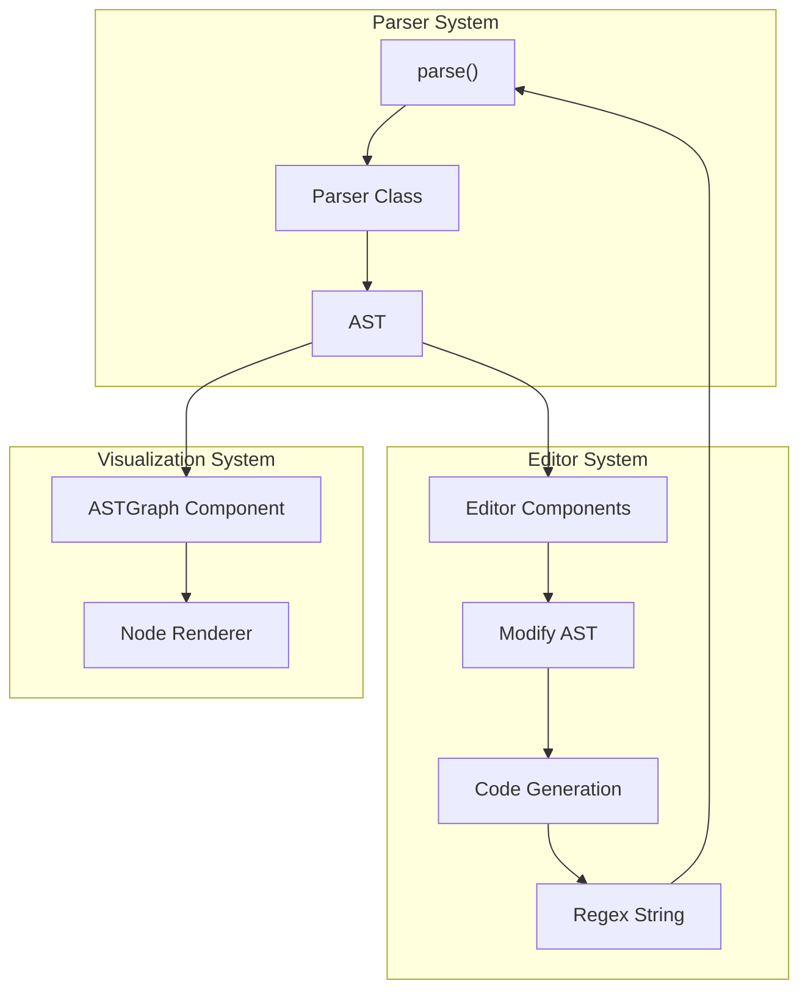
```mermaid
graph TD
    subgraph "Parser System"
        Parse["parse()"] --> Parser["Parser Class"]
        Parser --> AST["AST"]
    end
    
    subgraph "Visualization System"
        AST --> ASTGraph["ASTGraph Component"]
        ASTGraph --> Renderer["Node Renderer"]
    end
    
    subgraph "Editor System"
        AST --> Editor["Editor Components"]
        Editor --> Modify["Modify AST"]
        Modify --> CodeGen["Code Generation"]
        CodeGen --> RegexString["Regex String"]
    end
    
    RegexString --> Parse
```

Sources: [src/modules/playground/index.tsx:1-14]()

## Usage Example

The Parser System can be used to parse a regex string into an AST as shown in the following example:

```typescript
import { parse } from '@/parser'
import type { AST } from '@/parser'

const regexString = '[a-z]'
const ast = parse(regexString) as AST.Regex

// Now we can use the AST for visualization or editing
```

Sources: [src/modules/playground/index.tsx:1-14]()

## Error Handling

The Parser System includes error handling to deal with invalid regex patterns. When an invalid regex is encountered, a `RegexError` object is returned instead of an AST.

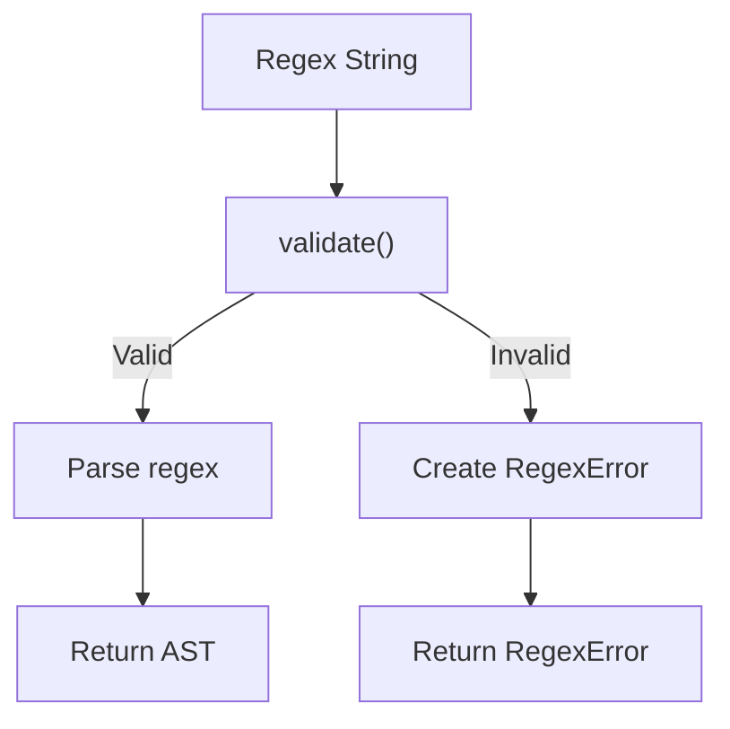
```mermaid
flowchart TD
    Input["Regex String"] --> Validate["validate()"]
    
    Validate -->|"Valid"| Parse["Parse regex"]
    Validate -->|"Invalid"| Error["Create RegexError"]
    
    Parse --> AST["Return AST"]
    Error --> ErrorObj["Return RegexError"]
```

Sources: [src/parser/parser.ts:32-47](), [src/parser/parser.ts:344-377]()

## Conclusion

The Parser System serves as the foundation of the regex-vis application, enabling the transformation between regex strings and AST representations. This transformation powers both the visualization of regex patterns and the interactive editing capabilities of the application.

---

# Page: Abstract Syntax Tree

# Abstract Syntax Tree

<details>
<summary>Relevant source files</summary>

The following files were used as context for generating this wiki page:

- [src/parser/__tests__/invalid-2015.test.ts](src/parser/__tests__/invalid-2015.test.ts)
- [src/parser/ast.ts](src/parser/ast.ts)
- [src/parser/visit.ts](src/parser/visit.ts)

</details>


This document describes the Abstract Syntax Tree (AST) structure used in regex-vis to represent parsed regular expressions. The AST serves as the core data model that bridges the textual regular expression notation with the visual representation. For information about how the AST is generated from regex strings, see [Parser System](#2) and for details on converting the AST back to regex, see [Code Generation](#2.2).

## Purpose and Role

The AST in regex-vis provides a structured, traversable representation of regular expressions. It serves several critical functions:

1. Represents the hierarchical structure of regex patterns
2. Facilitates visualization of regex components
3. Enables targeted editing of regex elements
4. Provides a consistent internal model for all system operations

## AST Structure Overview

The AST is organized as a tree structure where each node represents a component of the regular expression. All nodes share common base properties and are specialized based on their functionality within the regex pattern.

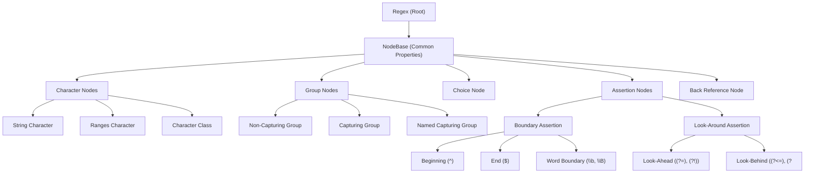
```mermaid
graph TD
    Regex["Regex (Root)"] --> NodeBase["NodeBase (Common Properties)"]
    NodeBase --> Character["Character Nodes"]
    NodeBase --> Group["Group Nodes"]
    NodeBase --> Choice["Choice Node"]
    NodeBase --> Assertion["Assertion Nodes"]
    NodeBase --> BackReference["Back Reference Node"]
    
    Character --> StringChar["String Character"]
    Character --> RangesChar["Ranges Character"]
    Character --> ClassChar["Character Class"]
    
    Group --> NonCapturing["Non-Capturing Group"]
    Group --> Capturing["Capturing Group"]
    Group --> NamedCapturing["Named Capturing Group"]
    
    Assertion --> BoundaryAssertion["Boundary Assertion"]
    Assertion --> LookAroundAssertion["Look-Around Assertion"]
    
    BoundaryAssertion --> Beginning["Beginning (^)"]
    BoundaryAssertion --> End["End ($)"]
    BoundaryAssertion --> WordBoundary["Word Boundary (\\b, \\B)"]
    
    LookAroundAssertion --> LookAhead["Look-Ahead ((?=), (?!))"]
    LookAroundAssertion --> LookBehind["Look-Behind ((?<=), (?<!))"]
```

Sources: [src/parser/ast.ts:1-190]()

## AST Node Types

### Base Structure

Every node in the AST derives from the `NodeBase` interface, which provides core properties:

```
NodeBase = {
  id: string        // Unique identifier
  type: string      // Node type
}
```

The root of the AST is a `Regex` object containing metadata and the body nodes:

```
Regex = {
  id: string        // Unique identifier
  type: 'regex'     // Type indicator
  body: Node[]      // Array of child nodes
  flags: Flag[]     // Regex flags (g, i, m, etc.)
  literal: boolean  // Whether the regex is a literal
  escapeBackslash: boolean  // Escape handling
}
```

Sources: [src/parser/ast.ts:1-8](), [src/parser/ast.ts:43-46]()

### Character Nodes

Character nodes represent individual characters, character ranges, or character classes. There are three types:

1. **String Character**: Represents a literal character.
2. **Ranges Character**: Represents a character range like `[a-z]`.
3. **Class Character**: Represents a character class like `\d` or `\w`.

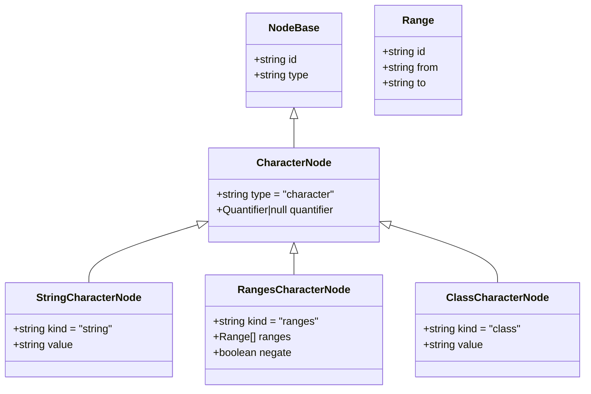
```mermaid
classDiagram
    NodeBase <|-- CharacterNode
    CharacterNode <|-- StringCharacterNode
    CharacterNode <|-- RangesCharacterNode
    CharacterNode <|-- ClassCharacterNode
    
    class NodeBase {
        +string id
        +string type
    }
    
    class CharacterNode {
        +string type = "character"
        +Quantifier|null quantifier
    }
    
    class StringCharacterNode {
        +string kind = "string"
        +string value
    }
    
    class RangesCharacterNode {
        +string kind = "ranges"
        +Range[] ranges
        +boolean negate
    }
    
    class ClassCharacterNode {
        +string kind = "class"
        +string value
    }
    
    class Range {
        +string id
        +string from
        +string to
    }
```

Sources: [src/parser/ast.ts:48-84]()

### Group Nodes

Group nodes represent capturing and non-capturing groups in the regex. There are three types:

1. **Non-Capturing Group**: Groups that don't capture matches (`(?:...)`)
2. **Capturing Group**: Standard capturing groups (`(...)`)
3. **Named Capturing Group**: Groups with assigned names (`(?<name>...)`)

```mermaid
classDiagram
    NodeBase <|-- GroupNode
    GroupNode <|-- NonCapturingGroupNode
    GroupNode <|-- CapturingGroupNode
    GroupNode <|-- NamedCapturingGroupNode
    
    class NodeBase {
        +string id
        +string type
    }
    
    class GroupNode {
        +string type = "group"
        +Node[] children
        +Quantifier|null quantifier
    }
    
    class NonCapturingGroupNode {
        +string kind = "nonCapturing"
    }
    
    class CapturingGroupNode {
        +string kind = "capturing"
        +string name
        +number index
    }
    
    class NamedCapturingGroupNode {
        +string kind = "namedCapturing"
        +string name
        +number index
    }
```

Sources: [src/parser/ast.ts:86-122]()

### Choice Node

The Choice node represents alternation in regex patterns (the `|` operator):

```
ChoiceNode = {
  type: 'choice'
  branches: Node[][]  // Array of alternate branches, each containing nodes
} & NodeBase
```

Each branch is an array of nodes representing one alternative in the choice.

Sources: [src/parser/ast.ts:124-127]()

### Assertion Nodes

Assertion nodes represent regex constructs that don't consume characters but assert positions:

1. **Boundary Assertions**: Beginning (`^`), End (`$`), and Word Boundary (`\b`, `\B`)
2. **Look-Around Assertions**: Look-ahead (`(?=...)`, `(?!...)`) and Look-behind (`(?<=...)`, `(?<!...)`)

```mermaid
classDiagram
    NodeBase <|-- AssertionNode
    AssertionNode <|-- BoundaryAssertionNode
    AssertionNode <|-- LookAroundAssertionNode
    BoundaryAssertionNode <|-- BeginningBoundaryAssertionNode
    BoundaryAssertionNode <|-- EndBoundaryAssertionNode
    BoundaryAssertionNode <|-- WordBoundaryAssertionNode
    
    class NodeBase {
        +string id
        +string type
    }
    
    class AssertionNode {
    }
    
    class BoundaryAssertionNode {
        +string type = "boundaryAssertion"
    }
    
    class BeginningBoundaryAssertionNode {
        +string kind = "beginning"
    }
    
    class EndBoundaryAssertionNode {
        +string kind = "end"
    }
    
    class WordBoundaryAssertionNode {
        +string kind = "word"
        +boolean negate
    }
    
    class LookAroundAssertionNode {
        +string type = "lookAroundAssertion"
        +string kind
        +boolean negate
        +Node[] children
    }
```

Sources: [src/parser/ast.ts:129-159]()

### Back Reference Node

Back reference nodes represent references to previously captured groups:

```
BackReferenceNode = {
  type: 'backReference'
  ref: string         // Reference to a capturing group
  quantifier: Quantifier | null
} & NodeBase
```

Sources: [src/parser/ast.ts:161-165]()

### Quantifiers

Quantifiers can be attached to various nodes to indicate repetition patterns:

```mermaid
classDiagram
    Quantifier <|-- QuestionMarkQuantifier
    Quantifier <|-- StarQuantifier
    Quantifier <|-- PlusQuantifier
    Quantifier <|-- CustomQuantifier
    
    class Quantifier {
        +string kind
        +number min
        +number max
        +boolean greedy
    }
    
    class QuestionMarkQuantifier {
        +string kind = "?"
        +number min = 0
        +number max = 1
    }
    
    class StarQuantifier {
        +string kind = "*"
        +number min = 0
        +number max = Infinity
    }
    
    class PlusQuantifier {
        +string kind = "+"
        +number min = 1
        +number max = Infinity
    }
    
    class CustomQuantifier {
        +string kind = "custom"
        +number min
        +number max
    }
```

Sources: [src/parser/ast.ts:17-41]()

## AST Traversal and Manipulation

The regex-vis system provides several methods for traversing and manipulating the AST.

### AST Traversal Methods

```mermaid
flowchart TD
    A["visit(node, callback)"] --> B{"Is node a\nParent node?"}
    B -->|Yes| C["Iterate through children"]
    C --> D["Call callback"]
    D --> E{"Callback returned\ntrue?"}
    E -->|Yes| F["Stop traversal"]
    E -->|No| G["Recursively visit child node"]
    G --> C
    B -->|No| H["End traversal"]
    
    I["getNodeById(ast, id)"] --> J["Call visit()"]
    J --> K["Return node when ID matches"]
    
    L["lrd(node, callback)"] --> M["Visit left branch"]
    M --> N["Visit right branch"]
    N --> O["Visit node itself"]
    O --> P["Call callback on node"]
```

The primary traversal functions are:

1. **visit()**: Traverses the AST and executes a callback for each node. Allows early termination by returning `true` from the callback.
2. **visitNodes()**: Similar to `visit()` but works with node lists and their parent nodes.
3. **getNodeById()**: Finds a specific node by its unique ID.
4. **getNodesByIds()**: Retrieves multiple nodes by their IDs, assuming they are sequential in the AST.
5. **lrd()**: Performs a post-order traversal (Left-Right-Down) of the AST.

Sources: [src/parser/visit.ts:3-183]()

## AST in the System Context

The AST serves as the central data model that connects various components of the regex-vis system.

```mermaid
flowchart TD
    RegexString["Regex String"] --> Parser["Parser"]
    Parser --> AST["Abstract Syntax Tree"]
    
    AST --> CodeGenerator["Code Generator"]
    CodeGenerator --> RegexString
    
    AST --> Visualization["Visualization System"]
    Visualization --> VizGraph["Interactive Graph"]
    
    AST --> Editor["Editor System"]
    Editor --> EditUI["Editing UI"]
    EditUI --> Modifications["User Modifications"]
    Modifications --> AST
    
    AST --> TestingSystem["Testing System"]
    TestingSystem --> TestResults["Test Results"]
```

In this flow:

1. A regex string is parsed into an AST
2. The AST is used to generate a visual representation
3. The Editor System allows users to modify the AST
4. The modified AST can be converted back to a regex string
5. The Testing System validates regex patterns using the AST

Sources: [src/parser/ast.ts:1-190](), [src/parser/visit.ts:3-183]()

## Error Handling

When an invalid regex is encountered, the parser returns a `RegexError` instead of an AST:

```
RegexError = {
  type: 'error'
  message: string  // Error description
}
```

Common error types include:
- Unterminated groups
- Invalid group syntax
- Unmatched parentheses
- Invalid quantifiers
- Unterminated character classes
- Range errors in character classes

Sources: [src/parser/__tests__/invalid-2015.test.ts:6-192](), [src/parser/ast.ts:10-13]()

## Summary

The Abstract Syntax Tree in regex-vis provides a structured representation of regular expressions that enables visualization, editing, and testing. The AST design follows a hierarchical structure where each node represents a specific regex construct. The system provides comprehensive traversal utilities to manipulate and transform the AST as needed.

The AST is central to the application's functionality, serving as the bridge between textual regex notation and visual representation. It facilitates all operations on regular expressions within the regex-vis system, from initial parsing to visualization, editing, and code generation.

---

# Page: Code Generation

# Code Generation

<details>
<summary>Relevant source files</summary>

The following files were used as context for generating this wiki page:

- [src/modules/editor/edit-tab.tsx](src/modules/editor/edit-tab.tsx)
- [src/modules/editor/utils.ts](src/modules/editor/utils.ts)
- [src/parser/gen-with-selected.ts](src/parser/gen-with-selected.ts)
- [src/parser/gen.ts](src/parser/gen.ts)
- [src/parser/index.ts](src/parser/index.ts)
- [src/parser/modifiers/content.ts](src/parser/modifiers/content.ts)
- [src/parser/modifiers/quantifier.ts](src/parser/modifiers/quantifier.ts)

</details>


This document describes the code generation system in the regex-vis project, which is responsible for converting Abstract Syntax Tree (AST) representations of regular expressions back into regex string format. For information about the AST structure itself, see [Abstract Syntax Tree](#2.1).

## Purpose and Functionality

The code generation system serves as the opposite of the parser - while the parser converts regex strings into AST nodes, the code generator transforms AST nodes back into valid regex strings. This bidirectional conversion enables:

1. Displaying the regex string representation of the visual graph
2. Updating the regex after visual modifications
3. Highlighting specific parts of the regex string when nodes are selected in the visualization

Sources: [src/parser/gen.ts:1-257](), [src/parser/index.ts:3-4]()

## Code Generation Architecture

```mermaid
graph TD
    subgraph "Code Generation System"
        AST["AST (Regex or Node[])"] --> CodeGen["CodeGen Class"]
        CodeGen --> |"processes nodes"| RegexString["Regex String"]
        
        subgraph "Generation Methods"
            GenNode["genNode()"] --> GenChoice["genChoice()"]
            GenNode --> GenGroup["genGroup()"]
            GenNode --> GenCharacter["genCharacter()"]
            GenNode --> GenBoundary["genBoundaryAssertionNode()"]
            GenNode --> GenLookAround["genLookAroundAssertionNode()"]
            GenNode --> GenBackRef["genBackReference()"]
            GenNode --> GenQuantifier["genQuantifier()"]
        end
        
        Options["Options: 
        - literal
        - escapeBackslash"] --> CodeGen
    end
    
    Gen["gen() function"] --> |"convenience wrapper"| CodeGen
    CodeGenWithSelected["CodeGenWithSelected Class"] --> |"extends"| CodeGen
    AST --> CodeGenWithSelected
    SelectedIds["Selected Node IDs"] --> CodeGenWithSelected
    CodeGenWithSelected --> |"returns"| GenerationResult["{ 
        regex: string, 
        startIndex: number, 
        endIndex: number 
    }"]
```

Sources: [src/parser/gen.ts:16-247](), [src/parser/gen-with-selected.ts:1-32]()

## The CodeGen Class

The `CodeGen` class is the core of the code generation system, defined in [src/parser/gen.ts]().

### Class Structure

```mermaid
classDiagram
    class CodeGen {
        -ast: AST.Regex | AST.Node[]
        -literal: boolean
        -escapeBackslash: boolean
        -regex: string
        +constructor(ast, options)
        +get backslash(): string
        +get characterClassPrefix(): string
        +gen(): string
        -genFlags(): void
        -genNodes(nodes: AST.Node[]): void
        -genNode(node: AST.Node): void
        -genChoice(node: ChoiceNode): void
        -genGroup(node: GroupNode): void
        -prefix(value: string): string
        -genCharacter(node: CharacterNode): void
        -genQuantifier(node: Node): void
        -genBoundaryAssertionNode(node: BoundaryNode): void
        -genLookAroundAssertionNode(node: LookAroundNode): void
        -genBackReference(node: BackReferenceNode): void
    }
```

Sources: [src/parser/gen.ts:16-246]()

### Initialization and Configuration Options

The `CodeGen` constructor takes two parameters:
1. `ast` - The AST (either a complete `Regex` object or an array of `Node` objects)
2. `options` - An optional object with configuration settings:
   - `literal` - Whether to include delimiters (`/` at start and end) and flags
   - `escapeBackslash` - Whether to escape backslashes (e.g., for string representation)

Sources: [src/parser/gen.ts:21-36]()

## Node Processing System

The core of the code generation process is the node-specific generation methods. Each type of AST node has a dedicated method for generating its regex representation.

### Main Generation Process

1. The `gen()` method starts the generation process
2. It processes the AST body (an array of nodes) using `genNodes()`
3. `genNodes()` iterates through each node and calls `genNode()`
4. `genNode()` dispatches to the appropriate node-specific method based on the node type
5. After processing the node, it checks if the node has a quantifier and generates it if needed

```mermaid
flowchart TD
    Start["gen()"] --> PrepareNodes["Extract nodes from AST"]
    PrepareNodes --> |"If literal mode"| AddDelimiter["Add initial '/' delimiter"]
    AddDelimiter --> ProcessNodes["Process all nodes"]
    PrepareNodes --> |"If not literal mode"| ProcessNodes
    
    ProcessNodes --> |"For each node"| ProcessNode["genNode()"]
    
    ProcessNode --> |"Switch on node.type"| NodeType["Determine node type"]
    NodeType --> |"'choice'"| GenChoice["genChoice()"]
    NodeType --> |"'group'"| GenGroup["genGroup()"]
    NodeType --> |"'character'"| GenCharacter["genCharacter()"]
    NodeType --> |"'boundaryAssertion'"| GenBoundary["genBoundaryAssertionNode()"]
    NodeType --> |"'lookAroundAssertion'"| GenLookAround["genLookAroundAssertionNode()"]
    NodeType --> |"'backReference'"| GenBackRef["genBackReference()"]
    
    GenChoice --> CheckQuantifier["Check if node has quantifier"]
    GenGroup --> CheckQuantifier
    GenCharacter --> CheckQuantifier
    GenBoundary --> CheckQuantifier
    GenLookAround --> CheckQuantifier
    GenBackRef --> CheckQuantifier
    
    CheckQuantifier --> |"If has quantifier"| GenQuantifier["genQuantifier()"]
    CheckQuantifier --> |"If no quantifier"| Continue["Continue to next node"]
    GenQuantifier --> Continue
    
    Continue --> |"If more nodes"| ProcessNode
    Continue --> |"If no more nodes"| Finish["Finish processing"]
    
    Finish --> |"If literal mode"| AddEndDelimiter["Add end '/' delimiter"]
    AddEndDelimiter --> GenFlags["Generate flags"]
    GenFlags --> ReturnRegex["Return regex string"]
    Finish --> |"If not literal mode"| ReturnRegex
```

Sources: [src/parser/gen.ts:46-95]()

### Processing Specific Node Types

Each node type is handled by a dedicated method that generates the appropriate regex syntax:

1. **Choice Nodes** (`genChoice`): Generates alternatives separated by `|` characters
   - Source: [src/parser/gen.ts:97-105]()

2. **Group Nodes** (`genGroup`): Generates different types of groups
   - Capturing: `(...)`
   - Named capturing: `(?<name>...)`
   - Non-capturing: `(?:...)`
   - Source: [src/parser/gen.ts:107-126]()

3. **Character Nodes** (`genCharacter`): Handles character ranges, strings, and character classes
   - Ranges: `[...]` or `[^...]` for negated ranges
   - String: Escaped as necessary
   - Character class: Handles special characters like `\d`, `\w`, etc.
   - Source: [src/parser/gen.ts:135-176]()

4. **Quantifiers** (`genQuantifier`): Adds repetition markers to nodes
   - `*`, `+`, `?`, or `{m,n}` formats
   - Adds `?` for non-greedy quantifiers
   - Source: [src/parser/gen.ts:178-209]()

5. **Boundary Assertions** (`genBoundaryAssertionNode`): Handles `^`, `$`, `\b`, and `\B`
   - Source: [src/parser/gen.ts:211-230]()

6. **Look-Around Assertions** (`genLookAroundAssertionNode`): Processes lookahead and lookbehind
   - Positive lookahead: `(?=...)`
   - Negative lookahead: `(?!...)`
   - Positive lookbehind: `(?<=...)`
   - Negative lookbehind: `(?<!...)`
   - Source: [src/parser/gen.ts:232-237]()

7. **Back References** (`genBackReference`): Generates references to captured groups
   - Numeric: `\1`, `\2`, etc.
   - Named: `\k<name>`
   - Source: [src/parser/gen.ts:239-246]()

Sources: [src/parser/gen.ts:97-246]()

## Special Character Handling

The code generator carefully handles special characters and escaping rules to ensure the generated regex is valid:

1. The `prefix` method escapes special regex characters with backslashes
2. The `backslash` property returns the appropriate backslash representation (doubled if `escapeBackslash` is true)
3. Character ranges have special handling for characters like `]`, `\`, and `-` that need careful positioning or escaping

```
Special Characters Requiring Escaping:
|, \, {, }, (, ), [, ], ^, $, +, *, ?, .
```

Sources: [src/parser/gen.ts:127-133](), [src/parser/gen.ts:38-44]()

## Code Generation with Selection Tracking

For the editor interface, an extension of the basic code generator tracks the positions of selected nodes in the generated string.

### CodeGenWithSelected

The `CodeGenWithSelected` class extends `CodeGen` to:
1. Track the start and end positions of selected nodes in the generated string
2. Return these positions along with the generated regex
3. Support highlighting the corresponding parts of the regex string

```mermaid
flowchart TD
    Start["genWithSelected()"] --> CreateCodeGen["Create CodeGenWithSelected instance"]
    CreateCodeGen --> |"Pass AST and selected node IDs"| Initialize["Initialize tracking variables"]
    Initialize --> GenerateRegex["Generate regex string"]
    
    subgraph "During Node Processing"
        CheckHeadId["Check if current node is head ID"]
        CheckHeadId --> |"If true"| RecordStart["Record startIndex"]
        GenerateNode["Generate node regex representation"]
        CheckTailId["Check if current node is tail ID"]
        CheckTailId --> |"If true"| RecordEnd["Record endIndex"]
    end
    
    GenerateRegex --> ReturnResult["Return { regex, startIndex, endIndex }"]
    
    ReturnResult --> |"Used by"| EditorHighlight["Editor for highlighting selection"]
```

Sources: [src/parser/gen-with-selected.ts:1-32]()

## Integration with the Editor System

The code generation system integrates with the Editor system through:

1. The `genWithSelected` function, which provides position information for highlighting
2. The `getInfoFromNodes` function in the Editor utils, which uses `genWithSelected` to retrieve node information including the regex representation

When users select nodes in the visualization:
1. The selected node IDs are passed to `genWithSelected`
2. The regex string and position information are returned
3. The Editor displays this information and highlights the corresponding part of the regex string

Sources: [src/modules/editor/utils.ts:98-121](), [src/modules/editor/edit-tab.tsx:41-44]()

## Public API

The primary entry point to the code generation system is the `gen` function exported from [src/parser/gen.ts:249-257](), which provides a simplified interface to the `CodeGen` class:

```typescript
// Usage:
import { gen } from '@/parser'

// Generate regex string from AST
const regexString = gen(ast, {
  literal: true,        // Include / delimiters and flags (default: false)
  escapeBackslash: true // Escape backslashes for string representation (default: false)
})
```

For selection tracking, the `genWithSelected` function is used:

```typescript
import { genWithSelected } from '@/parser'

// Generate regex with selection information
const { regex, startIndex, endIndex } = genWithSelected(ast, selectedIds)
```

Sources: [src/parser/index.ts:4](), [src/parser/gen.ts:249-257](), [src/parser/gen-with-selected.ts:28-32]()

---

# Page: Visualization System

# Visualization System

<details>
<summary>Relevant source files</summary>

The following files were used as context for generating this wiki page:

- [src/components/show-more/index.tsx](src/components/show-more/index.tsx)
- [src/constants/index.ts](src/constants/index.ts)
- [src/global.css](src/global.css)
- [src/modules/editor/legend-tab.tsx](src/modules/editor/legend-tab.tsx)
- [src/modules/graph/ast-graph.tsx](src/modules/graph/ast-graph.tsx)
- [src/modules/graph/choice.tsx](src/modules/graph/choice.tsx)
- [src/modules/graph/group-like.tsx](src/modules/graph/group-like.tsx)
- [src/modules/graph/index.tsx](src/modules/graph/index.tsx)
- [src/modules/graph/nodes.tsx](src/modules/graph/nodes.tsx)
- [src/modules/graph/quantifier.tsx](src/modules/graph/quantifier.tsx)
- [src/modules/graph/simple-node.tsx](src/modules/graph/simple-node.tsx)
- [src/modules/samples/index.tsx](src/modules/samples/index.tsx)
- [tailwind.config.ts](tailwind.config.ts)

</details>


The Visualization System is responsible for rendering the abstract syntax tree (AST) of a regular expression as an interactive, visual graph. This system transforms the abstract representation of a regex into a comprehensible, navigable diagram that helps users understand the structure and components of complex regular expressions.

For details about how regular expressions are parsed into ASTs, see [Parser System](#2).

## System Architecture

The Visualization System contains several interrelated components that work together to render the regex AST as an interactive SVG-based graph.

```mermaid
graph TD
    subgraph "Visualization System"
        Graph["Graph Component"] --> ASTGraph["ASTGraph Component"]
        ASTGraph --> NodeRenderingSystem["Node Rendering System"]
        NodeRenderingSystem --> NodeTypes["Node Type Renderers"]
        NodeTypes --> SimpleNode["SimpleNode"]
        NodeTypes --> ChoiceNode["ChoiceNode"]
        NodeTypes --> GroupLikeNode["GroupLikeNode"]
        Graph --> SelectionSystem["Selection System"]
        SelectionSystem --> DragSelect["useDragSelect Hook"]
        SelectionSystem --> SelectNodesByBox["selectNodesByBoxAtom"]
    end
    
    AST["AST from Parser"] --> Graph
    SelectionSystem --> SelectedIds["selectedIdsAtom"]
    SizeMap["sizeMapAtom"] --> ASTGraph
    
    style Graph stroke-width:2px
    style ASTGraph stroke-width:2px
    style NodeRenderingSystem stroke-width:2px
```

Sources: [src/modules/graph/index.tsx](), [src/modules/graph/ast-graph.tsx](), [src/modules/graph/nodes.tsx]()

### Core Components

The Visualization System consists of several key components:

1. **Graph Component**: The main entry point for the visualization that handles error states and coordinates rendering.
2. **ASTGraph Component**: Responsible for laying out the graph, calculating sizes, and managing the SVG rendering.
3. **Node Rendering System**: Renders different types of regex nodes with appropriate visual representations.
4. **Selection System**: Manages node selection and highlighting based on user interaction.

## Node Types and Rendering

The system renders different node types based on the AST node type, with specialized rendering for each regex component type.

```mermaid
graph TD
    subgraph "Node Type Renderers"
        SimpleNode["SimpleNode Renderer"] --> |renders| CharNode["Character Nodes"]
        SimpleNode --> |renders| BackRef["BackReference Nodes"]
        SimpleNode --> |renders| Boundary["Boundary Assertions"]
        ChoiceNode["ChoiceNode Renderer"] --> |renders| AltNode["Alternation (a|b)"]
        GroupLikeNode["GroupLikeNode Renderer"] --> |renders| GroupNode["Capturing/Non-capturing Groups"]
        GroupLikeNode --> |renders| LookAround["LookAround Assertions"]
    end
    
    MeasureSystem["Size Calculation"] --> |provides sizes for| SimpleNode
    MeasureSystem --> |provides sizes for| ChoiceNode
    MeasureSystem --> |provides sizes for| GroupLikeNode
    
    style SimpleNode stroke-width:2px
    style ChoiceNode stroke-width:2px
    style GroupLikeNode stroke-width:2px
```

Sources: [src/modules/graph/nodes.tsx:82-142](), [src/modules/graph/simple-node.tsx](), [src/modules/graph/choice.tsx](), [src/modules/graph/group-like.tsx]()

### Node Rendering Logic

The Visualization System determines which renderer to use based on the node type:

1. **SimpleNode**: Renders basic regex elements like character classes, literal characters, and boundary assertions
2. **ChoiceNode**: Renders alternation patterns with branches for different alternatives
3. **GroupLikeNode**: Handles capturing/non-capturing groups and look-around assertions

The appropriate renderer is selected in the `Nodes` component's render logic:

```jsx
switch (node.type) {
  case 'choice':
    Node = <ChoiceNode />
    break
  case 'group':
  case 'lookAroundAssertion':
    Node = <GroupLikeNode />
    break
  case 'root':
    Node = null
    break
  default:
    Node = <SimpleNode />
}
```

Sources: [src/modules/graph/nodes.tsx:92-126]()

## Size Calculation and Layout

The system uses a sophisticated size calculation mechanism to determine the dimensions of each node and the entire graph.

```mermaid
flowchart TD
    subgraph "Size Calculation Process"
        AST["AST"] --> MeasureSystem["measureNodes()"]
        MeasureSystem --> SizeMap["sizeMapAtom"]
        SizeMap --> NodeRenderers["Node Renderers"]
        MeasureSystem --> BoxSizes["Box Sizes"]
        MeasureSystem --> ContentSizes["Content Sizes"]
    end
    
    subgraph "Layout Process"
        SizeMap --> PositionCalc["Position Calculation"]
        PositionCalc --> XCoords["X Coordinates"]
        PositionCalc --> YCoords["Y Coordinates"]
        XCoords --> SVGRender["SVG Rendering"]
        YCoords --> SVGRender
    end
    
    style MeasureSystem stroke-width:2px
    style SizeMap stroke-width:2px
    style PositionCalc stroke-width:2px
```

Sources: [src/modules/graph/ast-graph.tsx:35-73](), [src/modules/graph/nodes.tsx:32-64]()

The size calculation occurs in several phases:

1. **Node Size Measurement**: The system traverses the AST in a left-right-down (lrd) order to calculate the size of each node.
2. **Box and Content Size**: For each node, both the box size (including padding) and content size are calculated.
3. **Branch Measurement**: For choice nodes, the system measures the size of each branch independently.
4. **Position Calculation**: Once sizes are determined, the positions of nodes are calculated to create a properly aligned graph.

Key constants define the spacing and sizing relationships:

| Constant | Purpose |
|---------|---------|
| `GRAPH_NODE_PADDING_VERTICAL` | Vertical padding inside nodes |
| `GRAPH_NODE_PADDING_HORIZONTAL` | Horizontal padding inside nodes |
| `GRAPH_NODE_MARGIN_HORIZONTAL` | Horizontal spacing between nodes |
| `GRAPH_NODE_MARGIN_VERTICAL` | Vertical spacing between nodes |
| `GRAPH_GROUP_NODE_PADDING_VERTICAL` | Vertical padding in group nodes |
| `GRAPH_CHOICE_PADDING_VERTICAL` | Vertical padding in choice nodes |

Sources: [src/constants/index.ts:7-19]()

## Visual Styling and Components

The visualization applies consistent styling to different components of the regex:

```mermaid
graph TD
    subgraph "Node Visual Styling"
        SimpleNode["SimpleNode"] --> |styled with| SimpleBorder["Solid border"]
        LookAroundNode["LookAround with negate=true"] --> |styled with| DashedBorder["Dashed red border"]
        GroupNode["Group Node"] --> |styled with| GroupBorder["Lighter solid border"]
        Quantifier["Quantifier Display"] --> |includes| QuantifierIcon["Quantifier Icon"]
        Quantifier --> |includes| QuantifierText["Quantifier Text"]
        Quantifier --> |includes| InfinityIcon["Infinity Symbol (if max=∞)"]
    end
    
    style SimpleNode stroke-width:2px
    style Quantifier stroke-width:2px
```

Sources: [src/modules/graph/simple-node.tsx:36-58](), [src/modules/graph/group-like.tsx:36-58](), [src/modules/graph/quantifier.tsx]()

Special styling elements include:

1. **Borders**: Different border styles indicate different types of nodes (solid for standard nodes, dashed for negated look-around assertions)
2. **Colors**: The system uses theme-aware colors from the application's color scheme (different styles for light and dark mode)
3. **Icons**: Special icons are used for certain operations like quantifiers and infinity
4. **Connections**: Connecting lines show the relationships between nodes

## Selection and Interaction

The Visualization System implements interactive features that allow users to select and interact with the graph.

```mermaid
flowchart TD
    subgraph "Selection System"
        DragSelect["useDragSelect Hook"] --> |creates| SelectionBox["Selection Box"]
        SelectionBox --> |triggers| SelectNodesByBox["selectNodesByBoxAtom"]
        SelectNodesByBox --> |updates| SelectedIds["selectedIdsAtom"]
        SelectedIds --> |consumed by| NodeRenderers["Node Renderers"]
        NodeRenderers --> |highlights| SelectedNodes["Selected Nodes"]
    end
    
    Click["User Click"] --> DragSelect
    Drag["User Drag"] --> DragSelect
    
    style DragSelect stroke-width:2px
    style SelectNodesByBox stroke-width:2px
    style SelectedIds stroke-width:2px
```

Sources: [src/modules/graph/index.tsx:17-23](), [src/modules/graph/nodes.tsx:75-78]()

The selection system works as follows:

1. **Drag Selection**: Users can click and drag to create a selection box
2. **Selection Logic**: The system determines which nodes intersect with the selection box
3. **Selected IDs**: The IDs of selected nodes are stored in the `selectedIdsAtom`
4. **Highlight Effect**: Selected nodes are highlighted in the visualization
5. **Editor Integration**: Selected nodes can be edited in the Editor System (see [Editor System](#4))

## Integration with Other Systems

The Visualization System integrates with other parts of the regex-vis application:

1. **Parser System**: Receives AST data from the Parser System
2. **Editor System**: Provides selected nodes for editing
3. **Samples System**: Simplified graphs are used in the samples showcase

Sources: [src/modules/graph/index.tsx:10-14](), [src/modules/samples/index.tsx:42-56]()

## Accessibility and Internationalization

The Visualization System supports internationalization through the application's i18n system. This allows the visualization to properly render text elements in different languages.

Sources: [src/modules/graph/ast-graph.tsx:70-72]()

## Constants and Configuration

The visual appearance of the graph is controlled by constants defined in the constants file:

| Constant Group | Description |
|----------------|-------------|
| Node Sizing | Controls the dimensions and padding of nodes |
| Spacing | Controls the spacing between elements |
| Text Styling | Controls font sizes and text appearance |
| Graphical Elements | Controls size of icons and visual elements |

Sources: [src/constants/index.ts:7-37]()

---

# Page: Node Rendering

# Node Rendering

<details>
<summary>Relevant source files</summary>

The following files were used as context for generating this wiki page:

- [src/constants/index.ts](src/constants/index.ts)
- [src/modules/graph/choice.tsx](src/modules/graph/choice.tsx)
- [src/modules/graph/group-like.tsx](src/modules/graph/group-like.tsx)
- [src/modules/graph/nodes.tsx](src/modules/graph/nodes.tsx)
- [src/modules/graph/simple-node.tsx](src/modules/graph/simple-node.tsx)
- [src/modules/graph/text.tsx](src/modules/graph/text.tsx)
- [src/modules/graph/utils.ts](src/modules/graph/utils.ts)

</details>


The Node Rendering system in regex-vis is responsible for transforming the Abstract Syntax Tree (AST) of a regular expression into a visual graph representation. This system determines how different regex elements (such as characters, groups, alternations) are visually displayed and connected within the visualization.

For information about the AST structure itself, see [Abstract Syntax Tree](#2.1). For details on how users interact with the rendered graph, see [Graph Interaction](#3.2).

## Component Architecture

The Node Rendering system consists of specialized components that render different types of regex nodes:

```mermaid
graph TD
    AST["AST Node"] --> Nodes["Nodes Component"]
    Nodes --> NodeTypeRenderer{"Node Type Renderer"}
    NodeTypeRenderer -->|"Choice"| ChoiceNode["ChoiceNode"]
    NodeTypeRenderer -->|"Group/LookAround"| GroupLikeNode["GroupLikeNode"]
    NodeTypeRenderer -->|"Character/BackRef/BoundaryAssertion"| SimpleNode["SimpleNode"]
    
    ChoiceNode --> Content["Content Component"]
    GroupLikeNode --> NameAndQuantifier["NameAndQuantifier"]
    GroupLikeNode --> Content
    SimpleNode --> NameAndQuantifier
    SimpleNode --> Content
    SimpleNode --> TextNode["TextNode"]
    
    Content --> SVGRect["SVG Rectangle"]
    
    Nodes --> MidConnect["MidConnect"]
    ChoiceNode --> StartConnect["StartConnect"]
    ChoiceNode --> EndConnect["EndConnect"]
    
    SizeMap["sizeMapAtom"] --- Nodes
    SizeMap --- ChoiceNode
    SizeMap --- GroupLikeNode
    SizeMap --- SimpleNode
```

Sources: [src/modules/graph/nodes.tsx](), [src/modules/graph/simple-node.tsx](), [src/modules/graph/group-like.tsx](), [src/modules/graph/choice.tsx]()

## Node Types and Rendering Process

The system renders three primary types of nodes:

### Simple Nodes

Simple nodes represent basic regex elements like characters, character classes, back references, and boundary assertions.

```mermaid
graph TD
    SimpleNode["SimpleNode"] --> NameAndQuantifier["NameAndQuantifier (optional)"]
    SimpleNode --> Content["Content Component"]
    Content --> ForeignObject["foreignObject"]
    ForeignObject --> TextNode["TextNode"]
    TextNode --> NodeType{"Node Type"}
    NodeType -->|"string character"| StringRender["Render with quotes"]
    NodeType -->|"character class"| ClassRender["Render class name (e.g., 'Digit')"]
    NodeType -->|"character ranges"| RangesRender["Render character ranges (e.g., 'a-z')"]
    NodeType -->|"back reference"| BackRefRender["Render 'Back reference #n'"]
    NodeType -->|"boundary assertion"| BoundaryRender["Render boundary type"]
```

The `SimpleNode` component creates a rectangular container with rounded corners and uses the `TextNode` component to render appropriate text based on the node type.

Sources: [src/modules/graph/simple-node.tsx](), [src/modules/graph/text.tsx]()

### Group-like Nodes

Group-like nodes represent capturing groups and lookaround assertions. They contain child nodes.

```mermaid
graph TD
    GroupLikeNode["GroupLikeNode"] --> NameAndQuantifier["NameAndQuantifier"]
    GroupLikeNode --> Content["Content Component"]
    Content --> MidConnect["MidConnect Components"]
    Content --> ChildNodes["Nodes Component (renders children)"]
```

The `GroupLikeNode` component creates a rectangular container that holds child nodes. It uses the `Nodes` component recursively to render its children and adds connectors between them.

Sources: [src/modules/graph/group-like.tsx:1-76]()

### Choice Nodes

Choice nodes represent alternation in regex (e.g., "a|b|c").

```mermaid
graph TD
    ChoiceNode["ChoiceNode"] --> Content["Content Component"]
    Content --> BranchesLoop["For each branch"]
    BranchesLoop --> StartConnect["StartConnect"]
    BranchesLoop --> BranchNodes["Nodes Component (branch nodes)"]
    BranchesLoop --> EndConnect["EndConnect"]
```

The `ChoiceNode` component arranges branches vertically, with each branch representing an alternative pattern. It uses `StartConnect` and `EndConnect` components to connect branches to the main flow.

Sources: [src/modules/graph/choice.tsx:1-92]()

## Node Sizing and Positioning

Node sizing and positioning are critical for creating a readable visualization. The system uses the following approach:

```mermaid
sequenceDiagram
    participant Graph as "Graph Component"
    participant SizeMap as "sizeMapAtom"
    participant Nodes as "Nodes Component"
    participant NodeRenderer as "Node Renderer"
    
    Graph->>SizeMap: Calculate and store node sizes
    Note over SizeMap: Stores box and content sizes for each node
    
    Nodes->>SizeMap: Get node sizes
    SizeMap-->>Nodes: Return size information
    
    Nodes->>Nodes: Calculate positions
    Note over Nodes: Positions nodes horizontally with margins
    
    loop For each node
        Nodes->>NodeRenderer: Render with calculated position
        NodeRenderer->>SizeMap: Get node size
        SizeMap-->>NodeRenderer: Return size
        NodeRenderer->>NodeRenderer: Render with correct dimensions
    end
```

For each node, two sizes are calculated and stored in the `sizeMapAtom`:
1. **Box Size**: Total size including padding and extra elements
2. **Content Size**: Size of the content area only

The `Nodes` component uses these sizes to position nodes horizontally with appropriate margins:

```javascript
// Simplified from src/modules/graph/nodes.tsx
let curX = x
return nodes.map((node) => {
  const [nodeWidth, nodeHeight] = sizeMap.get(node).box
  const nodeX = curX
  const nodeY = y + (boxHeight - nodeHeight) / 2
  curX += nodeWidth + GRAPH_NODE_MARGIN_HORIZONTAL
  return { x1: nodeX, y1: nodeY, x2: nodeX + nodeWidth, y2: nodeY + nodeHeight }
})
```

Sources: [src/modules/graph/nodes.tsx:27-64](), [src/modules/graph/utils.ts:71-74](), [src/constants/index.ts:6-32]()

## Node Connections

The system uses different types of connectors to show the flow of the regex:

```mermaid
graph LR
    subgraph "Sequential Nodes"
        Node1["Node 1"] -->|"MidConnect"| Node2["Node 2"]
    end
    
    subgraph "Choice Nodes Example"
        Start["Start"] 
        Start --- Branch1["Branch 1"]
        Start --- Branch2["Branch 2"]
        Branch1 --- End["End"]
        Branch2 --- End
        
        Start -->|"StartConnect"| Branch1
        Start -->|"StartConnect"| Branch2
        Branch1 -->|"EndConnect"| End
        Branch2 -->|"EndConnect"| End
    end
```

1. **MidConnect**: Horizontal lines connecting sequential nodes
2. **StartConnect**: Lines connecting a choice node to the start of each branch
3. **EndConnect**: Lines connecting the end of each branch back to the choice node

The `Nodes` component renders `MidConnect` components between adjacent nodes:

```javascript
// From src/modules/graph/nodes.tsx
const Connect = index >= 1 && (
  <MidConnect
    start={[box.x1 - GRAPH_NODE_MARGIN_HORIZONTAL, connectY]}
    end={[box.x1, connectY]}
  />
)
```

Sources: [src/modules/graph/nodes.tsx:127-132](), [src/modules/graph/choice.tsx:69-84](), [src/modules/graph/group-like.tsx:49-62]()

## Text Rendering

Text rendering is handled by the `TextNode` component, which adapts its output based on the node type:

| Node Type | Rendered Output Example |
|-----------|-------------------------|
| String Character | `"a"` (with quotes) |
| Character Class | `Digit` (translated class name) |
| Character Ranges | `"a" - "z"` (range with quotes) |
| Back Reference | `Back reference #1` |
| Boundary Assertion | `Begins with` or `WordBoundary` |

The `TextNode` component includes special handling for:
- Adding quotes around literal characters
- Translating character class names (e.g., `\d` → `Digit`)
- Formatting ranges with hyphens
- Showing appropriate text for empty nodes

Sources: [src/modules/graph/text.tsx:1-162]()

## Selection and Highlighting

The system supports selecting nodes for editing:

```mermaid
sequenceDiagram
    participant User as "User"
    participant Selection as "Selection System"
    participant SelectedIdsAtom as "selectedIdsAtom"
    participant Nodes as "Nodes Component"
    participant Content as "Content Component"
    
    User->>Selection: Select nodes
    Selection->>SelectedIdsAtom: Update selected IDs
    Nodes->>SelectedIdsAtom: Read selected IDs
    SelectedIdsAtom-->>Nodes: Return selected node IDs
    Nodes->>Nodes: Determine selected status for each node
    Nodes->>Content: Pass selected status
    Content->>Content: Apply selection styling
```

The `Nodes` component checks if each node is part of the current selection:

```javascript
// From src/modules/graph/nodes.tsx
const selected = startSelectedIndex >= 0 && 
                index >= startSelectedIndex && 
                index < startSelectedIndex + selectedIds.length
```

Selected status is passed to node renderers, which pass it to the `Content` component for visual highlighting.

Sources: [src/modules/graph/nodes.tsx:74-90]()

## Name and Quantifier Display

Many regex elements have names or quantifiers (e.g., `+`, `*`, `{1,3}`). These are rendered by the `NameAndQuantifier` component.

The utility functions determine text to display:
- `getNameText`: For groups and character ranges (e.g., "Group #1", "One of")
- `getQuantifierText`: For repetition patterns (e.g., " 1 - 3" for `{1,3}`)

Sources: [src/modules/graph/utils.ts:16-36](), [src/modules/graph/utils.ts:76-84]()

## Visual Properties

The appearance of nodes is controlled by constants defined in `constants/index.ts`:

| Constant | Purpose |
|----------|---------|
| GRAPH_TEXT_FONT_SIZE | Font size for node text (16px) |
| GRAPH_NODE_PADDING_VERTICAL | Vertical padding inside nodes (2px) |
| GRAPH_NODE_PADDING_HORIZONTAL | Horizontal padding inside nodes (10px) |
| GRAPH_NODE_BORDER_RADIUS | Corner radius for node rectangles (5px) |
| GRAPH_NODE_MARGIN_VERTICAL | Vertical margin between nodes (15px) |
| GRAPH_NODE_MARGIN_HORIZONTAL | Horizontal margin between nodes (25px) |
| GRAPH_GROUP_NODE_PADDING_VERTICAL | Vertical padding inside group nodes (15px) |
| GRAPH_CHOICE_PADDING_VERTICAL | Vertical padding inside choice nodes (10px) |

Sources: [src/constants/index.ts:6-32]()

## Component Implementation

The core rendering logic is in the `Nodes` component, which:
1. Calculates positions for each node based on sizes from `sizeMapAtom`
2. Determines if nodes are selected
3. Renders the appropriate node component based on type
4. Adds connectors between nodes

```javascript
// Simplified from src/modules/graph/nodes.tsx
function Nodes({ id, index, x, y, nodes }) {
  // Calculate positions
  // Check for selected status
  
  return (
    <>
      {nodes.map((node, index) => {
        // Determine node type and render appropriate component
        let Node = null;
        switch (node.type) {
          case 'choice': Node = <ChoiceNode />; break;
          case 'group':
          case 'lookAroundAssertion': Node = <GroupLikeNode />; break;
          case 'root': Node = null; break;
          default: Node = <SimpleNode />; 
        }
        
        // Add connector if not the first node
        const Connect = index >= 1 && <MidConnect />;
        
        return (
          <>
            {Connect}
            {Node}
          </>
        );
      })}
    </>
  );
}
```

Sources: [src/modules/graph/nodes.tsx:27-142]()

## Summary

The Node Rendering system in regex-vis transforms the AST into an interactive visual graph by:
1. Using specialized renderers for different node types
2. Calculating appropriate sizes and positions
3. Connecting nodes to represent regex flow
4. Rendering text content based on node type
5. Supporting selection for interactive editing

This modular architecture makes the visualization adaptable to different regex features while maintaining a clear and readable representation of the regular expression structure.

Sources: [src/modules/graph/nodes.tsx](), [src/modules/graph/simple-node.tsx](), [src/modules/graph/group-like.tsx](), [src/modules/graph/choice.tsx](), [src/modules/graph/text.tsx]()

---

# Page: Graph Interaction

# Graph Interaction

<details>
<summary>Relevant source files</summary>

The following files were used as context for generating this wiki page:

- [src/atom/index.ts](src/atom/index.ts)
- [src/components/range-input/index.tsx](src/components/range-input/index.tsx)
- [src/modules/graph/index.tsx](src/modules/graph/index.tsx)
- [src/modules/graph/quantifier.tsx](src/modules/graph/quantifier.tsx)

</details>


This document outlines the interactive features of the graph visualization system in regex-vis. It focuses specifically on how users interact with the visualized regex, including selection mechanisms and visual feedback. For information about how different node types are rendered, see [Node Rendering](#3.1).

## Interaction Overview

The graph visualization in regex-vis provides several interaction capabilities that bridge the visualization and editing systems. Users can select nodes in the graph, which then enables editing of those nodes through the Editor System.

```mermaid
graph TD
    User(["User"]) -->|"selects nodes"| Graph["Graph Component"]
    Graph -->|"triggers"| SelectAtom["selectNodesByBoxAtom"]
    SelectAtom -->|"updates"| SelectedIdsAtom["selectedIdsAtom"]
    SelectedIdsAtom -->|"highlights"| Graph
    SelectedIdsAtom -->|"enables editing"| Editor["Editor Component"]
    
    subgraph "Graph Interaction System"
        Graph
        SelectAtom
        SelectedIdsAtom
        DragSelect["useDragSelect Hook"]
    end
    
    Graph -->|"uses"| DragSelect
```

Sources:
- src/modules/graph/index.tsx
- src/atom/index.ts

## Selection Mechanism

The primary method for interacting with the graph is through node selection. This is implemented using a drag selection mechanism that allows users to draw a selection box around nodes.

### Drag Selection Implementation

The Graph component implements the drag selection mechanism using the `useDragSelect` hook and Jotai atoms for state management:

```mermaid
sequenceDiagram
    participant User
    participant Graph as "Graph Component"
    participant DragSelect as "useDragSelect Hook"
    participant SelectAtom as "selectNodesByBoxAtom"
    participant SelectedIds as "selectedIdsAtom"
    
    User->>Graph: Initiates drag
    Graph->>DragSelect: mousedown event
    DragSelect->>Graph: Creates selection box
    Note over DragSelect: Tracks mouse movement
    User->>Graph: Releases mouse
    Graph->>DragSelect: mouseup event
    DragSelect->>SelectAtom: Calls with box coordinates
    SelectAtom->>SelectedIds: Updates selected node IDs
    SelectedIds->>Graph: Triggers re-render with highlights
```

Sources:
- src/modules/graph/index.tsx

### Core Selection Components

The selection system consists of the following key components:

| Component | Purpose |
|-----------|---------|
| Graph component | Main wrapper that renders the AST graph and handles selection |
| useDragSelect hook | Provides UI for drag selection with mouse events |
| selectNodesByBoxAtom | Determines which nodes are within the selection box |
| selectedIdsAtom | Stores IDs of selected nodes for the application state |

In the Graph component, the selection system is initialized with:

```jsx
const selectNodesByBox = useSetAtom(selectNodesByBoxAtom)

const [bindings, Selection] = useDragSelect({
  disabled: !!errorMsg,
  className: 'rounded bg-blue-500/50 border border-blue-500',
  onSelect: box => selectNodesByBox(box),
})
```

Sources:
- src/modules/graph/index.tsx:17-23

## Error Handling

The Graph component also handles errors in the regex parsing process. When an error occurs, the graph visualization is replaced with an error alert, and the selection functionality is disabled.

```mermaid
graph TD
    Parser["Parser"] -->|"parse error"| ErrorMsg["errorMsg"]
    ErrorMsg -->|"provided to"| Graph["Graph Component"]
    Graph -->|"checks"| HasError{"Has Error?"}
    HasError -->|"Yes"| ShowAlert["Show Error Alert"]
    HasError -->|"No"| RenderGraph["Render ASTGraph"]
    
    ShowAlert -->|"displays"| ErrorUI["Error UI with ExclamationTriangleIcon"]
    RenderGraph -->|"enables"| Selection["Selection Functionality"]
```

The error handling logic in the Graph component:

```jsx
{errorMsg
  ? (
      <Alert>
        <ExclamationTriangleIcon className="h-6 w-6" />
        <AlertTitle className="!pl-10">Error</AlertTitle>
        <AlertDescription className="!pl-10">
          {errorMsg}
        </AlertDescription>
      </Alert>
    )
  : (
      <>
        {ast.body.length > 0 && <ASTGraph ast={ast} />}
        {Selection}
      </>
    )}
```

Sources:
- src/modules/graph/index.tsx:27-42

## Visual Feedback

When nodes are selected, they receive visual highlighting to indicate their selected state. This highlighting creates a clear visual feedback loop for the user.

```mermaid
graph LR
    Click["User Click/Drag"] -->|"triggers"| Selection["Selection Process"]
    Selection -->|"updates"| SelectedIds["selectedIdsAtom"]
    SelectedIds -->|"read by"| NodeComponents["Node Components"]
    NodeComponents -->|"apply"| HighlightStyles["Highlight Styles"]
```

Sources:
- src/modules/graph/index.tsx

## Integration with Editor System

The graph interaction system is tightly integrated with the Editor system. When nodes are selected in the graph, the Editor system is updated to display editing options specific to those nodes.

```mermaid
graph TD
    Graph["Graph Component"] -->|"selection"| SelectedIds["selectedIdsAtom"]
    SelectedIds -->|"read by"| EditTab["Edit Tab"]
    EditTab -->|"enables editing of"| SelectedNodes["Selected Nodes"]
    SelectedNodes -->|"edits"| AST["AST"]
    AST -->|"updates"| Graph
    
    subgraph "Selection Flow"
        Graph
        SelectedIds
    end
    
    subgraph "Edit Flow"
        EditTab
        SelectedNodes
        AST
    end
```

This integration creates a seamless workflow where:
1. Users select nodes in the graph visualization
2. The appropriate editor controls become available based on selection
3. Edits made in the editor update the AST
4. The graph visualization updates to reflect the changes

Sources:
- src/modules/graph/index.tsx
- src/atom/index.ts

## Node Type-Specific Interactions

Different node types may have specific interaction behaviors. For example, quantifier nodes display repeat information and greedy/non-greedy status:

```mermaid
graph TD
    QuantifierNode["QuantifierNode Component"] -->|"renders"| IconSVG["SVG Icon"]
    QuantifierNode -->|"displays"| Text["Quantifier Text"]
    QuantifierNode -->|"conditionally shows"| InfinityIcon["Infinity Icon"]
    
    IconSVG -->|"indicates"| GreedyStatus["Greedy Status via strokeDasharray"]
    Text -->|"displays"| RepeatInfo["Repeat Information"]
```

The quantifier node renders special symbols to indicate infinity and whether the quantifier is greedy or non-greedy (using a dashed stroke for non-greedy quantifiers).

Sources:
- src/modules/graph/quantifier.tsx

## Complete Interaction Flow

The complete flow of graph interaction can be summarized as follows:

```mermaid
graph TD
    User(["User"]) -->|"inputs regex"| RegexInput["Regex Input"]
    RegexInput -->|"parsed into"| AST["AST"]
    AST -->|"visualized as"| Graph["Graph Component"]
    
    User -->|"interacts with"| Graph
    Graph -->|"selection via selectNodesByBoxAtom"| SelectionState["Selection State"]
    SelectionState -->|"enables via selectedIdsAtom"| Editor["Editor Component"]
    Editor -->|"modifies"| AST
    AST -->|"updates"| Graph
    
    subgraph "Graph Interaction"
        Graph
        SelectionState
        DragSelect["useDragSelect Hook"]
    end
```

This cycle of interaction, selection, and modification forms the core user experience of the regex-vis application, allowing users to visually interact with and edit regular expressions.

Sources:
- src/modules/graph/index.tsx
- src/atom/index.ts
- src/modules/graph/quantifier.tsx

---

# Page: Component Editors

# Component Editors

<details>
<summary>Relevant source files</summary>

The following files were used as context for generating this wiki page:

- [src/modules/editor/features/content/index.tsx](src/modules/editor/features/content/index.tsx)
- [src/modules/editor/features/content/ranges.tsx](src/modules/editor/features/content/ranges.tsx)
- [src/modules/editor/features/expression/index.tsx](src/modules/editor/features/expression/index.tsx)
- [src/modules/editor/features/group/index.tsx](src/modules/editor/features/group/index.tsx)
- [src/modules/editor/features/insert/index.tsx](src/modules/editor/features/insert/index.tsx)
- [src/modules/editor/features/quantifier/index.tsx](src/modules/editor/features/quantifier/index.tsx)

</details>


Component Editors are specialized user interface components that allow for detailed modification of specific parts of regular expressions through a structured interface. They are part of the larger Editor System in regex-vis and provide targeted editing capabilities for different regex components such as content, quantifiers, groups, and more. For information about the overall Editor System, see [Editor System](#4).

## Overview

Component Editors receive parts of the Abstract Syntax Tree (AST) as props and update the AST through Jotai atoms when users make changes. They form the core interactive elements within the Edit Tab of the application.

```mermaid
graph TD
    subgraph "Editor Component Architecture"
        EditTab["EditTab"] --> NodesInfo["NodesInfo"]
        NodesInfo --> ContentEditor["ContentEditor"]
        NodesInfo --> QuantifierItem["QuantifierItem"]
        NodesInfo --> GroupSelect["GroupSelect"]
        NodesInfo --> Expression["Expression"]
        NodesInfo --> Insert["Insert"]
    end
    
    subgraph "State Management"
        ContentEditor --> updateContentAtom["updateContentAtom"]
        QuantifierItem --> updateQuantifierAtom["updateQuantifierAtom"]
        GroupSelect --> updateGroupAtom["updateGroupAtom"]
        Insert --> insertAtom["insertAtom"]
        Insert --> groupSelectedAtom["groupSelectedAtom"]
        Insert --> lookAroundSelectedAtom["lookAroundSelectedAtom"]
        
        updateContentAtom --> astAtom["astAtom"]
        updateQuantifierAtom --> astAtom
        updateGroupAtom --> astAtom
        insertAtom --> astAtom
        groupSelectedAtom --> astAtom
        lookAroundSelectedAtom --> astAtom
    end
```

Sources: [src/modules/editor/features/content/index.tsx](), [src/modules/editor/features/quantifier/index.tsx](), [src/modules/editor/features/group/index.tsx](), [src/modules/editor/features/expression/index.tsx](), [src/modules/editor/features/insert/index.tsx]()

## Data Flow

Component Editors follow a unidirectional data flow pattern:

```mermaid
flowchart TD
    subgraph "User Interaction"
        UserEdit["User Edit"] --> ComponentEditor["Component Editor"]
    end
    
    subgraph "Update Process"
        ComponentEditor --> UpdateAtom["Update Atom"]
        UpdateAtom --> astAtom["astAtom"]
        astAtom --> AST["AST"]
        AST --> Generator["Code Generator"]
        Generator --> RegexString["Regex String"]
        RegexString --> VisualFeedback["Visual Feedback"]
    end
```

Sources: [src/modules/editor/features/content/index.tsx:40-41](), [src/modules/editor/features/quantifier/index.tsx:79](), [src/modules/editor/features/group/index.tsx:37]()

## Content Editor

The Content Editor (`ContentEditor`) handles editing of the basic building blocks of regular expressions.

### Supported Content Types

| Type | Description | Example in Regex |
|------|-------------|------------------|
| String | Simple characters | `abc` |
| Character Class | Predefined character sets | `\d`, `\w` |
| Character Ranges | Custom character ranges | `[a-z]`, `[0-9]` |
| Back Reference | Reference to a captured group | `\1` |
| Beginning Assertion | Match start of line | `^` |
| End Assertion | Match end of line | `$` |
| Word Boundary | Match word boundary | `\b` |

### Implementation

The Content Editor uses a dropdown menu to select the content type and renders specialized sub-editors based on the selection:

```mermaid
graph TD
    ContentEditor["ContentEditor"] --> TypeSelect["Content Type Selection"]
    
    TypeSelect --> |"string"| SimpleString["SimpleString"]
    TypeSelect --> |"class"| ClassCharacter["ClassCharacter"]
    TypeSelect --> |"ranges"| Ranges["Ranges"]
    TypeSelect --> |"backReference"| BackRef["BackRef"]
    TypeSelect --> |"wordBoundaryAssertion"| WordBoundary["WordBoundary"]
    TypeSelect --> |"beginningAssertion"| NoEditor["No Additional UI"]
    TypeSelect --> |"endAssertion"| NoEditor
    
    SimpleString --> updateContentAtom["updateContentAtom"]
    ClassCharacter --> updateContentAtom
    Ranges --> updateContentAtom
    BackRef --> updateContentAtom
    WordBoundary --> updateContentAtom
```

When the Ranges type is selected, users can define custom character ranges with additional UI for adding, removing, and negating ranges.

Sources: [src/modules/editor/features/content/index.tsx:36-136](), [src/modules/editor/features/content/ranges.tsx:60-158]()

## Quantifier Editor

The Quantifier Editor (`QuantifierItem`) allows modification of how many times a regex element should match.

### Supported Quantifier Types

| Type | Description | Syntax | Example |
|------|-------------|--------|---------|
| Default | Match exactly once | (none) | `a` |
| Optional | Match 0 or 1 time | `?` | `a?` |
| Zero or More | Match 0 or more times | `*` | `a*` |
| One or More | Match 1 or more times | `+` | `a+` |
| Custom Range | Match between min and max times | `{min,max}` | `a{2,5}` |

### Implementation

The Quantifier Editor provides:
1. A dropdown to select the quantifier type
2. A custom range input for the `{min,max}` quantifier
3. A checkbox to toggle between greedy and non-greedy matching

```mermaid
graph TD
    QuantifierItem["QuantifierItem"] --> QuantifierSelect["Quantifier Type Selection"]
    QuantifierItem --> GreedyToggle["Greedy Toggle"]
    
    QuantifierSelect --> |"custom"| RangeInput["RangeInput"]
    QuantifierSelect --> |"?/*+/none"| NoRangeInput["No Range Input"]
    
    QuantifierSelect --> onKindChange["onKindChange()"]
    RangeInput --> onCustomRangeChange["onCustomRangeChange()"]
    GreedyToggle --> onGreedyChange["onGreedyChange()"]
    
    onKindChange --> updateQuantifierAtom["updateQuantifierAtom"]
    onCustomRangeChange --> updateQuantifierAtom
    onGreedyChange --> updateQuantifierAtom
```

Sources: [src/modules/editor/features/quantifier/index.tsx:77-194]()

## Group Editor

The Group Editor (`GroupSelect`) handles the creation and modification of capturing and non-capturing groups.

### Supported Group Types

| Type | Description | Syntax | Example |
|------|-------------|--------|---------|
| Capturing | Captures matched text | `(...)` | `(abc)` |
| Non-Capturing | Groups without capturing | `(?:...)` | `(?:abc)` |
| Named Capturing | Captures with a name | `(?<name>...)` | `(?<name>abc)` |

### Implementation

The Group Editor provides:
1. A dropdown to select the group type
2. An input field for the group name (for named capturing groups)
3. An option to remove the group completely

```mermaid
graph TD
    GroupSelect["GroupSelect"] --> GroupTypeSelect["Group Type Selection"]
    GroupSelect --> UnGroupButton["UnGroup Button"]
    
    GroupTypeSelect --> |"namedCapturing"| NameInput["Group Name Input"]
    GroupTypeSelect --> |"capturing/nonCapturing"| NoNameInput["No Name Input"]
    
    GroupTypeSelect --> onSelectChange["onSelectChange()"]
    NameInput --> handleGroupNameChange["handleGroupNameChange()"]
    UnGroupButton --> unGroup["unGroup()"]
    
    onSelectChange --> updateGroupAtom["updateGroupAtom"]
    handleGroupNameChange --> updateGroupAtom
    unGroup --> updateGroupAtom
```

Sources: [src/modules/editor/features/group/index.tsx:35-102]()

## Expression Highlighter

The Expression Highlighter (`Expression`) provides visual context by showing the currently selected regex element within the entire regular expression.

### Implementation

The Expression component:
1. Takes the complete regex string
2. Takes start and end indices of the selected part
3. Renders the string with the selected portion highlighted

```mermaid
graph TD
    Expression["Expression"] --> RegexString["Complete Regex String"]
    Expression --> Indices["Start/End Indices"]
    
    RegexString --> Parts["Split into Parts"]
    Indices --> Parts
    
    Parts --> Rendering["Render with Highlighting"]
```

Sources: [src/modules/editor/features/expression/index.tsx:10-21]()

## Insert Feature

The Insert Feature (`Insert`) provides utilities for manipulating the structure of the regex.

### Supported Operations

| Operation | Description |
|-----------|-------------|
| Insert Around | Add elements before, after, or in parallel with selected elements |
| Group Selection | Wrap selected elements in a group |
| Lookaround Assertion | Wrap selected elements in a lookaround assertion |

### Implementation

The Insert component dynamically determines available operations based on the selected nodes and their position:

```mermaid
graph TD
    Insert["Insert"] --> SelectedNodes["Selected Nodes"]
    
    SelectedNodes --> InsertOptions["Generate Insert Options"]
    SelectedNodes --> GroupOptions["Generate Group Options"]
    SelectedNodes --> LookAroundOptions["Generate LookAround Options"]
    
    InsertOptions --> InsertButtons["Insert Buttons"]
    GroupOptions --> GroupButtons["Group Buttons"]
    LookAroundOptions --> LookAroundButtons["LookAround Buttons"]
    
    InsertButtons --> handleInsert["handleInsert()"]
    GroupButtons --> handleWrapGroup["handleWrapGroup()"]
    LookAroundButtons --> handleWrapLookAroundAssertion["handleWrapLookAroundAssertion()"]
    
    handleInsert --> insertAtom["insertAtom"]
    handleWrapGroup --> groupSelectedAtom["groupSelectedAtom"]
    handleWrapLookAroundAssertion --> lookAroundSelectedAtom["lookAroundSelectedAtom"]
```

Sources: [src/modules/editor/features/insert/index.tsx:22-165]()

## Integration with the Editor System

All Component Editors are integrated into the Edit Tab of the Editor System. They receive selected nodes from the visualization and provide specialized UI for editing different aspects of those nodes. When a user makes changes in a Component Editor, the changes are propagated through Jotai atoms to update the AST, which in turn updates the visualization and the regex string.

```mermaid
graph TD
    subgraph "Editor System"
        EditTab["Edit Tab"] --> SelectedNodes["Selected Nodes"]
        SelectedNodes --> ContentEditor["ContentEditor"]
        SelectedNodes --> QuantifierItem["QuantifierItem"]
        SelectedNodes --> GroupSelect["GroupSelect"]
        SelectedNodes --> Expression["Expression"]
        SelectedNodes --> Insert["Insert"]
    end
    
    subgraph "State Management"
        ContentEditor --> updateContentAtom["updateContentAtom"]
        QuantifierItem --> updateQuantifierAtom["updateQuantifierAtom"]
        GroupSelect --> updateGroupAtom["updateGroupAtom"]
        Insert --> insertAtom["insertAtom"]
        Insert --> groupSelectedAtom["groupSelectedAtom"]
        Insert --> lookAroundSelectedAtom["lookAroundSelectedAtom"]
        
        updateContentAtom --> astAtom["astAtom"]
        updateQuantifierAtom --> astAtom
        updateGroupAtom --> astAtom
        insertAtom --> astAtom
        groupSelectedAtom --> astAtom
        lookAroundSelectedAtom --> astAtom
    end
    
    astAtom --> AST["AST"]
    AST --> Visualization["Visualization"]
    AST --> RegexString["Regex String"]
```

Sources: [src/modules/editor/features/content/index.tsx](), [src/modules/editor/features/quantifier/index.tsx](), [src/modules/editor/features/group/index.tsx](), [src/modules/editor/features/expression/index.tsx](), [src/modules/editor/features/insert/index.tsx]()

---

# Page: Testing Tab

# Testing Tab

<details>
<summary>Relevant source files</summary>

The following files were used as context for generating this wiki page:

- [src/modules/editor/index.tsx](src/modules/editor/index.tsx)
- [src/modules/editor/test-tab.tsx](src/modules/editor/test-tab.tsx)
- [src/modules/home/index.tsx](src/modules/home/index.tsx)

</details>


The Testing Tab provides functionality to validate regular expressions against test cases within the regex-vis application. This component allows users to create, manage, and persist test cases, as well as generate shareable permalinks that include both the regex pattern and test cases.

For information about component editors for modifying regex elements, see [Component Editors](#4.1).

## System Overview

The Testing Tab is one of three tabs in the Editor system, alongside the Legend and Edit tabs. It integrates with the main application's state management system to test the current regex against user-defined test strings.

```mermaid
graph TD
    subgraph "Testing System"
        TestTab["TestTab Component"] --> TestCases["Test Cases Management"]
        TestTab --> RegExpTesting["RegExp Testing"]
        TestTab --> PermalinkGen["Permalink Generation"]
        
        TestCases --> LocalStorage[("Local Storage")]
        RegExpTesting --> AST[("Abstract Syntax Tree")]
        AST --> RegExpObject["RegExp Object"]
        RegExpObject --> TestResults["Test Results"]
        PermalinkGen --> URLParams["URL Parameters"]
        
        TestCases --> TestItem["TestItem Component"]
    end
    
    User --> TestTab
    HomeComponent --> EditorComponent
    EditorComponent --> TestTab
```

Sources: [src/modules/editor/test-tab.tsx:1-104](), [src/modules/editor/index.tsx:1-129]()

## Component Architecture

The testing functionality is implemented through a hierarchy of components that handle different aspects of the testing process.

```mermaid
graph TD
    subgraph "Component Architecture"
        HomeComponent["Home Component"] --> |renders| EditorComponent["Editor Component"]
        EditorComponent --> |contains| TestTabComponent["TestTab Component"]
        TestTabComponent --> |renders multiple| TestItemComponent["TestItem Component"]
        
        TestTabComponent --> |accesses| ASTState["astAtom State"]
        TestTabComponent --> |calls| GenFunction["gen() Function"]
        TestTabComponent --> |uses| LocalStorageHook["useLocalStorage Hook"]
        TestTabComponent --> |calls| GenPermalink["genPermalink() Helper"]
    end
```

Sources: [src/modules/home/index.tsx:169-170](), [src/modules/editor/index.tsx:109-117](), [src/modules/editor/test-tab.tsx:78-101]()

## TestTab Component

The TestTab component is the main controller for the testing functionality. It manages the test cases state, handles user interactions, and renders the test items.

### State Management

The component manages the following state:

| State Variable | Type | Purpose |
|----------------|------|---------|
| `cases` | `Array<{value: string, id: string}>` | Current test cases with unique IDs |
| `casesInStorages` | `string[]` | Test cases persisted in local storage |
| `regExp` | `RegExp` | Regular expression object created from the current AST |

The component initializes the test cases from local storage and creates a RegExp object from the current AST:

```typescript
// Load test cases from storage
const [casesInStorages, setCasesInStorages] = useLocalStorage<string[]>(STORAGE_TEST_CASES, [''])
const [cases, setCases] = useState<{value: string, id: string}[]>(() => 
  casesInStorages?.map(value => ({ value, id: nanoid() })) ?? [])

// Create RegExp from AST
const regExp = useMemo(() => {
  const regex = gen(ast, { literal: false, escapeBackslash: false })
  return new RegExp(regex, ast.flags.join(''))
}, [ast])
```

Sources: [src/modules/editor/test-tab.tsx:24-34]()

### Test Case Management

The TestTab component provides three main functions for managing test cases:

1. `handleChange`: Updates a test case's value
2. `handleRemove`: Removes a test case
3. `handleAdd`: Adds a new test case

These functions update both the component state and the local storage:

```mermaid
graph TD
    subgraph "Test Case Management Flow"
        TestItem["TestItem Component"] --> |"onChange event"| HandleChange["handleChange()"]
        TestItem --> |"onRemove event"| HandleRemove["handleRemove()"]
        AddButton["Add Button"] --> |"onClick event"| HandleAdd["handleAdd()"]
        
        HandleChange --> SaveCases["saveCases()"]
        HandleRemove --> SaveCases
        HandleAdd --> SaveCases
        
        SaveCases --> |"updates"| CasesState["cases State"]
        SaveCases --> |"persists to"| LocalStorage["Local Storage"]
        
        CasesState --> |"renders"| TestItems["TestItem Components"]
    end
```

Sources: [src/modules/editor/test-tab.tsx:50-75](), [src/modules/editor/test-tab.tsx:80-90]()

## Regular Expression Testing

The testing functionality is provided by creating a JavaScript RegExp object from the current AST state:

1. The AST is accessed via `astAtom`
2. The `gen()` function converts the AST to a regex string
3. A new RegExp object is created with the regex string and flags
4. The RegExp object is passed to each TestItem component

This allows each TestItem to test if its text matches the current regular expression.

Sources: [src/modules/editor/test-tab.tsx:30-34](), [src/modules/editor/test-tab.tsx:82-87]()

## Permalink Generation

The TestTab allows users to generate and copy permalinks that include both the regex pattern and test cases:

```mermaid
graph TD
    subgraph "Permalink Generation Flow"
        CopyButton["Copy Permalink Button"] --> |"onClick event"| HandleCopyPermalink["handleCopyPermalink()"]
        HandleCopyPermalink --> GenPermalink["genPermalink()"]
        TestCases["Test Cases"] --> GenPermalink
        GenPermalink --> Permalink["Permalink URL"]
        Permalink --> |"copied to"| Clipboard["Clipboard"]
        Toast["Toast Notification"] --> |"confirms copy"| User
    end
```

The permalink function takes the current test cases and combines them with the regex pattern to create a shareable URL:

```typescript
const handleCopyPermalink = () => {
  const permalink = genPermalink(cases.map(({ value }) => value))
  copy(permalink)
  toast({ description: t('Permalink copied.') })
}
```

Sources: [src/modules/editor/test-tab.tsx:44-48](), [src/modules/editor/test-tab.tsx:91-98]()

## Integration with Home Component

The Home component handles loading test cases from URL parameters and setting the default tab to the Test tab when test cases are present in the URL:

```mermaid
graph TD
    subgraph "URL Parameters Processing"
        URL["Browser URL"] --> |"extracted by"| SearchParams["useSearchParams()"]
        SearchParams --> |"contains"| TestsParam["SEARCH_PARAM_TESTS"]
        TestsParam --> |"parsed by"| JSONParse["JSON.parse()"]
        JSONParse --> TestCases["Test Cases Array"]
        TestCases --> |"stored in"| LocalStorage["Local Storage"]
        TestCases --> |"sets"| DefaultTab["editorDefaultTab = 'test'"]
        DefaultTab --> EditorComponent["Editor Component"]
    end
```

When a user opens a permalink containing test cases:

1. The Home component extracts the test cases from the URL
2. It stores them in local storage
3. It sets the Editor's default tab to 'test'
4. It removes the test parameter from the URL after processing

Sources: [src/modules/home/index.tsx:62-78](), [src/modules/home/index.tsx:169-170]()

## Test Cases Persistence

Test cases are persisted in multiple ways:

1. **Local Storage**: Test cases are saved to the browser's local storage using the key `STORAGE_TEST_CASES`
2. **URL Parameters**: Test cases can be shared via URL parameters using the key `SEARCH_PARAM_TESTS`

This dual approach allows for both:
- Persistence between browser sessions for the individual user
- Sharing test cases with others through permalinks

Sources: [src/modules/home/index.tsx:43](), [src/modules/editor/test-tab.tsx:24-25](), [src/constants:20]()

## User Interface

The TestTab UI consists of:

1. A list of TestItem components, each representing one test case
2. An Add button to create new test cases
3. A Copy Permalink button to generate and copy a shareable URL

Each TestItem component displays:
- A text input for the test case
- Visual feedback indicating whether the text matches the regular expression
- A remove button to delete the test case

Sources: [src/modules/editor/test-tab.tsx:77-101]()

## Technical Implementation Details

### Data Flow

```mermaid
flowchart TD
    subgraph "Technical Implementation"
        AST["astAtom"] --> |"accessed by"| TestTab["TestTab Component"]
        TestTab --> |"generates"| RegExp["RegExp Object"]
        TestTab --> |"renders"| TestItems["TestItem Components"]
        TestItems --> |"receive"| RegExp
        TestItems --> |"test against"| TestStrings["Test Strings"]
        TestTab --> |"persists"| LocalStorage["STORAGE_TEST_CASES"]
        URLParams["URL Parameters"] --> |"extracted by"| Home["Home Component"]
        Home --> |"passes defaultTab='test'"| Editor["Editor Component"]
        Editor --> |"renders"| TestTab
    end
```

The system uses Jotai for state management, immer for immutable state updates, and nanoid for generating unique identifiers for test cases.

Sources: [src/modules/editor/test-tab.tsx:1-104](), [src/modules/home/index.tsx:62-78]()

### Key Functions

| Function | Purpose | Implementation |
|----------|---------|----------------|
| `handleChange` | Updates test case value | Uses immer's `produce` to create immutable update |
| `handleRemove` | Removes a test case | Uses immer's `produce` with splice to remove item |
| `handleAdd` | Adds a new test case | Uses immer's `produce` to add an item with a unique ID |
| `saveCases` | Updates state and localStorage | Updates both `cases` state and `casesInStorages` |
| `handleCopyPermalink` | Generates shareable URL | Calls `genPermalink` and copies to clipboard |

Sources: [src/modules/editor/test-tab.tsx:44-75]()

Through this implementation, the Testing Tab provides a comprehensive system for validating regular expressions against test cases, managing those test cases, and sharing them with others through permalinks.

---

# Page: Main Application

# Main Application

<details>
<summary>Relevant source files</summary>

The following files were used as context for generating this wiki page:

- [package.json](package.json)
- [pnpm-lock.yaml](pnpm-lock.yaml)
- [public/favicon.png](public/favicon.png)
- [src/App.tsx](src/App.tsx)
- [src/index.tsx](src/index.tsx)
- [src/modules/editor/index.tsx](src/modules/editor/index.tsx)
- [src/modules/editor/test-tab.tsx](src/modules/editor/test-tab.tsx)
- [src/modules/home/index.tsx](src/modules/home/index.tsx)

</details>


This document explains how the regex-vis application integrates its core systems into a cohesive application. It covers the architecture of the main application components, their interactions, and the data flow between them. For more details about specific subsystems like the Parser, Visualization, or Editor, please refer to their respective documentation pages ([Parser System](#2), [Visualization System](#3), [Editor System](#4)).

## Application Architecture Overview

The main application serves as the control center that orchestrates data flow between all the core systems. It manages the user interface, state updates, URL persistence, and system interactions.

```mermaid
graph TD
    subgraph "Main Application Flow"
        User([User]) -->|"enters regex"| RegexInput["Regex Input Component"]
        RegexInput -->|"regex string"| Parser["Parser System"]
        Parser -->|"AST"| Graph["Graph Component"]
        Parser -->|"AST"| EditorSystem["Editor System"]
        
        Graph -->|"selects nodes"| SharedState["Application State"]
        EditorSystem -->|"modifies AST"| SharedState
        SharedState -->|"updates"| Parser
        
        EditorSystem -->|"tests regex"| TestSystem["Test System"]
        
        RegexInput -.->|"persistence"| URL["URL Parameters"]
        TestSystem -.->|"persistence"| LocalStorage["Local Storage"]
    end
    
    classDef component rx:5,ry:5;
    class RegexInput,Graph,EditorSystem,Parser,TestSystem component;
```

Sources: [src/modules/home/index.tsx:32-172](), [src/App.tsx:7-19](), [src/modules/editor/index.tsx:31-126]()

## Main Components Structure

The application is structured hierarchically with the following major components:

```mermaid
graph TD
    App["App Component"] -->|"routes to"| Home["Home Component"]
    App -->|"provides"| Theme["Theme Provider"]
    App -->|"provides"| Toast["Toast System"]
    
    Home -->|"contains"| RegexInput["Regex Input"]
    Home -->|"contains"| Graph["Graph Visualization"]
    Home -->|"contains"| Editor["Editor Component"]
    
    Editor -->|"contains"| LegendTab["Legend Tab"]
    Editor -->|"contains"| EditTab["Edit Tab"]
    Editor -->|"contains"| TestTab["Test Tab"]
    
    subgraph "State Management"
        Atoms["Jotai Atoms"]
        Atoms -->|"provides state for"| Home
        Atoms -->|"provides state for"| Editor
    end
```

Sources: [src/App.tsx:7-19](), [src/modules/home/index.tsx:32-172](), [src/modules/editor/index.tsx:31-126]()

## App Component

The App component serves as the entry point and provides the basic structure for the application. It:

1. Sets up the Router for navigation
2. Applies the theme provider for UI theming
3. Provides the Toast notification system
4. Renders the Header and main content area

```mermaid
graph TD
    App["App Component"] -->|"renders"| ThemeProvider["ThemeProvider"]
    ThemeProvider -->|"renders"| Router["Router"]
    Router -->|"renders"| Layout["Layout Container"]
    Layout -->|"renders"| Header["Header Component"]
    Layout -->|"renders"| Routes["Routes Component"]
    ThemeProvider -->|"renders"| Toaster["Toaster Component"]
```

Sources: [src/App.tsx:7-19](), [src/index.tsx:1-19]()

## Home Component

The Home component is the central piece of the application that integrates all the major subsystems. It:

1. Manages the regex input and parsing
2. Coordinates state updates between the parser, visualization, and editor
3. Handles URL parameters for sharing regex patterns
4. Manages the editor panel toggle

Key functionality:

- When regex input changes, it parses the input to generate an AST
- When the AST changes (via editor), it generates a new regex string
- It synchronizes URL parameters with the current state
- Manages selection state between the graph and editor
- Provides keyboard shortcuts for common operations
- Handles collapsing/expanding the editor panel

```mermaid
graph TD
    Home["Home Component"] -->|"contains"| RegexInput["RegexInput Component"]
    Home -->|"contains"| Graph["Graph Component"]
    Home -->|"contains"| Editor["Editor Component"]
    Home -->|"contains"| EditorToggle["Editor Toggle"]
    
    RegexInput -->|"updates"| RegexState["Regex State"]
    RegexState -->|"parsed by"| ASTState["AST State"]
    ASTState -->|"visualized by"| Graph
    ASTState -->|"edited by"| Editor
    
    Editor -->|"modifies"| ASTState
    ASTState -->|"generates"| RegexState
    
    RegexState -.->|"syncs with"| URLParams["URL Parameters"]
```

Sources: [src/modules/home/index.tsx:32-172]()

### Key State Management in Home

The Home component manages several important pieces of state:

| State | Purpose | Implementation |
|-------|---------|----------------|
| `regex` | Stores the current regex string | `useCurrentState` hook |
| `ast` | Stores the Abstract Syntax Tree | Jotai `astAtom` |
| `selectedIds` | Tracks selected nodes in the graph | Jotai `selectedIdsAtom` |
| `editorCollapsed` | Controls editor panel visibility | React state |
| `editorDefaultTab` | Sets default editor tab | React state |
| `errorMsg` | Stores parsing error messages | React state |

Sources: [src/modules/home/index.tsx:32-53]()

### URL and Persistence

The Home component handles persistence through URL parameters, enabling sharing of regex patterns via links:

1. Regex pattern is stored in the URL parameter `r`
2. Test cases can be included via the URL parameter `tests`
3. Permalink generation creates shareable links with current regex and tests

```mermaid
sequenceDiagram
    participant User
    participant App
    participant URL as URL Parameters
    
    User->>App: Enter regex "/abc/"
    App->>URL: Update parameter "r=/abc/"
    User->>App: Click "Copy Permalink"
    App->>User: Return URL with regex
    User->>User: Share URL
```

Sources: [src/modules/home/index.tsx:96-103](), [src/modules/home/index.tsx:125-129]()

## Editor System Integration

The Editor component integrates with the Home component and provides three tabs:

1. **Legend Tab**: Displays documentation about regex syntax
2. **Edit Tab**: Allows editing of selected regex elements
3. **Test Tab**: Enables testing the regex against sample strings

Key integration points:

- Selection in the Graph component automatically activates the Edit tab
- The Edit tab is disabled when no nodes are selected
- Editor tab state is managed and synchronized with selection state
- Global keyboard shortcuts for operations like undo, redo, and delete

```mermaid
graph TD
    Editor["Editor Component"] -->|"contains"| TabsList["Tabs Navigation"]
    Editor -->|"contains"| TabsContent["Tabs Content Area"]
    
    TabsList -->|"switches to"| LegendTab["Legend Tab"]
    TabsList -->|"switches to"| EditTab["Edit Tab"]
    TabsList -->|"switches to"| TestTab["Test Tab"]
    
    TabsContent -->|"renders active"| ActiveTab["Active Tab Content"]
    
    SelectedNodes["Selected Nodes"]-->|"enables"| EditTab
    SelectedNodes -->|"auto-selects"| EditTab
    
    KeyboardEvents["Keyboard Events"] -->|"triggers"| EditorActions["Editor Actions"]
    EditorActions -->|"performs"| Undo["Undo"]
    EditorActions -->|"performs"| Redo["Redo"]
    EditorActions -->|"performs"| Remove["Remove"]
```

Sources: [src/modules/editor/index.tsx:31-126]()

### Test Tab Integration

The Test Tab integrates with the main application to provide regex testing functionality:

1. Retrieves the current regex AST from shared state
2. Creates a RegExp object from the AST
3. Manages test cases in local storage
4. Provides permalinks that include test cases
5. Shows matching results for each test case

```mermaid
sequenceDiagram
    participant User
    participant TestTab
    participant AppState as Application State
    participant Storage as Local Storage
    
    User->>TestTab: Enter test string
    TestTab->>AppState: Get current regex AST
    TestTab->>TestTab: Create RegExp from AST
    TestTab->>TestTab: Test string against RegExp
    TestTab->>User: Display match results
    TestTab->>Storage: Save test cases
    User->>TestTab: Click "Copy Permalink"
    TestTab->>User: Return URL with regex and tests
```

Sources: [src/modules/editor/test-tab.tsx:22-103]()

## Data Flow and State Management

The application uses Jotai atoms for state management, creating a unidirectional data flow:

```mermaid
flowchart TD
    RegexInput["Regex Input"] -->|"updates"| RegexString["Regex String"]
    RegexString -->|"parsed by"| Parser["Parser"]
    Parser -->|"produces"| AST["AST State Atom"]
    
    Graph["Graph Component"] -->|"reads"| AST
    Graph -->|"updates"| SelectedIds["Selected IDs Atom"]
    
    Editor["Editor Component"] -->|"reads"| SelectedIds
    Editor -->|"reads"| AST
    Editor -->|"modifies"| AST
    
    AST -->|"generates"| RegexString
    
    subgraph "Jotai State Atoms"
        AST
        SelectedIds
        UndoRedo["Undo/Redo Atoms"]
    end
    
    Editor -->|"triggers"| UndoRedo
    UndoRedo -->|"updates"| AST
```

Sources: [src/modules/home/index.tsx:35-38](), [src/modules/editor/index.tsx:32-35]()

Key state atoms used in the application:

| Atom | Purpose |
|------|---------|
| `astAtom` | Stores the Abstract Syntax Tree representation of the regex |
| `selectedIdsAtom` | Tracks which nodes are currently selected in the graph |
| `undoAtom` / `redoAtom` | Handles undo/redo functionality |
| `removeAtom` | Handles deletion of selected nodes |
| `updateFlagsAtom` | Updates regex flags like global, case-insensitive, etc. |

Sources: [src/modules/home/index.tsx:22-27](), [src/modules/editor/index.tsx:13-17]()

## Communication Between Systems

The Main Application orchestrates communication between different systems as illustrated below:

```mermaid
sequenceDiagram
    participant User
    participant Home as Home Component
    participant Parser as Parser System
    participant Graph as Visualization System
    participant Editor as Editor System
    
    User->>Home: Enter regex
    Home->>Parser: Parse regex string
    Parser->>Home: Return AST or error
    Home->>Graph: Render AST
    
    User->>Graph: Select nodes
    Graph->>Home: Update selectedIds
    Home->>Editor: Switch to Edit tab
    
    User->>Editor: Modify node properties
    Editor->>Home: Update AST
    Home->>Parser: Generate regex string
    Home->>Graph: Update visualization
    
    User->>Editor: Switch to Test tab
    User->>Editor: Enter test string
    Editor->>Home: Get current regex
    Editor->>User: Show match results
```

Sources: [src/modules/home/index.tsx:80-115](), [src/modules/editor/index.tsx:41-52]()

## Error Handling

The application handles parsing errors and displays them to the user:

1. When a regex string is parsed, any syntax errors are captured
2. Error messages are displayed to the user instead of the visualization
3. The editor remains available for corrections

```mermaid
flowchart TD
    RegexInput["Regex Input"] -->|"invalid regex"| Parser["Parser"]
    Parser -->|"returns error"| ErrorState["Error State"]
    ErrorState -->|"displayed in"| UI["User Interface"]
    UI -->|"user corrects"| RegexInput
```

Sources: [src/modules/home/index.tsx:86-93](), [src/modules/home/index.tsx:147]()

## Conclusion

The Main Application component serves as the central hub that integrates all the specialized systems of regex-vis. It manages the flow of data between the regex parser, visualization graph, and editor components while maintaining a consistent state through Jotai atoms. The use of URL parameters and local storage provides persistence and sharing capabilities.

For more detailed information about specific subsystems, refer to:
- [Parser System](#2) for details on regex parsing and AST creation
- [Visualization System](#3) for details on the graph rendering 
- [Editor System](#4) for details on regex editing capabilities
- [Regex Input](#5.1) for more about the input component
- [Internationalization](#5.2) for information about the multi-language support

---

# Page: Regex Input

# Regex Input

<details>
<summary>Relevant source files</summary>

The following files were used as context for generating this wiki page:

- [public/locales/cn/translation.json](public/locales/cn/translation.json)
- [public/locales/jp/translation.json](public/locales/jp/translation.json)
- [public/locales/ru/translation.json](public/locales/ru/translation.json)
- [src/components/language-select/index.tsx](src/components/language-select/index.tsx)
- [src/modules/editor/index.tsx](src/modules/editor/index.tsx)
- [src/modules/editor/legends.tsx](src/modules/editor/legends.tsx)
- [src/modules/editor/test-tab.tsx](src/modules/editor/test-tab.tsx)
- [src/modules/home/index.tsx](src/modules/home/index.tsx)
- [src/modules/home/regex-input.tsx](src/modules/home/regex-input.tsx)
- [src/parser/character-class.ts](src/parser/character-class.ts)

</details>


The Regex Input component is the primary user interface element for entering and modifying regular expressions in the regex-vis application. It handles regex string input, flag selection, and permalink generation, serving as the entry point for the regex visualization process.

## Overview

The Regex Input component provides a text input field where users can enter regular expression patterns. It also offers flag selection options and a permalink button for sharing regex patterns. When a user inputs a regex pattern, it is parsed into an Abstract Syntax Tree (AST) which is then used for visualization and editing. For more details on how the AST is generated, see [Parser System](#2).

```mermaid
graph TD
    User["User"] -->|"Inputs pattern"| RegexInput["Regex Input Component"]
    RegexInput -->|"onChange"| Parser["Parser System"]
    Parser -->|"AST"| Visualization["Visualization System"]
    Parser -->|"AST"| Editor["Editor System"]
    RegexInput -->|"onFlagsChange"| Flags["Regex Flags"]
    RegexInput -->|"onCopy"| Permalink["Permalink Generation"]

    classDef component stroke-width:2px;
    class RegexInput,Parser,Visualization,Editor component;
```

Sources: [src/modules/home/regex-input.tsx](), [src/modules/home/index.tsx:152-160]()

## Component Structure

### RegexInput Component Interface

The `RegexInput` component accepts the following props:

| Prop | Type | Description |
|------|------|-------------|
| regex | string | Current regex pattern |
| flags | string[] | Array of active regex flags |
| literal | boolean | Whether the regex is in literal form |
| onChange | function | Handler for regex text changes |
| onFlagsChange | function | Handler for flag changes |
| onCopy | function | Handler for permalink copying |
| className | string? | Optional CSS class |

Sources: [src/modules/home/regex-input.tsx:15-47]()

### UI Elements

```mermaid
graph TD
    RegexInput["RegexInput Component"]
    RegexInput --> InputContainer["Input Container"]
    RegexInput --> FlagsSection["Flags Section (conditional)"]
    
    InputContainer --> TextInput["Text Input Field"]
    InputContainer --> FlagIndicator["Flag Indicator (conditional)"]
    InputContainer --> CopyButton["Permalink Copy Button"]
    
    FlagsSection --> GlobalFlag["Global Flag (g)"]
    FlagsSection --> CaseFlag["Case-insensitive Flag (i)"]
    FlagsSection --> MultilineFlag["Multi-line Flag (m)"]
    FlagsSection --> DotAllFlag["Dot All Flag (s)"]
    
    CopyButton -.->|"tooltip"| CopyTooltip["Copy Permalink Tooltip"]
```

Sources: [src/modules/home/regex-input.tsx:58-113]()

## Integration with Home Component

The `RegexInput` component is embedded in the Home component, which orchestrates the data flow between the regex input, parser, and visualization systems.

```mermaid
graph TD
    HomeComponent["Home Component"]
    HomeComponent -->|"maintains state"| RegexState["regex: string"]
    HomeComponent -->|"maintains state"| ASTState["ast: AST"]
    HomeComponent -->|"maintains state"| FlagsState["flags: string[]"]
    
    RegexState -->|"prop"| RegexInput["RegexInput Component"]
    FlagsState -->|"prop"| RegexInput
    
    RegexInput -->|"onChange"| UpdateRegex["setRegex()"]
    RegexInput -->|"onFlagsChange"| UpdateFlags["updateFlags()"]
    RegexInput -->|"onCopy"| CopyPermalink["handleCopyPermalink()"]
    
    UpdateRegex -->|"triggers"| ParseRegex["parse(regex)"]
    ParseRegex -->|"updates"| ASTState
    UpdateFlags -->|"updates"| ASTState
    
    ASTState -->|"generates"| RegexString["gen(ast)"]
    RegexString -->|"updates"| RegexState
```

Sources: [src/modules/home/index.tsx:32-170]()

## Data Flow

### Regex Input to AST

When a user enters a regex pattern, the following process occurs:

1. User inputs regex in the text field
2. `onChange` handler in Home component is triggered, updating the regex state
3. Effect hook in Home component calls the parser with the new regex
4. Parser generates an AST or returns an error
5. If successful, AST is stored in state and visualization is updated
6. URL search parameters are updated to include the new regex

Sources: [src/modules/home/index.tsx:80-115]()

### Flags Handling

Regex flags (`g`, `i`, `m`, `s`) are rendered as checkboxes when a regex is present. When a user toggles a flag:

1. `onFlagsChange` handler is called with the updated flags array
2. The flags are updated in the AST state
3. The visualization and URL are updated to reflect the new flags

The flags are displayed in the UI next to the regex input if the regex is not in literal form and flags are present.

Sources: [src/modules/home/regex-input.tsx:89-108](), [src/modules/home/index.tsx:123]()

### Permalink Generation

The permalink feature allows users to share their regex patterns:

1. User clicks the permalink button
2. `onCopy` handler calls `genPermalink()` utility
3. The permalink URL is copied to the clipboard
4. A toast notification confirms the copy action

Sources: [src/modules/home/regex-input.tsx:71-86](), [src/modules/home/index.tsx:125-129]()

## Internationalization Support

The `RegexInput` component supports multiple languages through the i18next internationalization library. All UI text is translated based on the current language setting.

```mermaid
graph TD
    RegexInput["RegexInput Component"]
    RegexInput -->|"useTranslation()"| i18n["i18next"]
    i18n -->|"translates"| PlaceholderText["Input Placeholder"]
    i18n -->|"translates"| FlagLabels["Flag Labels"]
    i18n -->|"translates"| TooltipText["Tooltip Text"]
    
    i18n --- TranslationFiles["Translation Files"]
    TranslationFiles --- English["English (en)"]
    TranslationFiles --- Chinese["Chinese (cn)"]
    TranslationFiles --- Japanese["Japanese (jp)"]
    TranslationFiles --- Russian["Russian (ru)"]
```

Key translated strings include:
- Input placeholder: "Input a regular expression"
- Flag labels: "Global search", "Case-insensitive", "Multi-line", "Allows . to match newline"
- Tooltip text: "Copy permalink", "Permalink copied."

Sources: [src/modules/home/regex-input.tsx:48](), [public/locales/cn/translation.json:8-10](), [public/locales/jp/translation.json:9-10](), [public/locales/ru/translation.json:9-10]()

## Error Handling

When a regex pattern is invalid:

1. Parser returns an error message instead of an AST
2. Error message is stored in state
3. The error message is displayed to the user in the graph area
4. No AST is generated until a valid regex is entered

Sources: [src/modules/home/index.tsx:87-93]()

## Interaction with Test Tab

The Regex Input component indirectly interacts with the Test Tab in the Editor system:

1. When a regex is entered, a RegExp object is created for testing
2. The RegExp object is passed to the Test Tab
3. Users can add test cases to validate against the regex
4. Test cases can be included in permalinks for sharing

Sources: [src/modules/editor/test-tab.tsx:31-34](), [src/modules/home/index.tsx:62-78]()

The Regex Input component serves as the central entry point for the regex-vis application, enabling users to create, modify, and share regular expressions that can be visualized, edited, and tested throughout the application.

---

# Page: Internationalization

# Internationalization

<details>
<summary>Relevant source files</summary>

The following files were used as context for generating this wiki page:

- [package.json](package.json)
- [pnpm-lock.yaml](pnpm-lock.yaml)
- [public/favicon.png](public/favicon.png)
- [public/locales/cn/translation.json](public/locales/cn/translation.json)
- [public/locales/jp/translation.json](public/locales/jp/translation.json)
- [public/locales/ru/translation.json](public/locales/ru/translation.json)
- [src/App.tsx](src/App.tsx)
- [src/components/language-select/index.tsx](src/components/language-select/index.tsx)
- [src/index.tsx](src/index.tsx)
- [src/modules/editor/legends.tsx](src/modules/editor/legends.tsx)
- [src/modules/home/regex-input.tsx](src/modules/home/regex-input.tsx)
- [src/parser/character-class.ts](src/parser/character-class.ts)

</details>


This page documents the internationalization (i18n) system in the regex-vis application. The i18n system enables the application to support multiple languages, currently including English, Chinese, Russian, and Japanese. It covers the implementation details, architecture, and usage patterns for internationalization throughout the codebase.

## Overview

The regex-vis application uses the i18next framework for internationalization, with React bindings provided by react-i18next. The system allows for dynamic language switching and automatically detects the user's preferred language.

The i18n system consists of:
- Translation files in JSON format
- i18next configuration and initialization
- React hooks for accessing translations
- Language selection component

Sources: [src/index.tsx:5](), [package.json:30-32](), [package.json:39]()

## Architecture

**Internationalization System Architecture**
```mermaid
graph TD
    subgraph "i18n Setup"
        I18N["i18next Instance"] --> i18nConfig["Configuration"]
        I18N --> Backend["i18next-http-backend"]
        I18N --> LangDetector["Language Detector"]
    end

    subgraph "Translation Files"
        Backend --> EN["English (en)"]
        Backend --> CN["Chinese (cn)"]
        Backend --> JP["Japanese (jp)"]
        Backend --> RU["Russian (ru)"]
    end

    subgraph "React Integration"
        I18N --> ReactI18n["react-i18next"]
        ReactI18n --> UseTranslation["useTranslation() Hook"]
        ReactI18n --> I18nContext["I18nextProvider"]
    end

    subgraph "User Interface"
        UseTranslation --> Components["UI Components"]
        UseTranslation --> LangSelect["LanguageSelect Component"]
        LangSelect --> |"changeLanguage()"| I18N
    end

    User["User"] --> LangSelect
    Browser["Browser"] --> |"Preferred Language"| LangDetector
```

Sources: [package.json:30-32](), [package.json:39](), [src/components/language-select/index.tsx:1-30]()

## Translation System

The translation system revolves around JSON files that contain key-value pairs where:
- The key is a unique identifier for the text
- The value is the translated text in the specific language

### Translation Files Structure

Translation files are stored in the `/public/locales/` directory, organized by language code:

```
public/locales/
├── en/
│   └── translation.json
├── cn/
│   └── translation.json
├── jp/
│   └── translation.json
└── ru/
│   └── translation.json
```

Each `translation.json` file contains the same keys with values translated to the respective language.

**Example translation entries:**

| Key | English | Chinese | Japanese | Russian |
|-----|---------|---------|----------|---------|
| "Home" | "Home" | "首页" | "ホーム" | "Главная" |
| "Input a regular expression" | "Input a regular expression" | "输入一条正则表达式" | "正規表現を入力してください" | "Введите регулярное выражение" |
| "Global search" | "Global search" | "全局搜索" | "グローバル検索" | "Глобальный поиск" |

Sources: [public/locales/cn/translation.json:1-117](), [public/locales/jp/translation.json:1-126](), [public/locales/ru/translation.json:1-125]()

## Integration with React Components

**Component Translation Flow**
```mermaid
sequenceDiagram
    participant Component as "React Component"
    participant Hook as "useTranslation() Hook"
    participant i18n as "i18next Instance"
    participant Files as "Translation Files"
    
    Component->>Hook: import { useTranslation }
    Component->>Hook: const { t } = useTranslation()
    Hook->>i18n: Get current language
    Component->>Hook: t('translationKey')
    Hook->>i18n: Lookup translation
    i18n->>Files: Load translation file
    Files-->>i18n: Return translations
    i18n-->>Hook: Return translated text
    Hook-->>Component: Display translated text
```

The `useTranslation` hook is used within React components to access translations:

1. Import the hook from react-i18next
2. Initialize it within the component
3. Use the returned `t` function to translate text by key

Example usage:

```tsx
import { useTranslation } from 'react-i18next'

const MyComponent = () => {
  const { t } = useTranslation()
  
  return (
    <div>
      <h1>{t('Home')}</h1>
      <p>{t('Input a regular expression')}</p>
    </div>
  )
}
```

Sources: [src/modules/home/regex-input.tsx:2](), [src/modules/home/regex-input.tsx:48](), [src/modules/home/regex-input.tsx:65](), [src/modules/home/regex-input.tsx:83](), [src/modules/home/regex-input.tsx:90](), [src/modules/home/regex-input.tsx:103]()

## Language Selection

The application provides a language selection component that allows users to switch between available languages:

**Language Selection Component**
```mermaid
graph TD
    User["User"] --> Select["LanguageSelect Component"]
    Select --> |"onValueChange"| ChangeLanguage["i18n.changeLanguage()"]
    ChangeLanguage --> I18N["i18next Instance"]
    I18N --> LoadTranslations["Load New Translation File"]
    LoadTranslations --> RefreshUI["Update UI with New Translations"]
    
    subgraph "Available Languages"
        English["English (en)"]
        Chinese["Chinese (cn)"]
        Japanese["Japanese (jp)"]
        Russian["Russian (ru)"]
    end
    
    Select --> English
    Select --> Chinese
    Select --> Japanese
    Select --> Russian
```

The `LanguageSelect` component is implemented using the `useTranslation` hook to access the i18n instance, which provides the current language and the `changeLanguage` function.

Sources: [src/components/language-select/index.tsx:1-30]()

## Character Sets and Common Terms

The internationalization system handles various regex-related terms and character sets across languages. This includes:

- Regex operators and syntax descriptions
- Character class names
- UI elements and controls
- Error messages and tooltips

For complex technical terms, the translation system maintains consistent terminology across languages to ensure users can effectively use the application regardless of their language preference.

Sources: [src/parser/character-class.ts:1-25](), [src/modules/editor/legends.tsx:1-98]()

## Implementation Details

### i18n Initialization

The internationalization system is initialized at application startup. The system:

1. Configures i18next with required plugins
2. Sets up language detection
3. Loads translation resources
4. Sets fallback language

This initialization happens when the application first loads, making translations available throughout the component tree.

Sources: [src/index.tsx:5]()

### Usage in Components

Components access translations through the `useTranslation` hook:

**Component Translation Usage**
```mermaid
graph TD
    subgraph "Component"
        ImportHook["import { useTranslation }"]
        InitHook["const { t } = useTranslation()"]
        UseTranslation["t('translationKey')"]
    end
    
    ImportHook --> InitHook
    InitHook --> UseTranslation
    UseTranslation --> RenderUI["Render translated UI"]
    
    subgraph "Other Functionality"
        GetI18n["const { i18n } = useTranslation()"]
        GetLanguage["i18n.language"]
        ChangeLanguage["i18n.changeLanguage()"]
    end
    
    InitHook --> GetI18n
    GetI18n --> GetLanguage
    GetI18n --> ChangeLanguage
```

The `useTranslation` hook provides:
- The `t` function for translating text
- The `i18n` object for accessing the current language and changing languages

Sources: [src/modules/home/regex-input.tsx:48](), [src/components/language-select/index.tsx:12-13]()

## Adding New Translations

To add support for a new language:

1. Create a new directory in `/public/locales/` with the language code (e.g., `fr` for French)
2. Add a `translation.json` file with the same keys as existing translation files
3. Translate all values to the new language
4. Add the new language option to the `LanguageSelect` component

To add new translatable text:

1. Add a new key-value pair to all existing translation files
2. Use the key with the `t` function in components

Sources: [public/locales/cn/translation.json:1-117](), [src/components/language-select/index.tsx:20-25]()

## Conclusion

The internationalization system in regex-vis provides a flexible and maintainable way to support multiple languages. By centralizing translations in JSON files and using the i18next framework, the application can easily adapt to different language requirements and provide a localized experience for users worldwide.

The current implementation supports English, Chinese, Russian, and Japanese, with a straightforward path for adding additional languages in the future.

---

# Page: Development Guide

# Development Guide

<details>
<summary>Relevant source files</summary>

The following files were used as context for generating this wiki page:

- [.github/CONTRIBUTING.md](.github/CONTRIBUTING.md)
- [.gitignore](.gitignore)
- [README.md](README.md)
- [package.json](package.json)
- [pnpm-lock.yaml](pnpm-lock.yaml)
- [public/favicon.png](public/favicon.png)
- [public/logo.svg](public/logo.svg)
- [src/App.tsx](src/App.tsx)
- [src/index.tsx](src/index.tsx)
- [src/parser/dict.ts](src/parser/dict.ts)
- [tests/__mocks__/react-i18next.js](tests/__mocks__/react-i18next.js)
- [tests/__mocks__/svgrMock.js](tests/__mocks__/svgrMock.js)
- [tests/index.test.tsx](tests/index.test.tsx)
- [tsconfig.json](tsconfig.json)

</details>


This guide provides essential information for developers who want to contribute to or build upon the regex-vis project. It covers the development environment setup, project architecture, workflow, testing procedures, and contribution guidelines.

For information about specific systems within the codebase, please refer to the respective wiki pages: [Parser System](#2), [Visualization System](#3), and [Editor System](#4).

## Setting Up the Development Environment

### Prerequisites

Before you start working on regex-vis, ensure you have the following tools installed:

- **Node.js**: Version 16.x or later
- **pnpm**: regex-vis uses pnpm as its package manager

```bash
# Install pnpm globally if you don't have it
npm install -g pnpm
```

### Project Setup

1. Fork and clone the repository:

```bash
git clone https://github.com/YOUR_USERNAME/regex-vis.git
cd regex-vis
```

2. Install dependencies:

```bash
pnpm install
```

3. Start the development server:

```bash
pnpm start
```

This will start a development server on port 3000 (http://localhost:3000).

Sources: [package.json:6-11](), [.github/CONTRIBUTING.md:15-26]()

## Project Architecture

Regex-vis is a React application built with TypeScript that visualizes, edits, and tests regular expressions. The application is structured using a component-based architecture with the following key systems:

```mermaid
flowchart TD
    subgraph "Development View"
        Dev["Developer"]
        Code["Source Code"]
        Build["Build System"]
        Test["Test Suite"]
        Deploy["Deployment"]
    end

    Dev -->|"writes/edits"| Code
    Code -->|"bundled by Vite"| Build
    Dev -->|"runs"| Test
    Build -->|"produces"| Deploy

    subgraph "Runtime Systems"
        Parser["Parser System"]
        Visualization["Visualization System"]
        Editor["Editor System"]
        Testing["Testing System"]
    end

    Code -->|"implements"| Parser
    Code -->|"implements"| Visualization
    Code -->|"implements"| Editor
    Code -->|"implements"| Testing
```

### Key Technologies

Regex-vis is built with the following key technologies:

| Technology | Purpose |
|------------|---------|
| React | UI library |
| TypeScript | Type-safe JavaScript |
| Jotai | State management |
| i18next | Internationalization |
| Radix UI | UI components |
| Vite | Build tool |
| Vitest | Testing framework |
| Tailwind CSS | Utility-first CSS framework |

Sources: [package.json:13-50](), [package.json:64-83]()

## Development Workflow

```mermaid
flowchart LR
    subgraph "Development Cycle"
        direction LR
        Setup["Setup Project"] --> Dev["Develop Features"]
        Dev --> Test["Run Tests"]
        Test --> PR["Create PR"]
        PR --> Review["Code Review"]
        Review -->|"Changes needed"| Dev
        Review -->|"Approved"| Merge["Merge to main"]
    end
```

### Common Development Tasks

```bash
# Start the development server
pnpm start

# Run tests
pnpm test

# Run tests with UI
pnpm test:ui

# Build for production
pnpm build

# Preview production build
pnpm serve
```

Sources: [package.json:6-11](), [.github/CONTRIBUTING.md:21-29]()

## Project Structure

The regex-vis project has the following structure:

```mermaid
flowchart TD
    subgraph "Project File Structure"
        Root["Project Root"]
        Src["src/"]
        Public["public/"]
        Tests["tests/"]
        Config["Configuration Files"]
    end

    Root --> Src
    Root --> Public
    Root --> Tests
    Root --> Config

    subgraph "src/ Directory"
        Components["components/"]
        Parser["parser/"]
        Graph["graph/"]
        Editor["editor/"]
        I18n["i18n/"]
        Utils["utils/"]
        Routes["routes/"]
    end

    Src --> Components
    Src --> Parser
    Src --> Graph
    Src --> Editor
    Src --> I18n
    Src --> Utils
    Src --> Routes
```

### Key File References

| File/Directory | Purpose |
|----------------|---------|
| `src/parser/` | Regular expression parsing system |
| `src/graph/` | Visualization components for the AST |
| `src/editor/` | Editor components for modifying regex |
| `src/components/` | Common UI components |
| `src/i18n/` | Internationalization setup |
| `tests/` | Test files |
| `public/` | Static assets |

Sources: [src/index.tsx:1-19](), [src/App.tsx:1-19](), [src/parser/dict.ts:1-21]()

## Testing

Regex-vis uses Vitest for testing. The tests are located in the `tests/` directory.

```mermaid
flowchart LR
    subgraph "Testing Flow"
        Code["Source Code"] --> TestRunner["Vitest Test Runner"]
        TestRunner --> UnitTests["Unit Tests"]
        TestRunner --> IntegrationTests["Integration Tests"]
        UnitTests --> Report["Test Report"]
        IntegrationTests --> Report
    end
```

### Writing Tests

Tests in regex-vis use React Testing Library to render components and assert their behavior. Here's an example test structure:

```javascript
import { render, screen, fireEvent } from '@testing-library/react'
import { act } from 'react'
import { describe, it, expect } from 'vitest'
import YourComponent from '../src/path/to/YourComponent'

describe('YourComponent', () => {
  it('should render correctly', () => {
    render(<YourComponent />)
    expect(screen.getByText('Expected Text')).toBeInTheDocument()
  })

  it('should respond to user interaction', async () => {
    render(<YourComponent />)
    await act(async () => {
      fireEvent.click(screen.getByText('Button Text'))
    })
    expect(screen.getByText('Updated Text')).toBeInTheDocument()
  })
})
```

### Running Tests

```bash
# Run all tests
pnpm test

# Run tests with UI
pnpm test:ui
```

Sources: [tests/index.test.tsx:1-56](), [package.json:10-11]()

## Build System

Regex-vis uses Vite as its build tool. The build process is configured in `vite.config.js` and produces static assets that can be deployed to any static hosting service.

```mermaid
flowchart TD
    subgraph "Build Process"
        Source["Source Files"] --> Vite["Vite Build Tool"]
        Vite --> TSCompile["TypeScript Compilation"]
        Vite --> Bundle["JavaScript Bundling"]
        Vite --> CSSP["CSS Processing"]
        TSCompile --> OutputDir["dist/ Directory"]
        Bundle --> OutputDir
        CSSP --> OutputDir
    end
```

### Building for Production

```bash
pnpm build
```

This will create a production build in the `dist/` directory.

### Previewing the Production Build

```bash
pnpm serve
```

This will serve the production build locally for testing.

Sources: [package.json:8-9](), [tsconfig.json:1-26]()

## Contribution Guidelines

### Workflow for Contributors

```mermaid
flowchart TD
    subgraph "Contribution Workflow"
        Fork["Fork Repository"] --> Clone["Clone Fork"]
        Clone --> Branch["Create Feature Branch"]
        Branch --> Develop["Implement Changes"]
        Develop --> Test["Run Tests"]
        Test -->|"Tests pass"| PR["Open Pull Request"]
        Test -->|"Tests fail"| Develop
        PR --> Review["Code Review"]
        Review -->|"Changes requested"| Develop
        Review -->|"Approved"| Merge["Merge to main"]
    end
```

### Contribution Steps

1. **Fork the repository** to your GitHub account
2. **Clone your fork** to your local machine
3. **Create a new branch** for your feature or bugfix
4. **Make your changes** following the coding standards
5. **Run tests** to ensure everything works correctly
6. **Commit your changes** with clear commit messages
7. **Push your branch** to your GitHub fork
8. **Create a pull request** against the main repository

### Code Style and Standards

Regex-vis uses ESLint for code linting. The configuration is defined in the project's ESLint configuration file. The project follows standard React and TypeScript coding practices.

### Pull Request Guidelines

- Make sure all tests pass
- Update or add tests for new functionality
- Follow the existing code style
- Keep changes focused and related
- Provide a clear description of the changes in the PR

Sources: [.github/CONTRIBUTING.md:1-35](), [package.json:64-83]()

## Debugging

### Common Issues and Solutions

| Issue | Solution |
|-------|----------|
| Dependency issues | Run `pnpm install` to update dependencies |
| TypeScript errors | Check type definitions and fix type issues |
| Test failures | Check the test output for specific errors |
| Build errors | Check the Vite build output for errors |

### Using Browser DevTools

The application can be debugged using browser developer tools. React DevTools extension is particularly useful for inspecting component hierarchies and state.

## Internationalization

Regex-vis supports multiple languages through the i18next library. Translations are stored in JSON files in the `public/locales/` directory.

To add support for a new language:

1. Create a new translation file in the appropriate directory
2. Add the language to the language selector
3. Test the application with the new language

Sources: [src/index.tsx:5]()

## Troubleshooting

If you encounter issues during development, try the following steps:

1. Check the console for error messages
2. Verify that all dependencies are installed correctly
3. Clean and reinstall dependencies with `pnpm install`
4. Check for TypeScript errors with your editor or IDE
5. Verify that your environment matches the requirements

If you still have issues, check the existing issues on GitHub or open a new discussion.

Sources: [README.md:21-24]()