# Page: BlogWatcher Overview

# BlogWatcher Overview

<details>
<summary>Relevant source files</summary>

The following files were used as context for generating this wiki page:

- [CLAUDE.md](CLAUDE.md)
- [LICENSE](LICENSE)
- [README.md](README.md)
- [SKILL.md](SKILL.md)

</details>

BlogWatcher is a Go-based CLI tool designed for tracking blog articles, detecting new posts, and managing read/unread statuses. It serves as a lightweight alternative to heavy RSS readers, providing a terminal-centric workflow for content consumption.

The system is built to be resilient; it attempts to use RSS/Atom feeds by default but can fall back to CSS-selector-based HTML scraping for websites that do not provide a traditional feed [README.md:7-12]().

### High-Level System Architecture

BlogWatcher follows a layered architecture where the CLI provides the user interface, the Controller manages business logic, and the Storage/Scanner layers handle data persistence and content ingestion respectively.

**Component Interaction Map**

The following diagram illustrates how high-level system concepts map to specific code entities and how data flows through the application.

Title: System Entity Mapping

```mermaid
graph TD
    subgraph "User Space"
        ["User Terminal"]
    end

    subgraph "CLI Layer (internal/cli)"
        ["cobra.Command"] -- "invokes" --> ["controller.Controller"]
    end

    subgraph "Logic Layer (internal/controller)"
        ["controller.Controller"] -- "queries" --> ["storage.Storage"]
        ["controller.Controller"] -- "triggers" --> ["scanner.Scanner"]
    end

    subgraph "Ingestion Layer"
        ["scanner.Scanner"] -- "uses" --> ["rss.Parser"]
        ["scanner.Scanner"] -- "uses" --> ["scraper.Scraper"]
    end

    subgraph "Data Space"
        ["storage.Storage"] -- "writes to" --> ["blogwatcher.db"]
    end

    ["User Terminal"] -- "commands" --> ["cobra.Command"]
```

Sources: [SKILL.md:8-12](), [README.md:96-105]()

### Key Concepts

- **Dual Source Support**: The system prioritizes RSS/Atom feeds but includes a fallback mechanism for HTML scraping [README.md:7-12]().
- **Automatic Discovery**: When adding a blog, the system can automatically detect feed URLs by inspecting `<link rel="alternate">` tags or checking common paths like `/rss` or `/feed` [README.md:106-111]().
- **Persistence**: All data, including blog configurations and article metadata, is stored in a local SQLite database located at `~/.blogwatcher/blogwatcher.db` [README.md:124-130]().
- **Read Management**: Articles are tracked with a boolean `is_read` status, allowing users to filter for new content or mark entire blogs as read [CLAUDE.md:24](), [README.md:89-94]().

### Subsystem Overview

#### CLI and Commands

The interface is built using the Cobra library. It provides commands for managing the blog list (`add`, `remove`, `blogs`) and interacting with content (`scan`, `articles`, `read`, `unread`, `read-all`).

For details on installation and first-run setup, see [Getting Started](#1.1).
For a full list of commands and flags, see [CLI Command Reference](#1.2).

#### Data Storage

The storage layer utilizes `modernc.org/sqlite` (a CGO-free SQLite implementation). It manages two primary tables: `blogs` and `articles`.

Title: Database Schema and Model Mapping

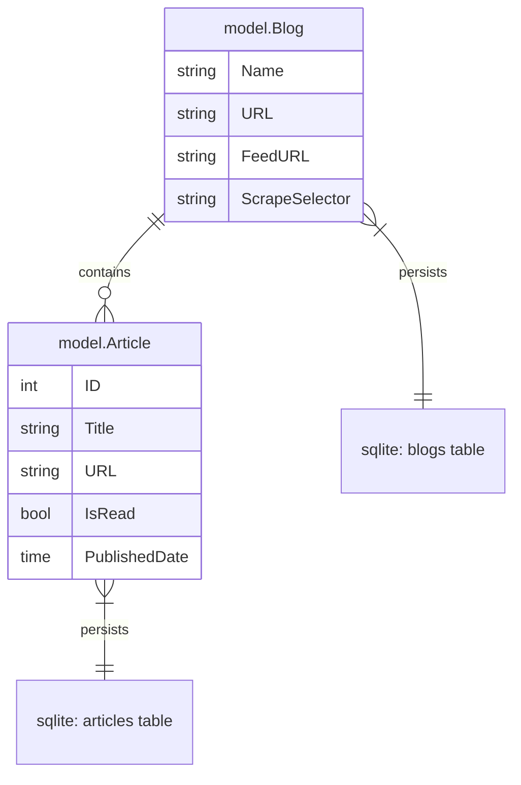
```mermaid
erDiagram
    "model.Blog" ||--o{ "model.Article" : contains
    "model.Blog" {
        string Name
        string URL
        string FeedURL
        string ScrapeSelector
    }
    "model.Article" {
        int ID
        string Title
        string URL
        bool IsRead
        time PublishedDate
    }
    "model.Blog" }|--|| "sqlite: blogs table" : persists
    "model.Article" }|--|| "sqlite: articles table" : persists
```

Sources: [CLAUDE.md:21-25](), [README.md:126-130]()

#### Ingestion Pipeline

The `internal/scanner` package coordinates the fetching of new content. It utilizes `internal/rss` for standard feeds and `internal/scraper` (powered by `goquery`) for HTML-based discovery.

1.  **RSS Check**: Attempt to parse the configured or discovered feed URL.
2.  **Scraper Fallback**: If RSS fails and a `scrape_selector` is provided, the system parses the HTML of the blog's homepage to find article links.
3.  **Deduplication**: New articles are checked against existing URLs in the database to prevent duplicate entries.

Sources: [README.md:98-105](), [SKILL.md:11]()

### Development and Requirements

- **Language**: Go 1.24+ [README.md:135]()
- **Database**: SQLite [CLAUDE.md:29]()
- **Key Libraries**: `cobra` (CLI), `gofeed` (RSS), `goquery` (Scraping) [CLAUDE.md:28-33]()

For information on how to build the project or contribute to the codebase, refer to the [Contributing and Development Guidelines](#6) page.

---

# Page: Getting Started

# Getting Started

<details>
<summary>Relevant source files</summary>

The following files were used as context for generating this wiki page:

- [.github/workflows/release.yml](.github/workflows/release.yml)
- [.goreleaser.yaml](.goreleaser.yaml)
- [README.md](README.md)
- [go.mod](go.mod)

</details>

This page provides technical instructions for installing, configuring, and performing the initial setup of `blogwatcher`. It covers the distribution mechanisms, the local build process, and the underlying storage initialization.

## Installation

`blogwatcher` can be installed via package managers, pre-compiled binaries, or by building from source. The project uses **GoReleaser** to automate the creation of cross-platform artifacts [ .goreleaser.yaml:1-30 ]().

### Homebrew (macOS/Linux)

The project maintains a custom Homebrew tap. The formula is automatically updated during the release process [ .goreleaser.yaml:38-51 ]().

```bash
brew install Hyaxia/tap/blogwatcher
```

### Manual Build from Source

Building from source requires **Go 1.24+** [ README.md:133-135 ]().

```bash
# Using go install (installs to $GOPATH/bin)
go install github.com/Hyaxia/blogwatcher/cmd/blogwatcher@latest

# Local build
git clone https://github.com/Hyaxia/blogwatcher.git
cd blogwatcher
go build ./cmd/blogwatcher
```

### Continuous Integration and Release

The release pipeline is managed via GitHub Actions. When a version tag (e.g., `v1.0.0`) is pushed, the `release.yml` workflow triggers [ .github/workflows/release.yml:3-6 ](). It installs `mingw-w64` to support CGO-based cross-compilation for Windows [ .github/workflows/release.yml:24-25 ]() and executes GoReleaser to publish binaries and update the Homebrew formula [ .github/workflows/release.yml:27-35 ]().

**Sources:** [ .goreleaser.yaml:1-51 ](), [ .github/workflows/release.yml:1-35 ](), [ README.md:14-27 ](), [ README.md:131-135 ]().

---

## First-Run and Data Location

Upon the first execution of any command, `blogwatcher` initializes its local environment. The application uses a persistent SQLite database to store tracking information.

### Database Location

The database is stored in the user's home directory:
`~/.blogwatcher/blogwatcher.db` [ README.md:126 ]().

### Schema Initialization

The system automatically creates two primary tables if they do not exist [ README.md:128-129 ]():

1.  **`blogs`**: Stores metadata for tracked sites (Name, URL, Feed URL, and CSS Scrape Selectors).
2.  **`articles`**: Stores discovered posts (Title, URL, Publish Date, and Read/Unread status).

### Data Flow: CLI to Storage

The following diagram illustrates how a CLI command triggers the initialization and interaction with the storage layer.

**System Initialization and Data Flow**

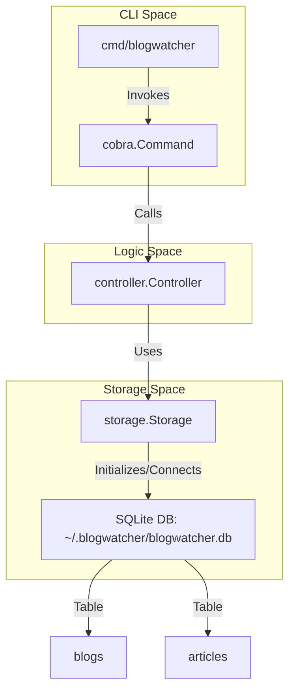
```mermaid
graph TD
    subgraph "CLI Space"
        A["cmd/blogwatcher"] -- "Invokes" --> B["cobra.Command"]
    end

    subgraph "Logic Space"
        B -- "Calls" --> C["controller.Controller"]
    end

    subgraph "Storage Space"
        C -- "Uses" --> D["storage.Storage"]
        D -- "Initializes/Connects" --> E["SQLite DB: ~/.blogwatcher/blogwatcher.db"]
    end

    E -- "Table" --> F["blogs"]
    E -- "Table" --> G["articles"]
```

**Sources:** [ README.md:124-130 ](), [ go.mod:9-10 ]().

---

## Quick-Start Walkthrough

Once installed, use these core commands to begin tracking content.

### 1. Adding a Blog

The `add` command registers a new source. `blogwatcher` attempts to auto-discover RSS/Atom feeds by looking for `<link rel="alternate">` tags or checking common paths like `/feed` or `/rss` [ README.md:106-112 ]().

```bash
# Auto-discovery
blogwatcher add "My Favorite Blog" https://example.com/blog

# Explicit RSS URL
blogwatcher add "Tech Blog" https://techblog.com --feed-url https://techblog.com/rss.xml

# HTML Scraping Fallback (for sites without RSS)
blogwatcher add "No-RSS Blog" https://norss.com --scrape-selector "article h2 a"
```

### 2. Scanning for Content

The `scan` command triggers the ingestion pipeline. It prioritizes RSS feeds and falls back to the `scrape-selector` if configured [ README.md:98-105 ]().

```bash
# Scan everything
blogwatcher scan
```

### 3. Reading Articles

List unread articles and manage their status using the unique ID provided in the list output.

```bash
# View unread
blogwatcher articles

# Mark as read (ID: 42)
blogwatcher read 42
```

### Core CLI Command Mapping

The following diagram maps the CLI commands to their respective operations within the `controller` package.

**CLI to Controller Mapping**

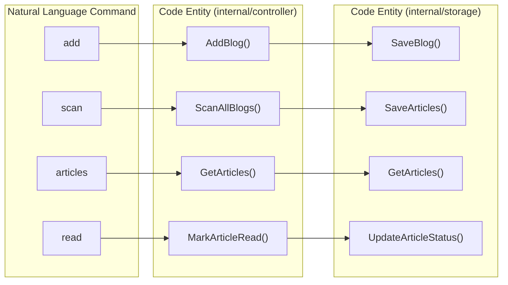
```mermaid
graph LR
    subgraph "Natural Language Command"
        CMD_ADD["add"]
        CMD_SCAN["scan"]
        CMD_LIST["articles"]
        CMD_READ["read"]
    end

    subgraph "Code Entity (internal/controller)"
        CMD_ADD --> CTRL_ADD["AddBlog()"]
        CMD_SCAN --> CTRL_SCAN["ScanAllBlogs()"]
        CMD_LIST --> CTRL_GET["GetArticles()"]
        CMD_READ --> CTRL_MARK["MarkArticleRead()"]
    end

    subgraph "Code Entity (internal/storage)"
        CTRL_ADD --> DB_SAVE_B["SaveBlog()"]
        CTRL_SCAN --> DB_SAVE_A["SaveArticles()"]
        CTRL_GET --> DB_LOAD["GetArticles()"]
        CTRL_MARK --> DB_UPDATE["UpdateArticleStatus()"]
    end
```

**Sources:** [ README.md:29-94 ](), [ README.md:96-122 ]().

---

## Technical Dependencies

The project leverages several key Go libraries to provide its functionality:

| Dependency                       | Purpose                                                              |
| :------------------------------- | :------------------------------------------------------------------- |
| `github.com/spf13/cobra`         | CLI framework and command routing [ go.mod:9 ]().                    |
| `modernc.org/sqlite`             | CGO-free SQLite implementation for data persistence [ go.mod:10 ](). |
| `github.com/mmcdole/gofeed`      | Robust parsing of RSS and Atom feeds [ go.mod:8 ]().                 |
| `github.com/PuerkitoBio/goquery` | HTML parsing and CSS selection for scraping [ go.mod:6 ]().          |
| `github.com/fatih/color`         | Terminal color output for the CLI [ go.mod:7 ]().                    |

**Sources:** [ go.mod:1-11 ]().

---

# Page: CLI Command Reference

# CLI Command Reference

<details>
<summary>Relevant source files</summary>

The following files were used as context for generating this wiki page:

- [README.md](README.md)
- [internal/cli/commands.go](internal/cli/commands.go)
- [internal/cli/errors.go](internal/cli/errors.go)
- [internal/cli/root.go](internal/cli/root.go)

</details>

This page provides a detailed technical reference for the `blogwatcher` command-line interface. The CLI is built using the [spf13/cobra](https://github.com/spf13/cobra) library and serves as the primary entry point for managing blogs, articles, and scanning operations.

## Overview

The CLI acts as a thin wrapper around the `controller` and `scanner` packages. Every command follows a consistent lifecycle:

1.  **Parsing**: Arguments and flags are parsed by `cobra`.
2.  **Initialization**: The command opens a connection to the SQLite database via `storage.OpenDatabase("")` [internal/cli/commands.go:31-35]().
3.  **Execution**: Logic is delegated to the `controller` or `scanner` packages.
4.  **Output**: Results are formatted and printed to the terminal, often using `fatih/color` for status indicators [internal/cli/commands.go:41]().

### Command Hierarchy

The `NewRootCommand` function in `internal/cli/root.go` assembles the command tree:

| Command    | Function             | Purpose                          |
| :--------- | :------------------- | :------------------------------- |
| `add`      | `newAddCommand`      | Register a new blog for tracking |
| `remove`   | `newRemoveCommand`   | Delete a blog and its articles   |
| `blogs`    | `newBlogsCommand`    | List all tracked blogs           |
| `scan`     | `newScanCommand`     | Ingest new articles from sources |
| `articles` | `newArticlesCommand` | View discovered articles         |
| `read`     | `newReadCommand`     | Mark an article as read          |
| `unread`   | `newUnreadCommand`   | Mark an article as unread        |
| `read-all` | `newReadAllCommand`  | Bulk mark articles as read       |

**Sources:** [internal/cli/root.go:11-29](), [internal/cli/commands.go:20-240]()

---

## Blog Management

### add

Adds a new blog to the database. It triggers an automatic discovery process if no feed URL is provided.

- **Usage**: `blogwatcher add <name> <url> [flags]`
- **Arguments**:
  - `<name>`: A unique display name for the blog.
  - `<url>`: The homepage URL of the blog.
- **Flags**:
  - `--feed-url`: Manually specify the RSS/Atom feed URL.
  - `--scrape-selector`: CSS selector used for HTML scraping fallback if RSS is unavailable.
- **Implementation**: Calls `controller.AddBlog` [internal/cli/commands.go:36]().

### remove

Removes a blog and all associated articles from the database.

- **Usage**: `blogwatcher remove <name> [flags]`
- **Flags**:
  - `-y, --yes`: Skip the interactive confirmation prompt.
- **Implementation**: Calls `controller.RemoveBlog` [internal/cli/commands.go:72]().

### blogs

Displays a list of all currently tracked blogs, including their URLs and the last time they were scanned.

- **Usage**: `blogwatcher blogs`
- **Implementation**: Fetches data using `db.ListBlogs()` [internal/cli/commands.go:94]().

**Sources:** [internal/cli/commands.go:20-121]()

---

## Content Ingestion

### scan

Triggers the scanning engine to look for new articles. It can target all blogs or a specific one.

- **Usage**: `blogwatcher scan [blog_name] [flags]`
- **Flags**:
  - `-s, --silent`: Minimizes output to "scan done" upon completion.
  - `-w, --workers`: Sets the number of concurrent goroutines for scanning (default: 8).
- **Data Flow**:
  - If a name is provided: Calls `scanner.ScanBlogByName` [internal/cli/commands.go:139]().
  - If no name is provided: Calls `scanner.ScanAllBlogs` [internal/cli/commands.go:163]().

### Scan Process Logic

The following diagram illustrates the transition from the CLI command to the internal scanning entities.

**CLI to Scanner Entity Mapping**

```mermaid
graph TD
    subgraph "Natural Language Space"
        "User Command"
        "Concurrency Setting"
        "Target Blog"
    end

    subgraph "Code Entity Space"
        "User Command" --> "newScanCommand()[internal/cli/commands.go]"
        "Concurrency Setting" --> "workers_var[internal/cli/commands.go:125]"
        "Target Blog" --> "args_0[internal/cli/commands.go:138]"

        "newScanCommand()[internal/cli/commands.go]" -- "calls" --> "ScanAllBlogs()[internal/scanner/scanner.go]"
        "newScanCommand()[internal/cli/commands.go]" -- "calls" --> "ScanBlogByName()[internal/scanner/scanner.go]"

        "ScanAllBlogs()[internal/scanner/scanner.go]" -- "uses" --> "worker_pool"
        "ScanBlogByName()[internal/scanner/scanner.go]" -- "returns" --> "ScanResult_struct[internal/scanner/scanner.go]"
    end
```

**Sources:** [internal/cli/commands.go:123-193](), [internal/scanner/scanner.go:1-50]()

---

## Article Management

### articles

Lists discovered articles stored in the database.

- **Usage**: `blogwatcher articles [flags]`
- **Flags**:
  - `-a, --all`: Include articles already marked as read.
  - `-b, --blog`: Filter the list to a specific blog name.
- **Implementation**: Calls `controller.GetArticles` [internal/cli/commands.go:208]().

### read / unread

Updates the status of a specific article.

- **Usage**: `blogwatcher read <article_id>` or `blogwatcher unread <article_id>`
- **Arguments**:
  - `<article_id>`: The integer ID shown in the `articles` list.
- **Implementation**: Calls `controller.MarkArticleRead` [internal/cli/commands.go:254]() or `controller.MarkArticleUnread`.

### read-all

Marks all unread articles as read, optionally filtered by blog.

- **Usage**: `blogwatcher read-all [flags]`
- **Flags**:
  - `-b, --blog`: Only mark articles from this blog as read.
  - `-y, --yes`: Skip confirmation prompt.
- **Implementation**: Calls `controller.MarkAllArticlesRead` [internal/cli/commands.go:303]().

---

## Error Handling and Exit Codes

The CLI uses a custom error wrapper to prevent double-printing of errors when a command fails.

- **`printedError`**: A struct used to signal that an error has already been displayed to the user via `printError` [internal/cli/errors.go:5-11]().
- **`markError`**: Wraps an error in `printedError` [internal/cli/errors.go:13-18]().
- **`Execute`**: The main entry point checks `isPrinted(err)` to decide whether to output the error message to `stderr` before calling `os.Exit(1)` [internal/cli/root.go:31-38]().

### CLI Command Execution Flow

**Command Execution Logic**

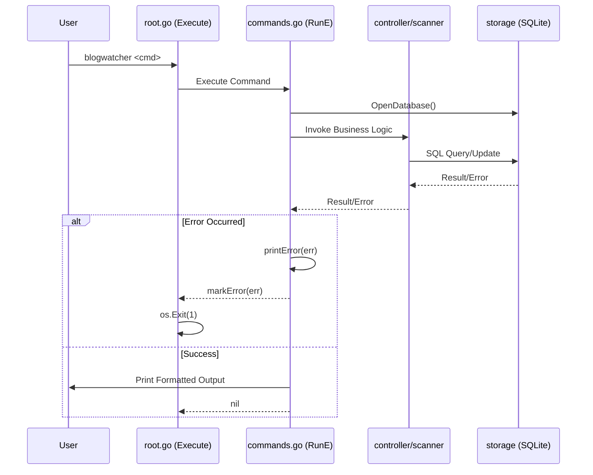
```mermaid
sequenceDiagram
    participant U as User
    participant R as root.go (Execute)
    participant C as commands.go (RunE)
    participant L as controller/scanner
    participant D as storage (SQLite)

    U->>R: blogwatcher <cmd>
    R->>C: Execute Command
    C->>D: OpenDatabase()
    C->>L: Invoke Business Logic
    L->>D: SQL Query/Update
    D-->>L: Result/Error
    L-->>C: Result/Error
    alt Error Occurred
        C->>C: printError(err)
        C-->>R: markError(err)
        R->>R: os.Exit(1)
    else Success
        C->>U: Print Formatted Output
        C-->>R: nil
    end
```

**Sources:** [internal/cli/root.go:31-38](), [internal/cli/errors.go:1-24](), [internal/cli/commands.go:28-42]()

---

# Page: Architecture Overview

# Architecture Overview

<details>
<summary>Relevant source files</summary>

The following files were used as context for generating this wiki page:

- [CLAUDE.md](CLAUDE.md)
- [LICENSE](LICENSE)
- [SKILL.md](SKILL.md)
- [cmd/blogwatcher/main.go](cmd/blogwatcher/main.go)

</details>

BlogWatcher is built using a layered Go architecture designed for modularity and testability. The system transitions from a CLI entry point through a central controller that orchestrates specialized packages for data persistence and content ingestion.

### System Architecture Layers

The codebase is organized into four primary layers, each with distinct responsibilities:

1.  **Entry Point**: The `cmd/blogwatcher` package initializes the application [cmd/blogwatcher/main.go:5-7]().
2.  **Interface Layer**: The `internal/cli` package uses the Cobra library to handle command-line arguments, flags, and user-facing output [SKILL.md:9-9]().
3.  **Orchestration Layer**: The `internal/controller` package serves as the "brain" of the application, coordinating business logic between the CLI and the underlying storage and scanning systems [SKILL.md:10-10]().
4.  **Service & Infrastructure Layer**:
    - `internal/storage`: Manages the SQLite database and CRUD operations [CLAUDE.md:21-24]().
    - `internal/scanner`: Orchestrates the discovery of new content via RSS or HTML scraping [SKILL.md:11-11]().

### Data Flow and Component Interaction

The following diagram illustrates how a user request (e.g., adding a blog or scanning for updates) flows through the system entities.

**Diagram: Request Execution Flow**

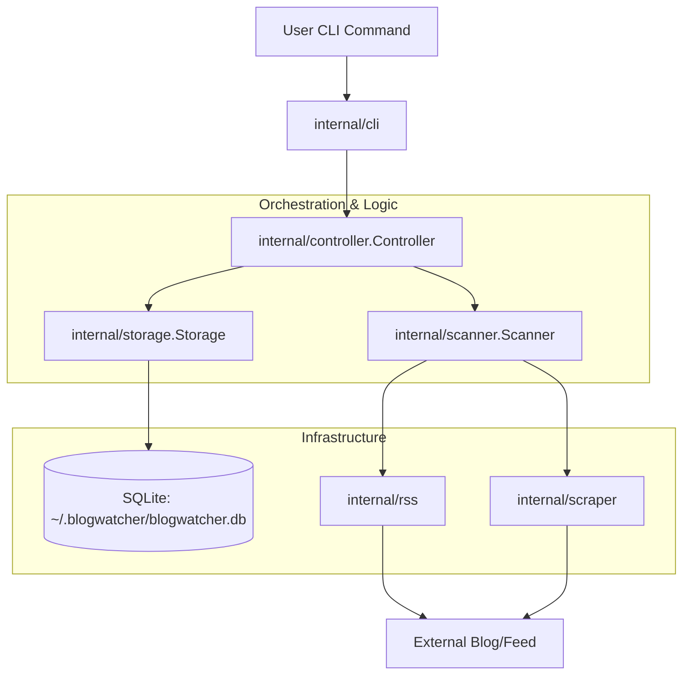
```mermaid
graph TD
    User["User CLI Command"] --> CLI["internal/cli"]
    CLI --> CTRL["internal/controller.Controller"]

    subgraph "Orchestration & Logic"
        CTRL --> STORE["internal/storage.Storage"]
        CTRL --> SCAN["internal/scanner.Scanner"]
    end

    subgraph "Infrastructure"
        STORE --> DB[("SQLite: ~/.blogwatcher/blogwatcher.db")]
        SCAN --> RSS["internal/rss"]
        SCAN --> SCRAPE["internal/scraper"]
    end

    RSS --> Web["External Blog/Feed"]
    SCRAPE --> Web
```

**Sources:** [SKILL.md:9-12](), [CLAUDE.md:21-25]()

---

### Core Components

#### [Data Models](#2.1)

The system relies on two primary entities defined in the `internal/model` package: `Blog` and `Article`. These structs serve as the common language between the scanner, controller, and storage layers.

- **Blog**: Represents a tracked site, including its RSS feed URL or HTML scraping selectors [CLAUDE.md:23-23]().
- **Article**: Represents an individual post discovered during a scan, tracking its read/unread status [CLAUDE.md:24-24]().

For details, see [Data Models](#2.1).

#### [Controller Layer](#2.2)

The `internal/controller` package ensures the CLI remains thin. It handles high-level operations such as `AddBlog`, `RemoveBlog`, and `MarkArticleRead`. It is responsible for translating CLI requests into database transactions and scanning jobs, while enforcing business rules (e.g., preventing duplicate blogs).

For details, see [Controller Layer](#2.2).
**Sources:** [SKILL.md:19-20]()

#### [Storage Layer](#2.3)

Persistence is handled by `internal/storage` using a SQLite backend located at `~/.blogwatcher/blogwatcher.db` [CLAUDE.md:22-22](). This layer manages the schema initialization and provides an abstraction for querying and updating blog and article records.

For details, see [Storage Layer](#2.3).
**Sources:** [SKILL.md:21-21](), [CLAUDE.md:29-29]()

#### Content Ingestion Pipeline

Discovery of new content is delegated to the `internal/scanner` package. It utilizes a fallback strategy:

1.  **RSS/Atom**: Handled by `internal/rss` using the `gofeed` library [CLAUDE.md:30-30]().
2.  **HTML Scraping**: If no feed is found, `internal/scraper` uses `goquery` to extract articles based on CSS selectors [CLAUDE.md:31-31]().

For details, see [Content Ingestion Pipeline](#3).
**Sources:** [SKILL.md:22-22]()

---

# Page: Data Models

# Data Models

<details>
<summary>Relevant source files</summary>

The following files were used as context for generating this wiki page:

- [CLAUDE.md](CLAUDE.md)
- [internal/model/model.go](internal/model/model.go)
- [internal/storage/database.go](internal/storage/database.go)

</details>

The core of BlogWatcher revolves around two primary data structures: `model.Blog` and `model.Article`. These structures represent the entities tracked by the system and are mapped directly to a SQLite database for persistence.

## Core Entities

The models are defined in the `internal/model` package and serve as the standard data transfer format between the CLI, Controller, and Storage layers.

### Blog Model

The `Blog` struct represents a content source. It contains the necessary metadata for identification and the configuration required for the [Scanner Orchestration](3.1) to retrieve new content.

| Field            | Type         | Description                                                  |
| :--------------- | :----------- | :----------------------------------------------------------- |
| `ID`             | `int64`      | Primary key assigned by the database.                        |
| `Name`           | `string`     | A unique human-readable identifier for the blog.             |
| `URL`            | `string`     | The base URL of the blog website.                            |
| `FeedURL`        | `string`     | The discovered or provided RSS/Atom feed URL.                |
| `ScrapeSelector` | `string`     | CSS selector used for HTML scraping if no feed is available. |
| `LastScanned`    | `*time.Time` | Pointer to the timestamp of the last successful scan.        |

Sources: [internal/model/model.go:5-12]()

### Article Model

The `Article` struct represents an individual post discovered during a scan. It maintains a relationship to a parent `Blog` via a foreign key.

| Field            | Type         | Description                                             |
| :--------------- | :----------- | :------------------------------------------------------ |
| `ID`             | `int64`      | Primary key assigned by the database.                   |
| `BlogID`         | `int64`      | Foreign key referencing `blogs.id`.                     |
| `Title`          | `string`     | The title of the article.                               |
| `URL`            | `string`     | The unique permalink to the article.                    |
| `PublishedDate`  | `*time.Time` | When the article was published (parsed from feed/HTML). |
| `DiscoveredDate` | `*time.Time` | When BlogWatcher first saw the article.                 |
| `IsRead`         | `bool`       | Toggle for unread/read status management.               |

Sources: [internal/model/model.go:14-22]()

## Code-to-Schema Mapping

The following diagram illustrates how the Go structs in `model.go` map to the physical tables managed by the `Database` struct in `internal/storage`.

**Entity Mapping Diagram**

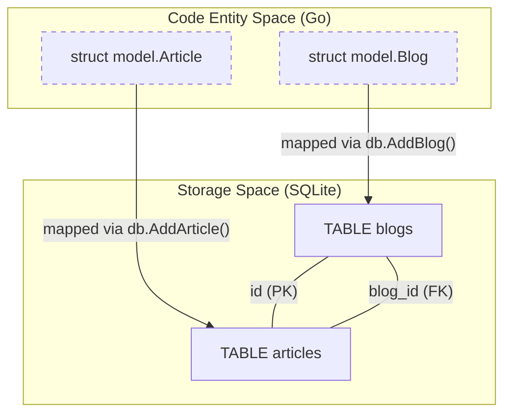
```mermaid
graph TD
    subgraph "Code Entity Space (Go)"
        M_Blog["struct model.Blog"]
        M_Article["struct model.Article"]
    end

    subgraph "Storage Space (SQLite)"
        T_Blogs["TABLE blogs"]
        T_Articles["TABLE articles"]
    end

    M_Blog -- "mapped via db.AddBlog()" --> T_Blogs
    M_Article -- "mapped via db.AddArticle()" --> T_Articles

    T_Blogs -- "id (PK)" --- T_Articles
    T_Articles -- "blog_id (FK)" --- T_Blogs

    style M_Blog stroke-dasharray: 5 5
    style M_Article stroke-dasharray: 5 5
```

Sources: [internal/model/model.go:5-22](), [internal/storage/database.go:71-90]()

## Database Schema Implementation

The schema is initialized automatically by the `db.init()` method when `OpenDatabase` is called. It uses SQLite-specific types and constraints to ensure data integrity.

### Table: blogs

The `blogs` table stores source configuration. The `url` field is enforced as `UNIQUE` to prevent duplicate tracking of the same site.

- **SQL Definition**: [internal/storage/database.go:72-79]()

### Table: articles

The `articles` table stores post metadata. It includes a `FOREIGN KEY` constraint on `blog_id` which is enforced by the database driver via `_pragma=foreign_keys(1)`.

- **SQL Definition**: [internal/storage/database.go:80-89]()
- **Connection String**: [internal/storage/database.go:45]()

## Data Flow and Persistence

When data moves from the ingestion pipeline into the database, the `internal/storage` package handles the translation of Go types (specifically `time.Time` and optional strings) into SQLite-compatible formats.

**Data Flow: Article Discovery to Persistence**

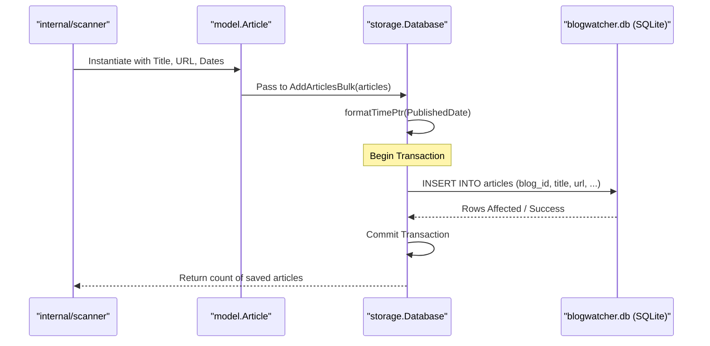
```mermaid
sequenceDiagram
    participant S as "internal/scanner"
    participant M as "model.Article"
    participant D as "storage.Database"
    participant DB as "blogwatcher.db (SQLite)"

    S->>M: Instantiate with Title, URL, Dates
    M->>D: Pass to AddArticlesBulk(articles)
    D->>D: formatTimePtr(PublishedDate)
    Note over D: Begin Transaction
    D->>DB: INSERT INTO articles (blog_id, title, url, ...)
    DB-->>D: Rows Affected / Success
    D->>D: Commit Transaction
    D-->>S: Return count of saved articles
```

Sources: [internal/storage/database.go:207-240](), [internal/storage/database.go:340-346]()

### Key Transformation Functions

- **`nullIfEmpty(string)`**: Converts empty Go strings to SQL `NULL` values for `feed_url` and `scrape_selector`. [internal/storage/database.go:101-102]()
- **`formatTimePtr(*time.Time)`**: Converts Go pointers to formatted strings using `time.RFC3339Nano` for SQLite `TIMESTAMP` compatibility. [internal/storage/database.go:17](), [internal/storage/database.go:340-346]()
- **`scanBlog` / `scanArticle`**: Internal helpers that perform the inverse operation, scanning SQL rows back into the Go structs. [internal/storage/database.go:283-338]()

Sources: [internal/storage/database.go:1-350]()

---

# Page: Controller Layer

# Controller Layer

<details>
<summary>Relevant source files</summary>

The following files were used as context for generating this wiki page:

- [internal/controller/controller.go](internal/controller/controller.go)
- [internal/controller/controller_test.go](internal/controller/controller_test.go)

</details>

The `controller` package serves as the orchestration layer of the BlogWatcher application. It sits between the Command Line Interface (CLI) and the `storage` package, encapsulating the business logic required to manage blogs and articles. Its primary responsibility is to validate requests, handle entity lookups, and coordinate multiple storage operations into cohesive high-level actions.

### Core Responsibilities

The controller layer implements several key functions:

- **Validation**: Ensuring uniqueness for blog names and URLs before insertion [internal/controller/controller.go:35-45]().
- **Filtering**: Processing user-facing filters (like "show all" or "filter by blog name") into database queries [internal/controller/controller.go:68-79]().
- **State Management**: Handling the transitions of articles between read and unread states [internal/controller/controller.go:97-112, 142-157]().
- **Error Normalization**: Converting low-level database results into domain-specific error types like `BlogNotFoundError` [internal/controller/controller.go:10-16]().

---

### Logic Orchestration Flow

The following diagram illustrates how the `controller` package mediates between the CLI inputs and the `storage.Database` entity.

**Diagram: CLI to Storage Orchestration**

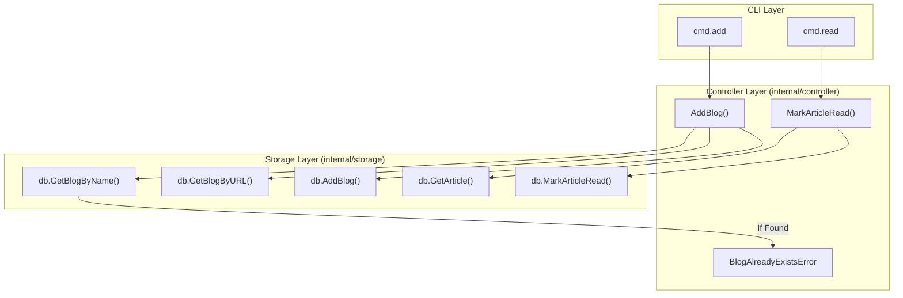
```mermaid
graph TD
    subgraph "CLI Layer"
        CLI_ADD["cmd.add"]
        CLI_READ["cmd.read"]
    end

    subgraph "Controller Layer (internal/controller)"
        ADD_BLOG["AddBlog()"]
        MARK_READ["MarkArticleRead()"]
        ERR_EXIST["BlogAlreadyExistsError"]
    end

    subgraph "Storage Layer (internal/storage)"
        DB_GET_NAME["db.GetBlogByName()"]
        DB_GET_URL["db.GetBlogByURL()"]
        DB_ADD["db.AddBlog()"]
        DB_GET_ART["db.GetArticle()"]
        DB_MARK["db.MarkArticleRead()"]
    end

    CLI_ADD --> ADD_BLOG
    ADD_BLOG --> DB_GET_NAME
    ADD_BLOG --> DB_GET_URL
    DB_GET_NAME -- "If Found" --> ERR_EXIST
    ADD_BLOG --> DB_ADD

    CLI_READ --> MARK_READ
    MARK_READ --> DB_GET_ART
    MARK_READ --> DB_MARK
```

**Sources:** [internal/controller/controller.go:35-54](), [internal/controller/controller.go:97-112]()

---

### Key Functions

#### Blog Management

The controller ensures data integrity when modifying the blog list.

| Function     | Description                  | Key Logic                                                                                                                                      |
| :----------- | :--------------------------- | :--------------------------------------------------------------------------------------------------------------------------------------------- |
| `AddBlog`    | Registers a new blog source. | Checks `db.GetBlogByName` and `db.GetBlogByURL` to prevent duplicates before calling `db.AddBlog` [internal/controller/controller.go:35-54](). |
| `RemoveBlog` | Deletes a blog by name.      | Resolves the `Name` to an `ID` via `db.GetBlogByName` and throws `BlogNotFoundError` if missing [internal/controller/controller.go:56-66]().   |

#### Article Interaction

The controller manages the retrieval and status updates of ingested articles.

- **`GetArticles`**: Fetches articles based on visibility and source. It resolves the `blogName` string to a `blogID` and joins the results with a map of blog IDs to names for display purposes [internal/controller/controller.go:68-95]().
- **`MarkArticleRead` / `MarkArticleUnread`**: These functions perform a "check-then-act" pattern. They retrieve the current state of the article via `db.GetArticle`, verify it exists, and only invoke the storage update if the state actually needs to change [internal/controller/controller.go:97-112, 142-157]().
- **`MarkAllArticlesRead`**: Iterates through all unread articles (optionally filtered by blog) and marks each as read [internal/controller/controller.go:114-140]().

**Sources:** [internal/controller/controller.go:68-157]()

---

### Domain Error Types

The package defines specific error structures to provide the CLI with actionable feedback.

| Error Type               | Fields                         | Context                                                                                                          |
| :----------------------- | :----------------------------- | :--------------------------------------------------------------------------------------------------------------- |
| `BlogNotFoundError`      | `Name string`                  | Returned when a requested blog name does not exist in the database [internal/controller/controller.go:10-16]().  |
| `BlogAlreadyExistsError` | `Field string`, `Value string` | Returned by `AddBlog` if the Name or URL is already taken [internal/controller/controller.go:18-25]().           |
| `ArticleNotFoundError`   | `ID int64`                     | Returned when attempting to modify an article ID that doesn't exist [internal/controller/controller.go:27-33](). |

**Sources:** [internal/controller/controller.go:10-33]()

---

### Data Flow: Article Retrieval

This diagram maps the code entities involved in filtering articles from the database up to the controller's return values.

**Diagram: Article Filtering Data Flow**

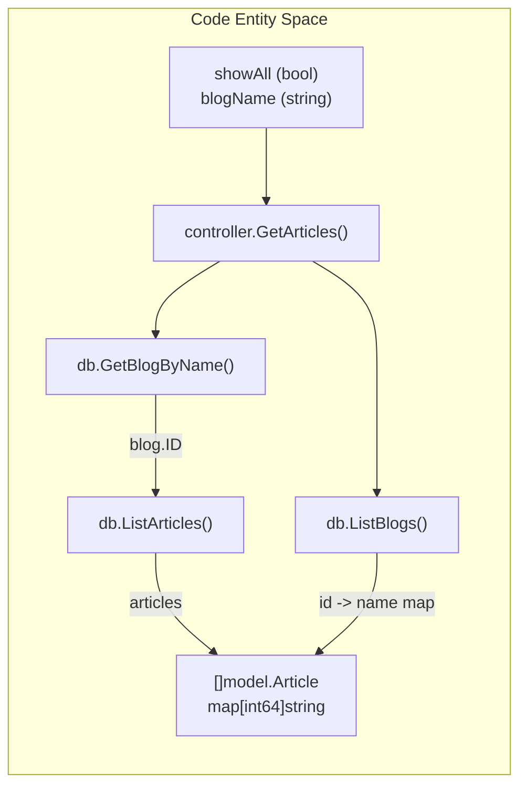
```mermaid
flowchart LR
    subgraph "Code Entity Space"
        Input["showAll (bool)<br/>blogName (string)"]

        CONTROLLER["controller.GetArticles()"]

        DB_BLOG["db.GetBlogByName()"]
        DB_LIST_ART["db.ListArticles()"]
        DB_LIST_BLOGS["db.ListBlogs()"]

        OUTPUT["[]model.Article<br/>map[int64]string"]
    end

    Input --> CONTROLLER
    CONTROLLER --> DB_BLOG
    DB_BLOG -- "blog.ID" --> DB_LIST_ART
    CONTROLLER --> DB_LIST_BLOGS
    DB_LIST_ART -- "articles" --> OUTPUT
    DB_LIST_BLOGS -- "id -> name map" --> OUTPUT
```

**Sources:** [internal/controller/controller.go:68-95]()

---

### Implementation Details & Testing

The controller relies on the `storage.Database` interface for all persistence. In testing, the package uses a temporary SQLite database initialized via `storage.OpenDatabase` to verify that business rules (like duplicate prevention) are enforced correctly [internal/controller/controller_test.go:92-100]().

- **Duplicate Handling**: `AddBlog` explicitly checks both the Name and the URL separately to ensure `BlogAlreadyExistsError` identifies the specific conflicting field [internal/controller/controller.go:38-45]().
- **State Returns**: Methods like `MarkArticleRead` return the _original_ state of the article before the update, allowing the caller to determine if an action was actually performed [internal/controller/controller_test.go:46-60]().

**Sources:** [internal/controller/controller_test.go:11-31, 46-60](), [internal/controller/controller.go:35-54]()

---

# Page: Storage Layer

# Storage Layer

<details>
<summary>Relevant source files</summary>

The following files were used as context for generating this wiki page:

- [internal/storage/database.go](internal/storage/database.go)
- [internal/storage/database_test.go](internal/storage/database_test.go)

</details>

The Storage Layer provides a persistence interface for BlogWatcher using SQLite. It handles schema initialization, CRUD operations for blogs and articles, and efficient bulk operations. The implementation is contained within the `internal/storage` package.

### Database Initialization and Configuration

The `OpenDatabase` function serves as the entry point for the storage layer. It ensures the target directory exists and establishes a connection using the `modernc.org/sqlite` driver [internal/storage/database.go:32-57]().

#### SQLite Pragmas

The connection string includes specific pragmas to ensure data integrity and performance:

- `busy_timeout(5000)`: Sets a 5-second timeout for lock contention [internal/storage/database.go:45]().
- `foreign_keys(1)`: Enforces referential integrity between blogs and articles [internal/storage/database.go:45]().

#### Schema Management

The `init()` method executes the DDL statements to create the `blogs` and `articles` tables if they do not exist [internal/storage/database.go:70-93]().

| Table      | Purpose                             | Key Constraints                                                       |
| :--------- | :---------------------------------- | :-------------------------------------------------------------------- |
| `blogs`    | Stores metadata about tracked sites | `url` (UNIQUE) [internal/storage/database.go:75]()                    |
| `articles` | Stores discovered content           | `url` (UNIQUE), `blog_id` (FK) [internal/storage/database.go:84-88]() |

**Sources:** [internal/storage/database.go:32-93]()

### Data Flow: Blog and Article Persistence

The following diagram illustrates the transition from the `model` structs to the `Database` methods and finally to the SQLite file.

**Diagram: Entity Persistence Flow**

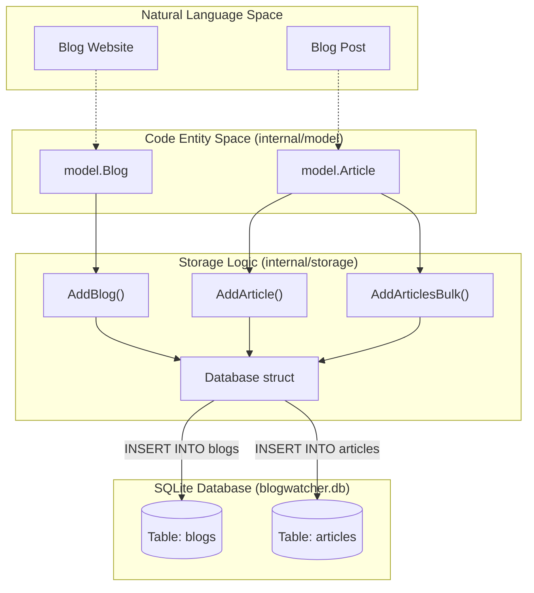
```mermaid
graph TD
    subgraph "Natural Language Space"
        BlogEntity["Blog Website"]
        ArticleEntity["Blog Post"]
    end

    subgraph "Code Entity Space (internal/model)"
        MB["model.Blog"]
        MA["model.Article"]
    end

    subgraph "Storage Logic (internal/storage)"
        DB["Database struct"]
        AddB["AddBlog()"]
        AddA["AddArticle()"]
        BulkA["AddArticlesBulk()"]
    end

    subgraph "SQLite Database (blogwatcher.db)"
        T1[("Table: blogs")]
        T2[("Table: articles")]
    end

    BlogEntity -.-> MB
    ArticleEntity -.-> MA

    MB --> AddB
    MA --> AddA
    MA --> BulkA

    AddB --> DB
    AddA --> DB
    BulkA --> DB

    DB -- "INSERT INTO blogs" --> T1
    DB -- "INSERT INTO articles" --> T2
```

**Sources:** [internal/storage/database.go:27-30](), [internal/storage/database.go:95-114](), [internal/storage/database.go:185-205](), [internal/storage/database.go:207-240]()

### CRUD Methods

#### Blog Management

The `Database` struct provides methods to manage blog metadata:

- **Create**: `AddBlog` inserts a new record and returns the assigned ID [internal/storage/database.go:95-114]().
- **Read**: Blogs can be retrieved by ID (`GetBlog`), Name (`GetBlogByName`), or URL (`GetBlogByURL`) [internal/storage/database.go:116-129]().
- **Update**: `UpdateBlog` and `UpdateBlogLastScanned` handle metadata and timestamp updates [internal/storage/database.go:151-167]().
- **Delete**: `RemoveBlog` performs a cascading manual delete, removing articles associated with the blog before the blog itself [internal/storage/database.go:169-183]().

#### Article Management

- **Bulk Insert**: `AddArticlesBulk` uses a single transaction and a prepared statement to ingest multiple articles efficiently, rolling back on any failure [internal/storage/database.go:207-240]().
- **Existence Checking**: `ArticleExists` and `GetExistingArticleURLs` allow the scanner to skip previously ingested content [internal/storage/database.go:252-263](). `GetExistingArticleURLs` processes URLs in chunks of 900 to stay within SQLite parameter limits [internal/storage/database.go:271-285]().
- **Filtering**: `ListArticles` supports filtering by `unreadOnly` status and specific `blogID` [internal/storage/database.go:294-323]().

**Sources:** [internal/storage/database.go:95-323]()

### Time Serialization and Serialization Helpers

SQLite does not have a native high-precision Date type. The storage layer standardizes on `time.RFC3339Nano` for string serialization [internal/storage/database.go:17]().

#### Helper Functions

- `formatTimePtr`: Converts `*time.Time` to a nullable string for SQL insertion [internal/storage/database.go:421-427]().
- `parseTimePtr`: Converts SQL strings back into `*time.Time` objects [internal/storage/database.go:429-436]().
- `nullIfEmpty`: Converts empty strings to `nil` to ensure `NULL` is stored in the database instead of empty text [internal/storage/database.go:414-420]().

**Sources:** [internal/storage/database.go:414-436](), [internal/storage/database.go:17]()

### Database Interaction Lifecycle

The following diagram shows how the `Database` object manages the connection lifecycle and handles query execution.

**Diagram: Database Operation Lifecycle**

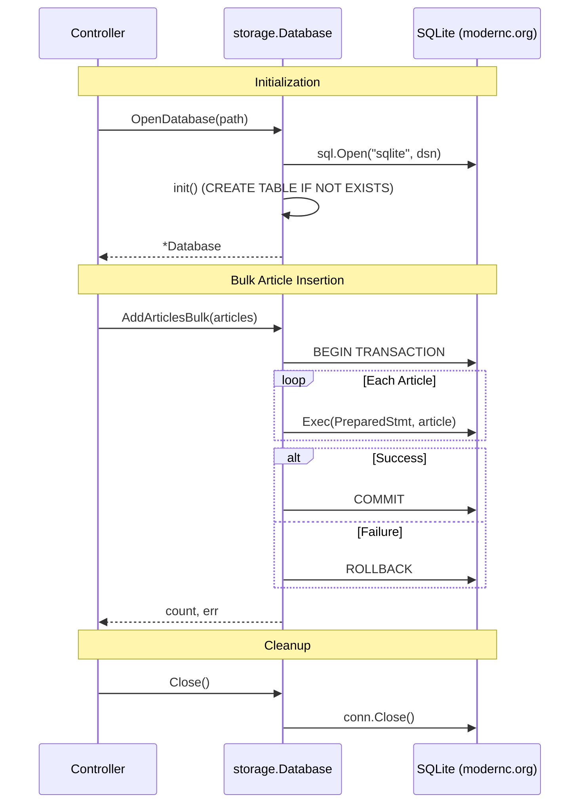
```mermaid
sequenceDiagram
    participant C as Controller
    participant D as storage.Database
    participant S as SQLite (modernc.org)

    Note over C, S: Initialization
    C->>D: OpenDatabase(path)
    D->>S: sql.Open("sqlite", dsn)
    D->>D: init() (CREATE TABLE IF NOT EXISTS)
    D-->>C: *Database

    Note over C, S: Bulk Article Insertion
    C->>D: AddArticlesBulk(articles)
    D->>S: BEGIN TRANSACTION
    loop Each Article
        D->>S: Exec(PreparedStmt, article)
    end
    alt Success
        D->>S: COMMIT
    else Failure
        D->>S: ROLLBACK
    end
    D-->>C: count, err

    Note over C, S: Cleanup
    C->>D: Close()
    D->>S: conn.Close()
```

**Sources:** [internal/storage/database.go:32-57](), [internal/storage/database.go:207-240](), [internal/storage/database.go:63-68]()

---

# Page: Content Ingestion Pipeline

# Content Ingestion Pipeline

<details>
<summary>Relevant source files</summary>

The following files were used as context for generating this wiki page:

- [internal/scanner/scanner.go](internal/scanner/scanner.go)
- [internal/scanner/scanner_test.go](internal/scanner/scanner_test.go)

</details>

The Content Ingestion Pipeline is the core engine of BlogWatcher, responsible for discovering, fetching, and normalizing article data from disparate web sources. It manages a tiered strategy that prioritizes structured data (RSS/Atom) while providing a robust fallback to DOM-based scraping for blogs without active feeds.

### Pipeline Architecture

The pipeline operates as a coordinated workflow managed by the `scanner` package. It interacts with the `storage` layer to persist results and utilizes specialized packages for network communication and parsing.

#### Data Flow and Entity Mapping

The following diagram illustrates how high-level ingestion steps map to specific code entities and functions within the `internal/scanner`, `internal/rss`, and `internal/scraper` packages.

**Ingestion Sequence Diagram**

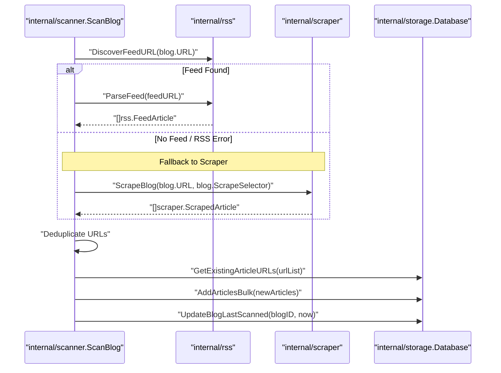
```mermaid
sequenceDiagram
    participant C as "internal/scanner.ScanBlog"
    participant R as "internal/rss"
    participant S as "internal/scraper"
    participant DB as "internal/storage.Database"

    C->>R: "DiscoverFeedURL(blog.URL)"
    alt Feed Found
        C->>R: "ParseFeed(feedURL)"
        R-->>C: "[]rss.FeedArticle"
    else No Feed / RSS Error
        Note over C, S: Fallback to Scraper
        C->>S: "ScrapeBlog(blog.URL, blog.ScrapeSelector)"
        S-->>C: "[]scraper.ScrapedArticle"
    end
    C->>C: "Deduplicate URLs"
    C->>DB: "GetExistingArticleURLs(urlList)"
    C->>DB: "AddArticlesBulk(newArticles)"
    C->>DB: "UpdateBlogLastScanned(blogID, now)"
```

Sources: [internal/scanner/scanner.go:21-111](), [internal/scanner/scanner.go:175-201]()

---

### Ingestion Strategies

BlogWatcher employs a multi-stage discovery process to ensure maximum compatibility with different blog platforms.

1.  **RSS/Atom Discovery**: If a `FeedURL` is missing, the system attempts to auto-discover it by inspecting the HTML `<head>` of the base URL [internal/scanner/scanner.go:29-35]().
2.  **Structured Parsing**: If a feed is available, it is parsed using the `rss` package, which handles XML unmarshaling and date normalization [internal/scanner/scanner.go:37-45]().
3.  **Scraper Fallback**: If no feed is found or parsing fails, and a `ScrapeSelector` is defined for the blog, the system falls back to a CSS-selector-based HTML scraper [internal/scanner/scanner.go:47-60]().

For details on these mechanisms, see:

- [RSS Feed Parsing](#3.2)
- [HTML Scraper Fallback](#3.3)

---

### Orchestration and Concurrency

The `scanner` package provides the high-level API used by the controller to trigger updates. It handles the lifecycle of a scan, including worker pool management for bulk operations.

**Worker Pool Logic**
When performing a full scan of all blogs via `ScanAllBlogs`, the system spawns a configurable number of worker goroutines. Each worker opens its own connection to the SQLite database to avoid contention while processing the `job` queue [internal/scanner/scanner.go:134-147]().

**Scan Orchestration Diagram**

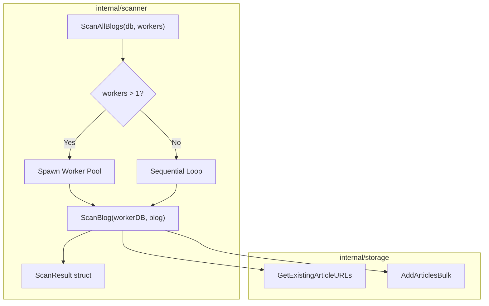
```mermaid
graph TD
    subgraph "internal/scanner"
        A["ScanAllBlogs(db, workers)"] --> B{"workers > 1?"}
        B -- "Yes" --> C["Spawn Worker Pool"]
        B -- "No" --> D["Sequential Loop"]
        C --> E["ScanBlog(workerDB, blog)"]
        D --> E
        E --> F["ScanResult struct"]
    end
    subgraph "internal/storage"
        E --> G["GetExistingArticleURLs"]
        E --> H["AddArticlesBulk"]
    end
```

Sources: [internal/scanner/scanner.go:113-161](), [internal/scanner/scanner.go:13-19]()

For details on the worker model and the `ScanResult` structure, see [Scanner Orchestration](#3.1).

---

### Deduplication Logic

To prevent duplicate entries, the pipeline performs a two-stage deduplication process:

1.  **In-Memory**: Removes duplicate URLs within the same scan result set [internal/scanner/scanner.go:62-70]().
2.  **Database Check**: Queries the `articles` table using `GetExistingArticleURLs` to filter out any URLs that have been previously ingested [internal/scanner/scanner.go:77-90]().

Only truly new articles are passed to `AddArticlesBulk` for persistence [internal/scanner/scanner.go:94]().

Sources: [internal/scanner/scanner.go:62-100](), [internal/scanner/scanner_test.go:136-160]()

---

# Page: Scanner Orchestration

# Scanner Orchestration

<details>
<summary>Relevant source files</summary>

The following files were used as context for generating this wiki page:

- [internal/scanner/scanner.go](internal/scanner/scanner.go)
- [internal/scanner/scanner_test.go](internal/scanner/scanner_test.go)

</details>

The `internal/scanner` package coordinates the content ingestion pipeline. It manages the lifecycle of discovering, fetching, and deduplicating articles from various sources (RSS feeds or HTML scraping) and persisting them to the database.

## Scan Lifecycle

The scanning process follows a tiered discovery strategy. It first attempts to use an RSS feed; if no feed URL is known, it tries to discover one automatically. If RSS fails or returns no results, it falls back to a CSS-selector-based HTML scraper if configured.

### Tiered Discovery Flow

1.  **Feed Discovery**: If `model.Blog.FeedURL` is empty, the scanner calls `rss.DiscoverFeedURL` [internal/scanner/scanner.go:29-35](). If found, the database is updated with the new feed URL.
2.  **RSS Parsing**: If a feed URL exists, `rss.ParseFeed` is invoked [internal/scanner/scanner.go:38]().
3.  **Scraper Fallback**: If RSS returns zero articles and `model.Blog.ScrapeSelector` is defined, `scraper.ScrapeBlog` is invoked [internal/scanner/scanner.go:47-48]().
4.  **Deduplication**: The scanner filters results against existing database records to ensure only new content is saved.

### Scan Coordination Diagram

The following diagram illustrates how `ScanBlog` orchestrates the transition from raw web content to structured `model.Article` entities.

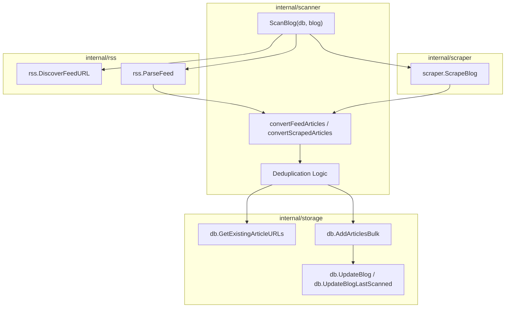
```mermaid
graph TD
    subgraph "internal/scanner"
        SB["ScanBlog(db, blog)"]
        DEDUP["Deduplication Logic"]
        CONV["convertFeedArticles / convertScrapedArticles"]
    end

    subgraph "internal/rss"
        DISC["rss.DiscoverFeedURL"]
        PARSE["rss.ParseFeed"]
    end

    subgraph "internal/scraper"
        SCRAPE["scraper.ScrapeBlog"]
    end

    subgraph "internal/storage"
        DB_GET["db.GetExistingArticleURLs"]
        DB_ADD["db.AddArticlesBulk"]
        DB_UP["db.UpdateBlog / db.UpdateBlogLastScanned"]
    end

    SB --> DISC
    SB --> PARSE
    SB --> SCRAPE
    PARSE --> CONV
    SCRAPE --> CONV
    CONV --> DEDUP
    DEDUP --> DB_GET
    DEDUP --> DB_ADD
    DB_ADD --> DB_UP
```

**Sources:** [internal/scanner/scanner.go:21-111](), [internal/scanner/scanner.go:175-201]()

## Concurrency Model

The scanner utilizes a worker-pool pattern in `ScanAllBlogs` to process multiple blogs in parallel. This significantly reduces total scan time when dealing with a large number of subscriptions.

### Implementation Details

- **Worker Pool**: The number of concurrent workers is controlled by the `workers` parameter [internal/scanner/scanner.go:113]().
- **Database Isolation**: Each worker opens its own connection to the SQLite database using `storage.OpenDatabase(db.Path())` to avoid contention and ensure thread safety across Goroutines [internal/scanner/scanner.go:136-141]().
- **Job Distribution**: Blogs are dispatched via a `job` channel containing the blog model and its original index to maintain result ordering [internal/scanner/scanner.go:126-131]().
- **Synchronization**: The function waits for all workers to signal completion via an `errs` channel before returning the aggregated results [internal/scanner/scanner.go:154-158]().

### Concurrent Execution Flow

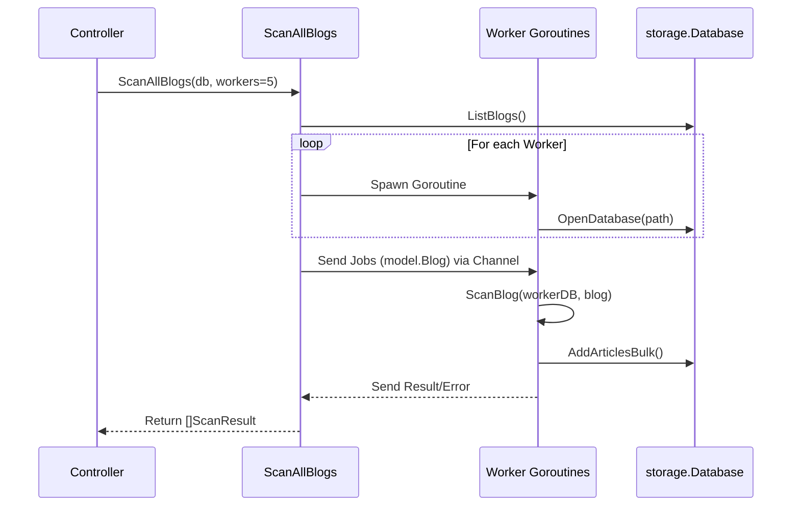
```mermaid
sequenceDiagram
    participant C as Controller
    participant SAB as ScanAllBlogs
    participant W as Worker Goroutines
    participant DB as storage.Database

    C->>SAB: ScanAllBlogs(db, workers=5)
    SAB->>DB: ListBlogs()
    loop For each Worker
        SAB->>W: Spawn Goroutine
        W->>DB: OpenDatabase(path)
    end
    SAB->>W: Send Jobs (model.Blog) via Channel
    W->>W: ScanBlog(workerDB, blog)
    W->>DB: AddArticlesBulk()
    W-->>SAB: Send Result/Error
    SAB-->>C: Return []ScanResult
```

**Sources:** [internal/scanner/scanner.go:113-161]()

## Deduplication and Persistence

To prevent duplicate entries, the scanner performs a two-stage deduplication process:

1.  **In-Memory Deduplication**: Filters out duplicate URLs within the current scan batch using a map [internal/scanner/scanner.go:62-70]().
2.  **Database Cross-Reference**:
    - Collects all unique URLs from the batch [internal/scanner/scanner.go:72-75]().
    - Calls `db.GetExistingArticleURLs(urlList)` to identify which articles are already in the database [internal/scanner/scanner.go:77]().
    - Only "new" articles are assigned a `DiscoveredDate` and passed to the bulk insert operation [internal/scanner/scanner.go:82-90]().

### ScanResult Structure

The `ScanResult` struct provides telemetry for the scan operation, which is typically consumed by the CLI to display progress to the user.

| Field         | Type     | Description                                                            |
| :------------ | :------- | :--------------------------------------------------------------------- |
| `BlogName`    | `string` | The name of the blog scanned.                                          |
| `NewArticles` | `int`    | Count of articles successfully added to the DB.                        |
| `TotalFound`  | `int`    | Total unique articles discovered in the source (including duplicates). |
| `Source`      | `string` | The successful ingestion method: `"rss"`, `"scraper"`, or `"none"`.    |
| `Error`       | `string` | Aggregated error messages from failed attempts.                        |

**Sources:** [internal/scanner/scanner.go:13-19](), [internal/scanner/scanner.go:104-110]()

## Key Functions

### ScanBlog

`func ScanBlog(db *storage.Database, blog model.Blog) ScanResult`
The core logic for a single blog. It handles the transition from `FeedArticle` or `ScrapedArticle` into `model.Article` and manages the database updates for the blog's metadata (e.g., `LastScanned` timestamp) [internal/scanner/scanner.go:21-111]().

### ScanBlogByName

`func ScanBlogByName(db *storage.Database, name string) (*ScanResult, error)`
A helper function that retrieves a blog by its unique name from the storage layer before invoking `ScanBlog` [internal/scanner/scanner.go:163-173]().

### ScanAllBlogs

`func ScanAllBlogs(db *storage.Database, workers int) ([]ScanResult, error)`
The entry point for bulk scanning. It manages the worker pool and ensures that if `workers` is set to 1 or less, it executes synchronously to save resources [internal/scanner/scanner.go:113-124]().

**Sources:** [internal/scanner/scanner.go:21](), [internal/scanner/scanner.go:113](), [internal/scanner/scanner.go:163]()

---

# Page: RSS Feed Parsing

# RSS Feed Parsing

<details>
<summary>Relevant source files</summary>

The following files were used as context for generating this wiki page:

- [go.mod](go.mod)
- [internal/rss/rss.go](internal/rss/rss.go)
- [internal/rss/rss_test.go](internal/rss/rss_test.go)

</details>

The `internal/rss` package is responsible for the discovery and ingestion of structured web feeds (RSS, Atom, and JSON Feed). It provides the mechanisms to automatically locate a feed URL from a blog's homepage and to parse the resulting XML/JSON into internal data structures.

## Data Structures

The package uses a simplified internal representation for articles retrieved during the parsing process.

| Struct        | Field           | Type         | Description                                  |
| :------------ | :-------------- | :----------- | :------------------------------------------- |
| `FeedArticle` | `Title`         | `string`     | The title of the article.                    |
| `FeedArticle` | `URL`           | `string`     | The canonical link to the article.           |
| `FeedArticle` | `PublishedDate` | `*time.Time` | The timestamp of publication or last update. |

Sources: [internal/rss/rss.go:15-19]()

## Feed Auto-Discovery

The `DiscoverFeedURL` function attempts to find a valid feed for a given blog URL using two primary strategies: HTML Metadata Inspection and Common Path Brute-forcing.

### 1. HTML Metadata Inspection

The function first fetches the blog's HTML and uses `goquery` to look for `<link>` tags with `rel="alternate"`. It searches for specific MIME types in the following order:

1. `application/rss+xml`
2. `application/atom+xml`
3. `application/feed+json`
4. `application/xml`
5. `text/xml`

### 2. Common Path Brute-forcing

If no metadata tags are found, the system attempts to append common feed suffixes to the base URL and validates the response. These paths include `/feed`, `/rss`, `/feed.xml`, `/rss.xml`, `/atom.xml`, and `/index.xml`.

### Discovery Flow

The following diagram illustrates the logic within `DiscoverFeedURL`.

**Logic Flow: DiscoverFeedURL**

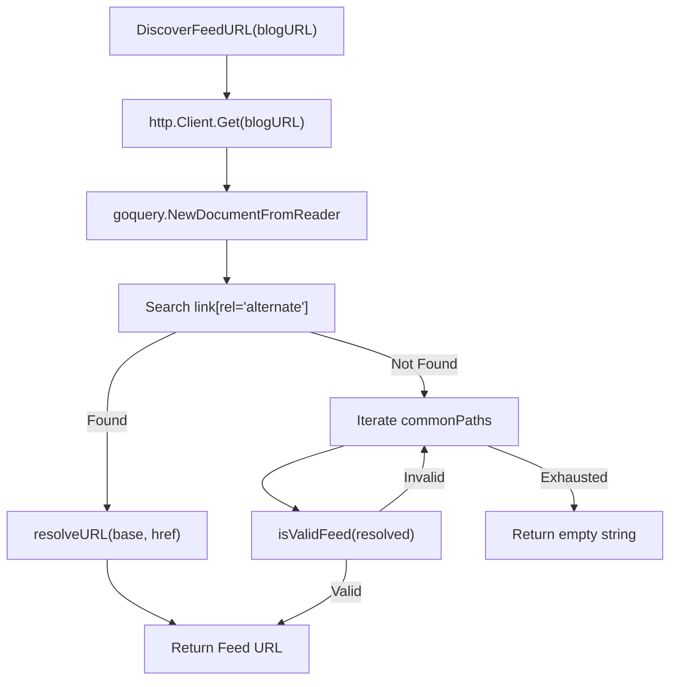
```mermaid
graph TD
    Start["DiscoverFeedURL(blogURL)"] --> Fetch["http.Client.Get(blogURL)"]
    Fetch --> ParseDoc["goquery.NewDocumentFromReader"]
    ParseDoc --> SearchMeta["Search link[rel='alternate']"]

    SearchMeta -- "Found" --> Resolve["resolveURL(base, href)"]
    Resolve --> Return["Return Feed URL"]

    SearchMeta -- "Not Found" --> LoopPaths["Iterate commonPaths"]
    LoopPaths --> CheckValid["isValidFeed(resolved)"]
    CheckValid -- "Valid" --> Return
    CheckValid -- "Invalid" --> LoopPaths
    LoopPaths -- "Exhausted" --> Fail["Return empty string"]
```

Sources: [internal/rss/rss.go:63-130](), [internal/rss/rss.go:107-116]()

## Feed Parsing

The `ParseFeed` function performs the actual retrieval and unmarshaling of feed content. It leverages the `github.com/mmcdole/gofeed` library to handle various XML and JSON feed formats.

### Implementation Details

- **HTTP Fetching**: Uses an `http.Client` with a configurable `timeout` [internal/rss/rss.go:30-31]().
- **Validation**: Checks for non-2xx status codes and returns a `FeedParseError` [internal/rss/rss.go:36-38]().
- **Unmarshaling**: The `gofeed.Parser` processes the response body into a `gofeed.Feed` object [internal/rss/rss.go:40-41]().
- **Article Mapping**: Iterates through `feed.Items`, trimming whitespace from titles and links. Items missing either a title or a link are discarded [internal/rss/rss.go:47-52]().

### Publication Date Handling

The function `pickPublishedDate` implements a fallback strategy to determine the most relevant timestamp for an article:

1. It first attempts to use `item.PublishedParsed`.
2. If unavailable, it falls back to `item.UpdatedParsed`.
3. If neither exists, it returns `nil`.

**Code Entity Map: Feed Parsing**

```mermaid
graph LR
    subgraph "internal/rss"
        PF["ParseFeed(feedURL, timeout)"]
        PPD["pickPublishedDate(item)"]
        FPE["FeedParseError struct"]
    end

    subgraph "External Dependencies"
        GF["github.com/mmcdole/gofeed"]
        GQ["github.com/PuerkitoBio/goquery"]
    end

    PF --> GF
    PF --> PPD
    PF -- "on error" --> FPE
    "DiscoverFeedURL" --> GQ
```

Sources: [internal/rss/rss.go:29-61](), [internal/rss/rss.go:164-175](), [go.mod:8-11]()

## Error Handling

The package defines a custom error type `FeedParseError` to distinguish feed-related issues (network failures, invalid XML) from other system errors.

- **`FeedParseError`**: A simple struct wrapping a message string [internal/rss/rss.go:21-27]().
- **`IsFeedError(err)`**: A helper function using `errors.As` to check if a returned error is specifically a `FeedParseError` [internal/rss/rss.go:177-180]().

Sources: [internal/rss/rss.go:21-28](), [internal/rss/rss.go:177-181]()

---

# Page: HTML Scraper Fallback

# HTML Scraper Fallback

<details>
<summary>Relevant source files</summary>

The following files were used as context for generating this wiki page:

- [go.mod](go.mod)
- [internal/scraper/scraper.go](internal/scraper/scraper.go)
- [internal/scraper/scraper_test.go](internal/scraper/scraper_test.go)

</details>

The `internal/scraper` package provides a robust mechanism for extracting article metadata from standard HTML pages. This serves as the secondary ingestion path in BlogWatcher, utilized when a blog does not provide a valid RSS/Atom feed or when the user explicitly provides a CSS selector during the `add` command. It leverages DOM traversal to identify links, normalize URLs, and deduplicate entries.

## Implementation Overview

The scraper is built around the `goquery` library, which provides a jQuery-like syntax for manipulating and searching HTML documents [go.mod:6-6](). The primary entry point is the `ScrapeBlog` function, which orchestrates the HTTP request, DOM parsing, and article extraction [internal/scraper/scraper.go:28-28]().

### Data Structures

The package defines simple structures to represent extracted data and handle errors specific to the scraping process.

| Type             | Description                                                                                                                    |
| :--------------- | :----------------------------------------------------------------------------------------------------------------------------- |
| `ScrapedArticle` | Contains the `Title`, `URL`, and optional `PublishedDate` of a discovered post [internal/scraper/scraper.go:14-18]().          |
| `ScrapeError`    | A custom error type used to distinguish scraping failures from network or system errors [internal/scraper/scraper.go:20-26](). |

**Sources:** [internal/scraper/scraper.go:14-26]()

## Scrape Logic and Data Flow

The scraping process follows a linear pipeline from fetching the raw HTML to returning a slice of unique `ScrapedArticle` objects.

### Logic Flow Diagram: ScrapeBlog

This diagram maps the natural language steps of the scraping process to the specific functions and logic gates in the `internal/scraper` package.


```mermaid
graph TD
    subgraph "Code Entity Space: internal/scraper"
        Start["ScrapeBlog(blogURL, selector, timeout)"] --> Client["http.Client{Timeout}"]
        Client --> GET["client.Get(blogURL)"]
        GET --> CheckStatus{"Status 200-299?"}

        CheckStatus -- No --> Err["return ScrapeError"]
        CheckStatus -- Yes --> Parse["goquery.NewDocumentFromReader"]

        Parse --> Loop["doc.Find(selector).Each"]

        subgraph "Extraction Loop"
            Loop --> FindLink{"Is Node 'a'?"}
            FindLink -- No --> SearchChild["selection.Find('a').First()"]
            FindLink -- Yes --> GetAttr["link.Attr('href')"]
            SearchChild --> GetAttr

            GetAttr --> Resolve["resolveURL(base, href)"]
            Resolve --> Seen{"URL in seen map?"}
            Seen -- No --> Title["extractTitle(link, selection)"]
            Title --> Append["Append to articles slice"]
            Seen -- Yes --> Next["Skip to next"]
        end

        Append --> Return["return []ScrapedArticle"]
    end
```

**Sources:** [internal/scraper/scraper.go:28-84]()

### Key Functions

#### URL Normalization

The `resolveURL` function ensures that relative links (e.g., `/posts/my-article`) are converted into absolute URLs using the blog's base URL [internal/scraper/scraper.go:106-116](). It uses the standard library `net/url` to handle reference resolution [internal/scraper/scraper.go:115-115]().

#### Title Extraction

The `extractTitle` function employs a multi-step fallback strategy to find a human-readable title for an article [internal/scraper/scraper.go:86-104]():

1.  **Link Text:** It first attempts to use `strings.TrimSpace(link.Text())` [internal/scraper/scraper.go:87-88]().
2.  **Title Attribute:** If the text is empty, it looks for a `title` attribute on the `<a>` tag [internal/scraper/scraper.go:91-92]().
3.  **Parent Text:** If still empty, it attempts to grab the text content of the parent selection (the element matched by the CSS selector) [internal/scraper/scraper.go:97-99]().

#### Duplicate Filtering

To prevent redundant entries within a single scrape pass (common in HTML layouts where both a title and an image might link to the same post), the scraper maintains a `seen` map of strings [internal/scraper/scraper.go:49-49](). Any URL already present in this map is discarded during the `Each` iteration [internal/scraper/scraper.go:68-71]().

**Sources:** [internal/scraper/scraper.go:49-116]()

## Component Interaction

The following diagram illustrates how the `scraper` package interacts with external dependencies and how the internal components relate to the `goquery` DOM tree.

```mermaid
graph LR
    subgraph "External"
        HTTP["net/http"]
        GQ["github.com/PuerkitoBio/goquery"]
    end

    subgraph "internal/scraper"
        SB["ScrapeBlog"]
        SA["ScrapedArticle"]
        ET["extractTitle"]
        RU["resolveURL"]
    end

    SB -- "Fetches HTML" --> HTTP
    SB -- "Parses DOM" --> GQ
    SB -- "Uses" --> RU
    SB -- "Uses" --> ET
    ET -- "Queries Attributes" --> GQ
    SB -- "Returns" --> SA
```

**Sources:** [internal/scraper/scraper.go:1-122](), [go.mod:6-6]()

## Error Handling

The package provides `IsScrapeError` to allow callers (like the `scanner` package) to determine if a failure was specifically related to the scraping logic rather than a general system failure [internal/scraper/scraper.go:118-121]().

Common failure points handled:

- **Network/Timeout:** Captured via `client.Get` [internal/scraper/scraper.go:30-33]().
- **Non-2xx Status:** Returns a `ScrapeError` with the status code [internal/scraper/scraper.go:35-37]().
- **Invalid Selector:** Handled implicitly by `goquery` (resulting in zero matches) or explicit checks for missing links [internal/scraper/scraper.go:57-59]().

**Sources:** [internal/scraper/scraper.go:30-121]()

---

# Page: Build, Release, and CI/CD

# Build, Release, and CI/CD

<details>
<summary>Relevant source files</summary>

The following files were used as context for generating this wiki page:

- [.github/workflows/release.yml](.github/workflows/release.yml)
- [.goreleaser.yaml](.goreleaser.yaml)
- [internal/version/version.go](internal/version/version.go)

</details>

This page provides an overview of the BlogWatcher release engineering pipeline. The project utilizes **GoReleaser** in conjunction with **GitHub Actions** to automate the compilation, packaging, and distribution of the CLI tool across multiple platforms.

The pipeline is designed to handle CGO requirements for SQLite, manage version injection via linker flags, and automate the update of the Homebrew formula in a dedicated tap repository.

### Release Pipeline Overview

The release process is triggered automatically when a new version tag (e.g., `v1.0.0`) is pushed to the repository [.github/workflows/release.yml:3-6](). The orchestration follows a linear flow from source code to distributed binaries.

#### Conceptual Release Flow

"Release Pipeline Flow"

```mermaid
graph TD
    "GitTag[Git Tag v*]" --> "GHA[GitHub Actions]"
    subgraph "CI Environment (Ubuntu)"
        "GHA" --> "SetupGo[Setup Go]"
        "GHA" --> "InstallMingw[Install mingw-w64]"
        "SetupGo" --> "GoReleaser[GoReleaser]"
        "InstallMingw" --> "GoReleaser"
    end
    subgraph "GoReleaser Execution"
        "GoReleaser" --> "LDFlags[Inject Version via ldflags]"
        "LDFlags" --> "Build[Cross-Compile Binaries]"
        "Build" --> "Archive[Create tar.gz/zip]"
        "Archive" --> "Checksum[Generate Checksums]"
    end
    "GoReleaser" --> "GHRelease[GitHub Release Assets]"
    "GoReleaser" --> "BrewTap[Hyaxia/homebrew-tap]"
```

**Sources:** [.github/workflows/release.yml:1-35](), [.goreleaser.yaml:1-51]()

---

### Key Components

#### GoReleaser Configuration

The `.goreleaser.yaml` file defines how the `blogwatcher` binary is built and packaged. It specifies the entry point at `./cmd/blogwatcher` [.goreleaser.yaml:7-8]() and ensures that `CGO_ENABLED=1` is set to support the SQLite storage engine [.goreleaser.yaml:10]().

The configuration also manages:

- **Version Injection:** The `internal/version.Version` variable is overwritten during the build process using `-X` ldflags [.goreleaser.yaml:16]().
- **Artifact Packaging:** Binaries are bundled into `.tar.gz` for Linux and `.zip` for Windows [.goreleaser.yaml:23-26]().
- **Homebrew Integration:** Automatically updates the `Hyaxia/homebrew-tap` repository with the new version and checksums [.goreleaser.yaml:38-46]().

For details, see [GoReleaser Configuration](#4.1).

**Sources:** [.goreleaser.yaml:5-51](), [internal/version/version.go:3-3]()

#### GitHub Actions Workflow

The `release.yml` workflow provides the execution environment for the build. Because BlogWatcher requires CGO for its SQLite driver, the runner installs `mingw-w64` to facilitate cross-compilation for Windows targets [.github/workflows/release.yml:24-25](). The workflow utilizes the `goreleaser-action` to execute the release sequence using the `GITHUB_TOKEN` and a custom `HOMEBREW_TAP_GITHUB_TOKEN` [.github/workflows/release.yml:28-34]().

For details, see [GitHub Actions Workflow](#4.2).

**Sources:** [.github/workflows/release.yml:12-35]()

---

### Version Injection Mapping

The build process bridges the Git tag metadata to the compiled binary by targeting the `version` package.

"Version Injection Mapping"

```mermaid
graph LR
    subgraph "Build Time Metadata"
        "Tag{{.Version}}"
    end
    subgraph "Code Entity Space"
        "LDFlags[-X .../internal/version.Version]"
        "PkgVer[internal/version/version.go]"
        "VarVer[var Version]"
    end
    "Tag" -- "Injected by GoReleaser" --> "LDFlags"
    "LDFlags" -- "Overrides" --> "VarVer"
    "VarVer" -- "Defined in" --> "PkgVer"
```

**Sources:** [.goreleaser.yaml:16-16](), [internal/version/version.go:1-4]()

### Sub-pages

- **[GoReleaser Configuration](#4.1)**: Detailed walkthrough of `.goreleaser.yaml`: build targets, ldflags for version injection, archive formats, checksum generation, and Homebrew formula automation.
- **[GitHub Actions Workflow](#4.2)**: How the `release.yml` workflow triggers on version tags, sets up the Go environment, installs `mingw-w64` for CGO cross-compilation, and invokes GoReleaser.

---

# Page: GoReleaser Configuration

# GoReleaser Configuration

<details>
<summary>Relevant source files</summary>

The following files were used as context for generating this wiki page:

- [.github/workflows/release.yml](.github/workflows/release.yml)
- [.goreleaser.yaml](.goreleaser.yaml)
- [internal/version/version.go](internal/version/version.go)

</details>

This page provides a detailed technical walkthrough of the GoReleaser configuration used by BlogWatcher to automate cross-platform builds, versioning, and distribution via Homebrew.

## Purpose and Scope

BlogWatcher utilizes [GoReleaser](https://goreleaser.com/) to manage the lifecycle of a release. The configuration handles the compilation of the Go source code into platform-specific binaries, injects version metadata at build time, packages the binaries into compressed archives, generates cryptographic checksums for integrity verification, and updates the Homebrew tap repository.

## Build Configuration and Version Injection

The core build logic is defined in the `builds` section of `.goreleaser.yaml`. BlogWatcher requires `CGO_ENABLED=1` because it utilizes SQLite for local storage, which often necessitates CGO for certain drivers or extensions [ .goreleaser.yaml:9-10 ]().

### Version Injection via ldflags

To ensure the CLI can report its current version (e.g., via `blogwatcher --version`), the configuration uses Go's linker flags (`ldflags`) to overwrite the default value of the `Version` variable in the `internal/version` package.

- **Target Variable**: `github.com/Hyaxia/blogwatcher/internal/version.Version` [ .goreleaser.yaml:16 ]().
- **Source Value**: The GoReleaser template variable `{{.Version}}`, which is derived from the Git tag triggering the build [ .goreleaser.yaml:16 ]().
- **Default State**: In the source code, this variable is initialized to `"dev"` [ internal/version/version.go:3-3 ]().

### Build Targets

Currently, the project targets the Linux platform with the AMD64 architecture [ .goreleaser.yaml:11-14 ](). The entry point for the build is the main package located in `./cmd/blogwatcher` [ .goreleaser.yaml:7-7 ]().

### Build Pipeline Diagram

"Build Process and Version Injection"

```mermaid
graph TD
    subgraph "Source Code Space"
        V_FILE["internal/version/version.go"]
        V_VAR["var Version = 'dev'"]
    end

    subgraph "GoReleaser Pipeline"
        TAG["Git Tag (e.g., v1.0.0)"] --> G_REL["GoReleaser Engine"]
        G_REL --> LDFLAGS["-X ...version.Version={{.Version}}"]
    end

    subgraph "Compilation"
        CMD["./cmd/blogwatcher"]
        LDFLAGS --> GO_BUILD["go build"]
        CMD --> GO_BUILD
        GO_BUILD --> BIN["Binary: blogwatcher"]
    end

    V_FILE --- V_VAR
    V_VAR -.->|"Overwritten by ldflags"| BIN
```

Sources: [ .goreleaser.yaml:6-16 ](), [ internal/version/version.go:1-4 ]()

## Archive and Checksum Generation

Once the binaries are compiled, GoReleaser packages them into distributable formats.

| Feature             | Configuration                                             | Details                                                                                                                    |
| :------------------ | :-------------------------------------------------------- | :------------------------------------------------------------------------------------------------------------------------- |
| **Archive Format**  | `tar.gz`                                                  | Default format for Unix-like systems [ .goreleaser.yaml:23-23 ]().                                                         |
| **Format Override** | `zip`                                                     | Used specifically for Windows builds [ .goreleaser.yaml:24-26 ]().                                                         |
| **Naming Template** | `{{ .ProjectName }}_{{ .Version }}_{{ .Os }}_{{ .Arch }}` | Ensures unique and descriptive filenames for each artifact [ .goreleaser.yaml:22-22 ]().                                   |
| **Checksums**       | `blogwatcher_checksums.txt`                               | A text file containing SHA-256 hashes of all generated archives to ensure download integrity [ .goreleaser.yaml:28-29 ](). |

Sources: [ .goreleaser.yaml:18-29 ]()

## Homebrew Formula Automation

BlogWatcher automates the update of its Homebrew Formula through the `brews` section. This allows users to install the tool using `brew install Hyaxia/tap/blogwatcher`.

The automation performs the following steps:

1.  **Repository Target**: Pushes the updated Formula to the `homebrew-tap` repository owned by `Hyaxia` [ .goreleaser.yaml:43-45 ]().
2.  **Authentication**: Uses a GitHub Token stored in the environment variable `HOMEBREW_TAP_GITHUB_TOKEN` [ .goreleaser.yaml:46-46 ]().
3.  **Installation Script**: Defines the Ruby `install` block for the Formula, placing the `blogwatcher` binary into the system path [ .goreleaser.yaml:47-48 ]().
4.  **Verification**: Includes a test block that runs `blogwatcher --version` to ensure the installed binary is functional [ .goreleaser.yaml:49-50 ]().

Sources: [ .goreleaser.yaml:38-51 ]()

## CI/CD Integration

The GoReleaser process is triggered by a GitHub Actions workflow whenever a new version tag (matching `v*`) is pushed to the repository [ .github/workflows/release.yml:3-6 ]().

### Release Workflow Data Flow

"CI/CD Release Data Flow"

```mermaid
sequenceDiagram
    participant Dev as Developer
    participant GHA as GitHub Actions
    participant GR as GoReleaser
    participant HT as Homebrew Tap Repo

    Dev->>GHA: git push origin v1.0.0
    Note over GHA: workflow: release.yml
    GHA->>GHA: Install mingw-w64 (CGO support)
    GHA->>GR: Run goreleaser/goreleaser-action
    GR->>GR: Build binaries with ldflags
    GR->>GR: Generate blogwatcher_checksums.txt
    GR->>GHA: Create GitHub Release with Assets
    GR->>HT: Update Formula in Hyaxia/homebrew-tap
```

Sources: [ .github/workflows/release.yml:1-35 ](), [ .goreleaser.yaml:1-51 ]()

### CGO and Cross-Compilation

Because the build requires `CGO_ENABLED=1`, the CI environment must provide the necessary toolchains for cross-compilation. The GitHub Actions workflow explicitly installs `mingw-w64` to support CGO requirements during the build process [ .github/workflows/release.yml:24-25 ]().

---

# Page: GitHub Actions Workflow

# GitHub Actions Workflow

<details>
<summary>Relevant source files</summary>

The following files were used as context for generating this wiki page:

- [.github/workflows/release.yml](.github/workflows/release.yml)
- [.gitignore](.gitignore)
- [.goreleaser.yaml](.goreleaser.yaml)
- [AGENTS.md](AGENTS.md)

</details>

The `release.yml` workflow automates the build, packaging, and distribution process for BlogWatcher. It is designed to produce cross-platform binaries, generate checksums, and update the Homebrew tap whenever a new version tag is pushed to the repository.

## Workflow Trigger and Permissions

The workflow is specifically scoped to trigger only on version tags and requires write permissions to the repository contents to create GitHub Releases.

| Configuration   | Value                | Purpose                                                                 |
| :-------------- | :------------------- | :---------------------------------------------------------------------- |
| **Trigger**     | `push: tags: ["v*"]` | Ensures releases only happen on semantic version tags (e.g., `v1.0.0`). |
| **Runner**      | `ubuntu-latest`      | Uses a standard Linux environment for the build pipeline.               |
| **Permissions** | `contents: write`    | Necessary for GoReleaser to upload assets to the GitHub Release.        |

**Sources:**

- [.github/workflows/release.yml:3-9]()

## Environment Setup

The workflow initializes the build environment by setting up the Go toolchain and installing cross-compilation dependencies.

### Go Environment

The workflow uses `actions/setup-go@v5` to initialize the environment. It dynamically determines the required Go version by reading the `go.mod` file and enables caching to speed up subsequent runs by persisting module dependencies.

### CGO and Cross-Compilation

Because BlogWatcher enables `CGO_ENABLED=1` in its build configuration to support SQLite, the build environment requires a C compiler. For Windows cross-compilation, the workflow installs `mingw-w64` via the system package manager.

**Sources:**

- [.github/workflows/release.yml:18-25]()
- [.goreleaser.yaml:10-10]()

## Release Execution Flow

The core of the workflow is the invocation of GoReleaser. This stage bridges the GitHub Action environment with the specific build configurations defined in `.goreleaser.yaml`.

### Execution Diagram: Workflow to Code Entity

This diagram maps the GitHub Action steps to the specific configurations and environment variables they interact with in the codebase.

**Release Pipeline Data Flow**

```mermaid
graph TD
    subgraph "GitHub Actions (release.yml)"
        A["push: v*"] --> B["Checkout"]
        B --> C["setup-go (go.mod)"]
        C --> D["apt-get install mingw-w64"]
        D --> E["goreleaser-action"]
    end

    subgraph "GoReleaser (goreleaser.yaml)"
        E --> F["builds: blogwatcher"]
        F --> G["ldflags: -X .../version.Version"]
        E --> H["brews: blogwatcher"]
    end

    subgraph "Secrets & Environment"
        I["GITHUB_TOKEN"] --> E
        J["HOMEBREW_TAP_GITHUB_TOKEN"] --> E
    end

    G -- "Injects" --> K["internal/version/version.go"]
    H -- "Publishes to" --> L["Hyaxia/homebrew-tap"]
```

**Sources:**

- [.github/workflows/release.yml:12-35]()
- [.goreleaser.yaml:15-16]()
- [.goreleaser.yaml:43-46]()

### Step Implementation Details

The `goreleaser-action` is executed with the `release --clean` argument, which ensures that any previous build artifacts are removed before the new release starts.

| Step Name          | Implementation                      | Context                                                                          |
| :----------------- | :---------------------------------- | :------------------------------------------------------------------------------- |
| **Checkout**       | `actions/checkout@v4`               | Pulls the source code into the runner.                                           |
| **Set up Go**      | `actions/setup-go@v5`               | Reads `go-version-file: go.mod` to ensure toolchain parity.                      |
| **Install mingw**  | `sudo apt-get install -y mingw-w64` | Provides the `x86_64-w64-mingw32-gcc` compiler for Windows CGO builds.           |
| **Run GoReleaser** | `goreleaser/goreleaser-action@v6`   | Executes the release logic using `GITHUB_TOKEN` and `HOMEBREW_TAP_GITHUB_TOKEN`. |

**Sources:**

- [.github/workflows/release.yml:15-35]()

## Dependency Integration

The workflow relies on specific project files and secrets to function correctly.

### Version Injection

During the `Run GoReleaser` step, the workflow passes control to the Go compiler. GoReleaser uses the `ldflags` defined in the configuration to inject the current tag version into the binary at compile time. This allows the CLI to report its version accurately via the `--version` flag.

### Homebrew Distribution

The workflow facilitates the update of the `Hyaxia/homebrew-tap` repository. It uses the `HOMEBREW_TAP_GITHUB_TOKEN` secret to authenticate with the tap repository, allowing GoReleaser to push the updated Ruby formula automatically after the binaries are uploaded to the main repository.

**Release Entity Relationship**

```mermaid
classDiagram
    class ReleaseWorkflow {
        +trigger: tag v*
        +runner: ubuntu-latest
        +install_mingw()
    }
    class GoReleaserConfig {
        +id: blogwatcher
        +binary: blogwatcher
        +env: CGO_ENABLED=1
        +ldflags: version_injection
    }
    class Secrets {
        +GITHUB_TOKEN
        +HOMEBREW_TAP_GITHUB_TOKEN
    }
    class Artifacts {
        +tar_gz: Linux
        +zip: Windows
        +checksums: txt
    }

    ReleaseWorkflow --> GoReleaserConfig : "invokes via goreleaser-action"
    ReleaseWorkflow --> Secrets : "consumes for auth"
    GoReleaserConfig --> Artifacts : "produces"
```

**Sources:**

- [.github/workflows/release.yml:32-34]()
- [.goreleaser.yaml:15-16]()
- [.goreleaser.yaml:38-46]()

---

# Page: Testing

# Testing

<details>
<summary>Relevant source files</summary>

The following files were used as context for generating this wiki page:

- [internal/controller/controller_test.go](internal/controller/controller_test.go)
- [internal/rss/rss_test.go](internal/rss/rss_test.go)
- [internal/scanner/scanner_test.go](internal/scanner/scanner_test.go)
- [internal/scraper/scraper_test.go](internal/scraper/scraper_test.go)
- [internal/storage/database_test.go](internal/storage/database_test.go)

</details>

BlogWatcher employs a comprehensive testing strategy that combines unit tests for business logic with integration tests for its external dependencies. The test suite ensures the reliability of the SQLite storage engine, the accuracy of the RSS/HTML ingestion pipeline, and the correctness of the controller orchestration.

### Test Strategy Overview

The codebase is tested using standard Go testing tools, with a focus on two primary patterns:

1.  **Ephemeral SQLite Instances**: Database tests create temporary `.db` files on disk using `t.TempDir()` to verify schema constraints, time precision, and CRUD operations in a real environment [internal/storage/database_test.go:13-15]().
2.  **HTTP Mocking**: Ingestion tests use `httptest.NewServer` to simulate remote RSS feeds and HTML websites, allowing for deterministic testing of network-dependent logic without external internet access [internal/rss/rss_test.go:27-31]().

### Core Test Components

The following diagram illustrates how the test entities relate to the production code and the filesystem/network boundaries.

**Test Entity Relationship**

```mermaid
graph TD
    subgraph "Testing Space"
        T_DB["openTestDB()"]
        T_Srv["httptest.NewServer"]
    end

    subgraph "Code Entity Space"
        C_Stor["storage.Database"]
        C_Ctrl["controller.AddBlog / RemoveBlog"]
        C_Scan["scanner.ScanBlog"]
        C_RSS["rss.ParseFeed"]
    end

    subgraph "External Resources"
        R_Disk["/tmp/blogwatcher.db"]
        R_Net["Mock HTTP Responses"]
    end

    T_DB -->|creates| R_Disk
    T_DB -->|returns| C_Stor
    T_Srv -->|provides| R_Net
    C_Ctrl --> C_Stor
    C_Scan --> C_Stor
    C_Scan --> C_RSS
    C_RSS -.->|fetches from| T_Srv
```

Sources: [internal/storage/database_test.go:12-18](), [internal/scanner/scanner_test.go:126-134](), [internal/rss/rss_test.go:26-33]()

---

### Storage and Controller Tests

These tests focus on the data integrity and business rules of the application. By using a temporary database, the suite can verify that the `internal/storage` package correctly handles SQLite-specific behaviors.

- **CRUD Operations**: Verifies that `AddBlog`, `GetBlog`, and `RemoveBlog` work as expected [internal/storage/database_test.go:25-86]().
- **Schema Enforcement**: Ensures that `FOREIGN KEY` constraints prevent orphaned articles [internal/storage/database_test.go:119-131]().
- **Time Precision**: Validates that Go `time.Time` objects are serialized and deserialized from SQLite without losing precision [internal/storage/database_test.go:159-188]().
- **Controller Logic**: Tests the `internal/controller` layer to ensure it correctly enforces unique constraints on blog names and URLs [internal/controller/controller_test.go:11-31]().

For details, see [Storage and Controller Tests](#5.1).

---

### Ingestion Pipeline Tests

Tests for the scanner, RSS parser, and HTML scraper ensure that BlogWatcher can successfully discover and process content from various web sources.

- **RSS Parsing**: Uses `sampleFeed` XML strings to verify that `rss.ParseFeed` correctly extracts titles, links, and publication dates [internal/rss/rss_test.go:10-43]().
- **Scraper Fallback**: Verifies that `scanner.ScanBlog` can successfully fall back to the `internal/scraper` if the RSS feed returns an error (e.g., 500 Internal Server Error) [internal/scanner/scanner_test.go:61-98]().
- **Concurrency**: Ensures that `ScanAllBlogs` can process multiple blogs simultaneously using a worker pool without race conditions [internal/scanner/scanner_test.go:100-124]().
- **Deduplication**: Confirms that the scanner respects existing articles in the database and does not report them as "new" on subsequent scans [internal/scanner/scanner_test.go:136-160]().

**Ingestion Pipeline Mocking**

```mermaid
sequenceDiagram
    participant T as TestScanBlogScraperFallback
    participant S as scanner.ScanBlog
    participant M as httptest (Mock Server)
    participant D as storage.Database (Temp)

    T->>D: AddBlog (with FeedURL and ScrapeSelector)
    T->>S: ScanBlog(db, blog)
    S->>M: GET /feed.xml (RSS)
    M-->>S: 500 Internal Server Error
    S->>M: GET / (HTML Scrape)
    M-->>S: 200 OK (HTML Body)
    S->>D: AddArticlesBulk()
    S-->>T: ScanResult (Source: "scraper")
```

Sources: [internal/scanner/scanner_test.go:61-98](), [internal/rss/rss_test.go:26-43](), [internal/scraper/scraper_test.go:10-36]()

For details, see [Scanner, RSS, and Scraper Tests](#5.2).

---

### Running the Test Suite

The entire test suite can be executed using the standard Go toolchain. Since the tests use `t.TempDir()`, no manual cleanup of database files is required.

```bash
# Run all tests in the repository
go test ./...

# Run tests with verbose output to see scan results
go test -v ./internal/scanner

# Run storage tests specifically
go test -v ./internal/storage
```

Sources: [internal/storage/database_test.go:13-14](), [internal/scanner/scanner_test.go:128-129]()

---

# Page: Storage and Controller Tests

# Storage and Controller Tests

<details>
<summary>Relevant source files</summary>

The following files were used as context for generating this wiki page:

- [internal/controller/controller_test.go](internal/controller/controller_test.go)
- [internal/storage/database_test.go](internal/storage/database_test.go)

</details>

This page details the testing strategies and implementation for the core data and business logic layers of BlogWatcher. Testing is primarily centered around `internal/storage` and `internal/controller`, utilizing temporary SQLite databases to ensure data integrity, schema compliance, and correct orchestration of business rules.

## Testing Infrastructure

Both the storage and controller test suites rely on a common pattern of creating isolated, temporary SQLite databases for each test run. This ensures that tests do not interfere with each other and that the environment is clean for every execution.

### Temporary Database Creation

In `internal/storage/database_test.go`, the `t.TempDir()` function is used to create a unique directory for the database file [internal/storage/database_test.go:13-14](). Similarly, the controller tests use a helper function `openTestDB` to encapsulate this setup [internal/controller/controller_test.go:92-100]().

### Code Entity Mapping: Test Setup

The following diagram illustrates how the test functions interact with the storage layer to initialize a testing environment.

**Diagram: Test Environment Initialization**

```mermaid
graph TD
    subgraph "Testing Space"
        T1["TestDatabaseCreatesFileAndCRUD"]
        T2["TestAddBlogAndRemoveBlog"]
        T3["openTestDB helper"]
    end

    subgraph "Code Entity Space"
        OD["storage.OpenDatabase()"]
        DB["storage.Database struct"]
        TD["t.TempDir()"]
    end

    T1 --> TD
    T1 --> OD
    T3 --> TD
    T3 --> OD
    OD --> DB
    T2 --> T3
```

**Sources:** [internal/storage/database_test.go:12-19](), [internal/controller/controller_test.go:92-100]()

---

## Storage Layer Tests (`internal/storage`)

The storage tests verify the low-level SQL operations and SQLite-specific behaviors.

### CRUD and Schema Verification

The primary test `TestDatabaseCreatesFileAndCRUD` verifies the full lifecycle of a blog and its articles:

1.  **Creation**: Ensures the file is physically created on disk [internal/storage/database_test.go:21-23]().
2.  **Blog Operations**: Tests `AddBlog`, `GetBlog`, and `UpdateBlogLastScanned` [internal/storage/database_test.go:25-39, 75-77]().
3.  **Article Operations**: Verifies `AddArticlesBulk`, `ListArticles`, and `MarkArticleRead` [internal/storage/database_test.go:45-72]().
4.  **Deletion**: Confirms `RemoveBlog` successfully purges data [internal/storage/database_test.go:79-85]().

### Data Integrity and Constraints

- **Foreign Key Enforcement**: `TestDatabaseForeignKeyEnforced` attempts to insert an article with a non-existent `BlogID` to ensure the database rejects orphaned records [internal/storage/database_test.go:119-131]().
- **Time Precision**: `TestBlogTimeRoundTrip` and `TestArticleTimeRoundTripAndNilDiscoveredDate` verify that `time.Time` objects (including those with nanosecond precision) are serialized and deserialized correctly from SQLite, and that nil dates are handled properly [internal/storage/database_test.go:159-188, 190-228]().
- **URL Deduplication**: `TestGetExistingArticleURLs` checks the logic used during scanning to identify which URLs are already present in the database to avoid duplicates [internal/storage/database_test.go:88-117]().

**Sources:** [internal/storage/database_test.go:12-228]()

---

## Controller Layer Tests (`internal/controller`)

Controller tests focus on business logic orchestration, error handling, and the interaction between the controller functions and the `storage.Database` interface.

### Business Rule Enforcement

The controller layer adds validation on top of raw storage operations:

- **Uniqueness**: `TestAddBlogAndRemoveBlog` verifies that the controller prevents adding blogs with duplicate names or duplicate URLs, even if the underlying storage might allow it [internal/controller/controller_test.go:15-26]().
- **State Management**: `TestArticleReadUnread` ensures that `MarkArticleRead` and `MarkArticleUnread` return the _previous_ state of the article, which is a requirement for CLI feedback [internal/controller/controller_test.go:33-61]().

### Data Flow and Filtering

The `TestGetArticlesFilters` function verifies the controller's ability to join data and handle missing entities:

- It checks that `GetArticles` correctly maps `BlogID` to `BlogName` for display [internal/controller/controller_test.go:76-85]().
- It ensures that requesting articles for a non-existent blog returns a specific error [internal/controller/controller_test.go:87-89]().

**Diagram: Controller Logic Flow**

```mermaid
sequenceDiagram
    participant T as TestAddBlogAndRemoveBlog
    participant C as controller.AddBlog()
    participant D as storage.Database

    T->>C: AddBlog("Test", "https://example.com")
    C->>D: AddBlog(model.Blog)
    D-->>C: Success
    C-->>T: Blog Object

    T->>C: AddBlog("Test", "https://other.com")
    Note over C: Logic checks for duplicate name
    C-->>T: Error (Duplicate Name)
```

**Sources:** [internal/controller/controller_test.go:11-31, 63-90]()

---

## Key Test Cases Summary

| Test Function                    | Target Component | Logic Verified                                       |
| :------------------------------- | :--------------- | :--------------------------------------------------- |
| `TestDatabaseCreatesFileAndCRUD` | `storage`        | File creation, Basic CRUD, Bulk Article insertion.   |
| `TestDatabaseForeignKeyEnforced` | `storage`        | SQLite `PRAGMA foreign_keys = ON` enforcement.       |
| `TestBlogTimeRoundTrip`          | `storage`        | `time.Time` serialization/deserialization precision. |
| `TestAddBlogAndRemoveBlog`       | `controller`     | Duplicate name/URL prevention logic.                 |
| `TestArticleReadUnread`          | `controller`     | State toggling and returning original record state.  |
| `TestGetArticlesFilters`         | `controller`     | Blog name mapping and filtering by blog name.        |

**Sources:** [internal/storage/database_test.go:12-131](), [internal/controller/controller_test.go:11-90]()

---

# Page: Scanner, RSS, and Scraper Tests

# Scanner, RSS, and Scraper Tests

<details>
<summary>Relevant source files</summary>

The following files were used as context for generating this wiki page:

- [internal/rss/rss_test.go](internal/rss/rss_test.go)
- [internal/scanner/scanner_test.go](internal/scanner/scanner_test.go)
- [internal/scraper/scraper_test.go](internal/scraper/scraper_test.go)

</details>

This page details the testing strategies for the content ingestion pipeline. The test suite utilizes `httptest.NewServer` to mock external web environments, ensuring that the scanner orchestration, RSS parsing, and HTML scraping logic correctly handle real-world network scenarios and data formats.

## Testing Strategy Overview

The ingestion tests focus on verifying the transition between different discovery methods and the accuracy of data extraction. By using `httptest`, the tests avoid making actual network calls while still exercising the full HTTP client stack, including timeouts and header handling.

### Key Testing Components

| Component                 | Test File                          | Primary Focus                                                                                                 |
| :------------------------ | :--------------------------------- | :------------------------------------------------------------------------------------------------------------ |
| **Scanner Orchestration** | `internal/scanner/scanner_test.go` | Verifies `ScanBlog` logic, worker pool concurrency in `ScanAllBlogs`, and deduplication against the database. |
| **RSS Parsing**           | `internal/rss/rss_test.go`         | Validates `ParseFeed` XML unmarshaling and `DiscoverFeedURL` link-tag detection.                              |
| **HTML Scraper**          | `internal/scraper/scraper_test.go` | Tests `ScrapeBlog` CSS selector matching, URL normalization, and in-memory duplicate filtering.               |

Sources: [internal/scanner/scanner_test.go:1-12](), [internal/rss/rss_test.go:1-8](), [internal/scraper/scraper_test.go:1-8]()

## Scanner and Ingestion Pipeline Mocking

The `scanner` package tests bridge the gap between the `storage` layer and the network. They use a temporary SQLite database to ensure that discovered articles are correctly persisted and that existing articles are not duplicated.

### Pipeline Verification Diagram

This diagram illustrates how `TestScanBlogRSS` and `TestScanBlogScraperFallback` simulate the ingestion flow.

**Ingestion Test Flow**

```mermaid
graph TD
    subgraph "Code Entity Space"
        TSB["TestScanBlogRSS"]
        SB["ScanBlog()"]
        PF["ParseFeed()"]
        DB["storage.Database"]
        HTS["httptest.Server"]
    end

    subgraph "Natural Language Space"
        MockServer["Mock HTTP Endpoint"]
        XML["Sample RSS XML"]
        Store["SQLite Test DB"]
    end

    TSB --> HTS
    HTS -.->|serves| XML
    TSB --> SB
    SB --> PF
    PF -->|GET| HTS
    SB -->|Insert| DB
    DB -.->|persists to| Store
```

Sources: [internal/scanner/scanner_test.go:29-59](), [internal/scanner/scanner_test.go:126-134]()

### Fallback Behavior

`TestScanBlogScraperFallback` verifies the system's resilience when a `FeedURL` fails. It configures a `http.ServeMux` to return a `500 Internal Server Error` for the RSS endpoint while serving valid HTML at the root.

- **Mock Setup**: A `mux` handles `/` (success) and `/feed.xml` (failure) [internal/scanner/scanner_test.go:69-77]().
- **Execution**: `ScanBlog` attempts RSS first, fails, and switches to `ScrapeBlog` using the `ScrapeSelector` [internal/scanner/scanner_test.go:88-91]().

## RSS and Discovery Tests

The `rss` package tests verify the ability to find and parse feeds from arbitrary URLs.

### Feed Discovery and Parsing

The tests use `sampleFeed` [internal/rss/rss_test.go:10-24]() to verify that:

1.  **Discovery**: `DiscoverFeedURL` correctly identifies `<link rel="alternate" type="application/rss+xml">` tags in HTML headers [internal/rss/rss_test.go:45-65]().
2.  **Parsing**: `ParseFeed` correctly extracts titles, links, and handles `pubDate` strings into Go `time.Time` objects [internal/rss/rss_test.go:26-43]().

**RSS Code Mapping**

```mermaid
graph LR
    subgraph "Test Functions"
        TDF["TestDiscoverFeedURL"]
        TPF["TestParseFeed"]
    end

    subgraph "Production Logic"
        DF["rss.DiscoverFeedURL"]
        PF["rss.ParseFeed"]
    end

    subgraph "Data Structures"
        FA["FeedArticle struct"]
    end

    TDF --> DF
    TPF --> PF
    PF -->|returns| FA
```

Sources: [internal/rss/rss_test.go:26-65]()

## Scraper Tests

The `scraper` tests focus on the robust application of CSS selectors and the handling of malformed or repetitive HTML.

### Scraper Verification Logic

In `TestScrapeBlog`, a complex HTML string containing multiple articles and potential duplicates is served:

- **Selector Matching**: The test passes a comma-separated selector string `"article h2 a, .post"` to `ScrapeBlog` [internal/scraper/scraper_test.go:26]().
- **Deduplication**: The HTML includes two links to `/one`. The test verifies that only 2 unique articles are returned despite 3 potential matches in the source [internal/scraper/scraper_test.go:11-32]().
- **URL Normalization**: The test ensures that relative links (e.g., `/one`) are correctly resolved against the `httptest.Server` base URL [internal/scraper/scraper_test.go:33-35]().

Sources: [internal/scraper/scraper_test.go:10-37]()

## Concurrency and Integration

The `scanner` package also tests the orchestration of multiple concurrent scans.

### Concurrent Scan Testing

`TestScanAllBlogsConcurrent` ensures that the worker pool logic in `ScanAllBlogs` does not cause race conditions when multiple blogs are processed simultaneously.

- **Worker Pool**: The test initializes 2 blogs and calls `ScanAllBlogs(db, 2)`, where `2` is the number of concurrent workers [internal/scanner/scanner_test.go:110-117]().
- **Result Aggregation**: It verifies that a slice of `ScanResult` objects is returned with the correct count for all processed blogs [internal/scanner/scanner_test.go:121-124]().

### Article Deduplication

`TestScanBlogRespectsExistingArticles` ensures the pipeline does not re-insert known content:

1.  An article is manually added to the database [internal/scanner/scanner_test.go:151-154]().
2.  `ScanBlog` is executed against a feed containing that same article [internal/scanner/scanner_test.go:156]().
3.  The test verifies `NewArticles` is `1` (the new one) rather than `2` (the total in the feed) [internal/scanner/scanner_test.go:157-159]().

Sources: [internal/scanner/scanner_test.go:100-124](), [internal/scanner/scanner_test.go:136-160]()

---

# Page: Contributing and Development Guidelines

# Contributing and Development Guidelines

<details>
<summary>Relevant source files</summary>

The following files were used as context for generating this wiki page:

- [.gitignore](.gitignore)
- [AGENTS.md](AGENTS.md)
- [CLAUDE.md](CLAUDE.md)
- [go.mod](go.mod)
- [go.sum](go.sum)

</details>

This section provides the necessary protocols and technical context for developers and automated agents contributing to the BlogWatcher codebase. It covers the interaction model for AI agents, project-specific development notes, and the management of Go dependencies.

## Overview of Development Standards

BlogWatcher is a Go 1.24+ project [CLAUDE.md:28-28]() that utilizes a clean, layered architecture to manage blog tracking and article discovery. To maintain consistency across human and machine contributions, the project enforces strict rules regarding git operations and dependency usage.

The following diagram illustrates the relationship between high-level development concepts and the specific files or tools that implement them:

### Development Environment Mapping

```mermaid
graph TD
    subgraph "Natural Language Space"
        "Agent Protocols"
        "Dev Environment"
        "Dependency Management"
        "Coding Standards"
    end

    subgraph "Code Entity Space"
        "AGENTS.md"
        "CLAUDE.md"
        "go.mod"
        "go.sum"
        "cobra"
        "modernc_sqlite"["modernc.org/sqlite"]
    end

    "Agent Protocols" --> "AGENTS.md"
    "Dev Environment" --> "CLAUDE.md"
    "Dependency Management" --> "go.mod"
    "Dependency Management" --> "go.sum"
    "Coding Standards" --> "cobra"
    "Coding Standards" --> "modernc_sqlite"
```

Sources: [AGENTS.md:1-13](), [CLAUDE.md:1-33](), [go.mod:1-11]()

## Agent Workflow Protocols

For automated agents (such as Claude Code or Cursor), the project defines a set of safety and coordination rules in `AGENTS.md`. These rules are designed to prevent destructive git operations and ensure that multiple agents can work on adjacent files without overwriting each other's progress.

Key protocols include:

- **Atomic Commits:** Agents must list each file path explicitly during commits to avoid accidental staging of unrelated changes [AGENTS.md:9-9]().
- **Safe Git Operations:** Destructive commands like `git reset --hard` or `git restore` on files not authored by the agent are strictly prohibited without explicit user instruction [AGENTS.md:6-7]().
- **Environment Protection:** Agents are forbidden from editing `.env` or environment variable files [AGENTS.md:3-3]().

For a full breakdown of these rules, see [Agent Workflow Protocols](#6.1).

Sources: [AGENTS.md:1-13]()

## Dependencies and Module Structure

The project relies on a curated set of Go modules to handle CLI interactions, RSS parsing, HTML traversal, and database management. The use of `modernc.org/sqlite` is a critical architectural choice, as it provides a CGO-free SQLite implementation, simplifying cross-compilation and deployment [CLAUDE.md:29-29]().

### Core Dependency Roles

| Dependency                       | Purpose                                  | File Reference   |
| :------------------------------- | :--------------------------------------- | :--------------- |
| `github.com/spf13/cobra`         | CLI command structure and flag parsing   | [go.mod:9-9]()   |
| `modernc.org/sqlite`             | CGO-free database engine                 | [go.mod:10-10]() |
| `github.com/mmcdole/gofeed`      | RSS and Atom feed parsing                | [go.mod:8-8]()   |
| `github.com/PuerkitoBio/goquery` | HTML scraping fallback via CSS selectors | [go.mod:6-6]()   |

For details on the dependency graph and CGO considerations, see [Dependencies and Module Structure](#6.2).

Sources: [go.mod:1-11](), [CLAUDE.md:27-33]()

## Development Notes (CLAUDE.md)

The `CLAUDE.md` file serves as the primary technical summary for the project. It outlines the database schema (stored at `~/.blogwatcher/blogwatcher.db`), common development commands, and the core technology stack [CLAUDE.md:19-33]().

### System Component Relationship

```mermaid
graph LR
    subgraph "Tooling"
        "Go_1_24"["Go 1.24+"]
        "Cobra_CLI"["Cobra CLI"]
    end

    subgraph "Storage_Layer"
        "SQLite_DB"["~/.blogwatcher/blogwatcher.db"]
        "Table_Blogs"["blogs table"]
        "Table_Articles"["articles table"]
    end

    "Go_1_24" --> "Cobra_CLI"
    "Cobra_CLI" --> "SQLite_DB"
    "SQLite_DB" --> "Table_Blogs"
    "SQLite_DB" --> "Table_Articles"
```

Sources: [CLAUDE.md:21-33]()

### Common Commands

- **Testing:** Run the full suite with `go test ./...` [CLAUDE.md:13-13]().
- **Execution:** Run the CLI locally using `go run ./cmd/blogwatcher ...` [CLAUDE.md:16-16]().

Sources: [CLAUDE.md:9-17]()

---

# Page: Agent Workflow Protocols

# Agent Workflow Protocols

<details>
<summary>Relevant source files</summary>

The following files were used as context for generating this wiki page:

- [.gitignore](.gitignore)
- [AGENTS.md](AGENTS.md)

</details>

The `blogwatcher` repository enforces a specific set of operational constraints for automated agents (AI coding assistants, automated scripts, or CI-integrated tools) to ensure repository stability and collaboration safety. These rules, primarily defined in `AGENTS.md`, focus on atomic commit hygiene, safe Git operations, and the preservation of environment configurations.

## Core Directives

Agents must operate with high precision to avoid interfering with human developers or other concurrent automated processes. The following table summarizes the primary constraints:

| Protocol Category   | Rule Summary                                                           | File Reference      |
| :------------------ | :--------------------------------------------------------------------- | :------------------ |
| **Commit Hygiene**  | Commits must be atomic and paths must be explicitly listed.            | [AGENTS.md:9-9]()   |
| **Git Safety**      | Destructive operations (`reset --hard`, `rm`) are strictly prohibited. | [AGENTS.md:6-6]()   |
| **File Integrity**  | Never edit `.env` files; never delete files to solve linting errors.   | [AGENTS.md:2-3]()   |
| **Rebase Protocol** | Use non-interactive modes for rebasing.                                | [AGENTS.md:11-11]() |
| **Path Handling**   | Quote paths containing special characters (brackets/parentheses).      | [AGENTS.md:10-10]() |

Sources: [AGENTS.md:1-13]()

## Atomic Commit Implementation

Agents are required to use explicit path listing rather than blanket commands like `git add .`. This ensures that only intended changes are staged, preventing the accidental inclusion of local artifacts or unintended edits.

### Staging and Committing Workflow

For existing tracked files, agents must use the syntax:
`git commit -m "<scoped message>" -- path/to/file1 path/to/file2` [AGENTS.md:9-9]()

For new (untracked) files, the protocol requires clearing the staging area first to ensure a clean state:
`git restore --staged :/ && git add "path/to/file1" "path/to/file2" && git commit -m "<scoped message>" -- path/to/file1 path/to/file2` [AGENTS.md:9-9]()

### Natural Language to Code Entity: Commit Protocol

The following diagram illustrates the translation of the natural language "Atomic Commit" requirement into specific shell command sequences mandated by the protocol.

```mermaid
graph TD
    subgraph "Natural Language Space"
        A["Requirement: Atomic Commits"]
        B["Requirement: Explicit Paths"]
        C["Requirement: Clean Staging"]
    end

    subgraph "Code/Shell Entity Space"
        D["git restore --staged :/"]
        E["git add path/to/file"]
        F["git commit -m -- path/to/file"]
    end

    A --> F
    B --> E
    B --> F
    C --> D
    D -.->|"Clears index"| E
    E -.->|"Stages specific file"| F
```

Sources: [AGENTS.md:9-10]()

## Git Operation Restrictions

The protocol distinguishes between "Safe" and "Catastrophic" operations. Agents are forbidden from performing destructive actions that could lead to data loss or disrupt the work of other agents.

### Prohibited Operations

- **Destructive Resets:** `git reset --hard` is strictly forbidden without explicit user instruction [AGENTS.md:6-6]().
- **Unilateral Deletions:** Deleting files to resolve local type or lint failures is prohibited [AGENTS.md:2-2]().
- **Commit Amending:** `git commit --amend` is not allowed unless explicitly approved [AGENTS.md:12-12]().
- **Restoring Foreign Edits:** Using `git restore` on files the agent did not author is prohibited to avoid overwriting in-progress work from other sources [AGENTS.md:7-7]().

### Automated Rebase Configuration

To prevent agents from getting stuck in interactive text editors during a rebase, the protocol mandates the suppression of editors via environment variables or flags:

- `export GIT_EDITOR=:`
- `export GIT_SEQUENCE_EDITOR=:`
- `git rebase --no-edit`

Sources: [AGENTS.md:6-12]()

## Environment and Workspace Safety

Agents must respect the boundaries of the local environment and the project's build artifacts.

### Configuration Protection

The `.env` file is designated as user-only. Agents must NEVER modify this file [AGENTS.md:3-3]().

### Ignore Patterns

The `.gitignore` file defines several directories and files that agents should avoid interacting with or committing, including virtual environments and build artifacts:

- `venv/` [/.gitignore:1-1]()
- `build/` [/.gitignore:5-5]()
- `*/__pycache__` [/.gitignore:7-7]()

### Coordination Logic

If a Git operation results in uncertainty regarding the state of the repository or the work of other agents, the protocol dictates that the agent must stop and coordinate with the user rather than attempting an automated fix [AGENTS.md:1-2]().

### Data Flow: Agent Action Validation

This diagram shows the decision logic an agent must follow before executing a file-system or Git operation.

```mermaid
flowchart TD
    START["Agent Task: Modify/Commit File"] --> CHECK_ENV{"Is file .env?"}
    CHECK_ENV -- "Yes" --> STOP["ABORT: User Only"]
    CHECK_ENV -- "No" --> CHECK_AUTH{"Did Agent author the file?"}

    CHECK_AUTH -- "No" --> COORD{"Coordinate with User/Agents"}
    CHECK_AUTH -- "Yes" --> CHECK_GIT{"Is Git operation destructive?"}

    CHECK_GIT -- "Yes (reset/rm)" --> REQ_USER["Request Explicit Approval"]
    CHECK_GIT -- "No" --> ATOMIC_COMMIT["Execute: git commit -- path/to/file"]

    REQ_USER --> APPROVED{"Approved?"}
    APPROVED -- "Yes" --> ATOMIC_COMMIT
    APPROVED -- "No" --> STOP
```

Sources: [AGENTS.md:1-12](), [/.gitignore:1-7]()

---

# Page: Dependencies and Module Structure

# Dependencies and Module Structure

<details>
<summary>Relevant source files</summary>

The following files were used as context for generating this wiki page:

- [go.mod](go.mod)
- [go.sum](go.sum)

</details>

This page provides a technical overview of the `blogwatcher` dependency graph and module organization. The project is built using Go 1.24.0 and prioritizes portability and ease of distribution by utilizing a CGO-free SQLite implementation and a standard CLI framework.

## Module Configuration

The project is defined as a Go module `github.com/Hyaxia/blogwatcher` [go.mod:1-1](). It manages its dependencies through `go.mod` and ensures build reproducibility via `go.sum`.

### Key Direct Dependencies

| Dependency                       | Purpose          | Role in System                                                                     |
| :------------------------------- | :--------------- | :--------------------------------------------------------------------------------- |
| `github.com/spf13/cobra`         | CLI Framework    | Handles command routing, flag parsing, and help generation [go.mod:9-9]().         |
| `modernc.org/sqlite`             | Database Engine  | A pure-Go SQLite port. Crucial for cross-compilation without CGO [go.mod:10-10](). |
| `github.com/mmcdole/gofeed`      | RSS/Atom Parsing | Robust parsing of various feed formats (RSS 0.9, 1.0, 2.0, Atom) [go.mod:8-8]().   |
| `github.com/PuerkitoBio/goquery` | HTML Scraping    | jQuery-like DOM manipulation used for the fallback scraper [go.mod:6-6]().         |
| `github.com/fatih/color`         | UI Enhancement   | Provides colorized terminal output for CLI readability [go.mod:7-7]().             |

Sources: [go.mod:1-11]()

## CGO Considerations and SQLite

A significant architectural decision in `blogwatcher` is the use of `modernc.org/sqlite` instead of the more common `github.com/mattn/go-sqlite3`.

1.  **CGO-Free**: `modernc.org/sqlite` is a pure Go port of SQLite. This allows the project to be compiled for multiple architectures (Linux, macOS, Windows, ARM) without requiring a C cross-compiler or complex build environments.
2.  **Transitive Dependencies**: This choice introduces several low-level math and memory management utilities from the `modernc.org` ecosystem, such as `modernc.org/libc`, `modernc.org/mathutil`, and `modernc.org/memory` [go.mod:31-33]().

Sources: [go.mod:10-10](), [go.mod:31-33]()

## Dependency Graph and Data Flow

The following diagram illustrates how external dependencies are integrated into the internal package structure to facilitate data ingestion and storage.

### Natural Language to Code Entity Mapping: Ingestion

"The system uses Cobra to receive commands, Gofeed to fetch RSS content, and Goquery to scrape HTML when feeds are missing."

```mermaid
graph TD
    subgraph "External Dependencies"
        COBRA["github.com/spf13/cobra"]
        GOFEED["github.com/mmcdole/gofeed"]
        GOQUERY["github.com/PuerkitoBio/goquery"]
    end

    subgraph "Internal Packages"
        CMD["package cmd"]
        RSS["package rss"]
        SCRAPER["package scraper"]
    end

    COBRA --> CMD
    CMD -- "triggers scan" --> RSS
    CMD -- "triggers fallback" --> SCRAPER

    GOFEED -- "ParseFeed()" --> RSS
    GOQUERY -- "goquery.NewDocumentFromReader()" --> SCRAPER
```

Sources: [go.mod:6-10]()

## Indirect Dependency Graph

The project relies on several indirect dependencies to handle lower-level tasks such as JSON iteration, UUID generation, and terminal state detection.

### Core Indirect Dependencies

- **Networking**: `golang.org/x/net` provides the foundation for `goquery` and `gofeed` HTTP operations [go.mod:28-28]().
- **JSON Processing**: `github.com/json-iterator/go` is used for high-performance JSON parsing, typically utilized by `gofeed` for JSON feed formats [go.mod:18-18]().
- **CLI Utilities**: `github.com/mattn/go-isatty` allows the `color` package to detect if the output is a terminal before applying ANSI escape codes [go.mod:20-20]().
- **String Formatting**: `github.com/ncruces/go-strftime` provides C-style time formatting required by the SQLite engine [go.mod:24-24]().

### Natural Language to Code Entity Mapping: Storage

"Data flows from the scanner into the internal storage package, which uses the ModernC SQLite driver to persist information to the disk."

```mermaid
graph LR
    subgraph "Logic Layer"
        SCANNER["package scanner"]
        CONTROLLER["package controller"]
    end

    subgraph "Persistence Layer"
        STORAGE["package storage"]
        SQLITE_DRV["modernc.org/sqlite"]
        LIBC["modernc.org/libc"]
    end

    SCANNER -- "returns ScanResult" --> CONTROLLER
    CONTROLLER -- "calls AddArticle()" --> STORAGE
    STORAGE -- "executes SQL via" --> SQLITE_DRV
    SQLITE_DRV -- "memory/math utils" --> LIBC
```

Sources: [go.mod:10-10](), [go.mod:31-33]()

## Module Maintenance

The `go.sum` file contains the expected cryptographic checksums of the content of specific module versions [go.sum:1-80](). This ensures that the dependencies have not been modified since they were first added to the project.

Key versioning notes:

- **Go Version**: The module targets Go 1.24.0, utilizing modern language features and toolchain improvements [go.mod:3-3]().
- **Indirect Constraints**: Several dependencies like `golang.org/x/exp` [go.mod:27-27]() and `golang.org/x/sys` [go.mod:29-29]() are pinned to specific versions to ensure compatibility with the `modernc.org` toolchain.

Sources: [go.mod:1-34](), [go.sum:1-80]()

---

# Page: Glossary

# Glossary

<details>
<summary>Relevant source files</summary>

The following files were used as context for generating this wiki page:

- [.github/workflows/release.yml](.github/workflows/release.yml)
- [.goreleaser.yaml](.goreleaser.yaml)
- [CLAUDE.md](CLAUDE.md)
- [LICENSE](LICENSE)
- [README.md](README.md)
- [SKILL.md](SKILL.md)
- [go.mod](go.mod)
- [internal/controller/controller.go](internal/controller/controller.go)
- [internal/model/model.go](internal/model/model.go)
- [internal/rss/rss.go](internal/rss/rss.go)
- [internal/scanner/scanner.go](internal/scanner/scanner.go)
- [internal/scraper/scraper.go](internal/scraper/scraper.go)
- [internal/storage/database.go](internal/storage/database.go)

</details>

This page provides definitions for codebase-specific terms, abbreviations, and domain concepts used throughout the BlogWatcher project. It serves as a technical reference for engineers to understand how natural language concepts map to specific code entities and data structures.

## Domain Terms and Definitions

| Term                | Definition                                                                                        | Code Pointer                                                  |
| :------------------ | :------------------------------------------------------------------------------------------------ | :------------------------------------------------------------ |
| **Blog**            | A tracked website entity. It contains metadata for discovery (RSS URL or Scrape Selector).        | `model.Blog` [internal/model/model.go:5-12]()                 |
| **Article**         | A single post discovered from a Blog. Tracks title, URL, and read status.                         | `model.Article` [internal/model/model.go:14-22]()             |
| **Feed Discovery**  | The process of automatically finding an RSS/Atom feed URL from a blog's homepage URL.             | `rss.DiscoverFeedURL` [internal/rss/rss.go:63-130]()          |
| **Scrape Selector** | A CSS selector used by `goquery` to find article links when no RSS feed is available.             | `model.Blog.ScrapeSelector` [internal/model/model.go:10-10]() |
| **Scan**            | The lifecycle of fetching new content, deduplicating against the DB, and persisting new articles. | `scanner.ScanBlog` [internal/scanner/scanner.go:21-111]()     |
| **Read Status**     | A boolean flag (`is_read`) indicating if the user has acknowledged the article.                   | `model.Article.IsRead` [internal/model/model.go:21-21]()      |

**Sources:** [internal/model/model.go:1-23](), [internal/rss/rss.go:63-130](), [internal/scanner/scanner.go:21-111]()

---

## Technical Jargon & Abbreviations

### CGO

BlogWatcher requires `CGO_ENABLED=1` because it uses a SQLite driver. In CI/CD, `mingw-w64` is used to cross-compile for Windows targets.

- **Implementation:** [.goreleaser.yaml:10-10](), [.github/workflows/release.yml:24-25]()

### DSN (Data Source Name)

The connection string used to open the SQLite database. BlogWatcher hardcodes specific pragmas for safety and performance.

- **Code:** `file:%s?_pragma=busy_timeout(5000)&_pragma=foreign_keys(1)` [internal/storage/database.go:45-45]()

### Worker Pool

The concurrency model used during a global scan to fetch multiple blogs simultaneously.

- **Implementation:** `scanner.ScanAllBlogs` [internal/scanner/scanner.go:113-161]()

**Sources:** [.goreleaser.yaml:1-51](), [.github/workflows/release.yml:1-35](), [internal/storage/database.go:45-45](), [internal/scanner/scanner.go:113-161]()

---

## Data Flow & System Mapping

The following diagram bridges the gap between high-level user actions and the underlying code entities responsible for executing them.

### Mapping: CLI Actions to Code Entities

```mermaid
graph TD
    subgraph "CLI Layer (internal/cli)"
        A["'blogwatcher scan'"] --> B["cobra.Command"]
    end

    subgraph "Controller Layer (internal/controller)"
        B --> C["controller.ScanAllBlogs"]
    end

    subgraph "Logic Layer (internal/scanner)"
        C --> D["scanner.ScanAllBlogs"]
        D --> E["scanner.ScanBlog"]
    end

    subgraph "Ingestion Engines"
        E --> F["rss.ParseFeed"]
        E --> G["scraper.ScrapeBlog"]
    end

    subgraph "Storage Layer (internal/storage)"
        F --> H["storage.AddArticlesBulk"]
        G --> H
        H --> I[("SQLite: articles table")]
    end
```

**Sources:** [internal/scanner/scanner.go:21-161](), [internal/storage/database.go:207-240](), [SKILL.md:9-12]()

---

## Storage Schema & Model Mapping

BlogWatcher uses a strict mapping between Go structs and SQLite tables. Time values are serialized using `time.RFC3339Nano` to ensure precision across scans.

### Mapping: Natural Language to Code/DB Entities

| Concept        | Go Struct                | DB Table          | Key Field      |
| :------------- | :----------------------- | :---------------- | :------------- |
| Tracked Site   | `model.Blog`             | `blogs`           | `url` (Unique) |
| Post/Entry     | `model.Article`          | `articles`        | `url` (Unique) |
| Discovery Time | `Article.DiscoveredDate` | `discovered_date` | `TIMESTAMP`    |
| Selector Logic | `Blog.ScrapeSelector`    | `scrape_selector` | `TEXT`         |

### Database Schema Interaction Diagram

```mermaid
erDiagram
    "model.Blog" ||--o{ "model.Article" : "owns"
    "model.Blog" {
        int64 ID "id (PK)"
        string Name "name"
        string URL "url (Unique)"
        string FeedURL "feed_url"
        string ScrapeSelector "scrape_selector"
        Time LastScanned "last_scanned"
    }
    "model.Article" {
        int64 ID "id (PK)"
        int64 BlogID "blog_id (FK)"
        string Title "title"
        string URL "url (Unique)"
        Time PublishedDate "published_date"
        Time DiscoveredDate "discovered_date"
        bool IsRead "is_read"
    }
```

**Sources:** [internal/model/model.go:1-23](), [internal/storage/database.go:71-93]()

---

## Scan Lifecycle Details

The "Scan" is the most complex operation in the system, involving multi-stage fallback logic.

1.  **Feed Discovery:** If `FeedURL` is missing, the system calls `rss.DiscoverFeedURL` [internal/rss/rss.go:63]().
2.  **RSS Fetch:** The system attempts `rss.ParseFeed` [internal/rss/rss.go:29]().
3.  **Scraper Fallback:** If RSS fails or returns zero items, and a `ScrapeSelector` exists, it calls `scraper.ScrapeBlog` [internal/scanner/scanner.go:47-60]().
4.  **Deduplication:** The system queries the DB for existing URLs using `storage.GetExistingArticleURLs` [internal/storage/database.go:265-285]() to avoid duplicate entries.
5.  **Persistence:** New articles are saved via `storage.AddArticlesBulk` [internal/storage/database.go:207]().

**Sources:** [internal/scanner/scanner.go:21-111](), [internal/storage/database.go:207-285](), [README.md:98-105]()
