# Page: Overview

# Overview

<details>
<summary>Relevant source files</summary>

The following files were used as context for generating this wiki page:

- [.env.example](.env.example)
- [LICENSE](LICENSE)
- [README.md](README.md)

</details>

Web3Hermes is a lightweight, high-performance Web interface designed for the [Hermes Agent](https://github.com/NousResearch/Hermes-Agent) ecosystem. It transforms the command-line agent experience into a rich, interactive desktop-class web application, specifically optimized for developers and power users.

The system serves as a bridge between the user's browser and the underlying Python-based AI agent, providing real-time streaming, file system management, and multi-model orchestration.

### System Concept

Web3Hermes operates on a three-layer model:

1.  **The Bootstrap Layer**: Handles environment discovery, dependency management, and lifecycle control.
2.  **The Backend (Python)**: A specialized HTTP server that manages sessions, security, and agent execution.
3.  **The Frontend (SPA)**: A single-page application that provides a responsive UI for chat, workspace management, and settings.

### High-Level Architecture

The following diagram illustrates how the core components interact to facilitate a user request.

**Request Flow: Browser to Agent**

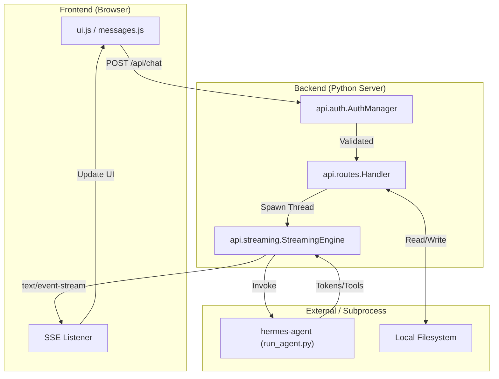

Sources: [README.md:7-31](), [api/routes.py:1-50](), [api/streaming.py:10-100]()

---

### Key Components

#### 1. Environment and Bootstrap

The system is designed to be self-configuring. The `bootstrap.py` script identifies the local Python environment and ensures the `hermes-agent` dependency is correctly mapped. Configuration is primarily driven by environment variables defined in `.env`.

- **Primary Entrypoint**: `bootstrap.py`
- **Configuration Logic**: `api/config.py`
- **For details, see [Getting Started](#1.1)**.

#### 2. Backend API Layer

The backend is a custom-built `ThreadingHTTPServer` that avoids heavy dependencies like Flask or FastAPI to maintain a small footprint. It handles everything from PBKDF2-based authentication to session persistence in JSON and SQLite.

- **Server Core**: `server.py`
- **Routing**: `api/routes.py`
- **Session Management**: `api/models.py`
- **For details, see [Backend API Layer](#2)**.

#### 3. Agent Execution & Streaming

The core value of Web3Hermes is its ability to stream AI responses while allowing the agent to perform tool calls (like filesystem edits or shell commands). It uses Server-Sent Events (SSE) to provide a "live" feel.

- **Streaming Logic**: `api/streaming.py`
- **Approval/Clarification**: `api/clarify.py`
- **For details, see [Agent Execution and Streaming](#3)**.

#### 4. Workspace and File Management

The UI includes a full-featured file browser that allows users to manage the agent's workspace directly. It supports Git status visualization and provides security guards to prevent path traversal.

- **Filesystem API**: `api/workspace.py`
- **External Monitoring**: `api/gateway_watcher.py`
- **For details, see [Workspace and File Management](#4)**.

---

### Code Entity Mapping

The following diagram maps high-level system responsibilities to specific classes and files within the repository.

**Code Entity Map**

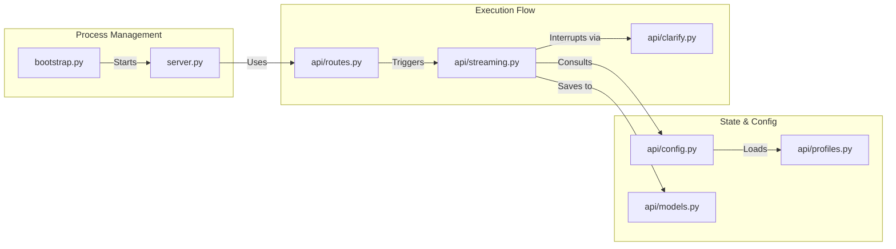

Sources: [bootstrap.py:1-20](), [server.py:1-30](), [api/config.py:1-40](), [api/streaming.py:1-50]()

### Next Steps

- To set up your local environment, proceed to **[Getting Started](#1.1)**.
- To understand the deep technical flow of requests and data, see **[System Architecture](#1.2)**.
- For detailed API documentation, see **[Backend API Layer](#2)**.

---

# Page: Getting Started

# Getting Started

<details>
<summary>Relevant source files</summary>

The following files were used as context for generating this wiki page:

- [.env.example](.env.example)
- [bootstrap.py](bootstrap.py)
- [requirements.txt](requirements.txt)
- [start.sh](start.sh)

</details>

The Web3Hermes Web UI is designed for rapid deployment with minimal dependencies. It functions as a lightweight management layer over the `hermes-agent` core. This page provides technical details on the bootstrap process, environment configuration, and the initialization sequence.

## Prerequisites and Platform Support

The Web UI backend requires **Python 3.8+** and the `pyyaml` library `[requirements.txt:1-4]()`.

While the server is cross-platform, the `bootstrap.py` script enforces specific platform constraints to ensure a reliable installation of the underlying agent:

- **Supported:** Linux, macOS, and Windows via **WSL2** `[bootstrap.py:32-47]()`.
- **Unsupported:** Native Windows (CMD/PowerShell) is currently not supported by the bootstrap script `[bootstrap.py:42-46]()`.

## Installation via Bootstrap

The primary entry point for users is `bootstrap.py`. This script automates the discovery of the `hermes-agent` repository, manages a local virtual environment for the Web UI, and launches the HTTP server.

### Discovery Logic

The bootstrap process attempts to locate the `hermes-agent` directory and a compatible Python interpreter using a hierarchical search strategy.

| Entity                 | Discovery Strategy                                                                                                                                  |
| :--------------------- | :-------------------------------------------------------------------------------------------------------------------------------------------------- |
| **Agent Directory**    | Checks `HERMES_WEBUI_AGENT_DIR` env, then `~/.hermes/hermes-agent`, then parent directories, and finally `~/hermes-agent` `[bootstrap.py:49-64]()`. |
| **Python Interpreter** | Checks `HERMES_WEBUI_PYTHON` env, then looks for `venv` or `.venv` inside the agent directory or Web UI root `[bootstrap.py:67-80]()`.              |
| **Dependencies**       | If `pyyaml` is missing from the chosen Python, it creates a local `.venv` and installs requirements `[bootstrap.py:83-117]()`.                      |

### Execution Flow

The following diagram illustrates the `main()` execution flow in `bootstrap.py`.

**Bootstrap Lifecycle and Process Spawning**

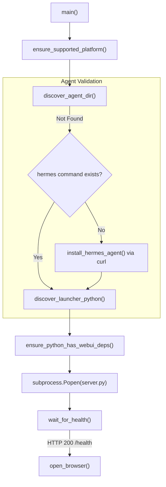

Sources: `[bootstrap.py:170-213]()`, `[bootstrap.py:120-130]()`, `[bootstrap.py:83-117]()`

## Environment Configuration

The system uses environment variables for configuration, which can be persisted in a `.env` file at the repository root. The `start.sh` script automatically sources this file before executing the bootstrap script `[start.sh:6-11]()`.

### Key Environment Variables

| Variable                 | Description                              | Default                 |
| :----------------------- | :--------------------------------------- | :---------------------- |
| `HERMES_WEBUI_HOST`      | Network interface to bind the server to. | `127.0.0.1`             |
| `HERMES_WEBUI_PORT`      | Port for the HTTP server.                | `8787`                  |
| `HERMES_HOME`            | Base directory for all Hermes data.      | `~/.hermes`             |
| `HERMES_WEBUI_STATE_DIR` | Location for sessions and workspaces.    | `~/.hermes/webui`       |
| `HERMES_WEBUI_AGENT_DIR` | Path to the `hermes-agent` source code.  | (Auto-discovered)       |
| `HERMES_CONFIG_PATH`     | Path to the agent's `config.yaml`.       | `~/.hermes/config.yaml` |

Sources: `[.env.example:1-32]()`, `[bootstrap.py:22-23]()`, `[bootstrap.py:184-187]()`

## First-Run Onboarding Wizard

When the Web UI starts, it checks for the existence of a valid `config.yaml` and provider credentials. If these are missing, the UI intercepts the user and presents an onboarding wizard.

### Onboarding State Machine

The backend logic in `api/onboarding.py` (referenced in the architecture) drives the frontend `onboarding.js` through several states:

1.  **Agent Discovery**: Ensuring the `hermes-agent` code is accessible.
2.  **Provider Selection**: Choosing between OpenRouter, Anthropic, OpenAI, or Custom LLM providers.
3.  **Credential Configuration**: Writing API keys to the `.env` file and configuring `config.yaml`.
4.  **Verification**: Confirming the agent can successfully initialize with the provided settings.

### Code-to-System Mapping: Startup Sequence

The following diagram maps the natural language "Startup" concept to the specific code entities involved in the process.

**Startup Entity Mapping**

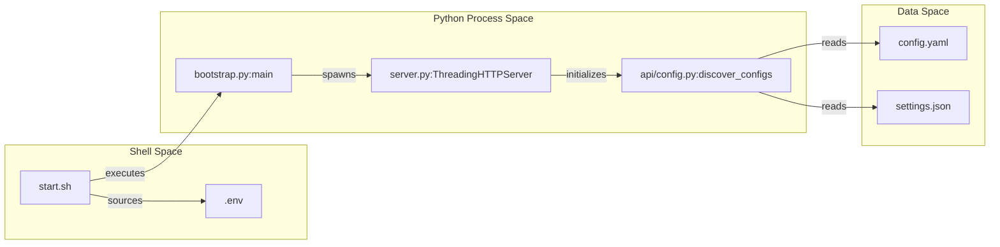

Sources: `[start.sh:13-25]()`, `[bootstrap.py:198-206]()`, `[.env.example:1-5]()`

## Manual Execution

While `bootstrap.py` is recommended, the server can be started manually if dependencies are met:

```bash
# Install dependencies
pip install -r requirements.txt

# Run the server directly
python server.py
```

Note: When running `server.py` directly, ensure `HERMES_WEBUI_AGENT_DIR` is set if the agent is not in a default location, as the server relies on this to locate the agent's execution modules.

---

# Page: System Architecture

# System Architecture

<details>
<summary>Relevant source files</summary>

The following files were used as context for generating this wiki page:

- [README.md](README.md)
- [api/**init**.py](api/__init__.py)
- [api/startup.py](api/startup.py)
- [server.py](server.py)

</details>

The Web3Hermes system is structured as a three-layer architecture designed to provide a responsive, web-based interface for the `hermes-agent`. It transitions from low-level environment preparation to a multi-threaded Python backend, and finally to a rich single-page application (SPA) in the browser.

## High-Level Architecture

The system operates across three distinct execution phases:

1.  **Bootstrap & Startup**: Environment validation, dependency injection, and security hardening.
2.  **Python HTTP Server**: A multi-threaded backend that manages state, authentication, and the lifecycle of AI agent instances.
3.  **Frontend UI**: A vanilla JavaScript SPA that communicates with the backend via REST and Server-Sent Events (SSE).

### System Component Overview

Title: Three-Layer System Architecture

```mermaid
graph TD
    subgraph "Layer 3: Frontend UI (Browser)"
        "ui.js"["ui.js (Global State)"]
        "messages.js"["messages.js (SSE Consumer)"]
        "workspace.js"["workspace.js (File Browser)"]
    end

    subgraph "Layer 2: Python HTTP Server (Backend)"
        "server.py"["server.py (ThreadingHTTPServer)"]
        "api/routes.py"["api/routes.py (Dispatcher)"]
        "api/streaming.py"["api/streaming.py (Agent Runner)"]
        "api/config.py"["api/config.py (State/Env)"]
    end

    subgraph "Layer 1: Bootstrap/Startup"
        "bootstrap.py"["bootstrap.py (Entry)"]
        "api/startup.py"["api/startup.py (Fixers)"]
    end

    subgraph "External"
        "hermes-agent"["hermes-agent (Core Logic)"]
        "LLM"["LLM Providers (OpenAI/Anthropic)"]
    end

    "bootstrap.py" --> "api/startup.py"
    "api/startup.py" --> "server.py"
    "server.py" --> "api/routes.py"
    "api/routes.py" --> "api/streaming.py"
    "api/streaming.py" --> "hermes-agent"
    "hermes-agent" --> "LLM"
    "messages.js" -- "SSE /api/stream" --> "api/streaming.py"
    "ui.js" -- "REST API" --> "api/routes.py"
```

Sources: [server.py:1-21](), [api/startup.py:1-5](), [README.md:41-56]()

---

## Layer 1: Bootstrap and Startup

The startup sequence ensures that the `hermes-agent` core is correctly integrated into the Web UI environment.

- **Dependency Resolution**: The system automatically detects the location of the `hermes-agent` via `HERMES_WEBUI_AGENT_DIR` or the default `~/.hermes/hermes-agent` path [api/startup.py:34-42]().
- **Auto-Installation**: If dependencies are missing, `auto_install_agent_deps` triggers `pip install` against the agent's `requirements.txt` or `pyproject.toml` [api/startup.py:44-59]().
- **Security Hardening**: The `fix_credential_permissions` function ensures sensitive files like `.env` and `.signing_key` are set to `0600` (owner-only) permissions to prevent data leakage in multi-user environments [api/startup.py:16-32]().

Sources: [api/startup.py:16-74](), [server.py:88-135]()

---

## Layer 2: Python HTTP Server (The "Bridge")

The backend is built on a `ThreadingHTTPServer` named `QuietHTTPServer`, which is customized to suppress common network noise such as `BrokenPipeError` during client disconnects [server.py:23-42]().

### Request Lifecycle

1.  **Ingress**: Requests hit the `Handler` class (a subclass of `BaseHTTPRequestHandler`) [server.py:45-47]().
2.  **Authentication**: Every request is passed through `check_auth` before processing [server.py:67-79]().
3.  **Routing**: The `handle_get` and `handle_post` functions in `api/routes.py` act as the central dispatcher [server.py:68-80]().
4.  **Logging**: Successful and failed requests are logged in a structured JSON format for observability [server.py:50-61]().

### Integration with hermes-agent

The Web UI does not reimplement the agent; it imports it. The backend manages a global dictionary of `AGENT_INSTANCES` and handles the complexities of threading and SSE (Server-Sent Events) to provide a "live" feel in the browser.

Title: Request Dispatching to Code Entities

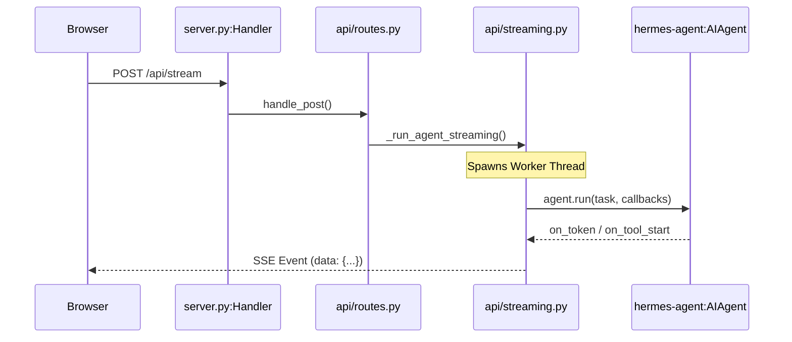

Sources: [server.py:75-86](), [api/routes.py:19-20](), [api/streaming.py:1-20]()

---

## Layer 3: Frontend UI

The frontend is a Single Page Application (SPA) that avoids complex frameworks to maintain a small footprint. It uses a global state object `S` to track the active session, workspace path, and UI settings.

### Data Flow: Browser to LLM and Back

The data flow is asynchronous and event-driven:

1.  **User Input**: The user types a message in the UI. `messages.js` captures this and sends a `POST` request to `/api/stream`.
2.  **Stream Initiation**: The backend validates the session and starts a background thread. It immediately returns a `text/event-stream` response.
3.  **Token Generation**: As the LLM generates text, the `hermes-agent` triggers callbacks. The `api/streaming.py` module translates these into SSE events (e.g., `token`, `thought`, `tool_call`).
4.  **UI Update**: The browser's `EventSource` (or `fetch` with stream reader) receives these chunks. `messages.js` appends tokens to the DOM in real-time, while `ui.js` updates the scroll position.
5.  **Finalization**: When the agent finishes, a `done` event is sent, and the backend persists the updated session JSON to the `SESSION_DIR` [server.py:138]().

### Workspace Integration

The UI includes a file browser (`workspace.js`) that interacts with `api/workspace.py`. This allows the user to browse the local filesystem, which the agent can also access via its internal tools, creating a shared context between the user and the AI.

Title: Data Flow and State Persistence

```mermaid
graph LR
    subgraph "Browser Space"
        "UI_Input"["User Message"]
        "DOM"["Chat Display"]
    end

    subgraph "Server Space"
        "Streaming"["api/streaming.py"]
        "Models"["api/models.py (Session)"]
        "Filesystem"["SESSION_DIR/*.json"]
    end

    "UI_Input" -- "POST /api/stream" --> "Streaming"
    "Streaming" -- "SSE Events" --> "DOM"
    "Streaming" -- "Update State" --> "Models"
    "Models" -- "Write" --> "Filesystem"
```

Sources: [README.md:74-98](), [server.py:137-140](), [api/config.py:17-20]()

---

# Page: Backend API Layer

# Backend API Layer

<details>
<summary>Relevant source files</summary>

The following files were used as context for generating this wiki page:

- [api/**init**.py](api/__init__.py)
- [api/routes.py](api/routes.py)
- [server.py](server.py)

</details>

The Backend API Layer of Web3Hermes is a Python-based micro-framework designed to bridge the Web UI with the underlying `hermes-agent` logic. It provides a multi-threaded HTTP server, session persistence, workspace management, and a real-time streaming interface for LLM interactions.

The backend is structured as a thin entry-point shell (`server.py`) that delegates all business logic to modular components within the `api/` directory.

### System Architecture Overview

The following diagram illustrates the relationship between the HTTP server components and the modular API subsystems.

**Backend Component Map**

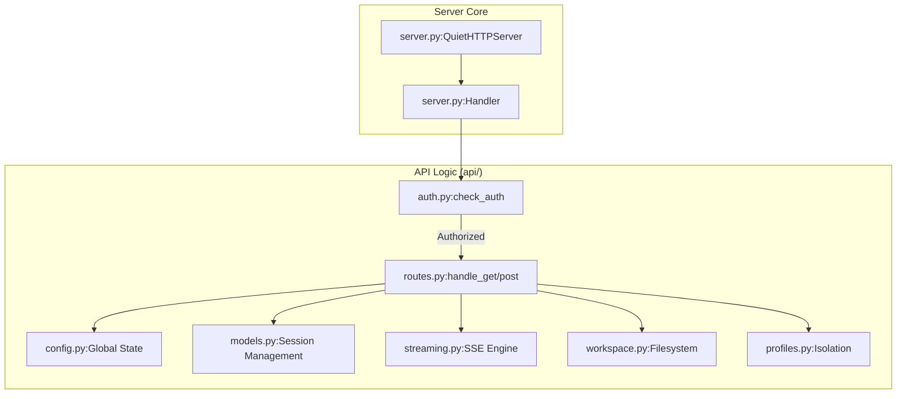

**Sources:** [server.py:3-20](), [api/routes.py:1-43]()

---

### Core Subsystems

The backend is divided into several specialized subsystems, each handling a specific domain of the application lifecycle.

#### HTTP Server and Request Routing

The entry point is a `ThreadingHTTPServer` defined in `server.py`. It uses a custom `Handler` to manage the request lifecycle, including structured JSON logging and security checks. Requests are dispatched to `api/routes.py`, which contains the logic for specific endpoints like `/api/sessions` or `/api/chat`.

- **Key Entities:** `QuietHTTPServer`, `Handler`, `handle_get`, `handle_post`.
- **Details:** See [HTTP Server and Request Routing](#2.1).
- **Sources:** [server.py:23-85](), [api/routes.py:440-1010]()

#### Configuration and Environment Discovery

The `api/config.py` module manages the system's global state and environment detection. It locates the `hermes-agent` installation, resolves the correct Python interpreter, and maintains global thread-safe dictionaries for active streams and cancellation flags.

- **Key Entities:** `STREAMS`, `CANCEL_FLAGS`, `AGENT_INSTANCES`, `load_settings`.
- **Details:** See [Configuration and Environment Discovery](#2.2).
- **Sources:** [api/config.py:20-100]()

#### Profile Management

Web3Hermes supports isolated user profiles. The `api/profiles.py` module handles switching between these profiles by re-routing the `HERMES_HOME` directory, isolating `.env` files, and monkey-patching modules to ensure runtime consistency.

- **Key Entities:** `switch_profile`, `get_active_profile_name`, `HERMES_HOME`.
- **Details:** See [Profile Management](#2.3).
- **Sources:** [api/profiles.py:1-50]()

#### Authentication and Security

Security is enforced through a combination of CSRF validation in `api/routes.py` and session-based authentication in `api/auth.py`. The system supports optional PBKDF2-SHA256 password hashing and HMAC-signed cookies.

- **Key Entities:** `check_auth`, `_check_csrf`, `is_auth_enabled`.
- **Details:** See [Authentication and Security](#2.4).
- **Sources:** [api/auth.py:10-60](), [api/routes.py:123-159]()

#### Session and Data Models

The `Session` class in `api/models.py` represents a conversation thread. It handles persistence to JSON files, LRU caching for performance, and provides a bridge to the SQLite `state.db` used by the CLI agent.

- **Key Entities:** `Session`, `get_session`, `all_sessions`, `import_cli_session`.
- **Details:** See [Session and Data Models](#2.5).
- **Sources:** [api/models.py:40-200]()

---

### Request Lifecycle Diagram

This diagram maps the flow of a standard API request from the network layer into the specific code entities that process it.

**Request Flow: Network to Code**

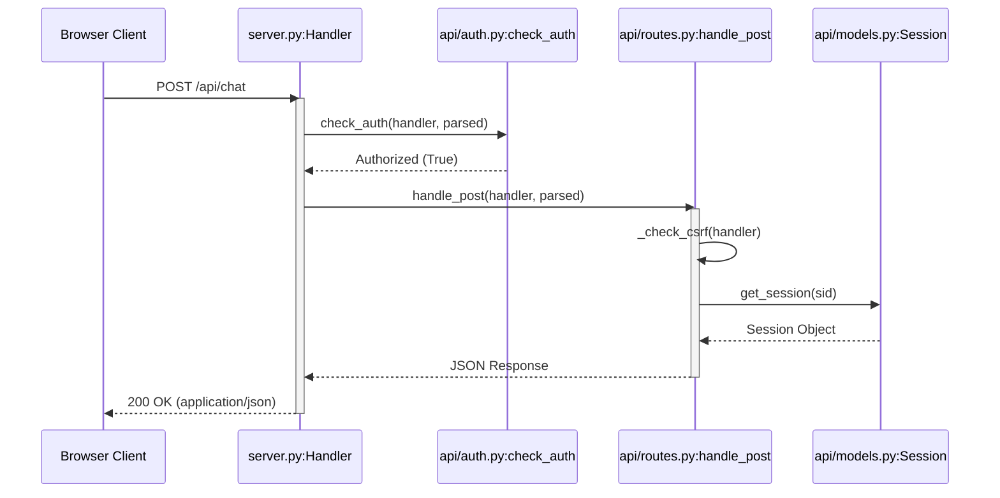

**Sources:** [server.py:75-85](), [api/routes.py:123-159](), [api/auth.py:120-150]()

### Key Global State

The backend maintains several thread-safe global objects to manage concurrent agent executions:

| Object            | File            | Purpose                                                       |
| :---------------- | :-------------- | :------------------------------------------------------------ |
| `STREAMS`         | `api/config.py` | Maps session IDs to active SSE generators.                    |
| `CANCEL_FLAGS`    | `api/config.py` | Thread-safe events to signal agent interruption.              |
| `AGENT_INSTANCES` | `api/config.py` | Cached `AIAgent` objects to avoid re-initialization overhead. |
| `SESSIONS`        | `api/config.py` | LRU cache of `Session` model instances.                       |

**Sources:** [api/config.py:270-310]()

---

# Page: HTTP Server and Request Routing

# HTTP Server and Request Routing

<details>
<summary>Relevant source files</summary>

The following files were used as context for generating this wiki page:

- [api/helpers.py](api/helpers.py)
- [api/routes.py](api/routes.py)
- [server.py](server.py)

</details>

This section details the implementation of the Web3Hermes backend server, focusing on the request lifecycle, routing mechanisms, and security protocols enforced at the network boundary. The system utilizes a multi-threaded Python HTTP server to manage concurrent client sessions and background agent execution.

## Server Architecture

The core of the backend is built on the standard library `ThreadingHTTPServer`, customized to provide structured logging and resilient connection handling.

### QuietHTTPServer and Handler

The `QuietHTTPServer` class extends `ThreadingHTTPServer` to suppress common network noise, such as `ConnectionResetError` or `BrokenPipeError`, which frequently occur during streaming or client-side navigation [server.py:23-43]().

The `Handler` class, inheriting from `BaseHTTPRequestHandler`, serves as the primary entry point for every HTTP request. It implements:

- **Timeouts**: A 30-second timeout to prevent thread exhaustion from idle connections [server.py:46]().
- **Structured Logging**: Overrides `log_request` to output JSON-formatted logs containing timestamps, methods, paths, status codes, and request duration in milliseconds [server.py:50-61]().
- **Request Dispatching**: Logic for `do_GET` and `do_POST` which manages authentication checks and hands off to the routing layer [server.py:63-86]().

### Diagram: Server Component Interaction

This diagram maps the high-level server concepts to their specific code entities.

```mermaid
graph TD
    subgraph "Code Entity Space"
        A["QuietHTTPServer (server.py)"] -- "instantiates" --> B["Handler (server.py)"]
        B -- "calls" --> C["check_auth (api/auth.py)"]
        B -- "GET /api/*" --> D["handle_get (api/routes.py)"]
        B -- "POST /api/*" --> E["handle_post (api/routes.py)"]
        D -- "returns" --> F["j() or t() (api/helpers.py)"]
        E -- "returns" --> F
    end

    subgraph "Natural Language Space"
        "Network Listener" --> A
        "Request Lifecycle" --> B
        "Security Guard" --> C
        "Route Dispatcher" --> D
        "Route Dispatcher" --> E
        "Response Formatter" --> F
    end
```

**Sources:** [server.py:23-86](), [api/routes.py:1-20](), [api/helpers.py:57-80]()

---

## Request Lifecycle and Routing

Every request follows a strict sequence: arrival at the socket, authentication validation, CSRF verification (for POST), routing to a specific logic handler, and finally, a formatted response.

### 1. Authentication Check

Before any routing occurs, the `Handler` calls `check_auth`. If authentication is enabled and the session is invalid, the request is intercepted [server.py:67,79]().

### 2. Routing Logic

The routing is centralized in `api/routes.py`. Unlike traditional frameworks, Web3Hermes uses a dispatch pattern inside `handle_get` and `handle_post`.

- **GET Requests**: Handle static assets (HTML/JS/CSS), session retrieval, and status checks [api/routes.py:315-460]().
- **POST Requests**: Handle state-changing actions like sending messages, creating sessions, updating settings, and file uploads [api/routes.py:463-750]().

### 3. Response Helpers

The `api/helpers.py` module provides standardized response functions:

- `j(handler, payload, status)`: Sends a JSON response with appropriate headers [api/helpers.py:57-66]().
- `t(handler, payload, status, content_type)`: Sends plain text or HTML [api/helpers.py:69-78]().
- `bad(handler, msg, status)`: A wrapper for returning consistent error objects [api/helpers.py:17-19]().

### Diagram: Request Data Flow

The flow of a single POST request through the system.

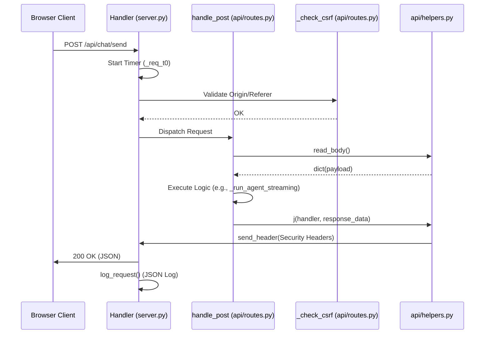

**Sources:** [server.py:75-86](), [api/routes.py:123-158](), [api/helpers.py:166-176](), [api/helpers.py:57-66]()

---

## Security and Protection Mechanisms

### CSRF Protection

The server implements strict Cross-Origin Resource Sharing (CORS) and Cross-Site Request Forgery (CSRF) checks for all POST requests. The `_check_csrf` function validates the `Origin` and `Referer` headers against the `Host` header and an optional `HERMES_WEBUI_ALLOWED_ORIGINS` environment variable [api/routes.py:123-158](). It accounts for reverse proxies by checking `X-Forwarded-Host` [api/routes.py:149]().

### Security Headers

Every response generated via the helper functions `j()` or `t()` automatically includes a suite of security headers via `_security_headers()` [api/helpers.py:38-55]():

- `X-Content-Type-Options: nosniff`
- `X-Frame-Options: DENY`
- `Content-Security-Policy`: Restricts script/style sources and prevents clickjacking [api/helpers.py:44-50]().
- `Permissions-Policy`: Disables sensitive browser features like the camera [api/helpers.py:51-54]().

### TLS Support

The server supports native TLS. If `TLS_ENABLED` is set in the configuration, the server wraps the socket using an `ssl.SSLContext` requiring at least TLS v1.2 [server.py:151-163]().

### Credential Redaction

To prevent accidental leakage of API keys or secrets in logs or the UI, `api/helpers.py` includes a `redact_session_data` function. It uses regular expressions to identify and mask common credential patterns (e.g., `sk-...`, `ghp_...`, `AKIA...`) in session titles and message contents before they are sent to the client [api/helpers.py:86-163]().

**Sources:** [api/routes.py:123-158](), [api/helpers.py:38-55](), [server.py:151-163](), [api/helpers.py:150-163]()

---

# Page: Configuration and Environment Discovery

# Configuration and Environment Discovery

<details>
<summary>Relevant source files</summary>

The following files were used as context for generating this wiki page:

- [api/config.py](api/config.py)
- [api/profiles.py](api/profiles.py)
- [api/startup.py](api/startup.py)

</details>

The Web3Hermes backend relies on a robust discovery mechanism to locate the core `hermes-agent` logic, resolve the correct Python execution environment, and maintain persistent user settings. This configuration layer is centralized in `api/config.py`, which serves as the primary source of truth for all other modules.

## Agent and Interpreter Discovery

The system employs a multi-strategy search to locate the `hermes-agent` directory and a compatible Python interpreter. This allows the Web UI to function whether it is installed as a sibling to the agent, nested within it, or installed via a global `HERMES_HOME` directory.

### Directory Discovery Strategy

The function `_discover_agent_dir()` iterates through the following candidates until a directory containing `run_agent.py` is found:

1.  **Environment Variable**: `HERMES_WEBUI_AGENT_DIR` [api/config.py:71-74]().
2.  **Profile Home**: `HERMES_HOME/hermes-agent` [api/config.py:77-78]().
3.  **Sibling Directory**: `../hermes-agent` relative to the Web UI root [api/config.py:81]().
4.  **Nested Layout**: Checking if the parent directory itself contains `run_agent.py` [api/config.py:84-85]().
5.  **Standard Install**: `~/.hermes/hermes-agent` or `~/hermes-agent` [api/config.py:88-91]().

### Interpreter Resolution

Once the agent directory is found, `_discover_python()` resolves the executable path [api/config.py:100-136](). It prioritizes the agent's internal virtual environment (`venv/bin/python`) to ensure that all dependencies (like `pydantic` or `openai`) are the specific versions required by the agent logic [api/config.py:114-121]().

### Dependency Injection

To allow the Web UI to import agent modules directly, the discovered `_AGENT_DIR` is appended to `sys.path` [api/config.py:158-160](). It is specifically added to the **end** of the path to prevent local agent-bundled dependencies from overriding the host's site-packages, which avoids binary compatibility issues (e.g., loading Linux `.so` files on macOS) [api/config.py:143-156]().

**Sources:** [api/config.py:56-163](), [api/startup.py:34-42]()

## Profile and Environment Isolation

Web3Hermes supports multiple profiles, each with its own `HERMES_HOME`. The configuration system must dynamically react to profile switches to prevent data leakage between environments.

### Profile Initialization

At startup, `init_profile_state()` is called to set the initial `HERMES_HOME` based on the `active_profile` file [api/profiles.py:160-170](). This process involves:

1.  **Setting Environment Variables**: Updating `os.environ['HERMES_HOME']` [api/profiles.py:105]().
2.  **Dotenv Loading**: Parsing the profile's `.env` file and loading keys into the process environment [api/profiles.py:126-157]().
3.  **Monkey-Patching**: Overriding cached paths in imported agent modules (e.g., `tools.skills_tool` and `cron.jobs`) that may have captured the old `HERMES_HOME` during their initial import [api/profiles.py:107-123]().

### Configuration Persistence

Settings are stored in `settings.json` within the `STATE_DIR` [api/config.py:48](). While `config.yaml` contains provider and model routing (managed via `get_config()` [api/config.py:183-187]()), `settings.json` stores Web UI-specific preferences like themes and interface toggles.

**Sources:** [api/config.py:170-209](), [api/profiles.py:1-170]()

## Global State and Thread Safety

The backend maintains several global dictionaries to track the state of the server across multiple HTTP request threads. Access to these structures is protected by `threading.Lock` instances.

### Key State Objects

| Object            | Type                | Purpose                                                                            |
| :---------------- | :------------------ | :--------------------------------------------------------------------------------- |
| `STREAMS`         | `dict[str, Thread]` | Maps session IDs to active streaming threads [api/config.py:218]().                |
| `CANCEL_FLAGS`    | `dict[str, bool]`   | Signals to a streaming thread that it should terminate [api/config.py:221]().      |
| `AGENT_INSTANCES` | `dict[str, object]` | Caches `AIAgent` instances to maintain conversation context [api/config.py:224](). |
| `_cfg_cache`      | `dict`              | Cached contents of the active profile's `config.yaml` [api/config.py:166]().       |

### Discovery and State Mapping

The following diagram illustrates how configuration discovery links filesystem entities to runtime code objects.

**Environment Discovery and State Mapping**

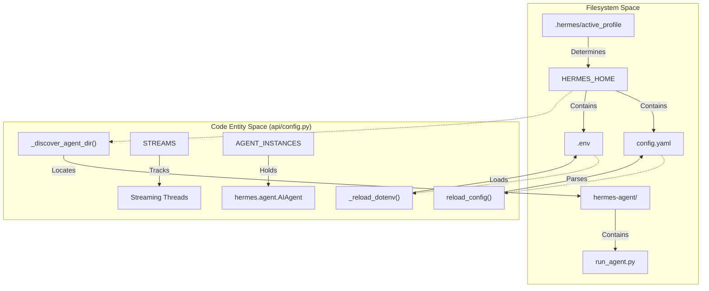

**Sources:** [api/config.py:56-97](), [api/config.py:190-205](), [api/config.py:218-224](), [api/profiles.py:73-83](), [api/profiles.py:126-157]()

## Data Flow: Configuration and Profile Switching

When a user switches profiles, the system must synchronize multiple layers of configuration. This flow ensures that the next agent execution uses the correct API keys and model settings.

**Profile Switch Execution Flow**

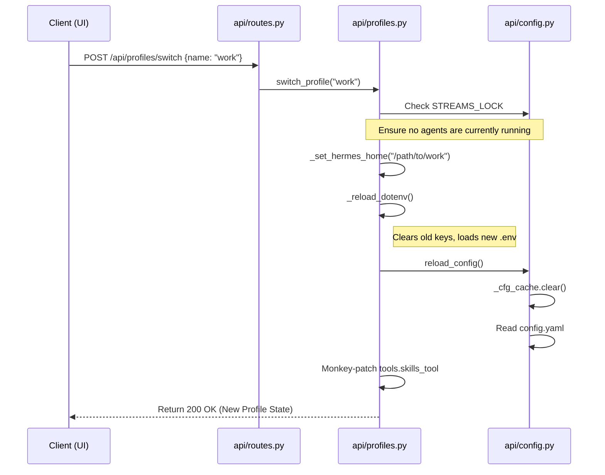

### Security Considerations

The discovery and configuration process includes a security pass via `fix_credential_permissions()`, which ensures that sensitive files like `.env`, `auth.json`, and `.signing_key` are set to `chmod 600` (owner-only access) within the active `HERMES_HOME` [api/startup.py:16-31]().

**Sources:** [api/config.py:190-205](), [api/profiles.py:173-205](), [api/startup.py:7-31]()

---

# Page: Profile Management

# Profile Management

<details>
<summary>Relevant source files</summary>

The following files were used as context for generating this wiki page:

- [api/config.py](api/config.py)
- [api/profiles.py](api/profiles.py)

</details>

The Profile Management system in Web3Hermes provides environment isolation and runtime switching of agent identities. It manages the `HERMES_HOME` directory, which contains profile-specific configurations, skills, memories, and API keys. This system ensures that the Web UI can transition between different agent contexts without restarting the server process.

## Architecture and Data Flow

Profile management revolves around the distinction between the base installation directory and the active profile's data directory. The system uses environment variable manipulation and module monkey-patching to redirect the `hermes-agent` logic to the correct filesystem paths at runtime.

### HERMES_BASE_HOME vs HERMES_HOME

The system distinguishes between two primary directory types:

1.  **`HERMES_BASE_HOME`**: The root directory (typically `~/.hermes`) containing the `profiles/` subdirectory and the sticky `active_profile` file [api/profiles.py:34-68]().
2.  **`HERMES_HOME`**: The path to the currently active profile. For the "default" profile, this is the same as the base home. For others, it points to a subdirectory within `profiles/` [api/profiles.py:93-101]().

### Profile Discovery and Resolution

The `_resolve_base_hermes_home` function determines the root of the profile system by checking `HERMES_BASE_HOME`, then `HERMES_HOME` (if not already pointing to a profile), and finally defaulting to `~/.hermes` [api/profiles.py:34-68]().

### Profile Isolation Logic

The following diagram illustrates how the system resolves paths and isolates environment variables during a profile switch.

**Diagram: Profile Environment Isolation**

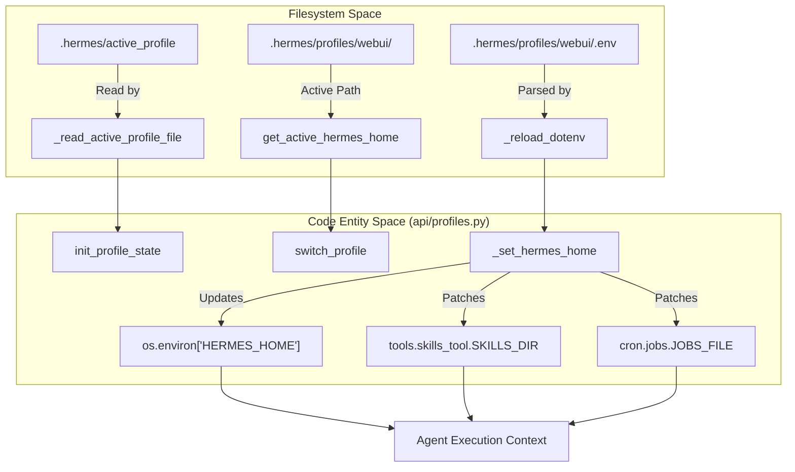

Sources: [api/profiles.py:34-125](), [api/profiles.py:160-181]()

## Implementation Details

### Runtime Switching and Monkey-Patching

When `switch_profile(name)` is called, the system performs several critical steps to ensure the new profile is fully active across all imported modules:

1.  **Concurrency Guard**: It checks the `STREAMS` dictionary in `api/config.py` to ensure no agent is currently running. Switching profiles during an active stream is blocked to prevent data corruption [api/profiles.py:188-193]().
2.  **Environment Variable Update**: `os.environ['HERMES_HOME']` is updated to the new path [api/profiles.py:105]().
3.  **Module Patching**: Because some `hermes-agent` modules (like `skills_tool` and `cron.jobs`) snapshot `HERMES_HOME` at import time, `api/profiles.py` manually overwrites these cached module-level variables with the new paths [api/profiles.py:107-124]().
4.  **Dotenv Isolation**: The `_reload_dotenv` function clears any environment variables set by the _previous_ profile before loading the new `.env` file. This prevents API key leakage between profiles [api/profiles.py:126-158]().
5.  **Persistence**: The new profile name is written to `~/.hermes/active_profile` to make the selection "sticky" across server restarts [api/profiles.py:214]().

### Configuration Reloading

After the profile paths are updated, `api/config.py` must reload the `config.yaml` from the new `HERMES_HOME`. This is handled by `reload_config()`, which clears the `_cfg_cache` and re-reads the file from the path provided by `_get_config_path()` [api/config.py:170-205]().

**Diagram: Profile Switch Sequence**

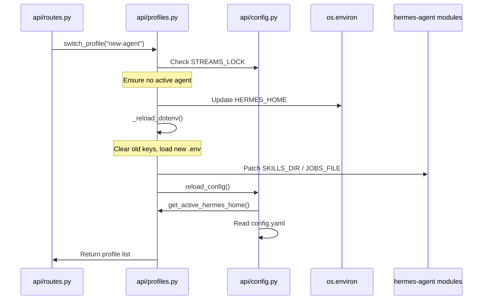

Sources: [api/profiles.py:173-220](), [api/config.py:190-205]()

## Key Functions

| Function                   | Description                                                                                                                 |
| :------------------------- | :-------------------------------------------------------------------------------------------------------------------------- |
| `init_profile_state()`     | Called at startup to set the initial `HERMES_HOME` and load the environment [api/profiles.py:160-171]().                    |
| `switch_profile(name)`     | The primary entry point for changing profiles at runtime. Handles validation and state updates [api/profiles.py:173-220](). |
| `_reload_dotenv(home)`     | Ensures strict isolation by clearing old keys before loading the new profile's `.env` [api/profiles.py:126-158]().          |
| `get_active_hermes_home()` | Returns the resolved `Path` to the current profile's data directory [api/profiles.py:93-101]().                             |
| `_set_hermes_home(home)`   | Performs the low-level `os.environ` update and module monkey-patching [api/profiles.py:103-125]().                          |

Sources: [api/profiles.py:93-220]()

---

# Page: Authentication and Security

# Authentication and Security

<details>
<summary>Relevant source files</summary>

The following files were used as context for generating this wiki page:

- [api/auth.py](api/auth.py)
- [api/helpers.py](api/helpers.py)

</details>

This page documents the security architecture of Web3Hermes, primarily managed by `api/auth.py` and enforced through `api/helpers.py`. The system supports optional session-based authentication, cryptographically secure password hashing, and proactive data redaction to prevent credential leakage.

## Authentication Overview

Authentication in Web3Hermes is off by default for local-first ease of use. It can be enabled by setting the `HERMES_WEBUI_PASSWORD` environment variable or by configuring a password in the Web UI settings [api/auth.py:2-5]().

### Identity and Access Management flow

The following diagram illustrates the transition from an unauthenticated request to a validated session.

**Diagram: Authentication Verification Flow**

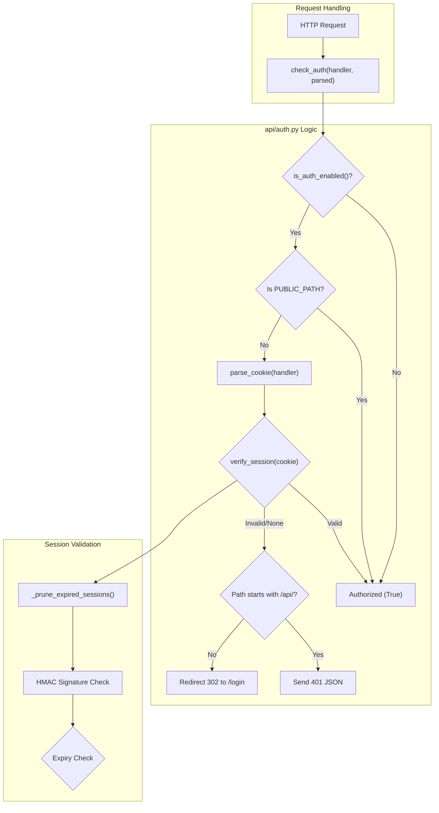

**Sources:** [api/auth.py:158-180](), [api/auth.py:121-134](), [api/auth.py:19-22]()

## Cryptography and Password Security

Web3Hermes utilizes industry-standard cryptographic primitives to protect user credentials and session integrity.

### Password Hashing

Passwords are never stored in plaintext. The system uses **PBKDF2-SHA256** with 600,000 iterations [api/auth.py:73-80]().

- **Salt Generation:** A unique 32-byte signing key is generated upon first run and persisted in `STATE_DIR/.signing_key` with restricted permissions (`0o600`) [api/auth.py:51-69]().
- **Storage:** The resulting hex string is stored in `settings.json` under the key `password_hash` [api/auth.py:83-91]().

### Session Management

When a user successfully authenticates via `verify_password(plain)` [api/auth.py:98-103](), a session is created:

1.  **Token Generation:** A 32-byte random hex token is generated [api/auth.py:108]().
2.  **Signing:** The token is signed using HMAC-SHA256 with the local `.signing_key`. The resulting cookie value is formatted as `token.signature` [api/auth.py:110-111]().
3.  **Persistence:** The token and its expiry (24-hour TTL) are stored in the in-memory `_sessions` dictionary [api/auth.py:25-28]().
4.  **Cookie Security:** Cookies are issued with `HttpOnly`, `SameSite=Lax`, and `Secure` flags (if HTTPS is detected) [api/auth.py:183-195]().

**Sources:** [api/auth.py:51-81](), [api/auth.py:106-112](), [api/auth.py:183-195]()

## Request Security and Hardening

Security is enforced at the transport and response layers via `api/helpers.py`.

### Security Headers

The function `_security_headers(handler)` injects several headers into every response to mitigate common web vulnerabilities [api/helpers.py:38-55]():

| Header                    | Value                    | Purpose                                                |
| :------------------------ | :----------------------- | :----------------------------------------------------- |
| `X-Content-Type-Options`  | `nosniff`                | Prevents MIME type sniffing.                           |
| `X-Frame-Options`         | `DENY`                   | Prevents Clickjacking attacks.                         |
| `Referrer-Policy`         | `same-origin`            | Limits referrer information leakage.                   |
| `Content-Security-Policy` | `default-src 'self' ...` | Restricts resource loading to trusted origins.         |
| `Permissions-Policy`      | `camera=(), ...`         | Disables browser features like camera and geolocation. |

### Path Traversal Protection

The `safe_resolve(root, requested)` function prevents path traversal attacks by resolving the absolute path and verifying it remains within the intended root directory using `relative_to()` [api/helpers.py:31-35]().

**Sources:** [api/helpers.py:38-55](), [api/helpers.py:31-35]()

## Data Redaction and Privacy

To prevent sensitive credentials (API keys, tokens) from being exposed in the Web UI or logs, the system implements a redaction pipeline.

### Credential Redaction Logic

The `redact_session_data(session_dict)` function is called before sending session data to the client [api/helpers.py:150-163](). It recursively scans strings, dictionaries, and lists for patterns matching known sensitive formats.

**Diagram: Redaction Entity Mapping**

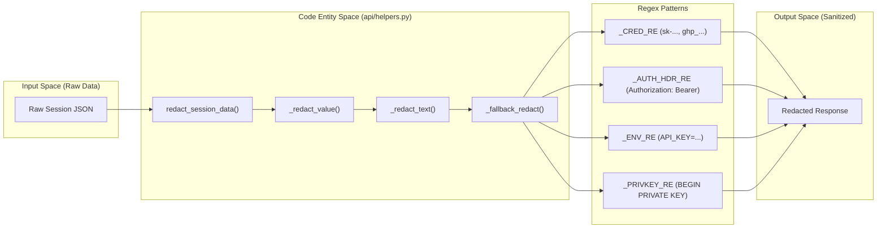

The redaction logic uses a masking strategy that preserves the first 6 and last 4 characters of a token (if long enough) to assist in debugging while obscuring the secret [api/helpers.py:119-120]().

**Sources:** [api/helpers.py:86-133](), [api/helpers.py:139-163]()

## Rate Limiting

The login endpoint is protected by a simple in-memory rate limiter to prevent brute-force attacks.

- **Limits:** A maximum of 5 attempts are allowed within a 60-second window per IP address [api/auth.py:31-33]().
- **Implementation:** `_check_login_rate(ip)` prunes old timestamps and validates the current attempt count before processing a login request [api/auth.py:35-42]().

**Sources:** [api/auth.py:31-48]()

---

# Page: Session and Data Models

# Session and Data Models

<details>
<summary>Relevant source files</summary>

The following files were used as context for generating this wiki page:

- [api/models.py](api/models.py)
- [api/state_sync.py](api/state_sync.py)

</details>

This section describes the data structures and persistence mechanisms used by the WebUI to manage chat history, metadata, and cross-platform session synchronization. The primary entity is the `Session` class, which handles JSON-based persistence and integrates with the `hermes-agent` SQLite state database.

## The Session Model

The `Session` class in `api/models.py` is the central data structure representing a conversation. It encapsulates message history, tool execution logs, token usage, and metadata such as associated projects or workspaces.

### Key Attributes

| Attribute      | Description                                                                                   |
| :------------- | :-------------------------------------------------------------------------------------------- |
| `session_id`   | A 12-character hex string derived from a UUID [api/models.py:52-52]().                        |
| `workspace`    | The absolute path to the directory where the agent executes commands [api/models.py:54-54](). |
| `messages`     | A list of message dictionaries (role, content) [api/models.py:56-56]().                       |
| `tool_calls`   | A log of tools invoked during the session [api/models.py:57-57]().                            |
| `token_counts` | `input_tokens` and `output_tokens` accumulated across the session [api/models.py:64-65]().    |
| `project_id`   | Optional grouping ID for the sidebar [api/models.py:62-62]().                                 |

### Session Lifecycle and Persistence

Sessions are stored as individual JSON files within the `SESSION_DIR` [api/models.py:74-75](). When a session is modified, the `save()` method serializes the entire `__dict__` to disk [api/models.py:80-83]().

To optimize performance, the system maintains an in-memory `LRU` (Least Recently Used) cache defined by `SESSIONS` and `SESSIONS_MAX` [api/models.py:13-14]().

**Sources:** [api/models.py:39-71](), [api/models.py:74-85](), [api/models.py:115-128]()

## Data Flow: Code Entities to Natural Language Space

The following diagram illustrates how user-facing concepts (like "Projects" or "Archived Chats") map to specific code attributes and persistence logic.

### Entity Mapping Diagram

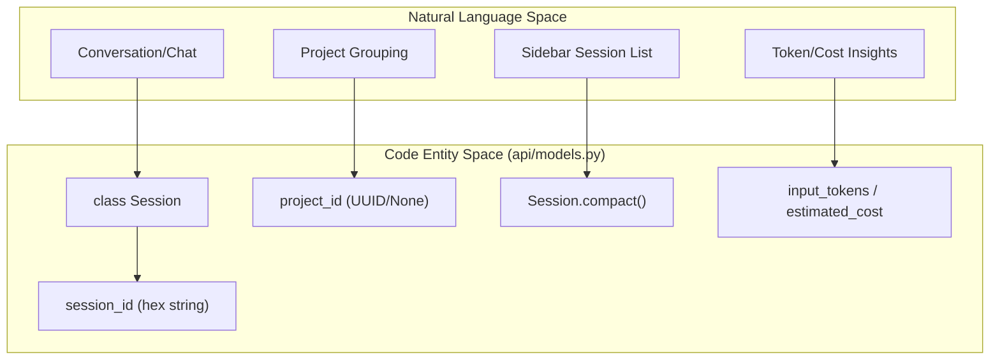

**Sources:** [api/models.py:39-71](), [api/models.py:96-113]()

## Optimization: Session Index and Cache

To avoid expensive disk I/O when rendering the sidebar, Web3Hermes uses a two-tier optimization strategy:

1.  **`session_index.json`**: A summary file containing "compact" versions of all sessions. This allows the UI to fetch the entire list in one O(1) read rather than scanning hundreds of JSON files [api/models.py:21-36]().
2.  **LRU Cache**: The `get_session(sid)` function first checks the `SESSIONS` dictionary. If a session is loaded from disk, it is added to the cache, and the least recently used session is evicted if the count exceeds `SESSIONS_MAX` [api/models.py:115-128]().

### Session Retrieval Logic

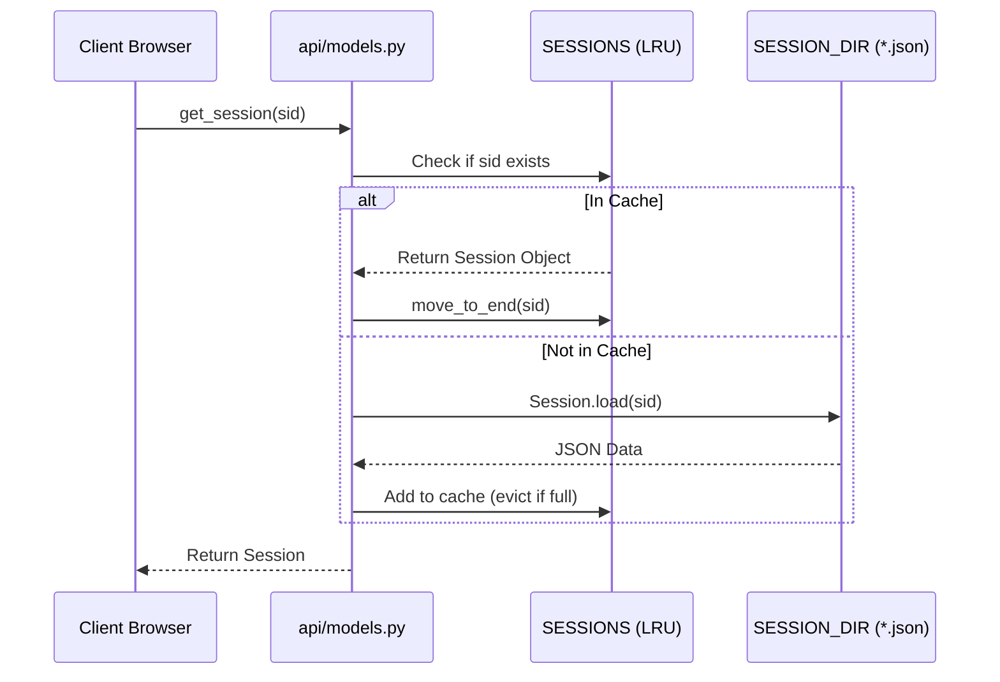

**Sources:** [api/models.py:21-36](), [api/models.py:115-128](), [api/models.py:86-94]()

## CLI Bridge: state.db Synchronization

Web3Hermes can synchronize WebUI activity with the `hermes-agent` CLI's SQLite database (`state.db`). This is managed by `api/state_sync.py` and is enabled via the `sync_to_insights` setting [api/state_sync.py:8-15]().

### Synchronization Logic

- **Absolute Counts**: The WebUI sends absolute token totals (not deltas) to `state.db` using `db.update_token_counts(absolute=True)` [api/state_sync.py:87-94]().
- **Session Discovery**: The `sync_session_start` function ensures that a session ID created in the WebUI is registered in the CLI database so that it appears in `hermes insights` [api/state_sync.py:51-63]().
- **Fail-Safe**: All DB operations are wrapped in try/except blocks to ensure the WebUI remains functional even if `state.db` is locked or inaccessible [api/state_sync.py:9-10]().

**Sources:** [api/state_sync.py:23-49](), [api/state_sync.py:73-113]()

## Project Grouping and Title Derivation

Sessions can be organized into projects using the `PROJECTS_FILE` (typically `projects.json`).

- **Project Assignment**: A session stores a `project_id`. If the ID is `None`, it is considered "Uncategorized" [api/models.py:62-62]().
- **Title Logic**: When a new session is created, it defaults to "Untitled" [api/models.py:40-40](). The UI typically triggers a title generation or update once the first message exchange is complete. Empty "Untitled" sessions are filtered out of the global list to prevent UI clutter [api/models.py:157-158]().

**Sources:** [api/models.py:14-15](), [api/models.py:156-164]()

---

# Page: Agent Execution and Streaming

# Agent Execution and Streaming

<details>
<summary>Relevant source files</summary>

The following files were used as context for generating this wiki page:

- [api/clarify.py](api/clarify.py)
- [api/streaming.py](api/streaming.py)

</details>

This page provides a high-level overview of how the Web3Hermes UI invokes the AI agent and streams real-time feedback to the browser. The system is designed to handle long-running reasoning tasks, tool executions, and interactive pauses for user input while maintaining a responsive interface.

## Execution Lifecycle

When a user sends a message, the backend initiates a background thread to manage the agent's lifecycle. This decoupling ensures that the HTTP request/response cycle is not blocked by the LLM's processing time.

1.  **Request Initiation**: The browser sends a POST request to `/api/chat` [api/routes.py:126-140]().
2.  **Thread Spawning**: The server generates a unique `stream_id` and starts a background thread running `_run_agent_streaming` [api/streaming.py:85-114]().
3.  **Environment Isolation**: The thread sets thread-local environment variables (e.g., `TERMINAL_CWD`, `HERMES_SESSION_KEY`) to ensure that concurrent agent runs do not interfere with each other [api/streaming.py:134-153]().
4.  **Agent Invocation**: The `AIAgent` class from the `hermes-agent` package is instantiated and executed with custom callbacks [api/streaming.py:32-51]().
5.  **Event Streaming**: As the agent works, it emits events (tokens, tool calls, reasoning) which are pushed into a queue and sent to the browser via Server-Sent Events (SSE).

### Agent Execution Flow

The following diagram illustrates the transition from a natural language request in the UI to the execution of code within the agent's thread.

**Diagram: NL to Execution Pipeline**

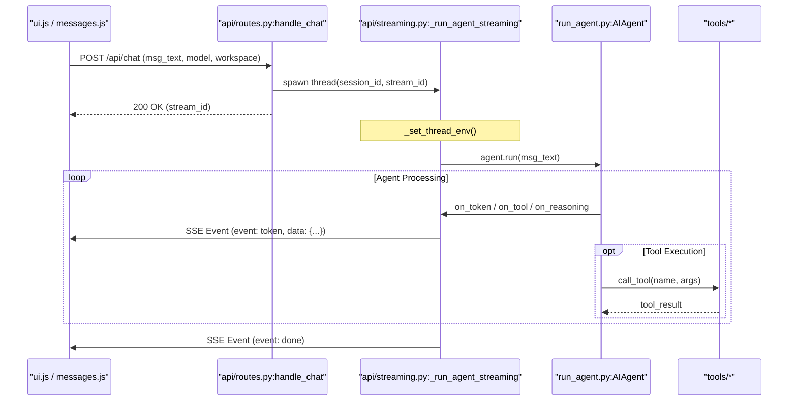

Sources: [api/routes.py:126-150](), [api/streaming.py:85-114](), [api/streaming.py:134-153]().

## Streaming Engine (SSE)

The streaming engine utilizes Server-Sent Events (SSE) to provide a "live" feel to the conversation. Instead of waiting for the entire response, the UI renders content as it arrives.

- **Event Types**: The system supports multiple event types including `token` (text chunks), `tool` (tool execution status), `reasoning` (internal CoT thoughts), `approval` (security gates), and `clarify` (user questions) [api/streaming.py:106-114]().
- **State Persistence**: At the end of every turn, the session state is synchronized to disk in `sessions/` to ensure continuity across page refreshes [api/streaming.py:116-120]().
- **Cancellation**: Users can interrupt an agent run. The system uses `CANCEL_FLAGS` (a dictionary of `threading.Event` objects) to signal the background thread to stop processing [api/streaming.py:101-105]().

For a deep dive into thread lifecycles and event types, see **[Streaming Engine](#3.1)**.

## Interactive Systems

Web3Hermes is not a "fire and forget" system; it frequently requires user interaction mid-stream.

### Clarification and Approval

The agent may pause execution for two primary reasons:

1.  **Clarification**: The agent needs more information to proceed (e.g., "Which file did you mean?"). This uses `api/clarify.py` to manage a queue of pending questions [api/clarify.py:19-29]().
2.  **Approval**: The agent attempts a "dangerous" action (like deleting a file or running a shell command). The `tools/approval.py` module intercepts these calls and waits for a `threading.Event` to be set by the user via the UI [api/streaming.py:161-172]().

For details on how these synchronization mechanisms work, see **[Clarification and Approval System](#3.2)**.

### File and Audio Inputs

Users can augment their text prompts with files or voice commands.

- **Uploads**: Files are handled via `api/upload.py` and placed into the session's workspace.
- **Speech-to-Text**: Audio files are transcribed using specialized tools before being passed to the agent.

For details on the upload pipeline and transcription, see **[File Upload and Speech-to-Text](#3.3)**.

## Data Mapping: Code to Concept

This table maps high-level execution concepts to the specific code entities that implement them.

| Concept            | Code Entity               | Responsibility                                                                            |
| :----------------- | :------------------------ | :---------------------------------------------------------------------------------------- |
| **Active Streams** | `api.config.STREAMS`      | A global dict mapping `stream_id` to `queue.Queue` [api/config.py:17-17]().               |
| **Agent Instance** | `run_agent.AIAgent`       | The core logic engine from the `hermes-agent` package [api/streaming.py:32-35]().         |
| **Interruption**   | `api.config.CANCEL_FLAGS` | `threading.Event` objects used to stop background threads [api/streaming.py:101-105]().   |
| **Output Channel** | `_sse()`                  | Function that formats and writes SSE headers/data to the wire [api/streaming.py:78-83](). |
| **Thread Context** | `_set_thread_env()`       | Configures thread-local variables for filesystem isolation [api/streaming.py:134-140]().  |

**Diagram: System Component Interaction**

```mermaid
graph LR
    subgraph "Web Server (api/)"
        R["routes.py"] --> S["streaming.py"]
        S --> C["clarify.py"]
        S --> Q["config.py (STREAMS)"]
    end

    subgraph "Agent Core (hermes-agent)"
        A["run_agent.py (AIAgent)"] --> T["tools/"]
        T --> APP["tools/approval.py"]
    end

    S -- "instantiates" --> A
    APP -- "notifies via callback" --> S
    C -- "notifies via callback" --> S
```

Sources: [api/streaming.py:161-172](), [api/streaming.py:175-185](), [api/config.py:16-21]().

---

# Page: Streaming Engine

# Streaming Engine

<details>
<summary>Relevant source files</summary>

The following files were used as context for generating this wiki page:

- [api/routes.py](api/routes.py)
- [api/streaming.py](api/streaming.py)

</details>

The **Streaming Engine** is the core component of the Web3Hermes backend responsible for managing the lifecycle of AI agent execution threads and delivering real-time feedback to the user via Server-Sent Events (SSE). It handles environment isolation, interactive interrupts (approvals and clarifications), and session persistence.

## Execution Thread Lifecycle

When a user sends a message, the system dispatches a background thread via `_run_agent_streaming`. This thread is decoupled from the HTTP request/response cycle to prevent timeouts during long-running reasoning or tool execution tasks.

### Thread Initialization and Environment Isolation

To ensure that multiple concurrent sessions do not interfere with each other (e.g., setting different working directories or profile paths), the engine uses a multi-layered isolation strategy:

1.  **Thread-Local Context**: Calls `_set_thread_env` to store session-specific variables like `TERMINAL_CWD` and `HERMES_SESSION_KEY` in thread-local storage [[api/streaming.py:134-139]]().
2.  **Global Environment Synchronization**: Uses a global `_ENV_LOCK` to safely mutate `os.environ` temporarily, ensuring tools that do not support thread-local lookups still receive the correct context [[api/streaming.py:144-153]]().
3.  **Session Locking**: A per-session lock (`_get_session_agent_lock`) prevents the same session from running multiple agent instances simultaneously, avoiding state corruption [[api/streaming.py:120-120]]().

### Data Flow: Request to SSE

The following diagram illustrates the transition from a standard HTTP POST request to the asynchronous SSE stream.

**Agent Execution and Streaming Flow**

```mermaid
sequenceDiagram
    participant Browser
    participant Routes as "api/routes.py"
    participant Stream as "api/streaming.py"
    participant Agent as "run_agent.py:AIAgent"
    participant Queue as "STREAMS (Queue)"

    Browser->>Routes: POST /api/chat (session_id, message)
    Routes->>Stream: spawn _run_agent_streaming()
    Routes-->>Browser: 200 OK (stream_id)

    Note over Stream, Agent: Thread-Local Env Setup
    Stream->>Agent: agent.chat(messages)

    loop Agent Execution
        Agent->>Stream: Callback (on_token, on_tool)
        Stream->>Queue: put((event, data))
        Queue-->>Browser: SSE Event (via /api/events)
    end

    Stream->>Routes: session.save()
    Stream->>Queue: put(('done', {}))
```

Sources: [[api/routes.py:186-186]](), [[api/streaming.py:85-115]](), [[api/streaming.py:134-154]]()

## SSE Event Types

The engine communicates state changes to the frontend using a standardized set of SSE events. Each event is wrapped in a JSON payload and flushed immediately to the client.

| Event Type  | Source                | Description                                                                                     |
| :---------- | :-------------------- | :---------------------------------------------------------------------------------------------- |
| `token`     | `on_token`            | Incremental text chunks generated by the LLM.                                                   |
| `reasoning` | `on_reasoning`        | Internal "thought" tokens (e.g., for models like DeepSeek-R1 or O1).                            |
| `tool`      | `on_tool`             | Notification that a tool is being called or has returned a result.                              |
| `approval`  | `_approval_notify_cb` | Interruption requesting user permission for a sensitive command [[api/streaming.py:168-170]](). |
| `clarify`   | `_clarify_notify_cb`  | Interruption requesting user input for ambiguous tasks [[api/streaming.py:179-181]]().          |
| `error`     | `traceback`           | Captured Python exceptions during execution [[api/streaming.py:284-284]]().                     |
| `done`      | End of Thread         | Signal that the agent has finished and the session is saved.                                    |

Sources: [[api/streaming.py:78-82]](), [[api/streaming.py:220-250]]()

## Callback Wiring and Interrupts

The `AIAgent` is initialized with a suite of callbacks that translate internal agent events into SSE signals.

### Interactive Gateways

The engine registers "Gateway Notify" callbacks for the approval and clarification systems. This allows the agent to block execution internally while the streaming thread pushes an event to the UI, preventing "hanging" states where the agent is waiting for input the UI hasn't requested yet [[api/streaming.py:155-170]]().

**Code Entity Mapping: Callback System**

```mermaid
graph TD
    subgraph "api/streaming.py"
        RUN["_run_agent_streaming"]
        CB_TOKEN["on_token callback"]
        CB_TOOL["on_tool callback"]
        CB_APP["_approval_notify_cb"]
    end

    subgraph "hermes-agent (run_agent.py)"
        AGENT["AIAgent Class"]
        GEN["generate_response()"]
    end

    subgraph "tools/approval.py"
        APP_SYS["Approval System"]
    end

    RUN -->|Instantiates| AGENT
    AGENT -->|Triggers| CB_TOKEN
    AGENT -->|Triggers| CB_TOOL
    APP_SYS -->|Async Notify| CB_APP
    CB_TOKEN -->|Queue| SSE["SSE Stream"]
    CB_TOOL -->|Queue| SSE
    CB_APP -->|Queue| SSE
```

Sources: [[api/streaming.py:32-34]](), [[api/streaming.py:164-171]](), [[api/streaming.py:210-240]]()

## Context Management and Persistence

### Message Sanitization

Before sending messages to the LLM provider, the engine performs "API-safe" sanitization. It strips UI-specific metadata (like timestamps or attachment objects) that cause validation errors in strict providers like GLM or Z.AI [[api/streaming.py:61-75]]().

### Session Turn Finalization

Once the agent completes its run:

1.  **Workspace Tracking**: The last used workspace path is updated via `set_last_workspace` [[api/streaming.py:302-302]]().
2.  **Persistence**: The session object (containing the new message history) is saved to disk [[api/streaming.py:304-304]]().
3.  **Title Derivation**: If the session is new, a title is automatically generated from the first user message [[api/streaming.py:308-311]]().

## Stream Cancellation

The engine supports mid-run cancellation via `cancel_stream(stream_id)`.

1.  **Flagging**: A `threading.Event` is retrieved from the `CANCEL_FLAGS` global dictionary [[api/streaming.py:328-333]]().
2.  **Interruption**: The event is set, which is checked by the agent's internal loops and the streaming thread's `put` function.
3.  **Cleanup**: If cancelled, the engine drops all subsequent events except for a final `cancel` event to notify the UI [[api/streaming.py:107-109]]().

Sources: [[api/streaming.py:101-104]](), [[api/streaming.py:323-334]]()

---

# Page: Clarification and Approval System

# Clarification and Approval System

<details>
<summary>Relevant source files</summary>

The following files were used as context for generating this wiki page:

- [api/clarify.py](api/clarify.py)
- [api/streaming.py](api/streaming.py)

</details>

The **Clarification and Approval System** provides the interactive "pause" mechanisms required for safe and accurate agent execution. It consists of two distinct flows: the **Approval Gateway**, which intercepts potentially dangerous tool executions (e.g., shell commands) to wait for user consent, and the **Clarification System**, which allows the agent to pause and request missing information or choices from the user mid-run.

## 1. System Architecture and Data Flow

Both systems rely on `threading.Event` synchronization to pause the background agent thread while the frontend UI collects user input. Communication is handled via Server-Sent Events (SSE) for outbound notifications and standard POST requests for inbound resolutions.

### Component Interaction Diagram

This diagram bridges the "Natural Language Space" (User/Agent interaction) to the "Code Entity Space" (specific Python modules and functions).

```mermaid
graph TD
    subgraph "Agent Thread (api/streaming.py)"
        A["AIAgent.run()"] --> B{"Tool Execution"}
        B -- "Dangerous Tool" --> C["tools.approval.request_approval()"]
        B -- "Needs Info" --> D["api.clarify.submit_pending()"]
        C --> E["threading.Event.wait()"]
        D --> F["threading.Event.wait()"]
    end

    subgraph "Global State (api/clarify.py & tools/approval.py)"
        G["_gateway_queues"]
        H["_gateway_notify_cbs"]
    end

    subgraph "Web Server (api/routes.py)"
        I["handle_post('/api/approve')"]
        J["handle_post('/api/clarify/resolve')"]
    end

    subgraph "Frontend (ui.js)"
        K["SSE: 'approval' event"]
        L["SSE: 'clarify' event"]
        M["User Click: Approve/Deny"]
        N["User Input: Clarification"]
    end

    C -.->|Notify| H
    H -.->|SSE| K
    D -.->|Notify| H
    H -.->|SSE| L

    M --> I
    N --> J

    I -->|Set Event| E
    J -->|Set Event| F
```

**Sources:** [api/clarify.py:13-28](), [api/streaming.py:163-195](), [api/streaming.py:228-235]()

## 2. The Approval Gateway

The Approval Gateway is a security layer that prevents the agent from executing destructive actions without explicit permission. It is primarily triggered by the `terminal` tool when `HERMES_EXEC_ASK` is set to `'1'`.

### Implementation Details

When a tool requires approval, it calls `request_approval` (mirrored in `tools/approval.py`). The system:

1.  **Registers a Callback**: During the agent's startup in `api/streaming.py`, a `_approval_notify_cb` is registered using `register_gateway_notify` [api/streaming.py:168-171]().
2.  **Pauses Execution**: The tool call thread blocks on a `threading.Event`.
3.  **Notifies UI**: The registered callback sends an SSE event of type `approval` containing the command and justification [api/streaming.py:169-170]().
4.  **Resolution**: The user responds via the UI, hitting the `/api/approve` endpoint. This updates the result in the approval entry and triggers `.set()` on the event, allowing the agent thread to resume [api/streaming.py:230-234]().

**Sources:** [api/streaming.py:136-171](), [api/streaming.py:228-235]()

## 3. Clarification System

The Clarification System allows the agent to ask the user for missing parameters or to choose between multiple options when ambiguity arises.

### Key Classes and Functions

| Entity                      | Location                   | Description                                                                                                                            |
| :-------------------------- | :------------------------- | :------------------------------------------------------------------------------------------------------------------------------------- |
| `_ClarifyEntry`             | [api/clarify.py:19-27]()   | A container for a single request, holding a `threading.Event`, the prompt `data`, and the user's `result`.                             |
| `submit_pending()`          | [api/clarify.py:60-93]()   | Queues a new clarification request. It includes de-duplication logic to prevent stacking identical questions [api/clarify.py:66-72](). |
| `resolve_clarify()`         | [api/clarify.py:111-128]() | Sets the `result` string, triggers the `event`, and removes the entry from the queue.                                                  |
| `register_gateway_notify()` | [api/clarify.py:30-34]()   | Associates a session with a callback function (usually the SSE `put` function in `api/streaming.py`).                                  |

### Thread Synchronization Flow

The following diagram illustrates the lifecycle of a clarification request within `api/clarify.py`.

```mermaid
sequenceDiagram
    participant A as AIAgent Thread
    participant S as api/clarify.py
    participant H as api/streaming.py (SSE)
    participant U as Web UI

    A->>S: submit_pending(session_id, data)
    S->>S: Create _ClarifyEntry (Event)
    S->>H: _clarify_notify_cb(data)
    H->>U: SSE Event: "clarify"
    A->>S: entry.event.wait()
    Note over A: Thread Paused
    U->>S: resolve_clarify(session_id, response)
    S->>S: entry.result = response
    S->>A: entry.event.set()
    Note over A: Thread Resumes
    A->>S: return entry.result
```

**Sources:** [api/clarify.py:19-49](), [api/clarify.py:60-93](), [api/clarify.py:111-128]()

## 4. Error Handling and Cleanup

To prevent the agent from hanging indefinitely if a user disconnects or a session is closed, the system implements several cleanup mechanisms:

- **Unregistration**: When an agent run finishes or is cancelled, `unregister_gateway_notify` is called for both systems [api/clarify.py:42-49]().
- **Forced Unblocking**: `unregister_gateway_notify` calls `_clear_queue_locked`, which iterates through all pending entries and calls `.set()` on their events [api/clarify.py:46-48](). This ensures that the agent thread does not remain deadlocked if the UI component is destroyed.
- **Duplicate Prevention**: `submit_pending` checks the `question` and `choices_offered` against the last item in the queue. If they match, it reuses the existing entry rather than creating a new one [api/clarify.py:64-73]().

**Sources:** [api/clarify.py:36-49](), [api/clarify.py:64-82](), [api/streaming.py:188-195]()

---

# Page: File Upload and Speech-to-Text

# File Upload and Speech-to-Text

<details>
<summary>Relevant source files</summary>

The following files were used as context for generating this wiki page:

- [api/upload.py](api/upload.py)
- [api/workspace.py](api/workspace.py)

</details>

This page documents the mechanisms for handling file uploads and audio transcription within the Web3Hermes backend. The system utilizes a custom multipart parser to handle file persistence into session-specific workspaces and an ephemeral pipeline for Speech-to-Text (STT) processing.

## File Upload Pipeline

The file upload system is designed to securely move files from the client's browser into the workspace associated with a specific chat session. It enforces strict size limits and path sanitization to prevent security vulnerabilities such as path traversal.

### Implementation Details

The upload flow is managed by `handle_upload` in [api/upload.py:61-89](). This function performs the following steps:

1.  **Size Validation**: Checks the `Content-Length` header against `MAX_UPLOAD_BYTES` (defined in `api.config`) [api/upload.py:65-67]().
2.  **Multipart Parsing**: Invokes a manual parser to extract form fields and file buffers [api/upload.py:68]().
3.  **Session Resolution**: Retrieves the target session using the provided `session_id` to determine the correct destination workspace [api/upload.py:75-79]().
4.  **Sanitization**: Cleans the filename using `_sanitize_upload_name`, which removes non-alphanumeric characters (except dots and dashes) and truncates the name to 200 characters [api/upload.py:54-58]().
5.  **Path Resolution**: Uses `safe_resolve_ws` to ensure the final destination path is strictly within the workspace boundaries, preventing directory traversal attacks [api/upload.py:81]().

### Multipart Parsing Logic

The `parse_multipart` function [api/upload.py:15-51]() provides a lightweight, dependency-free way to process `multipart/form-data`. It identifies boundaries from the `Content-Type` header, splits the raw byte stream, and uses `email.parser.HeaderParser` to extract `Content-Disposition` metadata for each part [api/upload.py:40-43]().

### Data Flow: File Upload

The following diagram illustrates the flow from a POST request to filesystem persistence.

**File Upload Sequence**

```mermaid
sequenceDiagram
    participant Client
    participant Handler as "api.upload:handle_upload"
    participant Parser as "api.upload:parse_multipart"
    participant Session as "api.models:get_session"
    participant WS as "api.workspace:safe_resolve_ws"
    participant FS as "Filesystem"

    Client->>Handler: POST /api/upload (multipart/form-data)
    Handler->>Parser: parse_multipart(rfile, boundary)
    Parser-->>Handler: fields, files
    Handler->>Session: get_session(session_id)
    Session-->>Handler: Session object (workspace path)
    Handler->>WS: safe_resolve_ws(workspace, safe_name)
    WS-->>Handler: resolved_path
    Handler->>FS: write_bytes(file_bytes)
    Handler-->>Client: JSON {filename, path, size}
```

Sources: [api/upload.py:15-51](), [api/upload.py:61-89](), [api/workspace.py:228-241]()

## Speech-to-Text (STT)

The STT system allows users to upload audio files (typically `.webm` from browser recordings) and receive a text transcript. Unlike standard file uploads, these files are treated as ephemeral and are deleted immediately after processing.

### Transcription Workflow

The `handle_transcribe` function [api/upload.py:91-132]() manages the audio pipeline:

1.  **Temporary Storage**: Uploaded audio bytes are written to a temporary file using `tempfile.NamedTemporaryFile` with a `webui-stt-` prefix [api/upload.py:107-109]().
2.  **Tool Invocation**: The system dynamically imports `transcribe_audio` from `tools.transcription_tools` [api/upload.py:111](). This separation allows the Web UI to remain functional even if transcription dependencies (like OpenAI Whisper or local models) are missing.
3.  **Cleanup**: A `finally` block ensures the temporary audio file is unlinked (deleted) regardless of whether the transcription succeeded or failed [api/upload.py:126-131]().

### STT Logic to Code Mapping

This diagram bridges the functional requirement of "transcribing audio" to the specific code entities involved.

**STT Component Mapping**

```mermaid
graph TD
    subgraph "Natural Language Space"
        UserAudio["'User records voice'"]
        Transcription["'Text Transcript'"]
    end

    subgraph "Code Entity Space"
        Route["api.upload:handle_transcribe"]
        TempFile["tempfile:NamedTemporaryFile"]
        Tool["tools.transcription_tools:transcribe_audio"]
        Sanitize["api.upload:_sanitize_upload_name"]
    end

    UserAudio --> Route
    Route --> Sanitize
    Route --> TempFile
    TempFile --> Tool
    Tool --> Transcription
```

Sources: [api/upload.py:91-132](), [api/upload.py:54-58]()

## Security and Constraints

### Path Traversal Prevention

Path traversal is prevented via `safe_resolve_ws` in [api/workspace.py:228-241](). This function:

1.  Resolves the base workspace directory to an absolute path [api/workspace.py:236]().
2.  Joins it with the sanitized filename [api/workspace.py:237]().
3.  Calls `.resolve()` on the resulting path [api/workspace.py:237]().
4.  Verifies that the resolved path still starts with the workspace base path [api/workspace.py:238-240](). If a user attempts to use `../` to escape the directory, a `ValueError` is raised.

### Configuration Constants

| Constant           | Description                                                                  | Source               |
| :----------------- | :--------------------------------------------------------------------------- | :------------------- |
| `MAX_UPLOAD_BYTES` | Limits the size of uploads to prevent DoS (typically 100MB+).                | [api/config.py:9]()  |
| `safe_name` regex  | `[^\w.\-]` - Strips any character that isn't alphanumeric, a dot, or a dash. | [api/upload.py:55]() |

Sources: [api/upload.py:9-10](), [api/upload.py:55](), [api/workspace.py:228-241]()

---

# Page: Workspace and File Management

# Workspace and File Management

<details>
<summary>Relevant source files</summary>

The following files were used as context for generating this wiki page:

- [api/gateway_watcher.py](api/gateway_watcher.py)
- [api/workspace.py](api/workspace.py)

</details>

The Web3Hermes Web UI provides a robust filesystem management layer that allows users to interact with local project directories, manage multiple workspaces, and monitor external agent activity. This system bridges the gap between the browser-based interface and the underlying host filesystem, incorporating security measures to prevent cross-profile data leakage and unauthorized access.

The workspace subsystem is divided into two primary functional areas:

1.  **Workspace Management**: Handles the lifecycle of project directories, file browsing, and Git integration.
2.  **Gateway Monitoring**: A background process that synchronizes external session activity (e.g., from Telegram or Discord) into the Web UI.

## Workspace Lifecycle and Security

Workspaces in Web3Hermes are profile-aware, meaning each user profile maintains its own list of project directories and "last used" state. The system uses a combination of JSON state files and configuration discovery to provide a seamless transition between the CLI agent and the Web UI.

Key responsibilities of the workspace layer include:

- **Profile Isolation**: Workspace lists are stored in `{profile_home}/webui_state/workspaces.json` [api/workspace.py:4-7](). The system actively prevents "cross-profile leaks" by filtering out paths that belong to other profiles during directory listing [api/workspace.py:110-122]().
- **Trust Validation**: Before a workspace can be accessed, it must pass security checks. The system blocks access to sensitive system roots (e.g., `/etc`, `/windows`) [api/workspace.py:255-263]() and requires explicit user "trust" for directories outside of the standard Hermes home [api/workspace.py:270-275]().
- **Git Integration**: The backend provides "porcelain" integration, detecting branch names and "dirty" status for any workspace that is a Git repository [api/workspace.py:215-234]().

For details on path resolution, trust logic, and file I/O constraints, see [Workspace Management](#4.1).

### Workspace Data Flow

The following diagram illustrates how the `api/workspace.py` module interacts with the filesystem and profile system to serve file data to the frontend.

**Diagram: Workspace Entity Mapping**

```mermaid
graph TD
    subgraph "Natural Language Space"
        User["User in Browser"]
        WS_List["Workspace List"]
        File_Tree["File Browser"]
    end

    subgraph "Code Entity Space (api/workspace.py)"
        LoadWS["load_workspaces()"]
        GetDir["get_directory_contents()"]
        Validate["_is_path_trusted()"]
        CleanWS["_clean_workspace_list()"]

        WS_JSON[("workspaces.json")]
        LW_TXT[("last_workspace.txt")]
    end

    User -->|Requests Files| GetDir
    GetDir -->|Security Check| Validate
    LoadWS -->|Read State| WS_JSON
    LoadWS -->|Filter Leaks| CleanWS
    CleanWS -.->|Uses| LW_TXT
```

Sources: [api/workspace.py:28-55](), [api/workspace.py:92-129](), [api/workspace.py:270-295]()

## External Session Monitoring

While the Web UI manages its own chat sessions, the `hermes-agent` can also be invoked via external gateways like Telegram, Discord, or Slack. To ensure the Web UI sidebar remains a "single source of truth," the system employs a **Gateway Watcher**.

This component runs as a background daemon thread (`gateway-watcher`) [api/gateway_watcher.py:119]() that polls the agent's `state.db` SQLite database every 5 seconds [api/gateway_watcher.py:103](). It uses an MD5 hashing strategy to detect changes in session activity without transferring large amounts of data [api/gateway_watcher.py:28-34](). When a change is detected, it pushes updates to the frontend via a Server-Sent Events (SSE) subscriber queue [api/gateway_watcher.py:154-160]().

For details on the polling logic and SSE implementation, see [Gateway Watcher and External Session Monitoring](#4.2).

### Gateway Watcher Architecture

This diagram shows how the background thread bridges the SQLite database (used by the CLI agent) to the Web UI's real-time interface.

**Diagram: Gateway Watcher Logic**

```mermaid
graph LR
    subgraph "External Agents"
        TG["Telegram Gateway"]
        DB[("state.db (SQLite)")]
    end

    subgraph "api/gateway_watcher.py"
        GW["GatewayWatcher Class"]
        Loop["_poll_loop()"]
        Hash["_snapshot_hash()"]
        Notify["_notify_subscribers()"]
    end

    subgraph "Frontend"
        SSE["SSE Handler"]
        Sidebar["Session Sidebar"]
    end

    TG -->|Writes Activity| DB
    Loop -->|Query| DB
    Loop -->|Check Change| Hash
    Hash -->|If Changed| Notify
    Notify -->|Push Event| SSE
    SSE -->|Update UI| Sidebar
```

Sources: [api/gateway_watcher.py:49-84](), [api/gateway_watcher.py:91-112](), [api/gateway_watcher.py:181-200]()

## Component Summary

| Component             | Primary File             | Role                                                               |
| :-------------------- | :----------------------- | :----------------------------------------------------------------- |
| **Workspace Manager** | `api/workspace.py`       | Manages `workspaces.json`, path validation, and directory listing. |
| **Gateway Watcher**   | `api/gateway_watcher.py` | Background polling of `state.db` for non-WebUI sessions.           |
| **Git Porcelain**     | `api/workspace.py`       | Executes `git` commands to retrieve branch and status info.        |
| **Security Guard**    | `api/workspace.py`       | Enforces `BLOCKED_ROOTS` and cross-profile path isolation.         |

Sources: [api/workspace.py:1-16](), [api/gateway_watcher.py:1-10]()

---

# Page: Workspace Management

# Workspace Management

<details>
<summary>Relevant source files</summary>

The following files were used as context for generating this wiki page:

- [api/config.py](api/config.py)
- [api/workspace.py](api/workspace.py)

</details>

The workspace management system in Web3Hermes provides a profile-isolated environment for managing filesystem access, file browsing, and Git integration. It ensures that each user profile maintains its own set of trusted directories and state while preventing cross-profile data leakage and protecting sensitive system roots.

## Workspace State and Profile Isolation

Workspace configurations are stored per-profile to ensure isolation. Each profile maintains its own list of known workspaces and tracks the last accessed directory.

### State Files

State persistence is handled via two primary files located within the profile's state directory:

- `workspaces.json`: A JSON array of objects containing `path` and `name` for saved workspaces [api/workspace.py:6-7]().
- `last_workspace.txt`: A plain text file storing the absolute path of the most recently used workspace [api/workspace.py:7-8]().

### Path Resolution Logic

The system resolves these paths dynamically based on the active profile. If the `api.profiles` module is unavailable or the "default" profile is active, it falls back to global constants defined in `api.config` [api/workspace.py:28-44]().

| Function                 | Purpose                                                                                   |
| :----------------------- | :---------------------------------------------------------------------------------------- |
| `_profile_state_dir()`   | Locates the `webui_state` directory for the active profile [api/workspace.py:28-44]().    |
| `_workspaces_file()`     | Returns the path to the active profile's `workspaces.json` [api/workspace.py:47-49]().    |
| `_last_workspace_file()` | Returns the path to the active profile's `last_workspace.txt` [api/workspace.py:52-54](). |

**Sources:** [api/workspace.py:1-54](), [api/config.py:45-50]()

---

## Security and Validation

Web3Hermes implements several layers of validation to prevent unauthorized filesystem access and cross-profile data leaks.

### Cross-Profile Leak Prevention

The `_clean_workspace_list` function sanitizes workspace entries by:

1.  Verifying the directory still exists on disk [api/workspace.py:108-109]().
2.  Ensuring paths do not reside inside a _different_ profile's directory under `~/.hermes/profiles/` [api/workspace.py:110-123]().
3.  Renaming entries labeled "default" to "Home" to avoid confusion with profile names [api/workspace.py:126-127]().

### Blocked System Roots

To prevent accidental or malicious modification of critical system files, the system blocks access to sensitive root directories.

- **Blocked Paths:** `/bin`, `/boot`, `/dev`, `/etc`, `/lib`, `/proc`, `/root`, `/run`, `/sbin`, `/sys`, `/usr`, `/var` [api/workspace.py:302-306]().
- **Logic:** The `is_path_safe` function checks if a path is absolute and ensures it does not start with any blocked system prefix [api/workspace.py:300-312]().

### Trust Validation

The `is_path_trusted` function determines if a directory is allowed to be accessed. A path is considered trusted if:

1.  It is explicitly listed in the active profile's `workspaces.json` [api/workspace.py:318-322]().
2.  It is a subdirectory of a path in `workspaces.json` [api/workspace.py:325-326]().

**Sources:** [api/workspace.py:92-129](), [api/workspace.py:300-330]()

---

## Filesystem Operations

The workspace API provides high-level functions for directory traversal and file reading, optimized for the Web UI.

### Directory Listing

The `list_workspace_dir` function returns a structured list of files and directories [api/workspace.py:333-360]().

- **Sorting:** Directories are listed first, followed by files, both sorted alphabetically [api/workspace.py:355-356]().
- **Metadata:** Each entry includes `name`, `path`, `is_dir`, and `is_git` status [api/workspace.py:350-353]().
- **Filtering:** Hidden files (starting with `.`) are excluded unless they are `.gitignore` or `.env` [api/workspace.py:343-345]().

### File Content Reading

`read_workspace_file` handles safe file retrieval [api/workspace.py:363-388]():

- **Size Limits:** Files exceeding `MAX_FILE_BYTES` (default 1MB) are rejected [api/workspace.py:377-378]().
- **Type Detection:** Returns a `type` field (e.g., "image", "markdown", "text") based on extensions defined in `api.config` [api/workspace.py:381-387]().

### Data Flow: Directory Listing

This diagram shows how a request for a directory listing moves from the API through security checks to the filesystem.

**Workspace Listing Flow**

```mermaid
graph TD
    subgraph "Natural Language Space"
        User["User clicks folder in UI"]
    end

    subgraph "Code Entity Space"
        User --> API["list_workspace_dir(path)"]
        API --> Safety["is_path_safe(path)"]
        Safety --> Trust["is_path_trusted(path)"]
        Trust --> FS["os.scandir(path)"]
        FS --> Filter["Filter hidden files"]
        Filter --> Git["get_git_info(path)"]
        Git --> Result["JSON Response"]
    end
```

**Sources:** [api/workspace.py:333-388](), [api/config.py:22]()

---

## Git Integration

Web3Hermes integrates with Git to provide repository status directly in the workspace browser. It uses "Git porcelain" commands to ensure stable, machine-readable output.

### Branch and Dirty Status

The `get_git_info` function retrieves the current state of a repository [api/workspace.py:270-297]().

1.  **Discovery:** It checks if a `.git` directory exists in the target path [api/workspace.py:274]().
2.  **Branch:** Executes `git rev-parse --abbrev-ref HEAD` [api/workspace.py:281]().
3.  **Dirty Check:** Executes `git status --porcelain` [api/workspace.py:288](). If the output is non-empty, the workspace is marked as `is_dirty: true` [api/workspace.py:290]().

### Entity Mapping: Git Integration

This diagram maps the logical Git status concepts to the specific shell commands and Python functions used to retrieve them.

**Git Porcelain Integration**

```mermaid
graph LR
    subgraph "Logical State"
        Branch["Current Branch"]
        Modified["Modified Files"]
    end

    subgraph "api/workspace.py"
        Branch --> GI["get_git_info()"]
        Modified --> GI
        GI --> RP["subprocess.check_output('git rev-parse')"]
        GI --> ST["subprocess.check_output('git status --porcelain')"]
    end
```

**Sources:** [api/workspace.py:270-297]()

---

## Migration and Defaults

When a new profile is created or a user upgrades from a legacy version, the system performs an automatic migration.

1.  **Legacy Migration:** If no profile-specific `workspaces.json` exists, the system attempts to read and clean the global `~/.hermes/webui/workspaces.json` [api/workspace.py:132-151]().
2.  **Default Workspace Discovery:** If no workspaces are found, the system discovers a default starting point using `_profile_default_workspace` [api/workspace.py:57-87](). It checks:
    - `workspace` or `default_workspace` keys in `config.yaml` [api/workspace.py:71-72]().
    - `terminal.cwd` in `config.yaml` (the agent's working directory) [api/workspace.py:78-80]().
    - The boot-time `DEFAULT_WORKSPACE` constant [api/workspace.py:87]().

**Sources:** [api/workspace.py:57-87](), [api/workspace.py:132-177]()

---

# Page: Gateway Watcher and External Session Monitoring

# Gateway Watcher and External Session Monitoring

<details>
<summary>Relevant source files</summary>

The following files were used as context for generating this wiki page:

- [api/gateway_watcher.py](api/gateway_watcher.py)
- [api/state_sync.py](api/state_sync.py)

</details>

The Gateway Watcher is a background daemon designed to provide real-time visibility into sessions created outside the Web UI. It monitors the `hermes-agent` shared database (`state.db`) for activity from external gateways such as Telegram, Discord, Slack, or the CLI. By detecting changes in these external sessions and pushing updates via Server-Sent Events (SSE), the Web UI sidebar can display a unified view of all agent activity across the ecosystem without requiring the user to refresh the page.

### Architecture and Data Flow

The system operates as a decoupled observer. It polls the SQLite database at a fixed interval, computes a snapshot hash to detect changes, and notifies active web clients through a subscriber queue pattern.

#### System Interaction Diagram

This diagram illustrates how the `GatewayWatcher` bridges the gap between the `hermes-agent` database and the frontend `EventSource` interface.

**Gateway Monitoring Data Flow**

```mermaid
graph TD
    subgraph "External Space"
        A["Telegram/Discord/CLI"] -- "Writes" --> DB[("state.db")]
    end

    subgraph "api/gateway_watcher.py"
        GW["GatewayWatcher Thread"] -- "SELECT" --> DB
        GW -- "MD5 Hash" --> CHK{"Change?"}
        CHK -- "Yes" --> SUBQ["Subscriber Queues"]
    end

    subgraph "api/routes.py"
        SSE["/api/gateway/events"] -- "Reads" --> SUBQ
    end

    subgraph "Frontend Space"
        UI["sessions.js (Sidebar)"] -- "SSE Stream" --> SSE
    end

    DB_PATH["_get_state_db_path()"] -.-> DB
    POLL["_poll_loop()"] --> GW
```

Sources: `[api/gateway_watcher.py:4-10]()`, `[api/gateway_watcher.py:91-101]()`, `[api/gateway_watcher.py:181-200]()`

---

### The GatewayWatcher Daemon

The `GatewayWatcher` class manages the lifecycle of the background polling thread and the distribution of events to web clients.

#### Change Detection Logic

To minimize unnecessary network traffic, the watcher uses a lightweight hashing mechanism. It retrieves session metadata and calculates an MD5 hash of the combined session IDs, timestamps, and message counts.

- **Polling Interval**: The daemon polls every 5 seconds `[api/gateway_watcher.py:103-103]()`.
- **Snapshot Hashing**: The `_snapshot_hash` function creates a string key from session attributes: `{session_id}:{updated_at}:{message_count}` `[api/gateway_watcher.py:28-34]()`.
- **Database Query**: The `_get_agent_sessions_from_db` function filters for sessions where `source != 'webui'` and `message_count > 0`, ensuring only active external conversations are tracked `[api/gateway_watcher.py:49-84]()`.

#### Implementation Details

| Component             | Role                                                                 | Code Reference                       |
| :-------------------- | :------------------------------------------------------------------- | :----------------------------------- |
| `_poll_loop`          | The main execution loop running in a daemon thread.                  | `[api/gateway_watcher.py:181-200]()` |
| `_subscribers`        | A list of `queue.Queue` objects, one for each connected SSE client.  | `[api/gateway_watcher.py:107-107]()` |
| `_notify_subscribers` | Iterates through queues and pushes the `sessions_changed` event.     | `[api/gateway_watcher.py:154-180]()` |
| `SUBSCRIBER_TIMEOUT`  | Interval for sending keepalive comments to prevent connection drops. | `[api/gateway_watcher.py:104-104]()` |

Sources: `[api/gateway_watcher.py:106-113]()`, `[api/gateway_watcher.py:114-135]()`

---

### Database Integration and Profile Awareness

The watcher must resolve the correct `state.db` path based on the active user profile. It shares a common pattern with the state synchronization logic to ensure it monitors the same environment the agent is currently using.

**Code Entity Association: Database Resolution**

```mermaid
graph LR
    subgraph "api/profiles.py"
        GET_HOME["get_active_hermes_home()"]
    end

    subgraph "api/gateway_watcher.py"
        RESOLVE["_get_state_db_path()"]
        QUERY["_get_agent_sessions_from_db()"]
    end

    subgraph "hermes-agent (External)"
        SDB[("state.db")]
    end

    RESOLVE -- "Calls" --> GET_HOME
    QUERY -- "Uses path from" --> RESOLVE
    QUERY -- "Connects to" --> SDB
```

Sources: `[api/gateway_watcher.py:39-46]()`, `[api/gateway_watcher.py:53-60]()`

The query specifically looks for sessions with the following characteristics:

1.  **Source Filtering**: Excludes `webui` to prevent the sidebar from receiving redundant updates about its own sessions `[api/gateway_watcher.py:67-67]()`.
2.  **Activity Requirement**: Uses a `HAVING COUNT(m.id) > 0` clause to ensure empty sessions are ignored `[api/gateway_watcher.py:69-69]()`.
3.  **Recency**: Orders by the maximum message timestamp or session start time, limited to the top 200 sessions `[api/gateway_watcher.py:70-71]()`.

---

### State Synchronization Bridge

While the `GatewayWatcher` reads from `state.db`, the `api/state_sync.py` module performs the inverse: it mirrors Web UI session metadata _into_ `state.db`. This ensures that tools like `/insights` or CLI session lists reflect activity performed in the browser.

- **Opt-in Mechanism**: This synchronization is controlled by the `sync_to_insights` setting `[api/state_sync.py:8-8]()`.
- **Absolute Counts**: The bridge uses absolute token counts (rather than deltas) because the Web UI `Session` object maintains cumulative totals `[api/state_sync.py:12-14]()`.
- **Idempotency**: The `sync_session_start` function uses `db.ensure_session` to register the session in the agent's database without duplicates `[api/state_sync.py:51-63]()`.

#### Synchronization Points

1.  **Session Start**: Triggered when the first message is sent in a Web UI session `[api/state_sync.py:53-54]()`.
2.  **Turn Completion**: Triggered after every LLM response to update token usage, estimated cost, and the current session title `[api/state_sync.py:73-79]()`.

Sources: `[api/state_sync.py:80-113]()`

---

# Page: Frontend (Static UI)

# Frontend (Static UI)

<details>
<summary>Relevant source files</summary>

The following files were used as context for generating this wiki page:

- [static/index.html](static/index.html)
- [static/outlook-layout.css](static/outlook-layout.css)
- [static/style.css](static/style.css)

</details>

The Web3Hermes frontend is a high-performance, single-page application (SPA) designed to provide a professional, IDE-like interface for interacting with the `hermes-agent`. It features a multi-column "Outlook-style" layout that prioritizes workspace management, multi-session chat, and real-time tool execution feedback.

The frontend is served as static assets by the Python backend and communicates primarily via a REST API and Server-Sent Events (SSE) for real-time streaming.

## Core Layout and Navigation

The UI follows a three-column architecture defined in `static/index.html` and styled via `static/outlook-layout.css`.

1.  **Icon Navigation (Leftmost):** A vertical bar for switching between high-level application modules (Chat, Tasks, Skills, Workspace, etc.) [static/index.html:25-68]().
2.  **Context Sidebar (Middle):** A dynamic panel that changes based on the selected navigation item (e.g., the Session List for Chat or the File Tree for Workspace) [static/index.html:71-118]().
3.  **Main Content Area (Right):** The primary workspace where chat threads are rendered or files are edited [static/index.html:150-213]().

### Global State Management

The application's runtime state is centralized in a global `S` object (State) within `ui.js`. This object tracks the active session, loading states, and user preferences [static/ui.js:14-45]().

### Navigation Flow

Navigation is handled by the `switchPanel(panelId)` function, which toggles the visibility of `panel-view` elements and updates the active state of navigation buttons [static/ui.js:231-255]().

```mermaid
graph TD
    subgraph "Code Entity Space"
        INDEX["static/index.html"]
        UI_JS["static/ui.js"]
        OUTLOOK_CSS["static/outlook-layout.css"]
        S_OBJ["Global State (S)"]
    end

    subgraph "Natural Language Space"
        NAV["Icon Navigation Bar"]
        SIDEBAR["Context Sidebar"]
        MAIN["Main Content Area"]
    end

    INDEX --> NAV
    INDEX --> SIDEBAR
    INDEX --> MAIN
    OUTLOOK_CSS -- "Defines Flexbox" --> INDEX
    UI_JS -- "switchPanel()" --> NAV
    UI_JS -- "Updates" --> S_OBJ
```

Sources: [static/index.html:23-213](), [static/outlook-layout.css:4-105](), [static/ui.js:14-45](), [static/ui.js:231-255]()

## Component Subsystems

The frontend is divided into several specialized modules, each documented in detail in its respective child page.

### Chat and Message Rendering

The core interaction loop is managed by `messages.js`. It handles the construction of message bubbles, Markdown rendering via `marked.js`, and syntax highlighting via `Prism.js`. It also manages the consumption of SSE streams from the backend to display real-time token generation and tool-call progress.

For details, see [Chat Interface and Message Rendering](#5.1).

### Session Management

The `sessions.js` module handles the lifecycle of chat sessions. This includes fetching the session list, grouping sessions by date or project, and providing UI for pinning, archiving, or deleting conversations. It also implements the search functionality and the "Project" organization logic.

For details, see [Session Sidebar and Navigation](#5.2).

### Workspace File Browser

The `workspace.js` module provides a full filesystem explorer. It allows users to browse the agent's working directory, open files in the integrated editor, and view Git status indicators. It maintains the expanded/collapsed state of directories in `localStorage` for a persistent user experience.

For details, see [Workspace File Browser](#5.3).

### UI Polish and Localization

The look and feel are governed by a robust CSS variable system supporting Dark and Light modes. Internationalization is handled by `i18n.js`, which provides the `t()` helper function to translate the UI into multiple languages (English, Chinese, etc.) based on the user's browser locale or manual selection.

For details, see [Theming, Internationalization, and Onboarding UI](#5.4).

## Asset Architecture

The frontend relies on a mix of local modules and CDN-delivered libraries for specialized rendering tasks.

| Asset Type      | Purpose                | File/Source                                             |
| :-------------- | :--------------------- | :------------------------------------------------------ |
| **Stylesheets** | Core layout and themes | `style.css`, `outlook-layout.css`, `chatgpt-style.css`  |
| **Logic**       | Main app controller    | `ui.js`                                                 |
| **Modules**     | Domain-specific logic  | `messages.js`, `sessions.js`, `workspace.js`, `i18n.js` |
| **Math**        | KaTeX rendering        | `katex.min.css` (CDN) [static/index.html:16]()          |
| **Code**        | Syntax highlighting    | `prism-core.min.js` (CDN) [static/index.html:19]()      |

```mermaid
graph LR
    subgraph "Static Assets"
        CSS["CSS (style.css, etc.)"]
        JS_CORE["ui.js (Orchestrator)"]
        JS_MOD["Domain Modules (messages.js, sessions.js, etc.)"]
    end

    subgraph "External Dependencies"
        KATEX["KaTeX (Math)"]
        PRISM["Prism (Code)"]
        MARKED["Marked (Markdown)"]
    end

    JS_CORE --> JS_MOD
    JS_MOD -- "Render Content" --> MARKED
    MARKED -- "Format Math" --> KATEX
    MARKED -- "Highlight Code" --> PRISM
```

Sources: [static/index.html:7-21](), [static/style.css:2-21](), [static/ui.js:1-50]()

## Child Pages

- **[Chat Interface and Message Rendering](#5.1)**: Deep dive into the `S` object, SSE consumption, and complex message card rendering.
- **[Session Sidebar and Navigation](#5.2)**: Details on session persistence, project grouping, and sidebar actions.
- **[Workspace File Browser](#5.3)**: Documentation of the file tree, Git integration, and workspace state management.
- **[Theming, Internationalization, and Onboarding UI](#5.4)**: Guide to the CSS variable system, `i18n.js` translation bundles, and the first-run onboarding flow.

---

# Page: Chat Interface and Message Rendering

# Chat Interface and Message Rendering

<details>
<summary>Relevant source files</summary>

The following files were used as context for generating this wiki page:

- [static/boot.js](static/boot.js)
- [static/messages.js](static/messages.js)
- [static/ui.js](static/ui.js)

</details>

This page documents the core user interface and message processing logic of Web3Hermes. It covers the global state management in `ui.js`, the message lifecycle (send, stream, receive) in `messages.js`, and the sophisticated rendering pipeline that handles Markdown, KaTeX, Prism.js, and interactive tool-call cards.

## Core State and Data Flow

The frontend maintains a central state object `S` and a tracking object `INFLIGHT` to manage active sessions and message streams.

### Global State Objects

- **`S`**: The primary state container holding the active `session`, `messages` array, `busy` status, and `pendingFiles` [static/ui.js:1]().
- **`INFLIGHT`**: A dictionary keyed by `session_id` used to track messages and tool calls while a request is pending [static/ui.js:2]().
- **`SESSION_QUEUES`**: Manages concurrent message requests. If a user sends a message while the agent is busy, it is queued for sequential execution [static/ui.js:3]().

### Message Lifecycle Diagram

The following diagram illustrates the flow from user input to SSE-driven UI updates.

**Message Send and Stream Flow**

```mermaid
sequenceDiagram
    participant U as User (Browser)
    participant M as messages.js
    participant S as api/streaming.py
    participant A as hermes-agent

    U->>M: send() click
    M->>M: Check S.busy
    alt is Busy
        M->>M: queueSessionMessage()
    else is Idle
        M->>M: setBusy(true)
        M->>S: POST /api/chat/start
        S-->>M: {stream_id}
        M->>M: attachLiveStream(activeSid, streamId)
        loop SSE Events
            S->>M: event: token (Markdown chunk)
            M->>M: renderMessages()
            S->>M: event: tool (Tool call data)
            M->>M: appendLiveToolCard()
        end
        S->>M: event: done
        M->>M: setBusy(false)
        M->>M: shiftQueuedSessionMessage()
    end
```

Sources: [static/messages.js:1-117](), [static/ui.js:1-25]()

## Message Sending and Queueing

When a user submits a message via `send()`, the system performs several checks:

1.  **Slash Commands**: Intercepts local commands (e.g., `/clear`) before reaching the agent [static/messages.js:4-7]().
2.  **Concurrency Management**: If `S.busy` is true, the message and its attachments are pushed into `SESSION_QUEUES[session_id]` [static/ui.js:10-15](). A toast notification informs the user the message is queued [static/messages.js:18]().
3.  **Provisional Titling**: If the session is "Untitled", the UI immediately sets a title based on the first 64 characters of the user message to provide instant feedback in the sidebar [static/messages.js:52-60]().

### SSE Consumption

The `attachLiveStream` function creates an `EventSource` connection to `/api/chat/events`. It processes several event types:

- **`token`**: Appends text to the current assistant message [static/messages.js:218]().
- **`reasoning`**: Appends text to a separate reasoning/thinking block, often rendered inside `<think>` tags [static/messages.js:223]().
- **`tool`**: Triggers the rendering of an interactive tool card [static/messages.js:231]().
- **`error`**: Displays a fatal error message in the chat thread [static/messages.js:256]().

Sources: [static/messages.js:1-117](), [static/messages.js:129-270]()

## Rendering Engine

Web3Hermes uses a multi-stage rendering pipeline to transform raw text and metadata into a rich UI.

### Markdown and Math

The `renderMessages()` function iterates through `S.messages` and applies:

- **Markdown**: Parsed via `marked.js`.
- **LaTeX**: Math blocks (e.g., `$x^2$`) are rendered using **KaTeX** [static/ui.js:2152]().
- **Code Highlighting**: Code blocks are processed by **Prism.js** for syntax highlighting [static/ui.js:2145]().

### Tool Call and Approval Cards

When the agent invokes a tool, the UI renders specialized cards:

- **Tool Cards**: Display the tool name, arguments, and execution status. If a tool fails, the error is displayed within the card [static/messages.js:400-450]().
- **Approval Cards**: For sensitive operations, the agent pauses. The UI polls `/api/chat/approval/poll` and renders a card with "Approve" and "Deny" buttons [static/messages.js:520-560]().
- **Clarification Cards**: Used when the agent needs user input mid-turn. The UI renders a text input field within the chat flow [static/messages.js:610-640]().

**UI Component Mapping**

```mermaid
graph TD
    subgraph "Natural Language Space"
        UserMsg["'Calculate 2+2'"]
        AgentResp["'Using calculator...'"]
    end

    subgraph "Code Entity Space"
        S_msg["S.messages (Array)"]
        R_msg["renderMessages()"]
        M_js["messages.js"]
        U_js["ui.js"]

        UserMsg --> S_msg
        S_msg --> R_msg
        AgentResp -->|SSE event: tool| M_js
        M_js -->|appendLiveToolCard| U_js
    end
```

Sources: [static/messages.js:400-640](), [static/ui.js:2140-2160]()

## Message Editing and Regeneration

The interface supports modifying the conversation history to correct the agent or explore different paths.

### Editing Messages

Users can click an edit icon on any user message. This replaces the message text with a `textarea` (class `.msg-edit-area`).

- **Save**: Updates the message in `S.messages` and triggers a re-run of the conversation from that point [static/messages.js:8-9]().
- **Regeneration**: The `regenerate()` function removes the last assistant message and re-triggers the agent with the previous conversation context [static/messages.js:350-380]().

## Voice and Multimedia

### Voice Input

The `static/boot.js` file implements a dual-strategy voice input system:

1.  **Web Speech API**: Uses `SpeechRecognition` for real-time, on-device transcription [static/boot.js:168]().
2.  **MediaRecorder Fallback**: If the browser doesn't support the Speech API, it records a `.webm` or `.ogg` blob and sends it to the `/api/transcribe` endpoint [static/boot.js:198-204]().

### File Attachments

Files are managed via `S.pendingFiles`. When `send()` is called, the UI first executes `uploadPendingFiles()`, which sends the files to the backend workspace before starting the chat stream [static/messages.js:26-30]().

Sources: [static/boot.js:157-210](), [static/messages.js:26-38]()

---

# Page: Session Sidebar and Navigation

# Session Sidebar and Navigation

<details>
<summary>Relevant source files</summary>

The following files were used as context for generating this wiki page:

- [static/commands.js](static/commands.js)
- [static/panels.js](static/panels.js)
- [static/sessions.js](static/sessions.js)

</details>

This page documents the frontend implementation of session management and application navigation within the Web3Hermes UI. These features are primarily handled by `static/sessions.js` and `static/panels.js`, which manage the lifecycle of chat sessions, project-based grouping, and the switching between different functional modules (Chat, Tasks, Skills, etc.).

## Session Lifecycle Management

The application treats a "Session" as a persistent conversation thread associated with a specific workspace and model configuration. The frontend communicates with the backend `api/models.py` via REST endpoints to synchronize state.

### Key Functions

- **`newSession(flash)`**: Initializes a new session. It inherits the workspace from the current session or a profile default `[static/sessions.js:13-37]()`.
- **`loadSession(sid)`**: Fetches a session's full history, sanitizes message indices (specifically handling empty assistant messages), and reattaches to any inflight streams if the session was active `[static/sessions.js:39-130]()`.
- **`renderSessionList()`**: The core UI update function. It fetches the index of all sessions, applies filters (search, archive status), groups them by project, and renders the sidebar DOM `[static/sessions.js:350-450]()`.

### Session Data Flow

The following diagram illustrates how a session is loaded and how the UI state `S` is synchronized with the backend.

**Session Loading and State Sync**

```mermaid
sequenceDiagram
    participant UI as Browser (sessions.js)
    participant API as Backend (server.py)
    participant DB as Session Storage (models.py)

    UI->>API: GET /api/session?session_id=XYZ
    API->>DB: Session.load("XYZ")
    DB-->>API: Session Object (JSON)
    API-->>UI: 200 OK (Session Data)
    Note over UI: sanitize messages (B9 sanitization)
    UI->>UI: Update S.session & S.messages
    UI->>UI: renderMessages()
    UI->>UI: loadDir(".") (Workspace Sync)
```

Sources: `[static/sessions.js:39-130]()`, `[static/sessions.js:75-92]()`

## Sidebar Actions and Grouping

The sidebar provides organizational tools to manage a high volume of conversations.

### Project Grouping

Sessions can be assigned to "Projects" via the session metadata. The `renderSessionList` function iterates through sessions and groups those with matching `project` attributes into collapsible UI folders `[static/sessions.js:400-420]()`.

### Session Actions

Each session item in the sidebar supports several immediate actions:
| Action | Function | Description |
| :--- | :--- | :--- |
| **Pin** | `togglePin(sid)` | Moves the session to the "Pinned" section at the top of the list `[static/sessions.js:240-255]()`. |
| **Archive** | `toggleArchive(sid)` | Hides the session from the main list; accessible via the "Archived" filter `[static/sessions.js:257-270]()`. |
| **Rename** | `renameSession(sid)` | Opens a prompt to update the `title` attribute in the backend `[static/sessions.js:210-225]()`. |
| **Delete** | `deleteSession(sid)` | Removes the session file from disk after user confirmation `[static/sessions.js:227-238]()`. |

### External Session Import

The `api/gateway_watcher.py` allows the Web UI to monitor sessions created via CLI or external gateways (Telegram/Discord). These appear in the sidebar and can be "imported" or interacted with seamlessly. The `importCliSession(sid)` function handles the transition of a CLI-originated session into the Web UI context `[static/sessions.js:300-315]()`.

Sources: `[static/sessions.js:210-315]()`, `[static/sessions.js:400-450]()`

## Navigation and Panel Switching

The "Icon-Nav" panel (the leftmost vertical bar) acts as the primary switcher for the application's functional modules. This logic is encapsulated in `static/panels.js`.

### The `switchPanel(name)` Logic

When a user clicks a navigation icon, `switchPanel` performs the following:

1. Updates the `_currentPanel` state variable `[static/panels.js:5]()`.
2. Toggles CSS classes on `.nav-tab` and `.panel-view` elements to handle visibility `[static/panels.js:7-15]()`.
3. Triggers "Lazy Loading" for specific panel data (e.g., fetching crons only when the Tasks panel is opened) `[static/panels.js:18-24]()`.

### Available Panels

| Panel ID     | Content                          | Data Source                                |
| :----------- | :------------------------------- | :----------------------------------------- |
| `chat`       | Main conversation interface      | `api/session`                              |
| `tasks`      | Cron job management              | `api/crons` `[static/panels.js:27-30]()`   |
| `skills`     | Available agent tools/skills     | `api/skills` `[static/panels.js:19]()`     |
| `workspaces` | Workspace browser and Git status | `api/workspaces` `[static/panels.js:21]()` |
| `settings`   | UI and Provider configuration    | `api/settings`                             |

**Navigation Entity Mapping**

```mermaid
graph TD
    subgraph "UI Layer (static/panels.js)"
        A["switchPanel(name)"] --> B{"Panel Name"}
        B -- "tasks" --> C["loadCrons()"]
        B -- "skills" --> D["loadSkills()"]
        B -- "workspaces" --> E["loadWorkspacesPanel()"]
    end

    subgraph "API Layer (api/routes.py)"
        C --> F["GET /api/crons"]
        D --> G["GET /api/skills"]
        E --> H["GET /api/workspaces"]
    end

    subgraph "Logic Layer"
        F --> I["CronManager"]
        G --> J["SkillRegistry"]
        H --> K["WorkspaceManager"]
    end
```

Sources: `[static/panels.js:1-24]()`, `[static/panels.js:27-40]()`

## Slash Commands

The UI intercepts specific inputs starting with `/` to perform local actions without sending a request to the LLM. This is handled by `static/commands.js`.

- **`parseCommand(text)`**: Splits the input into a command name and arguments `[static/commands.js:18-24]()`.
- **`executeCommand(text)`**: Matches the input against the `COMMANDS` registry and executes the associated function `[static/commands.js:26-33]()`.

### Notable Commands

- `/model <name>`: Switches the active LLM for the current session `[static/commands.js:62-78]()`.
- `/workspace <name>`: Switches the current session's filesystem context `[static/commands.js:80-92]()`.
- `/clear`: Wipes the local message state `S.messages` without deleting the session `[static/commands.js:53-60]()`.
- `/compact`: Requests the agent to summarize and compress the context `[static/commands.js:101-108]()`.

Sources: `[static/commands.js:5-16]()`, `[static/commands.js:62-108]()`

---

# Page: Workspace File Browser

# Workspace File Browser

<details>
<summary>Relevant source files</summary>

The following files were used as context for generating this wiki page:

- [static/icons.js](static/icons.js)
- [static/workspace.js](static/workspace.js)

</details>

The Workspace File Browser is a client-side module responsible for rendering and managing the project filesystem within the Web UI. It provides a tree-view interface for directory navigation, file previews (code, Markdown, and images), basic CRUD operations (create, delete, rename, edit), and integration with Git status reporting.

## Overview and Implementation

The file browser logic is encapsulated in `static/workspace.js`, which interacts with the backend via the `/api/list`, `/api/file/read`, `/api/file/save`, and `/api/git-info` endpoints. It maintains a local state object `S` (shared with the global UI state) to track the current directory, expanded folders, and file entries.

### Key State Variables

- `S.currentDir`: The relative path currently being viewed (defaults to `.` for the workspace root) [[static/workspace.js:40-40]]().
- `S.entries`: An array of file/directory objects returned by the backend [[static/workspace.js:42-42]]().
- `S._expandedDirs`: A `Set` containing paths of directories currently expanded in the tree view [[static/workspace.js:29-29]]().
- `S._dirCache`: A dictionary mapping directory paths to their cached file lists, used to render expanded subdirectories without full page refreshes [[static/workspace.js:37-37]]().

### Data Flow: Directory Loading

When a user navigates to a directory or initializes the workspace view, the `loadDir(path)` function is invoked.

1.  **State Restoration**: If loading the root (`.`), it restores expanded directory states from `localStorage` [[static/workspace.js:38-38]]().
2.  **API Fetch**: It calls `/api/list` with the `session_id` and `path` [[static/workspace.js:41-41]]().
3.  **Recursive Pre-fetch**: To ensure a smooth UI, it iterates through `S._expandedDirs` and fetches their contents into `S._dirCache` [[static/workspace.js:45-52]]().
4.  **UI Update**: Triggers `renderBreadcrumb()` and `renderFileTree()` [[static/workspace.js:42-42]]().
5.  **Git Integration**: Calls `_refreshGitBadge()` to update the Git branch and dirty status [[static/workspace.js:63-63]]().

**Sources:** `static/workspace.js` [[15-65]]().

---

## Directory Tree Rendering

The file tree is rendered dynamically into the `fileList` container. It distinguishes between files and directories, using specific icons from `static/icons.js`.

### Logic for Nested Rendering

The renderer iterates through `S.entries`. For each entry:

- If it is a directory and its path exists in `S._expandedDirs`, the renderer recursively injects the children from `S._dirCache` [[static/workspace.js:255-265]]().
- It calculates indentation based on path depth [[static/workspace.js:223-223]]().
- It attaches click listeners: directories toggle expansion via `toggleExpand(path)`, while files trigger `openFile(path)` [[static/workspace.js:241-250]]().

### File Tree Interaction Flow

The following diagram illustrates how a user click on a directory item results in a state change and UI re-render.

**Diagram: Directory Expansion Flow**

```mermaid
sequenceDiagram
    participant User
    participant Browser as "workspace.js:toggleExpand"
    participant State as "S._expandedDirs"
    participant API as "/api/list"
    participant UI as "renderFileTree"

    User->>Browser: Click Directory Icon
    alt is expanded
        Browser->>State: delete(path)
        Browser->>UI: Refresh View
    else is collapsed
        Browser->>State: add(path)
        Browser->>API: Fetch directory contents
        API-->>Browser: Return entries
        Browser->>UI: Refresh View with children
    end
    Browser->>Browser: _saveExpandedDirs() (localStorage)
```

**Sources:** `static/workspace.js` [[20-31, 220-270]]().

---

## File Operations: Preview, Edit, and Save

The Workspace supports three primary preview modes based on file extension: `code`, `md` (Markdown), and `image`.

### Preview Routing

Extensions are categorized using `Set` objects to determine the rendering engine:

- **Images**: `.png`, `.jpg`, `.svg`, etc. [[static/workspace.js:96-96]]().
- **Markdown**: `.md`, `.markdown` [[static/workspace.js:97-97]]().
- **Downloads**: Binary files like `.pdf`, `.zip`, or `.exe` are routed to a direct download link rather than a preview [[static/workspace.js:99-106]]().

### The Edit Lifecycle

1.  **Read**: `openFile(path)` calls `/api/file/read`. If the file is text-based, it populates the preview pane [[static/workspace.js:274-290]]().
2.  **Edit Mode**: `toggleEditMode()` switches the read-only `previewCode` or `previewMd` element for a `<textarea>` (`previewEditArea`) [[static/workspace.js:140-167]]().
3.  **Dirty State**: Edits set `_previewDirty = true`, which adds an asterisk to the Save button [[static/workspace.js:137-137]]().
4.  **Save**: A `POST` request to `/api/file/save` sends the updated content [[static/workspace.js:147-149]]().

**Diagram: File Edit and Save Data Flow**

```mermaid
graph LR
    subgraph "Frontend (workspace.js)"
        A["openFile(path)"] --> B{"File Type?"}
        B -- "Text/MD" --> C["showPreview('code'|'md')"]
        C --> D["toggleEditMode()"]
        D --> E["previewEditArea (Textarea)"]
        E -- "User Edits" --> F["_previewDirty = true"]
        F --> G["api('/api/file/save')"]
    end
    subgraph "Backend (api/workspace.py)"
        G --> H["save_file()"]
        H --> I[("Filesystem")]
    end
    I --> J["Success Response"]
    J --> K["_previewDirty = false"]
```

**Sources:** `static/workspace.js` [[110-174, 274-310]]().

---

## State Persistence

The file browser persists the "expanded" state of directories to `localStorage` so that the tree structure remains consistent across page refreshes or session switches.

- **Storage Key**: Generated via `_wsExpandKey()`, which prefixes the workspace name: `hermes-webui-expanded:[workspace_name]` [[static/workspace.js:16-19]]().
- **Persistence**: Every time a directory is toggled, `_saveExpandedDirs()` stringifies the `S._expandedDirs` Set and stores it [[static/workspace.js:20-23]]().
- **Restoration**: On `loadDir('.')`, `_restoreExpandedDirs()` populates the Set before the initial render [[static/workspace.js:24-31]]().

**Sources:** `static/workspace.js` [[15-31]]().

---

## Git Status Integration

The browser provides a non-blocking Git status badge via the `_refreshGitBadge()` function.

- **API Endpoint**: `/api/git-info?session_id=...` [[static/workspace.js:71-71]]().
- **Display Logic**:
  - Displays the current branch name [[static/workspace.js:74-74]]().
  - Shows dirty file counts using the delta symbol (`∆`) [[static/workspace.js:75-75]]().
  - Indicates synchronization status with arrows for `ahead` (↑) and `behind` (↓) [[static/workspace.js:76-77]]().
  - Applies the `.dirty` CSS class if there are uncommitted changes [[static/workspace.js:79-79]]().

**Sources:** `static/workspace.js` [[67-86]]().

---

## Drag-and-Drop Integration

The workspace supports direct file uploads via drag-and-drop onto the file list area.

- **Event Handling**: Listeners for `dragover`, `dragleave`, and `drop` are attached to the `fileList` element [[static/workspace.js:527-531]]().
- **Upload Logic**: Files are intercepted in the `drop` event, wrapped in a `FormData` object, and sent to `/api/upload` [[static/workspace.js:536-545]]().
- **Path Awareness**: Uploads are targeted to the `S.currentDir` [[static/workspace.js:540-540]]().

**Sources:** `static/workspace.js` [[527-550]]().

---

# Page: Theming, Internationalization, and Onboarding UI

# Theming, Internationalization, and Onboarding UI

<details>
<summary>Relevant source files</summary>

The following files were used as context for generating this wiki page:

- [static/about-section.css](static/about-section.css)
- [static/ad-panel.css](static/ad-panel.css)
- [static/chatgpt-style.css](static/chatgpt-style.css)
- [static/i18n.js](static/i18n.js)
- [static/light-theme-force.css](static/light-theme-force.css)
- [static/login.js](static/login.js)
- [static/onboarding.js](static/onboarding.js)
- [static/style.css](static/style.css)
- [static/ui-enhancements.css](static/ui-enhancements.css)

</details>

This section documents the visual and interactive configuration layers of the Web3Hermes frontend. It covers the CSS-based theming system, the multi-language localization framework, the session authentication flow, and the first-run onboarding wizard.

## 1. Theming System

Web3Hermes implements a CSS variable-based theming system that supports Dark and Light modes. The system uses a combination of base styles, theme-specific overrides, and specialized component styles.

### 1.1 Implementation Details

The core variables are defined in `static/style.css` using the `:root` selector for the default Dark theme and `:root[data-theme="light"]` for the Light theme [static/style.css:2-21]().

Key files in the theming stack include:

- **`static/style.css`**: Defines the primary layout, sidebar, and base color variables (e.g., `--bg`, `--accent`, `--text`) [static/style.css:4-11]().
- **`static/chatgpt-style.css`**: Provides the "ChatGPT-style" message bubble layout, including avatar gradients and specific styles for user vs. assistant rows [static/chatgpt-style.css:31-116]().
- **`static/ui-enhancements.css`**: Implements typography optimizations for Chinese characters, smooth transitions, and GPU-accelerated animations [static/ui-enhancements.css:6-19, 327-334]().
- **`static/light-theme-force.css`**: A high-priority override file that uses `!important` to ensure consistency when the Light theme is active, specifically targeting modals and code blocks [static/light-theme-force.css:3-26]().

### 1.2 Theme Selection Logic

The theme is toggled by modifying the `data-theme` attribute on the `<html>` or `:root` element. Components like the `thinking-card` and `ad-panel` react to this attribute to adjust their gradients and border colors [static/chatgpt-style.css:315-320](), [static/ad-panel.css:83-91]().

**Entity Relationship: Theme Styles**
Title: "CSS Entity Relationship"

```mermaid
graph TD
    subgraph "Global_Styles"
        ROOT[":root Variables"]
        BODY["body / .layout"]
    end

    subgraph "Theme_Overrides"
        LIGHT[":root[data-theme='light']"]
        FORCE["light-theme-force.css"]
    end

    subgraph "Components"
        CHAT["chatgpt-style.css"]
        ENHANCE["ui-enhancements.css"]
        ABOUT["about-section.css"]
    end

    ROOT --> LIGHT
    LIGHT --> FORCE
    FORCE --> CHAT
    ROOT --> ENHANCE
    CHAT --> ABOUT
```

Sources: `[static/style.css:2-21]()`, `[static/chatgpt-style.css:1-116]()`, `[static/ui-enhancements.css:1-25]()`, `[static/light-theme-force.css:1-26]()`.

---

## 2. Internationalization (i18n)

The i18n system uses a centralized locale bundle and a helper function to provide reactive translations throughout the UI.

### 2.1 The `t()` Helper and Locale Bundles

Translations are managed in `static/i18n.js`. The `LOCALES` object contains keys for each supported language, using BCP 47 tags (e.g., `en`, `zh-CN`) [static/i18n.js:6-7]().

- **Functionality**: The `t(key, ...args)` helper retrieves strings. If a key is missing in the selected language, it falls back to English [static/i18n.js:4]().
- **Dynamic Strings**: Some keys are functions that accept arguments, such as `n_messages: (n) => ...` [static/i18n.js:54]().
- **Speech Integration**: Each locale includes a `_speech` key used to configure the browser's speech recognition engine for that specific language [static/i18n.js:10]().

### 2.2 Scope of Translations

The i18n system covers:

- **System Messages**: Error states for microphone access or file imports [static/i18n.js:14-20]().
- **UI Components**: Labels for the settings panel, workspace browser, and chat actions [static/i18n.js:96-148]().
- **Slash Commands**: Descriptions for commands like `/model`, `/theme`, and `/clear` [static/i18n.js:62-71]().

Sources: `[static/i18n.js:1-166]()`.

---

## 3. Onboarding UI

The onboarding wizard is a multi-step state machine designed to guide the user through the initial configuration of the AI agent and provider settings.

### 3.1 Onboarding State Machine

The `ONBOARDING` object in `static/onboarding.js` tracks the current progress through a fixed sequence of steps: `system`, `setup`, `workspace`, `password`, and `finish` [static/onboarding.js:1]().

| Step          | Function                                                                                                |
| :------------ | :------------------------------------------------------------------------------------------------------ |
| **System**    | Checks if `hermes-agent` is found and if provider requirements are met [static/onboarding.js:88-106](). |
| **Setup**     | Configures the LLM provider (e.g., OpenRouter, OpenAI) and API keys [static/onboarding.js:109-130]().   |
| **Workspace** | Sets the default directory for the agent to operate in [static/onboarding.js:47-50]().                  |
| **Password**  | Optional setup for session-based authentication [static/onboarding.js:20]().                            |

### 3.2 Data Flow

1.  **Status Polling**: The UI fetches current system status from the backend to determine if onboarding is required.
2.  **Form Management**: User input is stored in `ONBOARDING.form` [static/onboarding.js:1]().
3.  **Submission**: When the user clicks "Continue", the UI validates the current step and eventually persists the configuration to the backend via the `api/onboarding` routes.

**Onboarding Logic Flow**
Title: "Onboarding State and Rendering Flow"

```mermaid
graph LR
    subgraph "State_Management"
        OBJ["ONBOARDING Object"]
        STEP["ONBOARDING.step"]
    end

    subgraph "Rendering_Functions"
        R_BODY["_renderOnboardingBody()"]
        R_STEPS["_renderOnboardingSteps()"]
    end

    subgraph "Step_Logic"
        SYS["Step: system"]
        SET["Step: setup"]
        WS["Step: workspace"]
    end

    OBJ --> R_BODY
    STEP --> R_STEPS
    R_BODY --> SYS
    R_BODY --> SET
    R_BODY --> WS
```

Sources: `[static/onboarding.js:1-135]()`.

---

## 4. Authentication UI

The authentication flow is handled by `static/login.js`, which manages the interface for the optional password protection layer.

### 4.1 Login Flow

The login script operates independently of the main SPA (Single Page Application) bundle to ensure security.

1.  **Form Interception**: It listens for the `submit` event on the `login-form` [static/login.js:47]().
2.  **API Interaction**: It performs an asynchronous POST request to `/api/auth/login` with the provided password [static/login.js:29-34]().
3.  **Session Persistence**: If successful (`data.ok`), it redirects the user to the root path `/`, where the browser's `credentials: 'include'` setting ensures the session cookie is sent [static/login.js:37-38]().
4.  **Error Handling**: Displays localized error messages (e.g., "Invalid password") retrieved from data attributes on the form element [static/login.js:11-17]().

Sources: `[static/login.js:5-55]()`.

---

# Page: Onboarding, Updates, and Maintenance

# Onboarding, Updates, and Maintenance

<details>
<summary>Relevant source files</summary>

The following files were used as context for generating this wiki page:

- [api/onboarding.py](api/onboarding.py)
- [api/state_sync.py](api/state_sync.py)
- [api/updates.py](api/updates.py)

</details>

This page provides a high-level overview of the lifecycle management for the Web3Hermes Web UI, covering the initial setup process, the automated update mechanism, and the synchronization of session data with the underlying agent's state database.

The Web UI is designed to be self-configuring and self-maintaining, minimizing the need for manual terminal intervention once the initial bootstrap is complete.

## First-Run Onboarding

The onboarding system acts as a state machine that guides users through the configuration of their AI provider and workspace settings. It ensures that the `hermes-agent` is correctly discovered and that necessary API keys are securely stored in a `.env` file within the active profile directory.

The onboarding flow transitions through several states defined in the frontend and validated by the backend:

- **`agent_unavailable`**: The `hermes-agent` package or directory cannot be found [api/onboarding.py:15]().
- **`needs_provider`**: No valid LLM provider (e.g., OpenRouter, Anthropic, OpenAI) is configured [api/onboarding.py:31-63]().
- **`provider_incomplete`**: A provider is selected but lacks a required API key or base URL.
- **`ready`**: All configurations are valid, and the system is operational.

The system supports OAuth detection for providers like GitHub Copilot or Nous Portal, which must be configured via the CLI [api/onboarding.py:217-223]().

For details on the setup state machine and provider configuration, see [First-Run Onboarding](#6.1).

### Onboarding Flow to Code Mapping

| Concept                | Code Entity                     | File                      |
| :--------------------- | :------------------------------ | :------------------------ |
| **Provider Registry**  | `_SUPPORTED_PROVIDER_SETUPS`    | [api/onboarding.py:31]()  |
| **Env Writing**        | `_write_env_file`               | [api/onboarding.py:96]()  |
| **Config Persistence** | `_save_yaml_config`             | [api/onboarding.py:132]() |
| **OAuth Check**        | `_provider_oauth_authenticated` | [api/onboarding.py:217]() |

**Sources:** [api/onboarding.py:1-250]()

## Self-Update Mechanism

Web3Hermes includes a Git-based update checker that monitors both the `webui` and `agent` repositories. To prevent excessive network traffic, update checks are cached for 30 minutes using a `CACHE_TTL` [api/updates.py:24-28]().

The update process follows a "safety-first" strategy:

1. **Stash**: Local changes are stashed to avoid conflicts [api/updates.py:144]().
2. **Fetch & Pull**: A `fetch` is performed, followed by a `pull --ff-only` to ensure only fast-forward updates are applied [api/updates.py:176-200]().
3. **Pop**: Stashed changes are reapplied to the updated codebase.

The system intelligently detects the default branch (e.g., `main` or `master`) or uses the current upstream tracking branch to avoid false "behind" alerts when users are on feature branches [api/updates.py:95-101]().

For details on Git integration and the update lifecycle, see [Self-Update Mechanism](#6.2).

### Update System Architecture

```mermaid
graph TD
    subgraph "Update Logic (api/updates.py)"
        Check["check_for_updates()"]
        Apply["apply_update(target)"]
        GitRun["_run_git(args, cwd)"]
    end

    subgraph "State & Locks"
        Cache["_update_cache (30m TTL)"]
        ALock["_apply_lock (Mutex)"]
    end

    Check -->|Read/Write| Cache
    Apply -->|Acquire| ALock
    Apply -->|Exec| GitRun
    GitRun -->|Subprocess| GitCLI["'git' executable"]
```

**Sources:** [api/updates.py:11-151]()

## State Synchronization and Insights

The Web UI can optionally mirror its session metadata into the `hermes-agent` `state.db`. This allows Web UI activity to appear in CLI-based tools like `hermes insights` or `hermes sessions`.

Key characteristics of the synchronization bridge include:

- **Opt-in**: Controlled by the `sync_to_insights` setting [api/state_sync.py:8]().
- **Absolute Counts**: It uses absolute token counts rather than deltas to avoid double-counting, as the Web UI `Session` object already maintains cumulative totals [api/state_sync.py:12-14]().
- **Fail-Silent**: All DB operations are wrapped in try/except blocks; if `state.db` is locked or unavailable, the Web UI continues to function without interruption [api/state_sync.py:9-10]().

The bridge synchronizes the session ID, model name, input/output tokens, estimated cost, and session title [api/state_sync.py:73-75]().

For details on the `SessionDB` integration and token tracking, see [State Synchronization and Insights](#6.3).

### Data Synchronization Mapping

```mermaid
graph LR
    subgraph "Web UI (Memory/JSON)"
        WS["Session Object"]
        WT["Token Usage"]
        WL["Model Info"]
    end

    subgraph "Bridge (api/state_sync.py)"
        Sync["sync_session_usage()"]
        SDB["SessionDB (hermes_state)"]
    end

    subgraph "Agent (state.db)"
        ST["sessions table"]
    end

    WS --> Sync
    WT --> Sync
    WL --> Sync
    Sync --> SDB
    SDB -->|SQL UPDATE| ST
```

**Sources:** [api/state_sync.py:1-119]()

---

# Page: First-Run Onboarding

# First-Run Onboarding

<details>
<summary>Relevant source files</summary>

The following files were used as context for generating this wiki page:

- [api/config.py](api/config.py)
- [api/onboarding.py](api/onboarding.py)

</details>

The First-Run Onboarding system provides a guided setup experience for users who have not yet configured the Web3Hermes environment. It manages the transition from an unconfigured state to a fully operational agent by orchestrating provider selection, API key configuration, and filesystem persistence of settings.

## Onboarding State Machine

The onboarding process is governed by a state machine that determines the readiness of the system based on the presence of the `hermes-agent` source code, valid configuration files, and active LLM providers.

### State Transitions

| State                 | Description                                                                     | Condition                                                                               |
| :-------------------- | :------------------------------------------------------------------------------ | :-------------------------------------------------------------------------------------- |
| `agent_unavailable`   | The `hermes-agent` repository or its dependencies are missing.                  | `_HERMES_FOUND` is `False` [api/onboarding.py:15, 237-240]()                            |
| `needs_provider`      | Agent is found, but no LLM provider or API key is configured.                   | `_extract_current_provider` returns empty or no key found [api/onboarding.py:246-248]() |
| `provider_incomplete` | A provider is selected but missing required fields (e.g., API key or Base URL). | `_provider_api_key_present` is `False` [api/onboarding.py:255-257]()                    |
| `ready`               | System is fully configured and ready for chat.                                  | All checks pass [api/onboarding.py:263-264]()                                           |

### Logic Flow: Onboarding Status Discovery

This diagram illustrates how `get_onboarding_status` determines the current state by inspecting the filesystem and environment.

```mermaid
graph TD
    START["get_onboarding_status()"] --> CHECK_AGENT{"_HERMES_FOUND?"}
    CHECK_AGENT -- "No" --> AGENT_UNAVAILABLE["state: agent_unavailable"]
    CHECK_AGENT -- "Yes" --> LOAD_CFG["Load config.yaml & .env"]
    LOAD_CFG --> CHECK_OAUTH{"OAuth Active?"}
    CHECK_OAUTH -- "Yes" --> READY["state: ready"]
    CHECK_OAUTH -- "No" --> CHECK_PROVIDER{"Provider Selected?"}
    CHECK_PROVIDER -- "No" --> NEEDS_PROVIDER["state: needs_provider"]
    CHECK_PROVIDER -- "Yes" --> CHECK_KEY{"API Key Present?"}
    CHECK_KEY -- "No" --> INCOMPLETE["state: provider_incomplete"]
    CHECK_KEY -- "Yes" --> READY
```

**Sources:** [api/onboarding.py:228-264](), [api/config.py:158-163]()

## Provider Configuration

Web3Hermes supports a subset of providers for direct configuration via the Web UI. Advanced providers (OAuth-based) must still be configured via the terminal using `hermes model`.

### Supported Providers

The system defines configuration schemas in `_SUPPORTED_PROVIDER_SETUPS` [api/onboarding.py:31-63]():

- **OpenRouter**: Default provider, uses `OPENROUTER_API_KEY`.
- **Anthropic**: Uses `ANTHROPIC_API_KEY`, defaults to `claude-sonnet-4.6`.
- **OpenAI**: Uses `OPENAI_API_KEY`, defaults to `gpt-4o`.
- **Custom**: Allows any OpenAI-compatible endpoint; requires a `base_url`.

### OAuth Detection

The system attempts to detect existing OAuth sessions (e.g., GitHub Copilot, OpenAI Codex) by checking `auth.json` in the Hermes home directory [api/onboarding.py:217-225](). If a valid OAuth session is found for the active provider, the system skips the API key requirement and moves to `ready`.

**Sources:** [api/onboarding.py:31-68](), [api/onboarding.py:217-225]()

## Persistence Layer

When a user completes the onboarding wizard, the system writes changes to two primary locations: the `.env` file for secrets and `config.yaml` for structural settings.

### Configuration Writing Logic

The function `save_onboarding_config` handles the atomic update of these files:

1.  **Environment Variables**: `_write_env_file` updates the `.env` file and immediately injects the values into `os.environ` [api/onboarding.py:96-114](). It includes a safety check to prevent newline injection in API keys [api/onboarding.py:107-108]().
2.  **YAML Config**: `_save_yaml_config` uses `PyYAML` to write the provider and model selections to `config.yaml` [api/onboarding.py:132-143]().
3.  **State Refresh**: After writing, `reload_config()` is called to ensure the backend's in-memory cache matches the disk [api/onboarding.py:327]().

### Data Flow: Setup Submission

This diagram maps the API request to the internal functions that persist the configuration.

```mermaid
graph TD
    REQ["POST /api/onboarding/setup"] --> SAVE_FUNC["save_onboarding_config(data)"]
    SAVE_FUNC --> ENV_WRITE["_write_env_file(env_path, {key: val})"]
    SAVE_FUNC --> YAML_WRITE["_save_yaml_config(config_path, cfg_dict)"]
    ENV_WRITE --> OS_ENV["os.environ[KEY] = VAL"]
    YAML_WRITE --> DISK_YAML["config.yaml"]
    SAVE_FUNC --> RELOAD["api.config.reload_config()"]
```

**Sources:** [api/onboarding.py:267-331](), [api/onboarding.py:96-114](), [api/onboarding.py:132-143]()

## Safety and Validation

### Overwrite Guard

To prevent accidental data loss, the system implements a `confirm_overwrite` check [api/onboarding.py:270-277](). If the user attempts to save a configuration when a `config.yaml` already exists and contains an API key, the request will fail unless the `confirm` flag is explicitly set to `true` in the payload.

### Model Normalization

Before saving, the system normalizes model names to ensure compatibility with the `hermes-agent` backend. For example, if "Anthropic" is the provider, it strips the `anthropic/` prefix from model IDs like `anthropic/claude-3-5-sonnet` [api/onboarding.py:145-151]().

| Function                        | Responsibility                                                                               |
| :------------------------------ | :------------------------------------------------------------------------------------------- |
| `_normalize_model_for_provider` | Strips redundant provider prefixes from model strings [api/onboarding.py:145]().             |
| `_normalize_base_url`           | Ensures URLs do not have trailing slashes [api/onboarding.py:154]().                         |
| `verify_hermes_imports`         | Validates that the Python environment can actually load Hermes modules [api/config.py:24](). |

**Sources:** [api/onboarding.py:145-156](), [api/onboarding.py:270-280](), [api/config.py:24]()

---

# Page: Self-Update Mechanism

# Self-Update Mechanism

<details>
<summary>Relevant source files</summary>

The following files were used as context for generating this wiki page:

- [api/routes.py](api/routes.py)
- [api/updates.py](api/updates.py)

</details>

The Self-Update Mechanism in Web3Hermes provides an automated way to keep both the Web UI and the underlying `hermes-agent` repositories synchronized with their upstream branches. It uses a Git-based approach, implementing safety measures such as stashing local changes, enforcing fast-forward-only pulls, and utilizing a server-side cache to minimize network overhead.

## Overview and Lifecycle

The update system is primarily managed by `api/updates.py`. It tracks two distinct repositories: the Web UI (the current repository) and the Agent (located via `_AGENT_DIR`). The mechanism follows a "Check then Apply" flow, where the UI first polls for the number of commits "behind" before the user can trigger a manual update.

### Data Flow: Update Checking

1.  **Request**: The frontend hits the `/api/updates` GET endpoint.
2.  **Cache Check**: The system checks `_update_cache` using a 30-minute Time-To-Live (TTL) `CACHE_TTL`.
3.  **Git Fetch**: If the cache is expired, `_run_git` executes `git fetch origin --quiet`.
4.  **Comparison**: The system identifies the tracking branch (or defaults to `master`/`main`) and counts commits between `HEAD` and the remote ref.
5.  **Response**: Returns JSON containing `behind` count, current SHA, and latest SHA.

### Data Flow: Applying Updates

1.  **Request**: The frontend hits the `/api/updates` POST endpoint with a `target` ("webui" or "agent").
2.  **Locking**: Acquires `_apply_lock` to prevent concurrent update operations on the same repo.
3.  **Stash**: Runs `git stash` to protect local modifications.
4.  **Pull**: Executes `git pull --ff-only` to ensure no merge conflicts are introduced during the automated update.
5.  **Pop**: Runs `git stash pop` to restore local changes.

**Sources:**

- `api/updates.py`: [api/updates.py:1-28](), [api/updates.py:120-142](), [api/updates.py:144-152]()
- `api/routes.py`: [api/routes.py:848-861]()

## Code Entity Map: Update Logic

The following diagram maps the logical update steps to the specific Python functions and variables that implement them.

**Update Process Logic Map**

```mermaid
graph TD
    subgraph "Update Detection (api/updates.py)"
        Check["check_for_updates()"] --> Cache{"_update_cache valid?"}
        Cache -- "Yes" --> ReturnCache["Return dict(_update_cache)"]
        Cache -- "No" --> RunCheck["_check_repo(path, name)"]
        RunCheck --> GitFetch["_run_git(['fetch'])"]
        GitFetch --> DetectBranch["_detect_default_branch(path)"]
        DetectBranch --> BehindCount["_run_git(['rev-list', '--count'])"]
    end

    subgraph "Update Execution (api/updates.py)"
        Apply["apply_update(target)"] --> Lock["_apply_lock.acquire()"]
        Lock --> Inner["_apply_update_inner(target)"]
        Inner --> Stash["git stash"]
        Stash --> Pull["git pull --ff-only"]
        Pull --> Pop["git stash pop"]
    end

    subgraph "API Exposure (api/routes.py)"
        GET["handle_get() /api/updates"] --> Check
        POST["handle_post() /api/updates"] --> Apply
    end
```

**Sources:**

- `api/updates.py`: [api/updates.py:31-54](), [api/updates.py:81-117](), [api/updates.py:120-142](), [api/updates.py:154-205]()
- `api/routes.py`: [api/routes.py:848-861](), [api/routes.py:1186-1198]()

## Implementation Details

### Git Execution Wrapper

All Git operations are routed through `_run_git`, which uses `subprocess.run` with a default 10-second timeout. This function captures `stdout` and `stderr`, ensuring that actionable error messages are returned to the UI if a command fails (e.g., network timeout or "git executable not found").

### Branch Detection and Upstream Tracking

The system prioritizes the current branch's upstream tracking branch to avoid false alerts when a user is working on a feature branch.

1.  It attempts to resolve the upstream via `rev-parse --abbrev-ref @{upstream}`.
2.  If no upstream exists, `_detect_default_branch` searches for `origin/HEAD`, falling back to `master` or `main`.

### Safety and Stash Handling

The update strategy is "Fast-Forward Only" (`--ff-only`). If the remote branch has diverged (requiring a merge or rebase), the update will fail with an error message, requiring manual intervention.

- **Merge Conflicts**: Before updating, `_apply_update_inner` checks for unresolved conflicts using `git status --porcelain`.
- **Dirty Trees**: If local changes exist, they are stashed. If the subsequent `git stash pop` results in a conflict, the system reports success for the pull but warns the user about the stash conflict.

**Sources:**

- `api/updates.py`: [api/updates.py:31-54](), [api/updates.py:67-79](), [api/updates.py:168-174](), [api/updates.py:188-205]()

## API Endpoints

The update mechanism is exposed via two routes in `api/routes.py`.

| Method | Path           | Function            | Description                                                                            |
| :----- | :------------- | :------------------ | :------------------------------------------------------------------------------------- |
| `GET`  | `/api/updates` | `check_for_updates` | Returns the current update status for `webui` and `agent`. Uses `CACHE_TTL` (30 mins). |
| `POST` | `/api/updates` | `apply_update`      | Triggers a git pull for the specified `target` ("webui" or "agent").                   |

**Sources:**

- `api/routes.py`: [api/routes.py:848-861](), [api/routes.py:1186-1198]()
- `api/updates.py`: [api/updates.py:28-28]()

## Sequence Diagram: Apply Update

This diagram illustrates the interaction between the HTTP Handler, the update module, and the OS-level Git process.

**Update Execution Sequence**

```mermaid
sequenceDiagram
    participant C as Browser Client
    participant R as api/routes.py
    participant U as api/updates.py
    participant G as Git Subprocess

    C->>R: POST /api/updates {"target": "webui"}
    R->>U: apply_update("webui")
    U->>U: Acquire _apply_lock
    U->>G: git fetch origin
    G-->>U: OK
    U->>G: git status --porcelain
    G-->>U: "M file.py" (Dirty)
    U->>G: git stash
    U->>G: git pull --ff-only
    G-->>U: OK (Updated)
    U->>G: git stash pop
    U->>U: Release _apply_lock
    U-->>R: {"ok": true, "message": "Updated..."}
    R-->>C: 200 OK JSON
```

**Sources:**

- `api/updates.py`: [api/updates.py:144-152](), [api/updates.py:154-205]()
- `api/routes.py`: [api/routes.py:1186-1198]()

---

# Page: State Synchronization and Insights

# State Synchronization and Insights

<details>
<summary>Relevant source files</summary>

The following files were used as context for generating this wiki page:

- [api/models.py](api/models.py)
- [api/state_sync.py](api/state_sync.py)

</details>

The State Synchronization system provides an opt-in bridge between the Web UI and the underlying `hermes-agent` infrastructure. It allows session metadata—such as token usage, costs, and conversation titles—to be mirrored from the Web UI's JSON-based session storage into the central `state.db` SQLite database used by the agent's CLI and insight tools.

## Overview and Purpose

By default, the Web UI operates independently of the agent's tracking database. However, when the `sync_to_insights` setting is enabled, the system mirrors activity to `state.db` [api/state_sync.py:1-15](). This integration ensures that:

1. **Cost Tracking**: Web UI usage is included in global cost calculations and `/insights` reports.
2. **Session Visibility**: Web UI sessions appear in the unified session list alongside CLI, Telegram, or Discord interactions.
3. **Metadata Consistency**: Titles generated in the Web UI are reflected in the agent's central state.

The synchronization logic is designed to be **fail-silent**. If the database is locked, the schema is incompatible, or the agent's state module is missing, the Web UI continues to function without interruption [api/state_sync.py:9-10]().

Sources: [api/state_sync.py:1-15]()

## Implementation Detail

The bridge is implemented in `api/state_sync.py`. It utilizes the `SessionDB` class from the `hermes_state` package to interact with the SQLite database [api/state_sync.py:29-31]().

### Absolute Token Counting Strategy

Unlike other interfaces that might report incremental deltas, the Web UI bridge uses **absolute token counts** [api/state_sync.py:12-14](). Since the `Session` object in `api/models.py` maintains a running total of `input_tokens` and `output_tokens` for the entire life of the session [api/models.py:64-65](), the sync bridge simply overwrites the database values with these totals after every turn. This prevents double-counting and ensures the database stays perfectly in sync with the Web UI's state [api/state_sync.py:76-79]().

### Data Flow: Web UI to state.db

The following diagram illustrates how the `Session` model data is propagated to the `state.db` via the `SessionDB` wrapper.

**Diagram: State Synchronization Data Flow**

```mermaid
graph TD
    subgraph "Web UI Process Space"
        A["Session Object (api/models.py)"] -- "input_tokens, output_tokens, title" --> B["api/state_sync.py"]
        B -- "absolute=True" --> C["hermes_state.SessionDB"]
    end

    subgraph "Filesystem Space"
        C -- "SQL UPDATE" --> D[("state.db (SQLite)")]
        A -- "JSON Write" --> E[("sessions/{id}.json")]
    end

    style D stroke-width:2px
    style E stroke-width:2px
```

Sources: [api/state_sync.py:73-94](), [api/models.py:39-71]()

## Key Functions

### Database Resolution

The `_get_state_db()` function resolves the path to the active profile's `state.db` [api/state_sync.py:23-49](). It respects the current profile settings by calling `get_active_hermes_home()` [api/state_sync.py:34-35]() to ensure data is written to the correct environment's database.

### Lifecycle Hooks

The synchronization occurs at two primary points in the session lifecycle:

| Function             | Trigger Point                   | Action                                                                                    |
| :------------------- | :------------------------------ | :---------------------------------------------------------------------------------------- |
| `sync_session_start` | First message sent in a session | Registers the session ID in `state.db` with `source='webui'` [api/state_sync.py:51-63](). |
| `sync_session_usage` | Completion of an LLM turn       | Updates tokens, estimated cost, title, and message count [api/state_sync.py:73-112]().    |

### Internal DB Operations

The bridge directly updates the `sessions` table in the SQLite database. For fields not covered by the standard `SessionDB` public API, it uses the internal `_execute_write` method to run raw SQL, such as updating the `message_count` [api/state_sync.py:102-109]().

**Diagram: Code Entity Association**

```mermaid
flowchart LR
    subgraph "api/state_sync.py"
        sync_start["sync_session_start()"]
        sync_usage["sync_session_usage()"]
        get_db["_get_state_db()"]
    end

    subgraph "hermes_state (External Library)"
        SDB["SessionDB Class"]
        ensure["ensure_session()"]
        update_tokens["update_token_counts()"]
    end

    sync_start --> get_db
    sync_usage --> get_db
    get_db -.-> SDB
    sync_start --> ensure
    sync_usage --> update_tokens
    sync_usage -- "SQL UPDATE" --> SDB
```

Sources: [api/state_sync.py:51-112](), [api/profiles.py:34-35]()

## Fail-Silent Design

To ensure that database issues do not crash the Web UI, every database operation is wrapped in a `try/except` block [api/state_sync.py:58-64, 83-113](). Common failures handled include:

- **ImportError**: The `hermes_state` package is not installed [api/state_sync.py:30-31]().
- **Locked Database**: SQLite `busy` errors during concurrent writes from the CLI and Web UI.
- **Missing File**: The `state.db` file has not been initialized yet [api/state_sync.py:41-42]().

In all these cases, the error is logged at the `DEBUG` level, and the Web UI continues its operation using its local JSON storage [api/state_sync.py:10, 20, 47, 64]().

Sources: [api/state_sync.py:1-50]()

---

# Page: Glossary

# Glossary

<details>
<summary>Relevant source files</summary>

The following files were used as context for generating this wiki page:

- [README.md](README.md)
- [api/auth.py](api/auth.py)
- [api/clarify.py](api/clarify.py)
- [api/config.py](api/config.py)
- [api/gateway_watcher.py](api/gateway_watcher.py)
- [api/models.py](api/models.py)
- [api/onboarding.py](api/onboarding.py)
- [api/profiles.py](api/profiles.py)
- [api/routes.py](api/routes.py)
- [api/state_sync.py](api/state_sync.py)
- [api/streaming.py](api/streaming.py)
- [api/updates.py](api/updates.py)
- [api/workspace.py](api/workspace.py)
- [bootstrap.py](bootstrap.py)
- [static/i18n.js](static/i18n.js)

</details>

This page defines codebase-specific terminology, abbreviations, and domain concepts used within the Web3Hermes project. It serves as a technical reference for onboarding engineers to bridge the gap between high-level system behavior and the underlying implementation.

## Core Concepts

### 1. Profile

A **Profile** is an isolated execution environment. Each profile maintains its own `HERMES_HOME` directory, which contains a unique set of configurations (`config.yaml`), API keys (`.env`), memories, skills, and chat sessions [api/profiles.py:5-9]().

- **Implementation**: The system uses a process-level active profile. Switching profiles involves updating `os.environ['HERMES_HOME']` and monkey-patching module-level path caches in the `hermes-agent` core to ensure tools like `skills_tool` point to the new directory [api/profiles.py:103-125]().
- **Sticky State**: The active profile is persisted in `~/.hermes/active_profile` so it remains consistent across server restarts [api/profiles.py:73-83]().

### 2. Session

A **Session** represents a single conversation thread. Unlike `hermes-agent` CLI sessions which are stored in a SQLite database (`state.db`), WebUI sessions are stored as individual JSON files in the `sessions/` directory of the active profile [api/models.py:73-85]().

- **Data Flow**:
  1.  User sends a message.
  2.  `Session` object is loaded/created [api/models.py:115-128]().
  3.  `_run_agent_streaming` invokes the `AIAgent` [api/streaming.py:85-114]().
  4.  At the end of the turn, session metadata (tokens, cost, title) is optionally synced to the agent's `state.db` for global insights [api/state_sync.py:73-79]().

### 3. Workspace

The **Workspace** is the local filesystem directory where the AI agent is allowed to read and write files. It is the "Current Working Directory" (CWD) for all tool executions (e.g., terminal commands, file edits) [api/streaming.py:134-153]().

### 4. Gateway Session

Refers to sessions originating from external interfaces like Telegram, Discord, or Slack. The WebUI monitors these via the `GatewayWatcher`, which polls the agent's `state.db` and pushes updates to the frontend via SSE [api/gateway_watcher.py:4-9]().

---

## Technical Mapping: Natural Language to Code

The following diagrams map conceptual system components to their specific implementation entities in the codebase.

### Diagram 1: Session Lifecycle and Persistence

This diagram shows how a conceptual "Chat Session" is represented across different code entities.

```mermaid
graph TD
    subgraph "Natural Language Space"
        UserMsg["'User sends a message'"]
        ChatHist["'Chat History'"]
    end

    subgraph "Code Entity Space (api/models.py)"
        S_Class["class Session"]
        S_Load["Session.load(sid)"]
        S_Save["Session.save()"]
    end

    subgraph "Code Entity Space (api/streaming.py)"
        RunAgent["_run_agent_streaming()"]
        SSE["_sse(handler, event, data)"]
    end

    subgraph "Persistence"
        JSON_File["{session_id}.json"]
        Index_File["_index.json"]
    end

    UserMsg --> RunAgent
    RunAgent --> S_Class
    S_Class --> S_Save
    S_Save --> JSON_File
    JSON_File --> S_Load
    S_Save --> Index_File["api/models.py: _write_session_index()"]
    RunAgent --> SSE
    SSE -->|'token/tool events'| UserMsg
```

**Sources**: [api/models.py:39-85](), [api/streaming.py:78-114](), [api/models.py:21-36]()

### Diagram 2: Interactive Pause Mechanisms

This diagram explains the "Approval" and "Clarification" systems which pause the LLM execution for user input.

```mermaid
graph LR
    subgraph "Natural Language Space"
        AskUser["'Agent asks for clarification'"]
        Confirm["'User confirms dangerous command'"]
    end

    subgraph "Code Entity Space (api/clarify.py)"
        Clarify_Entry["class _ClarifyEntry"]
        Submit_Clarify["submit_pending()"]
        Resolve_Clarify["resolve_clarify()"]
    end

    subgraph "Code Entity Space (tools/approval.py)"
        Approve_Session["approve_session()"]
        Resolve_Approve["resolve_gateway_approval()"]
    end

    subgraph "Synchronization"
        T_Event["threading.Event()"]
    end

    AskUser --> Submit_Clarify
    Submit_Clarify --> T_Event
    T_Event -->|'Blocks AIAgent Thread'| Clarify_Entry
    Confirm --> Resolve_Approve
    Resolve_Clarify -->|'event.set()'| T_Event
```

**Sources**: [api/clarify.py:19-28](), [api/clarify.py:60-93](), [api/routes.py:194-228]()

---

## Terminology Table

| Term                | Definition                                                                                                                | Code Pointer                |
| :------------------ | :------------------------------------------------------------------------------------------------------------------------ | :-------------------------- |
| **SSE**             | Server-Sent Events. The protocol used to stream AI tokens and tool execution logs to the browser.                         | [api/streaming.py:78-83]()  |
| **PBKDF2-SHA256**   | The hashing algorithm used for password protection with 600,000 iterations.                                               | [api/auth.py:72-80]()       |
| **CSRF Protection** | Security check validating `Origin` and `Referer` headers on POST requests to prevent cross-site attacks.                  | [api/routes.py:123-158]()   |
| **Monkey-patching** | Dynamic replacement of module-level constants (like `HERMES_HOME`) at runtime to support profile switching.               | [api/profiles.py:103-125]() |
| **TTL Cache**       | Time-To-Live cache. Used in the update checker to limit Git fetch operations to once every 30 minutes.                    | [api/updates.py:24-28]()    |
| **Stash/Pull/Pop**  | The strategy used for self-updates: local changes are stashed, an `ff-only` pull is performed, and changes are reapplied. | [api/updates.py:144-152]()  |
| **Absolute Sync**   | The strategy of syncing the _total_ token count to `state.db` rather than incremental deltas.                             | [api/state_sync.py:12-15]() |

---

## Abbreviations

- **HERMES_HOME**: The directory containing the active profile's configuration and data [api/profiles.py:93-101]().
- **STATE_DIR**: The WebUI-specific internal state directory (separate from agent data) [api/config.py:39-43]().
- **FF-ONLY**: Fast-forward only. A Git pull strategy that prevents merge commits during updates [api/updates.py:144-152]().
- **MCP**: Model Context Protocol. A standard for the agent to discover and connect to external tools [api/streaming.py:91-99]().

**Sources**: [api/config.py:39-51](), [api/profiles.py:1-20](), [api/auth.py:1-25](), [api/updates.py:1-30](), [api/state_sync.py:1-15]().
