# Page: Overview

# Overview

<details>
<summary>Relevant source files</summary>

The following files were used as context for generating this wiki page:

- [.github/ISSUE_TEMPLATE/1-bug_report.yml](.github/ISSUE_TEMPLATE/1-bug_report.yml)
- [.github/workflows/docs.yml](.github/workflows/docs.yml)
- [README.md](README.md)
- [docs/switcher.json](docs/switcher.json)
- [python/packages/autogen-agentchat/pyproject.toml](python/packages/autogen-agentchat/pyproject.toml)
- [python/packages/autogen-core/pyproject.toml](python/packages/autogen-core/pyproject.toml)
- [python/packages/autogen-ext/pyproject.toml](python/packages/autogen-ext/pyproject.toml)
- [python/packages/autogen-studio/pyproject.toml](python/packages/autogen-studio/pyproject.toml)
- [python/uv.lock](python/uv.lock)

</details>


This page provides a high-level introduction to the AutoGen repository structure, package architecture, and design principles. AutoGen is a framework for building multi-agent AI applications that can operate autonomously or collaborate with humans.

**Scope**: This page covers the repository organization, core packages, developer tools, and architectural layering. For detailed information about specific subsystems:
- Package architecture and dependencies: see [Package Architecture](#1.1)
- Installation instructions and quickstart: see [Installation and Setup](#1.2)
- Core framework internals: see [Core Foundation](#2)
- High-level agent APIs: see [AgentChat API](#3)
- Multi-agent coordination: see [Multi-Agent Teams](#4)

## Repository Structure

The AutoGen repository is organized as a monorepo containing Python packages, .NET SDK, developer tools, and supporting infrastructure. The repository supports both Python (3.10+) and .NET (8.0+) ecosystems with cross-language interoperability via gRPC.

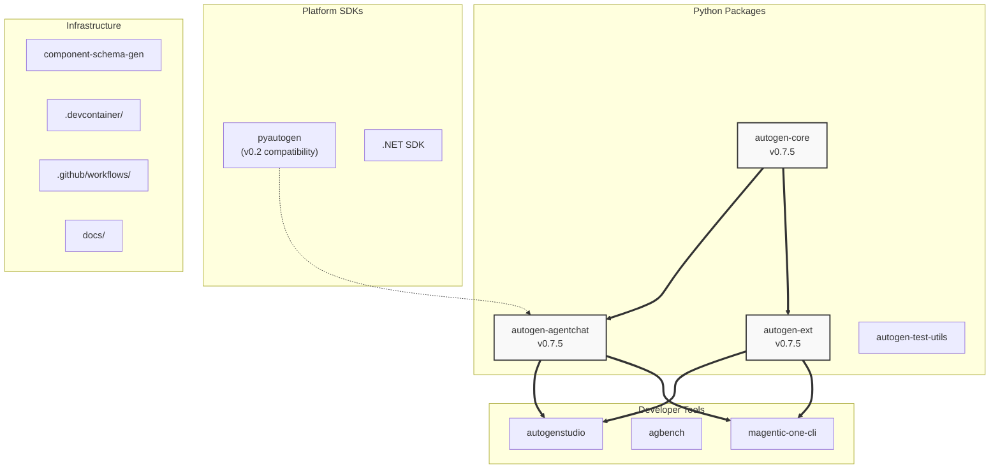

**Sources**: [README.md:1-227](), [python/uv.lock:20-31]()

## Three-Layer Architecture

AutoGen implements a strict layered architecture where each layer builds on the layer below it. This design enables users to work at different abstraction levels depending on their needs.

| Layer | Package | Purpose | Key Abstractions |
|-------|---------|---------|------------------|
| **Foundation** | `autogen-core` | Runtime infrastructure, agent abstraction, messaging | `AgentRuntime`, `Agent`, `ChatCompletionClient`, `BaseTool` |
| **High-Level API** | `autogen-agentchat` | Pre-built agents and team patterns | `AssistantAgent`, `CodeExecutorAgent`, `BaseGroupChat` |
| **Extensions** | `autogen-ext` | Optional integrations and implementations | LLM clients, code executors, memory systems, tools |

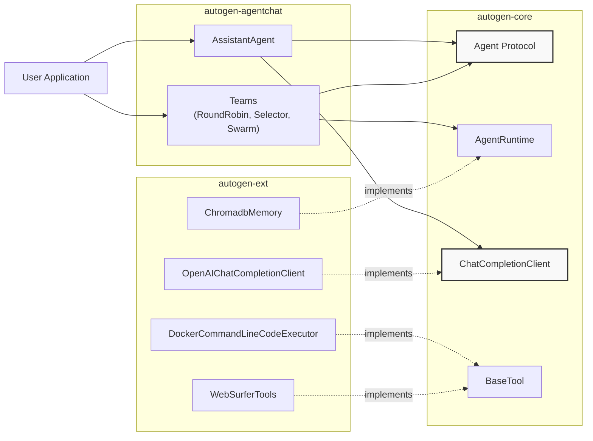

**Sources**: [README.md:166-172](), [python/packages/autogen-core/pyproject.toml:1-89](), [python/packages/autogen-agentchat/pyproject.toml:1-39](), [python/packages/autogen-ext/pyproject.toml:1-206]()

## Core Packages

### autogen-core (v0.7.5)

The foundational package providing low-level abstractions for agent-based systems.

**Location**: `python/packages/autogen-core/`

**Key Components**:
- `AgentRuntime` protocol and implementations (`SingleThreadedAgentRuntime`, `GrpcWorkerAgentRuntime`)
- `Agent` protocol and `BaseAgent` implementation
- `ChatCompletionClient` abstraction for LLM interactions
- `BaseTool` interface for tool definition
- Message types (`LLMMessage`, `BaseChatMessage`, `BaseAgentEvent`)
- Subscription and routing mechanisms

**Dependencies**: `pillow`, `pydantic`, `protobuf`, `opentelemetry-api`, `jsonref`

**Sources**: [python/packages/autogen-core/pyproject.toml:1-89](), [README.md:170]()

### autogen-agentchat (v0.7.5)

High-level API for rapid prototyping of multi-agent applications.

**Location**: `python/packages/autogen-agentchat/`

**Key Components**:
- `AssistantAgent`: LLM-powered agent with tool calling and handoffs
- `CodeExecutorAgent`: Code generation and execution with retry logic
- `OpenAIAssistantAgent`: Integration with OpenAI Assistant API
- `SocietyOfMindAgent`: Wraps teams as single agents
- Team orchestration: `RoundRobinGroupChat`, `SelectorGroupChat`, `Swarm`, `MagenticOneGroupChat`, `GraphFlow`
- Termination conditions: `MaxMessageTermination`, `TextMentionTermination`, `TokenUsageTermination`
- `ModelContext` for conversation management
- `Workbench` for tool execution

**Dependencies**: `autogen-core==0.7.5`

**Sources**: [python/packages/autogen-agentchat/pyproject.toml:1-39](), [README.md:171]()

### autogen-ext (v0.7.5)

Extension package with optional implementations organized by integration type.

**Location**: `python/packages/autogen-ext/`

**Extension Categories** (install via `pip install autogen-ext[category]`):

| Category | Dependencies | Implements |
|----------|-------------|------------|
| `openai` | `openai>=1.93`, `tiktoken`, `aiofiles` | `OpenAIChatCompletionClient` |
| `anthropic` | `anthropic>=0.48` | `AnthropicChatCompletionClient` |
| `azure` | `azure-ai-inference`, `azure-ai-projects`, `azure-identity` | `AzureAIChatCompletionClient`, `ACADynamicSessionsCodeExecutor` |
| `ollama` | `ollama>=0.4.7`, `tiktoken` | `OllamaChatCompletionClient` |
| `gemini` | `google-genai>=1.0.0` | `GeminiChatCompletionClient` |
| `docker` | `docker~=7.0`, `asyncio_atexit` | `DockerCommandLineCodeExecutor` |
| `jupyter-executor` | `ipykernel`, `nbclient` | `JupyterCodeExecutor` |
| `web-surfer` | `playwright>=1.48.0`, `pillow`, `magika`, `markitdown` | `MultimodalWebSurfer`, `WebSurferTools` |
| `file-surfer` | `magika>=0.6.1rc2`, `markitdown` | `FileSurferTools` |
| `mcp` | `mcp>=1.11.0` | `McpWorkbench`, `McpSessionActor` |
| `chromadb` | `chromadb>=1.0.0` | `ChromadbMemory` |
| `redis` | `redis>=5.2.1` | `RedisMemory` |
| `semantic-kernel-*` | `semantic-kernel[variant]>=1.17.1` | `SKChatCompletionAdapter` |
| `langchain` | `langchain_core~=0.3.3` | Langchain integration utilities |

**Dependencies**: `autogen-core==0.7.5`

**Sources**: [python/packages/autogen-ext/pyproject.toml:1-206](), [README.md:172]()

## Developer Tools

### AutoGen Studio

No-code GUI for building, prototyping, and deploying multi-agent workflows.

**Location**: `python/packages/autogen-studio/`

**Features**:
- Visual workflow builder
- Pre-configured agent templates
- Web-based interface (runs on localhost)
- Integration with `autogen-agentchat` and `autogen-ext`

**Installation**: `pip install autogenstudio`

**CLI Command**: `autogenstudio ui --port 8080 --appdir ./my-app`

**Sources**: [README.md:151-158](), [python/packages/autogen-studio/pyproject.toml:1-91]()

### AutoGen Bench (agbench)

Benchmarking suite for evaluating agent performance across standardized tasks.

**Location**: `python/packages/agbench/`

**Dependencies**: `docker`, `huggingface-hub`, `openai`, `pandas`, `scipy`, `tabulate`

**Sources**: [python/uv.lock:107-141]()

### Magentic-One CLI

Command-line application showcasing a multi-agent system for complex tasks requiring web browsing, code execution, and file handling.

**Location**: `python/packages/magentic-one-cli/`

**Components**:
- `MagenticOneGroupChat`: Ledger-based orchestrator
- `MultimodalWebSurfer`: Web navigation agent
- `FileSurfer`: File system operations
- `MagenticOneCoderAgent`: Code generation
- `CodeExecutorAgent`: Code execution with Docker

**Sources**: [README.md:183](), [python/uv.lock:22-31]()

## Cross-Language Support

### Python SDK

Primary implementation supporting Python 3.10, 3.11, and 3.12.

**Package Management**: Uses `uv` for fast dependency resolution and workspace management.

**Workspace Root**: `python/`

**Workspace Members**: [python/uv.lock:21-31]()
- `autogen-core`
- `autogen-agentchat`
- `autogen-ext`
- `autogen-test-utils`
- `autogenstudio`
- `agbench`
- `magentic-one-cli`
- `pyautogen`
- `component-schema-gen`

**Sources**: [python/uv.lock:1-38](), [README.md:24]()

### .NET SDK

Official .NET implementation with parity for core agent concepts.

**Location**: `dotnet/`

**NuGet Packages**:
- `Microsoft.AutoGen.Contracts`: Protocol buffer definitions
- `Microsoft.AutoGen.Core`: Core agent abstractions
- `Microsoft.AutoGen.Core.Grpc`: gRPC runtime implementation
- `Microsoft.AutoGen.RuntimeGateway.Grpc`: Gateway for distributed deployments

**Interoperability**: Uses shared protobuf definitions in `protos/` directory for cross-language communication.

**Documentation**: Built using `docfx`, deployed to `/autogen/dotnet/dev/`

**Sources**: [README.md:191-197](), [.github/workflows/docs.yml:356-406]()

### pyautogen Package

Compatibility layer for users migrating from AutoGen v0.2.

**Purpose**: Proxies to `autogen-agentchat` while maintaining v0.2 import paths.

**Migration Guide**: Available at [Migration Guide](https://microsoft.github.io/autogen/stable/user-guide/agentchat-user-guide/migration-guide.html)

**Sources**: [README.md:31](), [python/uv.lock:22-31]()

## Version Management

Current stable version: **0.7.5**

The repository maintains documentation for 27+ versions, controlled by `docs/switcher.json`.

| Version Type | Current | Path |
|--------------|---------|------|
| Development | `dev` (main branch) | `/autogen/dev/` |
| Stable | `0.7.5` | `/autogen/stable/` |
| Legacy v0.2 | `0.2` | `/autogen/0.2/` |

Documentation is built using:
- **Python packages**: Sphinx + MyST-NB (supports Jupyter notebooks)
- **.NET SDK**: docfx
- **Legacy v0.2**: Quarto + Docusaurus

All documentation versions are deployed to GitHub Pages via [.github/workflows/docs.yml]().

**Sources**: [docs/switcher.json:1-138](), [.github/workflows/docs.yml:1-434]()

## Installation Quick Reference

### Minimal Installation

```bash
pip install -U "autogen-agentchat" "autogen-ext[openai]"
```

This installs:
- `autogen-core` (transitive dependency)
- `autogen-agentchat` (high-level API)
- `autogen-ext` with OpenAI client

### Full-Featured Installation

```bash
pip install -U "autogen-agentchat" "autogen-ext[openai,docker,web-surfer,chromadb]"
```

Adds Docker code execution, web browsing, and vector memory.

### AutoGen Studio

```bash
pip install -U "autogenstudio"
autogenstudio ui --port 8080 --appdir ./my-app
```

**Sources**: [README.md:22-36]()

## Design Principles

### Layered Abstraction

Each layer has clearly defined responsibilities:
- **Core**: Infrastructure and protocols (event-driven, message-passing)
- **AgentChat**: Opinionated, pre-built patterns (agents, teams, termination)
- **Extensions**: Concrete implementations (models, executors, tools)

Users can work at any layer depending on their needs.

### Extensibility

The `autogen-ext` package uses a plugin architecture:
- Extensions implement core interfaces (`ChatCompletionClient`, `BaseTool`, `CodeExecutor`)
- Optional dependencies via extras: `pip install autogen-ext[provider1,provider2]`
- First-party and third-party extensions supported

### Event-Driven Architecture

Agents communicate via:
- Direct messages: `runtime.send_message(recipient, message)`
- Topic-based pub/sub: `runtime.publish_message(topic, message)`
- Subscription-based routing: Type-based and prefix-based matching

This enables both hierarchical and peer-to-peer agent interactions.

**Sources**: [README.md:166-172]()

## Development and CI/CD

### Developer Environment

Development uses:
- **DevContainer**: Provides Docker, .NET, Python, Azure CLI, Git
- **uv**: Fast Python package management (`uv sync --locked`)
- **poethepoet** (`poe`): Task automation (format, lint, test, docs)
- **Ruff**: Linting and formatting (v0.4.8)
- **MyPy** (v1.13.0) and **Pyright** (v1.1.389): Type checking
- **Pytest**: Testing with coverage

### CI/CD Workflows

GitHub Actions workflows in `.github/workflows/`:

| Workflow | Purpose |
|----------|---------|
| `checks.yml` | Format, lint, type-check, test, docs validation |
| `dotnet-build.yml` | .NET build, test, pack, publish to NuGet/MyGet |
| `integration.yml` | Integration test suite |
| `single-python-package.yml` | PyPI deployment |
| `docs.yml` | Build and deploy 27+ documentation versions |

**Sources**: [README.md:174-185](), [.github/workflows/docs.yml:1-434]()

## Community and Support

- **Documentation**: [https://microsoft.github.io/autogen/](https://microsoft.github.io/autogen/)
- **Discord**: [https://aka.ms/autogen-discord](https://aka.ms/autogen-discord)
- **GitHub Discussions**: [Q&A and feature requests](https://github.com/microsoft/autogen/discussions)
- **Blog**: [https://devblogs.microsoft.com/autogen/](https://devblogs.microsoft.com/autogen/)
- **Issue Tracker**: [GitHub Issues](https://github.com/microsoft/autogen/issues)

**Weekly Office Hours**: Hosted by maintainers for community support and updates.

**Sources**: [README.md:185-204](), [.github/ISSUE_TEMPLATE/1-bug_report.yml:1-186]()

---

# Page: Package Architecture

# Package Architecture

<details>
<summary>Relevant source files</summary>

The following files were used as context for generating this wiki page:

- [.github/ISSUE_TEMPLATE/1-bug_report.yml](.github/ISSUE_TEMPLATE/1-bug_report.yml)
- [.github/workflows/checks.yml](.github/workflows/checks.yml)
- [.github/workflows/codeql.yml](.github/workflows/codeql.yml)
- [.github/workflows/docs.yml](.github/workflows/docs.yml)
- [.github/workflows/dotnet-build.yml](.github/workflows/dotnet-build.yml)
- [.github/workflows/integration.yml](.github/workflows/integration.yml)
- [.github/workflows/single-python-package.yml](.github/workflows/single-python-package.yml)
- [README.md](README.md)
- [docs/switcher.json](docs/switcher.json)
- [python/packages/autogen-agentchat/pyproject.toml](python/packages/autogen-agentchat/pyproject.toml)
- [python/packages/autogen-core/pyproject.toml](python/packages/autogen-core/pyproject.toml)
- [python/packages/autogen-ext/pyproject.toml](python/packages/autogen-ext/pyproject.toml)
- [python/packages/autogen-studio/pyproject.toml](python/packages/autogen-studio/pyproject.toml)
- [python/packages/pyautogen/LICENSE-CODE](python/packages/pyautogen/LICENSE-CODE)
- [python/packages/pyautogen/README.md](python/packages/pyautogen/README.md)
- [python/packages/pyautogen/pyproject.toml](python/packages/pyautogen/pyproject.toml)
- [python/packages/pyautogen/src/pyautogen/__init__.py](python/packages/pyautogen/src/pyautogen/__init__.py)
- [python/pyproject.toml](python/pyproject.toml)
- [python/uv.lock](python/uv.lock)

</details>


This document describes the structure and organization of the AutoGen repository's Python packages, focusing on the three-layer architecture (`autogen-core`, `autogen-agentchat`, `autogen-ext`), developer tools, and the .NET SDK. For information about specific runtime implementations, see [Agent Runtime System](#2.1). For installation instructions, see [Installation and Setup](#1.2).

## Layered Architecture

AutoGen uses a strict three-layer package architecture where each layer builds on the one below it, ensuring clear separation of concerns and controlled dependencies.

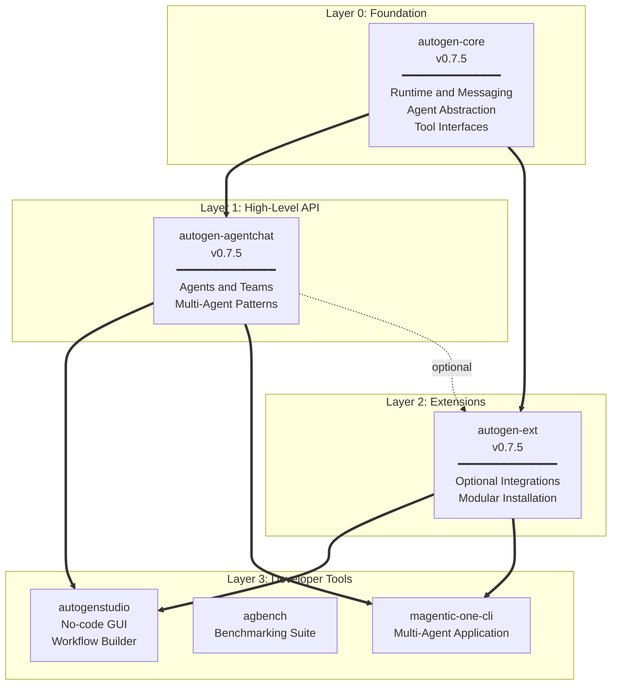

**Sources:** [README.md:14-200](), [python/packages/autogen-core/pyproject.toml:1-89](), [python/packages/autogen-agentchat/pyproject.toml:1-39](), [python/packages/autogen-ext/pyproject.toml:1-206]()

## Core Package: autogen-core

The `autogen-core` package provides foundational abstractions and runtime infrastructure that all other packages depend on.

### Package Metadata

| Property | Value |
|----------|-------|
| **Name** | `autogen-core` |
| **Version** | 0.7.5 |
| **Python Requirement** | >=3.10 |
| **License** | MIT |
| **Location** | [python/packages/autogen-core/]() |

### Core Dependencies

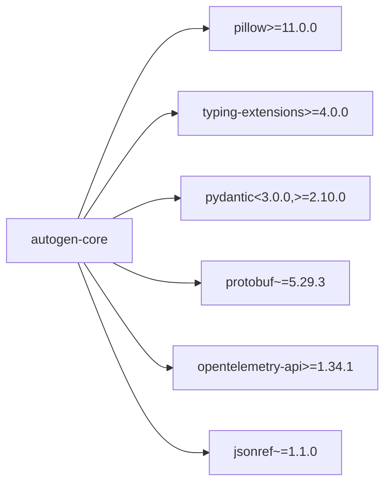

The core package has minimal dependencies by design, ensuring it can be integrated into diverse environments without conflicts. It provides:

- **Agent Protocol**: Base classes and interfaces for agent implementations
- **Runtime System**: `SingleThreadedAgentRuntime` and `GrpcWorkerAgentRuntime`
- **Message Types**: Type-safe message definitions and serialization
- **Tool Interfaces**: `BaseTool` and related abstractions
- **Model Client Protocol**: `ChatCompletionClient` interface

**Sources:** [python/packages/autogen-core/pyproject.toml:6-24]()

## AgentChat Package: autogen-agentchat

The `autogen-agentchat` package provides high-level agent implementations and team orchestration patterns built on top of `autogen-core`.

### Package Metadata

| Property | Value |
|----------|-------|
| **Name** | `autogen-agentchat` |
| **Version** | 0.7.5 |
| **Python Requirement** | >=3.10 |
| **License** | MIT |
| **Location** | [python/packages/autogen-agentchat/]() |

### Dependencies

The package has a single required dependency:

```python
dependencies = [
    "autogen-core==0.7.5",
]
```

This package includes:

- **Concrete Agents**: `AssistantAgent`, `CodeExecutorAgent`, `OpenAIAssistantAgent`
- **Team Patterns**: `RoundRobinGroupChat`, `SelectorGroupChat`, `Swarm`, `MagenticOneGroupChat`
- **Termination Conditions**: `MaxMessage`, `TextMention`, `TokenUsage`, `HandoffTermination`
- **Model Context**: `BufferedChatCompletionContext`, `UnboundedChatCompletionContext`
- **UI Components**: `Console` for displaying agent conversations

**Sources:** [python/packages/autogen-agentchat/pyproject.toml:6-19]()

## Extensions Package: autogen-ext

The `autogen-ext` package implements a modular plugin architecture where users install only the extensions they need.

### Package Metadata

| Property | Value |
|----------|-------|
| **Name** | `autogen-ext` |
| **Version** | 0.7.5 |
| **Python Requirement** | >=3.10 |
| **Base Dependency** | `autogen-core==0.7.5` |
| **Location** | [python/packages/autogen-ext/]() |

### Extension Categories

```mermaid
graph TB
    Ext["autogen-ext<br/>Base Package"]
    
    subgraph "LLM Providers"
        OpenAI["[openai]<br/>openai>=1.93<br/>tiktoken>=0.8.0<br/>aiofiles"]
        Anthropic["[anthropic]<br/>anthropic>=0.48"]
        Azure["[azure]<br/>azure-ai-inference>=1.0.0b9<br/>azure-ai-projects>=1.0.0b11<br/>azure-identity"]
        Ollama["[ollama]<br/>ollama>=0.4.7<br/>tiktoken>=0.8.0"]
        Gemini["[gemini]<br/>google-genai>=1.0.0"]
    end
    
    subgraph "Code Execution"
        Docker["[docker]<br/>docker~=7.0<br/>asyncio_atexit>=1.0.1"]
        Jupyter["[jupyter-executor]<br/>ipykernel>=6.29.5<br/>nbclient>=0.10.2"]
        DockerJupyter["[docker-jupyter-executor]<br/>websockets>=15.0.1<br/>aiohttp>=3.11.16"]
    end
    
    subgraph "Capabilities"
        WebSurfer["[web-surfer]<br/>playwright>=1.48.0<br/>magika>=0.6.1rc2"]
        FileSurfer["[file-surfer]<br/>markitdown~=0.1.0a3"]
        VideoSurfer["[video-surfer]<br/>opencv-python>=4.5<br/>openai-whisper"]
        MCP["[mcp]<br/>mcp>=1.11.0"]
        HTTP["[http-tool]<br/>httpx>=0.27.0"]
    end
    
    subgraph "Memory Systems"
        Chromadb["[chromadb]<br/>chromadb>=1.0.0"]
        Redis["[redis]<br/>redis>=5.2.1"]
        Mem0["[mem0]<br/>mem0ai>=0.1.98"]
        Diskcache["[diskcache]<br/>diskcache>=5.6.3"]
    end
    
    subgraph "Framework Integrations"
        Langchain["[langchain]<br/>langchain_core~=0.3.3"]
        SK["[semantic-kernel-core]<br/>semantic-kernel>=1.17.1"]
    end
    
    Ext -.-> OpenAI
    Ext -.-> Anthropic
    Ext -.-> Azure
    Ext -.-> Ollama
    Ext -.-> Gemini
    Ext -.-> Docker
    Ext -.-> Jupyter
    Ext -.-> DockerJupyter
    Ext -.-> WebSurfer
    Ext -.-> FileSurfer
    Ext -.-> VideoSurfer
    Ext -.-> MCP
    Ext -.-> HTTP
    Ext -.-> Chromadb
    Ext -.-> Redis
    Ext -.-> Mem0
    Ext -.-> Diskcache
    Ext -.-> Langchain
    Ext -.-> SK
```

### Installation Patterns

Extensions are installed using pip's extras syntax:

```bash
# Install specific extensions
pip install "autogen-ext[openai,docker]"

# Install multiple categories
pip install "autogen-ext[openai,azure,chromadb]"

# Install all magentic-one dependencies
pip install "autogen-ext[magentic-one]"
```

The `[magentic-one]` extra is a convenience bundle that includes:

```python
magentic-one = [
    "autogen-agentchat==0.7.5",
    "magika>=0.6.1rc2",
    "markitdown[all]~=0.1.0a3",
    "playwright>=1.48.0",
    "pillow>=11.0.0",
]
```

### Extension Implementations Table

| Category | Extra Name | Key Dependencies | Implements Interface |
|----------|-----------|------------------|---------------------|
| OpenAI | `[openai]` | openai>=1.93, tiktoken | `ChatCompletionClient` |
| Anthropic | `[anthropic]` | anthropic>=0.48 | `ChatCompletionClient` |
| Azure | `[azure]` | azure-ai-inference, azure-ai-projects | `ChatCompletionClient` |
| Ollama | `[ollama]` | ollama>=0.4.7 | `ChatCompletionClient` |
| Gemini | `[gemini]` | google-genai>=1.0.0 | `ChatCompletionClient` |
| Docker Executor | `[docker]` | docker~=7.0 | `CodeExecutor` |
| Jupyter Executor | `[jupyter-executor]` | ipykernel, nbclient | `CodeExecutor` |
| Docker Jupyter | `[docker-jupyter-executor]` | websockets, aiohttp | `CodeExecutor` |
| Web Surfer | `[web-surfer]` | playwright>=1.48.0 | `BaseTool` |
| File Surfer | `[file-surfer]` | markitdown | `BaseTool` |
| Video Surfer | `[video-surfer]` | opencv-python, whisper | `BaseTool` |
| MCP | `[mcp]` | mcp>=1.11.0 | `Workbench` |
| HTTP Tool | `[http-tool]` | httpx>=0.27.0 | `BaseTool` |
| ChromaDB | `[chromadb]` | chromadb>=1.0.0 | Memory Interface |
| Redis | `[redis]` | redis>=5.2.1 | Memory Interface |
| Mem0 | `[mem0]` | mem0ai>=0.1.98 | Memory Interface |
| Diskcache | `[diskcache]` | diskcache>=5.6.3 | Memory Interface |
| Langchain | `[langchain]` | langchain_core~=0.3.3 | Bridge |
| Semantic Kernel | `[semantic-kernel-core]` | semantic-kernel>=1.17.1 | Bridge |

**Sources:** [python/packages/autogen-ext/pyproject.toml:21-159]()

## Developer Tools

Three developer tools build on the core framework to provide specialized functionality.

### AutoGen Studio

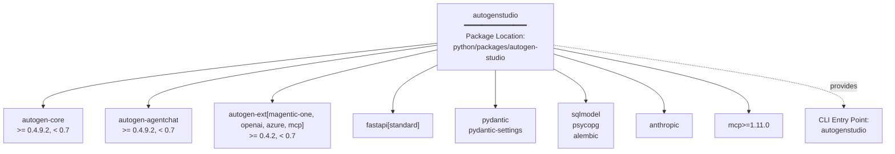

AutoGen Studio provides a no-code interface for building and testing multi-agent workflows. It includes:

- **Web Interface**: FastAPI-based REST API and web UI
- **Database**: SQLModel with PostgreSQL support via psycopg
- **Migrations**: Alembic for schema management
- **CLI Command**: `autogenstudio ui --port 8080 --appdir ./my-app`

**Sources:** [python/packages/autogen-studio/pyproject.toml:6-73](), [README.md:151-158]()

### AGBench

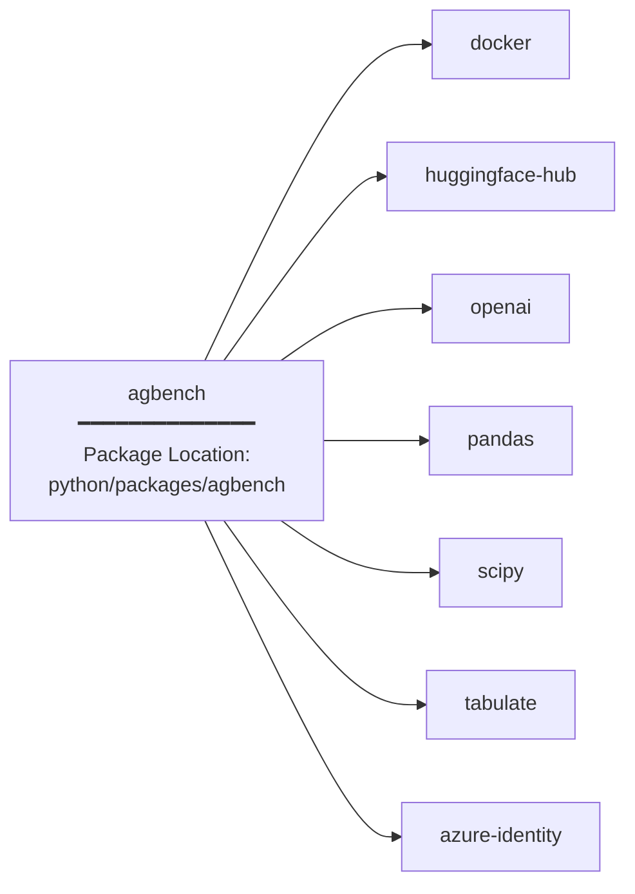

AGBench is a benchmarking suite for evaluating agent performance. It provides:

- **Benchmark Execution**: Docker-based isolated test environments
- **Dataset Integration**: HuggingFace Hub for benchmark datasets
- **Results Analysis**: Pandas and scipy for statistical analysis
- **Reporting**: Tabulate for formatted output

**Sources:** [python/uv.lock:107-140]()

### Magentic-One CLI

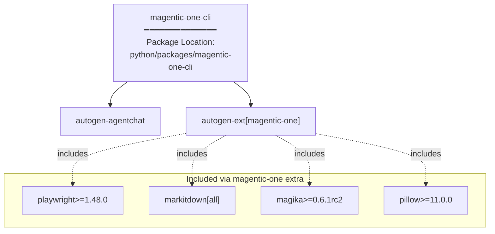

The Magentic-One CLI provides a command-line interface for running the Magentic-One multi-agent system. It is a state-of-the-art multi-agent team that handles tasks requiring web browsing, code execution, and file handling.

**Sources:** [python/uv.lock:22-31](), [python/packages/autogen-ext/pyproject.toml:59-65](), [README.md:183-184]()

## Compatibility Layer: pyautogen

The `pyautogen` package serves as a proxy for backward compatibility with AutoGen v0.2.

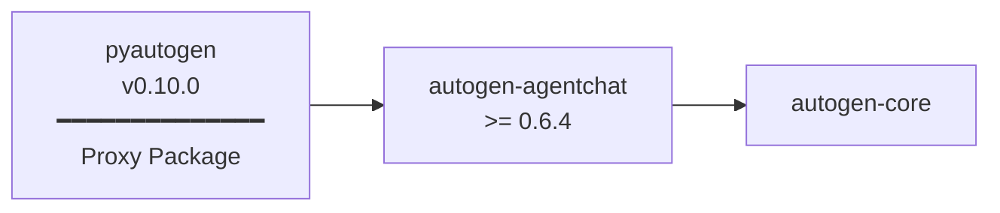

### Package Metadata

| Property | Value |
|----------|-------|
| **Name** | `pyautogen` |
| **Version** | 0.10.0 |
| **Purpose** | Proxy package for autogen-agentchat |
| **Python Requirement** | >=3.10 |
| **Location** | [python/packages/pyautogen/]() |

The package contains no implementation code ([python/packages/pyautogen/src/pyautogen/__init__.py:1]() is empty) and simply declares a dependency on `autogen-agentchat>=0.6.4`. This allows users who have `pyautogen` in their dependency specifications to automatically receive the latest `autogen-agentchat` package.

**Important Note**: For AutoGen v0.2.x, users must pin to `pyautogen~=0.2.0`. For migration instructions, see the [Migration Guide](https://microsoft.github.io/autogen/stable/user-guide/agentchat-user-guide/migration-guide.html).

**Sources:** [python/packages/pyautogen/pyproject.toml:1-25](), [python/packages/pyautogen/README.md:1-14](), [README.md:31-32]()

## .NET SDK

A parallel implementation exists for .NET developers, providing cross-platform and cross-language agent development capabilities.

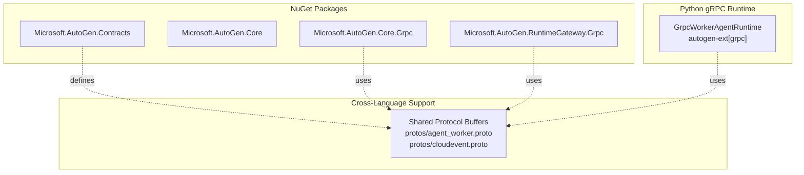

### NuGet Package Table

| Package | Purpose |
|---------|---------|
| `Microsoft.AutoGen.Contracts` | Shared contracts and interfaces |
| `Microsoft.AutoGen.Core` | Core runtime implementation |
| `Microsoft.AutoGen.Core.Grpc` | gRPC-based distributed runtime |
| `Microsoft.AutoGen.RuntimeGateway.Grpc` | Gateway for cross-language communication |

The .NET SDK supports .NET 8 and .NET 9, and can interoperate with Python agents through the gRPC runtime. Documentation is available at [microsoft.github.io/autogen/dotnet/](https://microsoft.github.io/autogen/dotnet/).

**Sources:** [README.md:191-197](), [.github/workflows/dotnet-build.yml:1-348]()

## Workspace Structure

The Python packages are organized as a uv workspace with shared configuration and tooling.

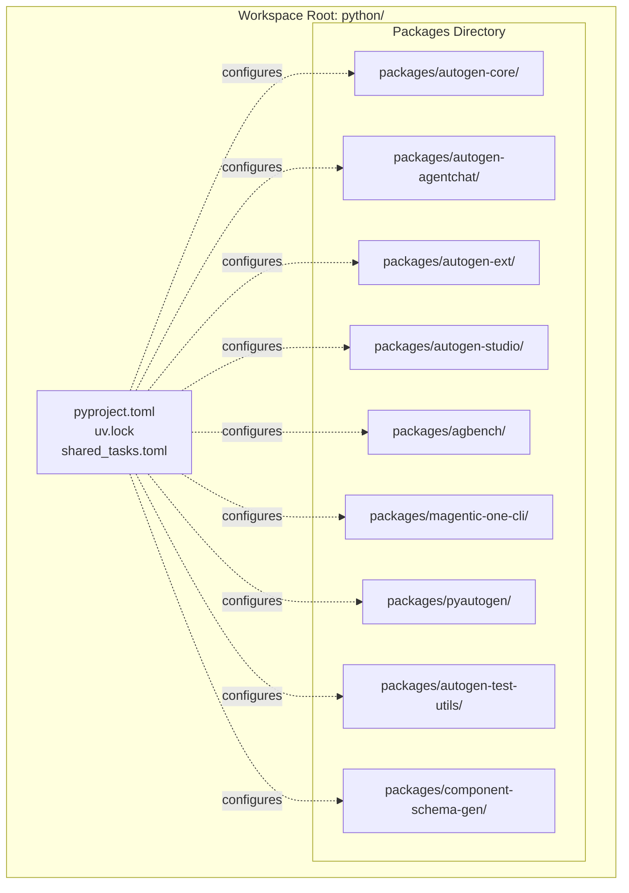

### Workspace Configuration

The workspace is defined in [python/pyproject.toml:47-49]():

```toml
[tool.uv.workspace]
members = ["packages/*"]
exclude = ["packages/autogen-magentic-one"]
```

### Workspace Members

The lockfile [python/uv.lock:20-31]() defines the following workspace members:

```
members = [
    "agbench",
    "autogen-agentchat",
    "autogen-core",
    "autogen-ext",
    "autogen-test-utils",
    "autogenstudio",
    "component-schema-gen",
    "magentic-one-cli",
    "pyautogen",
]
```

### Shared Development Dependencies

All packages inherit development dependencies from the workspace root:

| Tool | Version | Purpose |
|------|---------|---------|
| `ruff` | 0.4.8 | Linting and formatting |
| `mypy` | 1.13.0 | Static type checking |
| `pyright` | 1.1.389 | Static type checking |
| `pytest` | latest | Testing framework |
| `pytest-asyncio` | latest | Async test support |
| `pytest-cov` | latest | Coverage reporting |
| `pytest-xdist` | latest | Parallel test execution |
| `grpcio-tools` | ~1.70.0 | Protocol buffer compilation |
| `sphinx` | latest | Documentation generation |

**Sources:** [python/pyproject.toml:1-148](), [python/uv.lock:1-38]()

## Version Synchronization

All core packages maintain synchronized versions to ensure compatibility:

| Package | Current Version | Location |
|---------|----------------|----------|
| `autogen-core` | 0.7.5 | [python/packages/autogen-core/pyproject.toml:7]() |
| `autogen-agentchat` | 0.7.5 | [python/packages/autogen-agentchat/pyproject.toml:7]() |
| `autogen-ext` | 0.7.5 | [python/packages/autogen-ext/pyproject.toml:7]() |

This synchronization is enforced through exact version pins in dependencies. For example, `autogen-agentchat` specifies `autogen-core==0.7.5` (not `>=0.7.5`), and `autogen-ext` specifies both `autogen-core==0.7.5` and optional dependencies like `autogen-agentchat==0.7.5` in the `[file-surfer]` and `[web-surfer]` extras.

When new versions are released, the CI/CD system ensures all packages are published together through the [single-python-package.yml]() workflow, which can deploy any of the workspace members to PyPI.

**Sources:** [python/packages/autogen-core/pyproject.toml:7](), [python/packages/autogen-agentchat/pyproject.toml:7](), [python/packages/autogen-ext/pyproject.toml:7](), [.github/workflows/single-python-package.yml:1-45]()

---

# Page: Installation and Setup

# Installation and Setup

<details>
<summary>Relevant source files</summary>

The following files were used as context for generating this wiki page:

- [.github/ISSUE_TEMPLATE/1-bug_report.yml](.github/ISSUE_TEMPLATE/1-bug_report.yml)
- [.github/workflows/docs.yml](.github/workflows/docs.yml)
- [README.md](README.md)
- [docs/switcher.json](docs/switcher.json)
- [python/packages/autogen-agentchat/pyproject.toml](python/packages/autogen-agentchat/pyproject.toml)
- [python/packages/autogen-core/pyproject.toml](python/packages/autogen-core/pyproject.toml)
- [python/packages/autogen-ext/pyproject.toml](python/packages/autogen-ext/pyproject.toml)
- [python/packages/autogen-studio/pyproject.toml](python/packages/autogen-studio/pyproject.toml)
- [python/uv.lock](python/uv.lock)

</details>


This guide covers installing AutoGen packages, configuring API keys, and running quickstart examples to verify your installation. AutoGen uses a modular package architecture where you install only the components you need.

For information about the package architecture, see [Package Architecture](#1.1).

## Architectural Evolution

AutoGen has evolved from a monolithic v0.2 package to a layered, modular architecture starting with v0.4. This change enables better separation of concerns, easier extensibility, and cross-language support.

### Legacy vs Modern Architecture

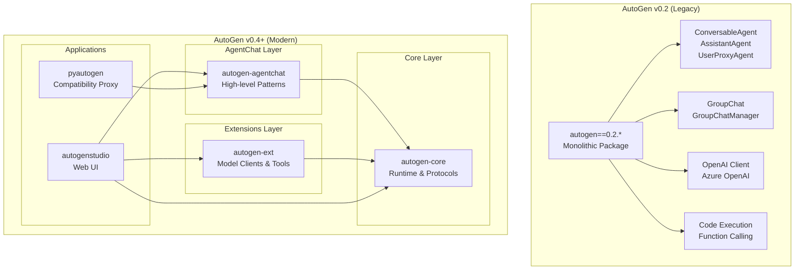

Sources: [README.md:114-117](), [python/uv.lock:22-31](), [python/packages/autogen-core/pyproject.toml:6-24](), [python/packages/autogen-agentchat/pyproject.toml:6-19](), [python/packages/autogen-ext/pyproject.toml:6-19]()

### Package Dependency Structure

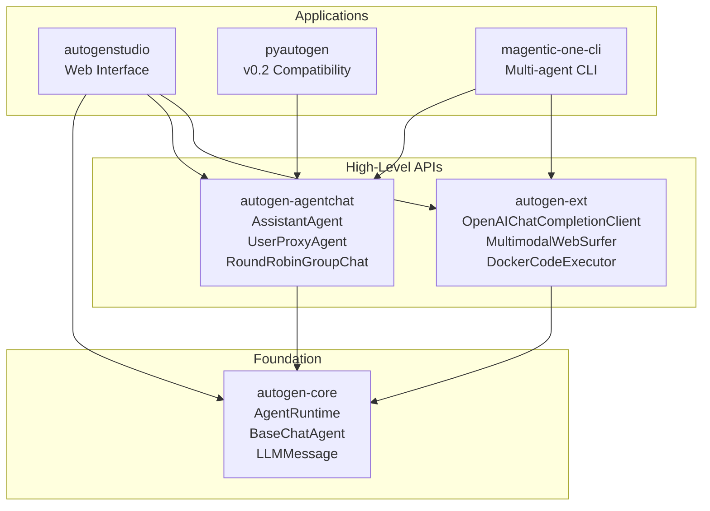

Sources: [python/packages/autogen-agentchat/pyproject.toml:17-19](), [python/packages/autogen-ext/pyproject.toml:17-19](), [python/packages/autogen-studio/pyproject.toml:35-37]()

## Installation Migration

### v0.2 Installation Pattern
```bash
# Legacy installation
pip install pyautogen==0.2.*
```

### v0.4+ Installation Patterns
```bash
# Minimal installation (core + agentchat + OpenAI)
pip install autogen-agentchat autogen-ext[openai]

# Full installation with extensions
pip install autogen-agentchat autogen-ext[openai,anthropic,azure,web-surfer]

# AutoGen Studio
pip install autogenstudio

# Compatibility proxy (bridge to new architecture)
pip install pyautogen  # Now proxies to new packages
```

Sources: [README.md:26-36](), [python/packages/autogen-ext/pyproject.toml:21-78]()

## Code Migration Patterns

### Agent Creation Migration

| v0.2 Pattern | v0.4+ Pattern | Key Changes |
|--------------|---------------|-------------|
| `ConversableAgent` | `BaseChatAgent` | Abstract base moved to core |
| `AssistantAgent` | `AssistantAgent` | Now requires explicit model client |
| `UserProxyAgent` | `UserProxyAgent` | Simplified human interaction |
| Direct OpenAI config | Explicit model client | Separation of concerns |

### Model Client Migration

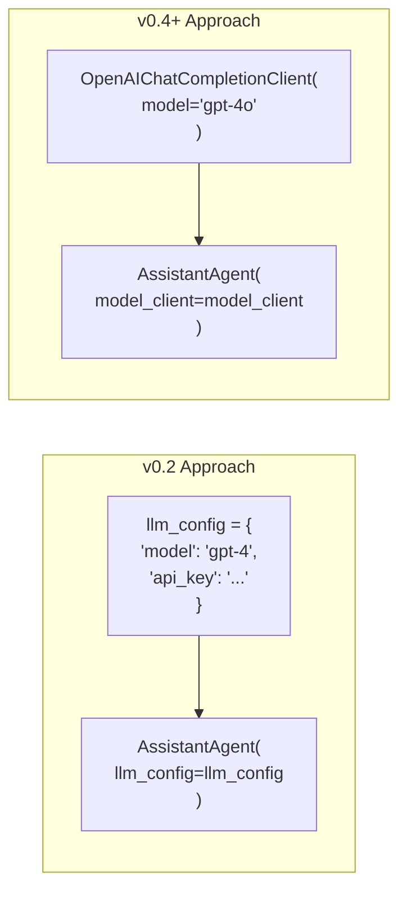

Sources: [README.md:44-56]()

### GroupChat Migration

| v0.2 Component | v0.4+ Equivalent | Location |
|----------------|------------------|----------|
| `GroupChat` | `RoundRobinGroupChat` | `autogen-agentchat` |
| `GroupChatManager` | `SelectorGroupChat` | `autogen-agentchat` |
| Custom orchestration | `GraphFlow` | `autogen-agentchat` |
| Sequential execution | `RoundRobinGroupChat` | `autogen-agentchat` |

## Runtime Migration

### Agent Runtime Architecture

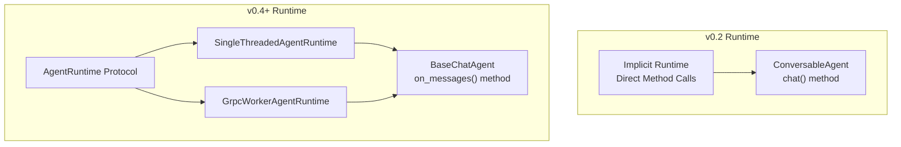

Sources: [README.md:114-115]()

### Message System Changes

| v0.2 Message Types | v0.4+ Message Types | Purpose |
|-------------------|---------------------|---------|
| `dict` with `role`, `content` | `LLMMessage` subclasses | Type safety |
| String messages | `TextMessage` | Simple text |
| Function calls | `ToolCallMessage` | Tool execution |
| Images | `MultiModalMessage` | Media content |

## Extension Migration

### Model Provider Support

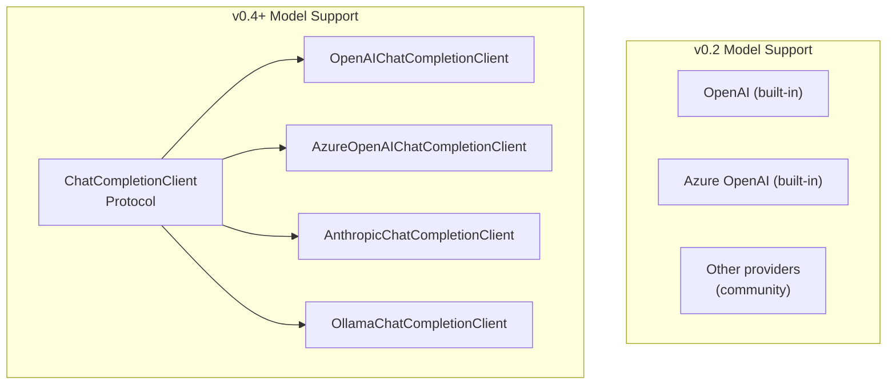

Sources: [python/packages/autogen-ext/pyproject.toml:22-33]()

### Code Execution Migration

| v0.2 Feature | v0.4+ Equivalent | Package Location |
|--------------|------------------|------------------|
| `DockerCommandLineCodeExecutor` | `DockerCodeExecutor` | `autogen-ext[docker]` |
| `LocalCommandLineCodeExecutor` | `LocalCodeExecutor` | `autogen-ext` |
| Built-in execution | `CodeExecutorAgent` | `autogen-agentchat` |
| Jupyter execution | `JupyterCodeExecutor` | `autogen-ext[jupyter-executor]` |

## Compatibility Bridge

### pyautogen Proxy Package

The `pyautogen` package serves as a compatibility bridge for existing v0.2 code:

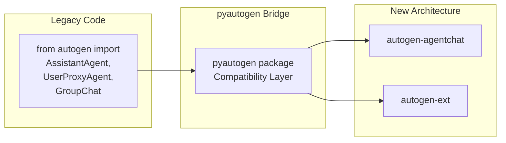

Sources: [python/uv.lock:30]()

## Migration Checklist

### Installation Updates
- [ ] Replace `pip install pyautogen==0.2.*` with modular packages
- [ ] Add specific extension dependencies (e.g., `[openai]`, `[anthropic]`)
- [ ] Update requirements.txt or pyproject.toml dependencies

### Code Updates
- [ ] Replace `llm_config` dictionaries with explicit model clients
- [ ] Update import statements to new package structure
- [ ] Migrate `ConversableAgent` to `BaseChatAgent` patterns
- [ ] Replace `GroupChat` with appropriate team coordination class
- [ ] Update message handling to use typed message classes

### Runtime Migration
- [ ] Replace direct method calls with async/await patterns
- [ ] Implement proper agent runtime initialization
- [ ] Update termination conditions to new system
- [ ] Migrate custom function calling to tool agent patterns

### Testing and Validation
- [ ] Verify model client connections work correctly
- [ ] Test agent conversation flows
- [ ] Validate tool/code execution functionality
- [ ] Confirm termination conditions work as expected

Sources: [README.md:26-36](), [.github/ISSUE_TEMPLATE/1-bug_report.yml:92-117](), [docs/switcher.json:1-112]()

---

# Page: Core Foundation

# Core Foundation

<details>
<summary>Relevant source files</summary>

The following files were used as context for generating this wiki page:

- [python/packages/autogen-core/src/autogen_core/_agent.py](python/packages/autogen-core/src/autogen_core/_agent.py)
- [python/packages/autogen-core/src/autogen_core/_agent_instantiation.py](python/packages/autogen-core/src/autogen_core/_agent_instantiation.py)
- [python/packages/autogen-core/src/autogen_core/_agent_runtime.py](python/packages/autogen-core/src/autogen_core/_agent_runtime.py)
- [python/packages/autogen-core/src/autogen_core/_base_agent.py](python/packages/autogen-core/src/autogen_core/_base_agent.py)
- [python/packages/autogen-core/src/autogen_core/_single_threaded_agent_runtime.py](python/packages/autogen-core/src/autogen_core/_single_threaded_agent_runtime.py)
- [python/packages/autogen-core/src/autogen_core/_telemetry/__init__.py](python/packages/autogen-core/src/autogen_core/_telemetry/__init__.py)
- [python/packages/autogen-core/src/autogen_core/_telemetry/_genai.py](python/packages/autogen-core/src/autogen_core/_telemetry/_genai.py)
- [python/packages/autogen-core/src/autogen_core/_telemetry/_propagation.py](python/packages/autogen-core/src/autogen_core/_telemetry/_propagation.py)
- [python/packages/autogen-core/src/autogen_core/_telemetry/_tracing.py](python/packages/autogen-core/src/autogen_core/_telemetry/_tracing.py)
- [python/packages/autogen-core/src/autogen_core/models/_types.py](python/packages/autogen-core/src/autogen_core/models/_types.py)
- [python/packages/autogen-core/src/autogen_core/tool_agent/_caller_loop.py](python/packages/autogen-core/src/autogen_core/tool_agent/_caller_loop.py)
- [python/packages/autogen-core/src/autogen_core/tool_agent/_tool_agent.py](python/packages/autogen-core/src/autogen_core/tool_agent/_tool_agent.py)
- [python/packages/autogen-core/tests/test_base_agent.py](python/packages/autogen-core/tests/test_base_agent.py)
- [python/packages/autogen-core/tests/test_runtime.py](python/packages/autogen-core/tests/test_runtime.py)
- [python/packages/autogen-ext/conftest.py](python/packages/autogen-ext/conftest.py)
- [python/packages/autogen-ext/src/autogen_ext/runtimes/grpc/_worker_runtime.py](python/packages/autogen-ext/src/autogen_ext/runtimes/grpc/_worker_runtime.py)
- [python/packages/autogen-ext/tests/test_worker_runtime.py](python/packages/autogen-ext/tests/test_worker_runtime.py)
- [python/packages/autogen-ext/tests/tools/http/test_http_tool.py](python/packages/autogen-ext/tests/tools/http/test_http_tool.py)

</details>


This document covers the foundational systems that underpin all of AutoGen. These core components provide the runtime environment, communication infrastructure, agent lifecycle management, and telemetry systems that enable multi-agent applications.

The foundation consists of:
- **Agent Runtime System**: Message routing and agent execution environments
- **Communication Infrastructure**: Message types, serialization, and context propagation  
- **Agent Protocol**: Lifecycle management and runtime binding
- **Telemetry and Observability**: Distributed tracing and monitoring

## Agent Runtime System

AutoGen's agent execution is built on the `AgentRuntime` protocol, which defines the core interface for agent communication and lifecycle management. The runtime system provides pluggable implementations for different deployment scenarios.

**Runtime Protocol and Implementations**

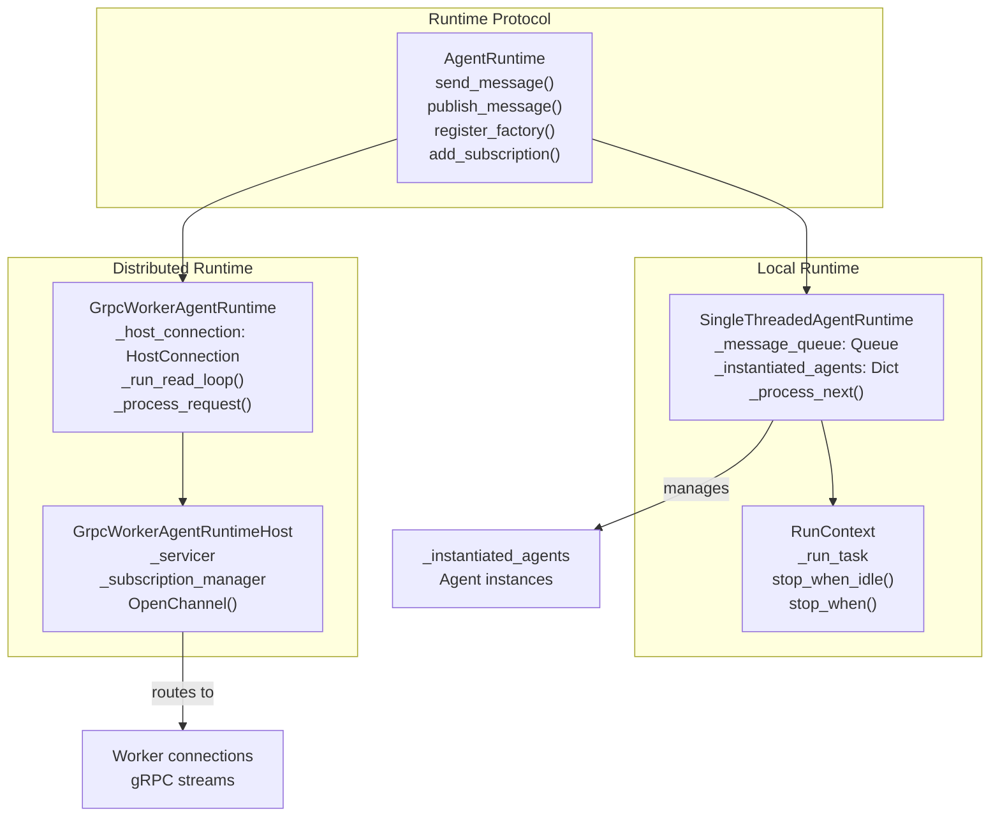

**SingleThreadedAgentRuntime Implementation**

The `SingleThreadedAgentRuntime` class provides local agent execution using asyncio:

- **Message Queue**: Uses `Queue[PublishMessageEnvelope | SendMessageEnvelope | ResponseMessageEnvelope]` for FIFO processing
- **Agent Storage**: Maintains `_instantiated_agents: Dict[AgentId, Agent]` for agent instances
- **Runtime Control**: `RunContext` class manages the event loop with `_process_next()` method
- **Lifecycle Methods**: `start()`, `stop()`, `stop_when_idle()` for runtime control

**GrpcWorkerAgentRuntime Implementation**

The distributed runtime uses gRPC for cross-process communication:

- **Host Connection**: `HostConnection` class manages bidirectional gRPC streams
- **Message Processing**: `_process_request()`, `_process_response()`, `_process_event()` handle different message types
- **Protocol Buffers**: Uses `agent_worker_pb2` and `cloudevent_pb2` for serialization
- **Worker Registration**: `_register_agent_type()` registers agents with the host

Sources: [python/packages/autogen-core/src/autogen_core/_agent_runtime.py:20-296](), [python/packages/autogen-core/src/autogen_core/_single_threaded_agent_runtime.py:149-875](), [python/packages/autogen-ext/src/autogen_ext/runtimes/grpc/_worker_runtime.py:215-772]()

## Message Processing and Communication

The runtime processes messages through a unified envelope system that supports both direct communication and publish-subscribe patterns.

**Message Envelope Types**

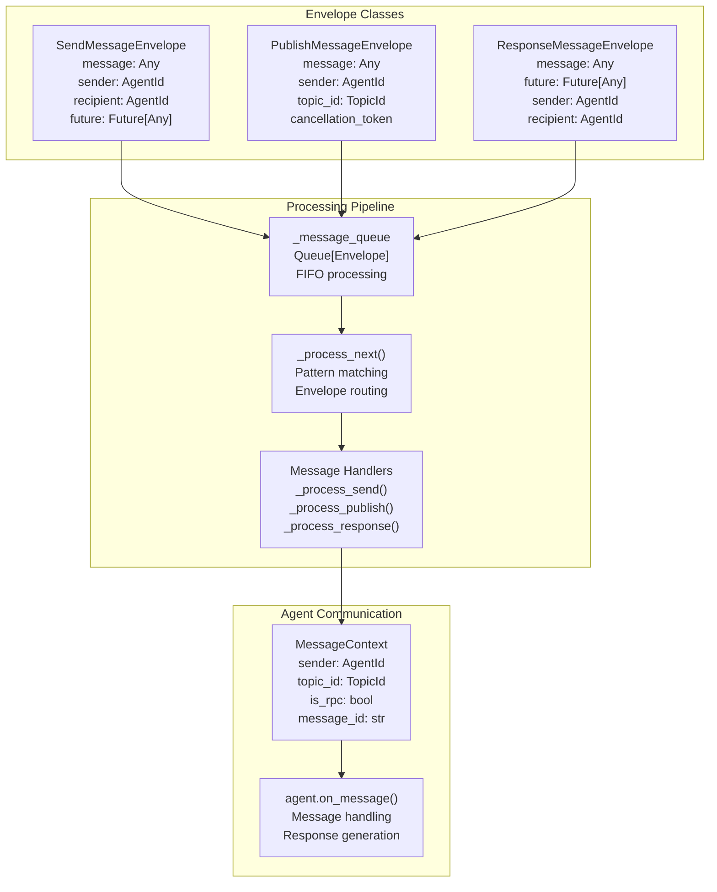

**Message Processing Flow**

The `SingleThreadedAgentRuntime._process_next()` method handles message routing:

1. **Envelope Dequeue**: Messages are retrieved from `_message_queue` 
2. **Intervention Processing**: `InterventionHandler.on_send()`, `on_publish()`, `on_response()` can modify messages
3. **Agent Lookup**: `_get_agent()` retrieves target agent instances
4. **Context Creation**: `MessageContext` is populated with sender, topic, and metadata
5. **Message Dispatch**: `agent.on_message()` is called with proper context
6. **Response Handling**: For RPC calls, responses are wrapped in `ResponseMessageEnvelope`

**Subscription and Topic Management**

The runtime uses `SubscriptionManager` for topic-based message routing:

- **Subscription Types**: `TypeSubscription`, `DefaultSubscription`, `TypePrefixSubscription` 
- **Topic Resolution**: `get_subscribed_recipients()` finds agents for each topic
- **Agent Registration**: `add_subscription()` registers agent interest in topics

Sources: [python/packages/autogen-core/src/autogen_core/_single_threaded_agent_runtime.py:57-94](), [python/packages/autogen-core/src/autogen_core/_single_threaded_agent_runtime.py:466-795]()

## Agent Protocol and Lifecycle

All agents implement the `Agent` protocol, which defines the core interface for message handling and state management. The `BaseAgent` class provides runtime integration and subscription management.

**Agent Protocol and Implementation**

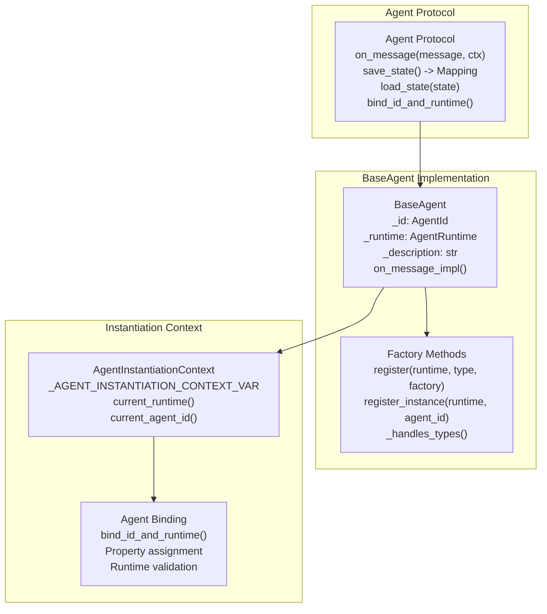

**Agent Registration Process**

The agent registration process involves several coordinated steps:

1. **Factory Registration**: `runtime.register_factory(type, agent_factory, expected_class)` registers the agent type
2. **Context Population**: `AgentInstantiationContext.populate_context((runtime, agent_id))` provides factory context
3. **Agent Creation**: Factory function creates agent instance with access to `current_runtime()` and `current_agent_id()`
4. **Runtime Binding**: `bind_id_and_runtime()` associates agent with runtime and validates consistency
5. **Subscription Setup**: `_unbound_subscriptions()` are processed and added to runtime

**Agent Identification and Addressing**

Agents are uniquely identified using `AgentId` with two components:

- **Type**: Agent class or factory identifier (e.g., "assistant_agent")
- **Key**: Instance identifier within the type (e.g., "default", "user_123")

This enables multiple instances of the same agent type while maintaining unique addressing.

**State Management**

The `BaseAgent` class provides state persistence hooks:

- **save_state()**: Returns `Mapping[str, Any]` with JSON-serializable agent state
- **load_state()**: Restores agent from previously saved state
- **Runtime Integration**: `SingleThreadedAgentRuntime.save_state()` coordinates all agent states

Sources: [python/packages/autogen-core/src/autogen_core/_agent.py:12-65](), [python/packages/autogen-core/src/autogen_core/_base_agent.py:60-255](), [python/packages/autogen-core/src/autogen_core/_agent_instantiation.py:9-127]()

## Serialization and Type Safety

The foundation includes a comprehensive serialization system that enables message passing across different runtime environments and ensures type safety.

**Serialization Registry System**

```mermaid
graph TB
    subgraph "Serialization Infrastructure"
        REG["SerializationRegistry<br/>_serializers_by_type<br/>_serializers_by_name<br/>serialize()/deserialize()"]
        SER["MessageSerializer[T]<br/>type_name: str<br/>data_content_type: str<br/>serialize()/deserialize()"]
    end
    
    subgraph "Content Types"
        JSON["JSON_DATA_CONTENT_TYPE<br/>'application/json'<br/>Universal compatibility<br/>Human readable"]
        PROTO["PROTOBUF_DATA_CONTENT_TYPE<br/>'application/protobuf'<br/>Cross-language support<br/>Performance optimized"]
    end
    
    subgraph "Runtime Integration"
        RUNTIME["Runtime.add_message_serializer()<br/>Type registration<br/>Automatic serialization<br/>Cross-process messaging"]
        AGENT["BaseAgent._handles_types()<br/>Agent type declarations<br/>Automatic registration<br/>Subscription setup"]
    end
    
    REG --> SER
    SER --> JSON
    SER --> PROTO
    REG --> RUNTIME
    RUNTIME --> AGENT
```

**Message Serialization Flow**

The serialization system operates automatically during message processing:

1. **Type Registration**: `runtime.add_message_serializer()` registers serializers for message types
2. **Automatic Detection**: `try_get_known_serializers_for_type()` finds appropriate serializers
3. **Serialization**: `SerializationRegistry.serialize()` converts objects to bytes with content type
4. **Deserialization**: `SerializationRegistry.deserialize()` reconstructs objects from bytes and type metadata
5. **Cross-Runtime**: gRPC runtime uses protocol buffers, local runtime uses JSON

Sources: [python/packages/autogen-core/src/autogen_core/_serialization.py](), [python/packages/autogen-core/src/autogen_core/_single_threaded_agent_runtime.py:267-270]()

## Telemetry and Observability

The foundation provides comprehensive OpenTelemetry integration for distributed tracing, performance monitoring, and observability across agent operations.

**Telemetry Infrastructure**

```mermaid
graph TD
    subgraph "Core Telemetry Classes"
        TH["TraceHelper<br/>_tracer_provider: TracerProvider<br/>_tracer: Tracer<br/>trace_block() context manager"]
        CONFIG["MessageRuntimeTracingConfig<br/>get_span_name()<br/>get_span_kind()<br/>build_attributes()"]
    end
    
    subgraph "Context Propagation"
        META["EnvelopeMetadata<br/>traceparent: str<br/>tracestate: str<br/>links: Sequence[Link]"]
        PROP["Trace Propagation<br/>get_telemetry_envelope_metadata()<br/>get_telemetry_grpc_metadata()<br/>TraceContextTextMapPropagator"]
    end
    
    subgraph "GenAI Semantic Conventions"
        SPANS["Span Types<br/>trace_create_agent_span()<br/>trace_invoke_agent_span()<br/>trace_tool_span()"]
        ATTRS["Span Attributes<br/>GEN_AI_AGENT_ID<br/>GEN_AI_OPERATION_NAME<br/>GEN_AI_SYSTEM"]
    end
    
    TH --> CONFIG
    TH --> META
    META --> PROP
    TH --> SPANS
    SPANS --> ATTRS
```

**Runtime Tracing Integration**

The runtime automatically instruments operations using `TraceHelper`:

- **Message Operations**: `trace_block("send", recipient)`, `trace_block("publish", topic_id)` wrap message routing
- **Agent Processing**: `trace_block("process", agent.id)` tracks agent message handling
- **Context Propagation**: `EnvelopeMetadata` carries trace context across message boundaries
- **Distributed Tracing**: gRPC metadata includes `traceparent` and `tracestate` for cross-process correlation

**GenAI Semantic Conventions**

The telemetry system follows OpenTelemetry GenAI semantic conventions:

- **Agent Operations**: `GEN_AI_OPERATION_NAME` values like "create_agent", "invoke_agent" 
- **System Identification**: `GEN_AI_SYSTEM` set to "autogen"
- **Agent Metadata**: `GEN_AI_AGENT_ID`, `GEN_AI_AGENT_NAME`, `GEN_AI_AGENT_DESCRIPTION`
- **Tool Execution**: `GEN_AI_TOOL_NAME`, `GEN_AI_TOOL_CALL_ID` for external tool calls

**Observability Configuration**

Tracing can be controlled through environment variables and runtime configuration:

- **Disable Tracing**: `AUTOGEN_DISABLE_RUNTIME_TRACING=true` disables all tracing
- **Custom Providers**: `TracerProvider` can be injected into runtime constructors
- **Span Customization**: Additional attributes and context can be added to spans

Sources: [python/packages/autogen-core/src/autogen_core/_telemetry/_tracing.py:12-100](), [python/packages/autogen-core/src/autogen_core/_telemetry/_genai.py:32-215](), [python/packages/autogen-core/src/autogen_core/_telemetry/_propagation.py:10-127]()

## Runtime Control and Lifecycle

The runtime system provides sophisticated control mechanisms for starting, stopping, and managing agent execution lifecycles.

**Runtime Lifecycle Management**

```mermaid
graph TD
    subgraph "Runtime Control"
        START["runtime.start()<br/>Create RunContext<br/>_run_task creation<br/>Message loop activation"]
        STOP["Stopping Methods<br/>stop(): Immediate<br/>stop_when_idle(): Graceful<br/>stop_when(): Conditional"]
    end
    
    subgraph "RunContext Management"
        RC["RunContext<br/>_runtime: SingleThreadedAgentRuntime<br/>_run_task: Task<br/>_stopped: Event"]
        LOOP["_run() loop<br/>while not stopped<br/>await _process_next()<br/>Background processing"]
    end
    
    subgraph "Message Processing Control"
        QUEUE["_message_queue.join()<br/>Wait for queue empty<br/>Graceful shutdown<br/>Task completion"]
        TASKS["_background_tasks: Set[Task]<br/>Concurrent message handling<br/>Exception propagation<br/>Task cleanup"]
    end
    
    START --> RC
    RC --> LOOP
    STOP --> QUEUE
    LOOP --> TASKS
```

**Exception Handling and Recovery**

The runtime provides configurable exception handling:

- **Background Exceptions**: `_background_exception` captures unhandled agent exceptions
- **Exception Propagation**: `ignore_unhandled_exceptions` controls whether exceptions bubble up
- **Graceful Degradation**: Failed messages don't stop the entire runtime
- **Agent Isolation**: Exceptions in one agent don't affect others

**State Persistence**

The runtime supports comprehensive state management:

- **Runtime State**: `save_state()` captures all agent states in `Dict[str, Dict[str, Any]]` format
- **Agent State**: Individual `agent.save_state()` and `agent.load_state()` for custom persistence
- **JSON Serialization**: All state data must be JSON-compatible for portability
- **Selective Recovery**: `agent_save_state(agent_id)` and `agent_load_state(agent_id, state)` for individual agents

Sources: [python/packages/autogen-core/src/autogen_core/_single_threaded_agent_runtime.py:99-131](), [python/packages/autogen-core/src/autogen_core/_single_threaded_agent_runtime.py:431-465](), [python/packages/autogen-core/src/autogen_core/_single_threaded_agent_runtime.py:796-875]()

## Integration Architecture

The core foundation components work together to provide a cohesive agent execution environment:

```mermaid
graph TB
    subgraph "Application Layer"
        APPS["Agent Applications<br/>Business logic<br/>Domain-specific agents"]
    end
    
    subgraph "Core Foundation"
        RUNTIME["AgentRuntime<br/>Message routing<br/>Agent lifecycle"]
        AGENTS["Agent Protocol<br/>Message handling<br/>State management"]
        MESSAGES["Message System<br/>Context propagation<br/>Serialization"]
        TELEMETRY["Telemetry<br/>Observability<br/>Tracing"]
    end
    
    subgraph "Infrastructure"
        TRANSPORT["Transport Layer<br/>gRPC/Local queues<br/>Network communication"]
        SERIALIZATION["Serialization<br/>JSON/Protobuf<br/>Type safety"]
        OTEL["OpenTelemetry<br/>Distributed tracing<br/>Metrics collection"]
    end
    
    APPS --> RUNTIME
    APPS --> AGENTS
    
    RUNTIME --> MESSAGES
    RUNTIME --> TELEMETRY
    AGENTS --> MESSAGES
    
    RUNTIME --> TRANSPORT
    MESSAGES --> SERIALIZATION
    TELEMETRY --> OTEL
```

This foundation enables higher-level features like conversational agents, multi-agent teams, and external integrations while maintaining clean separation of concerns and supporting both local and distributed deployment scenarios.

Sources: [python/packages/autogen-core/src/autogen_core/_single_threaded_agent_runtime.py](), [python/packages/autogen-core/src/autogen_core/_base_agent.py](), [python/packages/autogen-core/src/autogen_core/_agent_runtime.py]()

---

# Page: Agent Runtime System

# Agent Runtime System

<details>
<summary>Relevant source files</summary>

The following files were used as context for generating this wiki page:

- [python/packages/autogen-core/src/autogen_core/_agent.py](python/packages/autogen-core/src/autogen_core/_agent.py)
- [python/packages/autogen-core/src/autogen_core/_agent_instantiation.py](python/packages/autogen-core/src/autogen_core/_agent_instantiation.py)
- [python/packages/autogen-core/src/autogen_core/_agent_runtime.py](python/packages/autogen-core/src/autogen_core/_agent_runtime.py)
- [python/packages/autogen-core/src/autogen_core/_base_agent.py](python/packages/autogen-core/src/autogen_core/_base_agent.py)
- [python/packages/autogen-core/src/autogen_core/_single_threaded_agent_runtime.py](python/packages/autogen-core/src/autogen_core/_single_threaded_agent_runtime.py)
- [python/packages/autogen-core/src/autogen_core/_telemetry/__init__.py](python/packages/autogen-core/src/autogen_core/_telemetry/__init__.py)
- [python/packages/autogen-core/src/autogen_core/_telemetry/_genai.py](python/packages/autogen-core/src/autogen_core/_telemetry/_genai.py)
- [python/packages/autogen-core/src/autogen_core/_telemetry/_propagation.py](python/packages/autogen-core/src/autogen_core/_telemetry/_propagation.py)
- [python/packages/autogen-core/src/autogen_core/_telemetry/_tracing.py](python/packages/autogen-core/src/autogen_core/_telemetry/_tracing.py)
- [python/packages/autogen-core/tests/test_base_agent.py](python/packages/autogen-core/tests/test_base_agent.py)
- [python/packages/autogen-core/tests/test_runtime.py](python/packages/autogen-core/tests/test_runtime.py)
- [python/packages/autogen-ext/conftest.py](python/packages/autogen-ext/conftest.py)
- [python/packages/autogen-ext/src/autogen_ext/runtimes/grpc/_worker_runtime.py](python/packages/autogen-ext/src/autogen_ext/runtimes/grpc/_worker_runtime.py)
- [python/packages/autogen-ext/tests/test_worker_runtime.py](python/packages/autogen-ext/tests/test_worker_runtime.py)
- [python/packages/autogen-ext/tests/tools/http/test_http_tool.py](python/packages/autogen-ext/tests/tools/http/test_http_tool.py)

</details>


The Agent Runtime System provides the foundational infrastructure for executing agents and managing message communication within AutoGen. It defines the core protocol for agent lifecycle management, message routing, and distributed execution. This system serves as the execution engine that orchestrates agent interactions through both local single-threaded and distributed GRPC-based runtimes.

For information about high-level agent APIs that use these runtimes, see [AgentChat API](#3). For details about message types and serialization, see [Message Types and Tool Agents](#2.3).

## Runtime Protocol Interface

The `AgentRuntime` protocol defines the contract that all runtime implementations must fulfill. It provides a standardized interface for agent registration, message communication, and state management. This is defined as a `Protocol` class to enable structural typing.

**AgentRuntime Protocol Structure**

```mermaid
graph TB
    subgraph "AgentRuntime Protocol"
        AR["AgentRuntime<br/>@runtime_checkable Protocol"]
    end
    
    subgraph "Message Operations"
        SM["send_message()<br/>recipient: AgentId<br/>returns: Any"]
        PM["publish_message()<br/>topic_id: TopicId<br/>returns: None"] 
    end
    
    subgraph "Agent Lifecycle"
        RF["register_factory()<br/>type: str | AgentType<br/>agent_factory: Callable<br/>returns: AgentType"]
        RAI["register_agent_instance()<br/>agent_instance: Agent<br/>agent_id: AgentId<br/>returns: AgentId"]
        TG["try_get_underlying_agent_instance()<br/>id: AgentId<br/>type: Type[T]<br/>returns: T"]
    end
    
    subgraph "State Persistence"
        SS["save_state()<br/>returns: Mapping[str, Any]"]
        LS["load_state()<br/>state: Mapping[str, Any]"]
        ASS["agent_save_state()<br/>agent: AgentId"]
        ALS["agent_load_state()<br/>agent: AgentId, state"]
    end
    
    subgraph "Subscription Control"
        AS["add_subscription()<br/>subscription: Subscription"]
        RS["remove_subscription()<br/>id: str"]
        AMS["add_message_serializer()<br/>serializer: MessageSerializer"]
    end
    
    subgraph "Metadata"
        AM["agent_metadata()<br/>agent: AgentId<br/>returns: AgentMetadata"]
    end
    
    AR --> SM
    AR --> PM
    AR --> RF
    AR --> RAI
    AR --> TG
    AR --> SS
    AR --> LS
    AR --> ASS
    AR --> ALS
    AR --> AS
    AR --> RS
    AR --> AMS
    AR --> AM
```

**Runtime Implementations**

| Implementation | Location | Use Case |
|----------------|----------|----------|
| `SingleThreadedAgentRuntime` | `autogen_core._single_threaded_agent_runtime` | Local development, single-process execution |
| `GrpcWorkerAgentRuntime` | `autogen_ext.runtimes.grpc._worker_runtime` | Distributed execution, cross-language agents |

Sources: [python/packages/autogen-core/src/autogen_core/_agent_runtime.py:20-296]()
</thinking>

## Message Routing and Subscriptions

The runtime system uses a subscription-based routing mechanism to deliver published messages to interested agents. The `SubscriptionManager` handles the mapping between topic types and agent instances.

**Subscription System Architecture**

```mermaid
graph TB
    subgraph "Subscription Types"
        TS["TypeSubscription<br/>topic_type: str<br/>agent_type: str"]
        TPS["TypePrefixSubscription<br/>topic_type_prefix: str<br/>agent_type: str"]
        DS["DefaultSubscription<br/>agent_type: str"]
    end
    
    subgraph "SubscriptionManager"
        SM["SubscriptionManager<br/>_subscriptions: List[Subscription]<br/>_type_to_agents: Dict"]
        GSR["get_subscribed_recipients()<br/>topic_id: TopicId<br/>returns: List[AgentId]"]
    end
    
    subgraph "Runtime Integration"
        AS["add_subscription()"]
        RS["remove_subscription()"]
        PP["_process_publish()"]
    end
    
    TS --> SM
    TPS --> SM
    DS --> SM
    SM --> GSR
    AS --> SM
    RS --> SM
    PP --> GSR
```

**Subscription Resolution Process**

1. Agent registers with runtime using `register_factory()` or `register_agent_instance()`
2. Subscriptions are added via `add_subscription()` (often handled automatically by agent decorators)
3. When `publish_message()` is called with a `TopicId`, the runtime queries `SubscriptionManager`
4. `get_subscribed_recipients()` returns all `AgentId`s matching the topic
5. Runtime delivers message to each subscribed agent via `on_message()`

Sources: [python/packages/autogen-core/src/autogen_core/_single_threaded_agent_runtime.py:265](), [python/packages/autogen-core/src/autogen_core/_runtime_impl_helpers.py]()

## Message Envelope System

The runtime uses a message envelope system to manage different types of message operations. Each envelope type encapsulates the necessary information for routing and processing messages.

```mermaid
graph LR
    subgraph "Message Envelopes"
        SME["SendMessageEnvelope<br/>Direct Agent Communication"]
        PME["PublishMessageEnvelope<br/>Topic Broadcasting"] 
        RME["ResponseMessageEnvelope<br/>Response Handling"]
    end
    
    subgraph "Envelope Components"
        MSG["message: Any"]
        CTX["cancellation_token: CancellationToken"]
        META["metadata: EnvelopeMetadata"]
        ID["message_id: str"]
    end
    
    subgraph "Routing Information"
        SEND_R["sender: AgentId | None<br/>recipient: AgentId<br/>future: Future[Any]"]
        PUB_R["sender: AgentId | None<br/>topic_id: TopicId"]
        RESP_R["sender: AgentId<br/>recipient: AgentId | None<br/>future: Future[Any]"]
    end
    
    SME --> MSG
    SME --> SEND_R
    PME --> MSG  
    PME --> PUB_R
    RME --> MSG
    RME --> RESP_R
    
    SME --> CTX
    PME --> CTX
    SME --> META
    PME --> META
    RME --> META
    SME --> ID
    PME --> ID
```

Each envelope type serves a specific communication pattern:

- **SendMessageEnvelope**: Used for direct agent-to-agent RPC-style communication with response handling
- **PublishMessageEnvelope**: Used for broadcasting messages to all subscribed agents on a topic
- **ResponseMessageEnvelope**: Used internally to deliver responses back to the original sender

Sources: [python/packages/autogen-core/src/autogen_core/_single_threaded_agent_runtime.py:57-93]()

## SingleThreadedAgentRuntime Implementation

The `SingleThreadedAgentRuntime` is the primary local execution engine that processes all messages using a single asyncio event loop. It provides concurrent message processing while maintaining deterministic message ordering.

```mermaid
graph TB
    subgraph "SingleThreadedAgentRuntime Architecture"
        subgraph "Message Processing"
            MQ["_message_queue<br/>Queue[MessageEnvelope]"]
            RC["RunContext<br/>Message Loop Controller"]
            BT["_background_tasks<br/>Set[Task[Any]]"]
        end
        
        subgraph "Agent Management"
            AF["_agent_factories<br/>Dict[str, Callable]"]
            IA["_instantiated_agents<br/>Dict[AgentId, Agent]"]
            SM["_subscription_manager<br/>SubscriptionManager"]
        end
        
        subgraph "Processing Methods"
            PN["_process_next()"]
            PS["_process_send()"]
            PP["_process_publish()"]
            PR["_process_response()"]
        end
        
        subgraph "External Interface"
            START["start()"]
            STOP["stop() / stop_when_idle()"]
            SEND["send_message()"]
            PUB["publish_message()"]
        end
    end
    
    START --> RC
    RC --> PN
    PN --> MQ
    PN --> PS
    PN --> PP  
    PN --> PR
    
    SEND --> MQ
    PUB --> MQ
    
    PS --> IA
    PP --> IA
    PS --> AF
    PP --> AF
    
    PP --> SM
    PS --> BT
    PP --> BT
    PR --> BT
```

### Key Components

| Component | Type | Purpose | Location |
|-----------|------|---------|----------|
| **_message_queue** | `Queue[MessageEnvelope]` | Central asyncio queue for all message envelopes | [_single_threaded_agent_runtime.py:257]() |
| **_run_context** | `RunContext | None` | Manages the message processing loop lifecycle | [_single_threaded_agent_runtime.py:266]() |
| **_subscription_manager** | `SubscriptionManager` | Routes published messages to subscribed agents | [_single_threaded_agent_runtime.py:265]() |
| **_agent_factories** | `Dict[str, Callable]` | Stores agent factory functions for lazy instantiation | [_single_threaded_agent_runtime.py:259-261]() |
| **_instantiated_agents** | `Dict[AgentId, Agent]` | Cache of already instantiated agent instances | [_single_threaded_agent_runtime.py:262]() |
| **_background_tasks** | `Set[Task[Any]]` | Tracks concurrent message processing tasks | [_single_threaded_agent_runtime.py:264]() |
| **_intervention_handlers** | `List[InterventionHandler] | None` | Optional message interceptors for logging/modification | [_single_threaded_agent_runtime.py:263]() |
| **_serialization_registry** | `SerializationRegistry` | Manages message type serialization/deserialization | [_single_threaded_agent_runtime.py:267]() |

### Message Processing Flow

The runtime processes messages through a unified pipeline implemented in `_process_next()`:

**Processing Pipeline**

```mermaid
graph TB
    subgraph "Message Entry"
        SM["send_message()"]
        PM["publish_message()"]
        MQ["_message_queue.put()"]
    end
    
    subgraph "Processing Loop"
        PN["_process_next()"]
        GET["_message_queue.get()"]
        MATCH["match envelope type"]
    end
    
    subgraph "Intervention"
        IH["InterventionHandler"]
        OS["on_send()"]
        OP["on_publish()"]
        OR["on_response()"]
        DM["DropMessage check"]
    end
    
    subgraph "Message Handlers"
        PS["_process_send()<br/>Direct RPC call"]
        PP["_process_publish()<br/>Topic broadcast"]
        PR["_process_response()<br/>Future resolution"]
    end
    
    subgraph "Agent Execution"
        GA["_get_agent()<br/>Lazy instantiation"]
        OM["agent.on_message()"]
        BT["Background Task<br/>asyncio.create_task()"]
    end
    
    SM --> MQ
    PM --> MQ
    MQ --> GET
    PN --> GET
    GET --> MATCH
    
    MATCH -->|"SendMessageEnvelope"| IH
    MATCH -->|"PublishMessageEnvelope"| IH
    MATCH -->|"ResponseMessageEnvelope"| IH
    
    IH --> OS
    IH --> OP
    IH --> OR
    OS --> DM
    OP --> DM
    OR --> DM
    
    DM -->|"not dropped"| PS
    DM -->|"not dropped"| PP
    DM -->|"not dropped"| PR
    
    PS --> GA
    PP --> GA
    GA --> OM
    PS --> BT
    PP --> BT
    PR --> BT
```

**Processing Steps**

1. **Message Enqueueing** ([_single_threaded_agent_runtime.py:332-429]()): `send_message()` and `publish_message()` create envelopes and add to queue
2. **Dequeue** ([_single_threaded_agent_runtime.py:671-687]()): `_process_next()` retrieves next envelope from queue
3. **Intervention** ([_single_threaded_agent_runtime.py:691-791]()): Optional `InterventionHandler.on_send/on_publish/on_response()` can modify or drop messages
4. **Agent Instantiation** ([_single_threaded_agent_runtime.py:886-923]()): `_get_agent()` lazily creates agents using registered factories and `AgentInstantiationContext`
5. **Message Delivery** ([_single_threaded_agent_runtime.py:466-555](), [557-630]()): Agent's `on_message()` is called with `MessageContext`
6. **Background Execution** ([_single_threaded_agent_runtime.py:724-726](), [764-766]()): Processing happens in background tasks tracked in `_background_tasks`
7. **Response Routing** ([_single_threaded_agent_runtime.py:632-662]()): For `send_message()`, responses resolve the original `Future`

Sources: [python/packages/autogen-core/src/autogen_core/_single_threaded_agent_runtime.py:664-795](), [python/packages/autogen-core/src/autogen_core/_single_threaded_agent_runtime.py:886-923]()

## GrpcWorkerAgentRuntime Implementation

The `GrpcWorkerAgentRuntime` enables distributed agent execution by connecting worker processes to a central host via GRPC. This allows agents to run across multiple processes or machines while maintaining the same runtime interface.

```mermaid
graph TB
    subgraph "Distributed Runtime Architecture"
        subgraph "Host Connection"
            HC["HostConnection"]
            STUB["AgentRpcAsyncStub"]
            SQ["_send_queue<br/>Queue[agent_worker_pb2.Message]"]
            RQ["_recv_queue<br/>Queue[agent_worker_pb2.Message]"]
        end
        
        subgraph "Message Processing"
            RL["_run_read_loop()"]
            PR_REQ["_process_request()"]
            PR_RESP["_process_response()"]
            PR_EVENT["_process_event()"]
        end
        
        subgraph "Serialization"
            SR["_serialization_registry<br/>SerializationRegistry"]
            JSON["JSON_DATA_CONTENT_TYPE"]
            PROTO["PROTOBUF_DATA_CONTENT_TYPE"]
        end
        
        subgraph "Local Agent Management"
            LAF["_agent_factories<br/>Dict[str, Callable]"]
            LIA["_instantiated_agents<br/>Dict[AgentId, Agent]"]
            LSM["_subscription_manager<br/>SubscriptionManager"]
        end
    end
    
    HC --> STUB
    HC --> SQ
    HC --> RQ
    
    RL --> RQ
    RL --> PR_REQ
    RL --> PR_RESP
    RL --> PR_EVENT
    
    PR_REQ --> SR
    PR_RESP --> SR
    PR_EVENT --> SR
    
    PR_REQ --> LIA
    PR_EVENT --> LIA
    PR_REQ --> LAF
    PR_EVENT --> LAF
    
    SR --> JSON
    SR --> PROTO
```

### GRPC Communication Protocol

The worker runtime communicates with the host using protobuf messages defined in `agent_worker_pb2`:

**Protobuf Message Structure**

```mermaid
graph TB
    subgraph "agent_worker_pb2.Message"
        MSG["Message<br/>oneof message"]
        REQ["request: RpcRequest"]
        RESP["response: RpcResponse"]
        CE["cloudEvent: CloudEvent"]
    end
    
    subgraph "RpcRequest"
        RR["RpcRequest"]
        RRID["request_id: str"]
        RTAR["target: AgentId"]
        RSRC["source: AgentId | None"]
        RPAY["payload: Payload"]
        RMETA["metadata: Dict[str, str]"]
    end
    
    subgraph "RpcResponse"
        RS["RpcResponse"]
        RSID["request_id: str"]
        RSPAY["payload: Payload | None"]
        RSERR["error: str"]
        RSMETA["metadata: Dict[str, str]"]
    end
    
    subgraph "CloudEvent"
        CEV["CloudEvent"]
        CEID["id: str"]
        CETYPE["type: str (topic_type)"]
        CESRC["source: str (topic_source)"]
        CEATTR["attributes: Dict"]
        CEDATA["binary_data | proto_data"]
    end
    
    MSG --> REQ
    MSG --> RESP
    MSG --> CE
    
    REQ --> RR
    RR --> RRID
    RR --> RTAR
    RR --> RSRC
    RR --> RPAY
    RR --> RMETA
    
    RESP --> RS
    RS --> RSID
    RS --> RSPAY
    RS --> RSERR
    RS --> RSMETA
    
    CE --> CEV
    CEV --> CEID
    CEV --> CETYPE
    CEV --> CESRC
    CEV --> CEATTR
    CEV --> CEDATA
```

| Message Type | Direction | Purpose | Handled By |
|-------------|-----------|---------|------------|
| **RpcRequest** | Host → Worker | Direct agent method invocation | `_process_request()` [_worker_runtime.py:512-582]() |
| **RpcResponse** | Worker → Host / Host → Worker | Method call result or error | `_process_response()` [_worker_runtime.py:584-603]() |
| **CloudEvent** | Host → Worker | Published topic messages | `_process_event()` [_worker_runtime.py:605-703]() |

### Connection Management

The `HostConnection` class manages the bidirectional GRPC stream between worker and host:

**HostConnection Architecture**

```mermaid
graph TB
    subgraph "HostConnection"
        HC["HostConnection"]
        CH["_channel: grpc.aio.Channel"]
        STUB["_stub: AgentRpcAsyncStub"]
        SQ["_send_queue: Queue[Message]"]
        RQ["_recv_queue: Queue[Message]"]
        CT["_connection_task: Task"]
        CID["_client_id: str (UUID)"]
    end
    
    subgraph "Connection Lifecycle"
        FROM["from_host_address()<br/>classmethod"]
        CONN["_connect()<br/>staticmethod"]
        RL["read_loop()<br/>async task"]
        CLOSE["close()"]
    end
    
    subgraph "Stream Operations"
        SEND["send(Message)"]
        RECV["recv() -> Message"]
        OC["OpenChannel()<br/>bidirectional stream"]
    end
    
    HC --> CH
    HC --> STUB
    HC --> SQ
    HC --> RQ
    HC --> CT
    HC --> CID
    
    FROM --> CONN
    CONN --> OC
    OC --> RL
    
    SEND --> SQ
    RECV --> RQ
    RL --> RQ
    CLOSE --> CH
```

**Connection Features**

| Feature | Implementation | Location |
|---------|----------------|----------|
| **Retry Policy** | Exponential backoff, max 3 attempts, retries UNAVAILABLE status | [_worker_runtime.py:96-116]() |
| **Stream Management** | `OpenChannel()` bidirectional RPC with metadata-based client identification | [_worker_runtime.py:173-190]() |
| **Queue Separation** | Independent send/recv queues for async bidirectional communication | [_worker_runtime.py:120-121]() |
| **Connection Establishment** | Insecure channel creation with configurable options | [_worker_runtime.py:134-156]() |

Sources: [python/packages/autogen-ext/src/autogen_ext/runtimes/grpc/_worker_runtime.py:95-200]()

## Lifecycle Management

Both runtime implementations follow a consistent lifecycle pattern for managing agent execution and cleanup.

```mermaid
stateDiagram-v2
    [*] --> Created : "new Runtime()"
    Created --> Started : "start() / runtime.start()"
    Started --> Processing : "Message Processing Loop"
    Processing --> Processing : "send_message() / publish_message()"
    Processing --> Stopping : "stop() / stop_when_idle()"
    Processing --> StoppingWithCondition : "stop_when(condition)"
    Stopping --> Stopped : "Background tasks complete"
    StoppingWithCondition --> Stopped : "Condition met + tasks complete"
    Stopped --> Closed : "close()"
    Closed --> [*]
    
    Started --> AgentRegistration : "register_factory() / register_agent_instance()"
    AgentRegistration --> Started : "Registration complete"
```

### Runtime States

| State | Description | Available Operations |
|-------|-------------|---------------------|
| **Created** | Runtime instantiated but not started | Configuration, agent registration |
| **Started** | Message processing loop active | All runtime operations |
| **Processing** | Actively handling messages | Message operations, agent registration |
| **Stopping** | Graceful shutdown in progress | Limited operations, awaiting completion |
| **Stopped** | Message processing halted | State persistence, restart possible |
| **Closed** | All resources released | None - runtime must be recreated |

### Agent Instantiation Context

The runtime provides context information during agent creation through `AgentInstantiationContext`, a static class using `ContextVar` for thread-safe context management:

**AgentInstantiationContext Usage**

```mermaid
graph TB
    subgraph "Context Management"
        AIC["AgentInstantiationContext<br/>Static class with ContextVar"]
        CTXVAR["_AGENT_INSTANTIATION_CONTEXT_VAR<br/>ContextVar[tuple[AgentRuntime, AgentId]]"]
        PC["populate_context(ctx)<br/>@contextmanager"]
    end
    
    subgraph "Context Access"
        CR["current_runtime()<br/>returns: AgentRuntime"]
        CAI["current_agent_id()<br/>returns: AgentId"]
        IFC["is_in_factory_call()<br/>returns: bool"]
    end
    
    subgraph "Runtime Integration"
        RF["register_factory()"]
        IF["_invoke_agent_factory()"]
        FA["agent_factory()"]
    end
    
    subgraph "Agent Creation"
        AC["Agent.__init__()"]
        BA["BaseAgent.__init__()"]
        BIND["bind_id_and_runtime()"]
    end
    
    AIC --> CTXVAR
    AIC --> PC
    AIC --> CR
    AIC --> CAI
    AIC --> IFC
    
    RF --> IF
    IF --> PC
    PC --> FA
    FA --> AC
    AC --> IFC
    AC --> BA
    BA --> CR
    BA --> CAI
    
    IF --> BIND
```

**Context Lifecycle**

1. **Context Setup** ([_single_threaded_agent_runtime.py:886-923]()): Runtime calls `_invoke_agent_factory()` which uses `AgentInstantiationContext.populate_context()`
2. **Factory Execution**: Factory function executes with context available
3. **Agent Construction**: `BaseAgent.__init__()` checks `is_in_factory_call()` and retrieves runtime/ID if true
4. **Manual Binding**: For direct instantiation, `bind_id_and_runtime()` must be called explicitly
5. **Context Cleanup**: Context automatically reset when exiting the context manager

Sources: [python/packages/autogen-core/src/autogen_core/_agent_instantiation.py:9-127](), [python/packages/autogen-core/src/autogen_core/_base_agent.py:85-104](), [python/packages/autogen-core/src/autogen_core/_single_threaded_agent_runtime.py:886-923]()

## Telemetry and Tracing

The runtime system includes comprehensive telemetry support through OpenTelemetry integration, providing observability into agent interactions and message flow.

```mermaid
graph TB
    subgraph "Telemetry Components"
        TH["TraceHelper<br/>OpenTelemetry Integration"]
        MTC["MessageRuntimeTracingConfig<br/>Span Configuration"]
        EM["EnvelopeMetadata<br/>Trace Propagation"]
    end
    
    subgraph "Trace Operations"
        CREATE["create<br/>Message Creation"]
        SEND["send<br/>Message Sending"]
        PUBLISH["publish<br/>Message Publishing"]
        PROCESS["process<br/>Agent Processing"]
        ACK["ack<br/>Response Acknowledgment"]
    end
    
    subgraph "Trace Attributes"
        AGT["Agent Type/Class"]
        MT["Message Type"]
        RID["Request ID"]
        MC["Message Context"]
    end
    
    TH --> MTC
    TH --> CREATE
    TH --> SEND
    TH --> PUBLISH
    TH --> PROCESS
    TH --> ACK
    
    CREATE --> EM
    SEND --> EM
    PUBLISH --> EM
    
    PROCESS --> AGT
    PROCESS --> MT
    PROCESS --> RID
    PROCESS --> MC
```

### Trace Propagation

The system supports distributed tracing across runtime boundaries:

- **Envelope Metadata**: Carries trace context in message envelopes
- **GRPC Metadata**: Propagates traces across distributed worker connections
- **Context Links**: Links related spans across agent interactions

### Observability Features

| Feature | Purpose | Implementation |
|---------|---------|----------------|
| **Message Tracing** | Track message flow between agents | Span creation for each message operation |
| **Agent Instrumentation** | Monitor agent lifecycle and performance | Agent creation and invocation spans |
| **Error Tracking** | Capture and contextualize exceptions | Exception recording with span status |
| **Distributed Correlation** | Connect traces across runtime boundaries | Trace context propagation via metadata |

Sources: [python/packages/autogen-core/src/autogen_core/_telemetry/_tracing.py:12-100](), [python/packages/autogen-core/src/autogen_core/_single_threaded_agent_runtime.py:282-329]()

---

# Page: Model Client System

# Model Client System

<details>
<summary>Relevant source files</summary>

The following files were used as context for generating this wiki page:

- [python/packages/autogen-core/src/autogen_core/models/_model_client.py](python/packages/autogen-core/src/autogen_core/models/_model_client.py)
- [python/packages/autogen-core/tests/test_tool_agent.py](python/packages/autogen-core/tests/test_tool_agent.py)
- [python/packages/autogen-ext/src/autogen_ext/experimental/task_centric_memory/utils/chat_completion_client_recorder.py](python/packages/autogen-ext/src/autogen_ext/experimental/task_centric_memory/utils/chat_completion_client_recorder.py)
- [python/packages/autogen-ext/src/autogen_ext/models/anthropic/__init__.py](python/packages/autogen-ext/src/autogen_ext/models/anthropic/__init__.py)
- [python/packages/autogen-ext/src/autogen_ext/models/anthropic/_anthropic_client.py](python/packages/autogen-ext/src/autogen_ext/models/anthropic/_anthropic_client.py)
- [python/packages/autogen-ext/src/autogen_ext/models/anthropic/_model_info.py](python/packages/autogen-ext/src/autogen_ext/models/anthropic/_model_info.py)
- [python/packages/autogen-ext/src/autogen_ext/models/anthropic/config/__init__.py](python/packages/autogen-ext/src/autogen_ext/models/anthropic/config/__init__.py)
- [python/packages/autogen-ext/src/autogen_ext/models/azure/_azure_ai_client.py](python/packages/autogen-ext/src/autogen_ext/models/azure/_azure_ai_client.py)
- [python/packages/autogen-ext/src/autogen_ext/models/llama_cpp/_llama_cpp_completion_client.py](python/packages/autogen-ext/src/autogen_ext/models/llama_cpp/_llama_cpp_completion_client.py)
- [python/packages/autogen-ext/src/autogen_ext/models/ollama/__init__.py](python/packages/autogen-ext/src/autogen_ext/models/ollama/__init__.py)
- [python/packages/autogen-ext/src/autogen_ext/models/ollama/_model_info.py](python/packages/autogen-ext/src/autogen_ext/models/ollama/_model_info.py)
- [python/packages/autogen-ext/src/autogen_ext/models/ollama/_ollama_client.py](python/packages/autogen-ext/src/autogen_ext/models/ollama/_ollama_client.py)
- [python/packages/autogen-ext/src/autogen_ext/models/ollama/config/__init__.py](python/packages/autogen-ext/src/autogen_ext/models/ollama/config/__init__.py)
- [python/packages/autogen-ext/src/autogen_ext/models/openai/_message_transform.py](python/packages/autogen-ext/src/autogen_ext/models/openai/_message_transform.py)
- [python/packages/autogen-ext/src/autogen_ext/models/openai/_model_info.py](python/packages/autogen-ext/src/autogen_ext/models/openai/_model_info.py)
- [python/packages/autogen-ext/src/autogen_ext/models/openai/_openai_client.py](python/packages/autogen-ext/src/autogen_ext/models/openai/_openai_client.py)
- [python/packages/autogen-ext/src/autogen_ext/models/openai/_transformation/__init__.py](python/packages/autogen-ext/src/autogen_ext/models/openai/_transformation/__init__.py)
- [python/packages/autogen-ext/src/autogen_ext/models/openai/_transformation/registry.py](python/packages/autogen-ext/src/autogen_ext/models/openai/_transformation/registry.py)
- [python/packages/autogen-ext/src/autogen_ext/models/openai/_transformation/types.py](python/packages/autogen-ext/src/autogen_ext/models/openai/_transformation/types.py)
- [python/packages/autogen-ext/src/autogen_ext/models/openai/_utils.py](python/packages/autogen-ext/src/autogen_ext/models/openai/_utils.py)
- [python/packages/autogen-ext/src/autogen_ext/models/openai/config/__init__.py](python/packages/autogen-ext/src/autogen_ext/models/openai/config/__init__.py)
- [python/packages/autogen-ext/src/autogen_ext/models/replay/_replay_chat_completion_client.py](python/packages/autogen-ext/src/autogen_ext/models/replay/_replay_chat_completion_client.py)
- [python/packages/autogen-ext/src/autogen_ext/models/semantic_kernel/__init__.py](python/packages/autogen-ext/src/autogen_ext/models/semantic_kernel/__init__.py)
- [python/packages/autogen-ext/src/autogen_ext/models/semantic_kernel/_sk_chat_completion_adapter.py](python/packages/autogen-ext/src/autogen_ext/models/semantic_kernel/_sk_chat_completion_adapter.py)
- [python/packages/autogen-ext/src/autogen_ext/tools/semantic_kernel/__init__.py](python/packages/autogen-ext/src/autogen_ext/tools/semantic_kernel/__init__.py)
- [python/packages/autogen-ext/src/autogen_ext/tools/semantic_kernel/_kernel_function_from_tool.py](python/packages/autogen-ext/src/autogen_ext/tools/semantic_kernel/_kernel_function_from_tool.py)
- [python/packages/autogen-ext/tests/models/test_anthropic_model_client.py](python/packages/autogen-ext/tests/models/test_anthropic_model_client.py)
- [python/packages/autogen-ext/tests/models/test_azure_ai_model_client.py](python/packages/autogen-ext/tests/models/test_azure_ai_model_client.py)
- [python/packages/autogen-ext/tests/models/test_ollama_chat_completion_client.py](python/packages/autogen-ext/tests/models/test_ollama_chat_completion_client.py)
- [python/packages/autogen-ext/tests/models/test_openai_model_client.py](python/packages/autogen-ext/tests/models/test_openai_model_client.py)
- [python/packages/autogen-ext/tests/models/test_sk_chat_completion_adapter.py](python/packages/autogen-ext/tests/models/test_sk_chat_completion_adapter.py)
- [python/samples/agentchat_dspy/single_agent.py](python/samples/agentchat_dspy/single_agent.py)

</details>


The Model Client System provides a unified abstraction layer for integrating different Large Language Model (LLM) providers into the AutoGen framework. This system defines the `ChatCompletionClient` interface and implements concrete clients for various providers like OpenAI, Anthropic, Ollama, and others, enabling seamless switching between different LLM backends while maintaining consistent functionality.

For information about agent runtime and message passing, see [Agent Runtime System](#2.1). For details about message types and tool execution, see [Message Types and Tool Agents](#2.3).

## Core Architecture

The Model Client System is built around the `ChatCompletionClient` abstract base class, which defines a standardized interface for all LLM interactions. This abstraction enables agents to work with any LLM provider without modification.

```mermaid
classDiagram
    class ChatCompletionClient {
        <<abstract>>
        +create(messages, tools, tool_choice, json_output) CreateResult
        +create_stream(messages, tools, tool_choice, json_output) AsyncGenerator
        +count_tokens(messages, tools) int
        +remaining_tokens(messages, tools) int
        +close() None
        +actual_usage() RequestUsage
        +total_usage() RequestUsage
        +model_info() ModelInfo
    }
    
    class BaseOpenAIChatCompletionClient {
        <<abstract>>
        -_client: Union[AsyncOpenAI, AsyncAzureOpenAI]
        -_create_args: Dict
        -_model_info: ModelInfo
        +_process_create_args() CreateParams
        +count_tokens_openai() int
    }
    
    class BaseAnthropicChatCompletionClient {
        <<abstract>>
        -_client: Union[AsyncAnthropic, AsyncAnthropicBedrock]
        -_create_args: Dict
        -_model_info: ModelInfo
        +_merge_system_messages() Sequence[LLMMessage]
    }
    
    class BaseOllamaChatCompletionClient {
        <<abstract>>
        -_client: AsyncClient
        -_create_args: Dict
        -_model_info: ModelInfo
        +count_tokens_ollama() int
    }
    
    class OpenAIChatCompletionClient {
        +__init__(model, api_key, base_url)
    }
    
    class AzureOpenAIChatCompletionClient {
        +__init__(azure_deployment, api_version, azure_endpoint)
    }
    
    class AnthropicChatCompletionClient {
        +__init__(model, api_key)
    }
    
    class AnthropicBedrockChatCompletionClient {
        +__init__(model, bedrock_info)
    }
    
    class OllamaChatCompletionClient {
        +__init__(model, host)
    }
    
    class AzureAIChatCompletionClient {
        -_client: ChatCompletionsClient
        +__init__(endpoint, credential, model_info)
    }
    
    class SKChatCompletionAdapter {
        -_sk_client: ChatCompletionClientBase
        -_kernel: Kernel
        -_model_info: ModelInfo
        +_convert_to_chat_history() ChatHistory
    }
    
    ChatCompletionClient <|-- BaseOpenAIChatCompletionClient
    ChatCompletionClient <|-- BaseAnthropicChatCompletionClient
    ChatCompletionClient <|-- BaseOllamaChatCompletionClient
    ChatCompletionClient <|-- AzureAIChatCompletionClient
    ChatCompletionClient <|-- SKChatCompletionAdapter
    
    BaseOpenAIChatCompletionClient <|-- OpenAIChatCompletionClient
    BaseOpenAIChatCompletionClient <|-- AzureOpenAIChatCompletionClient
    BaseAnthropicChatCompletionClient <|-- AnthropicChatCompletionClient
    BaseAnthropicChatCompletionClient <|-- AnthropicBedrockChatCompletionClient
    BaseOllamaChatCompletionClient <|-- OllamaChatCompletionClient
```

**Sources:** [python/packages/autogen-core/src/autogen_core/models/_model_client.py:209-301](), [python/packages/autogen-ext/src/autogen_ext/models/openai/_openai_client.py:419-476](), [python/packages/autogen-ext/src/autogen_ext/models/anthropic/_anthropic_client.py:444-467](), [python/packages/autogen-ext/src/autogen_ext/models/ollama/_ollama_client.py:458-478](), [python/packages/autogen-ext/src/autogen_ext/models/azure/_azure_ai_client.py:181-273](), [python/packages/autogen-ext/src/autogen_ext/models/semantic_kernel/_sk_chat_completion_adapter.py:55-293]()

### Core Interface Methods

The `ChatCompletionClient` defines several key methods that all implementations must provide:

| Method | Purpose | Return Type |
|--------|---------|-------------|
| `create()` | Generate a single completion response | `CreateResult` |
| `create_stream()` | Generate streaming completion responses | `AsyncGenerator[str \| CreateResult]` |
| `count_tokens()` | Count tokens in messages and tools | `int` |
| `remaining_tokens()` | Calculate remaining tokens within model limits | `int` |
| `close()` | Clean up client resources | `None` |
| `actual_usage()` | Get actual token usage statistics | `RequestUsage` |
| `total_usage()` | Get cumulative token usage statistics | `RequestUsage` |

**Sources:** [python/packages/autogen-core/src/autogen_core/models/_model_client.py:211-300]()

## Provider Implementations

The system includes implementations for major LLM providers, each handling provider-specific authentication, message formatting, and API interactions. All implementations share a common base architecture but adapt to their respective provider APIs.

### OpenAI and Azure OpenAI

The OpenAI implementation supports both OpenAI and Azure OpenAI services through a unified interface with automatic model resolution and message transformation.

```mermaid
graph TD
    BaseOpenAIChatCompletionClient["BaseOpenAIChatCompletionClient"] --> OpenAIChatCompletionClient["OpenAIChatCompletionClient"]
    BaseOpenAIChatCompletionClient --> AzureOpenAIChatCompletionClient["AzureOpenAIChatCompletionClient"]
    
    OpenAIChatCompletionClient --> AsyncOpenAI["AsyncOpenAI"]
    AzureOpenAIChatCompletionClient --> AsyncAzureOpenAI["AsyncAzureOpenAI"]
    
    BaseOpenAIChatCompletionClient --> MessageTransformation["Message Transformation Pipeline"]
    BaseOpenAIChatCompletionClient --> ModelInfo["Model Info Resolution"]
    BaseOpenAIChatCompletionClient --> TokenCounting["Token Counting"]
    
    MessageTransformation --> to_oai_type["to_oai_type()"]
    ModelInfo --> _model_info["_model_info.get_info()"]
    TokenCounting --> count_tokens_openai["count_tokens_openai()"]
```

**Key Features:**
- Automatic model resolution from model pointers (e.g., `gpt-4o` → `gpt-4o-2024-08-06`)
- Structured output support via Pydantic models
- Function calling and tool choice management
- Vision model support with automatic token calculation
- Streaming with usage tracking

**Sources:** [python/packages/autogen-ext/src/autogen_ext/models/openai/_openai_client.py:419-801](), [python/packages/autogen-ext/src/autogen_ext/models/openai/_model_info.py:501-531]()

### Anthropic Claude

The Anthropic implementation provides access to Claude models with support for both direct API and AWS Bedrock access.

```mermaid
graph TD
    BaseAnthropicChatCompletionClient["BaseAnthropicChatCompletionClient"] --> AnthropicChatCompletionClient["AnthropicChatCompletionClient"]
    BaseAnthropicChatCompletionClient --> AnthropicBedrockChatCompletionClient["AnthropicBedrockChatCompletionClient"]
    
    AnthropicChatCompletionClient --> AsyncAnthropic["AsyncAnthropic"]
    AnthropicBedrockChatCompletionClient --> AsyncAnthropicBedrock["AsyncAnthropicBedrock"]
    
    BaseAnthropicChatCompletionClient --> AnthropicMessageTransform["to_anthropic_type()"]
    BaseAnthropicChatCompletionClient --> AnthropicTools["convert_tools()"]
    BaseAnthropicChatCompletionClient --> AnthropicToolChoice["convert_tool_choice_anthropic()"]
```

**Key Features:**
- Support for Claude 3.x and 4.x model families
- AWS Bedrock integration for enterprise deployments
- Vision support with base64 image handling
- Function calling with Anthropic's tool use format
- System message merging for single system message requirement

**Sources:** [python/packages/autogen-ext/src/autogen_ext/models/anthropic/_anthropic_client.py:443-721](), [python/packages/autogen-ext/src/autogen_ext/models/anthropic/_anthropic_client.py:307-358]()

### Ollama Local Models

The Ollama implementation enables local LLM deployment with support for various open-source models.

```mermaid
graph TD
    BaseOllamaChatCompletionClient["BaseOllamaChatCompletionClient"] --> OllamaChatCompletionClient["OllamaChatCompletionClient"]
    
    OllamaChatCompletionClient --> AsyncClient["ollama.AsyncClient"]
    
    BaseOllamaChatCompletionClient --> OllamaMessageTransform["to_ollama_type()"]
    BaseOllamaChatCompletionClient --> OllamaTools["convert_tools()"]
    BaseOllamaChatCompletionClient --> OllamaOptions["LLM Control Parameters"]
    
    OllamaOptions --> temperature["temperature"]
    OllamaOptions --> top_p["top_p"]
    OllamaOptions --> top_k["top_k"]
    OllamaOptions --> num_ctx["num_ctx"]
```

**Key Features:**
- Local model hosting through Ollama server
- Support for popular open-source models (Llama, Mistral, Gemma, etc.)
- JSON mode and structured output via Pydantic
- Function calling for compatible models
- Configurable LLM control parameters

**Sources:** [python/packages/autogen-ext/src/autogen_ext/models/ollama/_ollama_client.py:458-600](), [python/packages/autogen-ext/src/autogen_ext/models/ollama/_ollama_client.py:302-348]()

### Azure AI Foundry and GitHub Models

The Azure AI implementation provides access to models hosted on Azure AI Foundry and GitHub Models platforms.

```mermaid
graph TD
    AzureAIChatCompletionClient["AzureAIChatCompletionClient"] --> ChatCompletionsClient["azure.ai.inference.aio.ChatCompletionsClient"]
    
    AzureAIChatCompletionClient --> AzureMessageTransform["to_azure_message()"]
    AzureAIChatCompletionClient --> AzureTools["convert_tools()"]
    AzureAIChatCompletionClient --> AzureCredentials["AzureKeyCredential | AsyncTokenCredential"]
    
    AzureMessageTransform --> AzureSystemMessage["AzureSystemMessage"]
    AzureMessageTransform --> AzureUserMessage["AzureUserMessage"]
    AzureMessageTransform --> AzureAssistantMessage["AzureAssistantMessage"]
    AzureMessageTransform --> AzureToolMessage["AzureToolMessage"]
```

**Key Features:**
- Access to Azure AI Foundry hosted models
- GitHub Models integration for development
- Vision support with `ImageContentItem`
- Function calling via `ChatCompletionsToolDefinition`
- Flexible authentication with Azure credentials

**Sources:** [python/packages/autogen-ext/src/autogen_ext/models/azure/_azure_ai_client.py:181-273](), [python/packages/autogen-ext/src/autogen_ext/models/azure/_azure_ai_client.py:77-156]()

### Semantic Kernel Adapter

The Semantic Kernel adapter enables integration with Semantic Kernel's model clients, providing access to additional providers.

```mermaid
graph TD
    SKChatCompletionAdapter["SKChatCompletionAdapter"] --> ChatCompletionClientBase["semantic_kernel.ChatCompletionClientBase"]
    SKChatCompletionAdapter --> Kernel["semantic_kernel.Kernel"]
    
    SKChatCompletionAdapter --> ConvertToChatHistory["_convert_to_chat_history()"]
    SKChatCompletionAdapter --> BuildExecutionSettings["_build_execution_settings()"]
    SKChatCompletionAdapter --> ConvertTools["KernelFunctionFromTool"]
    
    ConvertToChatHistory --> ChatHistory["semantic_kernel.ChatHistory"]
    BuildExecutionSettings --> PromptExecutionSettings["PromptExecutionSettings"]
    ConvertTools --> KernelPlugin["KernelPlugin"]
```

**Key Features:**
- Bridge to Semantic Kernel ecosystem
- Support for Anthropic, Google Gemini, Ollama via SK connectors
- Function calling through Semantic Kernel's tool system
- Streaming support with `StreamingChatMessageContent`
- Configurable prompt execution settings

**Sources:** [python/packages/autogen-ext/src/autogen_ext/models/semantic_kernel/_sk_chat_completion_adapter.py:55-293](), [python/packages/autogen-ext/src/autogen_ext/models/semantic_kernel/_sk_chat_completion_adapter.py:295-400]()

## Message Transformation Pipeline

The Model Client System includes a sophisticated message transformation pipeline that converts AutoGen's unified `LLMMessage` format into provider-specific formats. This pipeline is most advanced in the OpenAI implementation but similar patterns exist across all providers.

### OpenAI Transformation Architecture

```mermaid
graph TD
    LLMMessage["LLMMessage Types"] --> SystemMessage["SystemMessage"]
    LLMMessage --> UserMessage["UserMessage"]  
    LLMMessage --> AssistantMessage["AssistantMessage"]
    LLMMessage --> FunctionExecutionResultMessage["FunctionExecutionResultMessage"]
    
    get_transformer["get_transformer(provider, model, message_type)"] --> MESSAGE_TRANSFORMERS["MESSAGE_TRANSFORMERS registry"]
    
    MESSAGE_TRANSFORMERS --> build_transformer_func["build_transformer_func()"]
    MESSAGE_TRANSFORMERS --> build_conditional_transformer_func["build_conditional_transformer_func()"]
    
    build_transformer_func --> MiniTransformers["Mini Transformers"]
    MiniTransformers --> _set_role["_set_role()"]
    MiniTransformers --> _set_content_direct["_set_content_direct()"]
    MiniTransformers --> _set_name["_set_name()"]
    MiniTransformers --> _set_prepend_text_content["_set_prepend_text_content()"]
    MiniTransformers --> _set_multimodal_content["_set_multimodal_content()"]
    MiniTransformers --> _set_tool_calls["_set_tool_calls()"]
    
    build_conditional_transformer_func --> ConditionalLogic["condition_func()"]
    ConditionalLogic --> TextPipeline["Text Content Pipeline"]
    ConditionalLogic --> MultimodalPipeline["Multimodal Pipeline"]
    ConditionalLogic --> ToolCallsPipeline["Tool Calls Pipeline"]
    
    TextPipeline --> ChatCompletionUserMessageParam["ChatCompletionUserMessageParam"]
    MultimodalPipeline --> ChatCompletionContentPartParam["ChatCompletionContentPartParam[]"]
    ToolCallsPipeline --> ChatCompletionMessageToolCallParam["ChatCompletionMessageToolCallParam[]"]
```

**Transformation Components:**

| Component | Purpose | Location |
|-----------|---------|----------|
| `get_transformer()` | Registry lookup for model-specific transformers | `_transformation/registry.py:68-95` |
| `build_transformer_func()` | Compose multiple mini-transformers into pipeline | `_transformation/registry.py:16-38` |
| `build_conditional_transformer_func()` | Dynamic pipeline selection based on conditions | `_transformation/registry.py:41-67` |
| `register_transformer()` | Register model family specific transformers | `_transformation/registry.py:97-113` |

**Sources:** [python/packages/autogen-ext/src/autogen_ext/models/openai/_message_transform.py:136-445](), [python/packages/autogen-ext/src/autogen_ext/models/openai/_transformation/registry.py:16-113]()

### Provider-Specific Transformations

Each provider implements its own transformation functions adapted to their API format:

```mermaid
graph TD
    ProviderTransformations["Provider Transformations"] --> OpenAITransform["to_oai_type()"]
    ProviderTransformations --> AnthropicTransform["to_anthropic_type()"]
    ProviderTransformations --> OllamaTransform["to_ollama_type()"]
    ProviderTransformations --> AzureTransform["to_azure_message()"]
    ProviderTransformations --> SKTransform["_convert_to_chat_history()"]
    
    OpenAITransform --> ChatCompletionMessageParam["openai.ChatCompletionMessageParam"]
    AnthropicTransform --> AnthropicMessageParam["anthropic.MessageParam"]
    OllamaTransform --> OllamaMessage["ollama.Message"]
    AzureTransform --> AzureMessage["azure.ai.inference.models.*Message"]
    SKTransform --> SKChatHistory["semantic_kernel.ChatHistory"]
    
    OpenAITransform --> OpenAISpecialHandling["Model family overrides\nName prepending\nVision token calculation"]
    AnthropicTransform --> AnthropicSpecialHandling["System message merging\nTool use format\nImage MIME detection"]
    OllamaTransform --> OllamaSpecialHandling["Options mapping\nTool parameter conversion"]
    AzureTransform --> AzureSpecialHandling["Content item types\nTool call mapping"]
    SKTransform --> SKSpecialHandling["Function call content\nTool results conversion"]
```

**Sources:** [python/packages/autogen-ext/src/autogen_ext/models/openai/_openai_client.py:154-185](), [python/packages/autogen-ext/src/autogen_ext/models/anthropic/_anthropic_client.py:308-317](), [python/packages/autogen-ext/src/autogen_ext/models/ollama/_ollama_client.py:234-242](), [python/packages/autogen-ext/src/autogen_ext/models/azure/_azure_ai_client.py:148-156](), [python/packages/autogen-ext/src/autogen_ext/models/semantic_kernel/_sk_chat_completion_adapter.py:295-353]()

## Model Information System

The Model Client System tracks model capabilities and characteristics through the `ModelInfo` system, enabling runtime validation and feature detection.

### ModelInfo Structure

```mermaid
graph TD
    ModelInfo["ModelInfo TypedDict"] --> vision["vision: bool"]
    ModelInfo --> function_calling["function_calling: bool"]
    ModelInfo --> json_output["json_output: bool"]
    ModelInfo --> family["family: ModelFamily.ANY"]
    ModelInfo --> structured_output["structured_output: bool"]
    ModelInfo --> multiple_system_messages["multiple_system_messages: bool"]
    
    ModelFamily["ModelFamily Constants"] --> GPT_4O["GPT_4O"]
    ModelFamily --> CLAUDE_3_5_SONNET["CLAUDE_3_5_SONNET"]
    ModelFamily --> GEMINI_2_0_FLASH["GEMINI_2_0_FLASH"]
    ModelFamily --> LLAMA_3_3_70B["LLAMA_3_3_70B"]
    ModelFamily --> UNKNOWN["UNKNOWN"]
```

### Model Registry System

Each provider maintains a model registry that maps model names to their capabilities through the `ModelInfo` system:

```mermaid
graph TD
    ModelInfoSystem["ModelInfo System"] --> validate_model_info["validate_model_info()"]
    ModelInfoSystem --> ProviderRegistries["Provider Registries"]
    
    ProviderRegistries --> OpenAIRegistry["OpenAI _MODEL_INFO"]
    ProviderRegistries --> AnthropicRegistry["Anthropic _MODEL_INFO"] 
    ProviderRegistries --> OllamaRegistry["Ollama _MODEL_INFO"]
    
    OpenAIRegistry --> _MODEL_POINTERS["_MODEL_POINTERS mapping"]
    OpenAIRegistry --> _MODEL_TOKEN_LIMITS["_MODEL_TOKEN_LIMITS"]
    OpenAIRegistry --> resolve_model["resolve_model()"]
    
    OpenAIRegistry --> OpenAIModels["gpt-4o-2024-08-06\ngpt-4.1-nano-2025-04-14\no3-mini-2025-01-31\ngemini-2.0-flash"]
    AnthropicRegistry --> AnthropicModels["claude-3-5-sonnet-20241022\nclaude-4-opus-20250514\nclaude-3-haiku-20240307"]
    OllamaRegistry --> OllamaModels["llama3.2\nmistral\ngemma2\ndeepseek-r1"]
    
    ModelInfoFields["ModelInfo Fields"] --> vision["vision: bool"]
    ModelInfoFields --> function_calling["function_calling: bool"]
    ModelInfoFields --> json_output["json_output: bool"]
    ModelInfoFields --> family["family: ModelFamily"]
    ModelInfoFields --> structured_output["structured_output: bool"]
    ModelInfoFields --> multiple_system_messages["multiple_system_messages: bool"]
```

| Provider | Registry Location | Key Features |
|----------|-------------------|--------------|
| OpenAI | `_model_info.py:51-531` | Model pointers, token limits, family classification |
| Anthropic | `_model_info.py:8-197` | Claude model families, vision/function calling support |
| Ollama | `_model_info.py:8-227` | Popular open-source models, structured output support |

**Sources:** [python/packages/autogen-core/src/autogen_core/models/_model_client.py:164-207](), [python/packages/autogen-ext/src/autogen_ext/models/openai/_model_info.py:51-531](), [python/packages/autogen-ext/src/autogen_ext/models/anthropic/_model_info.py:8-197](), [python/packages/autogen-ext/src/autogen_ext/models/ollama/_model_info.py:8-227]()

## Usage Patterns

### Basic Model Client Creation

```python
# OpenAI
client = OpenAIChatCompletionClient(
    model="gpt-4o",
    api_key="sk-...",
    temperature=0.7
)

# Anthropic
client = AnthropicChatCompletionClient(
    model="claude-3-5-sonnet-20241022",
    api_key="sk-ant-...",
    max_tokens=4096
)

# Ollama
client = OllamaChatCompletionClient(
    model="llama3.2",
    host="http://localhost:11434"
)
```

### Tool Calling and Structured Output

The unified interface supports tool calling and structured output across all providers:

```python
# Tool calling with automatic tool selection
result = await client.create(
    messages=[UserMessage(content="What's the weather?", source="user")],
    tools=[weather_tool],
    tool_choice="auto"
)

# Structured output with Pydantic models (OpenAI)
class WeatherResponse(BaseModel):
    temperature: float
    condition: str

result = await client.create(
    messages=[UserMessage(content="Get weather", source="user")],
    json_output=WeatherResponse
)

# JSON mode for compatible providers
result = await client.create(
    messages=[UserMessage(content="Return JSON response", source="user")],
    json_output=True
)
```

### Streaming Responses

All clients support streaming with consistent semantics:

```python
async for chunk in client.create_stream(messages):
    if isinstance(chunk, str):
        print(chunk, end="")
    else:  # CreateResult
        print(f"\nUsage: {chunk.usage}")
```

**Sources:** [python/packages/autogen-ext/tests/models/test_openai_model_client.py:254-312](), [python/packages/autogen-ext/tests/models/test_anthropic_model_client.py:44-126](), [python/packages/autogen-ext/tests/models/test_ollama_chat_completion_client.py:65-158]()

---

# Page: Message Types and Tool Agents

# Message Types and Tool Agents

<details>
<summary>Relevant source files</summary>

The following files were used as context for generating this wiki page:

- [python/packages/autogen-core/src/autogen_core/models/_types.py](python/packages/autogen-core/src/autogen_core/models/_types.py)
- [python/packages/autogen-core/src/autogen_core/tool_agent/_caller_loop.py](python/packages/autogen-core/src/autogen_core/tool_agent/_caller_loop.py)
- [python/packages/autogen-core/src/autogen_core/tool_agent/_tool_agent.py](python/packages/autogen-core/src/autogen_core/tool_agent/_tool_agent.py)

</details>


This document covers the fundamental message types used for LLM communication and the tool execution patterns that enable agents to interact with external systems. It details the `LLMMessage` type hierarchy, the `ToolAgent` implementation, and the `tool_agent_caller_loop` execution pattern that orchestrates model-tool interactions.

For information about the broader agent runtime system, see [Agent Runtime System](#2.1). For details about model client implementations, see [Model Client System](#2.2).

## LLM Message Types

AutoGen defines a standardized message type hierarchy for communication with language models. All message types are defined in the `LLMMessage` union type, which serves as the foundation for model interactions.

### Message Type Hierarchy

```mermaid
graph TD
    LLMMessage["LLMMessage (Union Type)"]
    SystemMessage["SystemMessage"]
    UserMessage["UserMessage"] 
    AssistantMessage["AssistantMessage"]
    FunctionExecutionResultMessage["FunctionExecutionResultMessage"]
    
    LLMMessage --> SystemMessage
    LLMMessage --> UserMessage
    LLMMessage --> AssistantMessage
    LLMMessage --> FunctionExecutionResultMessage
    
    SystemMessage --> |"content: str"| SM_Content["System Instructions"]
    UserMessage --> |"content: str | List[str | Image]"| UM_Content["User Input"]
    UserMessage --> |"source: str"| UM_Source["Agent Name"]
    AssistantMessage --> |"content: str | List[FunctionCall]"| AM_Content["Model Output"]
    AssistantMessage --> |"source: str"| AM_Source["Agent Name"]
    AssistantMessage --> |"thought: str | None"| AM_Thought["Reasoning Text"]
    FunctionExecutionResultMessage --> |"content: List[FunctionExecutionResult]"| FER_Content["Tool Results"]
```

Sources: [python/packages/autogen-core/src/autogen_core/models/_types.py:10-82]()

### Core Message Types

| Message Type | Purpose | Key Fields | Usage |
|--------------|---------|------------|-------|
| `SystemMessage` | Developer instructions to the model | `content: str`, `type: Literal["SystemMessage"]` | Initial system prompts, behavior guidelines |
| `UserMessage` | End-user input or external data | `content: str \| List[str \| Image]`, `source: str`, `type: Literal["UserMessage"]` | User queries, multimodal input |
| `AssistantMessage` | Model-generated responses | `content: str \| List[FunctionCall]`, `source: str`, `thought: str \| None`, `type: Literal["AssistantMessage"]` | Text responses, tool calls, reasoning chains |
| `FunctionExecutionResultMessage` | Tool execution results | `content: List[FunctionExecutionResult]`, `type: Literal["FunctionExecutionResultMessage"]` | Function call outputs |

**Note**: OpenAI is transitioning from the 'system' role to a 'developer' role in their model specifications. However, the 'system' role remains supported in their API and is automatically converted to 'developer' role server-side. `SystemMessage` can be used for developer messages without modification.

**Discriminated Union**: The `LLMMessage` type uses Pydantic's discriminator pattern with the `type` field, enabling efficient runtime type checking and serialization across different message types.

Sources: [python/packages/autogen-core/src/autogen_core/models/_types.py:10-82]()
</thinking>

### AssistantMessage Thought Field

The `thought` field in `AssistantMessage` captures reasoning text for completions, particularly useful for:
- **Reasoning models**: Models that generate explicit reasoning steps (e.g., o1-series models)
- **Function call context**: Additional text content that accompanies function calls
- **Multi-step reasoning**: Chains of thought that precede final responses

This field is optional (`str | None`) and will be `None` for standard completions.

Sources: [python/packages/autogen-core/src/autogen_core/models/_types.py:41-53]()

### Function Execution Results

The `FunctionExecutionResult` class encapsulates the output of tool executions:

```mermaid
graph LR
    FunctionCall["FunctionCall"] --> |"Execution"| FunctionExecutionResult["FunctionExecutionResult"]
    
    FunctionExecutionResult --> |"content: str"| Output["Tool Output"]
    FunctionExecutionResult --> |"name: str"| Name["Function Name"]
    FunctionExecutionResult --> |"call_id: str"| CallID["Unique Identifier"]
    FunctionExecutionResult --> |"is_error: bool | None"| Error["Error Status"]
```

Sources: [python/packages/autogen-core/src/autogen_core/models/_types.py:56-70]()

## Tool Execution Architecture

AutoGen implements a structured approach to tool execution through the `ToolAgent` class and the `tool_agent_caller_loop` pattern. This architecture enables reliable communication between language models and external tools.

### Tool Agent Components

```mermaid
graph TD
    subgraph "Tool Execution Flow"
        ModelClient["ChatCompletionClient"] --> |"Creates"| FunctionCall["FunctionCall"]
        FunctionCall --> |"Sent to"| ToolAgent["ToolAgent"]
        ToolAgent --> |"Returns"| FunctionExecutionResult["FunctionExecutionResult"]
        FunctionExecutionResult --> |"Wrapped in"| FunctionExecutionResultMessage["FunctionExecutionResultMessage"]
        FunctionExecutionResultMessage --> |"Back to"| ModelClient
    end
    
    subgraph "Exception Handling"
        ToolNotFoundException["ToolNotFoundException"]
        InvalidToolArgumentsException["InvalidToolArgumentsException"] 
        ToolExecutionException["ToolExecutionException"]
        ToolException["ToolException (Base)"]
        
        ToolException --> ToolNotFoundException
        ToolException --> InvalidToolArgumentsException
        ToolException --> ToolExecutionException
    end
    
    ToolAgent --> |"May throw"| ToolException
```

Sources: [python/packages/autogen-core/src/autogen_core/tool_agent/_tool_agent.py:40-96]()

## ToolAgent Implementation

The `ToolAgent` class is a `RoutedAgent` that specializes in executing tools based on `FunctionCall` messages. It maintains a registry of available tools and handles the execution lifecycle.

### ToolAgent Class Structure

```mermaid
graph TD
    RoutedAgent["RoutedAgent"] --> |"Inherits"| ToolAgent["ToolAgent"]
    
    ToolAgent --> |"Properties"| Tools["tools: List[Tool]"]
    ToolAgent --> |"Constructor"| Constructor["__init__(description, tools)"]
    ToolAgent --> |"Message Handler"| Handler["handle_function_call()"]
    
    Handler --> |"Input"| FunctionCall["FunctionCall message"]
    Handler --> |"Output"| FunctionExecutionResult["FunctionExecutionResult"]
    
    subgraph "Execution Steps"
        Step1["1. Find tool by name"]
        Step2["2. Parse JSON arguments"]
        Step3["3. Execute tool.run_json()"]
        Step4["4. Convert result to string"]
        Step5["5. Return FunctionExecutionResult"]
        
        Step1 --> Step2
        Step2 --> Step3
        Step3 --> Step4
        Step4 --> Step5
    end
```

Sources: [python/packages/autogen-core/src/autogen_core/tool_agent/_tool_agent.py:40-96]()

### Message Handler Implementation

The `handle_function_call` method implements the core tool execution logic:

1. **Tool Lookup**: Searches the tool registry by `message.name`
2. **Argument Parsing**: Deserializes JSON arguments from `message.arguments`
3. **Tool Execution**: Calls `tool.run_json()` with parsed arguments
4. **Result Processing**: Converts output to string representation
5. **Error Handling**: Catches and wraps exceptions in appropriate `ToolException` types

Sources: [python/packages/autogen-core/src/autogen_core/tool_agent/_tool_agent.py:62-96]()

## Tool Agent Caller Loop

The `tool_agent_caller_loop` function orchestrates the interaction between a language model and tool agents, implementing the standard function calling pattern used throughout AutoGen. This function is defined in [python/packages/autogen-core/src/autogen_core/tool_agent/_caller_loop.py:16-80]() and provides the core mechanism for iterative model-tool interactions.

### Function Signature

```python
async def tool_agent_caller_loop(
    caller: BaseAgent | AgentRuntime,
    tool_agent_id: AgentId,
    model_client: ChatCompletionClient,
    input_messages: List[LLMMessage],
    tool_schema: List[ToolSchema] | List[Tool],
    cancellation_token: CancellationToken | None = None,
    caller_source: str = "assistant",
) -> List[LLMMessage]
```

| Parameter | Type | Description |
|-----------|------|-------------|
| `caller` | `BaseAgent \| AgentRuntime` | The agent or runtime that sends messages to the tool agent |
| `tool_agent_id` | `AgentId` | The identifier of the tool agent that will execute function calls |
| `model_client` | `ChatCompletionClient` | The client used to generate completions and tool calls |
| `input_messages` | `List[LLMMessage]` | Initial conversation history |
| `tool_schema` | `List[ToolSchema] \| List[Tool]` | Tool definitions available to the model |
| `cancellation_token` | `CancellationToken \| None` | Optional token for cancelling the operation |
| `caller_source` | `str` | Source identifier for generated `AssistantMessage` instances (default: "assistant") |

Sources: [python/packages/autogen-core/src/autogen_core/tool_agent/_caller_loop.py:16-36]()

### Caller Loop Architecture

```mermaid
sequenceDiagram
    participant Caller as "BaseAgent/AgentRuntime"
    participant ModelClient as "ChatCompletionClient"
    participant ToolAgent as "ToolAgent"
    
    Caller->>ModelClient: create(input_messages, tools)
    ModelClient-->>Caller: CreateResult with FunctionCall[]
    
    loop While response contains FunctionCall[]
        par Parallel Tool Execution
            Caller->>ToolAgent: send_message(FunctionCall)
            ToolAgent-->>Caller: FunctionExecutionResult
        and Other Tools
            Caller->>ToolAgent: send_message(FunctionCall)  
            ToolAgent-->>Caller: FunctionExecutionResult
        end
        
        Caller->>Caller: Aggregate results into FunctionExecutionResultMessage
        Caller->>ModelClient: create(messages + results, tools)
        ModelClient-->>Caller: CreateResult
    end
```

Sources: [python/packages/autogen-core/src/autogen_core/tool_agent/_caller_loop.py:16-80]()

### Execution Flow

The caller loop follows this pattern:

| Phase | Description | Implementation | Input | Output |
|-------|-------------|----------------|-------|--------|
| **Initial Query** | Send messages to model client | `model_client.create(input_messages, tools=tool_schema)` | `List[LLMMessage]`, `List[ToolSchema]` | `CreateResult` |
| **Response Capture** | Wrap model output in AssistantMessage | `AssistantMessage(content=response.content, source=caller_source)` | `CreateResult` | `AssistantMessage` |
| **Function Detection** | Check if response contains function calls | `isinstance(response.content, list) and all(isinstance(item, FunctionCall) for item in response.content)` | `CreateResult.content` | `bool` |
| **Parallel Execution** | Execute all function calls concurrently | `asyncio.gather(*[caller.send_message(call, tool_agent_id) for call in response.content])` | `List[FunctionCall]` | `List[FunctionExecutionResult \| BaseException]` |
| **Result Aggregation** | Combine results into message | `FunctionExecutionResultMessage(content=function_results)` | `List[FunctionExecutionResult]` | `FunctionExecutionResultMessage` |
| **Iteration** | Continue until no more function calls | Loop with `model_client.create(input_messages + generated_messages, tools=tool_schema)` | Updated message history | Final `AssistantMessage` |

Sources: [python/packages/autogen-core/src/autogen_core/tool_agent/_caller_loop.py:38-80]()

### Error Handling Strategy

The caller loop implements robust error handling for tool execution:

```mermaid
graph TD
    FunctionCall["FunctionCall"] --> |"asyncio.gather with return_exceptions=True"| Results["List[FunctionExecutionResult | BaseException]"]
    
    Results --> Check{"Result Type Check"}
    
    Check -->|"FunctionExecutionResult"| Success["Add to function_results"]
    Check -->|"ToolException"| ToolError["Convert to FunctionExecutionResult with is_error=True"]
    Check -->|"Other BaseException"| UnexpectedError["Re-raise exception"]
    
    Success --> Aggregate["FunctionExecutionResultMessage"]
    ToolError --> Aggregate
    UnexpectedError --> |"Propagates"| CallerFailure["Caller Loop Fails"]
```

Sources: [python/packages/autogen-core/src/autogen_core/tool_agent/_caller_loop.py:48-71]()

This error handling ensures that tool failures are captured and communicated back to the language model as part of the conversation history, allowing the model to potentially recover or retry operations.

Sources: [python/packages/autogen-core/src/autogen_core/tool_agent/_caller_loop.py:16-80]()

---

# Page: Memory Systems

# Memory Systems

<details>
<summary>Relevant source files</summary>

The following files were used as context for generating this wiki page:

- [.github/ISSUE_TEMPLATE/1-bug_report.yml](.github/ISSUE_TEMPLATE/1-bug_report.yml)
- [.github/workflows/docs.yml](.github/workflows/docs.yml)
- [README.md](README.md)
- [docs/switcher.json](docs/switcher.json)
- [python/packages/autogen-agentchat/pyproject.toml](python/packages/autogen-agentchat/pyproject.toml)
- [python/packages/autogen-core/pyproject.toml](python/packages/autogen-core/pyproject.toml)
- [python/packages/autogen-ext/pyproject.toml](python/packages/autogen-ext/pyproject.toml)
- [python/packages/autogen-studio/pyproject.toml](python/packages/autogen-studio/pyproject.toml)
- [python/uv.lock](python/uv.lock)

</details>


This document explains the memory abstractions and available implementations for persistent agent memory in AutoGen. Memory systems enable agents to store and retrieve information across conversations, maintaining context beyond a single interaction. The memory layer is implemented as optional extensions in `autogen-ext`, allowing users to choose storage backends based on their requirements.

For information about message-level context management within a single conversation, see [AssistantAgent](#3.1) and its `ModelContext` configuration. For runtime-level message persistence, see [Agent Runtime System](#2.1).

## Memory Architecture

AutoGen's memory system follows the extension pattern established in the framework architecture. Memory implementations are provided through `autogen-ext` as optional dependencies, implementing common interfaces that allow agents to interact with different storage backends without code changes.

```mermaid
graph TB
    subgraph "autogen-core Memory Interfaces"
        MemoryInterface["Memory Interface<br/>━━━━━━━━━━━━━━<br/>store()<br/>retrieve()<br/>clear()"]
    end
    
    subgraph "autogen-ext Memory Implementations"
        ChromaDB["ChromaDB Memory<br/>━━━━━━━━━━━━━━<br/>Vector Storage<br/>Semantic Search"]
        
        Redis["Redis Memory<br/>━━━━━━━━━━━━━━<br/>Key-Value Store<br/>High Performance"]
        
        Mem0["Mem0 Memory<br/>━━━━━━━━━━━━━━<br/>Structured Memory<br/>Graph Backend"]
        
        Diskcache["Diskcache Memory<br/>━━━━━━━━━━━━━━<br/>Disk-Based Cache<br/>No External Service"]
        
        TaskCentric["TaskCentricMemory<br/>━━━━━━━━━━━━━━<br/>Task-Scoped Storage<br/>ChromaDB Backend"]
    end
    
    subgraph "Agent Integration"
        AssistantAgent["AssistantAgent<br/>Uses Memory"]
        
        Teams["Team/GroupChat<br/>Shared Memory"]
    end
    
    MemoryInterface -.-> ChromaDB
    MemoryInterface -.-> Redis
    MemoryInterface -.-> Mem0
    MemoryInterface -.-> Diskcache
    MemoryInterface -.-> TaskCentric
    
    AssistantAgent -.uses.-> MemoryInterface
    Teams -.uses.-> MemoryInterface
```

**Sources:** [python/packages/autogen-ext/pyproject.toml:44-96]()

## Available Memory Implementations

AutoGen provides five memory implementations as optional extensions, each optimized for different use cases. The implementations are installed via the `autogen-ext` package with specific extras.

### ChromaDB Memory

ChromaDB provides vector-based semantic search capabilities, enabling agents to retrieve contextually relevant information based on meaning rather than exact matches.

| Feature | Description |
|---------|-------------|
| **Storage Type** | Vector database |
| **Primary Use Case** | Semantic search, similarity-based retrieval |
| **External Dependencies** | ChromaDB service |
| **Installation** | `pip install autogen-ext[chromadb]` |
| **Minimum Version** | chromadb>=1.0.0 |

ChromaDB is particularly useful for:
- Storing conversation history with semantic search
- Retrieving relevant context from large knowledge bases
- Finding similar examples or patterns from past interactions

**Sources:** [python/packages/autogen-ext/pyproject.toml:45]()

### Redis Memory

Redis provides high-performance key-value storage with support for various data structures and persistence options.

| Feature | Description |
|---------|-------------|
| **Storage Type** | In-memory key-value store |
| **Primary Use Case** | High-speed caching, session management |
| **External Dependencies** | Redis server |
| **Installation** | `pip install autogen-ext[redis]` |
| **Minimum Version** | redis>=5.2.1 |

Redis is optimized for:
- Low-latency memory access
- Distributed caching across multiple agents
- Session state management
- TTL-based expiration policies

**Sources:** [python/packages/autogen-ext/pyproject.toml:75-77]()

### Mem0 Memory

Mem0 provides structured memory with graph-based relationships, supporting both cloud-hosted and local deployments.

| Feature | Cloud Deployment | Local Deployment |
|---------|------------------|------------------|
| **Installation** | `pip install autogen-ext[mem0]` | `pip install autogen-ext[mem0-local]` |
| **Dependencies** | mem0ai>=0.1.98 | mem0ai>=0.1.98, neo4j>=5.25.0, chromadb>=1.0.0 |
| **Storage Backend** | Hosted service | Neo4j graph database + ChromaDB |
| **Primary Use Case** | Managed memory service | Self-hosted graph memory |

Mem0 enables:
- Graph-based relationship modeling between memories
- Structured knowledge representation
- Entity and relationship extraction
- Both cloud and self-hosted deployment options

The local deployment (`mem0-local`) includes Neo4j for graph storage and ChromaDB for vector search, providing a complete memory infrastructure without external services.

**Sources:** [python/packages/autogen-ext/pyproject.toml:46-51]()

### Diskcache Memory

Diskcache provides disk-based caching without requiring external services, making it ideal for development and single-machine deployments.

| Feature | Description |
|---------|-------------|
| **Storage Type** | Disk-based cache |
| **Primary Use Case** | Development, local storage, no external dependencies |
| **External Dependencies** | None (file system only) |
| **Installation** | `pip install autogen-ext[diskcache]` |
| **Minimum Version** | diskcache>=5.6.3 |

Diskcache advantages:
- No external service required
- Persistent across application restarts
- Simple file-system based storage
- Suitable for single-node deployments

**Sources:** [python/packages/autogen-ext/pyproject.toml:72-74]()

### TaskCentricMemory

TaskCentricMemory provides task-scoped memory management using ChromaDB as the underlying storage backend.

| Feature | Description |
|---------|-------------|
| **Storage Type** | Task-scoped vector storage |
| **Primary Use Case** | Isolating memory by task or conversation |
| **Backend** | ChromaDB |
| **Installation** | `pip install autogen-ext[task-centric-memory]` |
| **Minimum Version** | chromadb>=1.0.0 |

TaskCentricMemory is useful for:
- Isolating memory contexts by task
- Managing multi-tenant scenarios
- Organizing memories by conversation or session

**Sources:** [python/packages/autogen-ext/pyproject.toml:96]()

## Memory System Integration

The following diagram illustrates how memory systems integrate with the AutoGen architecture, showing the flow from agent operations through the memory interface to storage backends.

```mermaid
graph LR
    subgraph "Agent Layer"
        Agent["AssistantAgent<br/>or other agents"]
        TeamMemory["Shared Team<br/>Memory"]
    end
    
    subgraph "Memory Interface Layer"
        MemoryAPI["Memory Interface<br/>━━━━━━━━━━━━━━<br/>store(key, value)<br/>retrieve(key)<br/>search(query)<br/>clear()"]
    end
    
    subgraph "Storage Backends"
        Backend1["ChromaDB<br/>Vector Search"]
        Backend2["Redis<br/>KV Store"]
        Backend3["Mem0<br/>Graph"]
        Backend4["Diskcache<br/>File System"]
    end
    
    Agent -->|"memory operations"| MemoryAPI
    TeamMemory -->|"shared context"| MemoryAPI
    
    MemoryAPI -->|"chromadb extension"| Backend1
    MemoryAPI -->|"redis extension"| Backend2
    MemoryAPI -->|"mem0/mem0-local extension"| Backend3
    MemoryAPI -->|"diskcache extension"| Backend4
```

Memory systems interact with agents through a standardized interface, allowing storage backends to be swapped without modifying agent code. This follows the dependency injection pattern used throughout AutoGen's extension system.

**Sources:** [python/packages/autogen-ext/pyproject.toml:44-96]()

## Extension Installation and Configuration

Memory implementations are installed as optional extensions to `autogen-ext`. The package uses a modular dependency system where users install only the memory backends they need.

### Installation Patterns

```bash
# Install single memory backend
pip install "autogen-ext[chromadb]"
pip install "autogen-ext[redis]"
pip install "autogen-ext[diskcache]"

# Install Mem0 (cloud)
pip install "autogen-ext[mem0]"

# Install Mem0 (local with Neo4j and ChromaDB)
pip install "autogen-ext[mem0-local]"

# Install multiple backends
pip install "autogen-ext[chromadb,redis]"

# Install with other extensions
pip install "autogen-ext[openai,chromadb,docker]"
```

Each memory extension declares its specific dependencies:

| Extension | Required Packages |
|-----------|-------------------|
| `chromadb` | chromadb>=1.0.0 |
| `redis` | redis>=5.2.1 |
| `mem0` | mem0ai>=0.1.98 |
| `mem0-local` | mem0ai>=0.1.98, neo4j>=5.25.0, chromadb>=1.0.0 |
| `diskcache` | diskcache>=5.6.3 |
| `task-centric-memory` | chromadb>=1.0.0 |

**Sources:** [python/packages/autogen-ext/pyproject.toml:21-96]()

## Memory Backend Comparison

The following table summarizes the characteristics of each memory implementation to help select the appropriate backend for specific use cases.

| Feature | ChromaDB | Redis | Mem0 (Cloud) | Mem0 (Local) | Diskcache | TaskCentric |
|---------|----------|-------|--------------|--------------|-----------|-------------|
| **Search Type** | Semantic/Vector | Key-Value | Structured/Graph | Structured/Graph | Key-Value | Semantic/Vector |
| **External Service** | Required | Required | Required | Required | None | Required |
| **Persistence** | Yes | Configurable | Yes | Yes | Yes | Yes |
| **Distributed** | Yes | Yes | Yes | Yes | No | Yes |
| **Setup Complexity** | Medium | Low | Low | High | None | Medium |
| **Performance** | Medium | High | Medium | Medium | Medium | Medium |
| **Best For** | Semantic search | High-speed cache | Managed memory | Self-hosted graph | Development | Task isolation |

### Selection Guidelines

**Choose ChromaDB when:**
- Semantic search and similarity matching are required
- Working with embeddings and vector representations
- Need to find contextually relevant information

**Choose Redis when:**
- Low-latency access is critical
- Using distributed agent deployments
- Need advanced data structures (lists, sets, hashes)
- Require TTL-based expiration

**Choose Mem0 (Cloud) when:**
- Prefer managed service over self-hosting
- Need structured memory with relationships
- Want simplified deployment

**Choose Mem0 (Local) when:**
- Require full control over data storage
- Need graph-based memory relationships
- Must meet data residency requirements
- Want to combine graph and vector capabilities

**Choose Diskcache when:**
- Developing locally without external services
- Running single-node deployments
- Need simple persistent caching
- Want minimal setup complexity

**Choose TaskCentricMemory when:**
- Need to isolate memory by task or session
- Building multi-tenant applications
- Want vector search with task scoping

**Sources:** [python/packages/autogen-ext/pyproject.toml:44-96]()

## Integration with Agent Framework

Memory systems integrate with AutoGen's agent framework following the extension pattern. While the specific memory implementations are in `autogen-ext`, the core framework in `autogen-core` and agent implementations in `autogen-agentchat` provide the integration points.

```mermaid
graph TB
    subgraph "Package: autogen-core"
        CoreDep["autogen-core==0.7.5<br/>Memory Interface Definition"]
    end
    
    subgraph "Package: autogen-agentchat"
        AgentChatDep["autogen-agentchat==0.7.5<br/>Agent Memory Integration"]
    end
    
    subgraph "Package: autogen-ext"
        ExtBase["Base: autogen-core==0.7.5"]
        
        ChromaDBImpl["chromadb extension<br/>chromadb>=1.0.0"]
        RedisImpl["redis extension<br/>redis>=5.2.1"]
        Mem0Impl["mem0 extension<br/>mem0ai>=0.1.98"]
        Mem0LocalImpl["mem0-local extension<br/>mem0ai>=0.1.98<br/>neo4j>=5.25.0<br/>chromadb>=1.0.0"]
        DiskcacheImpl["diskcache extension<br/>diskcache>=5.6.3"]
        TaskImpl["task-centric-memory extension<br/>chromadb>=1.0.0"]
    end
    
    CoreDep --> AgentChatDep
    CoreDep --> ExtBase
    
    ExtBase --> ChromaDBImpl
    ExtBase --> RedisImpl
    ExtBase --> Mem0Impl
    ExtBase --> Mem0LocalImpl
    ExtBase --> DiskcacheImpl
    ExtBase --> TaskImpl
    
    AgentChatDep -.uses memory from.-> ExtBase
```

The dependency structure ensures that:
1. `autogen-core` defines memory interfaces
2. `autogen-agentchat` provides agent-level memory integration
3. `autogen-ext` implements concrete memory backends
4. All packages maintain version consistency (0.7.5)

**Sources:** [python/packages/autogen-ext/pyproject.toml:6-19](), [python/packages/autogen-core/pyproject.toml:6-7](), [python/packages/autogen-agentchat/pyproject.toml:6-7]()

## Related Extensions

Memory systems work alongside other AutoGen extensions to provide comprehensive agent capabilities. Common integration patterns include:

- **Memory + LLM Clients**: Store conversation history with semantic search while using any LLM provider (OpenAI, Anthropic, Azure, etc.)
- **Memory + Code Execution**: Persist execution results and learnings across sessions
- **Memory + MCP Tools**: Cache tool results and maintain state for external services
- **Memory + Multi-Agent Teams**: Share knowledge across team members through common memory

These combinations are installed through the extension system:
```bash
# Memory with OpenAI and Docker
pip install "autogen-ext[openai,chromadb,docker]"

# Memory with web browsing capabilities
pip install "autogen-ext[web-surfer,redis]"

# Full featured installation
pip install "autogen-ext[openai,anthropic,chromadb,redis,docker,mcp]"
```

**Sources:** [python/packages/autogen-ext/pyproject.toml:21-159]()

---

# Page: AgentChat API

# AgentChat API

<details>
<summary>Relevant source files</summary>

The following files were used as context for generating this wiki page:

- [python/packages/autogen-agentchat/src/autogen_agentchat/agents/_assistant_agent.py](python/packages/autogen-agentchat/src/autogen_agentchat/agents/_assistant_agent.py)
- [python/packages/autogen-agentchat/src/autogen_agentchat/agents/_base_chat_agent.py](python/packages/autogen-agentchat/src/autogen_agentchat/agents/_base_chat_agent.py)
- [python/packages/autogen-agentchat/src/autogen_agentchat/agents/_society_of_mind_agent.py](python/packages/autogen-agentchat/src/autogen_agentchat/agents/_society_of_mind_agent.py)
- [python/packages/autogen-agentchat/src/autogen_agentchat/base/_chat_agent.py](python/packages/autogen-agentchat/src/autogen_agentchat/base/_chat_agent.py)
- [python/packages/autogen-agentchat/src/autogen_agentchat/base/_task.py](python/packages/autogen-agentchat/src/autogen_agentchat/base/_task.py)
- [python/packages/autogen-agentchat/src/autogen_agentchat/base/_team.py](python/packages/autogen-agentchat/src/autogen_agentchat/base/_team.py)
- [python/packages/autogen-agentchat/src/autogen_agentchat/messages.py](python/packages/autogen-agentchat/src/autogen_agentchat/messages.py)
- [python/packages/autogen-agentchat/src/autogen_agentchat/teams/_group_chat/_base_group_chat.py](python/packages/autogen-agentchat/src/autogen_agentchat/teams/_group_chat/_base_group_chat.py)
- [python/packages/autogen-agentchat/src/autogen_agentchat/teams/_group_chat/_base_group_chat_manager.py](python/packages/autogen-agentchat/src/autogen_agentchat/teams/_group_chat/_base_group_chat_manager.py)
- [python/packages/autogen-agentchat/src/autogen_agentchat/teams/_group_chat/_chat_agent_container.py](python/packages/autogen-agentchat/src/autogen_agentchat/teams/_group_chat/_chat_agent_container.py)
- [python/packages/autogen-agentchat/src/autogen_agentchat/teams/_group_chat/_events.py](python/packages/autogen-agentchat/src/autogen_agentchat/teams/_group_chat/_events.py)
- [python/packages/autogen-agentchat/src/autogen_agentchat/teams/_group_chat/_magentic_one/_magentic_one_group_chat.py](python/packages/autogen-agentchat/src/autogen_agentchat/teams/_group_chat/_magentic_one/_magentic_one_group_chat.py)
- [python/packages/autogen-agentchat/src/autogen_agentchat/teams/_group_chat/_magentic_one/_magentic_one_orchestrator.py](python/packages/autogen-agentchat/src/autogen_agentchat/teams/_group_chat/_magentic_one/_magentic_one_orchestrator.py)
- [python/packages/autogen-agentchat/src/autogen_agentchat/teams/_group_chat/_round_robin_group_chat.py](python/packages/autogen-agentchat/src/autogen_agentchat/teams/_group_chat/_round_robin_group_chat.py)
- [python/packages/autogen-agentchat/src/autogen_agentchat/teams/_group_chat/_selector_group_chat.py](python/packages/autogen-agentchat/src/autogen_agentchat/teams/_group_chat/_selector_group_chat.py)
- [python/packages/autogen-agentchat/src/autogen_agentchat/teams/_group_chat/_swarm_group_chat.py](python/packages/autogen-agentchat/src/autogen_agentchat/teams/_group_chat/_swarm_group_chat.py)
- [python/packages/autogen-agentchat/tests/test_assistant_agent.py](python/packages/autogen-agentchat/tests/test_assistant_agent.py)
- [python/packages/autogen-agentchat/tests/test_group_chat.py](python/packages/autogen-agentchat/tests/test_group_chat.py)
- [python/packages/autogen-agentchat/tests/test_magentic_one_group_chat.py](python/packages/autogen-agentchat/tests/test_magentic_one_group_chat.py)
- [python/packages/autogen-agentchat/tests/test_society_of_mind_agent.py](python/packages/autogen-agentchat/tests/test_society_of_mind_agent.py)

</details>


The AgentChat API provides a high-level interface for rapid prototyping of multi-agent conversations and workflows. This API abstracts the complexity of the underlying runtime systems and provides intuitive classes for creating agents, handling messages, and orchestrating multi-agent interactions.

This document covers the core AgentChat API concepts, agent lifecycle, and message handling patterns. For detailed information about specific agent implementations, see [AssistantAgent](#3.1), [Code Execution Agents](#3.2), and [Specialized Agents](#3.3). For multi-agent orchestration patterns, see [Multi-Agent Teams](#4). For foundational runtime systems, see [Core Foundation](#2).

## Core API Components

The AgentChat API is built around several key abstractions that enable easy agent creation and interaction:

### Agent Hierarchy

```mermaid
graph TD
    ChatAgent["ChatAgent<br/>(Protocol)"] --> BaseChatAgent["BaseChatAgent<br/>(Abstract Base)"]
    BaseChatAgent --> AssistantAgent["AssistantAgent"]
    BaseChatAgent --> CodeExecutorAgent["CodeExecutorAgent"]
    BaseChatAgent --> SocietyOfMindAgent["SocietyOfMindAgent"]
    
    TaskRunner["TaskRunner<br/>(Protocol)"] --> ChatAgent
    ComponentBase["ComponentBase[BaseModel]"] --> BaseChatAgent
    
    ChatAgent -.-> |"produces"| Response["Response"]
    Response --> |"contains"| BaseChatMessage["BaseChatMessage"]
    
    TaskRunner -.-> |"produces"| TaskResult["TaskResult"]
    TaskResult --> |"contains"| MessageSequence["Sequence[BaseAgentEvent | BaseChatMessage]"]
```

The agent hierarchy provides a clear separation between the protocol interface (`ChatAgent`) and concrete implementations. All agents implement the `TaskRunner` protocol, enabling consistent interaction patterns across different agent types.

Sources: [python/packages/autogen-agentchat/src/autogen_agentchat/base/_chat_agent.py:24-95](), [python/packages/autogen-agentchat/src/autogen_agentchat/agents/_base_chat_agent.py:17-39](), [python/packages/autogen-agentchat/src/autogen_agentchat/base/_task.py:9-66]()

### Message Type System

```mermaid
graph TD
    BaseMessage["BaseMessage<br/>(Abstract)"] --> BaseChatMessage["BaseChatMessage<br/>(Abstract)"]
    BaseMessage --> BaseAgentEvent["BaseAgentEvent<br/>(Abstract)"]
    
    BaseChatMessage --> TextMessage["TextMessage"]
    BaseChatMessage --> MultiModalMessage["MultiModalMessage"]
    BaseChatMessage --> HandoffMessage["HandoffMessage"]
    BaseChatMessage --> StopMessage["StopMessage"]
    BaseChatMessage --> ToolCallSummaryMessage["ToolCallSummaryMessage"]
    BaseChatMessage --> StructuredMessage["StructuredMessage[T]"]
    
    BaseAgentEvent --> ToolCallRequestEvent["ToolCallRequestEvent"]
    BaseAgentEvent --> ToolCallExecutionEvent["ToolCallExecutionEvent"]
    BaseAgentEvent --> ModelClientStreamingChunkEvent["ModelClientStreamingChunkEvent"]
    BaseAgentEvent --> MemoryQueryEvent["MemoryQueryEvent"]
    BaseAgentEvent --> ThoughtEvent["ThoughtEvent"]
    
    BaseChatMessage -.-> |"to_model_message()"| UserMessage["UserMessage<br/>(LLMMessage)"]
    BaseChatMessage -.-> |"to_model_text()"| String["str"]
```

The message system distinguishes between `BaseChatMessage` types (used for agent-to-agent communication) and `BaseAgentEvent` types (used for observable events and internal processing). Each message type provides methods for converting to model-compatible formats.

Sources: [python/packages/autogen-agentchat/src/autogen_agentchat/messages.py:26-66](), [python/packages/autogen-agentchat/src/autogen_agentchat/messages.py:68-119](), [python/packages/autogen-agentchat/src/autogen_agentchat/messages.py:142-172]()

## Agent Lifecycle and Execution

### Agent State Management

Agents in the AgentChat API are stateful and maintain their context between interactions. The agent lifecycle follows this pattern:

```mermaid
graph LR
    Init["Agent<br/>Initialization"] --> Ready["Ready State"]
    Ready --> |"on_messages()"| Processing["Processing<br/>Messages"]
    Processing --> |"Response"| Ready
    Ready --> |"on_reset()"| Reset["Reset State"]
    Reset --> Ready
    Ready --> |"on_pause()"| Paused["Paused State"]
    Paused --> |"on_resume()"| Ready
    Ready --> |"save_state()"| Saved["Saved State"]
    Saved --> |"load_state()"| Ready
```

The state management ensures that agents can maintain conversation history, tool context, and other necessary state between interactions while providing mechanisms for persistence and control.

Sources: [python/packages/autogen-agentchat/src/autogen_agentchat/agents/_base_chat_agent.py:214-232](), [python/packages/autogen-agentchat/src/autogen_agentchat/base/_chat_agent.py:82-95]()

### Response Generation Flow

```mermaid
graph TD
    Messages["Sequence[BaseChatMessage]"] --> OnMessages["on_messages()"]
    OnMessages --> ModelCall["Model Client<br/>Interaction"]
    ModelCall --> ToolExecution["Tool Execution<br/>(if needed)"]
    ToolExecution --> ResponseGen["Response<br/>Generation"]
    ResponseGen --> Response["Response<br/>{chat_message, inner_messages}"]
    
    Messages --> OnMessagesStream["on_messages_stream()"]
    OnMessagesStream --> StreamProcessing["Streaming<br/>Processing"]
    StreamProcessing --> StreamEvent["BaseAgentEvent<br/>|BaseChatMessage"]
    StreamProcessing --> FinalResponse["Final Response"]
    
    Response --> TaskResult["TaskResult<br/>{messages, stop_reason}"]
    FinalResponse --> TaskResult
```

Agents can operate in both synchronous (`on_messages`) and streaming (`on_messages_stream`) modes. The streaming mode yields intermediate events and messages before producing the final response.

Sources: [python/packages/autogen-agentchat/src/autogen_agentchat/agents/_base_chat_agent.py:72-110](), [python/packages/autogen-agentchat/src/autogen_agentchat/base/_chat_agent.py:52-62]()

## Task Execution Patterns

### Basic Agent Interaction

The AgentChat API provides two primary methods for executing tasks with agents:

```python
# Synchronous execution
result = await agent.run(task="Your task here")

# Streaming execution  
async for message in agent.run_stream(task="Your task here"):
    if isinstance(message, TaskResult):
        # Final result
        print(f"Task completed: {message.stop_reason}")
    else:
        # Intermediate message or event
        print(f"Message: {message}")
```

Both methods accept tasks as strings, single messages, or sequences of messages, providing flexibility in how conversations are initiated and continued.

Sources: [python/packages/autogen-agentchat/src/autogen_agentchat/agents/_base_chat_agent.py:111-154](), [python/packages/autogen-agentchat/src/autogen_agentchat/agents/_base_chat_agent.py:155-213]()

### Message Processing Pipeline

```mermaid
graph LR
    Task["Task Input"] --> Conversion["Message<br/>Conversion"]
    Conversion --> Buffer["Message Buffer"]
    Buffer --> Processing["Agent Processing"]
    Processing --> InnerMessages["Inner Messages<br/>(Events/Tools)"]
    Processing --> ChatMessage["Chat Message<br/>(Response)"]
    
    InnerMessages --> Output["TaskResult.messages"]
    ChatMessage --> Output
    
    Task -.-> |"str"| TextMessage["TextMessage"]
    Task -.-> |"BaseChatMessage"| DirectMessage["Direct Message"]
    Task -.-> |"Sequence[BaseChatMessage]"| MessageList["Message List"]
```

The API automatically handles task input conversion, allowing agents to accept various input formats while maintaining a consistent internal message representation.

Sources: [python/packages/autogen-agentchat/src/autogen_agentchat/agents/_base_chat_agent.py:125-149](), [python/packages/autogen-agentchat/src/autogen_agentchat/agents/_base_chat_agent.py:176-201]()

## Integration with Core Systems

### Model Client Integration

The AgentChat API integrates with the Core Foundation's model client system through standardized interfaces:

```mermaid
graph TB
    Agent["AgentChat Agent"] --> ModelClient["ChatCompletionClient"]
    ModelClient --> Provider["Model Provider<br/>(OpenAI, Anthropic, etc.)"]
    
    Agent --> ToolSystem["Tool System"]
    ToolSystem --> BaseTool["BaseTool[Any, Any]"]
    ToolSystem --> Workbench["Workbench"]
    
    Agent --> MemorySystem["Memory System"]
    MemorySystem --> Memory["Memory Interface"]
    
    Agent --> ModelContext["ModelContext"]
    ModelContext --> LLMMessage["LLMMessage History"]
```

This integration allows agents to leverage the full range of model providers, tools, and memory systems provided by the Core Foundation while maintaining a simplified API surface.

Sources: [python/packages/autogen-agentchat/src/autogen_agentchat/agents/_assistant_agent.py:749-750](), [python/packages/autogen-agentchat/src/autogen_agentchat/agents/_assistant_agent.py:771-811]()

### Configuration and Serialization

All AgentChat components implement the `Component` interface, enabling declarative configuration and serialization:

```mermaid
graph LR
    Component["Component[ConfigType]"] --> DumpComponent["dump_component()"]
    DumpComponent --> ComponentModel["ComponentModel"]
    ComponentModel --> LoadComponent["load_component()"]
    LoadComponent --> Component
    
    ConfigSchema["component_config_schema"] --> ConfigType["ConfigType<br/>(Pydantic Model)"]
    ConfigType --> ComponentModel
```

This enables agents to be configured declaratively through YAML/JSON and supports dynamic loading and composition of agent configurations.

Sources: [python/packages/autogen-agentchat/src/autogen_agentchat/agents/_assistant_agent.py:720-722](), [python/packages/autogen-agentchat/tests/test_assistant_agent.py:355-377]()

## Error Handling and Reliability

The AgentChat API provides robust error handling through several mechanisms:

- **Cancellation Tokens**: Support for cooperative cancellation during long-running operations
- **State Persistence**: Ability to save and restore agent state for fault tolerance  
- **Exception Propagation**: Clear error propagation with context preservation
- **Termination Conditions**: Configurable conditions for graceful conversation termination

Sources: [python/packages/autogen-agentchat/src/autogen_agentchat/agents/_base_chat_agent.py:119-125](), [python/packages/autogen-agentchat/src/autogen_agentchat/base/_chat_agent.py:82-95]()

The AgentChat API serves as the primary entry point for developers building conversational AI applications, providing intuitive abstractions while maintaining access to the powerful underlying systems in the Core Foundation.

---

# Page: AssistantAgent

# AssistantAgent

<details>
<summary>Relevant source files</summary>

The following files were used as context for generating this wiki page:

- [python/packages/autogen-agentchat/src/autogen_agentchat/agents/_assistant_agent.py](python/packages/autogen-agentchat/src/autogen_agentchat/agents/_assistant_agent.py)
- [python/packages/autogen-agentchat/src/autogen_agentchat/agents/_base_chat_agent.py](python/packages/autogen-agentchat/src/autogen_agentchat/agents/_base_chat_agent.py)
- [python/packages/autogen-agentchat/src/autogen_agentchat/agents/_society_of_mind_agent.py](python/packages/autogen-agentchat/src/autogen_agentchat/agents/_society_of_mind_agent.py)
- [python/packages/autogen-agentchat/src/autogen_agentchat/base/_chat_agent.py](python/packages/autogen-agentchat/src/autogen_agentchat/base/_chat_agent.py)
- [python/packages/autogen-agentchat/src/autogen_agentchat/base/_task.py](python/packages/autogen-agentchat/src/autogen_agentchat/base/_task.py)
- [python/packages/autogen-agentchat/src/autogen_agentchat/base/_team.py](python/packages/autogen-agentchat/src/autogen_agentchat/base/_team.py)
- [python/packages/autogen-agentchat/src/autogen_agentchat/messages.py](python/packages/autogen-agentchat/src/autogen_agentchat/messages.py)
- [python/packages/autogen-agentchat/src/autogen_agentchat/teams/_group_chat/_base_group_chat.py](python/packages/autogen-agentchat/src/autogen_agentchat/teams/_group_chat/_base_group_chat.py)
- [python/packages/autogen-agentchat/src/autogen_agentchat/teams/_group_chat/_base_group_chat_manager.py](python/packages/autogen-agentchat/src/autogen_agentchat/teams/_group_chat/_base_group_chat_manager.py)
- [python/packages/autogen-agentchat/src/autogen_agentchat/teams/_group_chat/_chat_agent_container.py](python/packages/autogen-agentchat/src/autogen_agentchat/teams/_group_chat/_chat_agent_container.py)
- [python/packages/autogen-agentchat/src/autogen_agentchat/teams/_group_chat/_events.py](python/packages/autogen-agentchat/src/autogen_agentchat/teams/_group_chat/_events.py)
- [python/packages/autogen-agentchat/src/autogen_agentchat/teams/_group_chat/_magentic_one/_magentic_one_group_chat.py](python/packages/autogen-agentchat/src/autogen_agentchat/teams/_group_chat/_magentic_one/_magentic_one_group_chat.py)
- [python/packages/autogen-agentchat/src/autogen_agentchat/teams/_group_chat/_magentic_one/_magentic_one_orchestrator.py](python/packages/autogen-agentchat/src/autogen_agentchat/teams/_group_chat/_magentic_one/_magentic_one_orchestrator.py)
- [python/packages/autogen-agentchat/src/autogen_agentchat/teams/_group_chat/_round_robin_group_chat.py](python/packages/autogen-agentchat/src/autogen_agentchat/teams/_group_chat/_round_robin_group_chat.py)
- [python/packages/autogen-agentchat/src/autogen_agentchat/teams/_group_chat/_selector_group_chat.py](python/packages/autogen-agentchat/src/autogen_agentchat/teams/_group_chat/_selector_group_chat.py)
- [python/packages/autogen-agentchat/src/autogen_agentchat/teams/_group_chat/_swarm_group_chat.py](python/packages/autogen-agentchat/src/autogen_agentchat/teams/_group_chat/_swarm_group_chat.py)
- [python/packages/autogen-agentchat/tests/test_assistant_agent.py](python/packages/autogen-agentchat/tests/test_assistant_agent.py)
- [python/packages/autogen-agentchat/tests/test_group_chat.py](python/packages/autogen-agentchat/tests/test_group_chat.py)
- [python/packages/autogen-agentchat/tests/test_magentic_one_group_chat.py](python/packages/autogen-agentchat/tests/test_magentic_one_group_chat.py)
- [python/packages/autogen-agentchat/tests/test_society_of_mind_agent.py](python/packages/autogen-agentchat/tests/test_society_of_mind_agent.py)

</details>


The AssistantAgent is the primary general-purpose agent implementation in the AutoGen AgentChat API, providing comprehensive support for LLM-based conversations with tool execution, handoffs, memory integration, and structured output capabilities. This document covers the core functionality, configuration options, and integration patterns for AssistantAgent.

For information about specialized agents like CodeExecutorAgent or web-browsing agents, see [Specialized Agents](#3.3). For team orchestration patterns that coordinate multiple AssistantAgents, see [Multi-Agent Teams](#4).

## Architecture Overview

The AssistantAgent is built on a layered architecture that integrates model clients, tools, memory systems, and message handling into a cohesive agent implementation.

### Class Hierarchy

```mermaid
graph TB
    Component["Component[AssistantAgentConfig]"]
    BaseChatAgent["BaseChatAgent"]
    ChatAgent["ChatAgent (Protocol)"]
    TaskRunner["TaskRunner (Protocol)"]
    ComponentBase["ComponentBase[BaseModel]"]
    
    AssistantAgent["AssistantAgent"]
    
    Component --> AssistantAgent
    BaseChatAgent --> AssistantAgent
    ChatAgent --> BaseChatAgent
    TaskRunner --> ChatAgent
    ComponentBase --> BaseChatAgent
    
    AssistantAgent --> AssistantAgentConfig["AssistantAgentConfig"]
    AssistantAgentConfig --> ModelClient["ChatCompletionClient"]
    AssistantAgentConfig --> Tools["List[ComponentModel]"]
    AssistantAgentConfig --> Memory["List[ComponentModel]"]
    AssistantAgentConfig --> Handoffs["List[HandoffBase]"]
```

Sources: [python/packages/autogen-agentchat/src/autogen_agentchat/agents/_assistant_agent.py:90-92](), [python/packages/autogen-agentchat/src/autogen_agentchat/agents/_base_chat_agent.py:17](), [python/packages/autogen-agentchat/src/autogen_agentchat/base/_chat_agent.py:24]()

### Core Components Integration

```mermaid
graph LR
    AssistantAgent["AssistantAgent"]
    ModelClient["ChatCompletionClient"]
    ModelContext["ChatCompletionContext"]
    
    Tools["Tools (BaseTool[])"]
    Workbench["Workbench"]
    
    Memory["Memory[]"]
    Handoffs["Handoffs"]
    
    StructuredFactory["StructuredMessageFactory"]
    
    AssistantAgent --> ModelClient
    AssistantAgent --> ModelContext
    AssistantAgent --> Tools
    AssistantAgent --> Workbench
    AssistantAgent --> Memory
    AssistantAgent --> Handoffs
    AssistantAgent --> StructuredFactory
    
    ModelClient --> "OpenAI/Anthropic/etc"
    Tools --> "FunctionTool/McpTool"
    Workbench --> "McpWorkbench/StaticStreamWorkbench"
    Memory --> "ChromaDB/Mem0"
```

Sources: [python/packages/autogen-agentchat/src/autogen_agentchat/agents/_assistant_agent.py:724-746](), [python/packages/autogen-agentchat/src/autogen_agentchat/agents/_assistant_agent.py:70-88]()

## Message Processing Flow

The AssistantAgent processes incoming messages through a sophisticated pipeline that handles tool execution, handoffs, memory updates, and response generation.

### Core Message Flow

```mermaid
graph TD
    Input["on_messages(messages)"]
    
    UpdateMemory["Update Memory Context"]
    UpdateModelContext["Update Model Context"]
    
    IterationLoop["Tool Iteration Loop"]
    ModelInference["Model Inference"]
    CheckToolCalls["Check Tool Calls?"]
    ExecuteTools["Execute Tools"]
    CheckHandoff["Check Handoff?"]
    HandleHandoff["Handle Handoff"]
    CheckMaxIterations["Max Iterations?"]
    
    ReflectOnTools["Reflect on Tool Use?"]
    FinalReflection["Final Model Inference"]
    
    Response["Return Response"]
    
    Input --> UpdateMemory
    UpdateMemory --> UpdateModelContext
    UpdateModelContext --> IterationLoop
    
    IterationLoop --> ModelInference
    ModelInference --> CheckToolCalls
    
    CheckToolCalls -->|Yes| ExecuteTools
    CheckToolCalls -->|No| ReflectOnTools
    
    ExecuteTools --> CheckHandoff
    CheckHandoff -->|Yes| HandleHandoff
    CheckHandoff -->|No| CheckMaxIterations
    HandleHandoff --> Response
    
    CheckMaxIterations -->|Continue| IterationLoop
    CheckMaxIterations -->|Stop| ReflectOnTools
    
    ReflectOnTools -->|True| FinalReflection
    ReflectOnTools -->|False| Response
    FinalReflection --> Response
```

Sources: [python/packages/autogen-agentchat/src/autogen_agentchat/agents/_assistant_agent.py:1350-1550]()

### Tool Execution Process

```mermaid
graph TD
    ToolCalls["FunctionCall[]"]
    
    Parallel["Execute Tools in Parallel"]
    
    ToolA["Tool A Execution"]
    ToolB["Tool B Execution"] 
    ToolC["Tool C Execution"]
    
    Results["FunctionExecutionResult[]"]
    
    CheckReflect["reflect_on_tool_use?"]
    
    ToolSummary["ToolCallSummaryMessage"]
    FinalInference["Model Inference with Results"]
    
    ResponseMessage["TextMessage/StructuredMessage"]
    
    ToolCalls --> Parallel
    Parallel --> ToolA
    Parallel --> ToolB
    Parallel --> ToolC
    
    ToolA --> Results
    ToolB --> Results
    ToolC --> Results
    
    Results --> CheckReflect
    
    CheckReflect -->|False| ToolSummary
    CheckReflect -->|True| FinalInference
    
    FinalInference --> ResponseMessage
```

Sources: [python/packages/autogen-agentchat/src/autogen_agentchat/agents/_assistant_agent.py:1400-1500]()

## Core Capabilities

### Tool Integration

AssistantAgent supports multiple approaches to tool integration through the `tools` and `workbench` parameters:

**Function Tools**: Direct Python function registration
```python
def get_weather(location: str) -> str:
    return f"Weather in {location}: sunny"

agent = AssistantAgent(
    name="assistant",
    model_client=model_client,
    tools=[get_weather]
)
```

**Workbench Integration**: For complex tool ecosystems like MCP
```python
workbench = McpWorkbench(server_params=params)
agent = AssistantAgent(
    name="assistant", 
    model_client=model_client,
    workbench=workbench
)
```

The `max_tool_iterations` parameter controls how many sequential tool call cycles the agent can perform, enabling multi-step workflows.

Sources: [python/packages/autogen-agentchat/src/autogen_agentchat/agents/_assistant_agent.py:197-199](), [python/packages/autogen-agentchat/src/autogen_agentchat/agents/_assistant_agent.py:218-223]()

### Handoff Mechanism

AssistantAgent supports handoffs to other agents through the `handoffs` parameter, enabling seamless transitions in team environments:

```python
agent = AssistantAgent(
    name="specialist",
    model_client=model_client,
    handoffs=["generalist", Handoff(target="coordinator")]
)
```

When a handoff is detected, the agent returns a `HandoffMessage` containing the target agent and context information.

Sources: [python/packages/autogen-agentchat/src/autogen_agentchat/agents/_assistant_agent.py:200-203](), [python/packages/autogen-agentchat/src/autogen_agentchat/agents/_assistant_agent.py:163-168]()

### Memory Integration

The agent supports multiple memory backends for persistent context:

```python
memory = ListMemory()
await memory.add(MemoryContent(content="User preferences", mime_type="text/plain"))

agent = AssistantAgent(
    name="assistant",
    model_client=model_client,
    memory=[memory]
)
```

Memory contents are automatically integrated into the model context before inference through the `update_context` method.

Sources: [python/packages/autogen-agentchat/src/autogen_agentchat/agents/_assistant_agent.py:240-241](), [python/packages/autogen-agentchat/src/autogen_agentchat/agents/_assistant_agent.py:759-765]()

### Structured Output

AssistantAgent supports structured output through Pydantic models:

```python
class Response(BaseModel):
    analysis: str
    confidence: float

agent = AssistantAgent(
    name="assistant",
    model_client=model_client,
    output_content_type=Response
)
```

When configured with structured output, the agent returns `StructuredMessage` instances instead of `TextMessage`.

Sources: [python/packages/autogen-agentchat/src/autogen_agentchat/agents/_assistant_agent.py:213-217](), [python/packages/autogen-agentchat/src/autogen_agentchat/agents/_assistant_agent.py:754-758]()

### Streaming Support

The agent supports streaming responses when `model_client_stream=True`:

```python
agent = AssistantAgent(
    name="assistant",
    model_client=model_client,
    model_client_stream=True
)

async for message in agent.run_stream(task="Generate response"):
    if isinstance(message, ModelClientStreamingChunkEvent):
        print(message.content, end="")
```

Sources: [python/packages/autogen-agentchat/src/autogen_agentchat/agents/_assistant_agent.py:207-209](), [python/packages/autogen-agentchat/src/autogen_agentchat/agents/_assistant_agent.py:186-193]()

## Configuration

### AssistantAgentConfig

The `AssistantAgentConfig` class defines the declarative configuration schema:

| Parameter | Type | Description |
|-----------|------|-------------|
| `name` | `str` | Agent identifier |
| `model_client` | `ComponentModel` | LLM client configuration |
| `tools` | `List[ComponentModel]` | Function tools |
| `workbench` | `List[ComponentModel]` | Tool workbenches |
| `handoffs` | `List[HandoffBase \| str]` | Handoff targets |
| `model_context` | `ComponentModel` | Context management |
| `memory` | `List[ComponentModel]` | Memory backends |
| `system_message` | `str` | System prompt |
| `model_client_stream` | `bool` | Enable streaming |
| `reflect_on_tool_use` | `bool` | Post-tool reflection |
| `max_tool_iterations` | `int` | Tool execution limit |
| `tool_call_summary_format` | `str` | Tool result formatting |

Sources: [python/packages/autogen-agentchat/src/autogen_agentchat/agents/_assistant_agent.py:70-88]()

### Serialization Support

AssistantAgent implements full serialization support through the Component interface:

```python
# Serialize configuration
config = agent.dump_component()

# Restore from configuration  
restored_agent = AssistantAgent.load_component(config)
```

Sources: [python/packages/autogen-agentchat/src/autogen_agentchat/agents/_assistant_agent.py:720-723]()

## Team Integration

### Group Chat Participation

AssistantAgent integrates seamlessly with team orchestration patterns:

```python
team = RoundRobinGroupChat(
    participants=[
        AssistantAgent("analyst", model_client),
        AssistantAgent("writer", model_client)
    ],
    termination_condition=MaxMessageTermination(5)
)
```

### Swarm Handoffs

In Swarm teams, AssistantAgent handoffs drive the conversation flow:

```python
swarm = Swarm(
    participants=[
        AssistantAgent("coordinator", model_client, handoffs=["specialist"]),
        AssistantAgent("specialist", model_client, handoffs=["coordinator"])
    ]
)
```

Sources: [python/packages/autogen-agentchat/src/autogen_agentchat/teams/_group_chat/_swarm_group_chat.py:126-185]()

### Message Type Production

AssistantAgent produces various message types based on configuration:

- `TextMessage` - Standard text responses
- `StructuredMessage` - When `output_content_type` is set
- `ToolCallSummaryMessage` - When tools are used without reflection
- `HandoffMessage` - When handoffs are triggered

Sources: [python/packages/autogen-agentchat/src/autogen_agentchat/agents/_assistant_agent.py:1185-1225]()

## Advanced Features

### Model Context Management

AssistantAgent supports different context management strategies:

```python
# Bounded context (keeps last N messages)
context = BufferedChatCompletionContext(buffer_size=10)

# Token-limited context
context = TokenLimitedChatCompletionContext(max_tokens=4000)

agent = AssistantAgent(
    name="assistant",
    model_client=model_client,
    model_context=context
)
```

Sources: [python/packages/autogen-agentchat/src/autogen_agentchat/agents/_assistant_agent.py:175-184]()

### Tool Call Customization

The agent provides flexible tool result formatting:

```python
def custom_formatter(call: FunctionCall, result: FunctionExecutionResult) -> str:
    if result.is_error:
        return f"Error in {call.name}: {result.content}"
    return f"Success: {result.content}"

agent = AssistantAgent(
    name="assistant",
    model_client=model_client,
    tools=[my_tool],
    tool_call_summary_formatter=custom_formatter
)
```

Sources: [python/packages/autogen-agentchat/src/autogen_agentchat/agents/_assistant_agent.py:228-238]()

### State Management

AssistantAgent implements comprehensive state management for persistence and restoration:

```python
# Save current state
state = await agent.save_state()

# Restore state
await agent.load_state(state)
```

The state includes model context, memory contents, and internal counters.

Sources: [python/packages/autogen-agentchat/src/autogen_agentchat/agents/_assistant_agent.py:1750-1790]()

---

# Page: Code Execution Agents

# Code Execution Agents

<details>
<summary>Relevant source files</summary>

The following files were used as context for generating this wiki page:

- [python/docs/src/user-guide/agentchat-user-guide/magentic-one.md](python/docs/src/user-guide/agentchat-user-guide/magentic-one.md)
- [python/packages/autogen-agentchat/src/autogen_agentchat/agents/_code_executor_agent.py](python/packages/autogen-agentchat/src/autogen_agentchat/agents/_code_executor_agent.py)
- [python/packages/autogen-agentchat/tests/test_code_executor_agent.py](python/packages/autogen-agentchat/tests/test_code_executor_agent.py)
- [python/packages/autogen-core/src/autogen_core/code_executor/_base.py](python/packages/autogen-core/src/autogen_core/code_executor/_base.py)
- [python/packages/autogen-ext/src/autogen_ext/code_executors/__init__.py](python/packages/autogen-ext/src/autogen_ext/code_executors/__init__.py)
- [python/packages/autogen-ext/src/autogen_ext/code_executors/azure/_azure_container_code_executor.py](python/packages/autogen-ext/src/autogen_ext/code_executors/azure/_azure_container_code_executor.py)
- [python/packages/autogen-ext/src/autogen_ext/code_executors/docker/_docker_code_executor.py](python/packages/autogen-ext/src/autogen_ext/code_executors/docker/_docker_code_executor.py)
- [python/packages/autogen-ext/src/autogen_ext/code_executors/docker_jupyter/__init__.py](python/packages/autogen-ext/src/autogen_ext/code_executors/docker_jupyter/__init__.py)
- [python/packages/autogen-ext/src/autogen_ext/code_executors/docker_jupyter/_docker_jupyter.py](python/packages/autogen-ext/src/autogen_ext/code_executors/docker_jupyter/_docker_jupyter.py)
- [python/packages/autogen-ext/src/autogen_ext/code_executors/docker_jupyter/_jupyter_server.py](python/packages/autogen-ext/src/autogen_ext/code_executors/docker_jupyter/_jupyter_server.py)
- [python/packages/autogen-ext/src/autogen_ext/code_executors/jupyter/_jupyter_code_executor.py](python/packages/autogen-ext/src/autogen_ext/code_executors/jupyter/_jupyter_code_executor.py)
- [python/packages/autogen-ext/src/autogen_ext/code_executors/local/__init__.py](python/packages/autogen-ext/src/autogen_ext/code_executors/local/__init__.py)
- [python/packages/autogen-ext/src/autogen_ext/teams/magentic_one.py](python/packages/autogen-ext/src/autogen_ext/teams/magentic_one.py)
- [python/packages/autogen-ext/src/autogen_ext/tools/code_execution/_code_execution.py](python/packages/autogen-ext/src/autogen_ext/tools/code_execution/_code_execution.py)
- [python/packages/autogen-ext/tests/code_executors/test_aca_dynamic_sessions.py](python/packages/autogen-ext/tests/code_executors/test_aca_dynamic_sessions.py)
- [python/packages/autogen-ext/tests/code_executors/test_aca_user_defined_functions.py](python/packages/autogen-ext/tests/code_executors/test_aca_user_defined_functions.py)
- [python/packages/autogen-ext/tests/code_executors/test_commandline_code_executor.py](python/packages/autogen-ext/tests/code_executors/test_commandline_code_executor.py)
- [python/packages/autogen-ext/tests/code_executors/test_docker_commandline_code_executor.py](python/packages/autogen-ext/tests/code_executors/test_docker_commandline_code_executor.py)
- [python/packages/autogen-ext/tests/code_executors/test_docker_jupyter_code_executor.py](python/packages/autogen-ext/tests/code_executors/test_docker_jupyter_code_executor.py)
- [python/packages/autogen-ext/tests/code_executors/test_jupyter_code_executor.py](python/packages/autogen-ext/tests/code_executors/test_jupyter_code_executor.py)
- [python/packages/autogen-ext/tests/code_executors/test_user_defined_functions.py](python/packages/autogen-ext/tests/code_executors/test_user_defined_functions.py)
- [python/packages/autogen-ext/tests/teams/__init__.py](python/packages/autogen-ext/tests/teams/__init__.py)
- [python/packages/autogen-ext/tests/teams/test_magentic_one.py](python/packages/autogen-ext/tests/teams/test_magentic_one.py)
- [python/packages/autogen-ext/tests/tools/test_python_code_executor_tool.py](python/packages/autogen-ext/tests/tools/test_python_code_executor_tool.py)

</details>


This document covers agents in the AgentChat API that specialize in generating and executing code snippets. These agents provide secure, isolated code execution capabilities with approval mechanisms and error handling. For information about basic agent functionality, see [AssistantAgent](#3.1). For specialized web and file interaction agents, see [Specialized Agents](#3.3).

## Overview

Code execution agents enable AI agents to write, execute, and debug code in response to user requests. The primary agents are:

- `CodeExecutorAgent` - Generates and/or executes code blocks with approval controls
- `SocietyOfMindAgent` - Uses an inner team of agents to solve complex problems requiring code execution

These agents integrate with the broader code execution infrastructure documented in [Code Execution](#6.1).

## CodeExecutorAgent Architecture

The `CodeExecutorAgent` operates in two distinct modes depending on whether a model client is provided:

```mermaid
graph TB
    subgraph "CodeExecutorAgent Modes"
        Input["User Messages"] --> Decision{"model_client provided?"}
        
        Decision -->|No| ExtractMode["Extract Mode"]
        Decision -->|Yes| GenerateMode["Generate Mode"]
        
        subgraph "Extract Mode"
            ExtractMode --> ExtractBlocks["extract_code_blocks_from_messages()"]
            ExtractBlocks --> CheckBlocks{"Code blocks found?"}
            CheckBlocks -->|No| NoCodeMsg["NO_CODE_BLOCKS_FOUND_MESSAGE"]
            CheckBlocks -->|Yes| ExecuteExtracted["execute_code_block()"]
        end
        
        subgraph "Generate Mode"
            GenerateMode --> AddContext["_add_messages_to_context()"]
            AddContext --> CallLLM["_call_llm()"]
            CallLLM --> ExtractGenerated["_extract_markdown_code_blocks()"]
            ExtractGenerated --> ExecuteGenerated["execute_code_block()"]
            ExecuteGenerated --> CheckError{"Exit code != 0?"}
            CheckError -->|Yes| RetryDecision["RetryDecision with model"]
            RetryDecision --> CheckRetries{"Retries remaining?"}
            CheckRetries -->|Yes| CallLLM
            CheckRetries -->|No| Reflect["_reflect_on_code_block_results_flow()"]
            CheckError -->|No| Reflect
        end
        
        ExecuteExtracted --> TextResponse["TextMessage response"]
        ExecuteGenerated --> TextResponse
        Reflect --> TextResponse
        NoCodeMsg --> TextResponse
    end
```

Sources: [python/packages/autogen-agentchat/src/autogen_agentchat/agents/_code_executor_agent.py:497-663]()

### Core Components

The `CodeExecutorAgent` integrates several key components:

| Component | Type | Purpose |
|-----------|------|---------|
| `_code_executor` | `CodeExecutor` | Executes code blocks in isolated environments |
| `_model_client` | `ChatCompletionClient` | Generates code and handles retries (optional) |
| `_model_context` | `ChatCompletionContext` | Manages conversation history |
| `_approval_func` | `ApprovalFuncType` | Security gate for code execution |
| `_supported_languages` | `List[str]` | Languages to extract/execute (default: python, sh) |

Sources: [python/packages/autogen-agentchat/src/autogen_agentchat/agents/_code_executor_agent.py:428-484]()

## Code Approval System

The approval system provides a security layer before code execution:

```mermaid
graph LR
    subgraph "Approval Flow"
        CodeBlocks["Code blocks to execute"] --> ApprovalFunc{"approval_func set?"}
        ApprovalFunc -->|No| DirectExecution["Direct execution"]
        ApprovalFunc -->|Yes| CreateRequest["ApprovalRequest"]
        CreateRequest --> FuncType{"Async function?"}
        FuncType -->|Yes| AsyncCall["await approval_func()"]
        FuncType -->|No| SyncCall["approval_func()"]
        AsyncCall --> CheckResponse["ApprovalResponse.approved?"]
        SyncCall --> CheckResponse
        CheckResponse -->|True| DirectExecution
        CheckResponse -->|False| RejectExecution["CodeResult with error"]
    end
```

The approval system uses these data structures:

- `ApprovalRequest` - Contains code and conversation context
- `ApprovalResponse` - Contains approval decision and reason
- `ApprovalFuncType` - Union of sync/async approval functions

Sources: [python/packages/autogen-agentchat/src/autogen_agentchat/agents/_code_executor_agent.py:64-86](), [python/packages/autogen-agentchat/src/autogen_agentchat/agents/_code_executor_agent.py:675-704]()

### Approval Function Examples

The system supports both synchronous and asynchronous approval functions:

```python
# Synchronous approval
def simple_approval(request: ApprovalRequest) -> ApprovalResponse:
    return ApprovalResponse(approved=True, reason="Auto-approved")

# Asynchronous approval  
async def model_approval(request: ApprovalRequest) -> ApprovalResponse:
    # Use model to analyze code safety
    response = await model_client.create(messages=request.context)
    return ApprovalResponse.model_validate_json(response.content)
```

Sources: [python/packages/autogen-agentchat/src/autogen_agentchat/agents/_code_executor_agent.py:182-197](), [python/packages/autogen-agentchat/src/autogen_agentchat/agents/_code_executor_agent.py:365-374]()

## Event System

`CodeExecutorAgent` emits specialized events during execution:

```mermaid
graph TB
    subgraph "CodeExecutorAgent Events"
        Start["on_messages_stream()"] --> CodeGenEvent["CodeGenerationEvent"]
        CodeGenEvent --> CodeExecEvent["CodeExecutionEvent"] 
        CodeExecEvent --> ThoughtEvent["ThoughtEvent (optional)"]
        ThoughtEvent --> StreamEvent["ModelClientStreamingChunkEvent (optional)"]
        StreamEvent --> Response["Response"]
        
        CodeGenEvent -.-> RetryEvent["CodeGenerationEvent (retry)"]
        RetryEvent -.-> CodeExecEvent
    end
    
    subgraph "Event Properties"
        CodeGenEvent --> CGProps["retry_attempt, content, code_blocks"]
        CodeExecEvent --> CEProps["retry_attempt, result"]
        ThoughtEvent --> TEProps["content (model reasoning)"]
    end
```

Sources: [python/packages/autogen-agentchat/src/autogen_agentchat/agents/_code_executor_agent.py:590-612](), [python/packages/autogen-agentchat/src/autogen_agentchat/agents/_code_executor_agent.py:647-652]()

## SocietyOfMindAgent

The `SocietyOfMindAgent` uses an inner team to solve complex problems, then generates a final response:

```mermaid
graph TB
    subgraph "SocietyOfMindAgent Flow"
        Input["User messages"] --> PrepareTask["Prepare task for inner team"]
        PrepareTask --> RunTeam["team.run_stream(output_task_messages=False)"]
        RunTeam --> CollectMessages["Collect inner_messages"]
        CollectMessages --> CheckMessages{"inner_messages empty?"}
        CheckMessages -->|Yes| NoResponse["'No response.'"]
        CheckMessages -->|No| BuildContext["Build LLM context"]
        BuildContext --> AddInstruction["Add DEFAULT_INSTRUCTION"]
        AddInstruction --> AddInnerMessages["Add inner team messages"]
        AddInnerMessages --> AddPrompt["Add DEFAULT_RESPONSE_PROMPT"]
        AddPrompt --> GenerateResponse["model_client.create()"]
        GenerateResponse --> FinalResponse["TextMessage response"]
        NoResponse --> FinalResponse
        FinalResponse --> ResetTeam["team.reset()"]
    end
```

### Key Properties

| Property | Default Value | Purpose |
|----------|---------------|---------|
| `DEFAULT_INSTRUCTION` | "Earlier you were asked to fulfill a request..." | System prompt prefix |
| `DEFAULT_RESPONSE_PROMPT` | "Output a standalone response..." | System prompt suffix |
| `model_context` | `UnboundedChatCompletionContext` | Conversation memory |

Sources: [python/packages/autogen-agentchat/src/autogen_agentchat/agents/_society_of_mind_agent.py:111-124](), [python/packages/autogen-agentchat/src/autogen_agentchat/agents/_society_of_mind_agent.py:168-241]()

## MagenticOne Integration

The `MagenticOne` system uses `CodeExecutorAgent` as its "ComputerTerminal" agent:

```mermaid
graph LR
    subgraph "MagenticOne Agents"
        Orchestrator["MagenticOneGroupChat"] --> FileSurfer["FileSurfer"]
        Orchestrator --> WebSurfer["MultimodalWebSurfer"] 
        Orchestrator --> Coder["MagenticOneCoderAgent"]
        Orchestrator --> Terminal["CodeExecutorAgent (ComputerTerminal)"]
        
        Terminal --> CodeExecutor["DockerCommandLineCodeExecutor (preferred)"]
        Terminal --> LocalExecutor["LocalCommandLineCodeExecutor (fallback)"]
    end
```

The `MagenticOne` class automatically:
- Creates a `CodeExecutorAgent` named "ComputerTerminal"
- Uses `DockerCommandLineCodeExecutor` when Docker is available
- Falls back to `LocalCommandLineCodeExecutor` when Docker is unavailable
- Passes approval functions to the code executor agent

Sources: [python/packages/autogen-ext/src/autogen_ext/teams/magentic_one.py:242-271](), [python/packages/autogen-ext/src/autogen_ext/teams/magentic_one.py:52-69]()

## Configuration and Serialization

### CodeExecutorAgentConfig

The `CodeExecutorAgentConfig` defines the serializable configuration:

| Field | Type | Required | Purpose |
|-------|------|----------|---------|
| `name` | `str` | Yes | Agent identifier |
| `code_executor` | `ComponentModel` | Yes | Code execution backend |
| `model_client` | `ComponentModel` | No | LLM for code generation |
| `sources` | `List[str]` | No | Allowed message sources |
| `system_message` | `str` | No | Model system prompt |
| `supported_languages` | `List[str]` | No | Executable languages |

**Important**: Agents with `approval_func` set cannot be serialized due to function non-serializability.

Sources: [python/packages/autogen-agentchat/src/autogen_agentchat/agents/_code_executor_agent.py:50-62](), [python/packages/autogen-agentchat/src/autogen_agentchat/agents/_code_executor_agent.py:731-751]()

### SocietyOfMindAgentConfig

| Field | Type | Purpose |
|-------|------|---------|
| `team` | `ComponentModel` | Inner agent team |
| `model_client` | `ComponentModel` | Response generation model |
| `instruction` | `str` | Task context prompt |
| `response_prompt` | `str` | Final response prompt |

Sources: [python/packages/autogen-agentchat/src/autogen_agentchat/agents/_society_of_mind_agent.py:26-36](), [python/packages/autogen-agentchat/src/autogen_agentchat/agents/_society_of_mind_agent.py:279-302]()

## Usage Patterns

### Basic Code Execution (No Model Client)

For executing code blocks from other agents:

```python
agent = CodeExecutorAgent("executor", code_executor=DockerCommandLineCodeExecutor())
# Processes TextMessage with ```python code blocks
```

### Code Generation and Execution (With Model Client)

For autonomous code generation and execution:

```python
agent = CodeExecutorAgent(
    "code_agent", 
    code_executor=DockerCommandLineCodeExecutor(),
    model_client=OpenAIChatCompletionClient(model="gpt-4o"),
    max_retries_on_error=2
)
```

### Secure Code Execution with Approval

```python
def approval_func(request: ApprovalRequest) -> ApprovalResponse:
    # Custom approval logic
    return ApprovalResponse(approved=safe_code(request.code), reason="...")

agent = CodeExecutorAgent("secure_executor", code_executor, approval_func=approval_func)
```

Sources: [python/packages/autogen-agentchat/src/autogen_agentchat/agents/_code_executor_agent.py:198-225](), [python/packages/autogen-agentchat/src/autogen_agentchat/agents/_code_executor_agent.py:347-396]()

---

# Page: Specialized Agents

# Specialized Agents

<details>
<summary>Relevant source files</summary>

The following files were used as context for generating this wiki page:

- [python/packages/autogen-agentchat/src/autogen_agentchat/agents/_assistant_agent.py](python/packages/autogen-agentchat/src/autogen_agentchat/agents/_assistant_agent.py)
- [python/packages/autogen-agentchat/src/autogen_agentchat/agents/_base_chat_agent.py](python/packages/autogen-agentchat/src/autogen_agentchat/agents/_base_chat_agent.py)
- [python/packages/autogen-agentchat/src/autogen_agentchat/agents/_society_of_mind_agent.py](python/packages/autogen-agentchat/src/autogen_agentchat/agents/_society_of_mind_agent.py)
- [python/packages/autogen-agentchat/src/autogen_agentchat/base/_chat_agent.py](python/packages/autogen-agentchat/src/autogen_agentchat/base/_chat_agent.py)
- [python/packages/autogen-agentchat/src/autogen_agentchat/base/_task.py](python/packages/autogen-agentchat/src/autogen_agentchat/base/_task.py)
- [python/packages/autogen-agentchat/src/autogen_agentchat/base/_team.py](python/packages/autogen-agentchat/src/autogen_agentchat/base/_team.py)
- [python/packages/autogen-agentchat/src/autogen_agentchat/messages.py](python/packages/autogen-agentchat/src/autogen_agentchat/messages.py)
- [python/packages/autogen-agentchat/src/autogen_agentchat/teams/_group_chat/_base_group_chat.py](python/packages/autogen-agentchat/src/autogen_agentchat/teams/_group_chat/_base_group_chat.py)
- [python/packages/autogen-agentchat/src/autogen_agentchat/teams/_group_chat/_base_group_chat_manager.py](python/packages/autogen-agentchat/src/autogen_agentchat/teams/_group_chat/_base_group_chat_manager.py)
- [python/packages/autogen-agentchat/src/autogen_agentchat/teams/_group_chat/_chat_agent_container.py](python/packages/autogen-agentchat/src/autogen_agentchat/teams/_group_chat/_chat_agent_container.py)
- [python/packages/autogen-agentchat/src/autogen_agentchat/teams/_group_chat/_events.py](python/packages/autogen-agentchat/src/autogen_agentchat/teams/_group_chat/_events.py)
- [python/packages/autogen-agentchat/src/autogen_agentchat/teams/_group_chat/_magentic_one/_magentic_one_group_chat.py](python/packages/autogen-agentchat/src/autogen_agentchat/teams/_group_chat/_magentic_one/_magentic_one_group_chat.py)
- [python/packages/autogen-agentchat/src/autogen_agentchat/teams/_group_chat/_magentic_one/_magentic_one_orchestrator.py](python/packages/autogen-agentchat/src/autogen_agentchat/teams/_group_chat/_magentic_one/_magentic_one_orchestrator.py)
- [python/packages/autogen-agentchat/src/autogen_agentchat/teams/_group_chat/_round_robin_group_chat.py](python/packages/autogen-agentchat/src/autogen_agentchat/teams/_group_chat/_round_robin_group_chat.py)
- [python/packages/autogen-agentchat/src/autogen_agentchat/teams/_group_chat/_selector_group_chat.py](python/packages/autogen-agentchat/src/autogen_agentchat/teams/_group_chat/_selector_group_chat.py)
- [python/packages/autogen-agentchat/src/autogen_agentchat/teams/_group_chat/_swarm_group_chat.py](python/packages/autogen-agentchat/src/autogen_agentchat/teams/_group_chat/_swarm_group_chat.py)
- [python/packages/autogen-agentchat/tests/test_assistant_agent.py](python/packages/autogen-agentchat/tests/test_assistant_agent.py)
- [python/packages/autogen-agentchat/tests/test_group_chat.py](python/packages/autogen-agentchat/tests/test_group_chat.py)
- [python/packages/autogen-agentchat/tests/test_magentic_one_group_chat.py](python/packages/autogen-agentchat/tests/test_magentic_one_group_chat.py)
- [python/packages/autogen-agentchat/tests/test_society_of_mind_agent.py](python/packages/autogen-agentchat/tests/test_society_of_mind_agent.py)
- [python/packages/autogen-ext/src/autogen_ext/agents/magentic_one/__init__.py](python/packages/autogen-ext/src/autogen_ext/agents/magentic_one/__init__.py)
- [python/packages/autogen-ext/src/autogen_ext/agents/openai/__init__.py](python/packages/autogen-ext/src/autogen_ext/agents/openai/__init__.py)
- [python/packages/autogen-ext/src/autogen_ext/agents/openai/_openai_agent.py](python/packages/autogen-ext/src/autogen_ext/agents/openai/_openai_agent.py)
- [python/packages/autogen-ext/src/autogen_ext/agents/openai/_openai_assistant_agent.py](python/packages/autogen-ext/src/autogen_ext/agents/openai/_openai_assistant_agent.py)
- [python/packages/autogen-ext/tests/agents/test_openai_agent_builtin_tool_validation.py](python/packages/autogen-ext/tests/agents/test_openai_agent_builtin_tool_validation.py)
- [python/packages/autogen-ext/tests/test_openai_agent.py](python/packages/autogen-ext/tests/test_openai_agent.py)
- [python/packages/autogen-ext/tests/test_openai_assistant_agent.py](python/packages/autogen-ext/tests/test_openai_assistant_agent.py)

</details>


This document covers specialized agent implementations that provide domain-specific capabilities beyond basic conversational AI. These agents extend the `BaseChatAgent` foundation to handle specific tasks like code execution, web browsing, file system navigation, and team orchestration.

For general agent concepts and the `AssistantAgent` implementation, see [AssistantAgent](#3.1). For team orchestration using these specialized agents, see [Multi-Agent Teams](#4).

## Overview

AutoGen provides several specialized agents across the `autogen-agentchat` and `autogen-ext` packages:

- **CodeExecutorAgent**: Executes code blocks found in messages using configurable code executors, with optional LLM integration for code generation and reflection
- **MultimodalWebSurfer**: A web browsing agent that navigates websites, interacts with web elements, and extracts information using Playwright automation
- **FileSurfer**: A file system navigation agent that browses directories and reads various file formats using markdown conversion
- **SocietyOfMindAgent**: Uses an inner team of agents to generate responses, coordinating multiple agents for complex reasoning tasks

These agents follow different interaction patterns - tool-based execution for web and file operations, code execution workflows, and team orchestration for multi-agent scenarios.

## Specialized Agent Architecture

```mermaid
graph TB
    subgraph "Agent Foundation"
        BaseChatAgent["BaseChatAgent<br/>(autogen-agentchat)"]
        Component["Component<br/>(autogen-core)"]
    end
    
    subgraph "CodeExecutorAgent System"
        CEA["CodeExecutorAgent"]
        CodeExecutor["CodeExecutor<br/>(Docker, Local, Jupyter)"]
        CodeBlocks["Code Block Parsing"]
        CodeEvents["CodeGenerationEvent<br/>CodeExecutionEvent"]
    end
    
    subgraph "MultimodalWebSurfer System"
        MWS["MultimodalWebSurfer"]
        PC["PlaywrightController"]
        SOM["Set-of-Mark Screenshot"]
        WebTools["Web Tools<br/>visit_url, click, type, scroll"]
    end
    
    subgraph "FileSurfer System" 
        FS["FileSurfer"]
        MFB["MarkdownFileBrowser"]
        MD["MarkItDown Converter"]
        FileTools["File Tools<br/>open_path, page_up, find"]
    end
    
    subgraph "SocietyOfMindAgent System"
        SOMA["SocietyOfMindAgent"]
        InnerTeam["Inner Team<br/>(RoundRobinGroupChat, etc)"]
        ResponseGen["Response Generation"]
        TeamReset["Team Reset After Response"]
    end
    
    subgraph "External Dependencies"
        Playwright["Playwright Browser"]
        FileSystem["Local File System"]
        LLM["ChatCompletionClient"]
    end
    
    BaseChatAgent --> CEA
    BaseChatAgent --> MWS
    BaseChatAgent --> FS
    BaseChatAgent --> SOMA
    Component --> CEA
    Component --> MWS
    Component --> FS
    Component --> SOMA
    
    CEA --> CodeExecutor
    CEA --> CodeBlocks
    CEA --> CodeEvents
    
    MWS --> PC
    MWS --> SOM
    MWS --> WebTools
    PC --> Playwright
    
    FS --> MFB
    FS --> FileTools
    MFB --> MD
    MFB --> FileSystem
    
    SOMA --> InnerTeam
    SOMA --> ResponseGen
    SOMA --> TeamReset
    
    CEA --> LLM
    MWS --> LLM
    FS --> LLM
    SOMA --> LLM
```

Sources: [python/packages/autogen-agentchat/src/autogen_agentchat/agents/_code_executor_agent.py:65-389](), [python/packages/autogen-ext/src/autogen_ext/agents/web_surfer/_multimodal_web_surfer.py:88-276](), [python/packages/autogen-ext/src/autogen_ext/agents/file_surfer/_file_surfer.py:44-84](), [python/packages/autogen-agentchat/src/autogen_agentchat/agents/_society_of_mind_agent.py:38-140]()

## MultimodalWebSurfer

The `MultimodalWebSurfer` is a sophisticated web automation agent that combines computer vision with browser automation to interact with websites naturally.

### Core Architecture

```mermaid
graph TB
    subgraph "MultimodalWebSurfer Workflow"
        Request["User Request"]
        Init["_lazy_init()<br/>Initialize Browser"]
        Screenshot["Take Screenshot"]
        SOM["add_set_of_mark()<br/>Add Interactive Elements"]
        LLMCall["Model Client Call<br/>with Tools & Screenshot"]
        Decision{"Response Type"}
        DirectAnswer["Direct Text Response"]
        ToolExecution["_execute_tool()<br/>Browser Interaction"]
        StateUpdate["Update Browser State"]
        FinalResponse["Multimodal Response<br/>Text + Screenshot"]
    end
    
    Request --> Init
    Init --> Screenshot
    Screenshot --> SOM
    SOM --> LLMCall
    LLMCall --> Decision
    Decision -->|"String"| DirectAnswer
    Decision -->|"FunctionCall[]"| ToolExecution
    ToolExecution --> StateUpdate
    StateUpdate --> FinalResponse
    DirectAnswer --> FinalResponse
```

Sources: [python/packages/autogen-ext/src/autogen_ext/agents/web_surfer/_multimodal_web_surfer.py:425-460](), [python/packages/autogen-ext/src/autogen_ext/agents/web_surfer/_multimodal_web_surfer.py:462-627]()

### Key Components

| Component | Purpose | File Location |
|-----------|---------|---------------|
| `MultimodalWebSurfer` | Main agent class extending `BaseChatAgent` | [_multimodal_web_surfer.py:88-1169]() |
| `PlaywrightController` | Browser automation and interaction handler | [playwright_controller.py:30-579]() |
| `add_set_of_mark()` | Visual annotation of interactive elements | [_set_of_mark.py:12-97]() |
| Tool definitions | Web interaction capabilities | [_tool_definitions.py:22-317]() |

### Web Interaction Tools

The agent provides comprehensive web interaction capabilities through a set of predefined tools:

**Navigation Tools:**
- `visit_url`: Navigate to URLs or perform searches
- `web_search`: Execute Bing searches  
- `history_back`: Browser back navigation

**Page Interaction Tools:**
- `click`: Click on interactive elements by ID
- `input_text`: Type text into form fields
- `hover`: Mouse hover interactions
- `scroll_up`/`scroll_down`: Page scrolling

**Content Analysis Tools:**
- `answer_question`: AI-powered Q&A on page content
- `summarize_page`: Page summarization
- `sleep`: Wait for page loading

Sources: [python/packages/autogen-ext/src/autogen_ext/agents/web_surfer/_tool_definitions.py:22-317]()

### Set-of-Mark Visual Processing

The agent uses a unique "Set-of-Mark" approach to make web pages accessible to vision models:

1. **Interactive Element Detection**: JavaScript extracts all interactive elements with bounding boxes
2. **Visual Annotation**: Each element gets a colored bounding box with numeric ID
3. **Model Integration**: Screenshot with annotations sent to multimodal LLM
4. **Precise Targeting**: Model can reference specific elements by ID for actions

```mermaid
graph LR
    WebPage["Web Page DOM"]
    JSScript["page_script.js<br/>getInteractiveRects()"]
    Elements["Interactive Elements<br/>with Coordinates"]
    SOM["Set-of-Mark<br/>Visual Annotation"]
    ModelInput["Annotated Screenshot<br/>+ Element Descriptions"]
    
    WebPage --> JSScript
    JSScript --> Elements
    Elements --> SOM
    SOM --> ModelInput
```

Sources: [python/packages/autogen-ext/src/autogen_ext/agents/web_surfer/page_script.js:190-221](), [python/packages/autogen-ext/src/autogen_ext/agents/web_surfer/_set_of_mark.py:28-61]()

### Browser Management

The `PlaywrightController` handles all browser automation:

- **Browser Lifecycle**: Chromium launch, context management, page creation
- **Element Interaction**: Click, type, hover, scroll operations by element ID
- **State Management**: Viewport tracking, download handling, metadata extraction
- **Animation Support**: Optional cursor animation for visual feedback

Sources: [python/packages/autogen-ext/src/autogen_ext/agents/web_surfer/playwright_controller.py:43-579]()

## FileSurfer

The `FileSurfer` agent provides file system navigation and content reading capabilities through a markdown-based interface.

### Architecture

```mermaid
graph TB
    subgraph "FileSurfer Workflow"
        UserQuery["User File Request"]
        Context["Current File Context"]
        LLMDecision["Model Client<br/>with File Tools"]
        ToolChoice{"Tool Selection"}
        OpenPath["open_path<br/>Navigate to File/Directory"]
        PageNav["page_up/page_down<br/>Scroll Content"]
        Search["find_on_page_ctrl_f<br/>Search Content"]
        Convert["MarkItDown<br/>Convert to Markdown"]
        Response["Text Response<br/>with File Content"]
    end
    
    UserQuery --> Context
    Context --> LLMDecision
    LLMDecision --> ToolChoice
    ToolChoice --> OpenPath
    ToolChoice --> PageNav
    ToolChoice --> Search
    OpenPath --> Convert
    Convert --> Response
    PageNav --> Response
    Search --> Response
```

Sources: [python/packages/autogen-ext/src/autogen_ext/agents/file_surfer/_file_surfer.py:121-186]()

### Core Components

| Component | Purpose | Implementation |
|-----------|---------|----------------|
| `FileSurfer` | Main agent class | [_file_surfer.py:44-209]() |
| `MarkdownFileBrowser` | File navigation and content management | [_markdown_file_browser.py:13-318]() |
| `MarkItDown` | File format conversion to markdown | [_markdown_file_browser.py:38]() |

### File Navigation Tools

The `FileSurfer` provides these interaction capabilities:

- `open_path`: Navigate to files or directories, convert content to markdown
- `page_up`/`page_down`: Scroll through large file content in viewport chunks
- `find_on_page_ctrl_f`: Search for text within current file content
- `find_next`: Continue searching for next occurrence

Sources: [python/packages/autogen-ext/src/autogen_ext/agents/file_surfer/_tool_definitions.py:3-50]()

### File Content Management

The `MarkdownFileBrowser` handles file access and content presentation:

**Viewport System:**
- Large files split into manageable chunks (configurable size)
- Navigation maintains position state across page operations
- Smart word boundary splitting to avoid breaking text mid-word

**File Type Support:**
- Directory listings rendered as markdown tables
- Various file formats converted via `MarkItDown` library
- Graceful error handling for unsupported formats

**Security:**
- Base path validation prevents directory traversal attacks
- Path normalization ensures access stays within allowed directories

Sources: [python/packages/autogen-ext/src/autogen_ext/agents/file_surfer/_markdown_file_browser.py:67-86](), [python/packages/autogen-ext/src/autogen_ext/agents/file_surfer/_markdown_file_browser.py:222-278]()

## Tool-Based Interaction Pattern

Both specialized agents follow a consistent tool-based interaction model that integrates with the AutoGen framework:

### Tool Execution Flow

```mermaid
graph TB
    subgraph "Agent Tool Interaction"
        IncomingMessage["BaseChatMessage[]"]
        ModelCall["ChatCompletionClient.create()<br/>with tools parameter"]
        ResponseType{"Response Type"}
        DirectText["String Response"]
        FunctionCalls["FunctionCall[] Response"]
        ToolExec["Tool Execution Loop"]
        StateUpdate["Update Agent State"]
        FinalResponse["Response with<br/>TextMessage or MultiModalMessage"]
    end
    
    IncomingMessage --> ModelCall
    ModelCall --> ResponseType
    ResponseType -->|"str"| DirectText
    ResponseType -->|"List[FunctionCall]"| FunctionCalls
    FunctionCalls --> ToolExec
    ToolExec --> StateUpdate
    StateUpdate --> FinalResponse
    DirectText --> FinalResponse
```

Sources: [python/packages/autogen-ext/src/autogen_ext/agents/web_surfer/_multimodal_web_surfer.py:609-626](), [python/packages/autogen-ext/src/autogen_ext/agents/file_surfer/_file_surfer.py:154-186]()

### Integration with AgentChat Framework

Both agents extend `BaseChatAgent` and implement the required interface:

- **Message Processing**: `on_messages()` and `on_messages_stream()` handle incoming chat messages
- **State Management**: `on_reset()` clears conversation history and resets browser/file state  
- **Response Types**: Return `Response` objects containing appropriate message types
- **Cancellation Support**: All operations support `CancellationToken` for graceful termination

The agents maintain internal `_chat_history` for context and use `ChatCompletionClient` for LLM integration, ensuring compatibility with any model provider that supports function calling.

Sources: [python/packages/autogen-ext/src/autogen_ext/agents/web_surfer/_multimodal_web_surfer.py:425-460](), [python/packages/autogen-ext/src/autogen_ext/agents/file_surfer/_file_surfer.py:90-104]()

---

# Page: Multi-Agent Teams

# Multi-Agent Teams

<details>
<summary>Relevant source files</summary>

The following files were used as context for generating this wiki page:

- [python/packages/autogen-agentchat/src/autogen_agentchat/agents/_assistant_agent.py](python/packages/autogen-agentchat/src/autogen_agentchat/agents/_assistant_agent.py)
- [python/packages/autogen-agentchat/src/autogen_agentchat/agents/_base_chat_agent.py](python/packages/autogen-agentchat/src/autogen_agentchat/agents/_base_chat_agent.py)
- [python/packages/autogen-agentchat/src/autogen_agentchat/agents/_society_of_mind_agent.py](python/packages/autogen-agentchat/src/autogen_agentchat/agents/_society_of_mind_agent.py)
- [python/packages/autogen-agentchat/src/autogen_agentchat/base/_chat_agent.py](python/packages/autogen-agentchat/src/autogen_agentchat/base/_chat_agent.py)
- [python/packages/autogen-agentchat/src/autogen_agentchat/base/_task.py](python/packages/autogen-agentchat/src/autogen_agentchat/base/_task.py)
- [python/packages/autogen-agentchat/src/autogen_agentchat/base/_team.py](python/packages/autogen-agentchat/src/autogen_agentchat/base/_team.py)
- [python/packages/autogen-agentchat/src/autogen_agentchat/messages.py](python/packages/autogen-agentchat/src/autogen_agentchat/messages.py)
- [python/packages/autogen-agentchat/src/autogen_agentchat/teams/_group_chat/_base_group_chat.py](python/packages/autogen-agentchat/src/autogen_agentchat/teams/_group_chat/_base_group_chat.py)
- [python/packages/autogen-agentchat/src/autogen_agentchat/teams/_group_chat/_base_group_chat_manager.py](python/packages/autogen-agentchat/src/autogen_agentchat/teams/_group_chat/_base_group_chat_manager.py)
- [python/packages/autogen-agentchat/src/autogen_agentchat/teams/_group_chat/_chat_agent_container.py](python/packages/autogen-agentchat/src/autogen_agentchat/teams/_group_chat/_chat_agent_container.py)
- [python/packages/autogen-agentchat/src/autogen_agentchat/teams/_group_chat/_events.py](python/packages/autogen-agentchat/src/autogen_agentchat/teams/_group_chat/_events.py)
- [python/packages/autogen-agentchat/src/autogen_agentchat/teams/_group_chat/_magentic_one/_magentic_one_group_chat.py](python/packages/autogen-agentchat/src/autogen_agentchat/teams/_group_chat/_magentic_one/_magentic_one_group_chat.py)
- [python/packages/autogen-agentchat/src/autogen_agentchat/teams/_group_chat/_magentic_one/_magentic_one_orchestrator.py](python/packages/autogen-agentchat/src/autogen_agentchat/teams/_group_chat/_magentic_one/_magentic_one_orchestrator.py)
- [python/packages/autogen-agentchat/src/autogen_agentchat/teams/_group_chat/_round_robin_group_chat.py](python/packages/autogen-agentchat/src/autogen_agentchat/teams/_group_chat/_round_robin_group_chat.py)
- [python/packages/autogen-agentchat/src/autogen_agentchat/teams/_group_chat/_selector_group_chat.py](python/packages/autogen-agentchat/src/autogen_agentchat/teams/_group_chat/_selector_group_chat.py)
- [python/packages/autogen-agentchat/src/autogen_agentchat/teams/_group_chat/_swarm_group_chat.py](python/packages/autogen-agentchat/src/autogen_agentchat/teams/_group_chat/_swarm_group_chat.py)
- [python/packages/autogen-agentchat/tests/test_assistant_agent.py](python/packages/autogen-agentchat/tests/test_assistant_agent.py)
- [python/packages/autogen-agentchat/tests/test_group_chat.py](python/packages/autogen-agentchat/tests/test_group_chat.py)
- [python/packages/autogen-agentchat/tests/test_magentic_one_group_chat.py](python/packages/autogen-agentchat/tests/test_magentic_one_group_chat.py)
- [python/packages/autogen-agentchat/tests/test_society_of_mind_agent.py](python/packages/autogen-agentchat/tests/test_society_of_mind_agent.py)

</details>


This document covers AutoGen's multi-agent team orchestration systems, which enable coordination of multiple agents in complex workflows. The team system provides different orchestration patterns for managing conversations between multiple agents, including round-robin turns, LLM-based speaker selection, handoff-based routing, and specialized orchestration strategies.

For information about individual agent capabilities and configurations, see [AgentChat API](#3). For details about termination conditions that control team execution, see [Termination Conditions](#4.2).

## Team Architecture Overview

AutoGen's team system is built on a layered architecture that separates orchestration logic from agent implementation details.

### Core Team Architecture

```mermaid
graph TB
    subgraph "Team Interface Layer"
        Team["Team (ABC)"]
        TaskRunner["TaskRunner (Protocol)"]
        Team -.-> TaskRunner
    end
    
    subgraph "Group Chat Foundation"
        BaseGroupChat["BaseGroupChat"]
        BaseGroupChatManager["BaseGroupChatManager"]
        BaseGroupChat --> BaseGroupChatManager
    end
    
    subgraph "Orchestration Patterns"
        RoundRobinGroupChat["RoundRobinGroupChat"]
        SelectorGroupChat["SelectorGroupChat"]
        Swarm["Swarm"]
        MagenticOneGroupChat["MagenticOneGroupChat"]
        
        RoundRobinGroupChat --> BaseGroupChat
        SelectorGroupChat --> BaseGroupChat
        Swarm --> BaseGroupChat
        MagenticOneGroupChat --> BaseGroupChat
    end
    
    subgraph "Agent Integration"
        ChatAgentContainer["ChatAgentContainer"]
        SequentialRoutedAgent["SequentialRoutedAgent"]
        ChatAgentContainer --> SequentialRoutedAgent
    end
    
    subgraph "Runtime System"
        AgentRuntime["AgentRuntime"]
        SingleThreadedAgentRuntime["SingleThreadedAgentRuntime"]
        SingleThreadedAgentRuntime -.-> AgentRuntime
    end
    
    BaseGroupChat --> ChatAgentContainer
    BaseGroupChat --> AgentRuntime
    Team --> BaseGroupChat
```

**Sources:** [python/packages/autogen-agentchat/src/autogen_agentchat/base/_team.py:10-55](), [python/packages/autogen-agentchat/src/autogen_agentchat/teams/_group_chat/_base_group_chat.py:40-152](), [python/packages/autogen-agentchat/src/autogen_agentchat/teams/_group_chat/_base_group_chat_manager.py:25-84]()

### Team Orchestration Components

The team system uses several key components to manage multi-agent conversations:

| Component | Purpose | Key Methods |
|-----------|---------|-------------|
| `BaseGroupChat` | Abstract foundation for all team types | `run()`, `run_stream()`, `reset()` |
| `BaseGroupChatManager` | Manages participant coordination and message routing | `select_speaker()`, `handle_agent_response()` |
| `ChatAgentContainer` | Wraps individual agents for group participation | `handle_request()`, `handle_start()` |
| `MessageFactory` | Creates and serializes messages for team communication | `create()`, `register()` |

**Sources:** [python/packages/autogen-agentchat/src/autogen_agentchat/teams/_group_chat/_base_group_chat.py:40-152](), [python/packages/autogen-agentchat/src/autogen_agentchat/teams/_group_chat/_base_group_chat_manager.py:25-84](), [python/packages/autogen-agentchat/src/autogen_agentchat/teams/_group_chat/_chat_agent_container.py:24-55]()

## Group Chat Communication Flow

Multi-agent teams in AutoGen use a publish-subscribe messaging pattern orchestrated through the agent runtime system.

### Message Flow Architecture

```mermaid
graph TB
    subgraph "Group Chat Manager"
        GCM["BaseGroupChatManager"]
        select["select_speaker()"]
        handle["handle_agent_response()"]
        GCM --> select
        GCM --> handle
    end
    
    subgraph "Agent Runtime"
        Runtime["AgentRuntime"]
        GroupTopic["group_topic_type"]
        OutputTopic["output_topic_type"]
        ParticipantTopics["participant_topic_types[]"]
        
        Runtime --> GroupTopic
        Runtime --> OutputTopic
        Runtime --> ParticipantTopics
    end
    
    subgraph "Participants"
        Container1["ChatAgentContainer"]
        Container2["ChatAgentContainer"]
        Container3["ChatAgentContainer"]
        Agent1["ChatAgent"]
        Agent2["ChatAgent"]
        Agent3["ChatAgent"]
        
        Container1 --> Agent1
        Container2 --> Agent2
        Container3 --> Agent3
    end
    
    subgraph "Message Queue"
        OutputQueue["output_message_queue"]
        Messages["BaseAgentEvent | BaseChatMessage"]
        OutputQueue --> Messages
    end
    
    GCM --> Runtime
    Runtime --> Container1
    Runtime --> Container2
    Runtime --> Container3
    
    Container1 --> OutputQueue
    Container2 --> OutputQueue
    Container3 --> OutputQueue
    
    GCM --> OutputQueue
```

**Sources:** [python/packages/autogen-agentchat/src/autogen_agentchat/teams/_group_chat/_base_group_chat.py:106-144](), [python/packages/autogen-agentchat/src/autogen_agentchat/teams/_group_chat/_base_group_chat_manager.py:172-194]()

### Team Initialization Process

The team initialization process establishes the messaging infrastructure and registers participants:

1. **Topic Creation**: Each team creates unique topic types for group communication, output streaming, and individual participant addressing
2. **Agent Registration**: Participants are registered with the runtime using `ChatAgentContainer` wrappers
3. **Subscription Setup**: Topic subscriptions are configured to enable message routing between manager and participants
4. **Manager Registration**: The group chat manager is registered to handle orchestration logic

**Sources:** [python/packages/autogen-agentchat/src/autogen_agentchat/teams/_group_chat/_base_group_chat.py:191-244]()

## Orchestration Patterns

AutoGen provides four distinct orchestration patterns for different team coordination needs.

### RoundRobinGroupChat

The simplest orchestration pattern where participants take turns in a predetermined order.

```mermaid
graph LR
    subgraph "RoundRobinGroupChatManager"
        Manager["RoundRobinGroupChatManager"]
        NextSpeaker["_next_speaker_index"]
        SelectSpeaker["select_speaker()"]
        Manager --> NextSpeaker
        Manager --> SelectSpeaker
    end
    
    subgraph "Participant Rotation"
        P0["Participant[0]"] 
        P1["Participant[1]"]
        P2["Participant[2]"]
        
        P0 --> P1
        P1 --> P2
        P2 --> P0
    end
    
    Manager --> P0
    Manager --> P1
    Manager --> P2
```

Key implementation details:
- **Speaker Selection**: `_next_speaker_index = (current_index + 1) % len(participants)`
- **State Management**: Tracks current speaker index in `RoundRobinManagerState`
- **Reset Behavior**: Resets to first participant when team is reset

**Sources:** [python/packages/autogen-agentchat/src/autogen_agentchat/teams/_group_chat/_round_robin_group_chat.py:16-83]()

### SelectorGroupChat

Uses an LLM to intelligently select the next speaker based on conversation context.

```mermaid
graph TB
    subgraph "SelectorGroupChatManager"
        Manager["SelectorGroupChatManager"]
        ModelClient["model_client"]
        SelectorPrompt["selector_prompt"]
        SelectorFunc["selector_func (optional)"]
        CandidateFunc["candidate_func (optional)"]
        
        Manager --> ModelClient
        Manager --> SelectorPrompt
        Manager --> SelectorFunc
        Manager --> CandidateFunc
    end
    
    subgraph "Selection Process"
        Thread["conversation_thread"]
        CustomSelector{"selector_func?"}
        CandidateFilter{"candidate_func?"}
        LLMSelection["LLM-based selection"]
        
        Thread --> CustomSelector
        CustomSelector -->|Yes| SelectorFunc
        CustomSelector -->|No| CandidateFilter
        CandidateFilter -->|Yes| CandidateFunc
        CandidateFilter -->|No| LLMSelection
        CandidateFunc --> LLMSelection
    end
    
    Manager --> Thread
```

Key configuration options:
- **`selector_prompt`**: Template for LLM speaker selection with fields `{roles}`, `{participants}`, `{history}`
- **`allow_repeated_speaker`**: Controls whether previous speaker can be selected again
- **`max_selector_attempts`**: Maximum retry attempts for LLM selection
- **`selector_func`**: Optional custom function to override LLM selection
- **`candidate_func`**: Optional function to filter candidate participants

**Sources:** [python/packages/autogen-agentchat/src/autogen_agentchat/teams/_group_chat/_selector_group_chat.py:50-308]()

### Swarm

Enables dynamic handoffs between agents using `HandoffMessage` routing.

```mermaid
graph TB
    subgraph "SwarmGroupChatManager"
        Manager["SwarmGroupChatManager"]
        CurrentSpeaker["_current_speaker"]
        SelectSpeaker["select_speaker()"]
        
        Manager --> CurrentSpeaker
        Manager --> SelectSpeaker
    end
    
    subgraph "Handoff Logic"
        Thread["message_thread"]
        ScanForHandoff["Scan for HandoffMessage"]
        ValidateTarget["Validate target participant"]
        UpdateSpeaker["Update current_speaker"]
        
        Thread --> ScanForHandoff
        ScanForHandoff --> ValidateTarget
        ValidateTarget --> UpdateSpeaker
    end
    
    subgraph "Agent Handoffs"
        Agent1["Agent with handoffs=['Agent2']"]
        Agent2["Agent with handoffs=['Agent3']"]
        Agent3["Agent with handoffs=['Agent1']"]
        
        Agent1 -->|"HandoffMessage(target='Agent2')"| Agent2
        Agent2 -->|"HandoffMessage(target='Agent3')"| Agent3
        Agent3 -->|"HandoffMessage(target='Agent1')"| Agent1
    end
    
    Manager --> Thread
    Manager --> Agent1
    Manager --> Agent2
    Manager --> Agent3
```

Key behaviors:
- **Handoff Detection**: Scans conversation thread in reverse order for latest `HandoffMessage`
- **Target Validation**: Ensures handoff target is a valid participant
- **Speaker Continuity**: Current speaker continues if no handoff is detected

**Sources:** [python/packages/autogen-agentchat/src/autogen_agentchat/teams/_group_chat/_swarm_group_chat.py:15-113]()

### MagenticOneGroupChat

Implements the Magentic-One architecture with ledger-based orchestration for complex multi-step tasks.

```mermaid
graph TB
    subgraph "MagenticOneOrchestrator"
        Orchestrator["MagenticOneOrchestrator"]
        TaskLedger["Task Ledger (facts, plan)"]
        ProgressLedger["Progress Ledger (JSON)"]
        ModelClient["model_client"]
        MaxStalls["max_stalls"]
        
        Orchestrator --> TaskLedger
        Orchestrator --> ProgressLedger
        Orchestrator --> ModelClient
        Orchestrator --> MaxStalls
    end
    
    subgraph "Orchestration Cycle"
        Start["handle_start()"]
        CreateFacts["Generate Facts"]
        CreatePlan["Generate Plan"]
        OuterLoop["_reenter_outer_loop()"]
        InnerLoop["_orchestrate_step()"]
        SpeakerSelection["Select Next Speaker"]
        StallDetection["Detect Stalls"]
        
        Start --> CreateFacts
        CreateFacts --> CreatePlan
        CreatePlan --> OuterLoop
        OuterLoop --> InnerLoop
        InnerLoop --> SpeakerSelection
        SpeakerSelection --> StallDetection
        StallDetection -->|"< max_stalls"| InnerLoop
        StallDetection -->|">= max_stalls"| OuterLoop
    end
    
    subgraph "Ledger Management"
        FactsPrompt["ORCHESTRATOR_TASK_LEDGER_FACTS_PROMPT"]
        PlanPrompt["ORCHESTRATOR_TASK_LEDGER_PLAN_PROMPT"]
        ProgressPrompt["ORCHESTRATOR_PROGRESS_LEDGER_PROMPT"]
        LedgerEntry["LedgerEntry (Pydantic model)"]
        
        FactsPrompt --> TaskLedger
        PlanPrompt --> TaskLedger
        ProgressPrompt --> ProgressLedger
        ProgressLedger --> LedgerEntry
    end
    
    Orchestrator --> Start
```

Key features:
- **Task Ledger**: Maintains facts and high-level plan for the task
- **Progress Ledger**: JSON-structured progress tracking with speaker selection logic
- **Stall Detection**: Replans when progress stalls for `max_stalls` iterations
- **Final Answer Generation**: Uses `final_answer_prompt` to synthesize results

**Sources:** [python/packages/autogen-agentchat/src/autogen_agentchat/teams/_group_chat/_magentic_one/_magentic_one_orchestrator.py:58-450](), [python/packages/autogen-agentchat/src/autogen_agentchat/teams/_group_chat/_magentic_one/_magentic_one_group_chat.py:36-154]()

## Team State Management

Teams maintain state across execution cycles and support serialization for persistence and recovery.

### State Architecture

```mermaid
graph TB
    subgraph "Team State Components"
        TeamState["TeamState (base)"]
        RoundRobinState["RoundRobinManagerState"]
        SelectorState["SelectorManagerState"]
        SwarmState["SwarmManagerState"]
        MagenticState["MagenticOneOrchestratorState"]
        
        TeamState --> RoundRobinState
        TeamState --> SelectorState
        TeamState --> SwarmState
        TeamState --> MagenticState
    end
    
    subgraph "State Operations"
        SaveState["save_state()"]
        LoadState["load_state()"]
        Reset["reset()"]
        
        SaveState --> TeamState
        LoadState --> TeamState
        Reset --> TeamState
    end
    
    subgraph "Persistence Data"
        MessageThread["message_thread[]"]
        CurrentTurn["current_turn"]
        SpecificState["Pattern-specific state"]
        
        TeamState --> MessageThread
        TeamState --> CurrentTurn
        TeamState --> SpecificState
    end
```

### State Serialization

Each orchestration pattern maintains specific state elements:

| Pattern | State Elements | Key Fields |
|---------|----------------|------------|
| `RoundRobinManagerState` | Turn tracking, message history | `next_speaker_index`, `message_thread`, `current_turn` |
| `SelectorManagerState` | Selection history, speaker context | `previous_speaker`, `message_thread`, `current_turn` |
| `SwarmManagerState` | Current speaker, handoff tracking | `current_speaker`, `message_thread`, `current_turn` |
| `MagenticOneOrchestratorState` | Ledger state, orchestration progress | `task`, `facts`, `plan`, `n_rounds`, `n_stalls` |

**Sources:** [python/packages/autogen-agentchat/src/autogen_agentchat/state.py:1-50](), [python/packages/autogen-agentchat/src/autogen_agentchat/teams/_group_chat/_round_robin_group_chat.py:58-70](), [python/packages/autogen-agentchat/src/autogen_agentchat/teams/_group_chat/_selector_group_chat.py:116-131]()

## Message Types and Events

Teams use a rich message type system to coordinate agent interactions and signal events.

### Core Message Types

```mermaid
graph TB
    subgraph "Base Message Types"
        BaseMessage["BaseMessage (ABC)"]
        BaseChatMessage["BaseChatMessage"]
        BaseAgentEvent["BaseAgentEvent"]
        
        BaseMessage --> BaseChatMessage
        BaseMessage --> BaseAgentEvent
    end
    
    subgraph "Chat Messages"
        TextMessage["TextMessage"]
        HandoffMessage["HandoffMessage"]
        StopMessage["StopMessage"]
        ToolCallSummaryMessage["ToolCallSummaryMessage"]
        StructuredMessage["StructuredMessage[T]"]
        
        BaseChatMessage --> TextMessage
        BaseChatMessage --> HandoffMessage
        BaseChatMessage --> StopMessage
        BaseChatMessage --> ToolCallSummaryMessage
        BaseChatMessage --> StructuredMessage
    end
    
    subgraph "Agent Events"
        SelectSpeakerEvent["SelectSpeakerEvent"]
        ToolCallRequestEvent["ToolCallRequestEvent"]
        ToolCallExecutionEvent["ToolCallExecutionEvent"]
        ModelClientStreamingChunkEvent["ModelClientStreamingChunkEvent"]
        
        BaseAgentEvent --> SelectSpeakerEvent
        BaseAgentEvent --> ToolCallRequestEvent
        BaseAgentEvent --> ToolCallExecutionEvent
        BaseAgentEvent --> ModelClientStreamingChunkEvent
    end
```

### Group Chat Events

The group chat system uses internal events for coordination:

| Event Type | Purpose | When Used |
|------------|---------|-----------|
| `GroupChatStart` | Initiate team execution | Team startup with initial messages |
| `GroupChatRequestPublish` | Request agent response | When agent is selected as next speaker |
| `GroupChatAgentResponse` | Agent response delivery | After agent processes messages |
| `GroupChatTermination` | Signal team completion | When termination condition is met |
| `GroupChatReset` | Reset team state | When team is reset between runs |

**Sources:** [python/packages/autogen-agentchat/src/autogen_agentchat/messages.py:26-566](), [python/packages/autogen-agentchat/src/autogen_agentchat/teams/_group_chat/_events.py:10-114]()

## Team Integration Patterns

Teams can be composed and nested to create complex multi-agent hierarchies.

### Agent and Team Composition

```mermaid
graph TB
    subgraph "Composable Entities"
        ChatAgent["ChatAgent"]
        Team["Team"]
        TaskRunner["TaskRunner"]
        
        ChatAgent -.-> TaskRunner
        Team -.-> TaskRunner
    end
    
    subgraph "Team Participants"
        ParticipantsList["participants: List[ChatAgent | Team]"]
        Container["ChatAgentContainer"]
        
        ParticipantsList --> Container
    end
    
    subgraph "Execution Delegation"
        SingleAgent["Single Agent Execution"]
        TeamExecution["Team Execution"]
        AgentOnMessages["agent.on_messages()"]
        TeamRunStream["team.run_stream()"]
        
        Container --> SingleAgent
        Container --> TeamExecution
        SingleAgent --> AgentOnMessages
        TeamExecution --> TeamRunStream
    end
    
    ChatAgent --> ParticipantsList
    Team --> ParticipantsList
```

**Key Integration Points:**
- **Unified Interface**: Both `ChatAgent` and `Team` implement `TaskRunner` protocol
- **Container Wrapping**: `ChatAgentContainer` handles execution delegation for both agents and teams
- **Nested Execution**: Teams can participate in other teams, enabling hierarchical orchestration

**Sources:** [python/packages/autogen-agentchat/src/autogen_agentchat/teams/_group_chat/_chat_agent_container.py:86-150](), [python/packages/autogen-agentchat/src/autogen_agentchat/teams/_group_chat/_base_group_chat.py:178-189]()

---

# Page: Team Orchestration

# Team Orchestration

<details>
<summary>Relevant source files</summary>

The following files were used as context for generating this wiki page:

- [python/packages/autogen-agentchat/src/autogen_agentchat/agents/_assistant_agent.py](python/packages/autogen-agentchat/src/autogen_agentchat/agents/_assistant_agent.py)
- [python/packages/autogen-agentchat/src/autogen_agentchat/agents/_base_chat_agent.py](python/packages/autogen-agentchat/src/autogen_agentchat/agents/_base_chat_agent.py)
- [python/packages/autogen-agentchat/src/autogen_agentchat/agents/_society_of_mind_agent.py](python/packages/autogen-agentchat/src/autogen_agentchat/agents/_society_of_mind_agent.py)
- [python/packages/autogen-agentchat/src/autogen_agentchat/base/_chat_agent.py](python/packages/autogen-agentchat/src/autogen_agentchat/base/_chat_agent.py)
- [python/packages/autogen-agentchat/src/autogen_agentchat/base/_task.py](python/packages/autogen-agentchat/src/autogen_agentchat/base/_task.py)
- [python/packages/autogen-agentchat/src/autogen_agentchat/base/_team.py](python/packages/autogen-agentchat/src/autogen_agentchat/base/_team.py)
- [python/packages/autogen-agentchat/src/autogen_agentchat/messages.py](python/packages/autogen-agentchat/src/autogen_agentchat/messages.py)
- [python/packages/autogen-agentchat/src/autogen_agentchat/teams/_group_chat/_base_group_chat.py](python/packages/autogen-agentchat/src/autogen_agentchat/teams/_group_chat/_base_group_chat.py)
- [python/packages/autogen-agentchat/src/autogen_agentchat/teams/_group_chat/_base_group_chat_manager.py](python/packages/autogen-agentchat/src/autogen_agentchat/teams/_group_chat/_base_group_chat_manager.py)
- [python/packages/autogen-agentchat/src/autogen_agentchat/teams/_group_chat/_chat_agent_container.py](python/packages/autogen-agentchat/src/autogen_agentchat/teams/_group_chat/_chat_agent_container.py)
- [python/packages/autogen-agentchat/src/autogen_agentchat/teams/_group_chat/_events.py](python/packages/autogen-agentchat/src/autogen_agentchat/teams/_group_chat/_events.py)
- [python/packages/autogen-agentchat/src/autogen_agentchat/teams/_group_chat/_magentic_one/_magentic_one_group_chat.py](python/packages/autogen-agentchat/src/autogen_agentchat/teams/_group_chat/_magentic_one/_magentic_one_group_chat.py)
- [python/packages/autogen-agentchat/src/autogen_agentchat/teams/_group_chat/_magentic_one/_magentic_one_orchestrator.py](python/packages/autogen-agentchat/src/autogen_agentchat/teams/_group_chat/_magentic_one/_magentic_one_orchestrator.py)
- [python/packages/autogen-agentchat/src/autogen_agentchat/teams/_group_chat/_round_robin_group_chat.py](python/packages/autogen-agentchat/src/autogen_agentchat/teams/_group_chat/_round_robin_group_chat.py)
- [python/packages/autogen-agentchat/src/autogen_agentchat/teams/_group_chat/_selector_group_chat.py](python/packages/autogen-agentchat/src/autogen_agentchat/teams/_group_chat/_selector_group_chat.py)
- [python/packages/autogen-agentchat/src/autogen_agentchat/teams/_group_chat/_swarm_group_chat.py](python/packages/autogen-agentchat/src/autogen_agentchat/teams/_group_chat/_swarm_group_chat.py)
- [python/packages/autogen-agentchat/tests/test_assistant_agent.py](python/packages/autogen-agentchat/tests/test_assistant_agent.py)
- [python/packages/autogen-agentchat/tests/test_group_chat.py](python/packages/autogen-agentchat/tests/test_group_chat.py)
- [python/packages/autogen-agentchat/tests/test_magentic_one_group_chat.py](python/packages/autogen-agentchat/tests/test_magentic_one_group_chat.py)
- [python/packages/autogen-agentchat/tests/test_society_of_mind_agent.py](python/packages/autogen-agentchat/tests/test_society_of_mind_agent.py)

</details>


Team orchestration in AutoGen enables coordination of multiple agents through various conversation patterns. This document covers the group chat implementations that manage how agents take turns, select speakers, and coordinate collaborative workflows.

For information about individual agent implementations, see [Specialized Agents](#3.2). For termination conditions that control when conversations end, see [Termination Conditions](#4.2).

## Architecture Overview

The team orchestration system is built on a layered architecture where abstract base classes define contracts and concrete implementations provide specific orchestration strategies.

### Core Class Hierarchy

```mermaid
classDiagram
    class BaseGroupChat {
        <<abstract>>
        +name: str
        +description: str
        +participants: List[ChatAgent|Team]
        +run(task) TaskResult
        +run_stream(task) AsyncGenerator
        +reset() None
        +_create_group_chat_manager_factory()*
    }
    
    class BaseGroupChatManager {
        <<abstract>>
        +_participant_names: List[str]
        +_message_thread: List[BaseAgentEvent|BaseChatMessage]
        +handle_start(GroupChatStart)*
        +handle_agent_response(GroupChatAgentResponse)*
        +select_speaker(thread)* List[str]|str
        +validate_group_state(messages)*
    }
    
    class RoundRobinGroupChat {
        +DEFAULT_NAME: str
        +DEFAULT_DESCRIPTION: str
        +_create_group_chat_manager_factory()
    }
    
    class RoundRobinGroupChatManager {
        +_next_speaker_index: int
        +select_speaker(thread) str
        +reset() None
    }
    
    class SelectorGroupChat {
        +_model_client: ChatCompletionClient
        +_selector_prompt: str
        +_allow_repeated_speaker: bool
        +_max_selector_attempts: int
    }
    
    class SelectorGroupChatManager {
        +_previous_speaker: str|None
        +_selector_func: SelectorFuncType|None
        +_candidate_func: CandidateFuncType|None
        +select_speaker(thread) List[str]
        +_select_speaker(roles, participants, max_attempts) str
        +_mentioned_agents(content, agent_names) Dict[str, int]
    }
    
    class Swarm {
        +_create_group_chat_manager_factory()
    }
    
    class SwarmGroupChatManager {
        +_current_speaker: str
        +select_speaker(thread) List[str]|str
        +validate_group_state(messages) None
    }
    
    class MagenticOneGroupChat {
        +_model_client: ChatCompletionClient
        +_max_stalls: int
        +_final_answer_prompt: str
    }
    
    class MagenticOneOrchestrator {
        +_task: str
        +_facts: str
        +_plan: str
        +_n_rounds: int
        +_n_stalls: int
        +handle_start(GroupChatStart) None
        +_orchestrate_step(CancellationToken) None
        +_reenter_outer_loop(CancellationToken) None
    }
    
    BaseGroupChat <|-- RoundRobinGroupChat
    BaseGroupChat <|-- SelectorGroupChat  
    BaseGroupChat <|-- Swarm
    BaseGroupChat <|-- MagenticOneGroupChat
    
    BaseGroupChatManager <|-- RoundRobinGroupChatManager
    BaseGroupChatManager <|-- SelectorGroupChatManager
    BaseGroupChatManager <|-- SwarmGroupChatManager
    BaseGroupChatManager <|-- MagenticOneOrchestrator
    
    RoundRobinGroupChat --> RoundRobinGroupChatManager : creates
    SelectorGroupChat --> SelectorGroupChatManager : creates
    Swarm --> SwarmGroupChatManager : creates
    MagenticOneGroupChat --> MagenticOneOrchestrator : creates
```

**Sources:** [python/packages/autogen-agentchat/src/autogen_agentchat/teams/_group_chat/_base_group_chat.py:40-176](), [python/packages/autogen-agentchat/src/autogen_agentchat/teams/_group_chat/_base_group_chat_manager.py:25-84](), [python/packages/autogen-agentchat/src/autogen_agentchat/teams/_group_chat/_round_robin_group_chat.py:96-224](), [python/packages/autogen-agentchat/src/autogen_agentchat/teams/_group_chat/_selector_group_chat.py:362-486](), [python/packages/autogen-agentchat/src/autogen_agentchat/teams/_group_chat/_swarm_group_chat.py:126-186](), [python/packages/autogen-agentchat/src/autogen_agentchat/teams/_group_chat/_magentic_one/_magentic_one_group_chat.py:36-143]()

### Agent Runtime Integration

Group chats integrate with the AutoGen Core runtime system through agent containers and message routing:

```mermaid
graph TB
    subgraph "AutoGen Core Runtime"
        AR["AgentRuntime"]
        STA["SingleThreadedAgentRuntime"] 
    end
    
    subgraph "Group Chat Infrastructure"
        BGC["BaseGroupChat"]
        BGCM["BaseGroupChatManager"] 
        CAC["ChatAgentContainer"]
    end
    
    subgraph "Message Routing"
        GCT["GroupChatStart"]
        GCAR["GroupChatAgentResponse"]
        GCTR["GroupChatTeamResponse"]
        GCRP["GroupChatRequestPublish"]
        GCR["GroupChatReset"]
        GCM["GroupChatMessage"]
        GCTerm["GroupChatTermination"]
    end
    
    subgraph "Participants"
        CA["ChatAgent"]
        T["Team"]
        AA["AssistantAgent"]
    end
    
    AR --> BGC
    STA --> BGC
    BGC --> BGCM
    BGC --> CAC
    
    CAC --> CA
    CAC --> T
    CA --> AA
    
    BGCM --> GCT
    BGCM --> GCAR
    BGCM --> GCTR
    BGCM --> GCRP
    BGCM --> GCR
    BGCM --> GCM
    BGCM --> GCTerm
    
    GCT --> CAC
    GCAR --> BGCM
    GCTR --> BGCM
    GCRP --> CAC
```

**Sources:** [python/packages/autogen-agentchat/src/autogen_agentchat/teams/_group_chat/_base_group_chat.py:134-142](), [python/packages/autogen-agentchat/src/autogen_agentchat/teams/_group_chat/_chat_agent_container.py:24-55](), [python/packages/autogen-agentchat/src/autogen_agentchat/teams/_group_chat/_events.py:38-114]()

## Group Chat Orchestration Patterns

Each orchestration pattern implements a different strategy for speaker selection and conversation flow.

### Round Robin Pattern

The `RoundRobinGroupChat` cycles through participants in a fixed order. The `RoundRobinGroupChatManager` maintains a `_next_speaker_index` that advances sequentially.

| Component | Purpose | Key Methods |
|-----------|---------|-------------|
| `RoundRobinGroupChatManager` | Manages round-robin speaker selection | `select_speaker()`, `reset()` |
| `_next_speaker_index` | Tracks current position in participant list | Incremented modulo participant count |

```python
async def select_speaker(self, thread: Sequence[BaseAgentEvent | BaseChatMessage]) -> str:
    current_speaker_index = self._next_speaker_index
    self._next_speaker_index = (current_speaker_index + 1) % len(self._participant_names)
    return self._participant_names[current_speaker_index]
```

**Sources:** [python/packages/autogen-agentchat/src/autogen_agentchat/teams/_group_chat/_round_robin_group_chat.py:16-83]()

### Selector Pattern  

The `SelectorGroupChat` uses an LLM to intelligently choose the next speaker based on conversation context. The `SelectorGroupChatManager` implements sophisticated speaker selection logic.

| Component | Purpose | Key Properties |
|-----------|---------|----------------|
| `_model_client` | ChatCompletionClient for speaker selection | Makes LLM calls to choose speakers |
| `_selector_prompt` | Template for speaker selection prompts | Format: `{roles}`, `{participants}`, `{history}` |
| `_selector_func` | Optional custom selector function | Overrides model-based selection |
| `_candidate_func` | Optional function to filter candidates | Returns filtered participant list |
| `_allow_repeated_speaker` | Whether previous speaker can be selected again | Boolean flag |
| `_max_selector_attempts` | Maximum attempts for valid selection | Retry limit for model calls |

```python
async def _select_speaker(self, roles: str, participants: List[str], max_attempts: int) -> str:
    # Construct prompt with roles, participants, and conversation history
    select_speaker_prompt = self._selector_prompt.format(
        roles=roles, participants=str(participants), history=model_context_history
    )
    # Make model calls with retry logic for valid speaker selection
    # Handle model response parsing and validation
```

**Sources:** [python/packages/autogen-agentchat/src/autogen_agentchat/teams/_group_chat/_selector_group_chat.py:50-309]()

### Swarm Pattern

The `Swarm` pattern uses `HandoffMessage` instances to transfer control between agents. Only the agent specified in the handoff target becomes the next speaker.

| Component | Purpose | Key Behavior |
|-----------|---------|--------------|
| `SwarmGroupChatManager` | Manages handoff-based speaker selection | Looks for latest `HandoffMessage` in thread |
| `_current_speaker` | Tracks active speaker | Updated when handoff occurs |
| `validate_group_state()` | Ensures handoff targets are valid | Validates target is in participant list |

```python
async def select_speaker(self, thread: Sequence[BaseAgentEvent | BaseChatMessage]) -> str:
    for message in reversed(thread):
        if isinstance(message, HandoffMessage):
            self._current_speaker = message.target
            return [self._current_speaker]
    return self._current_speaker
```

**Sources:** [python/packages/autogen-agentchat/src/autogen_agentchat/teams/_group_chat/_swarm_group_chat.py:15-114]()

### MagenticOne Pattern

The `MagenticOneGroupChat` implements a sophisticated orchestration strategy with task planning, progress tracking, and adaptive speaker selection.

| Component | Purpose | Orchestration Logic |
|-----------|---------|-------------------|
| `MagenticOneOrchestrator` | Advanced orchestration with planning | Task ledger, progress tracking, stall detection |
| `_task` | Current task description | Set from initial messages |
| `_facts` | Gathered facts about the task | Generated by model |
| `_plan` | Execution plan | Generated by model |
| `_n_rounds` | Current round counter | Incremented each orchestration step |
| `_n_stalls` | Stall counter for progress detection | Triggers re-planning when limit reached |

#### MagenticOne Orchestration Flow

```mermaid
flowchart TD
    Start["handle_start()"] --> GatherFacts["Generate facts with _get_task_ledger_facts_prompt()"]
    GatherFacts --> CreatePlan["Generate plan with _get_task_ledger_plan_prompt()"]
    CreatePlan --> OuterLoop["_reenter_outer_loop()"]
    
    OuterLoop --> BroadcastLedger["Broadcast task ledger with _get_task_ledger_full_prompt()"]
    BroadcastLedger --> InnerLoop["_orchestrate_step()"]
    
    InnerLoop --> CheckMaxTurns{{"_n_rounds > _max_turns?"}}
    CheckMaxTurns -->|Yes| FinalAnswer["_prepare_final_answer()"]
    CheckMaxTurns -->|No| ProgressLedger["Generate progress ledger"]
    
    ProgressLedger --> ParseLedger["Parse JSON response"]
    ParseLedger --> CheckSatisfied{{"is_request_satisfied?"}}
    
    CheckSatisfied -->|Yes| FinalAnswer
    CheckSatisfied -->|No| CheckProgress{{"is_progress_being_made?"}}
    
    CheckProgress -->|No| IncrementStalls["_n_stalls += 1"]
    CheckProgress -->|Yes| ResetStalls["_n_stalls = 0"]
    
    IncrementStalls --> CheckMaxStalls{{"_n_stalls >= _max_stalls?"}}
    CheckMaxStalls -->|Yes| UpdateFacts["Update facts and plan"]
    CheckMaxStalls -->|No| SelectSpeaker["Select next_speaker from ledger"]
    
    UpdateFacts --> OuterLoop
    ResetStalls --> SelectSpeaker
    SelectSpeaker --> SendRequest["Send GroupChatRequestPublish"]
    SendRequest --> WaitResponse["Wait for GroupChatAgentResponse"]
    WaitResponse --> InnerLoop
```

**Sources:** [python/packages/autogen-agentchat/src/autogen_agentchat/teams/_group_chat/_magentic_one/_magentic_one_orchestrator.py:58-406]()

## Message Flow Architecture

The orchestration system uses a event-driven message flow between managers and participants:

```mermaid
sequenceDiagram
    participant User
    participant BGC as "BaseGroupChat"  
    participant BGCM as "BaseGroupChatManager"
    participant CAC as "ChatAgentContainer"
    participant Agent as "ChatAgent"
    
    User->>BGC: run(task="Hello")
    BGC->>BGCM: GroupChatStart(messages=[TextMessage])
    
    loop Conversation Loop
        BGCM->>BGCM: select_speaker(thread)
        BGCM->>CAC: GroupChatRequestPublish()
        CAC->>Agent: on_messages(buffered_messages)
        Agent->>CAC: Response(chat_message, inner_messages)
        CAC->>BGCM: GroupChatAgentResponse(response, name)
        
        BGCM->>BGCM: update_message_thread(delta)
        BGCM->>BGCM: _apply_termination_condition(delta)
        
        alt Termination Condition Met
            BGCM->>BGC: GroupChatTermination(StopMessage)
        else Continue Conversation  
            BGCM->>BGCM: _transition_to_next_speakers()
        end
    end
    
    BGC->>User: TaskResult(messages, stop_reason)
```

**Sources:** [python/packages/autogen-agentchat/src/autogen_agentchat/teams/_group_chat/_base_group_chat_manager.py:86-194](), [python/packages/autogen-agentchat/src/autogen_agentchat/teams/_group_chat/_chat_agent_container.py:86-140]()

### Core Message Types

| Message Type | Purpose | Key Fields |
|--------------|---------|------------|
| `GroupChatStart` | Initiates conversation | `messages: List[BaseChatMessage]`, `output_task_messages: bool` |
| `GroupChatRequestPublish` | Requests agent to respond | No fields (signal only) |
| `GroupChatAgentResponse` | Agent's response to request | `response: Response`, `name: str` |
| `GroupChatTeamResponse` | Team's response to request | `result: TaskResult`, `name: str` |
| `GroupChatMessage` | Logged message for output | `message: BaseAgentEvent \| BaseChatMessage` |
| `GroupChatTermination` | Signals conversation end | `message: StopMessage`, `error: SerializableException \| None` |
| `GroupChatReset` | Resets participants | No fields (signal only) |

**Sources:** [python/packages/autogen-agentchat/src/autogen_agentchat/teams/_group_chat/_events.py:38-114]()

### Agent Container Integration

The `ChatAgentContainer` class wraps `ChatAgent` and `Team` instances to integrate them with the group chat runtime:

| Method | Purpose | Behavior |
|--------|---------|----------|
| `handle_start()` | Process initial messages | Buffers messages from `GroupChatStart` |
| `handle_agent_response()` | Process peer responses | Buffers `chat_message` from responses |
| `handle_team_response()` | Process team results | Buffers `BaseChatMessage` instances from team results |
| `handle_request()` | Generate response | Calls agent's `on_messages()` with buffered messages |
| `handle_reset()` | Reset agent state | Clears buffer and calls agent's `on_reset()` |

**Sources:** [python/packages/autogen-agentchat/src/autogen_agentchat/teams/_group_chat/_chat_agent_container.py:56-149]()

---

# Page: Termination Conditions

# Termination Conditions

<details>
<summary>Relevant source files</summary>

The following files were used as context for generating this wiki page:

- [python/packages/autogen-agentchat/src/autogen_agentchat/base/_termination.py](python/packages/autogen-agentchat/src/autogen_agentchat/base/_termination.py)
- [python/packages/autogen-agentchat/src/autogen_agentchat/conditions/__init__.py](python/packages/autogen-agentchat/src/autogen_agentchat/conditions/__init__.py)
- [python/packages/autogen-agentchat/src/autogen_agentchat/conditions/_terminations.py](python/packages/autogen-agentchat/src/autogen_agentchat/conditions/_terminations.py)
- [python/packages/autogen-agentchat/src/autogen_agentchat/ui/__init__.py](python/packages/autogen-agentchat/src/autogen_agentchat/ui/__init__.py)
- [python/packages/autogen-agentchat/tests/test_termination_condition.py](python/packages/autogen-agentchat/tests/test_termination_condition.py)

</details>


Termination conditions provide a flexible system for controlling when multi-agent conversations should end in AutoGen. They operate by examining message sequences and determining whether specific stopping criteria have been met, such as reaching a maximum number of messages, detecting specific text content, or timing out after a duration.

For information about team orchestration patterns that use termination conditions, see [Team Orchestration](#4.1). For details about message types that termination conditions analyze, see [Message Types and Tool Agents](#2.3).

## Architecture Overview

The termination condition system is built around an abstract base class that provides a consistent interface for all stopping criteria. Conditions are stateful, callable objects that can be combined using logical operators.

```mermaid
graph TB
    subgraph "Base Classes"
        TC["TerminationCondition<br/>(Abstract Base)"]
        TE["TerminatedException<br/>(Exception)"]
        
        TC -->|"raises when terminated"| TE
    end
    
    subgraph "Composite Conditions"
        ATC["AndTerminationCondition<br/>(& operator)"]
        OTC["OrTerminationCondition<br/>(| operator)"]
        
        TC --> ATC
        TC --> OTC
    end
    
    subgraph "Core Interface"
        CALL["__call__(messages)<br/>→ StopMessage | None"]
        TERM["terminated: bool"]
        RESET["reset()"]
        
        TC --> CALL
        TC --> TERM
        TC --> RESET
    end
    
    subgraph "Message Flow"
        MSG["Sequence[BaseAgentEvent | BaseChatMessage]"]
        STOP["StopMessage"]
        
        MSG --> CALL
        CALL --> STOP
    end
```

The `TerminationCondition` abstract base class defines three key methods: `__call__` for evaluating messages, `terminated` property for checking state, and `reset()` for reinitializing the condition. When a termination condition is met, it returns a `StopMessage` containing details about why the conversation ended.

Sources: [python/packages/autogen-agentchat/src/autogen_agentchat/base/_termination.py:15-86]()

## Built-in Termination Conditions

AutoGen provides a comprehensive set of pre-built termination conditions covering common conversation stopping scenarios. These conditions can be used individually or combined to create sophisticated termination logic.

### Message-Based Conditions

```mermaid
graph LR
    subgraph "Message Type Conditions"
        SMT["StopMessageTermination<br/>detects StopMessage"]
        TMT["TextMessageTermination<br/>detects TextMessage"]
        HT["HandoffTermination<br/>detects HandoffMessage"]
    end
    
    subgraph "Content Analysis"
        TMENT["TextMentionTermination<br/>searches for text"]
        FCT["FunctionCallTermination<br/>detects function execution"]
        SMT2["SourceMatchTermination<br/>matches message source"]
    end
    
    subgraph "Quantity Limits"
        MMT["MaxMessageTermination<br/>counts messages"]
        TUT["TokenUsageTermination<br/>tracks token usage"]
    end
    
    subgraph "Time & External"
        TTO["TimeoutTermination<br/>time-based"]
        ET["ExternalTermination<br/>manually triggered"]
    end
    
    subgraph "Custom Logic"
        FT["FunctionalTermination<br/>user-defined function"]
    end
```

| Condition | Purpose | Key Parameters |
|-----------|---------|----------------|
| `StopMessageTermination` | Terminate when `StopMessage` received | None |
| `MaxMessageTermination` | Limit conversation length | `max_messages`, `include_agent_event` |
| `TextMentionTermination` | Stop on specific text content | `text`, `sources` |
| `TokenUsageTermination` | Control LLM token consumption | `max_total_token`, `max_prompt_token`, `max_completion_token` |
| `HandoffTermination` | Stop on agent handoff | `target` |
| `TimeoutTermination` | Time-based stopping | `timeout_seconds` |
| `ExternalTermination` | Manual control | None |
| `SourceMatchTermination` | Stop after specific agent responds | `sources` |
| `TextMessageTermination` | Terminate on any text message | `source` |
| `FunctionCallTermination` | Stop after function execution | `function_name` |
| `FunctionalTermination` | Custom termination logic | `func` |

Sources: [python/packages/autogen-agentchat/src/autogen_agentchat/conditions/_terminations.py:24-615]()

### Usage Examples

The `MaxMessageTermination` condition limits conversation length by counting messages. It can optionally include agent events in the count:

```python
# Terminate after 5 chat messages
max_msg = MaxMessageTermination(max_messages=5)

# Include agent events in the count
max_msg_with_events = MaxMessageTermination(max_messages=5, include_agent_event=True)
```

The `TextMentionTermination` condition searches for specific text within message content and can be restricted to particular sources:

```python
# Stop when "TERMINATE" appears in any message
text_mention = TextMentionTermination("TERMINATE")

# Only check messages from specific agents
text_mention_filtered = TextMentionTermination("stop", sources=["assistant"])
```

Sources: [python/packages/autogen-agentchat/tests/test_termination_condition.py:114-157]()

## Combining Conditions

Termination conditions support logical combination using AND (`&`) and OR (`|`) operators, enabling complex stopping criteria that can accommodate multiple scenarios.

```mermaid
graph TB
    subgraph "Logical Operators"
        AND["& (AND)<br/>All conditions must be met"]
        OR["| (OR)<br/>Any condition can be met"]
    end
    
    subgraph "Example Combinations"
        COMBO1["MaxMessageTermination(10) & TextMentionTermination('DONE')"]
        COMBO2["TimeoutTermination(300) | TextMentionTermination('STOP')"]
        COMBO3["TokenUsageTermination(1000) | MaxMessageTermination(50)"]
    end
    
    subgraph "Implementation Classes"
        ANDCOND["AndTerminationCondition<br/>evaluates all conditions"]
        ORCOND["OrTerminationCondition<br/>evaluates until first match"]
    end
    
    AND --> ANDCOND
    OR --> ORCOND
    
    COMBO1 --> ANDCOND
    COMBO2 --> ORCOND
    COMBO3 --> ORCOND
```

The AND operator creates an `AndTerminationCondition` that requires all constituent conditions to be satisfied before terminating. The OR operator creates an `OrTerminationCondition` that terminates when any condition is met:

```python
# Both conditions must be satisfied
combined_and = MaxMessageTermination(10) & TextMentionTermination("TERMINATE")

# Either condition can trigger termination  
combined_or = MaxMessageTermination(10) | TextMentionTermination("TERMINATE")
```

When composite conditions terminate, they combine the content and sources from all triggered sub-conditions into a single `StopMessage`.

Sources: [python/packages/autogen-agentchat/src/autogen_agentchat/base/_termination.py:79-179](), [python/packages/autogen-agentchat/tests/test_termination_condition.py:206-277]()

## Custom Termination Logic

The `FunctionalTermination` condition allows developers to implement custom termination logic using callable functions. This provides maximum flexibility for domain-specific stopping criteria.

```mermaid
graph LR
    subgraph "Function Types"
        SYNC["Synchronous Function<br/>messages → bool"]
        ASYNC["Asynchronous Function<br/>messages → Awaitable[bool]"]
    end
    
    subgraph "FunctionalTermination"
        FT["FunctionalTermination<br/>func parameter"]
        AUTO["Auto-detection<br/>asyncio.iscoroutinefunction()"]
    end
    
    subgraph "Message Analysis"
        MSG["Sequence[BaseAgentEvent | BaseChatMessage]"]
        LOGIC["Custom Logic<br/>any Python code"]
        RESULT["bool return value"]
    end
    
    SYNC --> FT
    ASYNC --> FT
    FT --> AUTO
    
    MSG --> LOGIC
    LOGIC --> RESULT
    RESULT --> FT
```

The functional termination condition accepts both synchronous and asynchronous functions. The function receives the current message sequence and returns `True` when termination should occur:

```python
def custom_logic(messages: Sequence[BaseAgentEvent | BaseChatMessage]) -> bool:
    if len(messages) < 1:
        return False
    # Custom termination logic
    return isinstance(messages[-1], StopMessage)

termination = FunctionalTermination(custom_logic)
```

For complex message analysis, the function can examine message types, content, sources, and metadata to make termination decisions.

Sources: [python/packages/autogen-agentchat/src/autogen_agentchat/conditions/_terminations.py:158-227](), [python/packages/autogen-agentchat/tests/test_termination_condition.py:387-433]()

## State Management and Reset

Termination conditions maintain internal state to track progress toward their stopping criteria. Once a condition reaches termination, it becomes "terminated" and raises `TerminatedException` on subsequent calls until reset.

```mermaid
graph TB
    subgraph "State Lifecycle"
        INIT["Initial State<br/>terminated = false"]
        EVAL["Evaluating Messages<br/>__call__(messages)"]
        TERM["Terminated State<br/>terminated = true"]
        RESET["Reset State<br/>reset()"]
    end
    
    subgraph "State Transitions"
        INIT --> EVAL
        EVAL -->|"condition met"| TERM
        EVAL -->|"condition not met"| EVAL
        TERM -->|"TerminatedException"| TERM
        TERM --> RESET
        RESET --> INIT
    end
    
    subgraph "State Properties"
        PROP["terminated: bool"]
        EXC["TerminatedException"]
        STOP["StopMessage"]
    end
    
    TERM --> PROP
    TERM --> EXC
    EVAL --> STOP
```

Each termination condition tracks its own state independently. For composite conditions (`AndTerminationCondition`, `OrTerminationCondition`), the reset operation propagates to all constituent conditions:

```python
# Check termination state
if termination.terminated:
    print("Condition already reached")

# Reset for reuse
await termination.reset()
```

The reset mechanism allows termination conditions to be reused across multiple conversation sessions without recreating the objects.

Sources: [python/packages/autogen-agentchat/src/autogen_agentchat/base/_termination.py:52-77](), [python/packages/autogen-agentchat/tests/test_termination_condition.py:33-96]()

## Configuration and Serialization

Termination conditions implement the AutoGen component system, supporting serialization and configuration-based instantiation. Each condition provides config schemas for persistence and reconstruction.

```mermaid
graph LR
    subgraph "Component System"
        CONFIG["ComponentModel<br/>serializable config"]
        SCHEMA["Config Schema<br/>Pydantic BaseModel"]
        PROVIDER["Component Provider<br/>class registration"]
    end
    
    subgraph "Serialization Methods"
        TO_CONFIG["_to_config()<br/>instance → config"]
        FROM_CONFIG["_from_config()<br/>config → instance"]
        DUMP["dump_component()<br/>full serialization"]
        LOAD["load_component()<br/>deserialization"]
    end
    
    subgraph "Example Configs"
        MMT_CONFIG["MaxMessageTerminationConfig<br/>max_messages, include_agent_event"]
        TMT_CONFIG["TextMentionTerminationConfig<br/>text"]
        TUT_CONFIG["TokenUsageTerminationConfig<br/>token limits"]
    end
    
    CONFIG --> TO_CONFIG
    CONFIG --> FROM_CONFIG
    SCHEMA --> CONFIG
    PROVIDER --> CONFIG
    
    TO_CONFIG --> DUMP
    FROM_CONFIG --> LOAD
```

Configuration examples for common termination conditions:

| Condition | Config Class | Key Fields |
|-----------|--------------|------------|
| `MaxMessageTermination` | `MaxMessageTerminationConfig` | `max_messages`, `include_agent_event` |
| `TextMentionTermination` | `TextMentionTerminationConfig` | `text` |
| `TokenUsageTermination` | `TokenUsageTerminationConfig` | `max_total_token`, `max_prompt_token`, `max_completion_token` |
| `HandoffTermination` | `HandoffTerminationConfig` | `target` |
| `TimeoutTermination` | `TimeoutTerminationConfig` | `timeout_seconds` |

The component system enables termination conditions to be stored, loaded, and shared across different AutoGen deployments while maintaining their configured behavior.

Sources: [python/packages/autogen-agentchat/src/autogen_agentchat/conditions/_terminations.py:57-104](), [python/packages/autogen-agentchat/src/autogen_agentchat/base/_termination.py:88-179]()

---

# Page: GraphFlow

# GraphFlow

<details>
<summary>Relevant source files</summary>

The following files were used as context for generating this wiki page:

- [python/packages/autogen-agentchat/src/autogen_agentchat/agents/_message_filter_agent.py](python/packages/autogen-agentchat/src/autogen_agentchat/agents/_message_filter_agent.py)
- [python/packages/autogen-agentchat/src/autogen_agentchat/teams/_group_chat/_graph/__init__.py](python/packages/autogen-agentchat/src/autogen_agentchat/teams/_group_chat/_graph/__init__.py)
- [python/packages/autogen-agentchat/src/autogen_agentchat/teams/_group_chat/_graph/_digraph_group_chat.py](python/packages/autogen-agentchat/src/autogen_agentchat/teams/_group_chat/_graph/_digraph_group_chat.py)
- [python/packages/autogen-agentchat/src/autogen_agentchat/teams/_group_chat/_graph/_graph_builder.py](python/packages/autogen-agentchat/src/autogen_agentchat/teams/_group_chat/_graph/_graph_builder.py)
- [python/packages/autogen-agentchat/tests/test_group_chat_graph.py](python/packages/autogen-agentchat/tests/test_group_chat_graph.py)
- [python/packages/autogen-agentchat/tests/utils.py](python/packages/autogen-agentchat/tests/utils.py)
- [python/packages/autogen-ext/tests/test_filesurfer_agent.py](python/packages/autogen-ext/tests/test_filesurfer_agent.py)
- [python/packages/autogen-ext/tests/test_websurfer_agent.py](python/packages/autogen-ext/tests/test_websurfer_agent.py)

</details>


GraphFlow provides directed graph-based agent execution for AutoGen multi-agent teams. It enables complex orchestration patterns including sequential chains, parallel fan-outs, conditional branching, and loops with safe exit conditions through a declarative graph structure.

For information about other team orchestration patterns like round-robin or selector-based execution, see [Team Orchestration](#4.1). For termination conditions that work with GraphFlow, see [Termination Conditions](#4.2).

## Purpose and Architecture

GraphFlow implements a directed acyclic graph (DAG) execution model with support for controlled cycles. Each node represents a `ChatAgent` and each edge defines execution flow with optional conditions. The system manages complex dependencies and activation patterns while ensuring deterministic execution order.

## GraphFlow Execution Model

```mermaid
graph TD
    subgraph "GraphFlow Components"
        GF["GraphFlow"]
        DG["DiGraph"]
        GFM["GraphFlowManager"]
        DGB["DiGraphBuilder"]
    end
    
    subgraph "Graph Structure"
        DN["DiGraphNode"]
        DE["DiGraphEdge"]
        subgraph "Activation Types"
            ALL["activation: all"]
            ANY["activation: any"]
        end
    end
    
    subgraph "Execution State"
        RQ["Ready Queue"]
        RM["Remaining Map"]
        AG["Activation Groups"]
    end
    
    GF --> DG
    GF --> GFM
    DGB --> DG
    DG --> DN
    DN --> DE
    DN --> ALL
    DN --> ANY
    GFM --> RQ
    GFM --> RM
    GFM --> AG
    DE --> AG
```

Sources: [python/packages/autogen-agentchat/src/autogen_agentchat/teams/_group_chat/_graph/_digraph_group_chat.py:551-815](), [python/packages/autogen-agentchat/src/autogen_agentchat/teams/_group_chat/_graph/_digraph_group_chat.py:309-539]()

## Core Components

### GraphFlow Class

The `GraphFlow` class extends `BaseGroupChat` and orchestrates agent execution using a directed graph structure. It validates the graph during initialization and creates a `GraphFlowManager` to handle execution logic.

| Property | Type | Description |
|----------|------|-------------|
| `participants` | `List[ChatAgent]` | Agents participating in the graph |
| `graph` | `DiGraph` | Directed graph defining execution flow |
| `termination_condition` | `TerminationCondition` | Optional termination logic |
| `max_turns` | `int` | Maximum execution turns |

Sources: [python/packages/autogen-agentchat/src/autogen_agentchat/teams/_group_chat/_graph/_digraph_group_chat.py:783-815]()

### DiGraph Structure

The `DiGraph` represents the execution graph with nodes, edges, and validation logic. It supports both acyclic and cyclic graphs with mandatory exit conditions for cycles.

```mermaid
graph LR
    subgraph "DiGraph Validation"
        SN["Start Nodes<br/>get_start_nodes()"]
        LN["Leaf Nodes<br/>get_leaf_nodes()"] 
        CC["Cycle Check<br/>has_cycles_with_exit()"]
        GV["Graph Validate<br/>graph_validate()"]
    end
    
    subgraph "Graph Properties"
        NS["nodes: Dict[str, DiGraphNode]"]
        DSN["default_start_node: str"]
        HC["_has_cycles: bool"]
    end
    
    NS --> SN
    NS --> LN
    NS --> CC
    SN --> GV
    LN --> GV
    CC --> GV
    DSN --> SN
```

Sources: [python/packages/autogen-agentchat/src/autogen_agentchat/teams/_group_chat/_graph/_digraph_group_chat.py:115-300]()

### DiGraphNode and DiGraphEdge

Nodes represent agents with activation policies, while edges define transitions with optional conditions.

| Component | Key Properties | Description |
|-----------|---------------|-------------|
| `DiGraphNode` | `name`, `edges`, `activation` | Agent node with outgoing edges and activation type ("all"/"any") |
| `DiGraphEdge` | `target`, `condition`, `activation_group` | Directed edge with optional string/callable condition |

**Edge Condition Types:**
- `None`: Unconditional activation
- `str`: Activates when string appears in message content
- `Callable[[BaseChatMessage], bool]`: Custom condition function

Sources: [python/packages/autogen-agentchat/src/autogen_agentchat/teams/_group_chat/_graph/_digraph_group_chat.py:25-114]()

## Execution Flow Management

### GraphFlowManager Execution Logic

The `GraphFlowManager` handles stateful execution using ready queues and activation tracking.

```mermaid
graph TD
    subgraph "Execution State Tracking"
        RQ["_ready: Deque[str]<br/>Nodes ready to execute"]
        RM["_remaining: Dict[str, Counter[str]]<br/>Remaining parent dependencies"]
        EA["_enqueued_any: Dict[str, Dict[str, bool]]<br/>Any-activation tracking"]
        TAG["_triggered_activation_groups<br/>Triggered group tracking"]
    end
    
    subgraph "Message Processing"
        UM["update_message_thread()"]
        SS["select_speaker()"]
        ATC["_apply_termination_condition()"]
    end
    
    subgraph "State Management"
        RST["_reset_execution_state()"]
        SAV["save_state()"]
        LOAD["load_state()"]
    end
    
    UM --> RQ
    UM --> RM
    UM --> EA
    SS --> RQ
    SS --> TAG
    ATC --> RST
    RST --> RQ
    RST --> RM
    RST --> EA
```

Sources: [python/packages/autogen-agentchat/src/autogen_agentchat/teams/_group_chat/_graph/_digraph_group_chat.py:392-538]()

### Activation Logic

The execution model supports two activation types for handling multiple incoming edges:

**All Activation**: Node waits for all parent nodes to complete
```
if self._activation[target][activation_group] == "all":
    self._remaining[target][activation_group] -= 1
    if self._remaining[target][activation_group] == 0:
        self._ready.append(target)
```

**Any Activation**: Node activates when any parent completes
```
else:  # activation is "any"
    if not self._enqueued_any[target][activation_group]:
        self._ready.append(target)
        self._enqueued_any[target][activation_group] = True
```

Sources: [python/packages/autogen-agentchat/src/autogen_agentchat/teams/_group_chat/_graph/_digraph_group_chat.py:412-425]()

## DiGraphBuilder API

The `DiGraphBuilder` provides a fluent interface for constructing graphs programmatically.

### Builder Methods

| Method | Purpose | Returns |
|--------|---------|---------|
| `add_node(agent, activation)` | Add agent node to graph | `DiGraphBuilder` |
| `add_edge(source, target, condition)` | Connect nodes with optional condition | `DiGraphBuilder` |
| `set_entry_point(agent)` | Set default start node | `DiGraphBuilder` |
| `build()` | Generate validated `DiGraph` | `DiGraph` |
| `get_participants()` | Return list of agents | `List[ChatAgent]` |

### Builder Usage Pattern

```python
# Create builder and add nodes
builder = DiGraphBuilder()
builder.add_node(agent_a).add_node(agent_b).add_node(agent_c)

# Add conditional edges  
builder.add_edge(agent_a, agent_b, condition="approve")
builder.add_edge(agent_a, agent_c, condition="reject")

# Build and validate graph
graph = builder.build()
```

Sources: [python/packages/autogen-agentchat/src/autogen_agentchat/teams/_group_chat/_graph/_graph_builder.py:10-210]()

## Execution Patterns

### Sequential Chain Pattern

```mermaid
graph LR
    A["Agent A"] --> B["Agent B"]
    B --> C["Agent C"]
```

Implementation:
```python
builder = DiGraphBuilder()
builder.add_node(agent_a).add_node(agent_b).add_node(agent_c)
builder.add_edge(agent_a, agent_b).add_edge(agent_b, agent_c)
```

### Parallel Fan-out Pattern

```mermaid
graph TD
    A["Agent A"] --> B["Agent B"]
    A --> C["Agent C"]
```

Both B and C execute in parallel after A completes.

### Join Pattern with All Activation

```mermaid
graph TD
    A["Agent A"] --> D["Agent D<br/>activation: all"]
    B["Agent B"] --> D
    C["Agent C"] --> D
```

Agent D waits for A, B, and C to all complete before executing.

### Conditional Branching

```mermaid
graph LR
    A["Agent A"] --> B["Agent B<br/>condition: 'approve'"]
    A --> C["Agent C<br/>condition: 'reject'"]
```

Execution path determined by message content from Agent A.

Sources: [python/packages/autogen-agentchat/src/autogen_agentchat/teams/_group_chat/_graph/_digraph_group_chat.py:597-774]()

## Cycle Management

### Cycle Detection and Validation

GraphFlow supports cycles but requires at least one conditional edge per cycle to ensure termination. The `has_cycles_with_exit()` method validates this requirement.

```mermaid
graph LR
    A["Agent A"] --> B["Agent B"]
    B --> C["Agent C"]
    C --> A["Agent A<br/>condition: 'loop'"]
    C --> D["Agent D<br/>condition: 'exit'"]
```

**Cycle Validation Rules:**
- All cycles must contain at least one conditional edge
- Conditional edges provide exit mechanism
- Graph validation fails if unconditional cycles exist

### Activation Groups

Activation groups handle complex dependency patterns when multiple edges point to the same target node.

| Property | Values | Purpose |
|----------|---------|---------|
| `activation_group` | String identifier | Groups edges pointing to same target |
| `activation_condition` | "all" \| "any" | How group dependencies are evaluated |

**Example: Multiple paths to same node**
```python
# C1 and C2 both point to B with different activation groups
builder.add_edge(agent_c1, agent_b, activation_group="loop_back", activation_condition="any")
builder.add_edge(agent_c2, agent_b, activation_group="loop_back", activation_condition="any")
```

Sources: [python/packages/autogen-agentchat/src/autogen_agentchat/teams/_group_chat/_graph/_digraph_group_chat.py:149-198](), [python/packages/autogen-agentchat/src/autogen_agentchat/teams/_group_chat/_graph/_digraph_group_chat.py:233-275]()

## Integration with Message Filtering

GraphFlow works with `MessageFilterAgent` to control message history visibility for agents in complex workflows.

### Filtered Agent Usage

```python
# Agent sees only first user message and last message from upstream agent
filtered_agent = MessageFilterAgent(
    name="FilteredAgent",
    wrapped_agent=base_agent,
    filter=MessageFilterConfig(
        per_source=[
            PerSourceFilter(source="user", position="first", count=1),
            PerSourceFilter(source="UpstreamAgent", position="last", count=1),
        ]
    )
)
```

This enables agents in loops to maintain focused context without overwhelming message history.

Sources: [python/packages/autogen-agentchat/src/autogen_agentchat/agents/_message_filter_agent.py:41-135]()

## State Management and Persistence

### State Serialization

GraphFlowManager supports state persistence for long-running workflows:

| Method | Purpose | Data Serialized |
|--------|---------|----------------|
| `save_state()` | Serialize execution state | Message thread, turn count, remaining map, ready queue |
| `load_state()` | Restore execution state | All execution tracking data |
| `reset()` | Reset to initial state | Clear all execution progress |

### Termination Handling

GraphFlow automatically terminates when no nodes remain in the ready queue, indicating natural completion of the graph execution. Custom termination conditions can provide additional stopping criteria.

Sources: [python/packages/autogen-agentchat/src/autogen_agentchat/teams/_group_chat/_graph/_digraph_group_chat.py:512-538](), [python/packages/autogen-agentchat/src/autogen_agentchat/teams/_group_chat/_graph/_digraph_group_chat.py:473-504]()

---

# Page: MagenticOne System

# MagenticOne System

<details>
<summary>Relevant source files</summary>

The following files were used as context for generating this wiki page:

- [python/docs/src/user-guide/agentchat-user-guide/magentic-one.md](python/docs/src/user-guide/agentchat-user-guide/magentic-one.md)
- [python/packages/autogen-agentchat/src/autogen_agentchat/agents/_assistant_agent.py](python/packages/autogen-agentchat/src/autogen_agentchat/agents/_assistant_agent.py)
- [python/packages/autogen-agentchat/src/autogen_agentchat/agents/_base_chat_agent.py](python/packages/autogen-agentchat/src/autogen_agentchat/agents/_base_chat_agent.py)
- [python/packages/autogen-agentchat/src/autogen_agentchat/agents/_code_executor_agent.py](python/packages/autogen-agentchat/src/autogen_agentchat/agents/_code_executor_agent.py)
- [python/packages/autogen-agentchat/src/autogen_agentchat/agents/_society_of_mind_agent.py](python/packages/autogen-agentchat/src/autogen_agentchat/agents/_society_of_mind_agent.py)
- [python/packages/autogen-agentchat/src/autogen_agentchat/base/_chat_agent.py](python/packages/autogen-agentchat/src/autogen_agentchat/base/_chat_agent.py)
- [python/packages/autogen-agentchat/src/autogen_agentchat/base/_task.py](python/packages/autogen-agentchat/src/autogen_agentchat/base/_task.py)
- [python/packages/autogen-agentchat/src/autogen_agentchat/base/_team.py](python/packages/autogen-agentchat/src/autogen_agentchat/base/_team.py)
- [python/packages/autogen-agentchat/src/autogen_agentchat/messages.py](python/packages/autogen-agentchat/src/autogen_agentchat/messages.py)
- [python/packages/autogen-agentchat/src/autogen_agentchat/teams/_group_chat/_base_group_chat.py](python/packages/autogen-agentchat/src/autogen_agentchat/teams/_group_chat/_base_group_chat.py)
- [python/packages/autogen-agentchat/src/autogen_agentchat/teams/_group_chat/_base_group_chat_manager.py](python/packages/autogen-agentchat/src/autogen_agentchat/teams/_group_chat/_base_group_chat_manager.py)
- [python/packages/autogen-agentchat/src/autogen_agentchat/teams/_group_chat/_chat_agent_container.py](python/packages/autogen-agentchat/src/autogen_agentchat/teams/_group_chat/_chat_agent_container.py)
- [python/packages/autogen-agentchat/src/autogen_agentchat/teams/_group_chat/_events.py](python/packages/autogen-agentchat/src/autogen_agentchat/teams/_group_chat/_events.py)
- [python/packages/autogen-agentchat/src/autogen_agentchat/teams/_group_chat/_magentic_one/_magentic_one_group_chat.py](python/packages/autogen-agentchat/src/autogen_agentchat/teams/_group_chat/_magentic_one/_magentic_one_group_chat.py)
- [python/packages/autogen-agentchat/src/autogen_agentchat/teams/_group_chat/_magentic_one/_magentic_one_orchestrator.py](python/packages/autogen-agentchat/src/autogen_agentchat/teams/_group_chat/_magentic_one/_magentic_one_orchestrator.py)
- [python/packages/autogen-agentchat/src/autogen_agentchat/teams/_group_chat/_round_robin_group_chat.py](python/packages/autogen-agentchat/src/autogen_agentchat/teams/_group_chat/_round_robin_group_chat.py)
- [python/packages/autogen-agentchat/src/autogen_agentchat/teams/_group_chat/_selector_group_chat.py](python/packages/autogen-agentchat/src/autogen_agentchat/teams/_group_chat/_selector_group_chat.py)
- [python/packages/autogen-agentchat/src/autogen_agentchat/teams/_group_chat/_swarm_group_chat.py](python/packages/autogen-agentchat/src/autogen_agentchat/teams/_group_chat/_swarm_group_chat.py)
- [python/packages/autogen-agentchat/tests/test_assistant_agent.py](python/packages/autogen-agentchat/tests/test_assistant_agent.py)
- [python/packages/autogen-agentchat/tests/test_code_executor_agent.py](python/packages/autogen-agentchat/tests/test_code_executor_agent.py)
- [python/packages/autogen-agentchat/tests/test_group_chat.py](python/packages/autogen-agentchat/tests/test_group_chat.py)
- [python/packages/autogen-agentchat/tests/test_magentic_one_group_chat.py](python/packages/autogen-agentchat/tests/test_magentic_one_group_chat.py)
- [python/packages/autogen-agentchat/tests/test_society_of_mind_agent.py](python/packages/autogen-agentchat/tests/test_society_of_mind_agent.py)
- [python/packages/autogen-core/src/autogen_core/code_executor/_base.py](python/packages/autogen-core/src/autogen_core/code_executor/_base.py)
- [python/packages/autogen-ext/src/autogen_ext/code_executors/__init__.py](python/packages/autogen-ext/src/autogen_ext/code_executors/__init__.py)
- [python/packages/autogen-ext/src/autogen_ext/code_executors/azure/_azure_container_code_executor.py](python/packages/autogen-ext/src/autogen_ext/code_executors/azure/_azure_container_code_executor.py)
- [python/packages/autogen-ext/src/autogen_ext/code_executors/docker/_docker_code_executor.py](python/packages/autogen-ext/src/autogen_ext/code_executors/docker/_docker_code_executor.py)
- [python/packages/autogen-ext/src/autogen_ext/code_executors/docker_jupyter/__init__.py](python/packages/autogen-ext/src/autogen_ext/code_executors/docker_jupyter/__init__.py)
- [python/packages/autogen-ext/src/autogen_ext/code_executors/docker_jupyter/_docker_jupyter.py](python/packages/autogen-ext/src/autogen_ext/code_executors/docker_jupyter/_docker_jupyter.py)
- [python/packages/autogen-ext/src/autogen_ext/code_executors/docker_jupyter/_jupyter_server.py](python/packages/autogen-ext/src/autogen_ext/code_executors/docker_jupyter/_jupyter_server.py)
- [python/packages/autogen-ext/src/autogen_ext/code_executors/jupyter/_jupyter_code_executor.py](python/packages/autogen-ext/src/autogen_ext/code_executors/jupyter/_jupyter_code_executor.py)
- [python/packages/autogen-ext/src/autogen_ext/code_executors/local/__init__.py](python/packages/autogen-ext/src/autogen_ext/code_executors/local/__init__.py)
- [python/packages/autogen-ext/src/autogen_ext/teams/magentic_one.py](python/packages/autogen-ext/src/autogen_ext/teams/magentic_one.py)
- [python/packages/autogen-ext/src/autogen_ext/tools/code_execution/_code_execution.py](python/packages/autogen-ext/src/autogen_ext/tools/code_execution/_code_execution.py)
- [python/packages/autogen-ext/tests/code_executors/test_aca_dynamic_sessions.py](python/packages/autogen-ext/tests/code_executors/test_aca_dynamic_sessions.py)
- [python/packages/autogen-ext/tests/code_executors/test_aca_user_defined_functions.py](python/packages/autogen-ext/tests/code_executors/test_aca_user_defined_functions.py)
- [python/packages/autogen-ext/tests/code_executors/test_commandline_code_executor.py](python/packages/autogen-ext/tests/code_executors/test_commandline_code_executor.py)
- [python/packages/autogen-ext/tests/code_executors/test_docker_commandline_code_executor.py](python/packages/autogen-ext/tests/code_executors/test_docker_commandline_code_executor.py)
- [python/packages/autogen-ext/tests/code_executors/test_docker_jupyter_code_executor.py](python/packages/autogen-ext/tests/code_executors/test_docker_jupyter_code_executor.py)
- [python/packages/autogen-ext/tests/code_executors/test_jupyter_code_executor.py](python/packages/autogen-ext/tests/code_executors/test_jupyter_code_executor.py)
- [python/packages/autogen-ext/tests/code_executors/test_user_defined_functions.py](python/packages/autogen-ext/tests/code_executors/test_user_defined_functions.py)
- [python/packages/autogen-ext/tests/teams/__init__.py](python/packages/autogen-ext/tests/teams/__init__.py)
- [python/packages/autogen-ext/tests/teams/test_magentic_one.py](python/packages/autogen-ext/tests/teams/test_magentic_one.py)
- [python/packages/autogen-ext/tests/tools/test_python_code_executor_tool.py](python/packages/autogen-ext/tests/tools/test_python_code_executor_tool.py)

</details>


This document explains the MagenticOne multi-agent system, a specialized team orchestration pattern that uses ledger-based coordination to solve complex tasks. MagenticOne is built on top of the group chat framework (see [Team Orchestration](#4.1)) and uses an orchestrator architecture with specialized agents for web browsing, file operations, code generation, and code execution.

For general information about team orchestration patterns, see [Team Orchestration](#4.1). For information about the individual agents used in MagenticOne, see [AssistantAgent](#3.1) and [Code Execution Agents](#3.2).

---

## System Architecture

MagenticOne implements a generalist multi-agent system based on research from Microsoft Research. The system consists of three main layers: the group chat team (`MagenticOneGroupChat`), the orchestrator (`MagenticOneOrchestrator`), and specialized agents.

**Architecture Diagram: MagenticOne System Components**

```mermaid
graph TB
    subgraph "Team Layer"
        MOGC["MagenticOneGroupChat<br/>(BaseGroupChat)"]
        MOWrapper["MagenticOne<br/>(convenience wrapper)"]
    end
    
    subgraph "Orchestrator Layer"
        MOO["MagenticOneOrchestrator<br/>(BaseGroupChatManager)"]
        TaskLedger["Task Ledger<br/>task, facts, plan"]
        ProgressLedger["Progress Ledger<br/>agent actions tracking"]
    end
    
    subgraph "Agent Layer"
        WebSurfer["MultimodalWebSurfer<br/>web browsing"]
        FileSurfer["FileSurfer<br/>file operations"]
        Coder["MagenticOneCoderAgent<br/>code generation"]
        Executor["CodeExecutorAgent<br/>code execution"]
        UserProxy["UserProxyAgent<br/>human-in-the-loop"]
    end
    
    subgraph "Supporting Systems"
        ModelClient["ChatCompletionClient<br/>LLM for orchestration"]
        CodeExecutorBackend["CodeExecutor<br/>Docker/Local/ACA"]
    end
    
    MOGC --> MOO
    MOWrapper --> MOGC
    MOO --> TaskLedger
    MOO --> ProgressLedger
    MOO --> ModelClient
    
    MOO -.coordinates.-> WebSurfer
    MOO -.coordinates.-> FileSurfer
    MOO -.coordinates.-> Coder
    MOO -.coordinates.-> Executor
    MOO -.coordinates.-> UserProxy
    
    Executor --> CodeExecutorBackend
```

Sources: [python/packages/autogen-agentchat/src/autogen_agentchat/teams/_group_chat/_magentic_one/_magentic_one_group_chat.py:1-200](), [python/packages/autogen-agentchat/src/autogen_agentchat/teams/_group_chat/_magentic_one/_magentic_one_orchestrator.py:1-100](), [python/packages/autogen-ext/src/autogen_ext/teams/magentic_one.py:1-150]()

---

## MagenticOneOrchestrator

The `MagenticOneOrchestrator` class is the core component that implements ledger-based coordination. It extends `BaseGroupChatManager` and uses a two-loop architecture: an outer loop for task planning and an inner loop for agent execution.

**Class Definition and Key Attributes**

| Attribute | Type | Purpose |
|-----------|------|---------|
| `_model_client` | `ChatCompletionClient` | LLM client for orchestration decisions |
| `_max_stalls` | `int` | Maximum stalls before re-planning (outer loop) |
| `_task` | `str` | Current task description |
| `_facts` | `str` | Gathered facts about the task |
| `_plan` | `str` | Current execution plan |
| `_n_rounds` | `int` | Number of outer loop iterations |
| `_n_stalls` | `int` | Current stall count |
| `_team_description` | `str` | Formatted list of agents and capabilities |

Sources: [python/packages/autogen-agentchat/src/autogen_agentchat/teams/_group_chat/_magentic_one/_magentic_one_orchestrator.py:58-106]()

**Orchestrator Flow Diagram**

```mermaid
stateDiagram-v2
    [*] --> HandleStart
    
    HandleStart --> GatherFacts: Initial task received
    GatherFacts --> CreatePlan: Facts extracted
    CreatePlan --> InnerLoop: Plan created
    
    state InnerLoop {
        [*] --> SelectSpeaker
        SelectSpeaker --> ExecuteAgent: Agent selected
        ExecuteAgent --> UpdateProgress: Agent responds
        UpdateProgress --> CheckStall: Progress updated
        CheckStall --> SelectSpeaker: Continue (no stall)
        CheckStall --> [*]: Max stalls reached
        CheckStall --> CheckTermination: Stall threshold
        CheckTermination --> SelectSpeaker: Continue
        CheckTermination --> [*]: Terminated
    }
    
    InnerLoop --> UpdateTaskLedger: Max stalls reached
    UpdateTaskLedger --> UpdateFacts: Re-plan triggered
    UpdateFacts --> UpdatePlan: Facts updated
    UpdatePlan --> ResetAgents: Plan updated
    ResetAgents --> InnerLoop: Restart inner loop
    
    InnerLoop --> GenerateFinalAnswer: Task completed
    GenerateFinalAnswer --> [*]
```

Sources: [python/packages/autogen-agentchat/src/autogen_agentchat/teams/_group_chat/_magentic_one/_magentic_one_orchestrator.py:134-310]()

### Key Methods

**Initialization and Task Start**

The `handle_start` method processes initial task messages and creates the task ledger:

```python
# Sequence: handle_start -> gather facts -> create plan -> _reenter_outer_loop
```

1. Combines input messages into task description: [line 160]()
2. Uses `_get_task_ledger_facts_prompt` to gather facts: [lines 165-174]()
3. Uses `_get_task_ledger_plan_prompt` to create plan: [lines 178-186]()
4. Calls `_reenter_outer_loop` to start execution: [line 190]()

Sources: [python/packages/autogen-agentchat/src/autogen_agentchat/teams/_group_chat/_magentic_one/_magentic_one_orchestrator.py:134-190]()

**Outer Loop Re-entry**

The `_reenter_outer_loop` method resets agents and broadcasts the updated task ledger:

```python
# Key operations:
# 1. Reset all participant agents via GroupChatReset
# 2. Clear message thread
# 3. Create task ledger message with full context
# 4. Broadcast to all agents
# 5. Restart inner loop via _orchestrate_step
```

Sources: [python/packages/autogen-agentchat/src/autogen_agentchat/teams/_group_chat/_magentic_one/_magentic_one_orchestrator.py:262-298]()

**Inner Loop Orchestration**

The `_orchestrate_step` method implements the inner loop logic:

```python
# Decision flow:
# 1. _select_next_speaker -> choose agent
# 2. _get_updated_ledger -> create progress ledger
# 3. Check for stalls using _assess_progress
# 4. If max stalls: trigger outer loop via _reenter_outer_loop
# 5. If task complete: generate final answer
# 6. Otherwise: request next agent to publish
```

Sources: [python/packages/autogen-agentchat/src/autogen_agentchat/teams/_group_chat/_magentic_one/_magentic_one_orchestrator.py:300-450]()

---

## Ledger-Based Coordination

MagenticOne uses two types of ledgers to coordinate agent activities: a **task ledger** (outer loop) and a **progress ledger** (inner loop).

### Task Ledger Structure

The task ledger contains:

| Component | Prompt Constant | Purpose |
|-----------|----------------|---------|
| Facts | `ORCHESTRATOR_TASK_LEDGER_FACTS_PROMPT` | Initial closed-book fact gathering |
| Plan | `ORCHESTRATOR_TASK_LEDGER_PLAN_PROMPT` | Step-by-step execution plan |
| Full Ledger | `ORCHESTRATOR_TASK_LEDGER_FULL_PROMPT` | Combined task, facts, and plan |
| Facts Update | `ORCHESTRATOR_TASK_LEDGER_FACTS_UPDATE_PROMPT` | Re-assess facts when stalled |
| Plan Update | `ORCHESTRATOR_TASK_LEDGER_PLAN_UPDATE_PROMPT` | Update plan when stalled |

Sources: [python/packages/autogen-agentchat/src/autogen_agentchat/teams/_group_chat/_magentic_one/_prompts.py]()

**Ledger Update Flow**

```mermaid
sequenceDiagram
    participant O as MagenticOneOrchestrator
    participant M as ModelClient
    participant A as Agents
    
    Note over O: Initial Task Received
    O->>M: Get facts (closed-book)
    M-->>O: Facts extracted
    O->>M: Create plan with team description
    M-->>O: Execution plan
    
    Note over O,A: Inner Loop (up to max_stalls)
    loop Agent Execution
        O->>M: Get progress ledger
        M-->>O: Progress assessment
        O->>A: Request agent action
        A-->>O: Agent response
    end
    
    Note over O: Stall threshold reached
    O->>M: Update facts with conversation history
    M-->>O: Updated facts
    O->>M: Update plan
    M-->>O: Updated plan
    O->>A: Reset agents with new ledger
    Note over O,A: Restart Inner Loop
```

Sources: [python/packages/autogen-agentchat/src/autogen_agentchat/teams/_group_chat/_magentic_one/_magentic_one_orchestrator.py:134-450]()

### Progress Ledger

The progress ledger is created dynamically during the inner loop to track agent actions:

```python
# LedgerEntry structure (from _prompts.py):
class LedgerEntry(BaseModel):
    agent_name: str              # Agent that took action
    utterance: str               # Agent's response
    request_halt: bool           # Whether to halt execution
    instruction_or_question: str # Next step or question
    is_request_satisfied: bool   # Whether request was satisfied
```

The `_select_next_speaker` method uses the progress ledger and LLM to select the next agent, handling stalls and completion detection.

Sources: [python/packages/autogen-agentchat/src/autogen_agentchat/teams/_group_chat/_magentic_one/_prompts.py:1-50](), [python/packages/autogen-agentchat/src/autogen_agentchat/teams/_group_chat/_magentic_one/_magentic_one_orchestrator.py:452-600]()

---

## Specialized Agents

MagenticOne coordinates specialized agents, each with a specific role. The convenience wrapper `MagenticOne` in `autogen-ext` automatically creates these agents.

### Agent Roles and Capabilities

| Agent Class | Purpose | Key Capabilities |
|-------------|---------|-----------------|
| `MultimodalWebSurfer` | Web browsing and information gathering | Playwright-based browser control, page navigation, content extraction |
| `FileSurfer` | File system operations | Directory navigation, file reading/writing, file search |
| `MagenticOneCoderAgent` | Code generation | Specialized coding assistant with context about available tools |
| `CodeExecutorAgent` | Code execution | Executes code via Docker/Local/ACA, handles approval workflow |
| `UserProxyAgent` | Human-in-the-loop | Optional agent for human oversight and input |

Sources: [python/packages/autogen-ext/src/autogen_ext/teams/magentic_one.py:60-150]()

### Agent Creation in MagenticOne Wrapper

**Agent Instantiation Diagram**

```mermaid
graph LR
    MO["MagenticOne<br/>constructor"]
    
    subgraph "Agent Creation"
        CreateWS["create MultimodalWebSurfer<br/>with model_client"]
        CreateFS["create FileSurfer<br/>with model_client"]
        CreateCoder["create MagenticOneCoderAgent<br/>with model_client"]
        CreateExec["create CodeExecutorAgent<br/>with code_executor"]
        CreateUser["create UserProxyAgent<br/>if hil_mode=True"]
    end
    
    CreateExec --> ResolveExecutor["resolve code_executor<br/>Docker preferred, fallback to Local"]
    
    MO --> CreateWS
    MO --> CreateFS
    MO --> CreateCoder
    MO --> CreateExec
    MO --> CreateUser
    
    MO --> InitMOGC["initialize MagenticOneGroupChat<br/>with agents and orchestrator"]
```

Sources: [python/packages/autogen-ext/src/autogen_ext/teams/magentic_one.py:105-215]()

The `create_default_code_executor` function attempts Docker first, then falls back to Local:

```python
# Executor resolution logic:
# 1. Try DockerCommandLineCodeExecutor
# 2. If Docker unavailable, use LocalCommandLineCodeExecutor
# 3. Apply approval_func if provided
```

Sources: [python/packages/autogen-ext/src/autogen_ext/code_executors/__init__.py:1-50]()

---

## MagenticOneGroupChat Configuration

The `MagenticOneGroupChat` class extends `BaseGroupChat` and requires specific configuration parameters.

### Configuration Parameters

| Parameter | Type | Default | Purpose |
|-----------|------|---------|---------|
| `participants` | `List[ChatAgent]` | Required | List of specialized agents |
| `model_client` | `ChatCompletionClient` | Required | LLM for orchestration |
| `max_turns` | `int` | 20 | Maximum turns before stopping |
| `max_stalls` | `int` | 3 | Stalls before re-planning (outer loop) |
| `final_answer_prompt` | `str` | `ORCHESTRATOR_FINAL_ANSWER_PROMPT` | Prompt for generating final response |
| `termination_condition` | `TerminationCondition` | `None` | Optional termination condition |
| `emit_team_events` | `bool` | `False` | Whether to emit team events |

Sources: [python/packages/autogen-agentchat/src/autogen_agentchat/teams/_group_chat/_magentic_one/_magentic_one_group_chat.py:22-70]()

### Component Model Configuration

The `MagenticOneGroupChatConfig` defines the declarative configuration schema:

```python
class MagenticOneGroupChatConfig(BaseModel):
    name: str | None = None
    description: str | None = None
    participants: List[ComponentModel]
    model_client: ComponentModel
    termination_condition: ComponentModel | None = None
    max_turns: int | None = None
    max_stalls: int
    final_answer_prompt: str
    emit_team_events: bool = False
```

Sources: [python/packages/autogen-agentchat/src/autogen_agentchat/teams/_group_chat/_magentic_one/_magentic_one_group_chat.py:22-34]()

---

## Usage Patterns

### Basic Usage with MagenticOne Wrapper

The simplest way to use MagenticOne is through the convenience wrapper:

```python
# Typical usage pattern (from tests and examples):
# 1. Create MagenticOne instance with model client
# 2. Optionally enable human-in-the-loop mode
# 3. Run with task string
# 4. Process TaskResult

# Example configuration:
client = OpenAIChatCompletionClient(model="gpt-4o")
m1 = MagenticOne(client=client, hil_mode=False)
result = await m1.run(task="Your task here")
```

Sources: [python/packages/autogen-ext/tests/teams/test_magentic_one.py:1-150]()

### Advanced Usage with MagenticOneGroupChat

For more control, use `MagenticOneGroupChat` directly:

```python
# Advanced pattern:
# 1. Create individual agents with specific configurations
# 2. Create MagenticOneGroupChat with custom parameters
# 3. Use streaming for real-time updates
# 4. Handle termination conditions

web_surfer = MultimodalWebSurfer(...)
file_surfer = FileSurfer(...)
coder = MagenticOneCoderAgent(...)
executor = CodeExecutorAgent(...)

team = MagenticOneGroupChat(
    participants=[web_surfer, file_surfer, coder, executor],
    model_client=model_client,
    max_stalls=5,
    max_turns=30
)

# Streaming execution
async for message in team.run_stream(task="Task"):
    if isinstance(message, TaskResult):
        # Final result
        pass
    else:
        # Intermediate messages
        pass
```

Sources: [python/packages/autogen-agentchat/tests/test_magentic_one_group_chat.py:1-200]()

---

## State Management

MagenticOne maintains state through the `MagenticOneOrchestratorState` model, which enables saving and loading the orchestrator's state.

### State Structure

```python
class MagenticOneOrchestratorState(BaseModel):
    message_thread: List[Dict[str, Any]]  # Serialized messages
    current_turn: int                      # Current turn count
    task: str                              # Task description
    facts: str                             # Gathered facts
    plan: str                              # Execution plan
    n_rounds: int                          # Outer loop iterations
    n_stalls: int                          # Current stall count
```

Sources: [python/packages/autogen-agentchat/src/autogen_agentchat/state.py:1-50]()

### Save and Load Operations

**State Persistence Flow**

```mermaid
sequenceDiagram
    participant User
    participant Team as MagenticOneGroupChat
    participant Orch as MagenticOneOrchestrator
    participant Agents
    
    User->>Team: save_state()
    Team->>Orch: save_state()
    Orch-->>Team: MagenticOneOrchestratorState
    Team->>Agents: save_state() for each
    Agents-->>Team: Agent states
    Team-->>User: Combined state dict
    
    Note over User: Later session
    
    User->>Team: load_state(state)
    Team->>Orch: load_state(orch_state)
    Orch->>Orch: Restore task, facts, plan
    Team->>Agents: load_state() for each
    Note over Team,Agents: Team ready to resume
```

The `save_state` and `load_state` methods enable checkpoint/resume functionality:

```python
# Save state during execution
state = await team.save_state()
# Save state dict to persistent storage

# Later, resume from saved state
await team.load_state(state)
result = await team.run()  # Continues from saved state
```

Sources: [python/packages/autogen-agentchat/src/autogen_agentchat/teams/_group_chat/_magentic_one/_magentic_one_orchestrator.py:225-246](), [python/packages/autogen-agentchat/src/autogen_agentchat/teams/_group_chat/_base_group_chat.py:500-600]()

---

## Integration with Runtime

MagenticOne integrates with the AutoGen runtime system through `BaseGroupChat`, which handles agent registration and message routing.

**Runtime Integration Architecture**

```mermaid
graph TB
    subgraph "Runtime Layer"
        Runtime["SingleThreadedAgentRuntime<br/>or embedded runtime"]
        TopicSub["Topic Subscriptions<br/>group_topic, participant_topics"]
    end
    
    subgraph "Team Layer"
        MOGC["MagenticOneGroupChat"]
        ChatContainer["ChatAgentContainer<br/>wraps each agent"]
    end
    
    subgraph "Orchestrator"
        MOO["MagenticOneOrchestrator"]
        MsgQueue["output_message_queue<br/>asyncio.Queue"]
    end
    
    Runtime --> TopicSub
    MOGC --> Runtime
    MOGC --> ChatContainer
    ChatContainer --> Runtime
    
    MOO --> MsgQueue
    MOGC -.streams from.-> MsgQueue
    
    Runtime -.routes.-> MOO
    Runtime -.routes.-> ChatContainer
```

Key integration points:

1. **Agent Registration**: Each agent wrapped in `ChatAgentContainer` and registered with runtime: [BaseGroupChat._init:191-210]()
2. **Topic Subscriptions**: Group topic and participant-specific topics: [BaseGroupChat._init:206-243]()
3. **Message Routing**: Orchestrator uses `GroupChatRequestPublish` to trigger agents: [BaseGroupChatManager._transition_to_next_speakers:172-193]()
4. **Output Streaming**: Messages flow through `output_message_queue` to `run_stream`: [BaseGroupChat.run_stream:350-450]()

Sources: [python/packages/autogen-agentchat/src/autogen_agentchat/teams/_group_chat/_base_group_chat.py:191-243](), [python/packages/autogen-agentchat/src/autogen_agentchat/teams/_group_chat/_base_group_chat_manager.py:172-193]()

---

## Comparison with Other Orchestration Patterns

| Feature | MagenticOneGroupChat | SelectorGroupChat | RoundRobinGroupChat | Swarm |
|---------|---------------------|-------------------|---------------------|-------|
| Speaker Selection | Ledger-based with LLM | LLM-driven selection | Sequential turns | Handoff-based |
| State Management | Task/Facts/Plan ledgers | Previous speaker tracking | Turn index | Current speaker |
| Re-planning | Outer loop on stalls | None | None | None |
| Use Case | Complex multi-step tasks | Dynamic collaboration | Simple turn-taking | Handoff workflows |
| Complexity | High | Medium | Low | Low |

Sources: [python/packages/autogen-agentchat/src/autogen_agentchat/teams/_group_chat/_magentic_one/_magentic_one_orchestrator.py:1-100](), [python/packages/autogen-agentchat/src/autogen_agentchat/teams/_group_chat/_selector_group_chat.py:1-100](), [python/packages/autogen-agentchat/src/autogen_agentchat/teams/_group_chat/_round_robin_group_chat.py:1-100](), [python/packages/autogen-agentchat/src/autogen_agentchat/teams/_group_chat/_swarm_group_chat.py:1-100]()

---

# Page: Model Integrations

# Model Integrations

<details>
<summary>Relevant source files</summary>

The following files were used as context for generating this wiki page:

- [python/packages/autogen-core/src/autogen_core/models/_model_client.py](python/packages/autogen-core/src/autogen_core/models/_model_client.py)
- [python/packages/autogen-core/tests/test_tool_agent.py](python/packages/autogen-core/tests/test_tool_agent.py)
- [python/packages/autogen-ext/src/autogen_ext/experimental/task_centric_memory/utils/chat_completion_client_recorder.py](python/packages/autogen-ext/src/autogen_ext/experimental/task_centric_memory/utils/chat_completion_client_recorder.py)
- [python/packages/autogen-ext/src/autogen_ext/models/anthropic/__init__.py](python/packages/autogen-ext/src/autogen_ext/models/anthropic/__init__.py)
- [python/packages/autogen-ext/src/autogen_ext/models/anthropic/_anthropic_client.py](python/packages/autogen-ext/src/autogen_ext/models/anthropic/_anthropic_client.py)
- [python/packages/autogen-ext/src/autogen_ext/models/anthropic/_model_info.py](python/packages/autogen-ext/src/autogen_ext/models/anthropic/_model_info.py)
- [python/packages/autogen-ext/src/autogen_ext/models/anthropic/config/__init__.py](python/packages/autogen-ext/src/autogen_ext/models/anthropic/config/__init__.py)
- [python/packages/autogen-ext/src/autogen_ext/models/azure/_azure_ai_client.py](python/packages/autogen-ext/src/autogen_ext/models/azure/_azure_ai_client.py)
- [python/packages/autogen-ext/src/autogen_ext/models/llama_cpp/_llama_cpp_completion_client.py](python/packages/autogen-ext/src/autogen_ext/models/llama_cpp/_llama_cpp_completion_client.py)
- [python/packages/autogen-ext/src/autogen_ext/models/ollama/__init__.py](python/packages/autogen-ext/src/autogen_ext/models/ollama/__init__.py)
- [python/packages/autogen-ext/src/autogen_ext/models/ollama/_model_info.py](python/packages/autogen-ext/src/autogen_ext/models/ollama/_model_info.py)
- [python/packages/autogen-ext/src/autogen_ext/models/ollama/_ollama_client.py](python/packages/autogen-ext/src/autogen_ext/models/ollama/_ollama_client.py)
- [python/packages/autogen-ext/src/autogen_ext/models/ollama/config/__init__.py](python/packages/autogen-ext/src/autogen_ext/models/ollama/config/__init__.py)
- [python/packages/autogen-ext/src/autogen_ext/models/openai/_message_transform.py](python/packages/autogen-ext/src/autogen_ext/models/openai/_message_transform.py)
- [python/packages/autogen-ext/src/autogen_ext/models/openai/_model_info.py](python/packages/autogen-ext/src/autogen_ext/models/openai/_model_info.py)
- [python/packages/autogen-ext/src/autogen_ext/models/openai/_openai_client.py](python/packages/autogen-ext/src/autogen_ext/models/openai/_openai_client.py)
- [python/packages/autogen-ext/src/autogen_ext/models/openai/_transformation/__init__.py](python/packages/autogen-ext/src/autogen_ext/models/openai/_transformation/__init__.py)
- [python/packages/autogen-ext/src/autogen_ext/models/openai/_transformation/registry.py](python/packages/autogen-ext/src/autogen_ext/models/openai/_transformation/registry.py)
- [python/packages/autogen-ext/src/autogen_ext/models/openai/_transformation/types.py](python/packages/autogen-ext/src/autogen_ext/models/openai/_transformation/types.py)
- [python/packages/autogen-ext/src/autogen_ext/models/openai/_utils.py](python/packages/autogen-ext/src/autogen_ext/models/openai/_utils.py)
- [python/packages/autogen-ext/src/autogen_ext/models/openai/config/__init__.py](python/packages/autogen-ext/src/autogen_ext/models/openai/config/__init__.py)
- [python/packages/autogen-ext/src/autogen_ext/models/replay/_replay_chat_completion_client.py](python/packages/autogen-ext/src/autogen_ext/models/replay/_replay_chat_completion_client.py)
- [python/packages/autogen-ext/src/autogen_ext/models/semantic_kernel/__init__.py](python/packages/autogen-ext/src/autogen_ext/models/semantic_kernel/__init__.py)
- [python/packages/autogen-ext/src/autogen_ext/models/semantic_kernel/_sk_chat_completion_adapter.py](python/packages/autogen-ext/src/autogen_ext/models/semantic_kernel/_sk_chat_completion_adapter.py)
- [python/packages/autogen-ext/src/autogen_ext/tools/semantic_kernel/__init__.py](python/packages/autogen-ext/src/autogen_ext/tools/semantic_kernel/__init__.py)
- [python/packages/autogen-ext/src/autogen_ext/tools/semantic_kernel/_kernel_function_from_tool.py](python/packages/autogen-ext/src/autogen_ext/tools/semantic_kernel/_kernel_function_from_tool.py)
- [python/packages/autogen-ext/tests/models/test_anthropic_model_client.py](python/packages/autogen-ext/tests/models/test_anthropic_model_client.py)
- [python/packages/autogen-ext/tests/models/test_azure_ai_model_client.py](python/packages/autogen-ext/tests/models/test_azure_ai_model_client.py)
- [python/packages/autogen-ext/tests/models/test_ollama_chat_completion_client.py](python/packages/autogen-ext/tests/models/test_ollama_chat_completion_client.py)
- [python/packages/autogen-ext/tests/models/test_openai_model_client.py](python/packages/autogen-ext/tests/models/test_openai_model_client.py)
- [python/packages/autogen-ext/tests/models/test_sk_chat_completion_adapter.py](python/packages/autogen-ext/tests/models/test_sk_chat_completion_adapter.py)
- [python/samples/agentchat_dspy/single_agent.py](python/samples/agentchat_dspy/single_agent.py)

</details>


This page documents how AutoGen integrates with different LLM providers through the `ChatCompletionClient` interface. All model providers implement this common interface defined in `autogen-core`, with provider-specific clients in `autogen-ext` handling API-specific message formats, authentication, and capabilities.

The integration system consists of:
- **Core Interface**: `ChatCompletionClient` protocol in [python/packages/autogen-core/src/autogen_core/models/_model_client.py:209-301]()
- **Provider Clients**: Implementations in `autogen-ext/models/` for OpenAI, Anthropic, Ollama, Azure AI, and Semantic Kernel
- **Message Types**: `LLMMessage` hierarchy (`SystemMessage`, `UserMessage`, `AssistantMessage`, `FunctionExecutionResultMessage`)
- **Capability System**: `ModelInfo` and `ModelFamily` for runtime feature detection

For detailed OpenAI/Azure OpenAI implementations, see [OpenAI and Azure OpenAI](#5.1). For other providers, see [Other Model Providers](#5.2).

## Architecture Overview

The model integration architecture has three layers:

1. **Core Protocol** (`autogen-core`): `ChatCompletionClient` abstract base class with `create()`, `create_stream()`, `count_tokens()`, and usage tracking methods
2. **Provider Implementations** (`autogen-ext`): Concrete clients that wrap provider SDKs and implement message transformation
3. **Provider SDKs**: Third-party libraries (`openai`, `anthropic`, `ollama`, etc.) accessed through AutoGen clients

**Model Integration Architecture**

```mermaid
graph TB
    subgraph "autogen_core.models"
        ChatCompletionClient["ChatCompletionClient<br/>━━━━━━━━━━━━━━<br/>create()<br/>create_stream()<br/>count_tokens()<br/>model_info"]
        ModelInfo["ModelInfo<br/>━━━━━━━━━━━━━━<br/>vision: bool<br/>function_calling: bool<br/>json_output: bool<br/>family: ModelFamily"]
        LLMMessage["LLMMessage<br/>━━━━━━━━━━━━━━<br/>SystemMessage<br/>UserMessage<br/>AssistantMessage<br/>FunctionExecutionResultMessage"]
    end
    
    subgraph "autogen_ext.models"
        BaseOpenAIChatCompletionClient["BaseOpenAIChatCompletionClient<br/>_openai_client.py"]
        OpenAIChatCompletionClient["OpenAIChatCompletionClient"]
        AzureOpenAIChatCompletionClient["AzureOpenAIChatCompletionClient"]
        
        BaseAnthropicChatCompletionClient["BaseAnthropicChatCompletionClient<br/>_anthropic_client.py"]
        AnthropicChatCompletionClient["AnthropicChatCompletionClient"]
        
        OllamaChatCompletionClient["OllamaChatCompletionClient<br/>_ollama_client.py"]
        AzureAIChatCompletionClient["AzureAIChatCompletionClient<br/>_azure_ai_client.py"]
        SKChatCompletionAdapter["SKChatCompletionAdapter<br/>_sk_chat_completion_adapter.py"]
    end
    
    subgraph "Provider SDKs"
        AsyncOpenAI["openai.AsyncOpenAI<br/>openai.AsyncAzureOpenAI"]
        AsyncAnthropic["anthropic.AsyncAnthropic<br/>anthropic.AsyncAnthropicBedrock"]
        OllamaAsyncClient["ollama.AsyncClient"]
        AzureInference["azure.ai.inference.ChatCompletionsClient"]
        SemanticKernel["semantic_kernel.ChatCompletionClientBase"]
    end
    
    ChatCompletionClient -.implements.-> BaseOpenAIChatCompletionClient
    ChatCompletionClient -.implements.-> BaseAnthropicChatCompletionClient
    ChatCompletionClient -.implements.-> OllamaChatCompletionClient
    ChatCompletionClient -.implements.-> AzureAIChatCompletionClient
    ChatCompletionClient -.implements.-> SKChatCompletionAdapter
    
    BaseOpenAIChatCompletionClient --> OpenAIChatCompletionClient
    BaseOpenAIChatCompletionClient --> AzureOpenAIChatCompletionClient
    BaseAnthropicChatCompletionClient --> AnthropicChatCompletionClient
    
    OpenAIChatCompletionClient --> AsyncOpenAI
    AzureOpenAIChatCompletionClient --> AsyncOpenAI
    AnthropicChatCompletionClient --> AsyncAnthropic
    OllamaChatCompletionClient --> OllamaAsyncClient
    AzureAIChatCompletionClient --> AzureInference
    SKChatCompletionAdapter --> SemanticKernel
    
    ModelInfo -.stored in.-> BaseOpenAIChatCompletionClient
    ModelInfo -.stored in.-> BaseAnthropicChatCompletionClient
    ModelInfo -.stored in.-> OllamaChatCompletionClient
```

**Sources:** [python/packages/autogen-core/src/autogen_core/models/_model_client.py:209-301](), [python/packages/autogen-ext/src/autogen_ext/models/openai/_openai_client.py:432-489](), [python/packages/autogen-ext/src/autogen_ext/models/anthropic/_anthropic_client.py:444-468](), [python/packages/autogen-ext/src/autogen_ext/models/ollama/_ollama_client.py:458-550]()

## Core Interface and Message Types

The `ChatCompletionClient` protocol at [python/packages/autogen-core/src/autogen_core/models/_model_client.py:209-301]() defines required methods for all provider implementations:

**ChatCompletionClient Core Methods**

| Method | Signature | Purpose |
|--------|-----------|---------|
| `create()` | `async (messages, tools, json_output, ...) -> CreateResult` | Single completion request |
| `create_stream()` | `async (messages, tools, ...) -> AsyncGenerator[str \| CreateResult]` | Streaming completion |
| `count_tokens()` | `(messages, tools) -> int` | Token counting for messages |
| `remaining_tokens()` | `(messages, tools) -> int` | Available context window |
| `total_usage()` | `() -> RequestUsage` | Cumulative token usage |
| `actual_usage()` | `() -> RequestUsage` | Actual token usage from API |
| `model_info` | Property returning `ModelInfo` | Model capabilities |

**Message Type Flow**

```mermaid
graph LR
    subgraph "Input Messages (LLMMessage)"
        SystemMessage["SystemMessage<br/>━━━━━━━━━━━━━━<br/>content: str"]
        UserMessage["UserMessage<br/>━━━━━━━━━━━━━━<br/>content: str | List[str | Image]<br/>source: str"]
        AssistantMessage["AssistantMessage<br/>━━━━━━━━━━━━━━<br/>content: str | List[FunctionCall]<br/>source: str<br/>thought?: str"]
        FunctionExecutionResultMessage["FunctionExecutionResultMessage<br/>━━━━━━━━━━━━━━<br/>content: List[FunctionExecutionResult]"]
    end
    
    subgraph "ChatCompletionClient.create()"
        create["create(messages, tools, tool_choice, json_output)"]
    end
    
    subgraph "Output"
        CreateResult["CreateResult<br/>━━━━━━━━━━━━━━<br/>content: str | List[FunctionCall]<br/>finish_reason: str<br/>usage: RequestUsage<br/>thought?: str"]
    end
    
    SystemMessage --> create
    UserMessage --> create
    AssistantMessage --> create
    FunctionExecutionResultMessage --> create
    
    create --> CreateResult
```

**Sources:** [python/packages/autogen-core/src/autogen_core/models/_model_client.py:209-301](), [python/packages/autogen-core/src/autogen_core/models/_types.py:1-150]()

## Model Provider Implementations

AutoGen supports multiple model providers through dedicated client implementations. Each client handles provider-specific authentication, API formats, and capabilities while presenting a unified interface.

| Provider | Client Class | Key Features | Configuration |
|----------|--------------|-------------|---------------|
| OpenAI | `OpenAIChatCompletionClient` | Function calling, vision, structured output | API key, base URL |
| Azure OpenAI | `AzureOpenAIChatCompletionClient` | Same as OpenAI with Azure endpoints | Azure endpoint, deployment, API version |
| Anthropic | `AnthropicChatCompletionClient` | Function calling, vision, thinking mode | API key, base URL |
| Ollama | `OllamaChatCompletionClient` | Local models, streaming | Host URL |
| Azure AI | `AzureAIChatCompletionClient` | GitHub Models, Azure AI Foundry | Endpoint, credentials |
| Semantic Kernel | `SKChatCompletionAdapter` | SK connector ecosystem | SK client, kernel |

**Sources:** [python/packages/autogen-ext/src/autogen_ext/models/openai/_openai_client.py:419-801](), [python/packages/autogen-ext/src/autogen_ext/models/anthropic/_anthropic_client.py:444-800](), [python/packages/autogen-ext/src/autogen_ext/models/ollama/_ollama_client.py:458-600](), [python/packages/autogen-ext/src/autogen_ext/models/azure/_azure_ai_client.py:181-400](), [python/packages/autogen-ext/src/autogen_ext/models/semantic_kernel/_sk_chat_completion_adapter.py:55-273]()

## Message Transformation Pipeline

Provider clients transform `LLMMessage` instances into SDK-specific formats. The OpenAI client uses a modular transformer pipeline at [python/packages/autogen-ext/src/autogen_ext/models/openai/_transformation/]() that can be extended for custom models. Other providers implement direct transformation functions.

**OpenAI Transformer Pipeline Architecture**

```mermaid
graph LR
    subgraph "LLMMessage Input"
        UserMessage_in["UserMessage"]
        AssistantMessage_in["AssistantMessage"]
        SystemMessage_in["SystemMessage"]
        ToolMessage_in["FunctionExecutionResultMessage"]
    end
    
    subgraph "Transformation Registry"
        get_transformer["get_transformer(provider, model, msg_type)<br/>_transformation/registry.py"]
        MESSAGE_TRANSFORMERS["MESSAGE_TRANSFORMERS<br/>Dict[provider, Dict[model, TransformerMap]]"]
    end
    
    subgraph "Transformer Functions"
        user_transformer["build_transformer_func(funcs, message_param_func)<br/>━━━━━━━━━━━━━━<br/>_set_role('user')<br/>_set_name()<br/>_set_multimodal_content()"]
        assistant_transformer["build_transformer_func(funcs, ...)<br/>━━━━━━━━━━━━━━<br/>_set_role('assistant')<br/>_set_tool_calls()"]
    end
    
    subgraph "OpenAI SDK Types"
        ChatCompletionUserMessageParam["ChatCompletionUserMessageParam"]
        ChatCompletionAssistantMessageParam["ChatCompletionAssistantMessageParam"]
        ChatCompletionSystemMessageParam["ChatCompletionSystemMessageParam"]
        ChatCompletionToolMessageParam["ChatCompletionToolMessageParam"]
    end
    
    UserMessage_in --> get_transformer
    AssistantMessage_in --> get_transformer
    
    get_transformer --> MESSAGE_TRANSFORMERS
    MESSAGE_TRANSFORMERS --> user_transformer
    MESSAGE_TRANSFORMERS --> assistant_transformer
    
    user_transformer --> ChatCompletionUserMessageParam
    assistant_transformer --> ChatCompletionAssistantMessageParam
```

**Transformation Functions**

The transformer pipeline uses mini-transformers at [python/packages/autogen-ext/src/autogen_ext/models/openai/_message_transform.py:186-300]():

| Function | Purpose |
|----------|---------|
| `_set_role(role)` | Sets the `role` field |
| `_set_name()` | Adds `name` field from `message.source` |
| `_set_content_direct()` | Copies `content` directly |
| `_set_prepend_text_content()` | Prepends name to text content if `prepend_name=True` |
| `_set_multimodal_content()` | Converts `List[str \| Image]` to OpenAI content parts |
| `_set_tool_calls()` | Converts `List[FunctionCall]` to tool call format |
| `_set_thought_as_content()` | Uses `thought` field as content for tool-calling messages |

For Anthropic/Ollama/Azure, transformation is direct (e.g., `user_message_to_anthropic()` at [python/packages/autogen-ext/src/autogen_ext/models/anthropic/_anthropic_client.py:199-231]()).

**Sources:** [python/packages/autogen-ext/src/autogen_ext/models/openai/_transformation/registry.py:16-70](), [python/packages/autogen-ext/src/autogen_ext/models/openai/_message_transform.py:186-300](), [python/packages/autogen-ext/src/autogen_ext/models/anthropic/_anthropic_client.py:199-317]()

## Model Information and Capabilities

The `ModelInfo` TypedDict at [python/packages/autogen-core/src/autogen_core/models/_model_client.py:164-183]() describes model capabilities. Client implementations populate this from internal model databases (e.g., [python/packages/autogen-ext/src/autogen_ext/models/openai/_model_info.py:51-444]()) or accept custom values for unknown models.

**ModelInfo Structure**

| Field | Type | Purpose |
|-------|------|---------|
| `vision` | `bool` (required) | Whether model accepts image inputs |
| `function_calling` | `bool` (required) | Whether model supports tool/function calls |
| `json_output` | `bool` (required) | Whether model supports JSON mode |
| `structured_output` | `bool` (required) | Whether model supports structured output (e.g., Pydantic models) |
| `family` | `ModelFamily.ANY \| str` (required) | Model family constant for family-specific logic |
| `multiple_system_messages` | `bool` (optional) | Whether model accepts multiple non-consecutive system messages |

**Model Family Constants and Usage**

```mermaid
graph TB
    subgraph "ModelFamily Constants (autogen_core.models._model_client.py:16-54)"
        GPT5["ModelFamily.GPT_5"]
        GPT41["ModelFamily.GPT_41"]
        GPT4O["ModelFamily.GPT_4O"]
        O1["ModelFamily.O1"]
        R1["ModelFamily.R1"]
        GEMINI["ModelFamily.GEMINI_2_0_FLASH"]
        CLAUDE["ModelFamily.CLAUDE_3_5_SONNET"]
        UNKNOWN["ModelFamily.UNKNOWN"]
    end
    
    subgraph "Provider Model Info Databases"
        OpenAI_DB["_model_info.py (OpenAI)<br/>━━━━━━━━━━━━━━<br/>_MODEL_INFO: Dict[str, ModelInfo]<br/>_MODEL_POINTERS: Dict[str, str]"]
        Anthropic_DB["_model_info.py (Anthropic)<br/>━━━━━━━━━━━━━━<br/>_MODEL_INFO: Dict[str, ModelInfo]"]
        Ollama_DB["_model_info.py (Ollama)<br/>━━━━━━━━━━━━━━<br/>_MODEL_INFO: Dict[str, ModelInfo]"]
    end
    
    subgraph "Runtime Validation"
        validate_model_info["validate_model_info()<br/>━━━━━━━━━━━━━━<br/>Checks required fields<br/>Warns on missing fields"]
        capability_checks["Capability Checks in create()<br/>━━━━━━━━━━━━━━<br/>Raises ValueError if unsupported"]
    end
    
    GPT5 --> OpenAI_DB
    GPT41 --> OpenAI_DB
    GPT4O --> OpenAI_DB
    R1 --> OpenAI_DB
    CLAUDE --> Anthropic_DB
    GEMINI --> OpenAI_DB
    
    OpenAI_DB --> validate_model_info
    Anthropic_DB --> validate_model_info
    Ollama_DB --> validate_model_info
    
    validate_model_info --> capability_checks
```

The `family` field enables family-specific transformations (e.g., R1 models parse thinking content differently at [python/packages/autogen-ext/src/autogen_ext/models/openai/_openai_client.py:798-799]()). The `ModelFamily.is_*()` helper methods check family membership.

**Sources:** [python/packages/autogen-core/src/autogen_core/models/_model_client.py:164-207](), [python/packages/autogen-core/src/autogen_core/models/_model_client.py:16-155](), [python/packages/autogen-ext/src/autogen_ext/models/openai/_model_info.py:51-444](), [python/packages/autogen-ext/src/autogen_ext/models/anthropic/_model_info.py:8-150]()

## Common Integration Patterns

All provider implementations follow similar patterns for key features:

### Tool/Function Calling

Tool schemas are converted from AutoGen's `Tool` or `ToolSchema` format to provider-specific formats:

| Provider | Converter Function | SDK Type |
|----------|-------------------|----------|
| OpenAI | `convert_tools()` at [python/packages/autogen-ext/src/autogen_ext/models/openai/_openai_client.py:244-272]() | `ChatCompletionToolParam` |
| Anthropic | `convert_tools()` at [python/packages/autogen-ext/src/autogen_ext/models/anthropic/_anthropic_client.py:319-360]() | `ToolParam` |
| Ollama | `convert_tools()` at [python/packages/autogen-ext/src/autogen_ext/models/ollama/_ollama_client.py:302-349]() | `ollama.Tool` |
| Azure AI | `convert_tools()` at [python/packages/autogen-ext/src/autogen_ext/models/azure/_azure_ai_client.py:77-103]() | `ChatCompletionsToolDefinition` |

Tool choice (`auto`, `required`, `none`, or specific `Tool` object) is also converted to provider-specific formats (e.g., `convert_tool_choice()` for OpenAI at [python/packages/autogen-ext/src/autogen_ext/models/openai/_openai_client.py:274-297]()).

### Token Counting

Token counting for context management:

- **OpenAI**: Uses `tiktoken` library at [python/packages/autogen-ext/src/autogen_ext/models/openai/_openai_client.py:308-421]()
- **Anthropic/Ollama**: Fall back to `tiktoken` with warnings for unknown models
- **Token Limits**: Stored in model info databases (e.g., `_MODEL_TOKEN_LIMITS` at [python/packages/autogen-ext/src/autogen_ext/models/openai/_model_info.py:446-494]())

### Streaming Support

All clients implement `create_stream()` which yields `str` chunks followed by a final `CreateResult`:

```mermaid
graph LR
    subgraph "Stream Flow"
        start["create_stream()"]
        chunk1["yield 'chunk 1'"]
        chunk2["yield 'chunk 2'"]
        chunkn["yield 'chunk n'"]
        final["yield CreateResult(content='full text', usage=...)"]
    end
    
    start --> chunk1
    chunk1 --> chunk2
    chunk2 --> chunkn
    chunkn --> final
```

OpenAI streaming at [python/packages/autogen-ext/src/autogen_ext/models/openai/_openai_client.py:816-1048](), Anthropic at [python/packages/autogen-ext/src/autogen_ext/models/anthropic/_anthropic_client.py:678-868]().

### JSON and Structured Output

| Provider | JSON Mode | Structured Output (Pydantic) | Implementation |
|----------|-----------|------------------------------|----------------|
| OpenAI | `json_output=True` | `json_output=MyModel` | [python/packages/autogen-ext/src/autogen_ext/models/openai/_openai_client.py:539-570]() |
| Anthropic | `json_output=True` | Not supported | [python/packages/autogen-ext/src/autogen_ext/models/anthropic/_anthropic_client.py:574-581]() |
| Ollama | Via `format` param | Via `response_format` param | [python/packages/autogen-ext/src/autogen_ext/models/ollama/_ollama_client.py:554-565]() |

**Sources:** [python/packages/autogen-ext/src/autogen_ext/models/openai/_openai_client.py:244-297](), [python/packages/autogen-ext/src/autogen_ext/models/anthropic/_anthropic_client.py:319-360](), [python/packages/autogen-ext/src/autogen_ext/models/ollama/_ollama_client.py:302-349](), [python/packages/autogen-ext/src/autogen_ext/models/openai/_openai_client.py:308-421]()

## Usage Patterns and Best Practices

Model clients are typically instantiated with provider-specific configuration and used through the common interface. The system handles provider differences transparently while exposing capabilities through `ModelInfo`.

```mermaid
graph TB
    subgraph "Client Configuration"
        CRED["Credentials<br/>(API Keys, Tokens)"]
        MODEL["Model Selection<br/>(Model Names)"]
        CAPS["Capability Override<br/>(ModelInfo)"]
    end
    
    subgraph "Runtime Usage"
        MSG["Message Sequences"]
        TOOLS["Tool Definitions"]
        PARAMS["Extra Parameters"]
    end
    
    subgraph "Response Handling"
        RESULT["CreateResult"]
        STREAM_RESULT["Stream Chunks"]
        USAGE_TRACK["Usage Tracking"]
    end
    
    CRED --> MSG
    MODEL --> TOOLS
    CAPS --> PARAMS
    
    MSG --> RESULT
    TOOLS --> STREAM_RESULT
    PARAMS --> USAGE_TRACK
```

**Sources:** [python/packages/autogen-ext/src/autogen_ext/models/openai/_openai_client.py:650-801](), [python/packages/autogen-ext/src/autogen_ext/models/anthropic/_anthropic_client.py:552-800](), [python/packages/autogen-core/src/autogen_core/models/_model_client.py:212-240]()

---

# Page: OpenAI and Azure OpenAI

# OpenAI and Azure OpenAI

<details>
<summary>Relevant source files</summary>

The following files were used as context for generating this wiki page:

- [python/packages/autogen-core/src/autogen_core/models/_model_client.py](python/packages/autogen-core/src/autogen_core/models/_model_client.py)
- [python/packages/autogen-core/tests/test_tool_agent.py](python/packages/autogen-core/tests/test_tool_agent.py)
- [python/packages/autogen-ext/src/autogen_ext/agents/magentic_one/__init__.py](python/packages/autogen-ext/src/autogen_ext/agents/magentic_one/__init__.py)
- [python/packages/autogen-ext/src/autogen_ext/agents/openai/__init__.py](python/packages/autogen-ext/src/autogen_ext/agents/openai/__init__.py)
- [python/packages/autogen-ext/src/autogen_ext/agents/openai/_openai_agent.py](python/packages/autogen-ext/src/autogen_ext/agents/openai/_openai_agent.py)
- [python/packages/autogen-ext/src/autogen_ext/agents/openai/_openai_assistant_agent.py](python/packages/autogen-ext/src/autogen_ext/agents/openai/_openai_assistant_agent.py)
- [python/packages/autogen-ext/src/autogen_ext/experimental/task_centric_memory/utils/chat_completion_client_recorder.py](python/packages/autogen-ext/src/autogen_ext/experimental/task_centric_memory/utils/chat_completion_client_recorder.py)
- [python/packages/autogen-ext/src/autogen_ext/models/anthropic/__init__.py](python/packages/autogen-ext/src/autogen_ext/models/anthropic/__init__.py)
- [python/packages/autogen-ext/src/autogen_ext/models/anthropic/_anthropic_client.py](python/packages/autogen-ext/src/autogen_ext/models/anthropic/_anthropic_client.py)
- [python/packages/autogen-ext/src/autogen_ext/models/anthropic/_model_info.py](python/packages/autogen-ext/src/autogen_ext/models/anthropic/_model_info.py)
- [python/packages/autogen-ext/src/autogen_ext/models/anthropic/config/__init__.py](python/packages/autogen-ext/src/autogen_ext/models/anthropic/config/__init__.py)
- [python/packages/autogen-ext/src/autogen_ext/models/azure/_azure_ai_client.py](python/packages/autogen-ext/src/autogen_ext/models/azure/_azure_ai_client.py)
- [python/packages/autogen-ext/src/autogen_ext/models/llama_cpp/_llama_cpp_completion_client.py](python/packages/autogen-ext/src/autogen_ext/models/llama_cpp/_llama_cpp_completion_client.py)
- [python/packages/autogen-ext/src/autogen_ext/models/ollama/__init__.py](python/packages/autogen-ext/src/autogen_ext/models/ollama/__init__.py)
- [python/packages/autogen-ext/src/autogen_ext/models/ollama/_model_info.py](python/packages/autogen-ext/src/autogen_ext/models/ollama/_model_info.py)
- [python/packages/autogen-ext/src/autogen_ext/models/ollama/_ollama_client.py](python/packages/autogen-ext/src/autogen_ext/models/ollama/_ollama_client.py)
- [python/packages/autogen-ext/src/autogen_ext/models/ollama/config/__init__.py](python/packages/autogen-ext/src/autogen_ext/models/ollama/config/__init__.py)
- [python/packages/autogen-ext/src/autogen_ext/models/openai/_message_transform.py](python/packages/autogen-ext/src/autogen_ext/models/openai/_message_transform.py)
- [python/packages/autogen-ext/src/autogen_ext/models/openai/_model_info.py](python/packages/autogen-ext/src/autogen_ext/models/openai/_model_info.py)
- [python/packages/autogen-ext/src/autogen_ext/models/openai/_openai_client.py](python/packages/autogen-ext/src/autogen_ext/models/openai/_openai_client.py)
- [python/packages/autogen-ext/src/autogen_ext/models/openai/_transformation/__init__.py](python/packages/autogen-ext/src/autogen_ext/models/openai/_transformation/__init__.py)
- [python/packages/autogen-ext/src/autogen_ext/models/openai/_transformation/registry.py](python/packages/autogen-ext/src/autogen_ext/models/openai/_transformation/registry.py)
- [python/packages/autogen-ext/src/autogen_ext/models/openai/_transformation/types.py](python/packages/autogen-ext/src/autogen_ext/models/openai/_transformation/types.py)
- [python/packages/autogen-ext/src/autogen_ext/models/openai/_utils.py](python/packages/autogen-ext/src/autogen_ext/models/openai/_utils.py)
- [python/packages/autogen-ext/src/autogen_ext/models/openai/config/__init__.py](python/packages/autogen-ext/src/autogen_ext/models/openai/config/__init__.py)
- [python/packages/autogen-ext/src/autogen_ext/models/replay/_replay_chat_completion_client.py](python/packages/autogen-ext/src/autogen_ext/models/replay/_replay_chat_completion_client.py)
- [python/packages/autogen-ext/src/autogen_ext/models/semantic_kernel/__init__.py](python/packages/autogen-ext/src/autogen_ext/models/semantic_kernel/__init__.py)
- [python/packages/autogen-ext/src/autogen_ext/models/semantic_kernel/_sk_chat_completion_adapter.py](python/packages/autogen-ext/src/autogen_ext/models/semantic_kernel/_sk_chat_completion_adapter.py)
- [python/packages/autogen-ext/src/autogen_ext/tools/semantic_kernel/__init__.py](python/packages/autogen-ext/src/autogen_ext/tools/semantic_kernel/__init__.py)
- [python/packages/autogen-ext/src/autogen_ext/tools/semantic_kernel/_kernel_function_from_tool.py](python/packages/autogen-ext/src/autogen_ext/tools/semantic_kernel/_kernel_function_from_tool.py)
- [python/packages/autogen-ext/tests/agents/test_openai_agent_builtin_tool_validation.py](python/packages/autogen-ext/tests/agents/test_openai_agent_builtin_tool_validation.py)
- [python/packages/autogen-ext/tests/models/test_anthropic_model_client.py](python/packages/autogen-ext/tests/models/test_anthropic_model_client.py)
- [python/packages/autogen-ext/tests/models/test_azure_ai_model_client.py](python/packages/autogen-ext/tests/models/test_azure_ai_model_client.py)
- [python/packages/autogen-ext/tests/models/test_ollama_chat_completion_client.py](python/packages/autogen-ext/tests/models/test_ollama_chat_completion_client.py)
- [python/packages/autogen-ext/tests/models/test_openai_model_client.py](python/packages/autogen-ext/tests/models/test_openai_model_client.py)
- [python/packages/autogen-ext/tests/models/test_sk_chat_completion_adapter.py](python/packages/autogen-ext/tests/models/test_sk_chat_completion_adapter.py)
- [python/packages/autogen-ext/tests/test_openai_agent.py](python/packages/autogen-ext/tests/test_openai_agent.py)
- [python/packages/autogen-ext/tests/test_openai_assistant_agent.py](python/packages/autogen-ext/tests/test_openai_assistant_agent.py)
- [python/samples/agentchat_dspy/single_agent.py](python/samples/agentchat_dspy/single_agent.py)

</details>


This document covers the OpenAI and Azure OpenAI model client implementations in AutoGen, including message transformation, tool calling, and advanced features like vision and structured output. These implementations provide the primary interface for working with OpenAI's GPT models and Azure OpenAI services within the AutoGen framework.

For information about other model providers, see [Other Model Providers](#5.2). For the foundational model client system, see [Model Client System](#2.2).

## Architecture Overview

The OpenAI integration consists of several key components that work together to provide a comprehensive interface to OpenAI and Azure OpenAI services:

### Core Client Architecture

OpenAI and Azure OpenAI Integration Architecture

```mermaid
graph TB
    subgraph "Client Hierarchy"
        ChatCompletionClient["ChatCompletionClient<br/>(autogen_core)"]
        BaseOpenAI["BaseOpenAIChatCompletionClient<br/>__init__()<br/>create()<br/>create_stream()<br/>_process_create_args()"]
        OpenAIClient["OpenAIChatCompletionClient<br/>_openai_client_from_config()"]
        AzureClient["AzureOpenAIChatCompletionClient<br/>_azure_openai_client_from_config()"]
        
        ChatCompletionClient --> BaseOpenAI
        BaseOpenAI --> OpenAIClient
        BaseOpenAI --> AzureClient
    end
    
    subgraph "OpenAI SDK (_client)"
        AsyncOpenAI["AsyncOpenAI<br/>(openai package)"]
        AsyncAzureOpenAI["AsyncAzureOpenAI<br/>(openai package)"]
        BetaChat["beta.chat.completions"]
        
        AsyncOpenAI --> BetaChat
        AsyncAzureOpenAI --> BetaChat
    end
    
    subgraph "Configuration (config/__init__.py)"
        OpenAIConfig["OpenAIClientConfiguration<br/>model, api_key, base_url<br/>organization, timeout"]
        AzureConfig["AzureOpenAIClientConfiguration<br/>azure_endpoint, azure_deployment<br/>api_version, azure_ad_token_provider"]
        CreateArgsDict["CreateArguments<br/>temperature, max_tokens<br/>response_format, stop"]
    end
    
    subgraph "Transformation (_transformation/)"
        GetTransformer["get_transformer()<br/>(registry.py)"]
        ToOAIType["to_oai_type()<br/>(_message_transform.py)"]
        TransformerMap["TransformerMap<br/>Dict[Type[LLMMessage], TransformerFunc]"]
    end
    
    subgraph "Model Info (_model_info.py)"
        ModelInfoDict["_MODEL_INFO<br/>Dict[str, ModelInfo]"]
        ModelPointers["_MODEL_POINTERS<br/>gpt-4o -> gpt-4o-2024-08-06"]
        ResolveModel["resolve_model(model: str)"]
        GetInfo["get_info(model: str)"]
    end
    
    OpenAIClient --> AsyncOpenAI
    AzureClient --> AsyncAzureOpenAI
    
    OpenAIConfig --> OpenAIClient
    AzureConfig --> AzureClient
    CreateArgsDict --> OpenAIConfig
    CreateArgsDict --> AzureConfig
    
    BaseOpenAI --> GetTransformer
    GetTransformer --> ToOAIType
    ToOAIType --> TransformerMap
    
    BaseOpenAI --> GetInfo
    GetInfo --> ModelInfoDict
    ResolveModel --> ModelInfoDict
    ModelPointers --> ResolveModel
```

**Sources:** [python/packages/autogen-ext/src/autogen_ext/models/openai/_openai_client.py:432-488](), [python/packages/autogen-ext/src/autogen_ext/models/openai/config/__init__.py:65-138](), [python/packages/autogen-ext/src/autogen_ext/models/openai/_model_info.py:12-49](), [python/packages/autogen-ext/src/autogen_ext/models/openai/_transformation/registry.py:11-38]()

## Client Implementations

### BaseOpenAIChatCompletionClient

The `BaseOpenAIChatCompletionClient` class at [python/packages/autogen-ext/src/autogen_ext/models/openai/_openai_client.py:432]() provides the core functionality shared between OpenAI and Azure OpenAI implementations.

**Instance Variables:**

| Variable | Type | Responsibility |
|----------|------|---------------|
| `_client` | `AsyncOpenAI` or `AsyncAzureOpenAI` | SDK client instance for API calls |
| `_create_args` | `Dict[str, Any]` | Model parameters (temperature, max_tokens, etc.) from config |
| `_model_info` | `ModelInfo` | Model capabilities from `_model_info.get_info()` |
| `_total_usage` | `RequestUsage` | Cumulative prompt and completion tokens |
| `_actual_usage` | `RequestUsage` | Actual usage from API responses |
| `_add_name_prefixes` | `bool` | Whether to prepend `"{source} said:\n"` to messages |
| `_include_name_in_message` | `bool` | Whether to include `name` field in message params |
| `_resolved_model` | `Optional[str]` | Resolved model name via `_model_info.resolve_model()` |

**Key Methods:**

| Method | Purpose | Key Logic |
|--------|---------|-----------|
| `__init__()` | Initialize client | Validates `model_info`, calls `_model_info.get_info()` if not provided |
| `create()` | Synchronous completion | Calls `_client.chat.completions.create()` or `_client.beta.chat.completions.parse()` |
| `create_stream()` | Streaming completion | Yields string chunks, final `CreateResult` with aggregated content |
| `_process_create_args()` | Request preparation | Merges `_create_args` with `extra_create_args`, validates tools, converts messages |
| `count_tokens()` | Token estimation | Uses `tiktoken.encoding_for_model()`, calls `count_tokens_openai()` |

**Sources:** [python/packages/autogen-ext/src/autogen_ext/models/openai/_openai_client.py:432-488](), [python/packages/autogen-ext/src/autogen_ext/models/openai/_openai_client.py:501-661](), [python/packages/autogen-ext/src/autogen_ext/models/openai/_openai_client.py:663-814](), [python/packages/autogen-ext/src/autogen_ext/models/openai/_openai_client.py:816-915]()

### OpenAIChatCompletionClient

The `OpenAIChatCompletionClient` at [python/packages/autogen-ext/src/autogen_ext/models/openai/_openai_client.py:1074]() provides direct integration with OpenAI's API.

**Configuration Parameters:**

| Parameter | Type | Default | Description |
|-----------|------|---------|-------------|
| `model` | `str` | Required | Model name (e.g., "gpt-4o", "gpt-4o-mini") |
| `api_key` | `str` | `None` | OpenAI API key (or from `OPENAI_API_KEY` env var) |
| `base_url` | `str` | `None` | Custom API endpoint (default: OpenAI API) |
| `organization` | `str` | `None` | OpenAI organization ID |
| `timeout` | `float` | `None` | Request timeout in seconds |
| `max_retries` | `int` | `None` | Maximum number of retries |

**Initialization Process:**

1. Calls `_openai_client_from_config()` to create `AsyncOpenAI` instance
2. Filters kwargs using `openai_init_kwargs` set (line 93)
3. Calls `_create_args_from_config()` to extract model parameters
4. Passes client and args to `BaseOpenAIChatCompletionClient.__init__()`

**Usage Example:**

```python
client = OpenAIChatCompletionClient(
    model="gpt-4o",
    api_key="your-api-key",
    base_url="https://api.openai.com/v1",  # Optional
    temperature=0.7,
    max_tokens=1000
)
```

**Sources:** [python/packages/autogen-ext/src/autogen_ext/models/openai/_openai_client.py:1074-1108](), [python/packages/autogen-ext/src/autogen_ext/models/openai/_openai_client.py:131-134](), [python/packages/autogen-ext/src/autogen_ext/models/openai/_openai_client.py:137-144]()

### AzureOpenAIChatCompletionClient

The `AzureOpenAIChatCompletionClient` at [python/packages/autogen-ext/src/autogen_ext/models/openai/_openai_client.py:1110]() integrates with Azure OpenAI services.

**Azure-Specific Configuration:**

| Parameter | Type | Required | Description |
|-----------|------|----------|-------------|
| `azure_endpoint` | `str` | ✅ | Azure OpenAI resource endpoint |
| `azure_deployment` | `str` | ❌ | Deployment name (can differ from model name) |
| `api_version` | `str` | ✅ | Azure OpenAI API version (e.g., "2024-02-01") |
| `api_key` | `str` | ❌* | API key (*or use `azure_ad_token_provider`) |
| `azure_ad_token_provider` | `Callable` | ❌ | Azure AD token provider for managed identity |

**User-Agent Header:**

The Azure client automatically sets a custom User-Agent header via `_azure_openai_client_from_config()`:
- Format: `"autogen-python/{version_info}"`
- Appended to existing User-Agent if present
- Added to `default_headers` dict (lines 118-126)

**Initialization Process:**

1. Calls `_azure_openai_client_from_config()` to create `AsyncAzureOpenAI` instance
2. Filters kwargs using `aopenai_init_kwargs` set (line 94)
3. Injects User-Agent header into `default_headers`
4. Calls parent `BaseOpenAIChatCompletionClient.__init__()`

**Usage Examples:**

```python
# With API key
client = AzureOpenAIChatCompletionClient(
    model="gpt-4o",
    azure_deployment="my-gpt4-deployment",
    azure_endpoint="https://my-resource.openai.azure.com/",
    api_version="2024-02-01",
    api_key="your-azure-key",
)

# With Azure AD authentication
from azure.identity import DefaultAzureCredential, get_bearer_token_provider

token_provider = get_bearer_token_provider(
    DefaultAzureCredential(), 
    "https://cognitiveservices.azure.com/.default"
)
client = AzureOpenAIChatCompletionClient(
    model="gpt-4o",
    azure_deployment="my-deployment",
    azure_endpoint="https://my-resource.openai.azure.com/",
    api_version="2024-02-01",
    azure_ad_token_provider=token_provider,
)
```

**Sources:** [python/packages/autogen-ext/src/autogen_ext/models/openai/_openai_client.py:1110-1174](), [python/packages/autogen-ext/src/autogen_ext/models/openai/_openai_client.py:112-128](), [python/packages/autogen-ext/tests/models/test_openai_model_client.py:235-251]()

## Message Transformation System

The OpenAI integration uses a sophisticated message transformation pipeline to convert AutoGen's `LLLMessage` instances into OpenAI-compatible message formats:

### Transformation Pipeline

Message Transformation Flow in _openai_client.py and _message_transform.py

```mermaid
graph TB
    subgraph "Entry Point (_openai_client.py:615-626)"
        ProcessCreateArgs["_process_create_args()"]
        ToOAITypeCall["to_oai_type(m, prepend_name, model, model_family)"]
    end
    
    subgraph "Transformation Router (_openai_client.py:165-185)"
        ToOAIType["to_oai_type()"]
        GetTransformer["get_transformer('openai', model, model_family)"]
        TypeCheck["type(message)"]
    end
    
    subgraph "Transformer Registry (_transformation/registry.py)"
        TRANSFORMERS["_TRANSFORMERS<br/>Dict[Tuple[str, str], TransformerMap]"]
        LookupKey["('openai', model_family)"]
        TransformerMap["TransformerMap<br/>Dict[Type[LLMMessage], TransformerFunc]"]
    end
    
    subgraph "Message-Specific Transformers (_message_transform.py)"
        SystemTransformer["system_transformer<br/>= build_transformer_func([_set_role('system'), _set_content_direct])"]
        UserTransformer["user_transformer<br/>= build_conditional_transformer_func()"]
        AssistantTransformer["assistant_transformer<br/>= build_conditional_transformer_func()"]
        ToolTransformer["tool_transformer<br/>= build_transformer_func([_set_role('tool'), ...])"]
    end
    
    subgraph "Mini Transformers (_message_transform.py:186-261)"
        SetRole["_set_role(role)<br/>returns {'role': role}"]
        SetContentDirect["_set_content_direct()<br/>returns {'content': message.content}"]
        SetPrependText["_set_prepend_text_content()<br/>adds '{source} said:\\n' prefix"]
        SetMultimodal["_set_multimodal_content()<br/>builds List[ChatCompletionContentPartParam]"]
        SetToolCalls["_set_tool_calls()<br/>converts FunctionCall to tool_calls"]
    end
    
    subgraph "Output (_openai_client.py:626)"
        OAIMessages["oai_messages: List[ChatCompletionMessageParam]"]
        FlattenedList["Flattened from nested Sequence[Sequence[...]]"]
    end
    
    ProcessCreateArgs --> ToOAITypeCall
    ToOAITypeCall --> ToOAIType
    ToOAIType --> GetTransformer
    GetTransformer --> TRANSFORMERS
    TRANSFORMERS --> LookupKey
    LookupKey --> TransformerMap
    
    TransformerMap --> SystemTransformer
    TransformerMap --> UserTransformer
    TransformerMap --> AssistantTransformer
    TransformerMap --> ToolTransformer
    
    SystemTransformer --> SetRole
    SystemTransformer --> SetContentDirect
    UserTransformer --> SetPrependText
    UserTransformer --> SetMultimodal
    AssistantTransformer --> SetToolCalls
    ToolTransformer --> SetRole
    
    ToOAIType --> OAIMessages
    OAIMessages --> FlattenedList
```

**Sources:** [python/packages/autogen-ext/src/autogen_ext/models/openai/_openai_client.py:165-185](), [python/packages/autogen-ext/src/autogen_ext/models/openai/_openai_client.py:615-626](), [python/packages/autogen-ext/src/autogen_ext/models/openai/_message_transform.py:136-169](), [python/packages/autogen-ext/src/autogen_ext/models/openai/_transformation/registry.py:11-72]()

### Message Type Handling

The transformation system handles different message types with specific logic:

| Message Type | Transformer Functions | Output Format |
|-------------|----------------------|---------------|
| `SystemMessage` | `_set_role("system")`, `_set_content_direct()` | `ChatCompletionSystemMessageParam` |
| `UserMessage` (text) | `_set_role("user")`, `_set_prepend_text_content()` | `ChatCompletionUserMessageParam` |
| `UserMessage` (multimodal) | `_set_role("user")`, `_set_multimodal_content()` | `ChatCompletionUserMessageParam` with content parts |
| `AssistantMessage` (text) | `_set_role("assistant")`, `_set_content_direct()` | `ChatCompletionAssistantMessageParam` |
| `AssistantMessage` (tool calls) | `_set_role("assistant")`, `_set_tool_calls()` | `ChatCompletionAssistantMessageParam` with tool_calls |
| `FunctionExecutionResultMessage` | Multiple tool message params | `ChatCompletionToolMessageParam[]` |

**Sources:** [python/packages/autogen-ext/src/autogen_ext/models/openai/_message_transform.py:186-261](), [python/packages/autogen-ext/src/autogen_ext/models/openai/_message_transform.py:309-425]()

## Model Information and Capabilities

### Model Registry

The `_model_info.py` module at [python/packages/autogen-ext/src/autogen_ext/models/openai/_model_info.py]() maintains model metadata for OpenAI, Anthropic, Gemini, and Llama models accessed via OpenAI-compatible APIs.

Model Information Resolution Flow

```mermaid
graph TB
    subgraph "Entry Points"
        BaseInit["BaseOpenAIChatCompletionClient.__init__()"]
        GetInfoCall["_model_info.get_info(create_args['model'])"]
    end
    
    subgraph "_model_info.py Functions"
        ResolveModel["resolve_model(model: str)<br/>Maps pointer to actual model"]
        GetInfo["get_info(model: str)<br/>Returns ModelInfo dict"]
        GetTokenLimit["get_token_limit(model: str)<br/>Returns context window size"]
    end
    
    subgraph "Data Structures"
        ModelPointers["_MODEL_POINTERS (line 12-49)<br/>{'gpt-4o': 'gpt-4o-2024-08-06',<br/>'o3-mini': 'o3-mini-2025-01-31',<br/>'claude-3-5-sonnet': 'claude-3-5-sonnet-20241022'}"]
        ModelInfoDict["_MODEL_INFO (line 51-444)<br/>{'gpt-4o-2024-08-06': {<br/> 'vision': True,<br/> 'function_calling': True,<br/> 'json_output': True,<br/> 'family': ModelFamily.GPT_4O,<br/> 'structured_output': True}}"]
        TokenLimitsDict["_MODEL_TOKEN_LIMITS (line 446-494)<br/>{'gpt-4o-2024-08-06': 128000,<br/>'gpt-4.1-2025-04-14': 1047576,<br/>'gemini-1.5-pro': 2097152}"]
    end
    
    subgraph "Special URLs"
        GeminiURL["GEMINI_OPENAI_BASE_URL<br/>'https://generativelanguage.googleapis.com/v1beta/openai/'"]
        AnthropicURL["ANTHROPIC_OPENAI_BASE_URL<br/>'https://api.anthropic.com/v1/'"]
        LlamaURL["LLAMA_API_BASE_URL<br/>'https://api.llama.com/compat/v1/'"]
    end
    
    BaseInit --> GetInfoCall
    GetInfoCall --> GetInfo
    GetInfo --> ResolveModel
    ResolveModel --> ModelPointers
    ModelPointers --> ModelInfoDict
    GetInfo --> ModelInfoDict
    GetTokenLimit --> ResolveModel
    GetTokenLimit --> TokenLimitsDict
```

**Model Pointer Examples:**

The `_MODEL_POINTERS` dict maps user-friendly names to specific versions:
- `"gpt-4o"` → `"gpt-4o-2024-08-06"`
- `"gpt-4.1"` → `"gpt-4.1-2025-04-14"`
- `"o3-mini"` → `"o3-mini-2025-01-31"`
- `"claude-3-5-sonnet"` → `"claude-3-5-sonnet-20241022"`
- `"gemini-1.5-flash"` → `"gemini-1.5-flash"`

**Model Validation:**

If a model is not in `_MODEL_INFO`, `get_info()` raises:
```python
ValueError("model_info is required when model name is not a valid OpenAI model")
```

Users can provide custom `model_info` to the client constructor to override or extend the registry.

**Sources:** [python/packages/autogen-ext/src/autogen_ext/models/openai/_model_info.py:12-49](), [python/packages/autogen-ext/src/autogen_ext/models/openai/_model_info.py:51-444](), [python/packages/autogen-ext/src/autogen_ext/models/openai/_model_info.py:446-494](), [python/packages/autogen-ext/src/autogen_ext/models/openai/_model_info.py:501-530]()

### Model Capabilities Matrix

| Model Family | Vision | Function Calling | JSON Output | Structured Output | Multiple System Messages |
|-------------|--------|------------------|-------------|-------------------|--------------------------|
| GPT-4o | ✅ | ✅ | ✅ | ✅ | ✅ |
| GPT-4.1 | ✅ | ✅ | ✅ | ✅ | ✅ |
| GPT-5 | ✅ | ✅ | ✅ | ✅ | ✅ |
| O1 | ❌ | ✅ | ❌ | ✅ | ✅ |
| O3 | ✅ | ✅ | ✅ | ✅ | ✅ |
| GPT-3.5 | ❌ | ✅ | ✅ | ❌ | ✅ |

**Sources:** [python/packages/autogen-ext/src/autogen_ext/models/openai/_model_info.py:172-202](), [python/packages/autogen-ext/src/autogen_ext/models/openai/_model_info.py:252-290]()

## Tool Calling and Function Execution

### Tool Conversion

The OpenAI client converts AutoGen tools to OpenAI's function calling format using two key functions:

Tool Conversion Flow

```mermaid
graph TB
    subgraph "Input (_process_create_args)"
        ToolsParam["tools: Sequence[Tool | ToolSchema]"]
        ToolChoiceParam["tool_choice: Tool | Literal['auto', 'required', 'none']"]
    end
    
    subgraph "convert_tools() (line 244-271)"
        ExtractSchema["Extract tool.schema or tool dict"]
        CreateFunction["FunctionDefinition(<br/>name=schema['name'],<br/>description=schema['description'],<br/>parameters=schema['parameters'],<br/>strict=schema['strict'])"]
        WrapTool["ChatCompletionToolParam(<br/>type='function',<br/>function=FunctionDefinition)"]
        ValidateName["assert_valid_name(name)"]
    end
    
    subgraph "convert_tool_choice() (line 274-296)"
        CheckType["isinstance(tool_choice, Tool)?"]
        ReturnDict["{'type': 'function',<br/>'function': {'name': tool.schema['name']}}"]
        ReturnLiteral["Return 'auto', 'required', or 'none'"]
    end
    
    subgraph "Output (line 651-654)"
        ConvertedTools["converted_tools: List[ChatCompletionToolParam]"]
        CreateArgsTools["create_args['tools'] = converted_tools"]
        CreateArgsToolChoice["create_args['tool_choice'] = converted_tool_choice"]
    end
    
    ToolsParam --> ExtractSchema
    ExtractSchema --> CreateFunction
    CreateFunction --> WrapTool
    WrapTool --> ValidateName
    ValidateName --> ConvertedTools
    
    ToolChoiceParam --> CheckType
    CheckType -->|Yes| ReturnDict
    CheckType -->|No| ReturnLiteral
    ReturnDict --> CreateArgsToolChoice
    ReturnLiteral --> CreateArgsToolChoice
    
    ConvertedTools --> CreateArgsTools
```

**Tool Schema Transformation:**

| AutoGen Field | OpenAI Field | Location |
|--------------|-------------|----------|
| `name` | `function.name` | Required, validated via `assert_valid_name()` |
| `description` | `function.description` | Optional, defaults to `""` |
| `parameters` | `function.parameters` | Cast to `FunctionParameters` type |
| `strict` | `function.strict` | Optional, for structured output |

**Tool Choice Conversion:**

| Input | Output | Usage |
|-------|--------|-------|
| `"none"` | `"none"` | Disable tool use |
| `"auto"` | `"auto"` | Model decides whether to call tools |
| `"required"` | `"required"` | Force model to call at least one tool |
| `Tool` object | `{"type": "function", "function": {"name": "tool_name"}}` | Force specific tool |

**Validation:**

The `assert_valid_name()` function at line 82 ensures tool names match `^[a-zA-Z0-9_-]+$` and are ≤64 characters.

**Sources:** [python/packages/autogen-ext/src/autogen_ext/models/openai/_openai_client.py:244-271](), [python/packages/autogen-ext/src/autogen_ext/models/openai/_openai_client.py:274-296](), [python/packages/autogen-ext/src/autogen_ext/models/openai/_openai_client.py:631-654]()

### Function Call Processing

When processing function calls from the model, the client handles various response formats:

| Response Type | Processing Method | Output Format |
|--------------|------------------|---------------|
| Text Response | Direct content extraction | `CreateResult` with string content |
| Tool Calls | Extract `tool_calls` array | `CreateResult` with `List[FunctionCall]` |
| Mixed Response | Extract both content and tool calls | `CreateResult` with thought field and function calls |

**Sources:** [python/packages/autogen-ext/src/autogen_ext/models/openai/_openai_client.py:725-760](), [python/packages/autogen-ext/src/autogen_ext/models/openai/_openai_client.py:785-787]()

## Advanced Features

### Streaming Support

The `create_stream()` method at [python/packages/autogen-ext/src/autogen_ext/models/openai/_openai_client.py:816]() provides streaming responses with optional usage tracking.

**Streaming Behavior:**

| Chunk Type | Condition | Content |
|------------|-----------|---------|
| String chunks | `delta.content is not None` | Text tokens from the model |
| Empty chunks | `delta.content is None` | Skipped (controlled by `max_consecutive_empty_chunk_tolerance`) |
| Final `CreateResult` | Last chunk | Aggregated content, finish_reason, usage stats |

**Usage Tracking:**

The OpenAI API does not return usage by default in streaming mode. To enable:

```python
# Method 1: Use include_usage flag (recommended)
async for chunk in client.create_stream(
    messages=[UserMessage(content="Tell me a story", source="user")],
    include_usage=True
):
    if isinstance(chunk, str):
        print(chunk, end="")
    else:
        print(f"\nUsage: {chunk.usage}")  # RequestUsage object

# Method 2: Use stream_options in extra_create_args
async for chunk in client.create_stream(
    messages=[...],
    extra_create_args={"stream_options": {"include_usage": True}}
):
    ...
```

**Implementation Details:**

1. Calls `_client.chat.completions.create()` with `stream=True` (line 920-929)
2. Iterates over `ChatCompletionChunk` objects
3. Aggregates content in `full_content` variable
4. Tracks tool calls in `all_tool_calls` dict
5. Logs `LLMStreamStartEvent` and `LLMStreamEndEvent`
6. Returns final `CreateResult` with aggregated data

**Sources:** [python/packages/autogen-ext/src/autogen_ext/models/openai/_openai_client.py:816-1015](), [python/packages/autogen-ext/tests/models/test_openai_model_client.py:266-324]()

### Vision Support

For models with `vision=True` in `ModelInfo`, the client processes image content in messages.

**Image Token Calculation:**

The `calculate_vision_tokens()` function at [python/packages/autogen-ext/src/autogen_ext/models/openai/_openai_client.py:188]() estimates token count for images:

| Detail Level | Token Calculation |
|-------------|-------------------|
| `"low"` | Fixed 85 tokens (`BASE_TOKEN_COUNT`) |
| `"auto"` | 85 base + 170 per tile (`TOKENS_PER_TILE`) |

**Image Processing Steps:**

1. Resize image to fit within 2048×2048 square if necessary
2. Scale shortest side to 768 if both dimensions exceed 768
3. Calculate tiles based on 512×512 tile size
4. Token count = 85 + (170 × number_of_tiles)

**Message Transformation:**

In `_set_multimodal_content()` at [python/packages/autogen-ext/src/autogen_ext/models/openai/_message_transform.py:222]():
1. Converts `Image` objects to `ChatCompletionContentPartImageParam`
2. Calls `Image.to_openai_format()` for base64 data URI
3. Creates `image_url` with `url` and optional `detail` field

**Validation:**

In `_process_create_args()` at line 573-577, the client checks:
```python
if self.model_info["vision"] is False:
    for message in messages:
        if isinstance(message, UserMessage):
            if isinstance(message.content, list) and any(isinstance(x, Image) for x in message.content):
                raise ValueError("Model does not support vision and image was provided")
```

**Sources:** [python/packages/autogen-ext/src/autogen_ext/models/openai/_openai_client.py:188-234](), [python/packages/autogen-ext/src/autogen_ext/models/openai/_openai_client.py:573-577](), [python/packages/autogen-ext/src/autogen_ext/models/openai/_message_transform.py:222-240]()

### Structured Output

The client supports both JSON mode and structured output with Pydantic models:

| Feature | Usage | Validation |
|---------|-------|------------|
| JSON Mode | `json_output=True` | Model capability check |
| Structured Output | `json_output=MyPydanticModel` | Uses OpenAI beta client |
| Response Format | `response_format={"type": "json_object"}` | Legacy support |

**Sources:** [python/packages/autogen-ext/src/autogen_ext/models/openai/_openai_client.py:526-546](), [python/packages/autogen-ext/tests/models/test_openai_model_client.py:709-790]()

### R1 Model Support

Special handling for reasoning models like DeepSeek R1:

- Automatic thought extraction using `parse_r1_content()`
- Separation of reasoning content from final response
- Family-specific message processing

**Sources:** [python/packages/autogen-ext/src/autogen_ext/models/openai/_openai_client.py:784-786](), [python/packages/autogen-ext/src/autogen_ext/models/openai/_model_info.py:58-64]()

## Configuration and Setup

### Environment Setup

The OpenAI clients support various configuration methods:

```python
# Direct API key
client = OpenAIChatCompletionClient(
    model="gpt-4o",
    api_key="sk-...",
)

# Azure OpenAI with managed identity
client = AzureOpenAIChatCompletionClient(
    model="gpt-4o",
    azure_deployment="my-deployment",
    azure_endpoint="https://my-resource.openai.azure.com/",
    azure_ad_token_provider=token_provider,
)
```

### Component Serialization

Both clients support secure serialization that masks sensitive information:

- API keys are stored as `SecretStr` in configuration
- `dump_component()` and `load_component()` methods for persistence
- Automatic client recreation on deserialization

**Sources:** [python/packages/autogen-ext/src/autogen_ext/models/openai/_openai_client.py:1037-1073](), [python/packages/autogen-ext/tests/models/test_openai_model_client.py:195-206]()

---

# Page: Other Model Providers

# Other Model Providers

<details>
<summary>Relevant source files</summary>

The following files were used as context for generating this wiki page:

- [python/packages/autogen-core/src/autogen_core/models/_model_client.py](python/packages/autogen-core/src/autogen_core/models/_model_client.py)
- [python/packages/autogen-core/tests/test_tool_agent.py](python/packages/autogen-core/tests/test_tool_agent.py)
- [python/packages/autogen-ext/src/autogen_ext/experimental/task_centric_memory/utils/chat_completion_client_recorder.py](python/packages/autogen-ext/src/autogen_ext/experimental/task_centric_memory/utils/chat_completion_client_recorder.py)
- [python/packages/autogen-ext/src/autogen_ext/models/anthropic/__init__.py](python/packages/autogen-ext/src/autogen_ext/models/anthropic/__init__.py)
- [python/packages/autogen-ext/src/autogen_ext/models/anthropic/_anthropic_client.py](python/packages/autogen-ext/src/autogen_ext/models/anthropic/_anthropic_client.py)
- [python/packages/autogen-ext/src/autogen_ext/models/anthropic/_model_info.py](python/packages/autogen-ext/src/autogen_ext/models/anthropic/_model_info.py)
- [python/packages/autogen-ext/src/autogen_ext/models/anthropic/config/__init__.py](python/packages/autogen-ext/src/autogen_ext/models/anthropic/config/__init__.py)
- [python/packages/autogen-ext/src/autogen_ext/models/azure/_azure_ai_client.py](python/packages/autogen-ext/src/autogen_ext/models/azure/_azure_ai_client.py)
- [python/packages/autogen-ext/src/autogen_ext/models/llama_cpp/_llama_cpp_completion_client.py](python/packages/autogen-ext/src/autogen_ext/models/llama_cpp/_llama_cpp_completion_client.py)
- [python/packages/autogen-ext/src/autogen_ext/models/ollama/__init__.py](python/packages/autogen-ext/src/autogen_ext/models/ollama/__init__.py)
- [python/packages/autogen-ext/src/autogen_ext/models/ollama/_model_info.py](python/packages/autogen-ext/src/autogen_ext/models/ollama/_model_info.py)
- [python/packages/autogen-ext/src/autogen_ext/models/ollama/_ollama_client.py](python/packages/autogen-ext/src/autogen_ext/models/ollama/_ollama_client.py)
- [python/packages/autogen-ext/src/autogen_ext/models/ollama/config/__init__.py](python/packages/autogen-ext/src/autogen_ext/models/ollama/config/__init__.py)
- [python/packages/autogen-ext/src/autogen_ext/models/openai/_message_transform.py](python/packages/autogen-ext/src/autogen_ext/models/openai/_message_transform.py)
- [python/packages/autogen-ext/src/autogen_ext/models/openai/_model_info.py](python/packages/autogen-ext/src/autogen_ext/models/openai/_model_info.py)
- [python/packages/autogen-ext/src/autogen_ext/models/openai/_openai_client.py](python/packages/autogen-ext/src/autogen_ext/models/openai/_openai_client.py)
- [python/packages/autogen-ext/src/autogen_ext/models/openai/_transformation/__init__.py](python/packages/autogen-ext/src/autogen_ext/models/openai/_transformation/__init__.py)
- [python/packages/autogen-ext/src/autogen_ext/models/openai/_transformation/registry.py](python/packages/autogen-ext/src/autogen_ext/models/openai/_transformation/registry.py)
- [python/packages/autogen-ext/src/autogen_ext/models/openai/_transformation/types.py](python/packages/autogen-ext/src/autogen_ext/models/openai/_transformation/types.py)
- [python/packages/autogen-ext/src/autogen_ext/models/openai/_utils.py](python/packages/autogen-ext/src/autogen_ext/models/openai/_utils.py)
- [python/packages/autogen-ext/src/autogen_ext/models/openai/config/__init__.py](python/packages/autogen-ext/src/autogen_ext/models/openai/config/__init__.py)
- [python/packages/autogen-ext/src/autogen_ext/models/replay/_replay_chat_completion_client.py](python/packages/autogen-ext/src/autogen_ext/models/replay/_replay_chat_completion_client.py)
- [python/packages/autogen-ext/src/autogen_ext/models/semantic_kernel/__init__.py](python/packages/autogen-ext/src/autogen_ext/models/semantic_kernel/__init__.py)
- [python/packages/autogen-ext/src/autogen_ext/models/semantic_kernel/_sk_chat_completion_adapter.py](python/packages/autogen-ext/src/autogen_ext/models/semantic_kernel/_sk_chat_completion_adapter.py)
- [python/packages/autogen-ext/src/autogen_ext/tools/semantic_kernel/__init__.py](python/packages/autogen-ext/src/autogen_ext/tools/semantic_kernel/__init__.py)
- [python/packages/autogen-ext/src/autogen_ext/tools/semantic_kernel/_kernel_function_from_tool.py](python/packages/autogen-ext/src/autogen_ext/tools/semantic_kernel/_kernel_function_from_tool.py)
- [python/packages/autogen-ext/tests/models/test_anthropic_model_client.py](python/packages/autogen-ext/tests/models/test_anthropic_model_client.py)
- [python/packages/autogen-ext/tests/models/test_azure_ai_model_client.py](python/packages/autogen-ext/tests/models/test_azure_ai_model_client.py)
- [python/packages/autogen-ext/tests/models/test_ollama_chat_completion_client.py](python/packages/autogen-ext/tests/models/test_ollama_chat_completion_client.py)
- [python/packages/autogen-ext/tests/models/test_openai_model_client.py](python/packages/autogen-ext/tests/models/test_openai_model_client.py)
- [python/packages/autogen-ext/tests/models/test_sk_chat_completion_adapter.py](python/packages/autogen-ext/tests/models/test_sk_chat_completion_adapter.py)
- [python/samples/agentchat_dspy/single_agent.py](python/samples/agentchat_dspy/single_agent.py)

</details>


This document covers AutoGen's integrations with model providers beyond OpenAI and Azure OpenAI. It details the implementation of chat completion clients for Anthropic, Ollama, Semantic Kernel, Azure AI, and specialized clients for testing and development.

For OpenAI and Azure OpenAI integrations, see [OpenAI and Azure OpenAI](#5.1). For the core model client abstractions that all providers implement, see [Model Client System](#2.2).

## Provider Architecture Overview

AutoGen's model provider system is built around the `ChatCompletionClient` abstract base class, with each provider implementing specific message transformation, tool handling, and API communication logic.

```mermaid
graph TB
    subgraph "Core Interface"
        CCC["ChatCompletionClient"]
    end
    
    subgraph "Provider Implementations"
        AC["AnthropicChatCompletionClient"]
        ABC["AnthropicBedrockChatCompletionClient"]
        OCC["OllamaChatCompletionClient"]
        SKCA["SKChatCompletionAdapter"]
        AAICC["AzureAIChatCompletionClient"]
        RCC["ReplayChatCompletionClient"]
    end
    
    subgraph "External SDKs"
        ASDK["anthropic AsyncAnthropic"]
        ABSDK["anthropic AsyncAnthropicBedrock"]
        OSDK["ollama AsyncClient"]
        SKSDK["semantic_kernel ChatCompletionClientBase"]
        AAISDK["azure.ai.inference ChatCompletionsClient"]
    end
    
    CCC --> AC
    CCC --> ABC
    CCC --> OCC
    CCC --> SKCA
    CCC --> AAICC
    CCC --> RCC
    
    AC --> ASDK
    ABC --> ABSDK
    OCC --> OSDK
    SKCA --> SKSDK
    AAICC --> AAISDK
```

**Sources:** [autogen_core/models/_model_client.py:209-301](), [autogen_ext/models/anthropic/_anthropic_client.py:444](), [autogen_ext/models/ollama/_ollama_client.py:458](), [autogen_ext/models/semantic_kernel/_sk_chat_completion_adapter.py:55](), [autogen_ext/models/azure/_azure_ai_client.py:181]()

## Anthropic Implementation

The Anthropic integration provides access to Claude models through both the standard Anthropic API and AWS Bedrock. The implementation handles Anthropic's specific message format requirements and tool calling conventions.

### Core Classes

The `BaseAnthropicChatCompletionClient` serves as the foundation for both direct Anthropic API and Bedrock implementations:

```mermaid
graph TB
    subgraph "Anthropic Client Hierarchy"
        BACC["BaseAnthropicChatCompletionClient"]
        ACC["AnthropicChatCompletionClient"]
        ABCC["AnthropicBedrockChatCompletionClient"]
    end
    
    subgraph "Message Transformation"
        UMA["user_message_to_anthropic()"]
        AMA["assistant_message_to_anthropic()"]
        SMA["system_message_to_anthropic()"]
        TMA["tool_message_to_anthropic()"]
    end
    
    subgraph "External APIs"
        AAPI["Anthropic API"]
        BEDROCK["AWS Bedrock"]
    end
    
    BACC --> ACC
    BACC --> ABCC
    
    ACC --> UMA
    ACC --> AMA
    ACC --> SMA
    ACC --> TMA
    
    ACC --> AAPI
    ABCC --> BEDROCK
```

**Sources:** [autogen_ext/models/anthropic/_anthropic_client.py:444](), [autogen_ext/models/anthropic/_anthropic_client.py:199-315]()

### Message Transformation

Anthropic requires specific message format handling, particularly for system messages and tool interactions:

- **System Messages**: Converted to string format and passed separately from message history [autogen_ext/models/anthropic/_anthropic_client.py:233-234]()
- **Tool Results**: Formatted as user messages with `tool_result` content blocks [autogen_ext/models/anthropic/_anthropic_client.py:287-305]()
- **Function Calls**: Converted to `tool_use` blocks with proper argument parsing [autogen_ext/models/anthropic/_anthropic_client.py:237-284]()

### Model Information

Anthropic models are configured with specific capabilities through the `_model_info.py` module, which defines support for vision, function calling, and other features across different Claude model versions.

**Sources:** [autogen_ext/models/anthropic/_model_info.py:8-110](), [autogen_ext/models/anthropic/_anthropic_client.py:552-600]()

## Ollama Implementation

The Ollama integration enables use of locally hosted LLMs through the Ollama platform. It implements a message transformation pipeline adapted for Ollama's specific API requirements.

### Client Architecture

```mermaid
graph TB
    subgraph "Ollama Client"
        BOCC["BaseOllamaChatCompletionClient"]
        OCC["OllamaChatCompletionClient"]
    end
    
    subgraph "Message Processing"
        UTOM["user_message_to_ollama()"]
        ATOM["assistant_message_to_ollama()"]
        STOM["system_message_to_ollama()"]
        TTOM["tool_message_to_ollama()"]
    end
    
    subgraph "Tool Handling"
        CT["convert_tools()"]
        FCTO["func_call_to_ollama()"]
    end
    
    subgraph "External"
        OLLAMA["ollama.AsyncClient"]
    end
    
    BOCC --> OCC
    OCC --> UTOM
    OCC --> ATOM  
    OCC --> STOM
    OCC --> TTOM
    OCC --> CT
    OCC --> FCTO
    OCC --> OLLAMA
```

**Sources:** [autogen_ext/models/ollama/_ollama_client.py:458](), [autogen_ext/models/ollama/_ollama_client.py:162-242]()

### Tool Protocol Differences

Ollama enforces a stricter tool schema protocol compared to OpenAI. The `convert_tools()` function transforms AutoGen tool schemas to match Ollama's requirements:

- Properties must contain only `type` and `description` fields [autogen_ext/models/ollama/_ollama_client.py:327-330]()
- Function parameters follow Ollama's `Tool.Function.Parameters.Property` format [autogen_ext/models/ollama/_ollama_client.py:327-330]()

### Model Configuration

Local model capabilities are defined in `_model_info.py`, with most models supporting JSON output through Ollama's structured output capabilities.

**Sources:** [autogen_ext/models/ollama/_model_info.py:8-250](), [autogen_ext/models/ollama/_ollama_client.py:304-348]()

## Semantic Kernel Adapter

The `SKChatCompletionAdapter` provides a bridge between Semantic Kernel's model connectors and AutoGen's `ChatCompletionClient` interface, enabling access to multiple provider ecosystems through a unified interface.

### Adapter Architecture

```mermaid
graph TB
    subgraph "AutoGen Interface"
        CCC["ChatCompletionClient"]
        SKCA["SKChatCompletionAdapter"]
    end
    
    subgraph "Semantic Kernel Bridge"
        KERNEL["Kernel"]
        CCB["ChatCompletionClientBase"]
        PES["PromptExecutionSettings"]
        CH["ChatHistory"]
    end
    
    subgraph "SK Provider Connectors"
        ANTHROP["AnthropicChatCompletion"]
        GOOGLE["GoogleAIChatCompletion"] 
        OLLAMASC["OllamaChatCompletion"]
        MISTRAL["MistralAIChatCompletion"]
    end
    
    CCC --> SKCA
    SKCA --> KERNEL
    SKCA --> CCB
    SKCA --> PES
    SKCA --> CH
    
    CCB --> ANTHROP
    CCB --> GOOGLE
    CCB --> OLLAMASC  
    CCB --> MISTRAL
```

**Sources:** [autogen_ext/models/semantic_kernel/_sk_chat_completion_adapter.py:55-290](), [autogen_ext/models/semantic_kernel/_sk_chat_completion_adapter.py:275-290]()

### Message Conversion

The adapter converts AutoGen `LLMMessage` objects to Semantic Kernel's `ChatHistory` format:

- **System Messages**: Added via `chat_history.add_system_message()` [autogen_ext/models/semantic_kernel/_sk_chat_completion_adapter.py:301]()
- **Function Calls**: Converted to `FunctionCallContent` objects [autogen_ext/models/semantic_kernel/_sk_chat_completion_adapter.py:317-333]()
- **Tool Results**: Transformed to `FunctionResultContent` [autogen_ext/models/semantic_kernel/_sk_chat_completion_adapter.py:339-351]()

### Tool Integration

Tools are registered as Semantic Kernel functions through the `KernelFunctionFromTool` adapter, which creates SK-compatible function definitions from AutoGen tool schemas.

**Sources:** [autogen_ext/tools/semantic_kernel/_kernel_function_from_tool.py:16-49](), [autogen_ext/models/semantic_kernel/_sk_chat_completion_adapter.py:355-385]()

## Azure AI Implementation

The `AzureAIChatCompletionClient` provides access to models hosted on Azure AI Foundry and GitHub Models, using Azure's inference API.

### Client Structure

```mermaid
graph TB
    subgraph "Azure AI Client"
        AAICC["AzureAIChatCompletionClient"]
    end
    
    subgraph "Message Transformation"
        SMTA["_system_message_to_azure()"]
        UMTA["_user_message_to_azure()"]
        AMTA["_assistant_message_to_azure()"]
        TMTA["_tool_message_to_azure()"]
    end
    
    subgraph "Azure SDK"
        CCC_AZURE["ChatCompletionsClient"]
    end
    
    subgraph "Endpoints"
        AZUREAI["Azure AI Foundry"]
        GITHUB["GitHub Models"]
    end
    
    AAICC --> SMTA
    AAICC --> UMTA
    AAICC --> AMTA
    AAICC --> TMTA
    AAICC --> CCC_AZURE
    
    CCC_AZURE --> AZUREAI
    CCC_AZURE --> GITHUB
```

**Sources:** [autogen_ext/models/azure/_azure_ai_client.py:181](), [autogen_ext/models/azure/_azure_ai_client.py:112-156]()

### Tool and Vision Support

The Azure AI client handles multimodal content through Azure's `ContentItem` types and converts AutoGen tool schemas to Azure's `ChatCompletionsToolDefinition` format.

**Sources:** [autogen_ext/models/azure/_azure_ai_client.py:77-102](), [autogen_ext/models/azure/_azure_ai_client.py:116-132]()

## Configuration and Model Information

Each provider implements specific model information systems that define capabilities such as vision support, function calling, JSON output, and structured output support.

### Model Information Structure

All providers follow the `ModelInfo` interface defined in the core system:

```mermaid
graph TB
    subgraph "Model Information System"
        MI["ModelInfo Interface"]
        VISION["vision: bool"]
        FUNC["function_calling: bool"]
        JSON["json_output: bool"]
        FAMILY["family: ModelFamily"]
        STRUCT["structured_output: bool"]
    end
    
    subgraph "Provider Model Info"
        AMI["anthropic/_model_info.py"]
        OMI["ollama/_model_info.py"]
        AZMI["azure/config"]
        SKMI["SK model_info parameter"]
    end
    
    MI --> VISION
    MI --> FUNC
    MI --> JSON
    MI --> FAMILY
    MI --> STRUCT
    
    AMI --> MI
    OMI --> MI
    AZMI --> MI
    SKMI --> MI
```

**Sources:** [autogen_core/models/_model_client.py:164-183](), [autogen_ext/models/anthropic/_model_info.py:8-110](), [autogen_ext/models/ollama/_model_info.py:8-250]()

## Provider Selection and Configuration

Each provider implements specific configuration classes that extend the base `ChatCompletionClient` interface while providing provider-specific options:

| Provider | Configuration Class | Key Features |
|----------|-------------------|--------------|
| Anthropic | `AnthropicClientConfiguration` | API key, temperature, top_k, stop_sequences |
| Ollama | `BaseOllamaClientConfiguration` | Host URL, model name, options dict |
| Semantic Kernel | Direct constructor | SK client, kernel, prompt settings |
| Azure AI | `AzureAIChatCompletionClientConfig` | Endpoint, credentials, model info |
| Replay | `ReplayChatCompletionClientConfig` | Predefined responses, model info |

**Sources:** [autogen_ext/models/anthropic/config/__init__.py:39-96](), [autogen_ext/models/ollama/config/__init__.py:18-45](), [autogen_ext/models/azure/config/__init__.py:8-40]()

---

# Page: Tools and Extensions

# Tools and Extensions

<details>
<summary>Relevant source files</summary>

The following files were used as context for generating this wiki page:

- [python/docs/src/user-guide/agentchat-user-guide/magentic-one.md](python/docs/src/user-guide/agentchat-user-guide/magentic-one.md)
- [python/packages/autogen-agentchat/src/autogen_agentchat/agents/_code_executor_agent.py](python/packages/autogen-agentchat/src/autogen_agentchat/agents/_code_executor_agent.py)
- [python/packages/autogen-agentchat/tests/test_code_executor_agent.py](python/packages/autogen-agentchat/tests/test_code_executor_agent.py)
- [python/packages/autogen-core/src/autogen_core/code_executor/_base.py](python/packages/autogen-core/src/autogen_core/code_executor/_base.py)
- [python/packages/autogen-ext/examples/mcp_example_server.py](python/packages/autogen-ext/examples/mcp_example_server.py)
- [python/packages/autogen-ext/examples/mcp_session_host_example.py](python/packages/autogen-ext/examples/mcp_session_host_example.py)
- [python/packages/autogen-ext/src/autogen_ext/code_executors/__init__.py](python/packages/autogen-ext/src/autogen_ext/code_executors/__init__.py)
- [python/packages/autogen-ext/src/autogen_ext/code_executors/azure/_azure_container_code_executor.py](python/packages/autogen-ext/src/autogen_ext/code_executors/azure/_azure_container_code_executor.py)
- [python/packages/autogen-ext/src/autogen_ext/code_executors/docker/_docker_code_executor.py](python/packages/autogen-ext/src/autogen_ext/code_executors/docker/_docker_code_executor.py)
- [python/packages/autogen-ext/src/autogen_ext/code_executors/docker_jupyter/__init__.py](python/packages/autogen-ext/src/autogen_ext/code_executors/docker_jupyter/__init__.py)
- [python/packages/autogen-ext/src/autogen_ext/code_executors/docker_jupyter/_docker_jupyter.py](python/packages/autogen-ext/src/autogen_ext/code_executors/docker_jupyter/_docker_jupyter.py)
- [python/packages/autogen-ext/src/autogen_ext/code_executors/docker_jupyter/_jupyter_server.py](python/packages/autogen-ext/src/autogen_ext/code_executors/docker_jupyter/_jupyter_server.py)
- [python/packages/autogen-ext/src/autogen_ext/code_executors/jupyter/_jupyter_code_executor.py](python/packages/autogen-ext/src/autogen_ext/code_executors/jupyter/_jupyter_code_executor.py)
- [python/packages/autogen-ext/src/autogen_ext/code_executors/local/__init__.py](python/packages/autogen-ext/src/autogen_ext/code_executors/local/__init__.py)
- [python/packages/autogen-ext/src/autogen_ext/teams/magentic_one.py](python/packages/autogen-ext/src/autogen_ext/teams/magentic_one.py)
- [python/packages/autogen-ext/src/autogen_ext/tools/code_execution/_code_execution.py](python/packages/autogen-ext/src/autogen_ext/tools/code_execution/_code_execution.py)
- [python/packages/autogen-ext/src/autogen_ext/tools/mcp/__init__.py](python/packages/autogen-ext/src/autogen_ext/tools/mcp/__init__.py)
- [python/packages/autogen-ext/src/autogen_ext/tools/mcp/_actor.py](python/packages/autogen-ext/src/autogen_ext/tools/mcp/_actor.py)
- [python/packages/autogen-ext/src/autogen_ext/tools/mcp/_base.py](python/packages/autogen-ext/src/autogen_ext/tools/mcp/_base.py)
- [python/packages/autogen-ext/src/autogen_ext/tools/mcp/_config.py](python/packages/autogen-ext/src/autogen_ext/tools/mcp/_config.py)
- [python/packages/autogen-ext/src/autogen_ext/tools/mcp/_host/README.md](python/packages/autogen-ext/src/autogen_ext/tools/mcp/_host/README.md)
- [python/packages/autogen-ext/src/autogen_ext/tools/mcp/_host/__init__.py](python/packages/autogen-ext/src/autogen_ext/tools/mcp/_host/__init__.py)
- [python/packages/autogen-ext/src/autogen_ext/tools/mcp/_host/_elicitation.py](python/packages/autogen-ext/src/autogen_ext/tools/mcp/_host/_elicitation.py)
- [python/packages/autogen-ext/src/autogen_ext/tools/mcp/_host/_roots.py](python/packages/autogen-ext/src/autogen_ext/tools/mcp/_host/_roots.py)
- [python/packages/autogen-ext/src/autogen_ext/tools/mcp/_host/_sampling.py](python/packages/autogen-ext/src/autogen_ext/tools/mcp/_host/_sampling.py)
- [python/packages/autogen-ext/src/autogen_ext/tools/mcp/_host/_session_host.py](python/packages/autogen-ext/src/autogen_ext/tools/mcp/_host/_session_host.py)
- [python/packages/autogen-ext/src/autogen_ext/tools/mcp/_session.py](python/packages/autogen-ext/src/autogen_ext/tools/mcp/_session.py)
- [python/packages/autogen-ext/src/autogen_ext/tools/mcp/_streamable_http.py](python/packages/autogen-ext/src/autogen_ext/tools/mcp/_streamable_http.py)
- [python/packages/autogen-ext/src/autogen_ext/tools/mcp/_workbench.py](python/packages/autogen-ext/src/autogen_ext/tools/mcp/_workbench.py)
- [python/packages/autogen-ext/tests/code_executors/test_aca_dynamic_sessions.py](python/packages/autogen-ext/tests/code_executors/test_aca_dynamic_sessions.py)
- [python/packages/autogen-ext/tests/code_executors/test_aca_user_defined_functions.py](python/packages/autogen-ext/tests/code_executors/test_aca_user_defined_functions.py)
- [python/packages/autogen-ext/tests/code_executors/test_commandline_code_executor.py](python/packages/autogen-ext/tests/code_executors/test_commandline_code_executor.py)
- [python/packages/autogen-ext/tests/code_executors/test_docker_commandline_code_executor.py](python/packages/autogen-ext/tests/code_executors/test_docker_commandline_code_executor.py)
- [python/packages/autogen-ext/tests/code_executors/test_docker_jupyter_code_executor.py](python/packages/autogen-ext/tests/code_executors/test_docker_jupyter_code_executor.py)
- [python/packages/autogen-ext/tests/code_executors/test_jupyter_code_executor.py](python/packages/autogen-ext/tests/code_executors/test_jupyter_code_executor.py)
- [python/packages/autogen-ext/tests/code_executors/test_user_defined_functions.py](python/packages/autogen-ext/tests/code_executors/test_user_defined_functions.py)
- [python/packages/autogen-ext/tests/mcp_server_comprehensive.py](python/packages/autogen-ext/tests/mcp_server_comprehensive.py)
- [python/packages/autogen-ext/tests/teams/__init__.py](python/packages/autogen-ext/tests/teams/__init__.py)
- [python/packages/autogen-ext/tests/teams/test_magentic_one.py](python/packages/autogen-ext/tests/teams/test_magentic_one.py)
- [python/packages/autogen-ext/tests/tools/test_mcp_actor.py](python/packages/autogen-ext/tests/tools/test_mcp_actor.py)
- [python/packages/autogen-ext/tests/tools/test_mcp_tools.py](python/packages/autogen-ext/tests/tools/test_mcp_tools.py)
- [python/packages/autogen-ext/tests/tools/test_python_code_executor_tool.py](python/packages/autogen-ext/tests/tools/test_python_code_executor_tool.py)

</details>


This document covers the extensible tool system in AutoGen that enables agents to interact with external environments and services. The tools and extensions framework provides standardized interfaces for code execution, web browsing, file manipulation, and integration with external services through protocols like MCP (Model Context Protocol).

For information about agent-specific capabilities and configurations, see [AgentChat API](#3). For details about model integrations that enable tool calling, see [Model Integrations](#5).

## Overview

The `autogen-ext` package provides a comprehensive tools and extensions system that enables agents to execute code, interact with external services, and extend capabilities through standardized interfaces. The system is organized into three main categories:

1. **Code Execution Tools** - Execute Python and shell scripts in various environments (local, Docker, Azure, Jupyter)
2. **MCP Integration** - Connect to Model Context Protocol servers for external tool access
3. **Web and File Interaction** - Browser automation and file system navigation capabilities

All tools implement the `BaseTool` interface from `autogen-core`, providing type-safe execution with cancellation support. Code execution is managed through the `CodeExecutor` interface, which is implemented by multiple backends to support different isolation and deployment scenarios.

### Tool and Executor Architecture

```mermaid
graph TB
    subgraph "autogen_agentchat.agents"
        AA["AssistantAgent"]
        CEA["CodeExecutorAgent"]
    end
    
    subgraph "autogen_ext.tools"
        PCT["PythonCodeExecutionTool"]
    end
    
    subgraph "autogen_ext.code_executors"
        LCE["LocalCommandLineCodeExecutor"]
        DCE["DockerCommandLineCodeExecutor"]
        ACE["ACADynamicSessionsCodeExecutor"]
        JCE["JupyterCodeExecutor"]
        DJCE["DockerJupyterCodeExecutor"]
    end
    
    subgraph "autogen_ext.tools.mcp"
        MW["McpWorkbench"]
        MA["McpSessionActor"]
        SMTA["StdioMcpToolAdapter"]
        SSMTA["SseMcpToolAdapter"]
        SHMTA["StreamableHttpMcpToolAdapter"]
    end
    
    subgraph "autogen_core"
        BT["BaseTool"]
        CE["CodeExecutor"]
        WB["Workbench"]
    end
    
    AA -->|uses| PCT
    AA -->|uses| MW
    CEA -->|uses| LCE
    CEA -->|uses| DCE
    CEA -->|uses| ACE
    
    PCT -->|wraps| LCE
    PCT -->|wraps| DCE
    PCT -->|wraps| ACE
    PCT -->|wraps| JCE
    
    PCT --> BT
    SMTA --> BT
    SSMTA --> BT
    SHMTA --> BT
    
    MW --> WB
    MW -->|uses| MA
    
    LCE --> CE
    DCE --> CE
    ACE --> CE
    JCE --> CE
    DJCE --> CE
```

**Sources:** [python/packages/autogen-ext/src/autogen_ext/tools/code_execution/_code_execution.py:1-97](), [python/packages/autogen-ext/src/autogen_ext/code_executors/docker/_docker_code_executor.py:85-149](), [python/packages/autogen-ext/src/autogen_ext/code_executors/local/__init__.py:45-138](), [python/packages/autogen-ext/src/autogen_ext/tools/mcp/_workbench.py:47-234](), [python/packages/autogen-ext/src/autogen_ext/tools/mcp/_base.py:29-56]()

### Code Executor Configuration and Lifecycle

```mermaid
graph TB
    subgraph "CodeExecutor Interface"
        EB["execute_code_blocks(code_blocks, cancellation_token)"]
        SL["Lifecycle: start() / stop()"]
        WD["work_dir property"]
    end
    
    subgraph "Local Execution"
        LCE["LocalCommandLineCodeExecutor"]
        LCEC["LocalCommandLineCodeExecutorConfig"]
        VC["virtual_env_context: SimpleNamespace"]
        LCE -->|configured by| LCEC
        LCE -->|optional| VC
    end
    
    subgraph "Docker Execution"
        DCE["DockerCommandLineCodeExecutor"]
        DCEC["DockerCommandLineCodeExecutorConfig"]
        DC["docker.Container"]
        DR["DeviceRequest (GPU support)"]
        DCE -->|configured by| DCEC
        DCE -->|manages| DC
        DCE -->|optional| DR
    end
    
    subgraph "Azure Execution"
        ACE["ACADynamicSessionsCodeExecutor"]
        TP["TokenProvider (credential)"]
        PME["pool_management_endpoint"]
        SID["session_id"]
        ACE -->|requires| TP
        ACE -->|connects to| PME
        ACE -->|tracks| SID
    end
    
    subgraph "Jupyter Execution"
        JCE["JupyterCodeExecutor"]
        JCC["JupyterCodeExecutorConfig"]
        NBC["NotebookClient"]
        JCE -->|configured by| JCC
        JCE -->|uses| NBC
        
        DJCE["DockerJupyterCodeExecutor"]
        DJS["DockerJupyterServer"]
        DJCE -->|connects to| DJS
    end
    
    subgraph "Common Features"
        CB["CodeBlock(code, language)"]
        CR["CodeResult(exit_code, output, code_file)"]
        FWR["FunctionWithRequirements"]
        CT["CancellationToken"]
    end
    
    EB --> CB
    EB --> CR
    EB --> CT
    
    LCE --> EB
    DCE --> EB
    ACE --> EB
    JCE --> EB
    DJCE --> EB
    
    LCE -->|supports| FWR
    DCE -->|supports| FWR
```

**Sources:** [python/packages/autogen-ext/src/autogen_ext/code_executors/docker/_docker_code_executor.py:68-138](), [python/packages/autogen-ext/src/autogen_ext/code_executors/local/__init__.py:36-160](), [python/packages/autogen-ext/src/autogen_ext/code_executors/azure/_azure_container_code_executor.py:46-107](), [python/packages/autogen-ext/src/autogen_ext/code_executors/jupyter/_jupyter_code_executor.py:40-124](), [python/packages/autogen-ext/src/autogen_ext/code_executors/docker_jupyter/_docker_jupyter.py:29-59]()

## PythonCodeExecutionTool

The `PythonCodeExecutionTool` provides a high-level tool interface that wraps any `CodeExecutor` implementation, making it available to agents through the tool system. This allows agents to execute Python code as a tool call rather than through direct code executor integration.

### Tool Structure

| Component | Type | Description |
|-----------|------|-------------|
| `PythonCodeExecutionTool` | `BaseTool[CodeExecutionInput, CodeExecutionResult]` | Wraps a CodeExecutor as a tool |
| `CodeExecutionInput` | Input Model | `code: str` - Python code to execute |
| `CodeExecutionResult` | Output Model | `success: bool`, `output: str` |
| `PythonCodeExecutionToolConfig` | Config Model | `executor: ComponentModel`, `description: str` |

The tool is typically used with `AssistantAgent` to enable code execution as a model-selected tool rather than through `CodeExecutorAgent`'s automatic code extraction.

### Usage Pattern

```mermaid
graph LR
    subgraph "Agent Setup"
        AA["AssistantAgent"]
        MC["model_client"]
        PCT["PythonCodeExecutionTool"]
        DCE["DockerCommandLineCodeExecutor"]
    end
    
    subgraph "Execution Flow"
        LLM["LLM generates tool call"]
        TC["Tool call: execute_python_code(code='...')"]
        EX["executor.execute_code_blocks()"]
        RES["CodeExecutionResult"]
    end
    
    DCE -->|wrapped by| PCT
    PCT -->|added to| AA
    MC -->|powers| AA
    
    AA -->|inference| LLM
    LLM --> TC
    TC -->|calls| PCT
    PCT -->|delegates to| EX
    EX --> RES
    RES -->|returned to| AA
```

**Sources:** [python/packages/autogen-ext/src/autogen_ext/tools/code_execution/_code_execution.py:1-97](), [python/packages/autogen-agentchat/src/autogen_agentchat/agents/_code_executor_agent.py:1-50]()

### Integration Example

The tool integrates with different executor backends through the `executor` configuration parameter, which accepts a `ComponentModel` (serialized executor configuration). This enables flexible deployment scenarios while maintaining a consistent tool interface.

**Sources:** [python/packages/autogen-ext/src/autogen_ext/tools/code_execution/_code_execution.py:21-97]()

## User-Defined Functions

Code executors support user-defined functions that can be made available to executed code through a generated Python module. This enables agents to access custom functionality without requiring the functions to be defined in the executed code itself.

### Function Registration Flow

```mermaid
graph TB
    subgraph "Function Definition"
        UDF["def my_function(args):"]
        WR["@with_requirements(python_packages=['pandas'])"]
        FWR["FunctionWithRequirements"]
        WR -->|wraps| UDF
        UDF -->|becomes| FWR
    end
    
    subgraph "Executor Initialization"
        INIT["Executor.__init__(functions=[...])"]
        BPF["build_python_functions_file()"]
        FM["functions.py created in work_dir"]
        PKGS["Required packages collected"]
        INIT -->|calls| BPF
        BPF -->|generates| FM
        BPF -->|extracts| PKGS
    end
    
    subgraph "Setup on First Execution"
        CHECK["_setup_functions_complete"]
        PIP["pip install required packages"]
        LOAD["Execute functions.py to validate"]
        CHECK -->|false| PIP
        PIP --> LOAD
        LOAD -->|success| CHECK
    end
    
    subgraph "Code Execution"
        CODE["Code with: from functions import my_function"]
        EXEC["execute_code_blocks()"]
        CODE -->|in| EXEC
        FM -->|available to| CODE
    end
    
    FWR -->|passed to| INIT
    CHECK -->|checked before| EXEC
```

**Sources:** [python/packages/autogen-ext/src/autogen_ext/code_executors/local/__init__.py:273-312](), [python/packages/autogen-ext/src/autogen_ext/code_executors/docker/_docker_code_executor.py:254-285]()

### Function Requirements

Functions can specify dependencies using the `FunctionWithRequirements` interface:

| Attribute | Type | Description |
|-----------|------|-------------|
| `python_packages` | `List[str]` | Package names to install via pip |
| `global_imports` | `List[str]` | Modules to import at module level |
| `python_code` | `str` | Function source code |

The `@with_requirements` decorator from `autogen-core` simplifies function definition:

```python
@with_requirements(python_packages=["pandas"], global_imports=["pandas"])
def load_data() -> pd.DataFrame:
    return pd.DataFrame({"col": [1, 2, 3]})
```

When the executor starts, it:
1. Generates `functions.py` containing all function definitions
2. Installs required packages via `pip install`
3. Executes the functions module to validate syntax and imports
4. Makes functions available via `from functions import func_name`

**Sources:** [python/packages/autogen-ext/tests/code_executors/test_user_defined_functions.py:24-30](), [python/packages/autogen-ext/src/autogen_ext/code_executors/local/__init__.py:273-312]()

## Code Execution Approval

Both `CodeExecutorAgent` and `PythonCodeExecutionTool` support optional approval functions that are called before code execution. This enables human-in-the-loop workflows or automated safety checks.

### Approval Function Types

```mermaid
graph TB
    subgraph "Approval Function Interface"
        AR["ApprovalRequest"]
        CODE["code: str"]
        CTX["context: List[LLMMessage]"]
        AR -->|contains| CODE
        AR -->|contains| CTX
        
        ARESP["ApprovalResponse"]
        APP["approved: bool"]
        REASON["reason: str"]
        ARESP -->|contains| APP
        ARESP -->|contains| REASON
    end
    
    subgraph "Function Types"
        SYNC["SyncApprovalFunc: Callable[[ApprovalRequest], ApprovalResponse]"]
        ASYNC["AsyncApprovalFunc: Callable[[ApprovalRequest], Awaitable[ApprovalResponse]]"]
    end
    
    subgraph "Execution Flow"
        EXTRACT["Code blocks extracted"]
        CALL["approval_func(ApprovalRequest(...))"]
        CHECK{"approved?"}
        EXEC["execute_code_blocks()"]
        DENY["Return error: 'Code execution was not approved'"]
        
        EXTRACT --> CALL
        CALL --> CHECK
        CHECK -->|True| EXEC
        CHECK -->|False| DENY
    end
    
    AR -->|passed to| SYNC
    AR -->|passed to| ASYNC
    SYNC -->|returns| ARESP
    ASYNC -->|returns| ARESP
```

**Sources:** [python/packages/autogen-agentchat/src/autogen_agentchat/agents/_code_executor_agent.py:64-86](), [python/packages/autogen-agentchat/src/autogen_agentchat/agents/_code_executor_agent.py:687-715]()

### Approval Function Implementation

Approval functions receive an `ApprovalRequest` containing:
- `code`: The combined code blocks as a formatted string
- `context`: The current LLM message history

They must return an `ApprovalResponse` with:
- `approved`: Boolean indicating whether to proceed
- `reason`: Explanation for the decision

The approval function can be synchronous or asynchronous. If not approved, execution returns a `CodeResult` with `exit_code=1` and the denial reason in the output.

### Usage in CodeExecutorAgent

```python
def approval_func(request: ApprovalRequest) -> ApprovalResponse:
    print(f"Code to execute:\n{request.code}")
    user_input = input("Approve? (y/n): ")
    return ApprovalResponse(
        approved=(user_input.lower() == 'y'),
        reason="User approved" if user_input.lower() == 'y' else "User denied"
    )

agent = CodeExecutorAgent(
    "executor",
    code_executor=DockerCommandLineCodeExecutor(),
    approval_func=approval_func
)
```

**Sources:** [python/packages/autogen-agentchat/src/autogen_agentchat/agents/_code_executor_agent.py:182-207](), [python/packages/autogen-ext/src/autogen_ext/teams/magentic_one.py:104-116]()

## Detailed Subsections

The tools and extensions system is organized into several specialized areas:

- **[Code Execution](#6.1)**: Local, Docker, Azure, and Jupyter-based code execution environments with support for multiple programming languages, timeout handling, and user-defined functions.

- **[MCP Integration](#6.2)**: Model Context Protocol integration for connecting to external tools and services through standardized interfaces.

- **[Web and File Interaction](#6.3)**: Browser automation and file system navigation capabilities for agents to interact with web content and local files.

Each subsection provides detailed implementation information, configuration options, and usage examples for the respective tool categories.

**Sources:** [python/packages/autogen-ext/src/autogen_ext/tools/code_execution/_code_execution.py:1-97](), [python/packages/autogen-ext/src/autogen_ext/code_executors/local/__init__.py:1-518](), [python/packages/autogen-ext/src/autogen_ext/code_executors/docker/_docker_code_executor.py:1-614](), [python/packages/autogen-ext/src/autogen_ext/code_executors/azure/_azure_container_code_executor.py:1-523](), [python/packages/autogen-ext/src/autogen_ext/code_executors/jupyter/_jupyter_code_executor.py:1-336]()

---

# Page: Code Execution

# Code Execution

<details>
<summary>Relevant source files</summary>

The following files were used as context for generating this wiki page:

- [python/docs/src/user-guide/agentchat-user-guide/magentic-one.md](python/docs/src/user-guide/agentchat-user-guide/magentic-one.md)
- [python/packages/autogen-agentchat/src/autogen_agentchat/agents/_code_executor_agent.py](python/packages/autogen-agentchat/src/autogen_agentchat/agents/_code_executor_agent.py)
- [python/packages/autogen-agentchat/tests/test_code_executor_agent.py](python/packages/autogen-agentchat/tests/test_code_executor_agent.py)
- [python/packages/autogen-core/src/autogen_core/code_executor/_base.py](python/packages/autogen-core/src/autogen_core/code_executor/_base.py)
- [python/packages/autogen-ext/src/autogen_ext/code_executors/__init__.py](python/packages/autogen-ext/src/autogen_ext/code_executors/__init__.py)
- [python/packages/autogen-ext/src/autogen_ext/code_executors/azure/_azure_container_code_executor.py](python/packages/autogen-ext/src/autogen_ext/code_executors/azure/_azure_container_code_executor.py)
- [python/packages/autogen-ext/src/autogen_ext/code_executors/docker/_docker_code_executor.py](python/packages/autogen-ext/src/autogen_ext/code_executors/docker/_docker_code_executor.py)
- [python/packages/autogen-ext/src/autogen_ext/code_executors/docker_jupyter/__init__.py](python/packages/autogen-ext/src/autogen_ext/code_executors/docker_jupyter/__init__.py)
- [python/packages/autogen-ext/src/autogen_ext/code_executors/docker_jupyter/_docker_jupyter.py](python/packages/autogen-ext/src/autogen_ext/code_executors/docker_jupyter/_docker_jupyter.py)
- [python/packages/autogen-ext/src/autogen_ext/code_executors/docker_jupyter/_jupyter_server.py](python/packages/autogen-ext/src/autogen_ext/code_executors/docker_jupyter/_jupyter_server.py)
- [python/packages/autogen-ext/src/autogen_ext/code_executors/jupyter/_jupyter_code_executor.py](python/packages/autogen-ext/src/autogen_ext/code_executors/jupyter/_jupyter_code_executor.py)
- [python/packages/autogen-ext/src/autogen_ext/code_executors/local/__init__.py](python/packages/autogen-ext/src/autogen_ext/code_executors/local/__init__.py)
- [python/packages/autogen-ext/src/autogen_ext/teams/magentic_one.py](python/packages/autogen-ext/src/autogen_ext/teams/magentic_one.py)
- [python/packages/autogen-ext/src/autogen_ext/tools/code_execution/_code_execution.py](python/packages/autogen-ext/src/autogen_ext/tools/code_execution/_code_execution.py)
- [python/packages/autogen-ext/tests/code_executors/test_aca_dynamic_sessions.py](python/packages/autogen-ext/tests/code_executors/test_aca_dynamic_sessions.py)
- [python/packages/autogen-ext/tests/code_executors/test_aca_user_defined_functions.py](python/packages/autogen-ext/tests/code_executors/test_aca_user_defined_functions.py)
- [python/packages/autogen-ext/tests/code_executors/test_commandline_code_executor.py](python/packages/autogen-ext/tests/code_executors/test_commandline_code_executor.py)
- [python/packages/autogen-ext/tests/code_executors/test_docker_commandline_code_executor.py](python/packages/autogen-ext/tests/code_executors/test_docker_commandline_code_executor.py)
- [python/packages/autogen-ext/tests/code_executors/test_docker_jupyter_code_executor.py](python/packages/autogen-ext/tests/code_executors/test_docker_jupyter_code_executor.py)
- [python/packages/autogen-ext/tests/code_executors/test_jupyter_code_executor.py](python/packages/autogen-ext/tests/code_executors/test_jupyter_code_executor.py)
- [python/packages/autogen-ext/tests/code_executors/test_user_defined_functions.py](python/packages/autogen-ext/tests/code_executors/test_user_defined_functions.py)
- [python/packages/autogen-ext/tests/teams/__init__.py](python/packages/autogen-ext/tests/teams/__init__.py)
- [python/packages/autogen-ext/tests/teams/test_magentic_one.py](python/packages/autogen-ext/tests/teams/test_magentic_one.py)
- [python/packages/autogen-ext/tests/tools/test_python_code_executor_tool.py](python/packages/autogen-ext/tests/tools/test_python_code_executor_tool.py)

</details>


The AutoGen code execution system provides multiple `CodeExecutor` implementations for running code in different environments. Each implementation supports isolated execution of Python and shell scripts with configurable timeouts, working directories, and security controls. The framework includes local subprocess execution, Docker containerization, Azure cloud execution, and Jupyter kernel-based execution.

This page documents the four primary `CodeExecutor` implementations and their configuration options. For tool integration patterns, see [MCP Integration](6.2). For agent-specific usage, see [Specialized Agents](3.2).

## Executor Overview

AutoGen provides five `CodeExecutor` implementations with different execution environments and isolation levels:

| Executor | Environment | Languages | Key Features |
|----------|-------------|-----------|--------------|
| `LocalCommandLineCodeExecutor` | Local subprocess | Python, bash, sh, pwsh, powershell, ps1 | Virtual environment support, fastest execution |
| `DockerCommandLineCodeExecutor` | Docker container | Python, bash, sh, pwsh, powershell, ps1 | Complete isolation, GPU support |
| `ACADynamicSessionsCodeExecutor` | Azure Container Apps | Python only | Serverless, managed packages |
| `JupyterCodeExecutor` | Local Jupyter kernel | Python only | Stateful execution via nbclient, rich outputs |
| `DockerJupyterCodeExecutor` | Docker Jupyter server | Python only | Stateful execution, Docker isolation, websocket protocol |

Sources: [python/packages/autogen-ext/src/autogen_ext/code_executors/local/__init__.py:130-138](), [python/packages/autogen-ext/src/autogen_ext/code_executors/docker/_docker_code_executor.py:142-150](), [python/packages/autogen-ext/src/autogen_ext/code_executors/azure/_azure_container_code_executor.py:82-84](), [python/packages/autogen-ext/src/autogen_ext/code_executors/jupyter/_jupyter_code_executor.py:48-135](), [python/packages/autogen-ext/src/autogen_ext/code_executors/docker_jupyter/_docker_jupyter.py:41-153]()

## Core Interface

All code executors implement the `CodeExecutor` abstract base class from `autogen_core.code_executor`.

### CodeExecutor Base Class

```mermaid
graph TD
    subgraph "autogen_core.code_executor._base"
        CodeExecutor["CodeExecutor(ABC, ComponentBase)"]
        CodeBlock["CodeBlock"]
        CodeResult["CodeResult"]
        CancellationToken["CancellationToken"]
    end
    
    subgraph "Abstract Methods"
        execute_code_blocks["execute_code_blocks(code_blocks, cancellation_token)"]
        start["start()"]
        stop["stop()"]
        restart["restart()"]
    end
    
    subgraph "Context Manager"
        __aenter__["__aenter__()"]
        __aexit__["__aexit__(exc_type, exc_val, exc_tb)"]
    end
    
    CodeExecutor --> execute_code_blocks
    CodeExecutor --> start
    CodeExecutor --> stop
    CodeExecutor --> restart
    CodeExecutor --> __aenter__
    CodeExecutor --> __aexit__
    
    execute_code_blocks --> CodeBlock
    execute_code_blocks --> CodeResult
    execute_code_blocks --> CancellationToken
```

**CodeExecutor Interface**
Sources: [python/packages/autogen-core/src/autogen_core/code_executor/_base.py:34-103]()

### Data Structures

```mermaid
graph TD
    subgraph "Input"
        CodeBlock[CodeBlock]
        code["code: str"]
        language["language: str"]
    end
    
    subgraph "Base Result"
        CodeResult[CodeResult]
        exit_code["exit_code: int"]
        output["output: str"]
    end
    
    subgraph "Extended Results"
        CommandLineCodeResult[CommandLineCodeResult]
        code_file["code_file: str"]
        JupyterCodeResult[JupyterCodeResult]
        output_files["output_files: list[Path]"]
    end
    
    CodeBlock --> code
    CodeBlock --> language
    
    CodeResult --> exit_code
    CodeResult --> output
    
    CommandLineCodeResult --> CodeResult
    CommandLineCodeResult --> code_file
    
    JupyterCodeResult --> CodeResult
    JupyterCodeResult --> output_files
```

**Data Structures**
Sources: [python/packages/autogen-core/src/autogen_core/code_executor/_base.py:18-32](), [python/packages/autogen-ext/src/autogen_ext/code_executors/_common.py:12-21](), [python/packages/autogen-ext/src/autogen_ext/code_executors/jupyter/_jupyter_code_executor.py:33-38]()

### Cancellation and Timeout

All executors support cancellation via `CancellationToken.link_future()` and configurable timeouts.

```mermaid
graph TD
    subgraph "Cancellation Flow"
        CancellationToken["CancellationToken"]
        link_future["link_future(task)"]
        cancel["cancel()"]
        task["asyncio.create_task()"]
    end
    
    subgraph "Execution Control"
        subprocess_exec["asyncio.create_subprocess_exec()"]
        container_exec_run["container.exec_run()"]
        timeout_config["timeout: int parameter"]
        asyncio_wait_for["asyncio.wait_for(proc.communicate(), timeout)"]
    end
    
    subgraph "Error Handling"
        TimeoutError["TimeoutError"]
        CancelledError["CancelledError"]
        proc_terminate["proc.terminate()"]
        container_stop["container.stop()"]
    end
    
    CancellationToken --> link_future
    link_future --> task
    cancel --> CancellationToken
    
    task --> subprocess_exec
    task --> container_exec_run
    timeout_config --> asyncio_wait_for
    
    asyncio_wait_for --> TimeoutError
    cancel --> CancelledError
    TimeoutError --> proc_terminate
    CancelledError --> container_stop
```

**Cancellation Implementation**
Sources: [python/packages/autogen-ext/src/autogen_ext/code_executors/docker/_docker_code_executor.py:294-327](), [python/packages/autogen-ext/src/autogen_ext/code_executors/local/__init__.py:427-447]()

## Executor Implementations

### LocalCommandLineCodeExecutor

Executes code locally using subprocess with optional virtual environment isolation.

```mermaid
graph TD
    subgraph "LocalCommandLineCodeExecutor"
        LocalCommandLineCodeExecutor[LocalCommandLineCodeExecutor]
        LocalCommandLineCodeExecutorConfig[LocalCommandLineCodeExecutorConfig]
    end
    
    subgraph "Configuration"
        timeout["timeout: int = 60"]
        work_dir["work_dir: Optional[str] = None"]
        functions_module["functions_module: str = 'functions'"]
        cleanup_temp_files["cleanup_temp_files: bool = True"]
    end
    
    subgraph "Runtime Properties"
        _virtual_env_context["_virtual_env_context: Optional[SimpleNamespace]"]
        _temp_dir["_temp_dir: Optional[TemporaryDirectory]"]
        SUPPORTED_LANGUAGES["SUPPORTED_LANGUAGES = ['bash', 'shell', 'sh', 'pwsh', 'powershell', 'ps1', 'python']"]
    end
    
    subgraph "Execution Methods"
        execute_code_blocks["execute_code_blocks(code_blocks, cancellation_token)"]
        _execute_code_dont_check_setup["_execute_code_dont_check_setup()"]
        _setup_functions["_setup_functions()"]
        asyncio_create_subprocess_exec["asyncio.create_subprocess_exec()"]
    end
    
    LocalCommandLineCodeExecutor --> LocalCommandLineCodeExecutorConfig
    LocalCommandLineCodeExecutorConfig --> timeout
    LocalCommandLineCodeExecutorConfig --> work_dir
    LocalCommandLineCodeExecutorConfig --> functions_module
    LocalCommandLineCodeExecutorConfig --> cleanup_temp_files
    
    LocalCommandLineCodeExecutor --> _virtual_env_context
    LocalCommandLineCodeExecutor --> _temp_dir
    LocalCommandLineCodeExecutor --> SUPPORTED_LANGUAGES
    
    execute_code_blocks --> _execute_code_dont_check_setup
    _execute_code_dont_check_setup --> asyncio_create_subprocess_exec
    execute_code_blocks --> _setup_functions
```

**LocalCommandLineCodeExecutor Implementation**

**Key Features:**
- **Virtual Environment Support**: Configurable via `virtual_env_context` parameter for Python package isolation
- **Automatic Cleanup**: Controlled by `cleanup_temp_files` boolean flag
- **Multi-language Support**: Python, bash, shell, PowerShell execution via `lang_to_cmd()` mapping
- **Function Integration**: Custom functions loaded via `_setup_functions()` method

Sources: [python/packages/autogen-ext/src/autogen_ext/code_executors/local/__init__.py:36-43](), [python/packages/autogen-ext/src/autogen_ext/code_executors/local/__init__.py:147-194](), [python/packages/autogen-ext/src/autogen_ext/code_executors/local/__init__.py:130-138]()

### DockerCommandLineCodeExecutor

Executes code in Docker containers for complete OS-level isolation.

```mermaid
graph TD
    subgraph "DockerCommandLineCodeExecutor"
        DockerCommandLineCodeExecutor[DockerCommandLineCodeExecutor]
        DockerCommandLineCodeExecutorConfig[DockerCommandLineCodeExecutorConfig]
    end
    
    subgraph "Configuration"
        image["image: str = 'python:3-slim'"]
        container_name["container_name: Optional[str] = None"]
        timeout["timeout: int = 60"]
        work_dir["work_dir: Optional[str] = None"]
        bind_dir["bind_dir: Optional[str] = None"]
        auto_remove["auto_remove: bool = True"]
        stop_container["stop_container: bool = True"]
        extra_volumes["extra_volumes: Dict[str, Dict[str, str]] = {}"]
        extra_hosts["extra_hosts: Dict[str, str] = {}"]
        init_command["init_command: Optional[str] = None"]
        delete_tmp_files["delete_tmp_files: bool = False"]
    end
    
    subgraph "Docker Integration"
        docker_from_env["docker.from_env()"]
        client_containers_create["client.containers.create()"]
        client_containers_get["client.containers.get()"]
        container_exec_run["container.exec_run()"]
        _wait_for_ready["_wait_for_ready(container, timeout=60)"]
    end
    
    subgraph "Container Lifecycle"
        start["start() -> container.start()"]
        stop["stop() -> container.stop()"]
        restart["restart() -> container.restart()"]
        _execute_command["_execute_command(command, cancellation_token)"]
    end
    
    DockerCommandLineCodeExecutor --> DockerCommandLineCodeExecutorConfig
    DockerCommandLineCodeExecutorConfig --> image
    DockerCommandLineCodeExecutorConfig --> container_name
    DockerCommandLineCodeExecutorConfig --> timeout
    DockerCommandLineCodeExecutorConfig --> work_dir
    DockerCommandLineCodeExecutorConfig --> bind_dir
    DockerCommandLineCodeExecutorConfig --> auto_remove
    DockerCommandLineCodeExecutorConfig --> stop_container
    DockerCommandLineCodeExecutorConfig --> extra_volumes
    DockerCommandLineCodeExecutorConfig --> extra_hosts
    DockerCommandLineCodeExecutorConfig --> init_command
    DockerCommandLineCodeExecutorConfig --> delete_tmp_files
    
    start --> docker_from_env
    docker_from_env --> client_containers_create
    client_containers_create --> _wait_for_ready
    _execute_command --> container_exec_run
```

**DockerCommandLineCodeExecutor Implementation**

**Key Features:**
- **Container Isolation**: Complete OS isolation via Docker containers
- **Volume Mounting**: Host directory binding via `bind_dir` and `extra_volumes`
- **GPU Support**: Hardware access via `device_requests` parameter
- **Network Control**: Host mapping via `extra_hosts` configuration
- **Lifecycle Management**: Automatic container cleanup via `auto_remove` and `stop_container`

Sources: [python/packages/autogen-ext/src/autogen_ext/code_executors/docker/_docker_code_executor.py:70-85](), [python/packages/autogen-ext/src/autogen_ext/code_executors/docker/_docker_code_executor.py:160-237](), [python/packages/autogen-ext/src/autogen_ext/code_executors/docker/_docker_code_executor.py:497-573]()

### ACADynamicSessionsCodeExecutor

Executes Python code in Azure Container Apps dynamic sessions with serverless isolation.

```mermaid
graph TD
    subgraph "ACADynamicSessionsCodeExecutor"
        ACADynamicSessionsCodeExecutor[ACADynamicSessionsCodeExecutor]
        TokenProvider[TokenProvider]
    end
    
    subgraph "Configuration"
        pool_management_endpoint["pool_management_endpoint: str"]
        credential["credential: TokenProvider"]
        timeout["timeout: int = 60"]
        work_dir["work_dir: Union[Path, str, None] = None"]
        functions_module["functions_module: str = 'functions'"]
        suppress_result_output["suppress_result_output: bool = False"]
        session_id["session_id: Optional[str] = None"]
    end
    
    subgraph "Azure API Integration"
        _AZURE_API_VER["_AZURE_API_VER = '2024-02-02-preview'"]
        _construct_url["_construct_url(path) -> str"]
        _ensure_access_token["_ensure_access_token()"]
        aiohttp_ClientSession["aiohttp.ClientSession"]
    end
    
    subgraph "File Management"
        upload_files["upload_files(files, cancellation_token)"]
        download_files["download_files(files, cancellation_token)"]
        get_file_list["get_file_list(cancellation_token)"]
        open_file["anyio.open_file()"]
    end
    
    subgraph "Package Management"
        get_available_packages["get_available_packages(cancellation_token)"]
        _populate_available_packages["_populate_available_packages()"]
        _available_packages["_available_packages: set[str]"]
    end
    
    ACADynamicSessionsCodeExecutor --> pool_management_endpoint
    ACADynamicSessionsCodeExecutor --> credential
    ACADynamicSessionsCodeExecutor --> timeout
    ACADynamicSessionsCodeExecutor --> work_dir
    ACADynamicSessionsCodeExecutor --> functions_module
    ACADynamicSessionsCodeExecutor --> suppress_result_output
    ACADynamicSessionsCodeExecutor --> session_id
    
    credential --> TokenProvider
    _ensure_access_token --> credential
    _construct_url --> _AZURE_API_VER
    
    upload_files --> aiohttp_ClientSession
    download_files --> aiohttp_ClientSession
    get_file_list --> aiohttp_ClientSession
    upload_files --> open_file
    download_files --> open_file
    
    get_available_packages --> _populate_available_packages
    _populate_available_packages --> _available_packages
```

**ACADynamicSessionsCodeExecutor Implementation**

**Key Features:**
- **Serverless Execution**: No infrastructure management required
- **Azure Authentication**: Enterprise security via `TokenProvider.get_token()`
- **File Operations**: Upload/download files via REST API with `aiohttp.ClientSession`
- **Package Validation**: Restricts imports to `get_available_packages()` allowlist
- **Session Isolation**: Unique `session_id` per execution environment

Sources: [python/packages/autogen-ext/src/autogen_ext/code_executors/azure/_azure_container_code_executor.py:91-150](), [python/packages/autogen-ext/src/autogen_ext/code_executors/azure/_azure_container_code_executor.py:310-391](), [python/packages/autogen-ext/src/autogen_ext/code_executors/azure/_azure_container_code_executor.py:215-231]()

### JupyterCodeExecutor

Executes Python code in Jupyter kernels with stateful execution and rich output handling.

```mermaid
graph TD
    subgraph "JupyterCodeExecutor"
        JupyterCodeExecutor[JupyterCodeExecutor]
        JupyterCodeExecutorConfig[JupyterCodeExecutorConfig]
        JupyterCodeResult[JupyterCodeResult]
    end
    
    subgraph "Configuration"
        kernel_name["kernel_name: str = 'python3'"]
        timeout["timeout: int = 60"]
        output_dir["output_dir: Optional[Union[Path, str]] = None"]
    end
    
    subgraph "Jupyter Integration"
        NotebookClient["NotebookClient"]
        NotebookNode["NotebookNode"]
        nbformat_v4["nbformat.v4"]
        async_setup_kernel["async_setup_kernel()"]
        async_execute_cell["async_execute_cell()"]
    end
    
    subgraph "Output Processing"
        output_types["output_type: stream|error|execute_result|display_data"]
        _save_image["_save_image(image_data_base64)"]
        _save_html["_save_html(html_data)"]
        uuid4_hex["uuid4().hex for filenames"]
        base64_b64decode["base64.b64decode()"]
    end
    
    subgraph "State Management"
        kernel_context["kernel_context: AbstractAsyncContextManager"]
        _client["_client: NotebookClient"]
        _started["_started: bool"]
        restart["restart() -> stop() + start()"]
    end
    
    JupyterCodeExecutor --> JupyterCodeExecutorConfig
    JupyterCodeExecutorConfig --> kernel_name
    JupyterCodeExecutorConfig --> timeout
    JupyterCodeExecutorConfig --> output_dir
    
    JupyterCodeExecutor --> NotebookClient
    NotebookClient --> nbformat_v4
    NotebookClient --> async_setup_kernel
    async_setup_kernel --> kernel_context
    NotebookClient --> async_execute_cell
    async_execute_cell --> NotebookNode
    
    async_execute_cell --> output_types
    output_types --> _save_image
    output_types --> _save_html
    _save_image --> uuid4_hex
    _save_image --> base64_b64decode
    _save_html --> uuid4_hex
    
    JupyterCodeExecutor --> _client
    JupyterCodeExecutor --> _started
    JupyterCodeExecutor --> restart
    restart --> kernel_context
```

**JupyterCodeExecutor Implementation**

**Key Features:**
- **Stateful Execution**: Maintains variable state across code blocks within same session
- **Rich Output Handling**: Saves images and HTML via `_save_image()` and `_save_html()` methods
- **Kernel Management**: Lifecycle control via `async_setup_kernel()` and `kernel_context`
- **Multiple Output Types**: Handles stream, error, execute_result, and display_data outputs
- **File Generation**: Returns `JupyterCodeResult` with `output_files: list[Path]`

Sources: [python/packages/autogen-ext/src/autogen_ext/code_executors/jupyter/_jupyter_code_executor.py:40-46](), [python/packages/autogen-ext/src/autogen_ext/code_executors/jupyter/_jupyter_code_executor.py:139-160](), [python/packages/autogen-ext/src/autogen_ext/code_executors/jupyter/_jupyter_code_executor.py:213-267]()

### DockerJupyterCodeExecutor

Executes Python code in a Jupyter server running inside a Docker container, combining Jupyter's stateful execution with Docker's isolation.

```mermaid
graph TD
    subgraph "DockerJupyterCodeExecutor"
        DJCE["DockerJupyterCodeExecutor"]
        DJCEConfig["DockerJupyterCodeExecutorConfig"]
        DJCResult["DockerJupyterCodeResult"]
    end
    
    subgraph "Configuration"
        jupyter_server["jupyter_server: Union[JupyterConnectable, JupyterConnectionInfo]"]
        kernel_name["kernel_name: str = 'python3'"]
        timeout["timeout: int = 60"]
        output_dir["output_dir: Optional[Union[Path, str]] = None"]
    end
    
    subgraph "Server Integration"
        JupyterConnectable["JupyterConnectable protocol"]
        JupyterConnectionInfo["JupyterConnectionInfo"]
        DockerJupyterServer["DockerJupyterServer"]
        connection_info["connection_info property"]
    end
    
    subgraph "Client Layer"
        JupyterClient["JupyterClient"]
        JupyterKernelClient["JupyterKernelClient"]
        _jupyter_client["_jupyter_client: JupyterClient"]
        _async_jupyter_kernel_client["_async_jupyter_kernel_client: JupyterKernelClient"]
        _kernel_id["_kernel_id: str"]
    end
    
    subgraph "Execution Flow"
        execute_code_blocks["execute_code_blocks()"]
        _ensure_async_kernel_client["_ensure_async_kernel_client()"]
        kernel_client_execute["kernel_client.execute(code, timeout_seconds)"]
        kernel_client_wait_for_ready["kernel_client.wait_for_ready(timeout_seconds)"]
    end
    
    subgraph "Output Handling"
        result_data_items["result.data_items"]
        mime_types["mime_type: image/png, text/html, etc"]
        _save_image["_save_image(data)"]
        _save_html["_save_html(data)"]
        output_files["output_files: List[Path]"]
    end
    
    DJCE --> DJCEConfig
    DJCEConfig --> jupyter_server
    DJCEConfig --> kernel_name
    DJCEConfig --> timeout
    DJCEConfig --> output_dir
    
    jupyter_server --> JupyterConnectable
    jupyter_server --> JupyterConnectionInfo
    JupyterConnectable --> connection_info
    DockerJupyterServer --> JupyterConnectable
    
    DJCE --> _jupyter_client
    _jupyter_client --> JupyterClient
    _ensure_async_kernel_client --> _async_jupyter_kernel_client
    _async_jupyter_kernel_client --> JupyterKernelClient
    JupyterClient --> _kernel_id
    
    execute_code_blocks --> _ensure_async_kernel_client
    _ensure_async_kernel_client --> kernel_client_wait_for_ready
    execute_code_blocks --> kernel_client_execute
    
    kernel_client_execute --> result_data_items
    result_data_items --> mime_types
    mime_types --> _save_image
    mime_types --> _save_html
    _save_image --> output_files
    _save_html --> output_files
    output_files --> DJCResult
```

**DockerJupyterCodeExecutor Implementation**

**Key Features:**
- **Docker Isolation**: Combines Jupyter stateful execution with Docker container security
- **Websocket Protocol**: Communicates with Jupyter server via websocket connections managed by `JupyterKernelClient`
- **Server Abstraction**: Accepts any `JupyterConnectable` implementation, typically `DockerJupyterServer`
- **Rich Media Output**: Handles image/png and text/html outputs saved to `output_dir` via `_save_image()` and `_save_html()`
- **Async Client Pattern**: Uses `_ensure_async_kernel_client()` for lazy kernel initialization
- **Result Validation**: Returns `DockerJupyterCodeResult` with `is_ok` status and `data_items` collection

**Architecture:**
- `DockerJupyterServer` creates and manages Docker container running Jupyter
- `JupyterClient` handles REST API communication for kernel management
- `JupyterKernelClient` handles websocket communication for code execution
- Separation of concerns: server lifecycle vs. execution protocol

Sources: [python/packages/autogen-ext/src/autogen_ext/code_executors/docker_jupyter/_docker_jupyter.py:29-39](), [python/packages/autogen-ext/src/autogen_ext/code_executors/docker_jupyter/_docker_jupyter.py:158-186](), [python/packages/autogen-ext/src/autogen_ext/code_executors/docker_jupyter/_docker_jupyter.py:197-246](), [python/packages/autogen-ext/src/autogen_ext/code_executors/docker_jupyter/_jupyter_server.py:26-46](), [python/packages/autogen-ext/src/autogen_ext/code_executors/docker_jupyter/_jupyter_server.py:49-106]()

## Integration Patterns

Code executors integrate into AutoGen workflows through agent composition and tool wrapping patterns that maintain safety controls.

### CodeExecutorAgent Integration

The `CodeExecutorAgent` wraps any `CodeExecutor` implementation with approval workflows and LLM-based code generation capabilities.

```mermaid
graph TD
    subgraph "CodeExecutorAgent"
        CEA["CodeExecutorAgent"]
        _code_executor["_code_executor: CodeExecutor"]
        _model_client["_model_client: ChatCompletionClient"]
        _approval_func["_approval_func: ApprovalFuncType"]
        _max_retries_on_error["_max_retries_on_error: int"]
        _sources["_sources: Sequence[str]"]
    end
    
    subgraph "Safety Integration"
        extract_code_blocks_from_messages["extract_code_blocks_from_messages()"]
        execute_code_block["execute_code_block()"]
        ApprovalRequest["ApprovalRequest(code, context)"]
        ApprovalResponse["ApprovalResponse(approved, reason)"]
    end
    
    subgraph "Retry Logic"
        RetryDecision["RetryDecision"]
        _reflect_on_code_block_results_flow["_reflect_on_code_block_results_flow()"]
        CodeGenerationEvent["CodeGenerationEvent"]
        CodeExecutionEvent["CodeExecutionEvent"]
    end
    
    CEA --> _code_executor
    CEA --> _model_client
    CEA --> _approval_func
    CEA --> _max_retries_on_error
    CEA --> _sources
    
    extract_code_blocks_from_messages --> execute_code_block
    execute_code_block --> ApprovalRequest
    ApprovalRequest --> _approval_func
    _approval_func --> ApprovalResponse
    
    execute_code_block --> RetryDecision
    RetryDecision --> _reflect_on_code_block_results_flow
    _reflect_on_code_block_results_flow --> CodeGenerationEvent
    CodeGenerationEvent --> CodeExecutionEvent
```

**CodeExecutorAgent Safety Integration**
Sources: [python/packages/autogen-agentchat/src/autogen_agentchat/agents/_code_executor_agent.py:89-769](), [python/packages/autogen-agentchat/src/autogen_agentchat/agents/_code_executor_agent.py:50-62]()

### MagenticOne Integration Pattern

The `MagenticOne` team demonstrates production integration patterns with built-in safety mechanisms.

```mermaid
graph TD
    subgraph "MagenticOne Team"
        MagenticOne["MagenticOne"] 
        _create_default_code_executor["_create_default_code_executor()"]
        _is_docker_available["_is_docker_available()"]
        CodeExecutorAgent["CodeExecutorAgent('ComputerTerminal')"]
    end
    
    subgraph "Safety Defaults"
        DEFAULT_DOCKER["DockerCommandLineCodeExecutor (default)"]
        FALLBACK_LOCAL["LocalCommandLineCodeExecutor (fallback)"]
        approval_func["approval_func: ApprovalFuncType"]
        WARNINGS["UserWarning for Docker unavailable"]
    end
    
    subgraph "Production Safety"
        ISOLATION_FIRST["Prefer Docker isolation"]
        APPROVAL_REQUIRED["Human approval for code execution"]
        GRACEFUL_DEGRADATION["Graceful fallback to local execution"]
    end
    
    MagenticOne --> _create_default_code_executor
    _create_default_code_executor --> _is_docker_available
    _is_docker_available --> DEFAULT_DOCKER
    _is_docker_available --> FALLBACK_LOCAL
    MagenticOne --> approval_func
    FALLBACK_LOCAL --> WARNINGS
    
    DEFAULT_DOCKER --> ISOLATION_FIRST
    approval_func --> APPROVAL_REQUIRED  
    FALLBACK_LOCAL --> GRACEFUL_DEGRADATION
    CodeExecutorAgent --> approval_func
```

**Production Safety Integration Pattern**
Sources: [python/packages/autogen-ext/src/autogen_ext/teams/magentic_one.py:52-69](), [python/packages/autogen-ext/src/autogen_ext/teams/magentic_one.py:242-271]()

### Tool Wrapping Pattern

The `PythonCodeExecutionTool` wraps executors as standardized tools for use with `AssistantAgent` and other tool-capable agents.

```mermaid
graph TD
    subgraph "PythonCodeExecutionTool"
        PCET["PythonCodeExecutionTool"]
        _executor["_executor: CodeExecutor"]
        CodeExecutionInput["CodeExecutionInput"]
        CodeExecutionResult["CodeExecutionResult"]
    end
    
    subgraph "Tool Integration"
        BaseTool["BaseTool[CodeExecutionInput, CodeExecutionResult]"]
        Component["Component[PythonCodeExecutionToolConfig]"]
        run["run(args, cancellation_token)"]
    end
    
    subgraph "Agent Integration"
        AssistantAgent["AssistantAgent"]
        tools["tools: List[BaseTool]"]
        function_calling["Model function calling"]
    end
    
    PCET --> _executor
    PCET --> CodeExecutionInput  
    PCET --> CodeExecutionResult
    PCET --> BaseTool
    PCET --> Component
    
    BaseTool --> run
    run --> _executor
    
    PCET --> tools
    tools --> AssistantAgent
    AssistantAgent --> function_calling
```

**Tool Integration Architecture**
Sources: [python/packages/autogen-ext/src/autogen_ext/tools/code_execution/_code_execution.py:28-97](), [python/packages/autogen-ext/src/autogen_ext/tools/code_execution/_code_execution.py:8-19]()

## Tool Integration

The `PythonCodeExecutionTool` wraps code executors as tools that can be used by AutoGen agents, providing a standardized interface for code execution within agent workflows.

```mermaid
graph TD
    subgraph "Tool Integration"
        PCET["PythonCodeExecutionTool"]
        CEI["CodeExecutionInput"]
        CER["CodeExecutionResult"]
        BT["BaseTool"]
    end
    
    subgraph "Executor Abstraction"
        CE["CodeExecutor"]
        LCE["LocalCommandLineCodeExecutor"]
        DCE["DockerCommandLineCodeExecutor"]  
        ACE["ACADynamicSessionsCodeExecutor"]
        JCE["JupyterCodeExecutor"]
    end
    
    subgraph "Agent Integration"
        AA["AssistantAgent"]
        TOOLS["tools: List[BaseTool]"]
        RUN["agent.run()"]
    end
    
    PCET --> CEI
    PCET --> CER
    PCET --> BT
    PCET --> CE
    
    CE --> LCE
    CE --> DCE
    CE --> ACE
    CE --> JCE
    
    PCET --> TOOLS
    TOOLS --> AA
    AA --> RUN
```

**Tool Integration Architecture**
Sources: [python/packages/autogen-ext/src/autogen_ext/tools/code_execution/_code_execution.py:28-97]()

The tool interface standardizes code execution for agents by:
- **Input Validation**: Accepts code strings through `CodeExecutionInput`
- **Result Formatting**: Returns success/failure status with output through `CodeExecutionResult`
- **Serialization**: Supports component serialization for persistence and configuration management

---

# Page: MCP Integration

# MCP Integration

<details>
<summary>Relevant source files</summary>

The following files were used as context for generating this wiki page:

- [python/packages/autogen-ext/examples/mcp_example_server.py](python/packages/autogen-ext/examples/mcp_example_server.py)
- [python/packages/autogen-ext/examples/mcp_session_host_example.py](python/packages/autogen-ext/examples/mcp_session_host_example.py)
- [python/packages/autogen-ext/src/autogen_ext/tools/mcp/__init__.py](python/packages/autogen-ext/src/autogen_ext/tools/mcp/__init__.py)
- [python/packages/autogen-ext/src/autogen_ext/tools/mcp/_actor.py](python/packages/autogen-ext/src/autogen_ext/tools/mcp/_actor.py)
- [python/packages/autogen-ext/src/autogen_ext/tools/mcp/_base.py](python/packages/autogen-ext/src/autogen_ext/tools/mcp/_base.py)
- [python/packages/autogen-ext/src/autogen_ext/tools/mcp/_config.py](python/packages/autogen-ext/src/autogen_ext/tools/mcp/_config.py)
- [python/packages/autogen-ext/src/autogen_ext/tools/mcp/_host/README.md](python/packages/autogen-ext/src/autogen_ext/tools/mcp/_host/README.md)
- [python/packages/autogen-ext/src/autogen_ext/tools/mcp/_host/__init__.py](python/packages/autogen-ext/src/autogen_ext/tools/mcp/_host/__init__.py)
- [python/packages/autogen-ext/src/autogen_ext/tools/mcp/_host/_elicitation.py](python/packages/autogen-ext/src/autogen_ext/tools/mcp/_host/_elicitation.py)
- [python/packages/autogen-ext/src/autogen_ext/tools/mcp/_host/_roots.py](python/packages/autogen-ext/src/autogen_ext/tools/mcp/_host/_roots.py)
- [python/packages/autogen-ext/src/autogen_ext/tools/mcp/_host/_sampling.py](python/packages/autogen-ext/src/autogen_ext/tools/mcp/_host/_sampling.py)
- [python/packages/autogen-ext/src/autogen_ext/tools/mcp/_host/_session_host.py](python/packages/autogen-ext/src/autogen_ext/tools/mcp/_host/_session_host.py)
- [python/packages/autogen-ext/src/autogen_ext/tools/mcp/_session.py](python/packages/autogen-ext/src/autogen_ext/tools/mcp/_session.py)
- [python/packages/autogen-ext/src/autogen_ext/tools/mcp/_streamable_http.py](python/packages/autogen-ext/src/autogen_ext/tools/mcp/_streamable_http.py)
- [python/packages/autogen-ext/src/autogen_ext/tools/mcp/_workbench.py](python/packages/autogen-ext/src/autogen_ext/tools/mcp/_workbench.py)
- [python/packages/autogen-ext/tests/mcp_server_comprehensive.py](python/packages/autogen-ext/tests/mcp_server_comprehensive.py)
- [python/packages/autogen-ext/tests/tools/test_mcp_actor.py](python/packages/autogen-ext/tests/tools/test_mcp_actor.py)
- [python/packages/autogen-ext/tests/tools/test_mcp_tools.py](python/packages/autogen-ext/tests/tools/test_mcp_tools.py)

</details>


The MCP (Model Context Protocol) integration enables AutoGen agents to connect to external tool servers that implement the MCP specification. This integration provides a standardized interface for agents to discover and invoke tools, access resources, use prompts, and leverage bidirectional capabilities like sampling and elicitation.

For information about other tool integration approaches, see [Code Execution](#6.1) and [Web and File Interaction](#6.3).

## Purpose and Scope

This page documents the AutoGen implementation of the Model Context Protocol client, which allows agents to:
- Connect to MCP servers via STDIO, SSE, or Streamable HTTP transports
- Discover and execute tools provided by MCP servers
- Access resources (files, data) and prompts from servers
- Support bidirectional capabilities where servers can request sampling (LLM generation) or elicitation (user input) from the host

The implementation is located in `python/packages/autogen-ext/src/autogen_ext/tools/mcp/` and consists of connection management, tool adaptation, and host capability components.

## Architecture Overview

```mermaid
graph TB
    subgraph "AutoGen Agent Layer"
        Agent["AssistantAgent"]
        Agent_WB["workbench: McpWorkbench"]
    end
    
    subgraph "McpWorkbench Components"
        WB["McpWorkbench<br/>_workbench.py"]
        Actor["McpSessionActor<br/>_actor.py"]
        Host["McpSessionHost<br/>_session_host.py"]
        
        WB -->|"manages"| Actor
        WB -->|"delegates to"| Host
    end
    
    subgraph "MCP Session Layer"
        Session["ClientSession<br/>mcp library"]
        Transport["Transport Layer"]
        
        Actor -->|"creates/controls"| Session
        Session -->|"uses"| Transport
    end
    
    subgraph "Transport Types"
        STDIO["stdio_client<br/>StdioServerParams"]
        SSE["sse_client<br/>SseServerParams"]
        HTTP["streamablehttp_client<br/>StreamableHttpServerParams"]
    end
    
    subgraph "MCP Server"
        Server["External MCP Server"]
        Tools["Tools"]
        Resources["Resources"]
        Prompts["Prompts"]
        
        Server -->|"provides"| Tools
        Server -->|"provides"| Resources
        Server -->|"provides"| Prompts
    end
    
    subgraph "Host Capabilities"
        Sampler["Sampler<br/>sampling.py"]
        Elicitor["Elicitor<br/>elicitation.py"]
        Roots["RootsProvider<br/>roots.py"]
        
        Host -->|"uses"| Sampler
        Host -->|"uses"| Elicitor
        Host -->|"uses"| Roots
    end
    
    Agent -->|"list_tools()<br/>call_tool()"| Agent_WB
    Agent_WB -.->|"implements"| WB
    
    Transport -.->|"one of"| STDIO
    Transport -.->|"one of"| SSE
    Transport -.->|"one of"| HTTP
    
    Transport <-->|"bidirectional"| Server
    
    Server -.->|"sampling request"| Session
    Session -.->|"forwards"| Actor
    Actor -.->|"forwards"| Host
    Host -.->|"uses"| Sampler
    
    Server -.->|"elicitation request"| Session
    Session -.->|"forwards"| Actor
    Actor -.->|"forwards"| Host
    Host -.->|"uses"| Elicitor
```

**Architecture Diagram: MCP Integration Components**

The architecture follows a layered approach where `McpWorkbench` acts as the `Workbench` interface implementation for agents, delegating to `McpSessionActor` for session management and `McpSessionHost` for handling server-to-host requests. The `ClientSession` from the MCP library handles protocol-level communication over one of three transport types.

Sources: [python/packages/autogen-ext/src/autogen_ext/tools/mcp/_workbench.py:47-234](), [python/packages/autogen-ext/src/autogen_ext/tools/mcp/_actor.py:54-303](), [python/packages/autogen-ext/src/autogen_ext/tools/mcp/_session.py:14-64]()

## Connection Types and Server Parameters

```mermaid
graph LR
    subgraph "McpServerParams Union Type"
        Union["McpServerParams<br/>_config.py:40-42"]
    end
    
    subgraph "STDIO Transport"
        Stdio["StdioServerParams<br/>_config.py:9-14"]
        StdioFields["command: str<br/>args: list[str]<br/>env: dict<br/>read_timeout_seconds: float"]
        
        Stdio --> StdioFields
    end
    
    subgraph "SSE Transport"
        SSE["SseServerParams<br/>_config.py:17-25"]
        SSEFields["url: str<br/>headers: dict<br/>timeout: float<br/>sse_read_timeout: float"]
        
        SSE --> SSEFields
    end
    
    subgraph "Streamable HTTP Transport"
        HTTP["StreamableHttpServerParams<br/>_config.py:28-37"]
        HTTPFields["url: str<br/>headers: dict<br/>timeout: float<br/>sse_read_timeout: float<br/>terminate_on_close: bool"]
        
        HTTP --> HTTPFields
    end
    
    Union -.->|"discriminated by 'type'"| Stdio
    Union -.->|"discriminated by 'type'"| SSE
    Union -.->|"discriminated by 'type'"| HTTP
    
    Stdio -->|"creates"| StdioClient["stdio_client()"]
    SSE -->|"creates"| SSEClient["sse_client()"]
    HTTP -->|"creates"| HTTPClient["streamablehttp_client()"]
```

**Configuration Types and Transport Selection**

The `McpServerParams` type is a discriminated union that determines which transport protocol to use. The `create_mcp_server_session()` function in `_session.py` pattern-matches on the parameter type to instantiate the appropriate client.

| Transport | Use Case | Connection Method |
|-----------|----------|-------------------|
| **STDIO** | Local subprocess servers (e.g., `npx`, `uvx`, `python`) | Spawns subprocess, pipes stdin/stdout |
| **SSE** | Remote HTTP servers with Server-Sent Events | HTTP connection with SSE for server messages |
| **Streamable HTTP** | Remote HTTP servers with bidirectional streaming | HTTP with persistent connection and SSE |

Sources: [python/packages/autogen-ext/src/autogen_ext/tools/mcp/_config.py:9-42](), [python/packages/autogen-ext/src/autogen_ext/tools/mcp/_session.py:14-64]()

## McpWorkbench Component

`McpWorkbench` implements the `Workbench` interface from `autogen-core` and serves as the primary integration point for agents.

```mermaid
sequenceDiagram
    participant Agent as "AssistantAgent"
    participant WB as "McpWorkbench"
    participant Actor as "McpSessionActor"
    participant Session as "ClientSession"
    participant Server as "MCP Server"
    
    Agent->>WB: "list_tools()"
    
    alt Actor not initialized
        WB->>WB: "start()"
        WB->>Actor: "initialize()"
        Actor->>Session: "create session"
        Actor->>Session: "initialize()"
        Session->>Server: "initialize request"
        Server->>Session: "initialize result"
    end
    
    WB->>Actor: "call('list_tools', None)"
    Actor->>Session: "list_tools()"
    Session->>Server: "list_tools request"
    Server->>Session: "ListToolsResult"
    Session->>Actor: "future resolves"
    Actor->>WB: "ListToolsResult"
    
    WB->>WB: "apply tool_overrides"
    WB->>Agent: "List[ToolSchema]"
    
    Agent->>WB: "call_tool(name, args)"
    WB->>WB: "map override name to original"
    WB->>Actor: "call('call_tool', args)"
    Actor->>Session: "call_tool(name, arguments)"
    Session->>Server: "tool execution request"
    Server->>Session: "CallToolResult"
    Session->>Actor: "future resolves"
    Actor->>WB: "CallToolResult"
    WB->>WB: "convert to ToolResult"
    WB->>Agent: "ToolResult"
```

**McpWorkbench Request Flow**

### Key Methods

| Method | Purpose | Implementation |
|--------|---------|----------------|
| `list_tools()` | Retrieve available tools from server | [_workbench.py:274-312]() |
| `call_tool()` | Execute a tool with arguments | [_workbench.py:314-363]() |
| `list_prompts()` | List available prompts | [_workbench.py:372-385]() |
| `list_resources()` | List available resources | [_workbench.py:387-400]() |
| `read_resource()` | Read resource content | [_workbench.py:417-430]() |
| `get_prompt()` | Retrieve prompt with arguments | [_workbench.py:432-445]() |
| `start()` | Initialize actor and session | [_workbench.py:460-474]() |
| `stop()` | Cleanup actor and session | [_workbench.py:476-482]() |

### Tool Overrides

The `tool_overrides` parameter allows customizing tool names and descriptions without modifying the server:

```python
# Example from _workbench.py:123-153
overrides = {
    "fetch": ToolOverride(
        name="web_fetch", 
        description="Enhanced web fetching tool"
    )
}
workbench = McpWorkbench(server_params=params, tool_overrides=overrides)
```

The workbench maintains a reverse mapping (`_override_name_to_original`) to translate override names back to original names when calling tools [_workbench.py:249-260]().

### Context Manager Support

`McpWorkbench` supports async context manager protocol for automatic lifecycle management:

```python
# Example from _workbench.py:114
async with McpWorkbench(server_params=params) as workbench:
    tools = await workbench.list_tools()
    result = await workbench.call_tool(tools[0]["name"], {"url": "https://github.com/"})
```

Sources: [python/packages/autogen-ext/src/autogen_ext/tools/mcp/_workbench.py:47-518]()

## McpSessionActor Component

```mermaid
graph TB
    subgraph "McpSessionActor Lifecycle"
        Init["__init__<br/>_actor.py:77"]
        Initialize["initialize()<br/>_actor.py:93-96"]
        RunActor["_run_actor()<br/>_actor.py:185-263"]
        Close["close()<br/>_actor.py:131-138"]
    end
    
    subgraph "Command Queue System"
        Queue["_command_queue<br/>asyncio.Queue"]
        Call["call(type, args)<br/>_actor.py:98-129"]
        
        Call -->|"enqueues"| Queue
    end
    
    subgraph "Actor Task Loop"
        Loop["while True<br/>_actor.py:196"]
        GetCmd["await _command_queue.get()"]
        ProcessCmd["process command"]
        
        Loop --> GetCmd
        GetCmd --> ProcessCmd
        ProcessCmd --> Loop
    end
    
    subgraph "Command Types"
        ListTools["list_tools"]
        CallTool["call_tool"]
        ListPrompts["list_prompts"]
        ListResources["list_resources"]
        ReadResource["read_resource"]
        GetPrompt["get_prompt"]
        Shutdown["shutdown"]
    end
    
    subgraph "Session Callbacks"
        Sampling["_sampling_callback<br/>_actor.py:140-154"]
        Elicitation["_elicitation_callback<br/>_actor.py:156-170"]
        ListRoots["_list_roots<br/>_actor.py:172-183"]
    end
    
    Init --> Initialize
    Initialize -->|"creates task"| RunActor
    RunActor -->|"enters loop"| Loop
    
    ProcessCmd -.->|"dispatches to"| ListTools
    ProcessCmd -.->|"dispatches to"| CallTool
    ProcessCmd -.->|"dispatches to"| ListPrompts
    ProcessCmd -.->|"dispatches to"| ListResources
    ProcessCmd -.->|"dispatches to"| ReadResource
    ProcessCmd -.->|"dispatches to"| GetPrompt
    ProcessCmd -.->|"exits on"| Shutdown
    
    RunActor -.->|"provides to session"| Sampling
    RunActor -.->|"provides to session"| Elicitation
    RunActor -.->|"provides to session"| ListRoots
    
    Call --> Close
```

**McpSessionActor Command Processing Architecture**

`McpSessionActor` manages the MCP session lifecycle in a separate async task that processes commands from a queue. This design isolates session management from the caller and allows concurrent operations.

### Command Queue Pattern

Commands are enqueued through the `call()` method [_actor.py:98-129]() with a future that resolves when the command completes:

```python
# Pattern from _actor.py:103-106
fut: asyncio.Future[McpFuture] = asyncio.Future()
await self._command_queue.put({"type": type, "future": fut})
res = await fut
```

The actor task dequeues and dispatches commands in `_run_actor()` [_actor.py:196-242]():

| Command Type | Required Args | Processing |
|--------------|---------------|------------|
| `list_tools` | None | Calls `session.list_tools()` |
| `call_tool` | `name`, `args` | Calls `session.call_tool(name, arguments)` |
| `list_prompts` | None | Calls `session.list_prompts()` |
| `list_resources` | None | Calls `session.list_resources()` |
| `list_resource_templates` | None | Calls `session.list_resource_templates()` |
| `read_resource` | `uri` | Calls `session.read_resource(uri)` |
| `get_prompt` | `name`, `args` | Calls `session.get_prompt(name, arguments)` |
| `shutdown` | None | Breaks loop, closes session |

### Exception Handling

The actor implements comprehensive exception handling [_actor.py:243-263]():

1. **Command-level exceptions**: Set exception on individual command futures [_actor.py:205-206]()
2. **Session-level exceptions**: Drain pending commands and set exceptions on all futures [_actor.py:244-256]()
3. **Cleanup**: Always mark actor as inactive and clear task reference [_actor.py:262-263]()

### Callback Registration

The actor registers callbacks with the MCP session for server-to-host requests [_actor.py:188-192]():

```python
async with create_mcp_server_session(
    self.server_params,
    sampling_callback=self._sampling_callback,
    elicitation_callback=self._elicitation_callback,
    list_roots_callback=self._list_roots,
) as session:
```

These callbacks delegate to `McpSessionHost` if configured [_actor.py:140-183]().

Sources: [python/packages/autogen-ext/src/autogen_ext/tools/mcp/_actor.py:54-303]()

## MCP Tool Adapters

```mermaid
graph TB
    subgraph "BaseTool Interface"
        BT["BaseTool<br/>autogen-core"]
        RunMethod["run(args, token)"]
        
        BT -->|"defines"| RunMethod
    end
    
    subgraph "McpToolAdapter Base"
        Adapter["McpToolAdapter<br/>_base.py:29"]
        Run["run(args, token)<br/>_base.py:57-83"]
        Internal["_run(args, token, session)<br/>_base.py:105-129"]
        Normalize["_normalize_payload_to_content_list<br/>_base.py:85-103"]
        FromServer["from_server_params(params, name)<br/>_base.py:132-157"]
        
        Adapter -->|"implements"| Run
        Run -->|"delegates to"| Internal
        Internal -->|"uses"| Normalize
        Adapter -->|"class method"| FromServer
    end
    
    subgraph "Concrete Adapters"
        StdioAdapter["StdioMcpToolAdapter<br/>_stdio.py"]
        SseAdapter["SseMcpToolAdapter<br/>_sse.py"]
        HttpAdapter["StreamableHttpMcpToolAdapter<br/>_streamable_http.py"]
    end
    
    subgraph "Factory Function"
        Factory["mcp_server_tools(params)<br/>_factory.py"]
        
        Factory -->|"creates list of"| StdioAdapter
        Factory -->|"creates list of"| SseAdapter
        Factory -->|"creates list of"| HttpAdapter
    end
    
    BT -->|"extended by"| Adapter
    Adapter -->|"specialized by"| StdioAdapter
    Adapter -->|"specialized by"| SseAdapter
    Adapter -->|"specialized by"| HttpAdapter
    
    FromServer -->|"used by"| Factory
```

**MCP Tool Adapter Class Hierarchy**

### McpToolAdapter Base Class

The `McpToolAdapter` base class [_base.py:29-198]() wraps MCP `Tool` objects to make them compatible with AutoGen's `BaseTool` interface:

**Key responsibilities:**
- Convert between MCP tool schemas and AutoGen `ParametersSchema` [_base.py:50]()
- Handle session creation or reuse [_base.py:76-83]()
- Execute tools through `ClientSession.call_tool()` [_base.py:116]()
- Normalize MCP content types to AutoGen format [_base.py:85-103]()
- Handle cancellation via `CancellationToken` [_base.py:113-117]()

### Content Normalization

The `_normalize_payload_to_content_list()` method [_base.py:85-103]() converts MCP response content to a list:

```python
# Handles various content types
if isinstance(payload, Sequence) and all(isinstance(item, ContentBlock) for item in payload):
    return list(payload)  # Already valid content list
elif isinstance(payload, (TextContent, ImageContent, EmbeddedResource, ...)):
    return [payload]  # Single content item
elif isinstance(payload, str):
    return [TextContent(text=payload, type="text")]  # Plain string
else:
    return [TextContent(text=str(payload), type="text")]  # Stringify
```

### Factory Pattern

The `mcp_server_tools()` function [_factory.py]() creates tool adapters for all tools provided by a server:

```python
# Pattern from _factory.py
async with create_mcp_server_session(server_params) as session:
    await session.initialize()
    tools_response = await session.list_tools()
    return [
        AdapterClass(server_params=server_params, tool=tool, session=session)
        for tool in tools_response.tools
    ]
```

This allows agents to easily access all MCP server tools:

```python
# Example usage
tools = await mcp_server_tools(StdioServerParams(command="uvx", args=["mcp-server-fetch"]))
agent = AssistantAgent("agent", model_client=model, tools=tools)
```

Sources: [python/packages/autogen-ext/src/autogen_ext/tools/mcp/_base.py:29-198](), [python/packages/autogen-ext/src/autogen_ext/tools/mcp/_stdio.py](), [python/packages/autogen-ext/src/autogen_ext/tools/mcp/_sse.py](), [python/packages/autogen-ext/src/autogen_ext/tools/mcp/_streamable_http.py]()

## Bidirectional Capabilities: Host Components

MCP supports bidirectional communication where servers can request capabilities from the host. AutoGen implements this through the `McpSessionHost` component and three capability provider types.

```mermaid
graph LR
    subgraph "McpSessionHost"
        Host["McpSessionHost<br/>_session_host.py:27"]
        HandleSampling["handle_sampling_request()<br/>_session_host.py:119-146"]
        HandleElicit["handle_elicit_request()<br/>_session_host.py:148-174"]
        HandleRoots["handle_list_roots_request()<br/>_session_host.py:176-190"]
        
        Host --> HandleSampling
        Host --> HandleElicit
        Host --> HandleRoots
    end
    
    subgraph "Sampling Capability"
        Sampler["Sampler ABC<br/>_sampling.py:123"]
        CCCS["ChatCompletionClientSampler<br/>_sampling.py:136"]
        Parse["parse_sampling_message()<br/>_sampling.py:58-85"]
        Convert["finish_reason_to_stop_reason()<br/>_sampling.py:88-102"]
        
        Sampler -->|"implemented by"| CCCS
        CCCS -->|"uses"| Parse
        CCCS -->|"uses"| Convert
    end
    
    subgraph "Elicitation Capability"
        Elicitor["Elicitor ABC<br/>_elicitation.py:18"]
        StdioE["StdioElicitor<br/>_elicitation.py:108"]
        StreamE["StreamElicitor<br/>_elicitation.py:31"]
        
        Elicitor -->|"implemented by"| StdioE
        Elicitor -->|"implemented by"| StreamE
    end
    
    subgraph "Roots Capability"
        RootsProvider["RootsProvider ABC<br/>_roots.py:10"]
        StaticRoots["StaticRootsProvider<br/>_roots.py:25"]
        
        RootsProvider -->|"implemented by"| StaticRoots
    end
    
    HandleSampling -.->|"delegates to"| Sampler
    HandleElicit -.->|"delegates to"| Elicitor
    HandleRoots -.->|"delegates to"| RootsProvider
```

**Host Capability Architecture**

### Sampling: ChatCompletionClientSampler

Sampling allows MCP servers to request text generation from the host's language model. `ChatCompletionClientSampler` [_sampling.py:136-183]() implements this:

**Process flow:**
1. Convert MCP `SamplingMessage` to AutoGen `LLMMessage` [_sampling.py:58-85]()
2. Handle system prompts [_sampling.py:150-151]()
3. Call `ChatCompletionClient.create()` [_sampling.py:160]()
4. Convert response to `CreateMessageResult` [_sampling.py:171-176]()

**Message conversion table:**

| MCP Type | AutoGen Type | Conversion |
|----------|--------------|------------|
| `SamplingMessage(role="user")` | `UserMessage` | Content in list format [_sampling.py:74-77]() |
| `SamplingMessage(role="assistant")` | `AssistantMessage` | Text content only [_sampling.py:78-83]() |
| `TextContent` | `str` | Direct text field |
| `ImageContent` | `Image` | Base64 decode, PIL conversion [_sampling.py:50-53]() |

### Elicitation: StdioElicitor

Elicitation enables servers to prompt for structured user input. `StdioElicitor` [_elicitation.py:108-127]() implements stdio-based prompting:

**Elicitation flow [_elicitation.py:56-101]():**
1. Write formatted prompt to output stream
2. Display action choices (accept/decline/cancel)
3. Read user response asynchronously [_elicitation.py:50-54]()
4. If accepted and schema provided, prompt for JSON input
5. Parse and validate against `requestedSchema`
6. Return `ElicitResult` with action and content

The base `StreamElicitor` [_elicitation.py:31-102]() provides stream-based implementation that can work with any `TextIO` streams.

### Roots: StaticRootsProvider

Roots define file system access boundaries for MCP servers. `StaticRootsProvider` [_roots.py:25-41]() provides a static list:

```python
roots = StaticRootsProvider([
    Root(uri=FileUrl("file:///home"), name="Home"),
    Root(uri=FileUrl("file:///tmp"), name="Tmp"),
])
```

Servers can call `list_roots()` to determine which paths they're allowed to access [_session_host.py:176-190]().

### McpSessionHost Configuration

`McpSessionHost` [_session_host.py:27-205]() coordinates all capabilities:

```python
host = McpSessionHost(
    sampler=ChatCompletionClientSampler(model_client),
    elicitor=StdioElicitor(),
    roots=StaticRootsProvider(roots_list),
)
```

Each capability is optional. If not provided, requests return `ErrorData` [_session_host.py:133-137, 162-166, 184-186]().

Sources: [python/packages/autogen-ext/src/autogen_ext/tools/mcp/_host/_session_host.py:27-205](), [python/packages/autogen-ext/src/autogen_ext/tools/mcp/_host/_sampling.py:123-183](), [python/packages/autogen-ext/src/autogen_ext/tools/mcp/_host/_elicitation.py:18-127](), [python/packages/autogen-ext/src/autogen_ext/tools/mcp/_host/_roots.py:10-41]()

## Complete Usage Example

```mermaid
sequenceDiagram
    participant User
    participant Agent as "AssistantAgent"
    participant WB as "McpWorkbench"
    participant Actor as "McpSessionActor"
    participant Server as "MCP Server<br/>(book_table tool)"
    participant Host as "McpSessionHost"
    participant Elicitor as "StdioElicitor"
    
    User->>Agent: "Book a table for 2 at 7pm"
    Agent->>WB: "list_tools()"
    WB->>Actor: "call('list_tools')"
    Actor->>Server: "list_tools request"
    Server->>Actor: "[book_table tool]"
    Actor->>WB: "ListToolsResult"
    WB->>Agent: "List[ToolSchema]"
    
    Agent->>Agent: "Decides to use book_table"
    Agent->>WB: "call_tool('book_table', {'time': '7pm', 'party_size': 2})"
    WB->>Actor: "call('call_tool', args)"
    Actor->>Server: "call_tool(book_table, args)"
    
    Note over Server: "7pm unavailable"
    Server->>Actor: "ElicitRequest: Try another time?"
    Actor->>Host: "handle_elicit_request(params)"
    Host->>Elicitor: "elicit(params)"
    Elicitor->>User: "Prompt: Try another time?<br/>Choices: accept/decline/cancel"
    User->>Elicitor: "accept"
    Elicitor->>User: "Enter JSON with alternativeTime"
    User->>Elicitor: "{'alternativeTime': '8pm'}"
    Elicitor->>Host: "ElicitResult(action='accept', content={...})"
    Host->>Actor: "ElicitResult"
    Actor->>Server: "ElicitResult"
    
    Note over Server: "Books 8pm slot"
    Server->>Actor: "CallToolResult(success)"
    Actor->>WB: "CallToolResult"
    WB->>Agent: "ToolResult"
    Agent->>User: "Booked table for 2 at 8pm"
```

**End-to-End Elicitation Example Flow**

### Basic Setup

```python
# Setup from _workbench.py:155-193 example
from autogen_agentchat.agents import AssistantAgent
from autogen_ext.models.openai import OpenAIChatCompletionClient
from autogen_ext.tools.mcp import (
    McpWorkbench,
    StdioServerParams,
    McpSessionHost,
    ChatCompletionClientSampler,
    StdioElicitor,
    StaticRootsProvider,
)
from mcp.types import Root
from pydantic import FileUrl

model_client = OpenAIChatCompletionClient(model="gpt-4")

# Configure host capabilities
host = McpSessionHost(
    sampler=ChatCompletionClientSampler(model_client),
    elicitor=StdioElicitor(),
    roots=StaticRootsProvider([
        Root(uri=FileUrl("file:///workspace"), name="Workspace")
    ]),
)

# Setup workbench
server_params = StdioServerParams(
    command="python",
    args=["mcp_example_server.py"],
    read_timeout_seconds=60,
)
workbench = McpWorkbench(server_params=server_params, host=host)

# Create agent
agent = AssistantAgent(
    "assistant",
    model_client=model_client,
    workbench=workbench,
)
```

### Using Multiple Servers

```python
# Combine tools from multiple MCP servers
from autogen_ext.tools.mcp import mcp_server_tools

fetch_tools = await mcp_server_tools(
    StdioServerParams(command="uvx", args=["mcp-server-fetch"])
)
git_tools = await mcp_server_tools(
    StdioServerParams(command="uvx", args=["mcp-server-git"])
)

agent = AssistantAgent(
    "assistant",
    model_client=model_client,
    tools=fetch_tools + git_tools,  # Combine tool lists
)
```

### Resource and Prompt Access

```python
# Access resources and prompts from _workbench.py:372-445
async with McpWorkbench(server_params=params) as workbench:
    # List available resources
    resources = await workbench.list_resources()
    # ListResourcesResult with resources list
    
    # Read resource content
    content = await workbench.read_resource("file:///company/users.json")
    # ReadResourceResult with contents
    
    # List prompts
    prompts = await workbench.list_prompts()
    # ListPromptsResult with prompts list
    
    # Get prompt with arguments
    prompt = await workbench.get_prompt(
        "code_review",
        arguments={"code": "def foo(): pass", "language": "python"}
    )
    # GetPromptResult with formatted messages
```

Sources: [python/packages/autogen-ext/src/autogen_ext/tools/mcp/_workbench.py:155-233](), [python/packages/autogen-ext/examples/mcp_session_host_example.py:81-160](), [python/packages/autogen-ext/examples/mcp_example_server.py:1-76]()

## Component Serialization

All MCP components implement the `Component` interface for serialization:

| Component | Config Class | Key Fields |
|-----------|--------------|------------|
| `McpWorkbench` | `McpWorkbenchConfig` [_workbench.py:37-40]() | `server_params`, `tool_overrides`, `host` |
| `McpSessionActor` | `McpSessionActorConfig` [_actor.py:44-51]() | `server_params` |
| `McpSessionHost` | `McpSessionHostConfig` [_session_host.py:13-24]() | `sampler`, `elicitor`, `roots` |
| `ChatCompletionClientSampler` | `ChatCompletionClientSamplerConfig` [_sampling.py:132-133]() | `client_config` |
| `StdioElicitor` | `StdioElicitorConfig` [_elicitation.py:104-105]() | `timeout` |
| `StaticRootsProvider` | `StaticRootsProviderConfig` [_roots.py:21-22]() | `roots` |

**Serialization example:**

```python
# Save configuration
config = workbench.dump_component()

# Restore from configuration
from autogen_core.tools import Workbench
async with Workbench.load_component(config) as restored_workbench:
    tools = await restored_workbench.list_tools()
```

Sources: [python/packages/autogen-ext/src/autogen_ext/tools/mcp/_workbench.py:493-504](), [python/packages/autogen-ext/src/autogen_ext/tools/mcp/_actor.py:282-302](), [python/packages/autogen-ext/src/autogen_ext/tools/mcp/_host/_session_host.py:192-205]()

## Supported MCP Capabilities

| Capability | Direction | AutoGen Support | Implementation |
|------------|-----------|-----------------|----------------|
| **Tools** | Server → Client | ✓ Full | `McpWorkbench.list_tools()`, `call_tool()` [_workbench.py:274-363]() |
| **Resources** | Server → Client | ✓ Full | `McpWorkbench.list_resources()`, `read_resource()` [_workbench.py:387-430]() |
| **Prompts** | Server → Client | ✓ Full | `McpWorkbench.list_prompts()`, `get_prompt()` [_workbench.py:372-445]() |
| **Resource Templates** | Server → Client | ✓ Full | `McpWorkbench.list_resource_templates()` [_workbench.py:402-415]() |
| **Sampling** | Server → Host | ✓ Optional | `ChatCompletionClientSampler` [_sampling.py:136-183]() |
| **Elicitation** | Server → Host | ✓ Optional | `StdioElicitor`, `StreamElicitor` [_elicitation.py]() |
| **Roots** | Server → Host | ✓ Optional | `StaticRootsProvider` [_roots.py:25-41]() |

Sources: [python/packages/autogen-ext/src/autogen_ext/tools/mcp/_workbench.py:59-78](), [python/packages/autogen-ext/src/autogen_ext/tools/mcp/_host/README.md:1-237]()

## Testing and Examples

The MCP integration includes comprehensive test coverage:

- **Unit tests**: [python/packages/autogen-ext/tests/tools/test_mcp_tools.py]() - Tests adapters, workbench, serialization
- **Actor tests**: [python/packages/autogen-ext/tests/tools/test_mcp_actor.py]() - Tests command queue, callbacks, exception handling
- **Integration tests**: Tests with real MCP servers (fetch, filesystem, git, GitHub) [test_mcp_tools.py:556-651]()

**Example MCP servers:**
- Comprehensive test server: [python/packages/autogen-ext/tests/mcp_server_comprehensive.py]() - Implements all MCP capabilities
- Example server: [python/packages/autogen-ext/examples/mcp_example_server.py]() - Demonstrates elicitation and sampling
- Host capabilities demo: [python/packages/autogen-ext/examples/mcp_session_host_example.py]() - Interactive demo of bidirectional capabilities

Sources: [python/packages/autogen-ext/tests/tools/test_mcp_tools.py:1-1100](), [python/packages/autogen-ext/tests/tools/test_mcp_actor.py:1-800](), [python/packages/autogen-ext/tests/mcp_server_comprehensive.py:1-389](), [python/packages/autogen-ext/examples/mcp_session_host_example.py:1-252]()

---

# Page: Web and File Interaction

# Web and File Interaction

<details>
<summary>Relevant source files</summary>

The following files were used as context for generating this wiki page:

- [.github/ISSUE_TEMPLATE/1-bug_report.yml](.github/ISSUE_TEMPLATE/1-bug_report.yml)
- [.github/workflows/docs.yml](.github/workflows/docs.yml)
- [README.md](README.md)
- [docs/switcher.json](docs/switcher.json)
- [python/packages/autogen-agentchat/pyproject.toml](python/packages/autogen-agentchat/pyproject.toml)
- [python/packages/autogen-agentchat/src/autogen_agentchat/agents/_message_filter_agent.py](python/packages/autogen-agentchat/src/autogen_agentchat/agents/_message_filter_agent.py)
- [python/packages/autogen-agentchat/src/autogen_agentchat/teams/_group_chat/_graph/__init__.py](python/packages/autogen-agentchat/src/autogen_agentchat/teams/_group_chat/_graph/__init__.py)
- [python/packages/autogen-agentchat/src/autogen_agentchat/teams/_group_chat/_graph/_digraph_group_chat.py](python/packages/autogen-agentchat/src/autogen_agentchat/teams/_group_chat/_graph/_digraph_group_chat.py)
- [python/packages/autogen-agentchat/src/autogen_agentchat/teams/_group_chat/_graph/_graph_builder.py](python/packages/autogen-agentchat/src/autogen_agentchat/teams/_group_chat/_graph/_graph_builder.py)
- [python/packages/autogen-agentchat/tests/test_group_chat_graph.py](python/packages/autogen-agentchat/tests/test_group_chat_graph.py)
- [python/packages/autogen-agentchat/tests/utils.py](python/packages/autogen-agentchat/tests/utils.py)
- [python/packages/autogen-core/pyproject.toml](python/packages/autogen-core/pyproject.toml)
- [python/packages/autogen-ext/pyproject.toml](python/packages/autogen-ext/pyproject.toml)
- [python/packages/autogen-ext/tests/test_filesurfer_agent.py](python/packages/autogen-ext/tests/test_filesurfer_agent.py)
- [python/packages/autogen-ext/tests/test_websurfer_agent.py](python/packages/autogen-ext/tests/test_websurfer_agent.py)
- [python/packages/autogen-studio/pyproject.toml](python/packages/autogen-studio/pyproject.toml)
- [python/uv.lock](python/uv.lock)

</details>


This page documents AutoGen's capabilities for web browsing and file system navigation through specialized agents and their underlying components. These tools enable agents to interact with web pages through browser automation and navigate local file systems with markdown-based rendering.

For code execution capabilities, see [Code Execution](#6.1). For Model Context Protocol integrations, see [MCP Integration](#6.2).

## Overview

AutoGen provides two primary agents for interacting with digital content beyond text conversations:

- **MultimodalWebSurfer**: Browser-based web interaction using Playwright automation
- **FileSurfer**: Local file system navigation with markdown rendering

Both agents leverage tool-calling capabilities to perform actions and return structured observations to the conversation flow.

## Web Interaction Architecture

### MultimodalWebSurfer Agent

The `MultimodalWebSurfer` provides comprehensive web browsing capabilities through Playwright browser automation. It uses a "set-of-mark" approach to identify interactive elements and supports both text-only and multimodal interactions.

```mermaid
graph TB
    MWS["MultimodalWebSurfer"]
    PC["PlaywrightController"]
    SOM["SetOfMark"]
    Tools["WebSurferTools"]
    
    MWS --> PC
    MWS --> SOM
    MWS --> Tools
    
    PC --> Browser["ChromiumBrowser"]
    PC --> Page["PlaywrightPage"]
    
    SOM --> Screenshot["ScreenshotProcessing"]
    SOM --> Elements["InteractiveElements"]
    
    Tools --> Actions["ToolActions"]
    Actions --> Visit["visit_url"]
    Actions --> Click["click"]
    Actions --> Type["input_text"]
    Actions --> Search["web_search"]
    Actions --> Scroll["scroll_up/down"]
    Actions --> Navigate["history_back"]
    Actions --> Analysis["summarize_page"]
```

**Sources:** [python/packages/autogen-ext/src/autogen_ext/agents/web_surfer/_multimodal_web_surfer.py:88-287](), [python/packages/autogen-ext/src/autogen_ext/agents/web_surfer/playwright_controller.py:30-579]()

### Web Interaction Tool Flow

The web surfer follows a structured execution pattern for each user request:

```mermaid
sequenceDiagram
    participant User
    participant MWS as "MultimodalWebSurfer"
    participant PC as "PlaywrightController"
    participant SOM as "SetOfMark"
    participant LLM as "ModelClient"
    
    User->>MWS: "on_messages(request)"
    MWS->>PC: "get_interactive_rects(page)"
    PC-->>MWS: "interactive_elements"
    MWS->>PC: "page.screenshot()"
    PC-->>MWS: "raw_screenshot"
    MWS->>SOM: "add_set_of_mark(screenshot, elements)"
    SOM-->>MWS: "annotated_screenshot"
    MWS->>LLM: "create(history + screenshot + tools)"
    LLM-->>MWS: "tool_calls | text_response"
    alt Tool Execution
        MWS->>PC: "_execute_tool(tool_call)"
        PC-->>MWS: "action_result"
        MWS->>PC: "page.screenshot()"
        PC-->>MWS: "final_screenshot"
    end
    MWS-->>User: "Response(message + screenshot)"
```

**Sources:** [python/packages/autogen-ext/src/autogen_ext/agents/web_surfer/_multimodal_web_surfer.py:431-460](), [python/packages/autogen-ext/src/autogen_ext/agents/web_surfer/_multimodal_web_surfer.py:628-818]()

### Set-of-Mark Screenshot Processing

The web surfer uses a "set-of-mark" approach to make interactive elements visible to the language model:

| Component | Purpose | Implementation |
|-----------|---------|----------------|
| `page_script.js` | Extract interactive elements from DOM | [python/packages/autogen-ext/src/autogen_ext/agents/web_surfer/page_script.js:1-429]() |
| `add_set_of_mark()` | Annotate screenshot with bounding boxes | [python/packages/autogen-ext/src/autogen_ext/agents/web_surfer/_set_of_mark.py:12-25]() |
| `InteractiveRegion` | Type definition for element metadata | [python/packages/autogen-ext/src/autogen_ext/agents/web_surfer/_types.py:37-43]() |

**Sources:** [python/packages/autogen-ext/src/autogen_ext/agents/web_surfer/_multimodal_web_surfer.py:490-506]()

### Web Browsing Tools

The `MultimodalWebSurfer` provides these tool categories:

```mermaid
graph LR
    Navigation["Navigation Tools"]
    Interaction["Interaction Tools"]
    Analysis["Analysis Tools"]
    Utility["Utility Tools"]
    
    Navigation --> VisitURL["TOOL_VISIT_URL"]
    Navigation --> WebSearch["TOOL_WEB_SEARCH"]
    Navigation --> HistoryBack["TOOL_HISTORY_BACK"]
    Navigation --> ScrollUp["TOOL_SCROLL_UP"]
    Navigation --> ScrollDown["TOOL_SCROLL_DOWN"]
    
    Interaction --> Click["TOOL_CLICK"]
    Interaction --> Type["TOOL_TYPE"]
    Interaction --> Hover["TOOL_HOVER"]
    
    Analysis --> ReadPage["TOOL_READ_PAGE_AND_ANSWER"]
    Analysis --> SummarizePage["TOOL_SUMMARIZE_PAGE"]
    
    Utility --> Sleep["TOOL_SLEEP"]
```

**Sources:** [python/packages/autogen-ext/src/autogen_ext/agents/web_surfer/_tool_definitions.py:22-317]()

## File System Navigation

### FileSurfer Agent

The `FileSurfer` agent provides text-based file system navigation using markdown conversion for various file formats.

```mermaid
graph TB
    FS["FileSurfer"]
    MFB["MarkdownFileBrowser"]
    MD["MarkItDown"]
    Tools["FileSurferTools"]
    
    FS --> MFB
    FS --> Tools
    
    MFB --> MD
    MFB --> Viewport["ViewportPagination"]
    MFB --> Search["FindOnPage"]
    
    MD --> Converter["FileConverter"]
    Converter --> HTML["HTML"]
    Converter --> PDF["PDF"]
    Converter --> DOCX["DOCX"]
    Converter --> Images["Images"]
    
    Tools --> Actions["FileActions"]
    Actions --> Open["open_path"]
    Actions --> PageUp["page_up"]
    Actions --> PageDown["page_down"]
    Actions --> Find["find_on_page_ctrl_f"]
    Actions --> FindNext["find_next"]
```

**Sources:** [python/packages/autogen-ext/src/autogen_ext/agents/file_surfer/_file_surfer.py:44-209](), [python/packages/autogen-ext/src/autogen_ext/agents/file_surfer/_markdown_file_browser.py:13-318]()

### File Navigation Workflow

```mermaid
sequenceDiagram
    participant User
    participant FS as "FileSurfer"
    participant MFB as "MarkdownFileBrowser"
    participant MD as "MarkItDown"
    participant LLM as "ModelClient"
    
    User->>FS: "on_messages(file_request)"
    FS->>MFB: "_get_browser_state()"
    MFB-->>FS: "current_path + viewport"
    FS->>LLM: "create(context + tools)"
    LLM-->>FS: "tool_calls"
    
    alt Open Path
        FS->>MFB: "open_path(path)"
        MFB->>MD: "convert_local(path)"
        MD-->>MFB: "markdown_content"
        MFB->>MFB: "_split_pages(content)"
    else Navigate
        FS->>MFB: "page_up() | page_down()"
        MFB->>MFB: "update viewport_current_page"
    else Search
        FS->>MFB: "find_on_page(query)"
        MFB->>MFB: "_find_next_viewport(query)"
    end
    
    MFB-->>FS: "updated_viewport"
    FS-->>User: "Response(file_content)"
```

**Sources:** [python/packages/autogen-ext/src/autogen_ext/agents/file_surfer/_file_surfer.py:121-186]()

### File Browser Components

| Component | Responsibility | Key Methods |
|-----------|----------------|-------------|
| `MarkdownFileBrowser` | File navigation and rendering | `open_path()`, `page_up()`, `page_down()` |
| `MarkItDown` | File format conversion | `convert_local()`, `convert_stream()` |
| Viewport System | Content pagination | `_split_pages()`, `viewport_pages` |
| Search System | Content search | `find_on_page()`, `_find_next_viewport()` |

**Sources:** [python/packages/autogen-ext/src/autogen_ext/agents/file_surfer/_markdown_file_browser.py:19-60](), [python/packages/autogen-ext/src/autogen_ext/agents/file_surfer/_markdown_file_browser.py:217-278]()

## Integration Patterns

### Agent Configuration

Both agents follow the AutoGen component pattern with declarative configuration:

```mermaid
graph LR
    Config["AgentConfig"]
    ModelClient["ChatCompletionClient"]
    Agent["WebSurfer | FileSurfer"]
    
    Config --> Name["name"]
    Config --> Client["model_client"]
    Config --> Desc["description"]
    Config --> Params["agent_params"]
    
    ModelClient --> FunctionCalling["function_calling: true"]
    ModelClient --> Vision["vision: optional"]
    
    Agent --> Tools["tool_definitions"]
    Agent --> History["chat_history"]
    Agent --> State["internal_state"]
```

**Sources:** [python/packages/autogen-ext/src/autogen_ext/agents/web_surfer/_multimodal_web_surfer.py:72-86](), [python/packages/autogen-ext/src/autogen_ext/agents/file_surfer/_file_surfer.py:36-42]()

### Tool Execution Framework

Both agents use a consistent tool execution pattern:

| Phase | Web Surfer | File Surfer |
|-------|------------|-------------|
| **State Capture** | Screenshot + DOM elements | File path + viewport |
| **Context Building** | Visual prompt + element list | File content + metadata |
| **Tool Selection** | Web action tools | File navigation tools |
| **Action Execution** | Browser automation | File system operations |
| **Result Formatting** | Screenshot + description | Updated viewport content |

**Sources:** [python/packages/autogen-ext/src/autogen_ext/agents/web_surfer/_multimodal_web_surfer.py:462-627](), [python/packages/autogen-ext/src/autogen_ext/agents/file_surfer/_file_surfer.py:121-186]()

### Error Handling and Safety

Both agents implement safety measures for their respective domains:

- **Web Surfer**: Path validation, timeout handling, download security
- **File Surfer**: Base path restrictions, file format validation, permission handling

**Sources:** [python/packages/autogen-ext/src/autogen_ext/agents/web_surfer/_multimodal_web_surfer.py:457-461](), [python/packages/autogen-ext/src/autogen_ext/agents/file_surfer/_markdown_file_browser.py:67-86]()

---

# Page: .NET Framework

# .NET Framework

<details>
<summary>Relevant source files</summary>

The following files were used as context for generating this wiki page:

- [dotnet/nuget/NUGET.md](dotnet/nuget/NUGET.md)

</details>


This document covers the AutoGen for .NET SDK, which provides a native .NET implementation of the AutoGen multi-agent AI framework. The .NET SDK enables C# and other .NET language developers to create LLM agents and construct multi-agent workflows using familiar .NET patterns and integrations.

For information about the core Python framework that this SDK is based on, see [Core Foundation](#2). For details about agent creation patterns and team orchestration concepts that apply across both Python and .NET implementations, see [AgentChat API](#3) and [Multi-Agent Teams](#4).

## Architecture Overview

The AutoGen for .NET SDK operates as a cross-platform implementation that mirrors the core concepts and capabilities of the Python-based AutoGen framework. It provides a native .NET experience while maintaining compatibility with the broader AutoGen ecosystem.

### .NET SDK Position in AutoGen Ecosystem

```mermaid
graph TB
    subgraph "AutoGen Ecosystem"
        subgraph "Core Python Framework"
            AC["autogen-core<br/>Runtime & Messaging"]
            AAC["autogen-agentchat<br/>High-level Agent API"]
            AE["autogen-ext<br/>Extensions & Integrations"]
        end
        
        subgraph "Cross-Platform SDKs"
            NET["AutoGen for .NET<br/>C# SDK"]
        end
        
        subgraph "Shared Integrations"
            LLM["LLM Providers<br/>OpenAI, Azure OpenAI"]
            SK["Semantic Kernel<br/>Integration"]
            LMS["LM Studio<br/>Local Models"]
        end
    end
    
    AC -.-> NET
    AAC -.-> NET
    
    NET --> LLM
    NET --> SK
    NET --> LMS
    
    style NET fill:#fce4ec
    style AC fill:#e1f5fe
    style AAC fill:#f3e5f5
```

**Sources:** [dotnet/nuget/NUGET.md:1-7]()

### Package Distribution Model

The .NET SDK follows standard .NET package distribution patterns through NuGet, providing both stable releases and nightly builds for early access to new features.

```mermaid
graph LR
    subgraph "Distribution Channels"
        NuGet["NuGet.org<br/>Stable Releases"]
        Nightly["Nightly Build Feeds<br/>Pre-release Packages"]
    end
    
    subgraph "Integration Points"
        VS["Visual Studio<br/>Package Manager"]
        CLI["dotnet CLI<br/>Package References"]
        PM["PackageReference<br/>Project Files"]
    end
    
    subgraph "Supported Platforms"
        NetFx[".NET Framework"]
        NetCore[".NET Core/.NET 5+"]
        NetStd[".NET Standard"]
    end
    
    NuGet --> VS
    NuGet --> CLI
    Nightly --> VS
    Nightly --> CLI
    
    VS --> PM
    CLI --> PM
    
    PM --> NetFx
    PM --> NetCore
    PM --> NetStd
```

**Sources:** [dotnet/nuget/NUGET.md:7]()

## Core SDK Components

The AutoGen for .NET SDK provides native .NET implementations of the core AutoGen concepts, adapted to work with .NET development patterns and the broader .NET ecosystem.

### Agent System Architecture

```mermaid
graph TB
    subgraph ".NET Agent Framework"
        BaseAgent["IAgent<br/>Base Interface"]
        
        subgraph "Core Agent Types"
            AssistantAgent["AssistantAgent<br/>General Purpose LLM Agent"]
            CodeAgent["CodeExecutorAgent<br/>Code Generation & Execution"]
            ToolAgent["ToolAgent<br/>Function Calling"]
        end
        
        subgraph "Specialized Agents"
            SKAgent["SemanticKernelAgent<br/>SK Integration"]
            OpenAIAgent["OpenAIAgent<br/>Direct OpenAI API"]
        end
    end
    
    subgraph "Message System"
        IMessage["IMessage<br/>Message Interface"]
        TextMessage["TextMessage"]
        ToolCallMessage["ToolCallMessage"]
        ToolCallResultMessage["ToolCallResultMessage"]
    end
    
    subgraph "Runtime & Orchestration"
        Runtime["AgentRuntime<br/>.NET Runtime"]
        GroupChat["GroupChat<br/>Multi-agent Coordination"]
        Workflow["Workflow<br/>Sequential Processing"]
    end
    
    BaseAgent --> AssistantAgent
    BaseAgent --> CodeAgent
    BaseAgent --> ToolAgent
    BaseAgent --> SKAgent
    BaseAgent --> OpenAIAgent
    
    IMessage --> TextMessage
    IMessage --> ToolCallMessage
    IMessage --> ToolCallResultMessage
    
    Runtime --> BaseAgent
    GroupChat --> Runtime
    Workflow --> Runtime
    
    BaseAgent -.-> IMessage
```

**Sources:** [dotnet/nuget/NUGET.md:2]()

### Integration Architecture

The .NET SDK provides seamless integration with popular .NET development tools and frameworks, enabling developers to leverage existing .NET ecosystem investments.

```mermaid
graph TB
    subgraph "AutoGen .NET SDK"
        Core["AutoGen.Core<br/>Base Types & Interfaces"]
        OpenAI["AutoGen.OpenAI<br/>OpenAI Integration"]
        SK["AutoGen.SemanticKernel<br/>SK Integration"]
    end
    
    subgraph "External .NET Integrations"
        SKAI["Semantic Kernel<br/>AI Orchestration"]
        OpenAINet["OpenAI .NET SDK<br/>Direct API Access"]
        LMStudio["LM Studio<br/>Local Model Hosting"]
    end
    
    subgraph ".NET Platform Services"
        HttpClient["HttpClient<br/>HTTP Communications"]
        Logging["ILogger<br/>Logging Framework"]
        DI["Dependency Injection<br/>Service Container"]
        Config["IConfiguration<br/>Configuration System"]
    end
    
    Core --> OpenAI
    Core --> SK
    
    OpenAI --> OpenAINet
    SK --> SKAI
    Core --> LMStudio
    
    Core --> HttpClient
    Core --> Logging
    Core --> DI
    Core --> Config
    
    style Core fill:#e1f5fe
    style SKAI fill:#f3e5f5
    style OpenAINet fill:#e8f5e8
```

**Sources:** [dotnet/nuget/NUGET.md:2]()

## Development and Usage Patterns

The .NET SDK follows familiar .NET development patterns, making it easy for .NET developers to adopt and integrate into existing applications and workflows.

### Project Integration

The SDK integrates into .NET projects through standard NuGet package references and follows conventional .NET project structure patterns:

```mermaid
graph LR
    subgraph "Project Structure"
        ProjectFile["*.csproj<br/>Project File"]
        Program["Program.cs<br/>Application Entry"]
        Agents["Agents/<br/>Agent Definitions"]
        Config["appsettings.json<br/>Configuration"]
    end
    
    subgraph "Package References"
        AutoGenCore["AutoGen.Core"]
        AutoGenOpenAI["AutoGen.OpenAI"]
        AutoGenSK["AutoGen.SemanticKernel"]
    end
    
    subgraph "Runtime Dependencies"
        DotNetHost[".NET Runtime<br/>Host Environment"]
        NuGetRestore["NuGet Package<br/>Restoration"]
    end
    
    ProjectFile --> AutoGenCore
    ProjectFile --> AutoGenOpenAI
    ProjectFile --> AutoGenSK
    
    Program --> Agents
    Program --> Config
    
    DotNetHost --> ProjectFile
    NuGetRestore --> ProjectFile
```

**Sources:** [dotnet/nuget/NUGET.md:1-7]()

## Documentation and Support

The .NET SDK maintains comprehensive documentation and support resources specifically tailored for .NET developers working with the AutoGen framework.

| Resource Type | Location | Purpose |
|---------------|----------|---------|
| Documentation Site | microsoft.github.io/autogen-for-net | Complete API documentation and guides |
| NuGet Package | NuGet.org | Stable release distribution |
| Nightly Builds | Nightly build feeds | Pre-release packages for testing |
| Issue Tracking | GitHub repository | Bug reports and feature requests |
| Examples | Documentation site | Sample implementations and tutorials |

**Sources:** [dotnet/nuget/NUGET.md:5-7]()

The .NET SDK enables developers to leverage AutoGen's powerful multi-agent capabilities within the familiar .NET ecosystem, providing native integrations with popular .NET AI frameworks while maintaining the flexibility and extensibility that defines the AutoGen platform.

---

# Page: .NET Agent System

# .NET Agent System

<details>
<summary>Relevant source files</summary>

The following files were used as context for generating this wiki page:

- [dotnet/nuget/NUGET.md](dotnet/nuget/NUGET.md)

</details>


## Purpose and Scope

The .NET Agent System provides a comprehensive C# SDK for building LLM-powered agents and multi-agent workflows within the AutoGen ecosystem. This system enables .NET developers to leverage AutoGen's capabilities through native C# APIs, offering seamless integration with popular platforms like OpenAI, Semantic Kernel, and LM Studio.

This document covers the .NET SDK architecture, agent creation patterns, and its relationship to the broader AutoGen framework. For information about the core Python foundation that influences the .NET design patterns, see [Core Foundation](#2). For details about model integrations that the .NET SDK leverages, see [Model Integrations](#5).

## Architecture Overview

The AutoGen for .NET SDK operates as an independent implementation that follows the architectural patterns established by the Python core framework while providing idiomatic C# APIs for .NET developers.

### .NET SDK Position in AutoGen Ecosystem

```mermaid
graph TB
    subgraph "AutoGen Ecosystem"
        subgraph "Core Python Framework"
            AC["autogen-core<br/>Runtime & Messaging"]
            AAC["autogen-agentchat<br/>High-level Agent API"]
            AE["autogen-ext<br/>Extensions & Integrations"]
        end
        
        subgraph "Cross-Platform Implementation"
            NET["AutoGen for .NET SDK<br/>C# Implementation"]
        end
        
        subgraph "Shared Integrations"
            LLM["LLM Providers<br/>OpenAI, Azure OpenAI"]
            SK["Semantic Kernel<br/>Integration"]
            LMS["LM Studio<br/>Local Models"]
        end
    end
    
    AC -.-> NET
    AAC -.-> NET
    
    NET --> LLM
    NET --> SK
    NET --> LMS
    
    AC --> LLM
    AE --> LLM
```

*Sources: [dotnet/nuget/NUGET.md:1-7]()*

The .NET SDK implements similar architectural patterns to the Python framework but operates as a separate runtime environment optimized for .NET applications and development workflows.

## SDK Components and Distribution

### Package Structure

The AutoGen for .NET SDK is distributed through NuGet packages, providing both stable releases and nightly builds for early access to new features.

```mermaid
graph LR
    subgraph "AutoGen .NET Distribution"
        STABLE["Stable NuGet Package<br/>Official Releases"]
        NIGHTLY["Nightly Build Feeds<br/>Preview Features"]
        
        subgraph "Core SDK Components"
            CORE["Core Agent Runtime<br/>Base Agent Types"]
            CHAT["Chat Completion<br/>Client Implementations"]
            TOOLS["Tool Integration<br/>Execution Framework"]
        end
        
        subgraph "Platform Integrations"
            OAI["OpenAI Integration<br/>Chat Completion Client"]
            SK_INT["Semantic Kernel<br/>Agent Bridge"]
            LMS_INT["LM Studio<br/>Local Model Client"]
        end
    end
    
    STABLE --> CORE
    NIGHTLY --> CORE
    
    CORE --> CHAT
    CORE --> TOOLS
    
    CHAT --> OAI
    CHAT --> SK_INT
    CHAT --> LMS_INT
```

*Sources: [dotnet/nuget/NUGET.md:7]()*

### Installation and Access

The SDK provides multiple distribution channels:

| Distribution Type | Purpose | Access Method |
|-------------------|---------|---------------|
| Stable NuGet | Production use | Standard NuGet package manager |
| Nightly Builds | Preview features | Specialized nightly build feeds |
| Documentation | Developer guidance | microsoft.github.io/autogen-for-net |

## Agent Creation Patterns

### Agent Architecture in .NET

The .NET SDK follows agent creation patterns that mirror the Python implementation while providing C#-specific APIs and integrations.

```mermaid
graph TB
    subgraph ".NET Agent Framework"
        subgraph "Base Agent Types"
            BA["Base Agent<br/>Abstract Foundation"]
            CA["Chat Agent<br/>Conversational Interface"]
            TA["Tool Agent<br/>Function Execution"]
        end
        
        subgraph "Specialized Implementations"
            AA["Assistant Agent<br/>General Purpose LLM"]
            CEA["Code Executor Agent<br/>Code Generation & Execution"]
            SKA["Semantic Kernel Agent<br/>SK Integration Bridge"]
        end
        
        subgraph "Multi-Agent Coordination"
            GC["Group Chat<br/>Team Orchestration"]
            WF["Workflow Engine<br/>Agent Coordination"]
        end
    end
    
    BA --> CA
    BA --> TA
    
    CA --> AA
    TA --> CEA
    CA --> SKA
    
    AA --> GC
    CEA --> GC
    SKA --> GC
    
    GC --> WF
```

*Sources: [dotnet/nuget/NUGET.md:2]()*

### Integration with External Platforms

The .NET SDK emphasizes seamless integration with the .NET ecosystem and popular AI platforms:

```mermaid
graph LR
    subgraph ".NET Agent Integration Layer"
        subgraph "Model Client Adapters"
            OCC["OpenAI Chat Client<br/>Direct Integration"]
            SKC["Semantic Kernel Client<br/>SK Bridge Adapter"]
            LSC["LM Studio Client<br/>Local Model Access"]
        end
        
        subgraph "Execution Environment"
            NRT[".NET Runtime<br/>Native Execution"]
            TFW["Tool Framework<br/>Function Calling"]
            MEM["Memory Management<br/>Context Persistence"]
        end
        
        subgraph "Development Integration"
            VS["Visual Studio<br/>IDE Support"]
            NUGET["NuGet Packages<br/>Dependency Management"]
            DOCS["Documentation Site<br/>Developer Resources"]
        end
    end
    
    OCC --> NRT
    SKC --> NRT
    LSC --> NRT
    
    NRT --> TFW
    NRT --> MEM
    
    TFW --> VS
    MEM --> NUGET
    NUGET --> DOCS
```

*Sources: [dotnet/nuget/NUGET.md:2,5]()*

## Development and Distribution Workflow

### SDK Lifecycle Management

The .NET SDK follows a development and distribution model that supports both stable production use and rapid iteration:

| Component | Stable Channel | Nightly Channel |
|-----------|----------------|-----------------|
| Core Runtime | Tested releases | Latest commits |
| Model Integrations | Verified compatibility | Experimental features |
| Documentation | Stable API docs | Preview feature guides |
| Examples | Production-ready | Experimental samples |

### Community and Support Channels

The .NET SDK provides multiple channels for developer support and community engagement:

- **Documentation Site**: Comprehensive guides and API references
- **GitHub Repository**: Issue tracking and feature requests
- **Nightly Builds**: Early access to new capabilities
- **Integration Examples**: Practical implementation patterns

*Sources: [dotnet/nuget/NUGET.md:5-7]()*

## Relationship to Core AutoGen Framework

The .NET SDK maintains conceptual alignment with the Python core framework while providing platform-specific optimizations and integrations. This approach ensures that .NET developers can leverage AutoGen's multi-agent capabilities through familiar C# patterns and tooling, while benefiting from the broader AutoGen ecosystem's innovations and model integrations.

The SDK's independence allows for .NET-specific optimizations while maintaining compatibility with the overall AutoGen architectural principles established in the Python implementation.

---

# Page: .NET SDK Distribution

# .NET SDK Distribution

<details>
<summary>Relevant source files</summary>

The following files were used as context for generating this wiki page:

- [dotnet/nuget/NUGET.md](dotnet/nuget/NUGET.md)

</details>


This document covers the distribution channels and consumption methods for AutoGen for .NET SDK. It describes how to obtain the SDK packages, access documentation resources, and engage with the development community. For technical details about the .NET agent system architecture and APIs, see [.NET Agent System](#7.1).

---

## Overview

AutoGen for .NET is distributed through multiple channels to support different user scenarios:

- **Official NuGet packages** for stable production releases
- **Nightly build feeds** for early access to features and fixes
- **GitHub repository** for source code access and issue tracking
- **Documentation site** for guides, API references, and examples

The SDK enables developers to create LLM agents and construct multi-agent workflows with integrations for OpenAI, Semantic Kernel, and LM Studio platforms.

**Sources**: [dotnet/nuget/NUGET.md:1-7]()

---

## Distribution Architecture

```mermaid
graph TB
    subgraph Source["Source Repository"]
        GitHubRepo["GitHub Repository<br/>microsoft/autogen"]
        SourceCode["dotnet/ Directory<br/>Source Code"]
        DotnetBuild["dotnet-build.yml<br/>CI/CD Workflow"]
    end
    
    subgraph BuildOutputs["Build Artifacts"]
        StablePackage["Stable NuGet Package<br/>AutoGen.*.nupkg"]
        NightlyPackage["Nightly Build Package<br/>AutoGen.*-dev.nupkg"]
    end
    
    subgraph PublicFeeds["Public Distribution Feeds"]
        NuGetOrg["NuGet.org<br/>Official Releases"]
        NightlyFeed["Nightly Build Feed<br/>Pre-release Builds"]
    end
    
    subgraph Documentation["Documentation Channels"]
        DocSite["Documentation Site<br/>microsoft.github.io/autogen-for-net"]
        APIRef["API Reference<br/>Generated Docs"]
        Examples["Examples<br/>Code Samples"]
    end
    
    subgraph UserAccess["User Consumption"]
        VSPackageManager["Visual Studio<br/>Package Manager"]
        DotnetCLI["dotnet CLI<br/>dotnet add package"]
        Browser["Web Browser<br/>Documentation"]
    end
    
    GitHubRepo --> SourceCode
    SourceCode --> DotnetBuild
    
    DotnetBuild --> StablePackage
    DotnetBuild --> NightlyPackage
    
    StablePackage --> NuGetOrg
    NightlyPackage --> NightlyFeed
    
    DotnetBuild --> DocSite
    DocSite --> APIRef
    DocSite --> Examples
    
    NuGetOrg --> VSPackageManager
    NuGetOrg --> DotnetCLI
    NightlyFeed --> VSPackageManager
    NightlyFeed --> DotnetCLI
    
    DocSite --> Browser
    
    GitHubRepo -.issue tracking.-> Browser
```

**Distribution Flow Diagram**: Shows the path from source code in the GitHub repository through CI/CD build processes to public distribution channels (NuGet.org and nightly feeds) and user consumption methods.

**Sources**: [dotnet/nuget/NUGET.md:1-7]()

---

## NuGet Package Distribution

### Official Release Packages

The stable AutoGen for .NET SDK is published to NuGet.org under the `AutoGen.*` package namespace. These packages follow semantic versioning and are suitable for production use.

| Package Name | Description | Distribution Channel |
|-------------|-------------|---------------------|
| `AutoGen` | Core agent framework | NuGet.org |
| `AutoGen.OpenAI` | OpenAI integration | NuGet.org |
| `AutoGen.SemanticKernel` | Semantic Kernel integration | NuGet.org |
| `AutoGen.LMStudio` | LM Studio integration | NuGet.org |

### Nightly Build Feeds

For early access to features and fixes, nightly builds are available from dedicated feed URLs. These packages use `-dev` version suffixes and are rebuilt from the latest source code daily.

Access to nightly builds requires configuring additional package sources in your development environment. The specific feed URLs and configuration instructions are maintained at:

- Installation guide: `microsoft.github.io/autogen-for-net/articles/Installation.html#nighly-build`

**Sources**: [dotnet/nuget/NUGET.md:1-7]()

---

## Package Consumption Methods

```mermaid
graph LR
    subgraph VSMethod["Visual Studio Method"]
        VSMenu["Package Manager UI"]
        VSConsole["Package Manager Console"]
    end
    
    subgraph CLIMethod["CLI Method"]
        DotnetAdd["dotnet add package"]
        DotnetRestore["dotnet restore"]
    end
    
    subgraph ProjectConfig["Project Configuration"]
        Csproj["*.csproj<br/>PackageReference"]
        NugetConfig["nuget.config<br/>Feed Sources"]
    end
    
    subgraph FeedConfig["Feed Configuration"]
        OfficialFeed["NuGet.org<br/>Default Source"]
        CustomFeed["Custom Feed URL<br/>Nightly Builds"]
    end
    
    VSMenu --> Csproj
    VSConsole --> Csproj
    DotnetAdd --> Csproj
    
    NugetConfig --> OfficialFeed
    NugetConfig --> CustomFeed
    
    Csproj --> DotnetRestore
    NugetConfig --> DotnetRestore
    
    OfficialFeed -.provides packages.-> DotnetRestore
    CustomFeed -.provides packages.-> DotnetRestore
```

**Package Consumption Flow**: Illustrates the different methods developers use to add AutoGen packages to their projects and how feed configuration determines package sources.

**Sources**: [dotnet/nuget/NUGET.md:1-7]()

---

## Documentation Resources

### Official Documentation Site

The primary documentation resource is hosted at `microsoft.github.io/autogen-for-net/`, providing:

- **Getting Started Guides**: Installation instructions, quickstart examples, and basic concepts
- **API Reference**: Auto-generated documentation from XML comments in source code
- **Articles**: In-depth explanations of features, patterns, and best practices
- **Examples**: Working code samples demonstrating common scenarios

### Documentation Structure

| Resource Type | Location | Purpose |
|--------------|----------|---------|
| Installation Guide | `/articles/Installation.html` | Package installation and configuration |
| API Documentation | `/api/` | Class and method reference |
| Code Examples | `/examples/` | Sample implementations |
| Nightly Build Info | `/articles/Installation.html#nighly-build` | Pre-release package access |

**Sources**: [dotnet/nuget/NUGET.md:5]()

---

## GitHub Repository Access

```mermaid
graph TB
    subgraph RepoAccess["GitHub Repository Access"]
        MainRepo["microsoft/autogen<br/>Main Repository"]
        DotnetDir["dotnet/ Directory<br/>.NET SDK Source"]
    end
    
    subgraph IssueTracking["Issue Management"]
        IssueCreate["Create New Issue"]
        BugReport["Bug Reports"]
        FeatureRequest["Feature Requests"]
    end
    
    subgraph SourceAccess["Source Code Access"]
        CloneRepo["git clone<br/>Local Copy"]
        BrowseSource["Browse Online<br/>GitHub UI"]
        DownloadZip["Download ZIP<br/>Archive"]
    end
    
    subgraph ContributeFlow["Contribution"]
        Fork["Fork Repository"]
        PullRequest["Submit Pull Request"]
    end
    
    MainRepo --> DotnetDir
    MainRepo --> IssueCreate
    
    IssueCreate --> BugReport
    IssueCreate --> FeatureRequest
    
    DotnetDir --> CloneRepo
    DotnetDir --> BrowseSource
    DotnetDir --> DownloadZip
    
    CloneRepo --> Fork
    Fork --> PullRequest
    PullRequest --> MainRepo
```

**Repository Interaction Diagram**: Shows the different ways users can interact with the GitHub repository for issue tracking, source access, and contributions.

**Sources**: [dotnet/nuget/NUGET.md:6]()

### Repository Information

| Resource | URL | Purpose |
|----------|-----|---------|
| Main Repository | `github.com/microsoft/autogen` | Source code hosting |
| Issue Tracker | `github.com/microsoft/autogen/issues` | Bug reports and feature requests |
| .NET SDK Source | `github.com/microsoft/autogen/tree/main/dotnet` | .NET implementation code |
| Pull Requests | `github.com/microsoft/autogen/pulls` | Code contributions |

### Issue Reporting

Users can report bugs or request features by creating new issues in the GitHub repository. The issue tracker serves as the primary channel for:

- **Bug Reports**: Defects in SDK functionality
- **Feature Requests**: Proposals for new capabilities
- **Documentation Issues**: Errors or gaps in documentation
- **Questions**: Technical support inquiries

**Sources**: [dotnet/nuget/NUGET.md:6]()

---

## Getting Started

### Quick Start Steps

1. **Add Package Reference**: Install the AutoGen package from NuGet.org using Visual Studio Package Manager or `dotnet add package AutoGen`

2. **Access Documentation**: Visit `microsoft.github.io/autogen-for-net/` for guides and examples

3. **Report Issues**: Create issues at `github.com/microsoft/autogen` for bugs or feature requests

4. **Try Nightly Builds**: Configure nightly feed using instructions at `/articles/Installation.html#nighly-build` for early access to features

### Package Selection

Choose packages based on integration requirements:

- **Core functionality only**: `AutoGen`
- **With OpenAI integration**: `AutoGen.OpenAI`
- **With Semantic Kernel integration**: `AutoGen.SemanticKernel`
- **With LM Studio integration**: `AutoGen.LMStudio`

**Sources**: [dotnet/nuget/NUGET.md:4-7]()

---

## Version Management

### Stable Releases

Official releases on NuGet.org follow semantic versioning (`MAJOR.MINOR.PATCH`). These versions are tested and suitable for production environments.

### Nightly Builds

Nightly builds use version suffixes (e.g., `1.0.0-dev.20240315.1`) to indicate:
- Base version number
- `-dev` pre-release indicator
- Build date in YYYYMMDD format
- Daily build counter

Nightly builds provide access to the latest changes but may contain incomplete features or regressions.

### Version Compatibility

When consuming packages, ensure consistent versions across all AutoGen packages in a project to avoid compatibility issues:

```xml
<PackageReference Include="AutoGen" Version="1.0.0" />
<PackageReference Include="AutoGen.OpenAI" Version="1.0.0" />
<PackageReference Include="AutoGen.SemanticKernel" Version="1.0.0" />
```

**Sources**: [dotnet/nuget/NUGET.md:1-7]()

---

## Support Channels

| Channel | Purpose | Access Point |
|---------|---------|-------------|
| Documentation Site | Guides and API reference | `microsoft.github.io/autogen-for-net/` |
| GitHub Issues | Bug reports and features | `github.com/microsoft/autogen/issues` |
| GitHub Discussions | Community questions | `github.com/microsoft/autogen/discussions` |
| Source Code | Implementation details | `github.com/microsoft/autogen/tree/main/dotnet` |

**Sources**: [dotnet/nuget/NUGET.md:5-6]()

---

# Page: Development Environment

# Development Environment

<details>
<summary>Relevant source files</summary>

The following files were used as context for generating this wiki page:

- [.devcontainer/Dockerfile](.devcontainer/Dockerfile)
- [.devcontainer/devcontainer.json](.devcontainer/devcontainer.json)
- [.devcontainer/docker-compose.yml](.devcontainer/docker-compose.yml)
- [.devcontainer/startup.sh](.devcontainer/startup.sh)
- [.github/workflows/checks.yml](.github/workflows/checks.yml)
- [.github/workflows/codeql.yml](.github/workflows/codeql.yml)
- [.github/workflows/dotnet-build.yml](.github/workflows/dotnet-build.yml)
- [.github/workflows/integration.yml](.github/workflows/integration.yml)
- [.github/workflows/single-python-package.yml](.github/workflows/single-python-package.yml)
- [python/packages/pyautogen/LICENSE-CODE](python/packages/pyautogen/LICENSE-CODE)
- [python/packages/pyautogen/README.md](python/packages/pyautogen/README.md)
- [python/packages/pyautogen/pyproject.toml](python/packages/pyautogen/pyproject.toml)
- [python/packages/pyautogen/src/pyautogen/__init__.py](python/packages/pyautogen/src/pyautogen/__init__.py)
- [python/pyproject.toml](python/pyproject.toml)

</details>


This document provides a comprehensive guide to the AutoGen repository's development environment, including workspace structure, containerized development setup, code quality tooling, and CI/CD pipelines. It is intended for developers contributing to the AutoGen codebase.

For detailed information about specific topics, see:
- Python workspace structure and tooling: [Python Workspace](#8.1)
- Development container configuration: [Development Containers](#8.2)
- CI/CD workflow details: [CI/CD Workflows](#8.3)

## Development Environment Overview

The AutoGen repository supports dual-platform development with parallel Python and .NET ecosystems. The development environment is standardized through a DevContainer configuration that provides consistent tooling across all contributors, including Docker, .NET SDK, Python with `uv` package manager, Azure CLI, and Git.

### Repository Structure

The repository is organized as a monorepo with separate directories for Python and .NET components:

```
autogen/
├── python/                    # Python monorepo workspace
│   ├── packages/             # Python packages (core, agentchat, ext, etc.)
│   ├── pyproject.toml        # Workspace-level configuration
│   └── uv.lock              # Locked dependencies
├── dotnet/                   # .NET SDK
│   └── src/                 # .NET source code
├── protos/                   # Shared protobuf definitions
├── .devcontainer/           # DevContainer configuration
└── .github/workflows/       # CI/CD workflows
```

**Sources:** [python/pyproject.toml:47-49]()

### Development Environment Architecture

```mermaid
graph TB
    subgraph "Local Development"
        DevContainer["DevContainer<br/>━━━━━━━━━━━━━━<br/>.devcontainer/devcontainer.json<br/>.devcontainer/Dockerfile<br/>.devcontainer/docker-compose.yml"]
        
        VSCodeExt["VS Code Extensions<br/>━━━━━━━━━━━━━━<br/>ms-python.python<br/>ms-dotnettools.csdevkit<br/>GitHub.copilot<br/>github.vscode-github-actions"]
        
        PostCreate["startup.sh<br/>━━━━━━━━━━━━━━<br/>dotnet workload update<br/>dotnet dev-certs https<br/>uv sync"]
    end
    
    subgraph "Python Tooling"
        UV["uv package manager<br/>━━━━━━━━━━━━━━<br/>uv sync --locked<br/>uv build<br/>Workspace management"]
        
        Poe["poethepoet (poe)<br/>━━━━━━━━━━━━━━<br/>pyproject.toml [tool.poe.tasks]<br/>Task automation"]
        
        CodeQuality["Code Quality Tools<br/>━━━━━━━━━━━━━━<br/>ruff (lint/format)<br/>mypy (type check)<br/>pyright (type check)<br/>pytest (test)"]
        
        ProtoGen["grpcio-tools<br/>━━━━━━━━━━━━━━<br/>Protobuf generation<br/>_pb2.py, _pb2_grpc.py"]
    end
    
    subgraph "CI/CD Pipelines"
        ChecksWorkflow["checks.yml<br/>━━━━━━━━━━━━━━<br/>format, lint<br/>mypy, pyright<br/>test, docs<br/>proto-gen"]
        
        DotNetWorkflow["dotnet-build.yml<br/>━━━━━━━━━━━━━━<br/>.NET build/test<br/>Coverage, AOT<br/>OpenAI integration<br/>Package publish"]
        
        DeployWorkflow["single-python-package.yml<br/>━━━━━━━━━━━━━━<br/>uv build<br/>PyPI publish"]
        
        IntegrationWorkflow["integration.yml<br/>━━━━━━━━━━━━━━<br/>Integration tests<br/>On-demand"]
    end
    
    subgraph "Features"
        DockerFeature["Docker-outside-of-Docker<br/>moby, buildx"]
        DotNetFeature[".NET Feature<br/>SDK 8.0, 9.0<br/>Aspire workload"]
        AzureFeature["Azure CLI"]
        GitFeature["Git"]
        PythonFeature["Python Feature"]
    end
    
    DevContainer --> PostCreate
    DevContainer --> VSCodeExt
    DevContainer --> DockerFeature
    DevContainer --> DotNetFeature
    DevContainer --> AzureFeature
    DevContainer --> GitFeature
    DevContainer --> PythonFeature
    
    PostCreate --> UV
    PostCreate --> DotNetFeature
    
    UV --> Poe
    Poe --> CodeQuality
    Poe --> ProtoGen
    
    CodeQuality --> ChecksWorkflow
    ProtoGen --> ChecksWorkflow
    DotNetFeature --> DotNetWorkflow
    
    ChecksWorkflow -.triggers.-> DeployWorkflow
    ChecksWorkflow -.triggers.-> IntegrationWorkflow
    DotNetWorkflow -.triggers.-> IntegrationWorkflow
    
    style DevContainer fill:#e1f5ff,stroke:#0066cc,stroke-width:3px
    style Poe fill:#fff4e1,stroke:#cc8800,stroke-width:3px
    style ChecksWorkflow fill:#e1ffe1,stroke:#00cc44,stroke-width:3px
```

**Sources:** [.devcontainer/devcontainer.json:1-48](), [.devcontainer/startup.sh:1-14](), [python/pyproject.toml:110-136]()

## DevContainer Configuration

The repository provides a fully-configured DevContainer for consistent development environments. The container is based on Ubuntu and includes all necessary tools for both Python and .NET development.

### Container Features

| Feature | Purpose | Configuration |
|---------|---------|---------------|
| `docker-outside-of-docker` | Docker access from container | Moby engine, Docker Buildx |
| `dotnet` | .NET SDK | Multi-version support (8.0, 9.0) |
| `dotnet-aspire-daily` | .NET Aspire workload | Latest daily build |
| `azure-cli` | Azure CLI tools | Azure resource management |
| `git` | Version control | Git operations |
| `python` | Python runtime | Python 3.10+ |
| `azd` | Azure Developer CLI | Azure deployment |

**Sources:** [.devcontainer/devcontainer.json:14-27]()

### Post-Creation Setup

The `startup.sh` script executes after container creation:

```mermaid
graph LR
    Start["Container Created"] --> DotNet["dotnet workload update"]
    DotNet --> DevCerts["dotnet dev-certs https --trust"]
    DevCerts --> PythonSetup["cd python"]
    PythonSetup --> InstallUV["pip install uv"]
    InstallUV --> UVSync["uv sync"]
    UVSync --> Activate["source .venv/bin/activate"]
    Activate --> UpdatePath["Update .bashrc PATH"]
    UpdatePath --> End["Ready for Development"]
```

**Sources:** [.devcontainer/startup.sh:1-14](), [.devcontainer/devcontainer.json:32]()

### VS Code Integration

The DevContainer includes pre-configured VS Code extensions:

- `ms-python.python` - Python language support
- `ms-python.debugpy` - Python debugging
- `GitHub.copilot` - AI-powered code completion
- `ms-dotnettools.csdevkit` - C# development kit
- `ms-dotnettools.vscodeintellicode-csharp` - C# IntelliCode
- `github.vscode-github-actions` - GitHub Actions workflow integration

**Sources:** [.devcontainer/devcontainer.json:36-47]()

## Python Development Tooling

The Python workspace uses modern tooling for dependency management, code quality, and task automation. All configuration is centralized in `python/pyproject.toml`.

### Package Management with uv

The repository uses `uv` as its package manager, providing fast dependency resolution and workspace management:

```bash
# Sync all dependencies (install from lockfile)
uv sync --locked --all-extras

# Build a specific package
uv build --package autogen-core --out-dir dist/
```

The workspace is configured with members defined in [python/pyproject.toml:47-49]():

```toml
[tool.uv.workspace]
members = ["packages/*"]
exclude = ["packages/autogen-magentic-one"]
```

**Sources:** [python/pyproject.toml:40-60](), [.github/workflows/checks.yml:24]()

### Code Quality Tools

| Tool | Version | Purpose | Configuration |
|------|---------|---------|---------------|
| `ruff` | 0.4.8 | Linting and formatting | [python/pyproject.toml:61-79]() |
| `mypy` | 1.13.0 | Type checking | [python/pyproject.toml:81-97]() |
| `pyright` | 1.1.389 | Type checking | [python/pyproject.toml:98-103]() |
| `pytest` | Latest | Testing framework | [python/pyproject.toml:144-147]() |

**Sources:** [python/pyproject.toml:1-38]()

### Task Automation with poe

The `poethepoet` task runner (invoked as `poe`) provides a consistent interface for development tasks:

```mermaid
graph TB
    subgraph "poe Task Hierarchy"
        Check["poe check<br/>━━━━━━━━━━━━━━<br/>Run all quality checks"]
        
        Fmt["poe fmt<br/>━━━━━━━━━━━━━━<br/>run_task_in_pkgs_if_exist.py fmt<br/>Format code with ruff"]
        
        Lint["poe lint<br/>━━━━━━━━━━━━━━<br/>run_task_in_pkgs_if_exist.py lint<br/>Lint with ruff"]
        
        Mypy["poe mypy<br/>━━━━━━━━━━━━━━<br/>run_task_in_pkgs_if_exist.py mypy<br/>Type check with mypy"]
        
        Pyright["poe pyright<br/>━━━━━━━━━━━━━━<br/>run_task_in_pkgs_if_exist.py pyright<br/>Type check with pyright"]
        
        Test["poe test<br/>━━━━━━━━━━━━━━<br/>run_task_in_pkgs_if_exist.py test<br/>Run pytest"]
        
        DocsMypy["poe docs-mypy<br/>━━━━━━━━━━━━━━<br/>nbqa mypy docs/src"]
        
        MarkdownLint["poe markdown-code-lint<br/>━━━━━━━━━━━━━━<br/>check_md_code_blocks.py"]
        
        SamplesCheck["poe samples-code-check<br/>━━━━━━━━━━━━━━<br/>pyright ./samples"]
        
        DocsBuild["poe docs-build<br/>━━━━━━━━━━━━━━<br/>sphinx-build docs/src docs/build"]
        
        DocsServe["poe docs-serve<br/>━━━━━━━━━━━━━━<br/>sphinx-autobuild --watch packages/"]
        
        GenProto["poe gen-proto<br/>━━━━━━━━━━━━━━<br/>grpc_tools.protoc<br/>Generate Python protobuf bindings"]
    end
    
    Check --> Fmt
    Check --> Lint
    Check --> Pyright
    Check --> Mypy
    Check --> DocsMypy
    Check --> Test
    Check --> MarkdownLint
    Check --> SamplesCheck
    
    style Check fill:#e1f5ff,stroke:#0066cc,stroke-width:3px
```

**Sources:** [python/pyproject.toml:110-136]()

### Protobuf Generation

The repository uses `grpcio-tools` to generate Python bindings from protobuf definitions shared between Python and .NET:

```bash
poe gen-proto
```

This executes [python/pyproject.toml:130-133](), generating files:
- `*_pb2.py` - Message classes
- `*_pb2_grpc.py` - gRPC service stubs
- `*_pb2.pyi` - Type stubs for mypy
- `*_pb2_grpc.pyi` - gRPC type stubs

Generated files are placed in `packages/autogen-ext/src/autogen_ext/runtimes/grpc/protos/`.

**Sources:** [python/pyproject.toml:130-136]()

## CI/CD Pipeline

The repository uses GitHub Actions for continuous integration and deployment. The pipeline enforces code quality, runs tests, builds documentation, and publishes packages.

### CI/CD Workflow Structure

```mermaid
graph TB
    subgraph "Trigger Events"
        Push["Push to main/staging"]
        PR["Pull Request"]
        Manual["workflow_dispatch"]
        Schedule["Scheduled (CodeQL)"]
    end
    
    subgraph "checks.yml Jobs"
        Format["format<br/>━━━━━━━━━━━━━━<br/>poe fmt --check"]
        
        Lint["lint<br/>━━━━━━━━━━━━━━<br/>poe lint"]
        
        MypyMatrix["mypy (matrix)<br/>━━━━━━━━━━━━━━<br/>Per-package type check<br/>5 packages"]
        
        PyrightMatrix["pyright (matrix)<br/>━━━━━━━━━━━━━━<br/>Per-package type check<br/>5 packages"]
        
        TestMatrix["test (matrix)<br/>━━━━━━━━━━━━━━<br/>pytest with coverage<br/>3 packages"]
        
        TestGRPC["test-grpc<br/>━━━━━━━━━━━━━━<br/>gRPC-specific tests<br/>autogen-ext"]
        
        TestWindows["test-autogen-ext-pwsh<br/>━━━━━━━━━━━━━━<br/>Windows tests<br/>PowerShell"]
        
        DocsCheck["docs<br/>━━━━━━━━━━━━━━<br/>poe docs-check<br/>Sphinx build"]
        
        DocsExamples["docs-example-check<br/>━━━━━━━━━━━━━━<br/>poe docs-check-examples"]
        
        SamplesCheck["samples-code-check<br/>━━━━━━━━━━━━━━<br/>poe samples-code-check"]
        
        MarkdownCheck["markdown-code-lint<br/>━━━━━━━━━━━━━━<br/>poe markdown-code-lint"]
        
        ProtoCheck["check-proto-changes-python<br/>━━━━━━━━━━━━━━<br/>poe gen-proto<br/>Verify uncommitted changes"]
        
        CodeCov["codecov<br/>━━━━━━━━━━━━━━<br/>Upload coverage reports<br/>Needs: test, test-grpc"]
    end
    
    subgraph "dotnet-build.yml Jobs"
        PathsFilter["paths-filter<br/>━━━━━━━━━━━━━━<br/>Check for dotnet/ changes"]
        
        DotNetBuild["build (matrix)<br/>━━━━━━━━━━━━━━<br/>Ubuntu, macOS<br/>dotnet format, build, test"]
        
        IntegrationTest["integration-test<br/>━━━━━━━━━━━━━━<br/>.NET integration tests<br/>Aspire workload"]
        
        AOTTest["aot-test<br/>━━━━━━━━━━━━━━<br/>AOT compatibility check"]
        
        OpenAITest["openai-test<br/>━━━━━━━━━━━━━━<br/>OpenAI integration<br/>main branch only"]
        
        Publish["publish<br/>━━━━━━━━━━━━━━<br/>Azure DevOps, GitHub, MyGet<br/>Needs: openai-test"]
    end
    
    subgraph "Deployment"
        SinglePackage["single-python-package.yml<br/>━━━━━━━━━━━━━━<br/>workflow_dispatch<br/>uv build + PyPI publish"]
        
        IntegrationManual["integration.yml<br/>━━━━━━━━━━━━━━<br/>Manual integration tests<br/>workflow_dispatch"]
    end
    
    Push --> Format
    Push --> Lint
    Push --> MypyMatrix
    Push --> PyrightMatrix
    Push --> TestMatrix
    Push --> TestGRPC
    Push --> TestWindows
    Push --> DocsCheck
    Push --> DocsExamples
    Push --> SamplesCheck
    Push --> MarkdownCheck
    Push --> ProtoCheck
    
    PR --> Format
    PR --> Lint
    PR --> MypyMatrix
    PR --> PyrightMatrix
    PR --> TestMatrix
    PR --> TestGRPC
    PR --> TestWindows
    PR --> DocsCheck
    PR --> DocsExamples
    PR --> SamplesCheck
    PR --> MarkdownCheck
    PR --> ProtoCheck
    
    TestMatrix --> CodeCov
    TestGRPC --> CodeCov
    
    Push --> PathsFilter
    PR --> PathsFilter
    PathsFilter --> DotNetBuild
    DotNetBuild --> IntegrationTest
    DotNetBuild --> AOTTest
    AOTTest --> OpenAITest
    OpenAITest --> Publish
    
    Manual --> SinglePackage
    Manual --> IntegrationManual
    
    style Format fill:#e1f5ff,stroke:#0066cc,stroke-width:3px
    style DotNetBuild fill:#fff4e1,stroke:#cc8800,stroke-width:3px
    style CodeCov fill:#e1ffe1,stroke:#00cc44,stroke-width:2px
```

**Sources:** [.github/workflows/checks.yml:1-359](), [.github/workflows/dotnet-build.yml:1-348]()

### checks.yml: Python Quality Gates

The primary Python CI workflow runs on every push and pull request:

| Job | Purpose | Runs On | Key Commands |
|-----|---------|---------|--------------|
| `format` | Code formatting verification | Ubuntu | `poe fmt --check` |
| `lint` | Ruff linting | Ubuntu | `poe lint` |
| `mypy` | Type checking (mypy) | Ubuntu | `poe --directory $package mypy` (matrix: 5 packages) |
| `pyright` | Type checking (pyright) | Ubuntu | `poe --directory $package pyright` (matrix: 5 packages) |
| `test` | Unit tests with coverage | Ubuntu | `poe --directory $package test` (matrix: 3 packages) |
| `test-grpc` | gRPC-specific tests | Ubuntu | `poe --directory ./packages/autogen-ext test-grpc` |
| `test-autogen-ext-pwsh` | Windows compatibility tests | Windows | `poe --directory ./packages/autogen-ext test-windows` |
| `docs` | Documentation build | Ubuntu | `poe docs-check` |
| `docs-example-check` | Documentation examples | Ubuntu | `poe docs-check-examples` |
| `samples-code-check` | Sample code type check | Ubuntu | `poe samples-code-check` |
| `markdown-code-lint` | Markdown code blocks | Ubuntu | `poe markdown-code-lint` |
| `check-proto-changes-python` | Protobuf generation | Ubuntu | `poe gen-proto`, `poe gen-test-proto` |
| `codecov` | Upload coverage reports | Ubuntu | Aggregates coverage from test jobs |

**Sources:** [.github/workflows/checks.yml:14-262]()

### dotnet-build.yml: .NET Build Pipeline

The .NET workflow includes build, test, and publish stages:

| Job | Purpose | Runs On | Key Commands |
|-----|---------|---------|--------------|
| `paths-filter` | Skip if no .NET changes | Ubuntu | `dorny/paths-filter` |
| `build` | Build and unit test | Ubuntu, macOS | `dotnet format --verify-no-changes`, `dotnet build`, `dotnet test` |
| `integration-test` | Integration tests | Ubuntu | `dotnet test --filter "Category=Integration"` |
| `aot-test` | AOT compatibility | Ubuntu | `.tools/test-aot-compatibility.ps1` |
| `openai-test` | OpenAI integration | Ubuntu | `dotnet test` (main branch only) |
| `publish` | Package publish | Ubuntu | `dotnet pack`, publish to Azure DevOps/GitHub/MyGet |

**Sources:** [.github/workflows/dotnet-build.yml:50-347]()

### Deployment Workflows

**single-python-package.yml**

Manual workflow for deploying individual Python packages to PyPI:

1. Select package from dropdown: `autogen-agentchat`, `autogen-core`, `autogen-ext`, `agbench`, `autogen-studio`, `magentic-one-cli`, `pyautogen`
2. Specify Git tag
3. Workflow executes: `uv build --package $package --out-dir dist/`
4. Publishes to PyPI using trusted publishing (OIDC)

**Sources:** [.github/workflows/single-python-package.yml:1-45]()

**integration.yml**

Manual workflow for running integration tests against a specific branch:

- Accepts branch name input
- Runs full test suite with `poe test` for each package
- Uploads coverage artifacts

**Sources:** [.github/workflows/integration.yml:1-55]()

## Development Workflow

### Setting Up the Environment

1. **Clone the repository:**
   ```bash
   git clone https://github.com/microsoft/autogen.git
   cd autogen
   ```

2. **Open in DevContainer:**
   - VS Code: "Reopen in Container" prompt or Command Palette → "Dev Containers: Reopen in Container"
   - GitHub Codespaces: Create codespace from repository

3. **Verify setup:**
   ```bash
   # Python environment should be activated automatically
   python --version  # Should be 3.10+
   uv --version
   poe --version
   
   # .NET should be available
   dotnet --version  # Should be 8.0.x or 9.0.x
   ```

**Sources:** [.devcontainer/startup.sh:1-14]()

### Running Code Quality Checks

```bash
# Navigate to Python workspace
cd python

# Run all checks (same as CI)
poe check

# Run individual checks
poe fmt          # Format code
poe lint         # Lint code
poe mypy         # Type check with mypy
poe pyright      # Type check with pyright
poe test         # Run tests

# Build documentation
poe docs-build
poe docs-serve   # Live-reloading local server
```

**Sources:** [python/pyproject.toml:110-129]()

### Testing Changes

```bash
# Test a specific package
cd packages/autogen-core
poe test

# Test with coverage
poe test  # Coverage automatically included

# Test on Windows (in DevContainer)
cd packages/autogen-ext
poe test-windows

# Test gRPC functionality
cd packages/autogen-ext
poe test-grpc
```

**Sources:** [.github/workflows/checks.yml:124-195]()

### Building Packages

```bash
# Build a single package
cd python
uv build --package autogen-core --out-dir dist/

# Build all packages
for pkg in autogen-core autogen-agentchat autogen-ext; do
    uv build --package $pkg --out-dir dist/
done
```

**Sources:** [.github/workflows/single-python-package.yml:39]()

### Generating Protobuf Bindings

When modifying `.proto` files in `protos/`:

```bash
cd python

# Generate Python bindings
poe gen-proto

# Generate test proto bindings
poe gen-test-proto

# Verify no uncommitted changes (CI check)
git status packages/autogen-ext/src/autogen_ext/runtimes/grpc/protos/
```

**Sources:** [python/pyproject.toml:130-143](), [.github/workflows/checks.yml:335-359]()

### .NET Development

```bash
cd dotnet

# Restore dependencies
dotnet restore

# Format code
dotnet format

# Build
dotnet build --configuration Release

# Run tests
dotnet test --filter "Category=UnitV2"
dotnet test --filter "Category=Integration"

# Install dev certificates for gRPC
dotnet dev-certs https --trust
```

**Sources:** [.github/workflows/dotnet-build.yml:88-107]()

## Troubleshooting

### Common Issues

**Issue: `uv sync` fails with dependency conflicts**
```bash
# Solution: Update lockfile
uv lock --upgrade
uv sync --locked
```

**Issue: Pyright/Mypy type errors in generated protobuf files**
```bash
# Solution: Regenerate protobuf bindings
poe gen-proto
```

**Issue: Docker not available in DevContainer**
```bash
# Solution: Ensure Docker Desktop is running on host
# Verify Docker socket mount in .devcontainer/docker-compose.yml
docker ps  # Should work inside container
```

**Sources:** [.devcontainer/docker-compose.yml:9-11]()

**Issue: .NET tests fail with certificate errors**
```bash
# Solution: Trust dev certificates
dotnet dev-certs https --clean
dotnet dev-certs https --trust
```

**Sources:** [.devcontainer/startup.sh:5](), [.github/workflows/dotnet-build.yml:104]()

**Issue: CI checks fail but local checks pass**
```bash
# Solution: Ensure using same versions as CI
# Check versions in pyproject.toml [dependency-groups.dev]
# Python version: 3.11 (as used in CI)
python --version
```

**Sources:** [python/pyproject.toml:2-6](), [.github/workflows/checks.yml:22-23]()

---

# Page: Python Workspace

# Python Workspace

<details>
<summary>Relevant source files</summary>

The following files were used as context for generating this wiki page:

- [.github/workflows/checks.yml](.github/workflows/checks.yml)
- [.github/workflows/codeql.yml](.github/workflows/codeql.yml)
- [.github/workflows/dotnet-build.yml](.github/workflows/dotnet-build.yml)
- [.github/workflows/integration.yml](.github/workflows/integration.yml)
- [.github/workflows/single-python-package.yml](.github/workflows/single-python-package.yml)
- [python/packages/pyautogen/LICENSE-CODE](python/packages/pyautogen/LICENSE-CODE)
- [python/packages/pyautogen/README.md](python/packages/pyautogen/README.md)
- [python/packages/pyautogen/pyproject.toml](python/packages/pyautogen/pyproject.toml)
- [python/packages/pyautogen/src/pyautogen/__init__.py](python/packages/pyautogen/src/pyautogen/__init__.py)
- [python/pyproject.toml](python/pyproject.toml)

</details>


## Overview

This document describes the Python workspace structure and development tooling for contributors to the AutoGen repository. It covers the monorepo organization, dependency management with `uv`, task automation with `poethepoet`, code quality enforcement through `ruff`, `mypy`, and `pyright`, testing with `pytest`, and protobuf code generation.

For information about the DevContainer setup and environment configuration, see [Development Containers](#8.2). For CI/CD pipeline details, see [CI/CD Workflows](#8.3). For package architecture and installation, see [Package Architecture](#1.1).

## Monorepo Structure

The Python workspace is organized as a monorepo located at `python/` in the repository root. All Python packages are managed as workspace members through `uv`'s workspace feature.

### Workspace Members

The workspace is configured in [python/pyproject.toml:47-49]():

```toml
[tool.uv.workspace]
members = ["packages/*"]
exclude = ["packages/autogen-magentic-one"]
```

| Package | Purpose | Location |
|---------|---------|----------|
| `autogen-core` | Runtime infrastructure and agent abstractions | `packages/autogen-core` |
| `autogen-agentchat` | High-level agent implementations and teams | `packages/autogen-agentchat` |
| `autogen-ext` | Extensions for LLM providers, tools, and executors | `packages/autogen-ext` |
| `agbench` | Benchmarking suite | `packages/agbench` |
| `autogenstudio` | No-code GUI application | `packages/autogenstudio` |
| `magentic-one-cli` | Multi-agent CLI application | `packages/magentic-one-cli` |
| `autogen-test-utils` | Shared testing utilities | `packages/autogen-test-utils` |
| `component-schema-gen` | Schema generation tooling | `packages/component-schema-gen` |
| `pyautogen` | Proxy package for backward compatibility | `packages/pyautogen` |

The `autogen-magentic-one` package is excluded from the workspace and managed separately.

**Sources:** [python/pyproject.toml:47-60]()

### Workspace Dependency Resolution

The workspace uses `uv.sources` to ensure packages reference their workspace versions rather than PyPI releases:

```mermaid
graph TB
    subgraph "Workspace Root"
        PyProject["pyproject.toml<br/>Workspace Configuration"]
    end
    
    subgraph "Workspace Sources"
        CoreSrc["autogen-core<br/>{ workspace = true }"]
        ChatSrc["autogen-agentchat<br/>{ workspace = true }"]
        ExtSrc["autogen-ext<br/>{ workspace = true }"]
        BenchSrc["agbench<br/>{ workspace = true }"]
        StudioSrc["autogenstudio<br/>{ workspace = true }"]
        M1Src["magentic-one-cli<br/>{ workspace = true }"]
        TestUtilsSrc["autogen-test-utils<br/>{ workspace = true }"]
        SchemaGenSrc["component-schema-gen<br/>{ workspace = true }"]
    end
    
    subgraph "Package Members"
        Core["packages/autogen-core"]
        Chat["packages/autogen-agentchat"]
        Ext["packages/autogen-ext"]
        Bench["packages/agbench"]
        Studio["packages/autogenstudio"]
        M1["packages/magentic-one-cli"]
    end
    
    PyProject --> CoreSrc
    PyProject --> ChatSrc
    PyProject --> ExtSrc
    PyProject --> BenchSrc
    PyProject --> StudioSrc
    PyProject --> M1Src
    PyProject --> TestUtilsSrc
    PyProject --> SchemaGenSrc
    
    CoreSrc -.-> Core
    ChatSrc -.-> Chat
    ExtSrc -.-> Ext
    BenchSrc -.-> Bench
    StudioSrc -.-> Studio
    M1Src -.-> M1
    
    Chat --> Core
    Ext --> Core
    Bench --> Core
    Studio --> Chat
    Studio --> Ext
    M1 --> Chat
    M1 --> Ext
```

**Sources:** [python/pyproject.toml:51-59]()

## Package Management with uv

The workspace uses `uv` as its primary package manager, replacing traditional `pip` and `venv` workflows.

### Installation and Synchronization

To set up the development environment:

```bash
# Install uv (if not already installed via DevContainer)
curl -LsSf https://astral.sh/uv/install.sh | sh

# From python/ directory, sync all dependencies
uv sync --locked --all-extras
```

The `--locked` flag ensures reproducible installations by respecting the `uv.lock` file. The `--all-extras` flag installs all optional dependencies defined across workspace members.

### Dependency Groups

Development dependencies are organized in dependency groups at the workspace root [python/pyproject.toml:1-38]():

| Category | Tools | Purpose |
|----------|-------|---------|
| Type Checking | `pyright==1.1.389`, `mypy==1.13.0`, `mypy-protobuf` | Static type analysis |
| Linting/Formatting | `ruff==0.4.8` | Code style enforcement |
| Testing | `pytest`, `pytest-asyncio`, `pytest-cov`, `pytest-xdist`, `pytest_mock` | Test execution and coverage |
| Task Automation | `poethepoet`, `typer`, `rich` | Development task runner |
| Protobuf | `grpcio-tools~=1.70.0`, `mypy-protobuf` | gRPC code generation |
| Documentation | `sphinx`, `myst-nb==1.1.2`, `pydata-sphinx-theme==0.16.0`, etc. | Sphinx-based docs |
| Utilities | `polars`, `packaging`, `cookiecutter`, `tomli`, `tomli-w` | Development utilities |

### Dependency Overrides

The workspace enforces minimum versions for certain dependencies [python/pyproject.toml:40-46]():

```toml
[tool.uv]
override-dependencies = [
    "tenacity>=9.0.0",
    "aiofiles>=24.1.0",
    "chainlit>=2.0.1",
    "httpx>=0.27.0",
]
```

These overrides ensure compatibility across all workspace packages when transitive dependencies have conflicting version requirements.

**Sources:** [python/pyproject.toml:1-46](), [.github/workflows/checks.yml:24-25]()

## Task Automation with poethepoet

Development tasks are automated using `poethepoet` (invoked as `poe`). The task runner is configured at the workspace root and delegates to package-specific tasks.

### Task Execution Pattern

```mermaid
graph LR
    subgraph "Workspace Root"
        WFmt["poe fmt"]
        WLint["poe lint"]
        WMypy["poe mypy"]
        WPyright["poe pyright"]
        WTest["poe test"]
    end
    
    subgraph "run_task_in_pkgs_if_exist.py"
        Script["Task Dispatcher<br/>Iterates packages/<br/>Executes if task exists"]
    end
    
    subgraph "Package-Level Tasks"
        PkgFmt["packages/*/pyproject.toml<br/>[tool.poe.tasks]<br/>fmt = 'ruff format'"]
        PkgLint["lint = 'ruff check'"]
        PkgMypy["mypy = 'mypy src'"]
        PkgPyright["pyright = 'pyright'"]
        PkgTest["test = 'pytest'"]
    end
    
    WFmt --> Script
    WLint --> Script
    WMypy --> Script
    WPyright --> Script
    WTest --> Script
    
    Script --> PkgFmt
    Script --> PkgLint
    Script --> PkgMypy
    Script --> PkgPyright
    Script --> PkgTest
```

### Root-Level Tasks

The workspace root defines tasks in [python/pyproject.toml:110-136]():

| Task | Command | Purpose |
|------|---------|---------|
| `fmt` / `format` | `python run_task_in_pkgs_if_exist.py fmt` | Format code with ruff |
| `lint` | `python run_task_in_pkgs_if_exist.py lint` | Lint code with ruff |
| `pyright` | `python run_task_in_pkgs_if_exist.py pyright` | Type check with pyright |
| `mypy` | `python run_task_in_pkgs_if_exist.py mypy` | Type check with mypy |
| `test` | `python run_task_in_pkgs_if_exist.py test` | Run pytest suites |
| `markdown-code-lint` | `python check_md_code_blocks.py ...` | Validate markdown code blocks |
| `samples-code-check` | `pyright ./samples` | Type check sample code |
| `check` | Composite of all checks | Run all quality checks |

### Documentation Tasks

Documentation-specific tasks [python/pyproject.toml:123-129]():

| Task | Purpose |
|------|---------|
| `docs-mypy` | Type check documentation notebooks with nbqa |
| `docs-clean` | Remove build artifacts from `docs/build` and `docs/src/reference` |
| `docs-build` | Build documentation with Sphinx to `docs/build` |
| `docs-serve` | Serve docs with auto-reload on changes, port 8000 |
| `docs-check` | Build with `--fail-on-warning` for CI validation |
| `docs-check-examples` | Validate code examples in documentation |

### Protobuf Generation Tasks

Protobuf code generation tasks [python/pyproject.toml:130-143]():

```toml
gen-proto = [
    { cmd = "python -m grpc_tools.protoc --python_out=... --grpc_python_out=... --mypy_out=... --mypy_grpc_out=... --proto_path ../protos/ agent_worker.proto --proto_path ../protos/ cloudevent.proto" },
    { script = "fixup_generated_files:main" }
]
```

This task generates Python and type stub files from `.proto` definitions shared with the .NET runtime.

### Package-Specific Task Execution

To run a task in a specific package:

```bash
# From python/ directory
poe --directory ./packages/autogen-core test
```

This is useful when debugging issues in a single package or running package-specific test suites.

**Sources:** [python/pyproject.toml:110-143](), [.github/workflows/checks.yml:26-30]()

## Code Quality Tools

### Ruff Configuration

Ruff provides both linting and formatting in a single tool. Configuration in [python/pyproject.toml:61-79]():

```toml
[tool.ruff]
line-length = 120
fix = true
target-version = "py310"

[tool.ruff.format]
docstring-code-format = true

[tool.ruff.lint]
select = ["E", "F", "W", "B", "Q", "I", "ASYNC", "T20"]
ignore = ["F401", "E501"]
```

| Setting | Value | Purpose |
|---------|-------|---------|
| `line-length` | 120 | Maximum line length |
| `fix` | true | Automatically fix issues when possible |
| `target-version` | "py310" | Target Python 3.10+ syntax |
| `docstring-code-format` | true | Format code in docstrings |

**Selected Rules:**
- `E`, `F`, `W`: Standard pycodestyle errors and warnings
- `B`: flake8-bugbear (common bugs)
- `Q`: flake8-quotes (quote consistency)
- `I`: isort (import sorting)
- `ASYNC`: async-specific checks
- `T20`: Print statement detection

**Ignored Rules:**
- `F401`: Unused imports (common in `__init__.py`)
- `E501`: Line too long (handled by formatter)

**Per-File Exceptions:**

Documentation notebooks ignore print statements [python/pyproject.toml:74-75]():

```toml
[tool.ruff.lint.per-file-ignores]
"docs/**.ipynb" = ["T20"]
```

**API Bans:**

The configuration prohibits `unittest` in favor of `pytest` [python/pyproject.toml:77-79]():

```toml
[tool.ruff.lint.flake8-tidy-imports.banned-api]
"unittest".msg = "Use `pytest` instead."
```

**Sources:** [python/pyproject.toml:61-79](), [.github/workflows/checks.yml:32-48]()

### Mypy Configuration

Mypy enforces strict type checking with a professional-grade configuration [python/pyproject.toml:81-97]():

```toml
[tool.mypy]
strict = true
python_version = "3.10"
ignore_missing_imports = true

# Professional-grade settings
disallow_untyped_defs = true
no_implicit_optional = true
check_untyped_defs = true
warn_return_any = true
show_error_codes = true
warn_unused_ignores = false
disallow_incomplete_defs = true
disallow_untyped_decorators = true
disallow_any_unimported = true
```

**Key Settings:**
- `strict = true`: Enable all optional checks
- `disallow_untyped_defs`: All functions must have type annotations
- `disallow_any_unimported`: Prevent implicit `Any` from untyped imports
- `disallow_untyped_decorators`: Decorators must preserve type information
- `ignore_missing_imports`: Don't error on third-party packages without stubs

**Notebook Support:**

For Jupyter notebooks in documentation [python/pyproject.toml:105-108]():

```toml
[tool.nbqa.addopts]
mypy = [
    "--disable-error-code=top-level-await"
]
```

This disables errors for top-level `await` statements, which are valid in notebook cells.

**Sources:** [python/pyproject.toml:81-108](), [.github/workflows/checks.yml:50-76]()

### Pyright Configuration

Pyright provides an alternative type checker with different strengths [python/pyproject.toml:98-103]():

```toml
[tool.pyright]
include = ["src", "tests", "samples"]
exclude = ["samples/core_xlang_hello_python_agent/protos"]
typeCheckingMode = "strict"
reportUnnecessaryIsInstance = false
reportMissingTypeStubs = false
```

**Settings:**
- `typeCheckingMode = "strict"`: Maximum type safety
- `reportUnnecessaryIsInstance = false`: Allow defensive isinstance checks
- `reportMissingTypeStubs = false`: Don't error on missing third-party stubs
- Excludes generated protobuf code from checking

**Sources:** [python/pyproject.toml:98-103](), [.github/workflows/checks.yml:96-122]()

### Tool Comparison

```mermaid
graph TB
    subgraph "Code Quality Pipeline"
        Source["Python Source Code"]
        
        Ruff["Ruff<br/>━━━━━━━━━━<br/>Formatting<br/>Linting<br/>Import Sorting"]
        
        Mypy["Mypy<br/>━━━━━━━━━━<br/>Type Checking<br/>Strict Mode<br/>Professional Config"]
        
        Pyright["Pyright<br/>━━━━━━━━━━<br/>Type Checking<br/>Strict Mode<br/>Fast Analysis"]
        
        Pytest["Pytest<br/>━━━━━━━━━━<br/>Unit Tests<br/>Integration Tests<br/>Coverage"]
    end
    
    subgraph "Quality Gates"
        Format["Code Format"]
        Lint["Code Quality"]
        Type1["Type Safety (Mypy)"]
        Type2["Type Safety (Pyright)"]
        Tests["Test Coverage"]
    end
    
    Source --> Ruff
    Source --> Mypy
    Source --> Pyright
    Source --> Pytest
    
    Ruff --> Format
    Ruff --> Lint
    Mypy --> Type1
    Pyright --> Type2
    Pytest --> Tests
    
    Format --> CI["CI/CD Pipeline"]
    Lint --> CI
    Type1 --> CI
    Type2 --> CI
    Tests --> CI
```

**Sources:** [python/pyproject.toml:61-148]()

## Testing with Pytest

### Test Configuration

Pytest configuration in [python/pyproject.toml:144-147]():

```toml
[tool.pytest.ini_options]
markers = [
    "grpc: tests invoking gRPC functionality",
]
```

Custom markers allow selective test execution:

```bash
# Run only gRPC tests
pytest -m grpc

# Exclude gRPC tests
pytest -m "not grpc"
```

### Test Execution

Each package has its own test suite invoked through poe tasks. The CI workflow shows the execution pattern [.github/workflows/checks.yml:124-163]():

```bash
# From python/ directory
source .venv/bin/activate
poe --directory ./packages/autogen-core test
```

Tests generate coverage reports to `coverage.xml` in each package directory, which are uploaded to Codecov.

### Test Matrix

The CI runs tests across multiple packages [.github/workflows/checks.yml:128-133]():

| Package | Test Scope |
|---------|-----------|
| `packages/autogen-core` | Runtime, agents, message passing |
| `packages/autogen-ext` | Extensions, model clients, executors |
| `packages/autogen-agentchat` | High-level agents, teams, orchestration |

### gRPC-Specific Tests

The gRPC runtime tests run separately [.github/workflows/checks.yml:165-194]():

```bash
poe --directory ./packages/autogen-ext test-grpc
```

This isolates gRPC tests due to their specific requirements (network ports, service lifecycle).

### Windows Testing

The `autogen-ext` package has Windows-specific tests [.github/workflows/checks.yml:196-231]():

```bash
# PowerShell on Windows
.venv/Scripts/activate.ps1
poe --directory ./packages/autogen-ext test-windows
```

**Sources:** [python/pyproject.toml:144-147](), [.github/workflows/checks.yml:124-231]()

## Protobuf Generation

The workspace generates Python code from Protocol Buffer definitions shared with the .NET runtime.

### Generation Workflow

```mermaid
graph LR
    subgraph "Protobuf Sources"
        ProtoFiles["../protos/<br/>━━━━━━━━━━<br/>agent_worker.proto<br/>cloudevent.proto"]
    end
    
    subgraph "grpc_tools.protoc"
        Compiler["grpcio-tools~=1.70.0<br/>━━━━━━━━━━<br/>--python_out<br/>--grpc_python_out<br/>--mypy_out<br/>--mypy_grpc_out"]
    end
    
    subgraph "Generated Files"
        PythonCode["*_pb2.py<br/>Python message classes"]
        GrpcCode["*_pb2_grpc.py<br/>gRPC service stubs"]
        MypyStubs["*_pb2.pyi<br/>*_pb2_grpc.pyi<br/>Type stubs"]
    end
    
    subgraph "Post-Processing"
        Fixup["fixup_generated_files:main<br/>━━━━━━━━━━<br/>Fix imports<br/>Add __all__<br/>Format output"]
    end
    
    subgraph "Output Locations"
        ExtRuntime["packages/autogen-ext/src/<br/>autogen_ext/runtimes/grpc/protos/"]
        CoreTests["packages/autogen-core/tests/protos/"]
        ExtTests["packages/autogen-ext/tests/protos/"]
    end
    
    ProtoFiles --> Compiler
    Compiler --> PythonCode
    Compiler --> GrpcCode
    Compiler --> MypyStubs
    
    PythonCode --> Fixup
    GrpcCode --> Fixup
    MypyStubs --> Fixup
    
    Fixup --> ExtRuntime
    Fixup --> CoreTests
    Fixup --> ExtTests
```

### Main Protobuf Task

The `gen-proto` task [python/pyproject.toml:130-133]() generates code for the gRPC worker runtime:

```bash
python -m grpc_tools.protoc \
  --python_out=./packages/autogen-ext/src/autogen_ext/runtimes/grpc/protos \
  --grpc_python_out=./packages/autogen-ext/src/autogen_ext/runtimes/grpc/protos \
  --mypy_out=./packages/autogen-ext/src/autogen_ext/runtimes/grpc/protos \
  --mypy_grpc_out=./packages/autogen-ext/src/autogen_ext/runtimes/grpc/protos \
  --proto_path ../protos/ \
  agent_worker.proto \
  --proto_path ../protos/ \
  cloudevent.proto
```

**Output Files:**
- `agent_worker_pb2.py`: Message classes for agent communication
- `agent_worker_pb2_grpc.py`: gRPC service client/server stubs
- `cloudevent_pb2.py`: CloudEvents message classes
- Corresponding `.pyi` type stub files

### Test Protobuf Generation

The `gen-test-proto` task [python/pyproject.toml:138-142]() generates test-specific protobuf code:

```bash
# Core tests
python -m grpc_tools.protoc \
  --python_out=./packages/autogen-core/tests/protos \
  --grpc_python_out=./packages/autogen-core/tests/protos \
  --mypy_out=./packages/autogen-core/tests/protos \
  --mypy_grpc_out=./packages/autogen-core/tests/protos \
  --proto_path ./packages/autogen-core/tests/protos \
  serialization_test.proto

# Ext tests (same command, different output directory)
```

### CI Validation

The CI workflow validates that generated files are up-to-date [.github/workflows/checks.yml:335-359]():

```bash
poe gen-proto
poe gen-test-proto
# Check for uncommitted changes
```

If the generated code differs from committed files, the CI fails, ensuring developers regenerate code after `.proto` changes.

**Sources:** [python/pyproject.toml:130-143](), [.github/workflows/checks.yml:335-359]()

## Development Workflow

### Initial Setup

```bash
# Clone repository
git clone https://github.com/microsoft/autogen.git
cd autogen/python

# Install uv (if not using DevContainer)
curl -LsSf https://astral.sh/uv/install.sh | sh

# Sync dependencies
uv sync --locked --all-extras

# Activate virtual environment
source .venv/bin/activate
```

### Pre-Commit Workflow

Before committing changes, run quality checks:

```bash
# Format code
poe fmt

# Lint code
poe lint

# Type check with both tools
poe mypy
poe pyright

# Run tests
poe test

# Validate documentation examples
poe markdown-code-lint

# Or run all checks at once
poe check
```

### Package Development

When working on a specific package:

```bash
# Navigate to package
cd packages/autogen-core

# Run package-specific tests
poe test

# Type check this package only
poe mypy
poe pyright

# Or from workspace root
cd ../..
poe --directory ./packages/autogen-core test
```

### Documentation Development

```bash
# Build documentation
poe docs-build

# Serve with auto-reload
poe docs-serve
# Opens at http://localhost:8000

# Validate docs build
poe docs-check

# Type check notebook examples
poe docs-mypy
```

### Protobuf Regeneration

After modifying `.proto` files in `../protos/`:

```bash
# Regenerate Python code
poe gen-proto

# Regenerate test code
poe gen-test-proto

# Verify changes
git diff packages/autogen-ext/src/autogen_ext/runtimes/grpc/protos/
```

### CI Simulation

To replicate CI checks locally:

```bash
# Format check (read-only)
poe fmt --check

# Run all checks
poe check

# Matrix test execution (simulate CI)
for pkg in packages/autogen-{core,ext,agentchat}; do
    echo "Testing $pkg"
    poe --directory ./$pkg test
done
```

**Sources:** [python/pyproject.toml:110-148](), [.github/workflows/checks.yml:14-333]()

## Package Deployment

The workspace supports building and deploying individual packages to PyPI.

### Build Process

Using `uv build`:

```bash
# Build a specific package
uv build --package autogen-core --out-dir dist/

# This creates:
# - dist/autogen_core-<version>.tar.gz (source distribution)
# - dist/autogen_core-<version>-py3-none-any.whl (wheel)
```

### Deployment Workflow

The deployment process is defined in [.github/workflows/single-python-package.yml:1-45]():

1. **Manual trigger** via `workflow_dispatch` with package selection
2. **Tag validation**: Ensure ref is a git tag
3. **Build**: `uv build --package <package>`
4. **Publish**: PyPI upload via trusted publishing

**Supported Packages:**
- `autogen-agentchat`
- `autogen-core`
- `autogen-ext`
- `agbench`
- `autogen-studio`
- `magentic-one-cli`
- `pyautogen`

**Sources:** [.github/workflows/single-python-package.yml:1-45]()

---

# Page: Development Containers

# Development Containers

<details>
<summary>Relevant source files</summary>

The following files were used as context for generating this wiki page:

- [.devcontainer/Dockerfile](.devcontainer/Dockerfile)
- [.devcontainer/devcontainer.json](.devcontainer/devcontainer.json)
- [.devcontainer/docker-compose.yml](.devcontainer/docker-compose.yml)
- [.devcontainer/startup.sh](.devcontainer/startup.sh)

</details>


This document covers the development container configuration that provides a consistent, isolated development environment for AutoGen contributors. The dev container setup includes both Python and .NET development tools, along with Docker support and pre-configured VS Code extensions.

For information about the broader development environment setup, see [Python Workspace](#8.1). For CI/CD automation workflows, see [CI/CD Workflows](#8.3).

## Container Architecture

The AutoGen development container is built using a multi-component architecture that combines Docker Compose orchestration with VS Code dev container features.

### Development Container Components

```mermaid
graph TB
    subgraph "Host Environment"
        VSCode["VS Code"]
        DockerHost["Docker Host"]
        LocalWorkspace["Local Workspace"]
    end
    
    subgraph "Dev Container"
        DevContainer["devcontainer"]
        BaseImage["mcr.microsoft.com/devcontainers/base:ubuntu"]
        
        subgraph "Features"
            DockerFeature["docker-outside-of-docker"]
            DotnetFeature["dotnet"]
            PythonFeature["python"]
            AzureCliFeature["azure-cli"]
            GitFeature["git"]
            AspireFeature["dotnet-aspire-daily"]
            AzdFeature["azd"]
        end
        
        subgraph "VS Code Extensions"
            PythonExt["ms-python.python"]
            DebugExt["ms-python.debugpy"]
            CopilotExt["GitHub.copilot"]
            CSharpExt["ms-dotnettools.csdevkit"]
            ActionsExt["github.vscode-github-actions"]
        end
        
        StartupScript["startup.sh"]
    end
    
    VSCode --> DevContainer
    DockerHost --> DevContainer
    LocalWorkspace --> DevContainer
    
    BaseImage --> DevContainer
    DockerFeature --> DevContainer
    DotnetFeature --> DevContainer
    PythonFeature --> DevContainer
    AzureCliFeature --> DevContainer
    GitFeature --> DevContainer
    AspireFeature --> DevContainer
    AzdFeature --> DevContainer
    
    DevContainer --> StartupScript
```

Sources: [.devcontainer/devcontainer.json:1-48](), [.devcontainer/Dockerfile:1-7](), [.devcontainer/docker-compose.yml:1-27]()

## Configuration Structure

The dev container configuration follows a layered approach where Docker Compose manages the container lifecycle, while the devcontainer.json defines development-specific features and customizations.

### Configuration Flow

```mermaid
graph TD
    DevContainerJson["devcontainer.json"]
    DockerCompose["docker-compose.yml"]
    Dockerfile["Dockerfile"]
    StartupScript["startup.sh"]
    
    subgraph "Container Lifecycle"
        Build["Container Build"]
        Create["Container Create"]
        PostCreate["Post-Create Commands"]
        Ready["Development Ready"]
    end
    
    subgraph "Configuration Elements"
        Service["service: devcontainer"]
        WorkspaceFolder["workspaceFolder: /workspaces/\${localWorkspaceFolderBasename}"]
        RemoteEnv["remoteEnv: LOCAL_WORKSPACE_FOLDER"]
        Features["features: docker, dotnet, python, etc."]
        Extensions["vscode.extensions"]
        PostCreateCommand["postCreateCommand: bash .devcontainer/startup.sh"]
    end
    
    DevContainerJson --> DockerCompose
    DockerCompose --> Dockerfile
    DevContainerJson --> Build
    Build --> Create
    Create --> PostCreate
    PostCreate --> StartupScript
    PostCreate --> Ready
    
    Service --> DevContainerJson
    WorkspaceFolder --> DevContainerJson
    RemoteEnv --> DevContainerJson
    Features --> DevContainerJson
    Extensions --> DevContainerJson
    PostCreateCommand --> DevContainerJson
```

Sources: [.devcontainer/devcontainer.json:4-7](), [.devcontainer/devcontainer.json:32](), [.devcontainer/docker-compose.yml:4-7]()

## Features and Extensions

The dev container includes a comprehensive set of pre-configured features and VS Code extensions to support AutoGen development across multiple technologies.

### Installed Features

| Feature | Version | Purpose |
|---------|---------|---------|
| `docker-outside-of-docker` | latest | Enables Docker commands from within container |
| `dotnet` | 2 | .NET SDK and runtime for AutoGen .NET development |
| `python` | 1 | Python runtime for core AutoGen development |
| `azure-cli` | 1 | Azure service integration and deployment |
| `git` | 1 | Version control operations |
| `dotnet-aspire-daily` | 1 | .NET Aspire framework for cloud-native apps |
| `azd` | 0 | Azure Developer CLI for deployment |

### VS Code Extensions

| Extension | Purpose |
|-----------|---------|
| `ms-python.python` | Python language support and IntelliSense |
| `ms-python.debugpy` | Python debugging capabilities |
| `GitHub.copilot` | AI-powered code completion |
| `ms-dotnettools.csdevkit` | C# development tools and debugging |
| `ms-dotnettools.vscodeintellicode-csharp` | AI-assisted C# IntelliSense |
| `github.vscode-github-actions` | GitHub Actions workflow editing |

Sources: [.devcontainer/devcontainer.json:14-27](), [.devcontainer/devcontainer.json:38-45]()

## Setup Process

The development container follows a structured setup process that initializes both .NET and Python development environments after container creation.

### Startup Script Workflow

```mermaid
graph TD
    ContainerStart["Container Started"]
    PostCreateCommand["postCreateCommand Triggered"]
    StartupScript["startup.sh Execution"]
    
    subgraph "DotNet Setup"
        WorkloadUpdate["dotnet workload update"]
        DevCerts["dotnet dev-certs https --trust"]
    end
    
    subgraph "Python Setup"
        PushPython["pushd python"]
        InstallUv["pip install uv"]
        UvSync["uv sync"]
        ActivateVenv["source .venv/bin/activate"]
        UpdateBashrc["echo 'export PATH=\$PATH' >> ~/.bashrc"]
        PopPython["popd"]
    end
    
    ContainerStart --> PostCreateCommand
    PostCreateCommand --> StartupScript
    StartupScript --> WorkloadUpdate
    WorkloadUpdate --> DevCerts
    DevCerts --> PushPython
    PushPython --> InstallUv
    InstallUv --> UvSync
    UvSync --> ActivateVenv
    ActivateVenv --> UpdateBashrc
    UpdateBashrc --> PopPython
```

Sources: [.devcontainer/startup.sh:1-14](), [.devcontainer/devcontainer.json:32]()

## Volume Mounting and Development Workflow

The dev container uses Docker Compose to manage volume mounts that enable seamless development between the host system and container environment.

### Volume Configuration

The container mounts two critical volumes:

- **Docker Socket**: `/var/run/docker.sock:/var/run/docker-host.sock` enables Docker-in-Docker capabilities
- **Workspace**: `../..:/workspaces:cached` mounts the repository root with cached performance optimization

### Container Lifecycle Management

```mermaid
graph LR
    HostDocker["Host Docker Socket"]
    HostWorkspace["Host Workspace"]
    
    subgraph "Container Environment"
        ContainerDocker["/var/run/docker-host.sock"]
        ContainerWorkspace["/workspaces"]
        DevEnvironment["Development Environment"]
        
        subgraph "Runtime Configuration"
            EntryPoint["/usr/local/share/docker-init.sh"]
            Command["sleep infinity"]
            RemoteUser["root"]
        end
    end
    
    HostDocker --> ContainerDocker
    HostWorkspace --> ContainerWorkspace
    ContainerDocker --> DevEnvironment
    ContainerWorkspace --> DevEnvironment
    EntryPoint --> Command
```

The container uses `sleep infinity` as the command to keep it running indefinitely, while the Docker init script handles proper initialization and signal forwarding.

Sources: [.devcontainer/docker-compose.yml:10-13](), [.devcontainer/docker-compose.yml:16-17](), [.devcontainer/devcontainer.json:35]()

## Environment Variables

The dev container configures specific environment variables to support development workflows:

- **`LOCAL_WORKSPACE_FOLDER`**: Set to `${localWorkspaceFolder}` to enable bind mounting local source code into new containers
- **`PATH`**: Extended during Python setup to include the virtual environment

The `remoteUser` is configured as `root` to ensure proper permissions for Docker operations and development tool access.

Sources: [.devcontainer/devcontainer.json:10-12](), [.devcontainer/devcontainer.json:35](), [.devcontainer/startup.sh:12]()

---

# Page: CI/CD Workflows

# CI/CD Workflows

<details>
<summary>Relevant source files</summary>

The following files were used as context for generating this wiki page:

- [.github/workflows/checks.yml](.github/workflows/checks.yml)
- [.github/workflows/codeql.yml](.github/workflows/codeql.yml)
- [.github/workflows/dotnet-build.yml](.github/workflows/dotnet-build.yml)
- [.github/workflows/integration.yml](.github/workflows/integration.yml)
- [.github/workflows/single-python-package.yml](.github/workflows/single-python-package.yml)
- [python/packages/pyautogen/LICENSE-CODE](python/packages/pyautogen/LICENSE-CODE)
- [python/packages/pyautogen/README.md](python/packages/pyautogen/README.md)
- [python/packages/pyautogen/pyproject.toml](python/packages/pyautogen/pyproject.toml)
- [python/packages/pyautogen/src/pyautogen/__init__.py](python/packages/pyautogen/src/pyautogen/__init__.py)
- [python/pyproject.toml](python/pyproject.toml)

</details>


This document covers the Continuous Integration and Continuous Deployment (CI/CD) infrastructure that ensures code quality, testing, and automated releases across the AutoGen ecosystem. The CI/CD system handles both Python packages and the .NET SDK through automated GitHub Actions workflows.

For information about the development environment setup that these workflows depend on, see [Development Containers](#8.2) and [Python Workspace](#8.1).

## Overview

The AutoGen CI/CD system consists of several interconnected GitHub Actions workflows that handle different aspects of the development lifecycle. The system is designed to maintain code quality across multiple programming languages and deployment targets.

```mermaid
graph TB
    subgraph "Trigger Events"
        PUSH["Push to main/staging"]
        PR["Pull Requests"]
        MANUAL["Manual Dispatch"]
        SCHEDULE["Scheduled Runs"]
    end
    
    subgraph "CI/CD Workflows"
        CHECKS["checks.yml<br/>Python Quality Gates"]
        DOTNET["dotnet-build.yml<br/>.NET SDK Pipeline"]
        DEPLOY["single-python-package.yml<br/>Package Deployment"]
        CODEQL["codeql.yml<br/>Security Analysis"]
        INTEGRATION["integration.yml<br/>Integration Tests"]
    end
    
    subgraph "Quality Gates"
        FORMAT["Code Formatting"]
        LINT["Linting"]
        TYPECHECK["Type Checking<br/>mypy, pyright"]
        UNITTEST["Unit Tests"]
        DOCCHECK["Documentation Validation"]
    end
    
    subgraph "Deployment Targets"
        PYPI["PyPI Packages"]
        GITHUB_PKG["GitHub Packages"]
        AZURE_DEVOPS["Azure DevOps Feed"]
        MYGET["MyGet Feed"]
    end
    
    PUSH --> CHECKS
    PUSH --> DOTNET
    PR --> CHECKS
    PR --> DOTNET
    MANUAL --> DEPLOY
    SCHEDULE --> CODEQL
    
    CHECKS --> FORMAT
    CHECKS --> LINT
    CHECKS --> TYPECHECK
    CHECKS --> UNITTEST
    CHECKS --> DOCCHECK
    
    DOTNET --> PYPI
    DOTNET --> GITHUB_PKG
    DOTNET --> AZURE_DEVOPS
    DOTNET --> MYGET
    DEPLOY --> PYPI
```

**Sources:** [.github/workflows/checks.yml:1-359](), [.github/workflows/dotnet-build.yml:1-348](), [.github/workflows/single-python-package.yml:1-45]()

## Python CI Pipeline

The primary Python CI pipeline is implemented in the `checks.yml` workflow, which runs comprehensive quality checks across all Python packages in the repository.

### Workflow Structure

```mermaid
graph TD
    subgraph "checks.yml Jobs"
        FORMAT["format<br/>Code formatting check"]
        LINT["lint<br/>Linting with ruff"]
        MYPY["mypy<br/>Type checking per package"]
        DOCS_MYPY["docs-mypy<br/>Documentation type checking"]
        PYRIGHT["pyright<br/>Alternative type checker"]
        TEST["test<br/>Unit tests per package"]
        TEST_GRPC["test-grpc<br/>gRPC specific tests"]
        TEST_PWSH["test-autogen-ext-pwsh<br/>Windows PowerShell tests"]
        CODECOV["codecov<br/>Coverage reporting"]
        DOCS["docs<br/>Documentation build"]
        DOCS_EXAMPLES["docs-example-check<br/>Example validation"]
        SAMPLES["samples-code-check<br/>Sample code validation"]
        MARKDOWN_LINT["markdown-code-lint<br/>Markdown validation"]
        PROTO_CHECK["check-proto-changes-python<br/>Protocol buffer validation"]
    end
    
    subgraph "Package Matrix"
        CORE["autogen-core"]
        EXT["autogen-ext"]
        AGENTCHAT["autogen-agentchat"]
        AGBENCH["agbench"]
        MAGENTIC["magentic-one-cli"]
    end
    
    MYPY --> CORE
    MYPY --> EXT
    MYPY --> AGENTCHAT
    MYPY --> AGBENCH
    MYPY --> MAGENTIC
    
    PYRIGHT --> CORE
    PYRIGHT --> EXT
    PYRIGHT --> AGENTCHAT
    PYRIGHT --> AGBENCH
    PYRIGHT --> MAGENTIC
    
    TEST --> CORE
    TEST --> EXT
    TEST --> AGENTCHAT
```

**Sources:** [.github/workflows/checks.yml:14-194]()

### Key Pipeline Components

| Job Name | Purpose | Package Scope | Runner |
|----------|---------|---------------|--------|
| `format` | Code formatting validation using `poe fmt --check` | All packages | ubuntu-latest |
| `lint` | Linting with ruff via `poe lint` | All packages | ubuntu-latest |
| `mypy` | Static type checking | Per-package matrix | ubuntu-latest |
| `pyright` | Alternative type checker | Per-package matrix | ubuntu-latest |
| `test` | Unit test execution with coverage | Core packages | ubuntu-latest |
| `test-grpc` | gRPC-specific testing | autogen-ext | ubuntu-latest |
| `test-autogen-ext-pwsh` | Windows-specific tests | autogen-ext | windows-latest |

**Sources:** [.github/workflows/checks.yml:52-76](), [.github/workflows/checks.yml:124-153]()

### Test Coverage and Reporting

The pipeline implements comprehensive test coverage collection and reporting:

```mermaid
graph LR
    subgraph "Test Execution"
        UNIT_TESTS["Unit Tests<br/>poe test"]
        GRPC_TESTS["gRPC Tests<br/>poe test-grpc"]
        WIN_TESTS["Windows Tests<br/>poe test-windows"]
    end
    
    subgraph "Coverage Collection"
        COV_CORE["coverage_autogen-core.xml"]
        COV_EXT["coverage_autogen-ext.xml"]
        COV_AGENTCHAT["coverage_autogen-agentchat.xml"]
        COV_GRPC["coverage_autogen-ext-grpc.xml"]
        COV_WIN["coverage_autogen_ext_windows.xml"]
    end
    
    subgraph "Reporting"
        CODECOV_ACTION["codecov/codecov-action@v5"]
        ARTIFACTS["GitHub Artifacts"]
    end
    
    UNIT_TESTS --> COV_CORE
    UNIT_TESTS --> COV_EXT
    UNIT_TESTS --> COV_AGENTCHAT
    GRPC_TESTS --> COV_GRPC
    WIN_TESTS --> COV_WIN
    
    COV_CORE --> CODECOV_ACTION
    COV_EXT --> CODECOV_ACTION
    COV_AGENTCHAT --> CODECOV_ACTION
    COV_GRPC --> CODECOV_ACTION
    
    COV_CORE --> ARTIFACTS
    COV_EXT --> ARTIFACTS
    COV_AGENTCHAT --> ARTIFACTS
    COV_GRPC --> ARTIFACTS
    COV_WIN --> ARTIFACTS
```

**Sources:** [.github/workflows/checks.yml:154-194](), [.github/workflows/checks.yml:233-261]()

## .NET SDK Pipeline

The .NET SDK pipeline handles building, testing, and publishing the AutoGen .NET SDK through the `dotnet-build.yml` workflow.

### Pipeline Architecture

```mermaid
graph TD
    subgraph "dotnet-build.yml Jobs"
        PATHS_FILTER["paths-filter<br/>Change detection"]
        BUILD["build<br/>Build & test on multiple OS"]
        INTEGRATION["integration-test<br/>Integration testing"]
        AOT_TEST["aot-test<br/>AOT compatibility check"]
        OPENAI_TEST["openai-test<br/>API integration tests"]
        PUBLISH["publish<br/>Package publishing"]
    end
    
    subgraph "Build Matrix"
        UBUNTU["ubuntu-latest"]
        MACOS["macos-latest"]
        NET8["net8.0"]
        NET9["net9.0"]
    end
    
    subgraph "Test Categories"
        UNIT_V1["UnitV1 Tests"]
        UNIT_V2["UnitV2 Tests"]
        GRPC_TESTS_NET["GRPC Tests"]
        INTEGRATION_TESTS["Integration Tests"]
    end
    
    PATHS_FILTER --> BUILD
    BUILD --> INTEGRATION
    BUILD --> AOT_TEST
    AOT_TEST --> OPENAI_TEST
    OPENAI_TEST --> PUBLISH
    
    BUILD --> UBUNTU
    BUILD --> MACOS
    BUILD --> NET8
    BUILD --> NET9
    
    BUILD --> UNIT_V1
    BUILD --> UNIT_V2
    BUILD --> GRPC_TESTS_NET
    INTEGRATION --> INTEGRATION_TESTS
```

**Sources:** [.github/workflows/dotnet-build.yml:50-190](), [.github/workflows/dotnet-build.yml:138-189]()

### Publishing Strategy

The .NET pipeline implements a multi-target publishing strategy for nightly and release builds:

| Target | Feed URL | Purpose | Trigger |
|--------|----------|---------|---------|
| Azure DevOps | `devdiv.pkgs.visualstudio.com/.../AutoGen/...` | Internal Microsoft feed | On main branch |
| GitHub Packages | `nuget.pkg.github.com/microsoft/...` | Public GitHub packages | On main branch |
| MyGet | `myget.org/F/agentchat/...` | Community feed | On main branch |

**Sources:** [.github/workflows/dotnet-build.yml:321-346]()

## Package Deployment

Individual Python package deployment is handled through the `single-python-package.yml` workflow, which supports manual deployment of specific packages.

### Supported Packages

The deployment workflow supports the following packages through a choice input:

```mermaid
graph LR
    subgraph "Deployable Packages"
        AGENTCHAT["autogen-agentchat"]
        CORE["autogen-core"]
        EXT["autogen-ext"]
        AGBENCH["agbench"]
        STUDIO["autogen-studio"]
        MAGENTIC_CLI["magentic-one-cli"]
        PYAUTOGEN["pyautogen"]
    end
    
    subgraph "Deployment Process"
        TAG_VERIFY["Tag Verification<br/>git show-ref --verify"]
        UV_BUILD["UV Build<br/>uv build --package"]
        PYPI_PUBLISH["PyPI Publish<br/>pypa/gh-action-pypi-publish"]
    end
    
    AGENTCHAT --> TAG_VERIFY
    CORE --> TAG_VERIFY
    EXT --> TAG_VERIFY
    AGBENCH --> TAG_VERIFY
    STUDIO --> TAG_VERIFY
    MAGENTIC_CLI --> TAG_VERIFY
    PYAUTOGEN --> TAG_VERIFY
    
    TAG_VERIFY --> UV_BUILD
    UV_BUILD --> PYPI_PUBLISH
```

**Sources:** [.github/workflows/single-python-package.yml:6-17](), [.github/workflows/single-python-package.yml:35-44]()

## Security and Quality Assurance

### CodeQL Security Analysis

The repository implements automated security analysis through the `codeql.yml` workflow:

```mermaid
graph TD
    subgraph "CodeQL Analysis"
        CSHARP["C# Analysis<br/>Manual build mode"]
        JS_TS["JavaScript/TypeScript<br/>No build required"]
        PYTHON["Python Analysis<br/>No build required"]
    end
    
    subgraph "Build Process (C#)"
        DOTNET_SETUP["Setup .NET 8.0 & 9.0"]
        ASPIRE_WORKLOAD["Install Aspire workload"]
        DOTNET_BUILD["dotnet build --configuration Release"]
    end
    
    subgraph "Triggers"
        PUSH_MAIN["Push to main"]
        PR_MAIN["PR to main"]
        WEEKLY["Weekly schedule (Wed 17:25)"]
    end
    
    PUSH_MAIN --> CSHARP
    PUSH_MAIN --> JS_TS
    PUSH_MAIN --> PYTHON
    PR_MAIN --> CSHARP
    PR_MAIN --> JS_TS
    PR_MAIN --> PYTHON
    WEEKLY --> CSHARP
    WEEKLY --> JS_TS
    WEEKLY --> PYTHON
    
    CSHARP --> DOTNET_SETUP
    DOTNET_SETUP --> ASPIRE_WORKLOAD
    ASPIRE_WORKLOAD --> DOTNET_BUILD
```

**Sources:** [.github/workflows/codeql.yml:14-21](), [.github/workflows/codeql.yml:103-119]()

### Integration Testing

The `integration.yml` workflow provides on-demand integration testing across core packages:

**Test Matrix:**
- Packages: `autogen-core`, `autogen-ext`, `autogen-agentchat`
- Runtime: Ubuntu latest with Python 3.11
- Coverage: Full test suite with coverage reporting

**Sources:** [.github/workflows/integration.yml:12-54]()

## Development Toolchain Integration

The CI/CD workflows are tightly integrated with the development toolchain:

| Tool | Usage | Configuration |
|------|--------|---------------|
| `uv` | Python package management | `uv sync --locked --all-extras` |
| `poe` | Task runner | Task execution via `poe --directory` |
| `.venv` | Virtual environment | Activated in each job |
| `dotnet` | .NET SDK operations | Multiple .NET versions (8.0, 9.0) |

The workflows consistently use the virtual environment activation pattern:
```bash
source ${{ github.workspace }}/python/.venv/bin/activate
```

**Sources:** [.github/workflows/checks.yml:24-30](), [.github/workflows/dotnet-build.yml:77-79]()